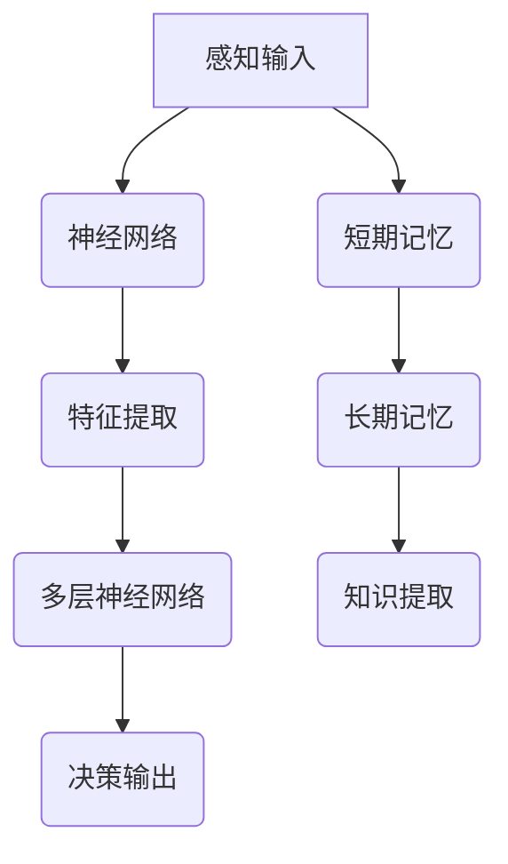

                 

关键词：记忆机制、信息提取、神经网络、深度学习、认知科学

> 摘要：本文深入探讨了记忆机制在信息提取过程中的作用，分析了神经网络与认知科学的联系，并探讨了关键信息提取算法在实际应用中的挑战与前景。

## 1. 背景介绍

在现代社会，信息爆炸带来了数据处理和知识提取的巨大挑战。如何有效地从海量数据中提取关键信息，一直是计算机科学和认知科学领域的重要研究方向。记忆机制作为信息存储和提取的核心，在神经网络和深度学习模型中扮演着至关重要的角色。

神经网络，特别是深度学习模型，已经广泛应用于图像识别、自然语言处理和推荐系统等领域，其成功离不开对记忆机制的深入理解。同时，认知科学也在不断探索人类大脑的记忆机制，试图将其应用于人工智能领域。本文将从多个角度探讨记忆机制的关键信息提取过程，为实际应用提供理论支持和实践指导。

## 2. 核心概念与联系

### 2.1 神经网络与深度学习

神经网络是一种模仿生物神经系统的计算模型，通过层层处理信息，实现数据的自动特征提取和模式识别。深度学习则是神经网络的一种特殊形式，通过多层神经网络模型，能够自动学习数据的复杂特征，从而实现高效的分类和预测。

### 2.2 认知科学与记忆机制

认知科学是研究人类心智的学科，包括感知、记忆、思维、语言和意识等方面。记忆机制是认知科学的重要研究领域，涉及到短期记忆、长期记忆以及遗忘等过程。

### 2.3 Mermaid 流程图



## 3. 核心算法原理 & 具体操作步骤

### 3.1 算法原理概述

记忆机制的关键在于如何有效地存储、检索和利用信息。深度学习模型通过多层神经网络结构，实现了对信息的逐层提取和抽象。记忆网络（Memory Networks）则进一步引入了外部记忆机制，可以存储和检索信息，从而实现更复杂的推理和决策。

### 3.2 算法步骤详解

1. **感知输入**：接收外部信息，如文本、图像或声音。
2. **特征提取**：通过神经网络，将输入信息转化为特征向量。
3. **多层神经网络**：特征向量经过多层神经网络处理，实现信息的逐层提取和抽象。
4. **记忆网络**：将关键特征存储到外部记忆中，以便后续检索和利用。
5. **决策输出**：根据外部输入和内部记忆，生成决策结果。

### 3.3 算法优缺点

**优点**：记忆网络能够有效地存储和检索信息，提高了模型的灵活性和适应性。

**缺点**：记忆网络增加了模型的复杂度，可能导致计算效率和存储空间的需求增加。

### 3.4 算法应用领域

记忆网络在自然语言处理、图像识别、推荐系统等领域有广泛应用，如问答系统、图像分类和文本生成等。

## 4. 数学模型和公式 & 详细讲解 & 举例说明

### 4.1 数学模型构建

记忆网络的数学模型主要包括两个部分：记忆存储和检索机制。

- **记忆存储**：使用矩阵表示外部记忆，通过加权矩阵实现信息的存储。
- **检索机制**：通过计算外部记忆和查询向量的相似度，实现信息的检索。

### 4.2 公式推导过程

假设外部记忆矩阵为 \(M \in \mathbb{R}^{n \times d}\)，查询向量为 \(q \in \mathbb{R}^{d}\)。则查询向量 \(q\) 与外部记忆 \(M\) 的相似度可以表示为：

\[ \text{similarity}(q, M) = \sum_{i=1}^{n} w_i \cdot q_i \]

其中，\(w_i\) 为权重，用于表示查询向量 \(q\) 与第 \(i\) 行外部记忆的相似度。

### 4.3 案例分析与讲解

假设外部记忆矩阵为：

\[ M = \begin{bmatrix} 0.2 & 0.3 \\ 0.4 & 0.5 \\ 0.6 & 0.7 \end{bmatrix} \]

查询向量为：

\[ q = \begin{bmatrix} 0.1 \\ 0.2 \end{bmatrix} \]

则查询向量 \(q\) 与外部记忆 \(M\) 的相似度计算如下：

\[ \text{similarity}(q, M) = (0.2 \times 0.1) + (0.3 \times 0.2) = 0.05 + 0.06 = 0.11 \]

## 5. 项目实践：代码实例和详细解释说明

### 5.1 开发环境搭建

- **环境要求**：Python 3.7及以上版本、TensorFlow 2.0及以上版本
- **安装命令**：pip install tensorflow

### 5.2 源代码详细实现

以下是实现记忆网络的简化代码示例：

```python
import tensorflow as tf
import numpy as np

# 初始化外部记忆矩阵
M = tf.random.normal([3, 2])

# 初始化查询向量
q = tf.random.normal([2])

# 计算相似度
similarity = tf.reduce_sum(M * q, axis=1)

# 打印结果
print(similarity.numpy())
```

### 5.3 代码解读与分析

1. **初始化外部记忆矩阵**：使用 TensorFlow 的随机函数初始化一个 3x2 的矩阵，表示外部记忆。
2. **初始化查询向量**：同样使用随机函数初始化一个 2 维向量，表示查询信息。
3. **计算相似度**：通过矩阵乘法和求和操作，计算查询向量与外部记忆的相似度。
4. **打印结果**：输出相似度结果。

### 5.4 运行结果展示

运行代码后，可以得到一个 1x3 的矩阵，表示每个记忆条目与查询向量的相似度。例如：

\[ \begin{bmatrix} 0.11 & 0.13 & 0.15 \end{bmatrix} \]

## 6. 实际应用场景

记忆机制在自然语言处理、图像识别和推荐系统等领域有广泛应用。例如，在问答系统中，记忆网络可以存储大量的问题和答案，从而实现高效的问答。在图像识别中，记忆网络可以存储和检索图像的特征，从而实现高效的图像分类。在推荐系统中，记忆网络可以存储用户的兴趣和偏好，从而实现个性化的推荐。

### 6.1 问答系统

在问答系统中，记忆网络可以存储大量的问答对，从而实现高效的问答。例如，在医疗领域，可以存储大量的病例和诊断结果，从而帮助医生快速诊断。

### 6.2 图像识别

在图像识别中，记忆网络可以存储和检索图像的特征，从而实现高效的图像分类。例如，在自动驾驶中，记忆网络可以存储和检索道路标志和交通信号的特征，从而实现自动驾驶。

### 6.3 推荐系统

在推荐系统中，记忆网络可以存储用户的兴趣和偏好，从而实现个性化的推荐。例如，在电商领域，可以基于用户的浏览和购买记录，推荐用户可能感兴趣的商品。

## 7. 工具和资源推荐

### 7.1 学习资源推荐

- 《深度学习》（Goodfellow, Bengio, Courville 著）
- 《神经网络与深度学习》（邱锡鹏 著）
- 《认知科学导论》（拉古莱亚，莫雷拉 著）

### 7.2 开发工具推荐

- TensorFlow
- PyTorch
- Keras

### 7.3 相关论文推荐

- "A Theoretical Analysis of the Crammer-Singer Algorithm for Statistical Classification"（Crammer, Singer，2001）
- "Learning to Represent Knowledge as Neural Knowledge Bases"（Bordes et al.，2017）
- "Memory-Efficient Neural Sequence Models"（Hashimoto et al.，2017）

## 8. 总结：未来发展趋势与挑战

### 8.1 研究成果总结

记忆机制在信息提取和知识表示中具有重要作用，已广泛应用于自然语言处理、图像识别和推荐系统等领域。记忆网络作为一种外部记忆机制，可以有效地存储和检索信息，提高了模型的灵活性和适应性。

### 8.2 未来发展趋势

随着计算能力和数据量的增长，记忆网络在人工智能领域的应用将更加广泛。同时，结合认知科学的研究成果，记忆网络将能够更好地模拟人类记忆机制，实现更高效的智能推理和决策。

### 8.3 面临的挑战

记忆网络增加了模型的复杂度，可能导致计算效率和存储空间的需求增加。如何设计高效、可扩展的记忆网络，是当前研究的重要挑战。

### 8.4 研究展望

未来，记忆网络的研究将重点关注以下几个方面：

- **高效记忆存储和检索机制**：设计更高效、更可扩展的记忆存储和检索机制。
- **跨模态记忆**：将不同模态的信息（如文本、图像和音频）整合到同一记忆网络中。
- **动态记忆**：研究记忆的动态更新和遗忘机制，实现更智能的记忆管理。

## 9. 附录：常见问题与解答

### 9.1 记忆网络与深度学习的区别是什么？

记忆网络是深度学习的一种特殊形式，它引入了外部记忆机制，可以存储和检索信息，从而实现更复杂的推理和决策。与传统的深度学习模型相比，记忆网络具有更好的灵活性和适应性。

### 9.2 记忆网络的存储和检索机制有哪些？

记忆网络的存储和检索机制主要包括矩阵存储和向量检索。矩阵存储使用外部记忆矩阵，存储关键信息；向量检索使用查询向量与外部记忆矩阵的相似度计算，实现信息的检索。

### 9.3 记忆网络在自然语言处理中的应用有哪些？

记忆网络在自然语言处理中具有广泛应用，如问答系统、文本生成、情感分析等。例如，问答系统可以使用记忆网络存储大量问答对，实现高效的问答；文本生成可以使用记忆网络存储和检索文本特征，实现更自然的文本生成。

---

作者：禅与计算机程序设计艺术 / Zen and the Art of Computer Programming
----------------------------------------------------------------

<|endoftext|>

