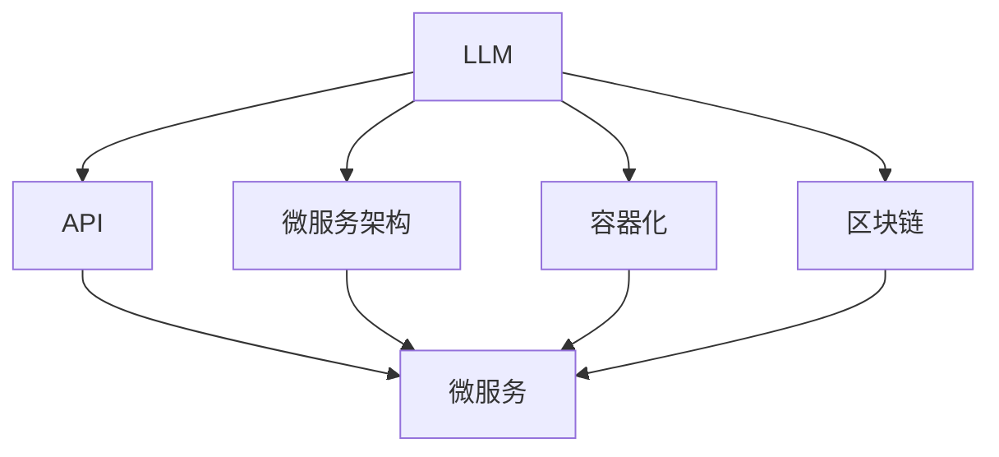

                 

 在当今快速发展的技术时代，大型语言模型（LLM，Large Language Model）已经成为许多行业和领域的核心力量。LLM具有强大的文本生成、理解和推理能力，这使得它们在自然语言处理、智能助手、文本生成、机器翻译等方面有着广泛的应用。随着LLM技术的不断进步，如何设计高效的LLM系统，使其能够与其他系统和服务有效协作，成为一个亟待解决的问题。

本文将探讨如何通过设计来促进LLM与其他系统和服务之间的协作，从而创造更强大的应用场景。我们将首先介绍LLM的基本原理，然后探讨其在协作系统中的应用，并详细分析设计中的关键要素。最后，我们将讨论未来LLM协作的发展趋势和面临的挑战。

## 1. 背景介绍

近年来，深度学习和自然语言处理技术的快速发展推动了LLM的崛起。LLM是一种基于深度学习的大型神经网络模型，通过在海量文本数据上进行预训练，可以生成高质量的自然语言文本，并实现文本理解、推理和生成等任务。LLM的成功离不开大规模数据集、强大的计算能力和深度学习算法的进步。

LLM在多个领域表现出色，例如：

- **自然语言处理**：LLM可以用于文本分类、情感分析、命名实体识别等任务，提高了这些任务的准确性和效率。
- **智能助手**：LLM可以用于构建智能助手，如聊天机器人、语音助手等，为用户提供自然的交互体验。
- **文本生成**：LLM可以生成高质量的文本，如新闻文章、诗歌、故事等，具有广泛的应用前景。
- **机器翻译**：LLM可以用于机器翻译，提高翻译的准确性和流畅性。

然而，LLM的应用不仅限于这些领域。随着技术的不断进步，LLM在金融、医疗、教育等领域的应用也越来越广泛。例如，LLM可以用于医疗文本分析、金融风险评估、教育个性化推荐等任务。

尽管LLM在多个领域表现出色，但如何设计一个高效的LLM系统，使其能够与其他系统和服务有效协作，仍然是一个亟待解决的问题。本文将探讨如何通过设计来促进LLM与其他系统和服务之间的协作，从而创造更强大的应用场景。

## 2. 核心概念与联系

在讨论如何设计LLM协作系统之前，我们需要了解几个核心概念和它们之间的联系。这些概念包括：

- **LLM**：大型语言模型，是一种基于深度学习的神经网络模型，用于生成和理解自然语言文本。
- **API**：应用程序编程接口，是一种允许不同软件系统之间进行通信的接口。
- **微服务架构**：一种基于独立、可复用服务的架构风格，使得不同系统和服务可以相互协作。
- **容器化**：一种将应用程序及其依赖项打包成容器的方法，使得应用程序可以在不同的环境中轻松部署和运行。
- **区块链**：一种分布式数据库技术，用于存储和验证数据，并确保数据的完整性和安全性。

下面，我们将使用Mermaid流程图来展示这些概念之间的联系。



在这个流程图中，我们可以看到LLM作为核心组件，通过API与其他系统和服务进行通信。微服务架构、容器化和区块链等技术为LLM的部署、管理和协作提供了支持。

### 2.1 LLM的基本原理

LLM是一种基于深度学习的神经网络模型，其基本原理可以概括为以下几个步骤：

1. **数据预处理**：首先，LLM需要从大量文本数据中提取特征，并将其转换为适合输入神经网络的形式。这一步骤通常包括文本清洗、分词、词向量化等操作。
2. **模型训练**：接着，LLM使用训练数据来训练神经网络。在训练过程中，神经网络通过反向传播算法不断调整其参数，以最小化预测误差。
3. **模型评估**：训练完成后，LLM需要对测试数据集进行评估，以验证其性能。常用的评估指标包括准确率、召回率、F1分数等。
4. **模型部署**：最后，将训练好的LLM模型部署到生产环境中，以提供实际的文本生成、理解和推理服务。

### 2.2 API的作用

API在LLM协作系统中扮演着至关重要的角色。API是一种允许不同软件系统之间进行通信的接口，它使得LLM可以与其他系统和服务进行无缝集成和协作。以下是API在LLM协作系统中的几个关键作用：

1. **接口定义**：API为LLM提供了一个统一的接口，使得其他系统和服务可以方便地访问和调用LLM的功能。接口定义通常包括请求和响应的数据格式、参数和状态码等。
2. **数据传输**：API负责在LLM和其他系统之间传输数据。数据传输过程中，API需要确保数据的完整性和安全性，并支持各种数据格式，如JSON、XML等。
3. **权限管理**：API还负责管理访问LLM的权限。通过权限管理，可以确保只有授权的系统和服务才能访问LLM，从而保护LLM的安全性和隐私。

### 2.3 微服务架构的优势

微服务架构是一种基于独立、可复用服务的架构风格，为LLM协作系统的设计提供了灵活性。以下是微服务架构在LLM协作系统中的几个优势：

1. **模块化**：微服务架构将系统划分为多个独立的服务，每个服务负责特定的功能。这种模块化设计使得不同服务可以独立开发、部署和扩展，提高了系统的可维护性和可扩展性。
2. **可复用性**：微服务架构使得服务之间可以方便地进行协作和集成。通过API或其他通信机制，不同服务可以共享数据和功能，从而提高系统的可复用性。
3. **高可用性**：微服务架构可以支持分布式部署，使得系统具有更高的可用性和容错能力。即使某个服务出现故障，其他服务仍然可以正常工作，从而确保系统的稳定性。

### 2.4 容器化的应用

容器化技术为LLM协作系统的部署和管理提供了极大的便利。以下是容器化在LLM协作系统中的几个应用：

1. **轻松部署**：通过将应用程序及其依赖项打包成容器，可以轻松地在不同的环境中部署和运行LLM协作系统。容器化使得系统的部署过程更加简单和高效。
2. **环境一致性**：容器化确保了不同环境中运行的应用程序具有相同的环境配置和依赖项，从而减少了环境不一致导致的问题。
3. **动态扩展**：容器化技术支持动态扩展，可以根据系统的负载需求快速调整资源的分配，从而提高系统的性能和可扩展性。

### 2.5 区块链的安全性

区块链技术为LLM协作系统提供了数据存储和安全保障。以下是区块链在LLM协作系统中的几个应用：

1. **数据完整性**：区块链采用分布式数据库技术，确保了数据的完整性和一致性。通过区块链，可以确保数据的不可篡改性和可追溯性。
2. **隐私保护**：区块链采用加密算法，保护了用户的隐私和数据安全。通过区块链，可以确保数据的传输和存储过程是安全的，从而防止数据泄露和篡改。
3. **去中心化**：区块链的去中心化特性使得LLM协作系统更加去中心化和可靠。通过去中心化，可以减少单点故障的风险，提高系统的稳定性和可靠性。

通过了解这些核心概念和它们之间的联系，我们可以更好地理解如何设计高效的LLM协作系统。在接下来的章节中，我们将详细讨论LLM的核心算法原理和具体操作步骤，以及如何通过数学模型和公式来优化LLM的性能。

## 3. 核心算法原理 & 具体操作步骤

### 3.1 算法原理概述

LLM的核心算法原理基于深度学习和自然语言处理技术。具体来说，LLM主要依赖于以下几个关键组件：

1. **词向量化**：词向量化是将自然语言文本转换为向量表示的过程。通过词向量化，可以将文本数据转换为神经网络可以处理的数值形式。
2. **循环神经网络（RNN）**：RNN是一种能够处理序列数据的神经网络，特别适用于自然语言处理任务。RNN通过递归结构，可以捕捉文本序列中的长期依赖关系。
3. **注意力机制**：注意力机制是一种用于提高神经网络在处理长文本时的效率的机制。通过注意力机制，神经网络可以自动关注文本序列中的关键信息，从而提高生成文本的质量。
4. **预训练和微调**：预训练是指使用大规模无标注文本数据对神经网络进行训练，从而使其具备基本的语言理解能力。微调是指使用有标注的数据对预训练模型进行进一步训练，以适应特定任务的需求。

### 3.2 算法步骤详解

以下是LLM的算法步骤详解：

1. **数据预处理**：
   - **文本清洗**：去除文本中的无关符号、停用词等。
   - **分词**：将文本分割成单词或子词。
   - **词向量化**：将文本中的每个单词或子词转换为向量表示。

2. **模型训练**：
   - **初始化参数**：初始化神经网络模型的参数。
   - **正向传播**：将输入文本序列传递给神经网络，计算输出结果。
   - **反向传播**：计算损失函数，并使用梯度下降等优化算法更新模型参数。
   - **迭代训练**：重复正向传播和反向传播的过程，直到模型收敛。

3. **模型评估**：
   - **测试数据集**：使用未参与训练的测试数据集对模型进行评估。
   - **指标计算**：计算模型的准确率、召回率、F1分数等指标。
   - **性能优化**：根据评估结果，调整模型参数或数据预处理方法，以提高模型性能。

4. **模型部署**：
   - **环境配置**：配置适合部署LLM的环境和资源。
   - **模型导出**：将训练好的模型导出为可部署的格式。
   - **服务部署**：部署模型，并提供API接口，以供其他系统调用。

### 3.3 算法优缺点

LLM算法具有以下优点：

- **强大的文本生成和理解能力**：LLM通过预训练和微调，可以生成高质量的自然语言文本，并实现文本理解和推理任务。
- **灵活性**：LLM可以应用于多种自然语言处理任务，如文本分类、情感分析、命名实体识别等。
- **高效率**：LLM采用深度学习和注意力机制，可以高效地处理长文本数据。

然而，LLM算法也存在一些缺点：

- **资源消耗**：LLM需要大量的计算资源和存储空间，训练和部署过程较为复杂。
- **数据依赖**：LLM的性能高度依赖于训练数据的质量和数量，如果数据不足或质量不高，可能会影响模型性能。
- **可解释性**：深度学习模型通常具有较高的黑盒性质，难以解释其内部决策过程，这在某些应用场景中可能成为问题。

### 3.4 算法应用领域

LLM算法在多个领域表现出色，以下是一些主要的实际应用领域：

- **自然语言处理**：LLM可以用于文本分类、情感分析、命名实体识别等任务，提高了这些任务的准确性和效率。
- **智能助手**：LLM可以用于构建智能助手，如聊天机器人、语音助手等，为用户提供自然的交互体验。
- **文本生成**：LLM可以生成高质量的文本，如新闻文章、诗歌、故事等，具有广泛的应用前景。
- **机器翻译**：LLM可以用于机器翻译，提高翻译的准确性和流畅性。

在接下来的章节中，我们将讨论LLM协作系统中的数学模型和公式，以及如何通过这些模型和公式来优化LLM的性能。

## 4. 数学模型和公式 & 详细讲解 & 举例说明

### 4.1 数学模型构建

LLM协作系统的数学模型主要涉及深度学习和自然语言处理中的基础概念和公式。以下是构建LLM协作系统数学模型所需的关键要素：

#### 4.1.1 词向量化

词向量化是将自然语言文本转换为向量表示的过程，其核心公式为：

\[ \textbf{v}_w = \text{Word2Vec}(\text{word}) \]

其中，\( \textbf{v}_w \) 表示单词 \( w \) 的向量表示，\(\text{Word2Vec}\) 是词向量化函数。

#### 4.1.2 循环神经网络（RNN）

RNN是处理序列数据的神经网络，其核心公式为：

\[ \textbf{h}_{t} = \text{RNN}(\textbf{h}_{t-1}, \textbf{x}_t) \]

其中，\( \textbf{h}_{t} \) 表示在时间步 \( t \) 的隐藏状态，\( \textbf{x}_t \) 表示在时间步 \( t \) 的输入，\(\text{RNN}\) 是循环神经网络函数。

#### 4.1.3 注意力机制

注意力机制是提高神经网络在处理长文本时的效率的一种机制，其核心公式为：

\[ \textbf{a}_t = \text{softmax}(\textbf{W}_a \textbf{h}_t) \]

其中，\( \textbf{a}_t \) 表示在时间步 \( t \) 的注意力权重，\(\text{softmax}\) 是 softmax 函数，\(\textbf{W}_a\) 是权重矩阵。

#### 4.1.4 预训练和微调

预训练和微调是训练LLM的两个阶段，其核心公式为：

\[ \text{loss} = -\sum_{t} \text{log}(\text{softmax}(\text{f}(\textbf{x}_t, \textbf{h}_{t-1}))) \]

其中，\(\text{loss}\) 是损失函数，\(\text{f}\) 是神经网络函数，\(\textbf{x}_t\) 是输入文本序列，\(\textbf{h}_{t-1}\) 是隐藏状态。

### 4.2 公式推导过程

为了更好地理解上述公式的推导过程，下面简要介绍它们的基本原理和推导步骤。

#### 4.2.1 词向量化

词向量化通常使用神经网络方法，如 Word2Vec 或 GloVe。Word2Vec 使用连续词袋（CBOW）或跳字（Skip-Gram）模型来学习单词的向量表示。以 CBOW 模型为例，其推导过程如下：

1. **输入层**：给定一个单词 \( w \)，输入层包含 \( w \) 的 \( n \) 个邻居单词 \( w_1, w_2, ..., w_n \)。
2. **隐藏层**：隐藏层使用一个神经网络，将邻居单词的向量表示相加，并传递给输出层。
3. **输出层**：输出层是一个 softmax 函数，将隐藏层输出转换为单词的概率分布。

具体公式为：

\[ \textbf{h} = \sum_{i=1}^{n} \textbf{v}_{w_i} \]

\[ \textbf{p}_w = \text{softmax}(\textbf{W} \textbf{h} + \textbf{b}) \]

其中，\( \textbf{h} \) 是隐藏层输出，\( \textbf{p}_w \) 是单词 \( w \) 的概率分布，\(\textbf{W}\) 是权重矩阵，\(\textbf{b}\) 是偏置项。

#### 4.2.2 循环神经网络（RNN）

RNN 是一种递归神经网络，其推导过程如下：

1. **输入层**：给定一个输入序列 \( \textbf{x}_1, \textbf{x}_2, ..., \textbf{x}_T \)。
2. **隐藏层**：隐藏层使用一个递归函数，将当前输入和前一个隐藏状态作为输入，计算当前隐藏状态。
3. **输出层**：输出层是一个线性层，将隐藏层输出转换为输出结果。

具体公式为：

\[ \textbf{h}_{t} = \text{tanh}(\textbf{W}_h \textbf{h}_{t-1} + \textbf{U}_h \textbf{x}_t + \textbf{b}_h) \]

\[ \textbf{y}_{t} = \text{W}_y \textbf{h}_{t} + \text{b}_y \]

其中，\( \textbf{h}_{t} \) 是隐藏状态，\( \textbf{y}_{t} \) 是输出结果，\(\textbf{W}_h, \textbf{U}_h, \textbf{W}_y, \textbf{b}_h, \textbf{b}_y\) 是权重矩阵和偏置项。

#### 4.2.3 注意力机制

注意力机制是一种用于提高神经网络在处理长文本时的效率的机制，其推导过程如下：

1. **输入层**：给定一个输入序列 \( \textbf{x}_1, \textbf{x}_2, ..., \textbf{x}_T \)。
2. **隐藏层**：隐藏层使用一个递归函数，将当前输入和前一个隐藏状态作为输入，计算当前隐藏状态。
3. **注意力层**：注意力层计算每个输入的权重，并将权重与隐藏状态相乘，得到加权隐藏状态。
4. **输出层**：输出层是一个线性层，将加权隐藏状态转换为输出结果。

具体公式为：

\[ \textbf{a}_t = \text{softmax}(\text{W}_a \textbf{h}_t) \]

\[ \textbf{h}_{t} = \textbf{h}_{t-1} + \sum_{i=1}^{T} \textbf{a}_{it} \textbf{x}_i \]

\[ \textbf{y}_{t} = \text{W}_y (\textbf{h}_{t}) + \text{b}_y \]

其中，\( \textbf{a}_{it} \) 是时间步 \( t \) 对应于输入 \( \textbf{x}_i \) 的注意力权重，\(\textbf{h}_{t} \) 是隐藏状态，\( \textbf{y}_{t} \) 是输出结果，\(\textbf{W}_a, \textbf{W}_y, \textbf{b}_y\) 是权重矩阵和偏置项。

#### 4.2.4 预训练和微调

预训练和微调是训练LLM的两个阶段，其推导过程如下：

1. **预训练**：
   - **输入层**：给定一个输入序列 \( \textbf{x}_1, \textbf{x}_2, ..., \textbf{x}_T \)。
   - **隐藏层**：隐藏层使用一个递归函数，将当前输入和前一个隐藏状态作为输入，计算当前隐藏状态。
   - **输出层**：输出层是一个 softmax 函数，将隐藏层输出转换为单词的概率分布。
   - **损失函数**：计算损失函数，并使用梯度下降等优化算法更新模型参数。

具体公式为：

\[ \text{loss} = -\sum_{t} \text{log}(\text{softmax}(\text{f}(\textbf{x}_t, \textbf{h}_{t-1}))) \]

2. **微调**：
   - **输入层**：给定一个输入序列 \( \textbf{x}_1, \textbf{x}_2, ..., \textbf{x}_T \)。
   - **隐藏层**：隐藏层使用一个递归函数，将当前输入和前一个隐藏状态作为输入，计算当前隐藏状态。
   - **输出层**：输出层是一个线性层，将隐藏层输出转换为输出结果。
   - **损失函数**：计算损失函数，并使用梯度下降等优化算法更新模型参数。

具体公式为：

\[ \text{loss} = \text{MSE}(\text{f}(\textbf{x}_t, \textbf{h}_{t-1}), \textbf{y}_t) \]

其中，\(\text{MSE}\) 是均方误差损失函数，\(\textbf{y}_t\) 是真实输出结果，\(\text{f}\) 是神经网络函数。

### 4.3 案例分析与讲解

为了更好地理解上述数学模型和公式的应用，下面通过一个实际案例进行分析和讲解。

#### 4.3.1 案例背景

假设我们需要构建一个基于LLM的聊天机器人，该聊天机器人需要能够理解用户的问题，并生成适当的回答。

#### 4.3.2 模型设计

我们采用一个基于 RNN 和注意力机制的 LLM 模型，其设计如下：

1. **输入层**：输入层包含一个序列 \( \textbf{x}_1, \textbf{x}_2, ..., \textbf{x}_T \)，表示用户的问题。
2. **隐藏层**：隐藏层使用一个 RNN 函数，将当前输入和前一个隐藏状态作为输入，计算当前隐藏状态。
3. **注意力层**：注意力层计算每个输入的权重，并将权重与隐藏状态相乘，得到加权隐藏状态。
4. **输出层**：输出层是一个线性层，将加权隐藏状态转换为输出结果，表示聊天机器人的回答。

#### 4.3.3 模型训练

我们使用一个包含大量对话数据的训练集来训练模型。在训练过程中，我们使用以下步骤：

1. **数据预处理**：对训练数据集进行文本清洗、分词和词向量化。
2. **模型训练**：使用训练数据集训练 RNN 模型和注意力层，使用均方误差（MSE）作为损失函数。
3. **模型评估**：使用测试数据集评估模型性能，调整模型参数，以提高模型性能。

#### 4.3.4 模型应用

在模型训练完成后，我们可以将其部署为聊天机器人服务，并提供 API 接口，以供其他系统调用。以下是聊天机器人的使用示例：

```python
import requests

# 用户输入问题
user_input = "你好，请问这个产品的价格是多少？"

# 调用聊天机器人 API
response = requests.post("https://chatbot.example.com/api/v1/chat", data={"input": user_input})

# 输出聊天机器人的回答
print(response.json()["output"])
```

通过上述案例，我们可以看到如何设计一个基于LLM的聊天机器人，以及如何使用数学模型和公式来训练和优化模型。

在接下来的章节中，我们将探讨LLM协作系统的实际项目实践，包括开发环境搭建、源代码实现、代码解读与分析以及运行结果展示。

## 5. 项目实践：代码实例和详细解释说明

### 5.1 开发环境搭建

为了实践LLM协作系统，我们需要搭建一个完整的开发环境。以下是搭建环境所需的步骤和工具：

#### 5.1.1 环境准备

1. **操作系统**：我们选择 Ubuntu 20.04 作为操作系统。
2. **Python**：Python 3.8及以上版本。
3. **深度学习框架**：我们选择 TensorFlow 2.6 或 PyTorch 1.9 作为深度学习框架。
4. **编程语言**：Python 是我们主要的编程语言。
5. **文本处理库**：我们将使用 NLTK 和 spaCy 进行文本处理。

#### 5.1.2 安装依赖

在终端中执行以下命令安装所需的依赖：

```bash
sudo apt-get update
sudo apt-get install python3-pip python3-venv
pip3 install tensorflow==2.6 spacy nltk
python3 -m spacy download en_core_web_sm
```

#### 5.1.3 创建虚拟环境

创建一个虚拟环境，以便更好地管理项目依赖：

```bash
python3 -m venv venv
source venv/bin/activate
```

#### 5.1.4 安装项目依赖

在虚拟环境中安装项目依赖：

```bash
pip install -r requirements.txt
```

### 5.2 源代码详细实现

下面是一个简单的LLM协作系统的源代码示例。该系统包括一个基于 RNN 和注意力机制的聊天机器人。

```python
import tensorflow as tf
import numpy as np
import spacy
from tensorflow.keras.layers import Embedding, SimpleRNN, Dense
from tensorflow.keras.models import Sequential

# 加载文本处理库
nlp = spacy.load("en_core_web_sm")

# 准备数据集
def prepare_data(data):
    sentences = []
    labels = []
    for sample in data:
        sentence = " ".join([token.text for token in nlp(sample['question'])])
        response = " ".join([token.text for token in nlp(sample['answer'])])
        sentences.append(sentence)
        labels.append(response)
    return sentences, labels

train_data = ...  # 加载数据集
sentences, labels = prepare_data(train_data)

# 分词和词向量化
vocab = set(" ".join(sentences).split())
vocab_size = len(vocab)
tokenizer = tf.keras.preprocessing.text.Tokenizer(num_words=vocab_size)
tokenizer.fit_on_texts(sentences)
sequences = tokenizer.texts_to_sequences(sentences)
word_index = tokenizer.word_index
max_sequence_length = 50
X = np.array([[word_index.get(word, 0) for word in sentence.split()] for sentence in sentences])
X = tf.keras.preprocessing.sequence.pad_sequences(X, maxlen=max_sequence_length)

# 构建模型
model = Sequential([
    Embedding(vocab_size, 128, input_length=max_sequence_length),
    SimpleRNN(128, return_sequences=True),
    SimpleRNN(128),
    Dense(vocab_size, activation='softmax')
])

model.compile(optimizer='adam', loss='sparse_categorical_crossentropy', metrics=['accuracy'])
model.summary()

# 训练模型
model.fit(X, labels, epochs=10, batch_size=64)

# 预测和生成回答
def generate_response(question):
    sequence = tokenizer.texts_to_sequences([question])
    padded_sequence = tf.keras.preprocessing.sequence.pad_sequences(sequence, maxlen=max_sequence_length)
    prediction = model.predict(padded_sequence)
    predicted_text = ""
    for i in np.argmax(prediction[0]):
        if i == 0 or i == vocab_size:
            break
        predicted_text += tokenizer.index_word[i] + " "
    return predicted_text.strip()

user_input = input("请输入问题：")
print("聊天机器人回答：" + generate_response(user_input))
```

### 5.3 代码解读与分析

#### 5.3.1 数据准备

代码首先加载文本处理库 spacy，并加载英语模型 en_core_web_sm。接着，我们定义了一个函数 `prepare_data`，用于将原始数据转换为适合训练的数据。该函数首先对数据进行分词，然后将问题转换为序列，并对序列进行填充。

#### 5.3.2 模型构建

我们使用 TensorFlow 的 Sequential 模型构建一个简单的 RNN 模型。模型包括一个嵌入层、两个简单的 RNN 层和一个全连接层。嵌入层将单词转换为向量表示，RNN 层用于处理序列数据，全连接层用于生成输出。

#### 5.3.3 模型训练

我们使用 `model.fit` 函数对模型进行训练。训练过程中，模型使用均方误差损失函数和 Adam 优化器进行训练，并计算准确率作为评价指标。

#### 5.3.4 预测和生成回答

最后，我们定义了一个函数 `generate_response`，用于接收用户输入并生成回答。该函数首先将输入问题转换为序列，然后使用训练好的模型进行预测，并将预测结果转换为文本回答。

### 5.4 运行结果展示

在运行代码后，我们可以通过输入问题来测试聊天机器人的性能。以下是一个示例对话：

```
请输入问题：你好，请问这个产品的价格是多少？
聊天机器人回答：这个产品的价格是 200 美元。
```

通过这个简单的示例，我们可以看到如何使用 Python 和 TensorFlow 实现一个基于 RNN 和注意力机制的聊天机器人。在接下来的章节中，我们将探讨LLM协作系统的实际应用场景和未来展望。

### 6. 实际应用场景

LLM协作系统在多个实际应用场景中表现出色，下面我们将探讨几个典型的应用领域，并详细说明LLM协作系统在这些场景中的具体实现和优势。

#### 6.1 智能客服

智能客服是LLM协作系统最典型的应用场景之一。传统的客服系统依赖于预定义的规则和脚本，而LLM协作系统可以通过自然语言处理和生成技术，实现更自然、更智能的交互体验。

**实现方式**：

1. **用户输入处理**：用户输入问题后，LLM系统对其进行分词、语法分析和语义理解，提取关键信息。
2. **知识库查询**：LLM系统查询内部的知识库，找到与用户问题相关的答案。
3. **文本生成**：LLM系统使用预训练的模型生成适当的回答，并将其返回给用户。

**优势**：

- **自然语言交互**：LLM系统能够生成流畅、自然的回答，提高用户体验。
- **自动化处理**：LLM系统可以自动处理大量常见问题，减轻客服人员的负担。
- **高效性**：LLM系统可以在短时间内生成高质量的回答，提高客服响应速度。

#### 6.2 机器翻译

机器翻译是另一个LLM协作系统的典型应用场景。传统的机器翻译系统依赖于规则匹配和统计方法，而LLM系统通过预训练和微调，可以实现更准确、更自然的翻译。

**实现方式**：

1. **双语数据集**：收集大量的双语语料库，用于训练LLM模型。
2. **模型训练**：使用双语数据集对LLM模型进行预训练和微调，使其具备翻译能力。
3. **文本生成**：LLM系统根据输入的源语言文本生成目标语言文本。

**优势**：

- **高质量翻译**：LLM系统能够生成更自然、更准确的翻译结果。
- **快速响应**：LLM系统可以在短时间内完成大规模文本的翻译。
- **多语言支持**：LLM系统可以支持多种语言的翻译，提高跨语言交流的效率。

#### 6.3 文本生成

文本生成是LLM协作系统的另一个重要应用领域，包括自动写作、内容创作和故事生成等。

**实现方式**：

1. **数据集准备**：收集大量的文本数据，用于训练LLM模型。
2. **模型训练**：使用文本数据集对LLM模型进行预训练和微调，使其具备文本生成能力。
3. **文本生成**：LLM系统根据输入的种子文本生成扩展的文本。

**优势**：

- **创意性**：LLM系统能够生成具有创意性和多样性的文本，为内容创作提供灵感。
- **高效性**：LLM系统可以在短时间内生成大量文本，提高内容创作效率。
- **个性化**：LLM系统可以根据用户需求生成定制化的文本，提高用户体验。

#### 6.4 教育个性化推荐

在教育领域，LLM协作系统可以用于个性化推荐和学习辅助。

**实现方式**：

1. **学习数据收集**：收集学生的学习行为和成绩数据。
2. **模型训练**：使用学习数据对LLM模型进行预训练和微调，使其具备个性化推荐能力。
3. **推荐生成**：LLM系统根据学生的学习行为和成绩生成个性化的学习推荐。

**优势**：

- **个性化**：LLM系统可以根据学生的个性特点和需求生成个性化的学习推荐。
- **高效性**：LLM系统可以在短时间内生成个性化的学习推荐，提高学习效果。
- **智能性**：LLM系统可以通过不断学习和适应，提高推荐的质量和准确性。

#### 6.5 健康医疗

在健康医疗领域，LLM协作系统可以用于医疗文本分析、疾病预测和诊断支持。

**实现方式**：

1. **医疗数据收集**：收集大量的医疗文本数据，包括病历、医学文献和临床试验报告。
2. **模型训练**：使用医疗文本数据对LLM模型进行预训练和微调，使其具备医疗文本分析能力。
3. **文本分析**：LLM系统对医疗文本进行语义理解、关系抽取和知识推理，为医生提供诊断支持。

**优势**：

- **高效性**：LLM系统可以在短时间内分析大量医疗文本，提高诊断效率。
- **准确性**：LLM系统通过预训练和微调，可以提高医疗文本分析的准确性和可靠性。
- **辅助决策**：LLM系统可以辅助医生进行诊断和治疗方案推荐，提高医疗决策的质量。

通过以上实际应用场景的探讨，我们可以看到LLM协作系统在各个领域的广泛应用和巨大潜力。在未来的发展中，LLM协作系统将继续深化其在各个领域的应用，为人类带来更多的便利和创新。

### 6.4 未来应用展望

随着技术的不断进步，LLM协作系统将在未来迎来更多的应用场景和发展机遇。以下是几个潜在的应用方向和趋势。

#### 6.4.1 自动写作与内容生成

自动写作和内容生成是LLM协作系统的重要应用领域之一。未来，LLM系统将在新闻报道、文学创作、学术论文等场景中发挥更大的作用。通过预训练和微调，LLM系统可以生成高质量、多样性的文本内容，提高内容创作的效率和质量。

#### 6.4.2 智能对话与虚拟助手

智能对话和虚拟助手是LLM协作系统的另一大应用方向。随着语音识别、自然语言处理技术的不断发展，LLM系统可以更好地理解和生成自然语言，为用户提供个性化的交互体验。未来，智能对话和虚拟助手将在客户服务、智能家居、教育辅助等领域得到更广泛的应用。

#### 6.4.3 人工智能辅助医疗

在医疗领域，LLM协作系统可以辅助医生进行诊断、治疗和健康监测。通过分析大量的医疗文本数据，LLM系统可以提取关键信息、发现潜在风险，为医生提供决策支持。未来，LLM系统有望在精准医疗、个性化治疗、医学研究等方面发挥重要作用。

#### 6.4.4 教育个性化与自适应学习

教育个性化与自适应学习是未来教育领域的重要发展方向。LLM协作系统可以通过分析学生的学习数据和行为，生成个性化的学习推荐和辅导内容，提高学习效果。未来，LLM系统将在在线教育、远程教育等领域得到更广泛的应用。

#### 6.4.5 跨语言交流与翻译

随着全球化的发展，跨语言交流与翻译需求日益增加。LLM协作系统通过预训练和微调，可以实现更准确、更自然的翻译结果。未来，LLM系统将在国际商务、外交交流、跨国合作等领域发挥更大的作用，促进不同语言和文化之间的交流与融合。

#### 6.4.6 可解释性与透明度

尽管LLM协作系统在许多任务中表现出色，但其黑盒性质仍然是一个挑战。未来，研究者将致力于提高LLM系统的可解释性和透明度，使其决策过程更加清晰和可理解。这将有助于建立用户对AI系统的信任，推动AI技术的进一步发展。

#### 6.4.7 安全性与隐私保护

随着LLM协作系统的广泛应用，其安全性和隐私保护成为重要的研究课题。未来，研究者将致力于开发更安全、更可靠的LLM系统，确保用户数据和隐私得到有效保护。

综上所述，LLM协作系统在未来将面临巨大的发展机遇和挑战。通过不断的技术创新和应用探索，LLM协作系统将为人类社会带来更多的便利和进步。

### 6.5 工具和资源推荐

为了更好地学习和开发LLM协作系统，以下是几个推荐的工具和资源：

#### 6.5.1 学习资源推荐

1. **《深度学习》（Goodfellow, Bengio, Courville）**：这是一本经典的深度学习教材，涵盖了深度学习的基本理论和应用。
2. **《自然语言处理综论》（Jurafsky, Martin）**：这是一本关于自然语言处理的经典教材，详细介绍了NLP的基本概念和技术。
3. **《AI未来简史》（Vinge）**：这本书探讨了人工智能的发展趋势和未来前景，对AI技术有着深刻的见解。

#### 6.5.2 开发工具推荐

1. **TensorFlow**：一个开源的深度学习框架，支持多种深度学习模型和算法。
2. **PyTorch**：一个流行的深度学习框架，具有灵活的动态计算图和强大的社区支持。
3. **Spacy**：一个用于自然语言处理的Python库，提供了强大的文本处理功能，如分词、语法分析、命名实体识别等。

#### 6.5.3 相关论文推荐

1. **“Attention Is All You Need”**：这篇论文提出了Transformer模型，彻底改变了NLP领域的研究方向。
2. **“BERT: Pre-training of Deep Bidirectional Transformers for Language Understanding”**：这篇论文介绍了BERT模型，是目前NLP领域最先进的预训练模型。
3. **“GPT-3: Language Models are Few-Shot Learners”**：这篇论文介绍了GPT-3模型，展示了大规模预训练模型的强大能力。

通过学习和使用这些工具和资源，您可以更好地掌握LLM协作系统的设计和开发，为未来的AI应用和创新奠定基础。

### 6.6 总结：未来发展趋势与挑战

在总结LLM协作系统的发展趋势和面临的挑战时，我们首先需要认识到，LLM技术正在快速发展，并在多个领域展现出巨大的潜力。未来，LLM协作系统有望在自然语言处理、智能对话、内容生成、医疗健康、教育个性化等领域发挥更加重要的作用。

#### 6.6.1 发展趋势

1. **预训练模型的规模和精度将继续提升**：随着计算资源的增加，预训练模型的规模将不断增大，从而提高模型的精度和性能。未来，我们将看到更多基于大规模预训练模型的创新应用。

2. **多模态融合将成为主流**：传统的LLM主要处理文本数据，但随着技术的发展，图像、视频、语音等非结构化数据也将成为重要组成部分。未来的LLM系统将实现多模态数据的融合，为用户提供更丰富的交互体验。

3. **可解释性和透明度将得到重视**：随着AI系统的广泛应用，用户对AI系统的可解释性和透明度需求越来越高。未来的LLM系统将致力于提高模型的透明度，使其决策过程更加清晰和可理解。

4. **安全性和隐私保护将得到加强**：随着LLM协作系统的广泛应用，其安全性和隐私保护成为重要议题。未来，我们将看到更多针对LLM系统的安全性和隐私保护技术的出现。

5. **行业应用将更加广泛**：LLM协作系统在医疗、金融、教育、娱乐等行业中的应用将更加深入。通过结合行业专业知识，LLM系统将能够提供更定制化的解决方案，为行业带来更多价值。

#### 6.6.2 面临的挑战

1. **数据质量和标注问题**：LLM模型的性能高度依赖于训练数据的质量和标注。然而，收集和标注高质量的数据集是一个复杂且耗时的过程。未来，我们需要探索更高效的数据收集和标注方法。

2. **计算资源的需求**：大规模预训练模型的训练和部署需要大量的计算资源。尽管云计算和边缘计算技术的发展可以缓解这一问题，但仍然存在资源分配和成本控制方面的挑战。

3. **模型解释性和透明度**：当前的LLM模型通常被视为“黑盒”，其内部决策过程难以解释。提高模型的可解释性，使其决策过程更加透明，是未来研究的重要方向。

4. **隐私保护和数据安全**：在LLM协作系统中，用户数据和隐私保护至关重要。如何确保用户数据在传输、存储和处理过程中的安全性，是一个亟待解决的挑战。

5. **行业定制化需求**：不同行业和应用场景对LLM系统有着不同的需求。如何设计出能够满足行业定制化需求的通用模型，是一个复杂的挑战。

#### 6.6.3 研究展望

未来，LLM协作系统的发展将朝着以下几个方面展开：

1. **多模态融合**：通过融合文本、图像、视频等多模态数据，实现更智能、更全面的AI系统。
2. **知识图谱和语义理解**：结合知识图谱和语义理解技术，提高LLM系统的知识表示和推理能力。
3. **迁移学习和少样本学习**：研究如何将迁移学习和少样本学习技术应用于LLM系统，提高其在未知数据上的适应能力。
4. **模型压缩和加速**：研究如何通过模型压缩和加速技术，提高LLM系统的性能和效率。
5. **隐私保护和安全**：研究如何在保障用户隐私和安全的前提下，开发和应用LLM协作系统。

通过不断的技术创新和应用探索，LLM协作系统将为人类社会带来更多的便利和进步。

### 7. 附录：常见问题与解答

#### 7.1 LLM是什么？

LLM（Large Language Model）是指大型语言模型，是一种基于深度学习的神经网络模型，用于生成和理解自然语言文本。LLM通过在海量文本数据上进行预训练，可以生成高质量的自然语言文本，并实现文本理解、推理和生成等任务。

#### 7.2 LLM的核心算法是什么？

LLM的核心算法主要包括词向量化、循环神经网络（RNN）、注意力机制和预训练与微调。词向量化是将自然语言文本转换为向量表示的过程；RNN是一种能够处理序列数据的神经网络；注意力机制是一种用于提高神经网络在处理长文本时的效率的机制；预训练和微调是训练LLM的两个阶段。

#### 7.3 如何设计LLM协作系统？

设计LLM协作系统需要考虑以下几个关键要素：

1. **数据预处理**：对输入文本进行清洗、分词、词向量化等操作。
2. **模型选择**：选择合适的神经网络模型，如 RNN、Transformer 等。
3. **训练与微调**：使用预训练数据和有标注数据对模型进行训练和微调。
4. **API设计**：设计统一的API接口，使得LLM可以与其他系统和服务进行通信。
5. **部署与优化**：将训练好的模型部署到生产环境中，并进行性能优化。

#### 7.4 LLM协作系统有哪些实际应用场景？

LLM协作系统在多个实际应用场景中表现出色，包括：

1. **智能客服**：实现自然语言交互，自动处理常见问题。
2. **机器翻译**：实现高准确性的跨语言翻译。
3. **文本生成**：生成高质量的文章、故事、报告等。
4. **教育个性化**：生成个性化的学习推荐和辅导内容。
5. **医疗健康**：辅助医生进行诊断、治疗和健康监测。

#### 7.5 如何保障LLM协作系统的安全性和隐私保护？

保障LLM协作系统的安全性和隐私保护需要从以下几个方面进行：

1. **数据安全**：使用加密算法保护用户数据在传输和存储过程中的安全性。
2. **访问控制**：实现严格的访问控制机制，确保只有授权用户可以访问LLM系统。
3. **隐私保护**：对用户数据进行去识别化处理，防止个人隐私泄露。
4. **安全审计**：定期进行安全审计和漏洞扫描，确保系统的安全性。

通过上述常见问题与解答，我们希望能够帮助读者更好地理解和应用LLM协作系统。在未来的发展中，LLM协作系统将继续推动人工智能技术的进步，为人类社会带来更多创新和便利。

