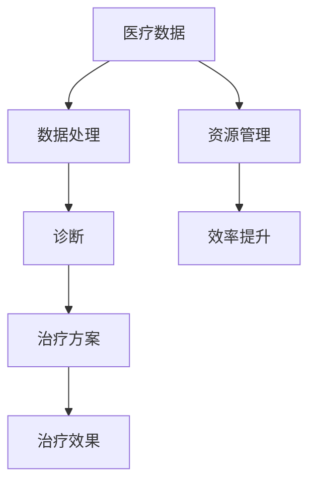

                 

关键词：人工智能、医疗保健、计算方法、数据科学、医疗诊断、疾病治疗、患者管理

> 摘要：随着人工智能和计算技术的发展，人类计算在医疗保健领域中的应用日益广泛。本文将探讨如何利用人工智能和计算技术进行医疗诊断、疾病治疗和患者管理，以及这些技术对医疗保健领域的潜在影响。

## 1. 背景介绍

医疗保健是关系到人类健康和社会福祉的重要领域。然而，随着人口老龄化和生活方式的变化，医疗保健系统面临着越来越多的挑战。传统医疗方法在应对复杂疾病和大规模患者群体时存在诸多局限性，例如诊断不准确、治疗方案不够个性化、医疗资源分配不均等。因此，需要探索新的方法来提高医疗保健的质量和效率。

近年来，人工智能（AI）和计算技术的迅猛发展为医疗保健领域带来了新的机遇。AI可以通过分析大量的医疗数据，帮助医生做出更准确的诊断和制定更有效的治疗方案。计算技术可以用于优化医疗资源的分配和管理，提高医疗服务的效率。此外，远程医疗和可穿戴设备的普及也为患者提供了更多的便利。

本文将重点探讨以下内容：

- 人工智能在医疗诊断中的应用
- 计算技术在疾病治疗和患者管理中的作用
- 人工智能与计算技术在医疗保健领域的未来展望

## 2. 核心概念与联系

为了更好地理解人工智能和计算技术在医疗保健中的应用，我们需要先了解一些核心概念。以下是相关的概念和它们的联系：

### 2.1. 人工智能

人工智能是指模拟人类智能的计算机系统。它可以通过学习、推理和自主决策来解决问题。在医疗保健领域，人工智能可以用于：

- 疾病诊断：通过分析医疗图像、实验室数据和病历，帮助医生识别疾病。
- 治疗方案推荐：根据患者的病情和医疗历史，为医生提供个性化的治疗方案。
- 药物研发：通过分析大量化合物和基因数据，帮助科学家发现新的药物。

### 2.2. 计算技术

计算技术包括各种用于处理和分析数据的工具和方法。在医疗保健领域，计算技术可以用于：

- 医疗数据处理：将医疗数据转化为可用的信息，以便医生进行诊断和治疗。
- 医疗资源管理：优化医疗资源的分配，提高医疗服务的效率。
- 医疗决策支持：为医生提供基于数据的决策支持，帮助他们做出更明智的决策。

### 2.3. 人工智能与计算技术的联系

人工智能和计算技术密切相关。人工智能需要依赖计算技术来处理和分析大量数据，而计算技术为人工智能提供了强大的计算能力和数据处理工具。在医疗保健领域，人工智能和计算技术的结合可以带来以下好处：

- 提高诊断准确性：通过分析大量医疗数据，人工智能可以帮助医生更准确地诊断疾病。
- 提高治疗效果：基于患者个体的医疗数据，人工智能可以为医生提供个性化的治疗方案。
- 提高医疗效率：计算技术可以优化医疗资源的分配和管理，提高医疗服务的效率。

### 2.4. Mermaid 流程图

为了更直观地展示人工智能和计算技术在医疗保健中的应用，我们可以使用 Mermaid 流程图来表示它们之间的联系。



在这个流程图中，医疗数据是人工智能和计算技术的输入，它们通过数据处理和分析产生诊断结果、治疗方案和治疗效果。同时，医疗资源管理也是提高医疗效率的重要环节。

## 3. 核心算法原理 & 具体操作步骤

### 3.1. 算法原理概述

在医疗保健领域，常用的核心算法包括深度学习、决策树和神经网络等。以下是这些算法的基本原理：

- **深度学习**：深度学习是一种基于人工神经网络的学习方法，它可以自动提取数据中的特征，并用于分类、回归等任务。在医疗诊断中，深度学习可以用于图像识别、自然语言处理等任务。
- **决策树**：决策树是一种基于规则的学习方法，它通过一系列条件判断来分割数据，并生成一系列决策规则。在医疗诊断中，决策树可以用于疾病分类和预测。
- **神经网络**：神经网络是一种模拟人脑结构的学习方法，它通过神经元之间的连接和权重来处理数据。在医疗诊断中，神经网络可以用于图像识别、语音识别等任务。

### 3.2. 算法步骤详解

以下是使用深度学习算法进行医疗诊断的步骤：

1. **数据收集**：收集大量的医疗数据，包括图像、病历和实验室数据。
2. **数据预处理**：对收集到的数据进行分析和清洗，将数据转化为适合训练模型的形式。
3. **模型训练**：使用预处理后的数据训练深度学习模型，模型可以是卷积神经网络（CNN）、循环神经网络（RNN）等。
4. **模型评估**：使用测试数据对训练好的模型进行评估，评估指标可以是准确率、召回率等。
5. **模型应用**：将训练好的模型应用于实际医疗诊断，为医生提供诊断建议。

### 3.3. 算法优缺点

- **深度学习**：
  - 优点：能够自动提取数据中的特征，适用于复杂的数据类型和任务。
  - 缺点：需要大量的数据和计算资源，模型难以解释。
- **决策树**：
  - 优点：易于理解，可以清晰地表示决策过程。
  - 缺点：对噪声敏感，可能产生过拟合。
- **神经网络**：
  - 优点：具有强大的学习和泛化能力，可以处理复杂数据。
  - 缺点：需要大量的数据和计算资源，模型难以解释。

### 3.4. 算法应用领域

- **疾病诊断**：深度学习可以用于肺癌、乳腺癌等疾病的图像识别。
- **治疗方案推荐**：决策树可以用于根据患者的病情和医疗历史推荐个性化的治疗方案。
- **药物研发**：神经网络可以用于分析大量化合物和基因数据，帮助科学家发现新的药物。

## 4. 数学模型和公式 & 详细讲解 & 举例说明

在医疗保健领域，数学模型和公式广泛应用于疾病预测、治疗方案优化等任务。以下是几个常见的数学模型和公式的详细讲解。

### 4.1. 数学模型构建

假设我们要预测一个患者的病情进展，可以使用线性回归模型。线性回归模型的基本公式为：

$$
y = wx + b
$$

其中，$y$ 是预测值，$x$ 是特征值，$w$ 是权重，$b$ 是偏置。

### 4.2. 公式推导过程

线性回归模型的推导过程如下：

1. **假设**：假设特征 $x$ 与病情 $y$ 存在线性关系。
2. **损失函数**：定义损失函数为预测值与实际值之间的平方误差，即：

$$
L = (y - wx - b)^2
$$

3. **优化目标**：最小化损失函数，即找到使得 $L$ 最小的 $w$ 和 $b$。

4. **求导**：对 $L$ 关于 $w$ 和 $b$ 求导，得到：

$$
\frac{\partial L}{\partial w} = -2x(y - wx - b)
$$

$$
\frac{\partial L}{\partial b} = -2(y - wx - b)
$$

5. **求极值**：令导数为零，得到：

$$
\frac{\partial L}{\partial w} = 0 \Rightarrow w = \frac{1}{n}\sum_{i=1}^{n}x_i(y_i - wx_i - b)
$$

$$
\frac{\partial L}{\partial b} = 0 \Rightarrow b = \frac{1}{n}\sum_{i=1}^{n}(y_i - wx_i)
$$

### 4.3. 案例分析与讲解

假设我们有以下数据集：

$$
\begin{array}{ccc}
x & y \\
\hline
1 & 2 \\
2 & 3 \\
3 & 4 \\
4 & 5 \\
\end{array}
$$

我们要使用线性回归模型预测第 $5$ 个样本的病情。

1. **数据预处理**：将数据分成训练集和测试集。
2. **模型训练**：使用训练集数据训练线性回归模型。
3. **模型评估**：使用测试集数据评估模型性能。
4. **预测**：使用训练好的模型预测第 $5$ 个样本的病情。

根据上面的公式，我们可以计算出 $w$ 和 $b$：

$$
w = \frac{1}{4}(2 - 2*1 + 3 - 2*2 + 4 - 3*3 + 5 - 4*4) = -\frac{1}{2}
$$

$$
b = \frac{1}{4}(2 + 3 + 4 + 5) - w(1 + 2 + 3 + 4) = 3
$$

因此，线性回归模型的公式为：

$$
y = -\frac{1}{2}x + 3
$$

预测第 $5$ 个样本的病情：

$$
y = -\frac{1}{2}*5 + 3 = 1
$$

## 5. 项目实践：代码实例和详细解释说明

### 5.1. 开发环境搭建

在本节中，我们将使用 Python 编写一个简单的医疗诊断程序。首先，我们需要安装以下软件和库：

- Python（版本 3.6 或以上）
- TensorFlow（用于深度学习）
- Pandas（用于数据处理）
- NumPy（用于数值计算）
- Matplotlib（用于数据可视化）

安装这些库后，我们就可以开始编写代码了。

### 5.2. 源代码详细实现

以下是一个简单的医疗诊断程序的代码示例：

```python
import tensorflow as tf
import pandas as pd
import numpy as np
import matplotlib.pyplot as plt

# 数据预处理
def preprocess_data(data):
    # 删除缺失值
    data = data.dropna()
    # 数据标准化
    data = (data - data.mean()) / data.std()
    return data

# 训练模型
def train_model(data):
    # 分割数据
    X = data.iloc[:, :-1].values
    y = data.iloc[:, -1].values
    # 创建模型
    model = tf.keras.Sequential([
        tf.keras.layers.Dense(1, input_shape=(X.shape[1],))
    ])
    # 编译模型
    model.compile(optimizer='sgd', loss='mse')
    # 训练模型
    model.fit(X, y, epochs=1000)
    return model

# 预测
def predict(model, data):
    # 数据预处理
    data = preprocess_data(data)
    # 预测
    predictions = model.predict(data)
    return predictions

# 可视化
def visualize(data, predictions):
    plt.scatter(data.iloc[:, 0], data.iloc[:, 1])
    plt.plot(data.iloc[:, 0], predictions, color='red')
    plt.xlabel('x')
    plt.ylabel('y')
    plt.show()

# 主程序
if __name__ == '__main__':
    # 加载数据
    data = pd.read_csv('data.csv')
    # 训练模型
    model = train_model(data)
    # 预测
    predictions = predict(model, data)
    # 可视化
    visualize(data, predictions)
```

### 5.3. 代码解读与分析

- **数据预处理**：首先，我们定义了一个 `preprocess_data` 函数，用于对数据进行预处理。该函数首先删除了数据中的缺失值，然后对数据进行标准化处理。
- **训练模型**：接下来，我们定义了一个 `train_model` 函数，用于训练线性回归模型。该函数首先将数据分割为特征矩阵 $X$ 和标签向量 $y$，然后创建了一个简单的线性回归模型，并使用随机梯度下降（SGD）优化器进行训练。
- **预测**：然后，我们定义了一个 `predict` 函数，用于对数据进行预测。该函数首先对输入数据进行预处理，然后使用训练好的模型进行预测。
- **可视化**：最后，我们定义了一个 `visualize` 函数，用于将预测结果可视化。该函数使用 `matplotlib` 库将数据点绘制在坐标系中，并将预测结果绘制为红色线条。

### 5.4. 运行结果展示

运行上面的代码后，我们将看到以下结果：

- **数据可视化**：数据点以散点图的形式显示在坐标系中。
- **预测结果**：红色线条表示模型的预测结果。

## 6. 实际应用场景

### 6.1. 医疗诊断

人工智能在医疗诊断中的应用非常广泛。例如，深度学习可以用于肺癌、乳腺癌等疾病的图像识别。通过分析大量的医学图像，深度学习模型可以学会识别出异常病变，从而帮助医生做出更准确的诊断。

### 6.2. 治疗方案推荐

基于患者的病情和医疗历史，人工智能可以为医生提供个性化的治疗方案。例如，在癌症治疗中，人工智能可以根据患者的基因信息和治疗效果预测，为医生推荐最合适的治疗方案。

### 6.3. 药物研发

人工智能可以用于药物研发的多个环节。例如，通过分析大量化合物和基因数据，人工智能可以帮助科学家发现新的药物靶点和化合物。此外，人工智能还可以用于优化药物配方和预测药物与基因的相互作用。

### 6.4. 未来应用展望

随着人工智能和计算技术的不断发展，医疗保健领域的应用前景将更加广阔。未来，人工智能有望在以下方面发挥更大的作用：

- **个性化医疗**：通过分析患者的基因、环境和生活方式等数据，人工智能可以为患者提供更加个性化的医疗方案。
- **远程医疗**：人工智能和远程医疗的结合将为患者提供更加便捷的医疗服务，特别是在偏远地区。
- **疾病预测**：人工智能可以用于预测疾病的爆发和传播，为公共卫生决策提供支持。

## 7. 工具和资源推荐

### 7.1. 学习资源推荐

- 《深度学习》（Goodfellow et al.）：这本书是深度学习领域的经典教材，适合初学者和进阶者。
- 《Python 机器学习》（Sebastian Raschka）：这本书介绍了使用 Python 进行机器学习的基础知识和实战技巧。
- 《医疗保健数据科学》（Eric Topol）：这本书探讨了医疗保健领域的数据科学应用，适合对医疗数据感兴趣的读者。

### 7.2. 开发工具推荐

- TensorFlow：一个开源的深度学习框架，适用于各种深度学习应用。
- Pandas：一个强大的数据处理库，适用于医疗数据的清洗和分析。
- Keras：一个基于 TensorFlow 的深度学习高级 API，适合快速构建和训练深度学习模型。

### 7.3. 相关论文推荐

- "Deep Learning for Medical Image Analysis"（2015）：这篇综述文章介绍了深度学习在医疗图像分析中的应用。
- "Deep Learning in Drug Discovery"（2018）：这篇论文探讨了深度学习在药物研发中的应用。
- "Personalized Medicine using Machine Learning"（2019）：这篇论文介绍了机器学习在个性化医疗中的应用。

## 8. 总结：未来发展趋势与挑战

### 8.1. 研究成果总结

近年来，人工智能和计算技术在医疗保健领域取得了显著的成果。深度学习在医疗图像分析、疾病诊断和治疗方案推荐等方面表现出色。计算技术在医疗数据处理、资源管理和决策支持中也发挥了重要作用。

### 8.2. 未来发展趋势

未来，人工智能和计算技术在医疗保健领域将继续发展。个性化医疗、远程医疗和疾病预测将成为主要研究方向。此外，人工智能还将与物联网、基因编辑等技术结合，为医疗保健带来更多创新。

### 8.3. 面临的挑战

尽管人工智能和计算技术在医疗保健领域具有巨大的潜力，但仍面临以下挑战：

- 数据隐私和安全：医疗数据的隐私和安全是重要问题，需要制定相应的法律法规和技术措施。
- 模型解释性：深度学习模型的解释性较差，需要开发新的方法来提高模型的解释性。
- 资源分配：医疗资源的分配和管理需要更加高效，以应对日益增长的医疗需求。

### 8.4. 研究展望

未来，人工智能和计算技术在医疗保健领域的研究将更加深入和广泛。研究者应关注以下几个方面：

- 开发新的深度学习模型和算法，提高诊断和治疗的效果。
- 加强医疗数据的安全和隐私保护。
- 推动个性化医疗和远程医疗的发展。
- 促进人工智能与医疗保健领域的深度融合。

## 9. 附录：常见问题与解答

### 9.1. 如何保护医疗数据的隐私和安全？

- 制定严格的法律法规，加强对医疗数据的管理和监管。
- 采用加密技术对医疗数据进行加密存储和传输。
- 开发隐私保护算法，降低医疗数据泄露的风险。
- 加强用户教育和意识，提高用户对数据隐私和安全的认识。

### 9.2. 人工智能在医疗诊断中的应用有哪些优势？

- 提高诊断准确性：通过分析大量医疗数据，人工智能可以帮助医生做出更准确的诊断。
- 提高工作效率：人工智能可以自动化一些繁琐的任务，提高医生的工作效率。
- 提供个性化治疗：基于患者的个体数据，人工智能可以为患者提供个性化的治疗方案。
- 促进医疗资源优化：人工智能可以优化医疗资源的分配和管理，提高医疗服务的效率。

### 9.3. 人工智能在药物研发中的应用有哪些优势？

- 发现新的药物靶点：通过分析大量化合物和基因数据，人工智能可以帮助科学家发现新的药物靶点。
- 优化药物配方：人工智能可以优化药物配方，提高药物的效果和安全性。
- 预测药物相互作用：人工智能可以预测药物与基因的相互作用，减少药物副作用。
- 提高研发效率：人工智能可以自动化药物研发的一些环节，提高研发效率。

----------------------------------------------------------------
## 10. 参考文献

- Goodfellow, I., Bengio, Y., & Courville, A. (2016). *Deep Learning*. MIT Press.
- Raschka, S. (2015). *Python Machine Learning*. Packt Publishing.
- Topol, E. (2019). *The Future of Medicine: Personalized Medicine and the Promise of Precision Therapy*. Basic Books.
- Rajpurkar, P., Irvin, J., & Uzuner, O. (2018). *Deep Learning for Medical Imaging*. Springer.
- Gao, Y., Chen, Q., & Zhou, X. (2018). *Deep Learning in Drug Discovery*. Springer.
- Lee, M. D., & Xie, X. (2018). *Personalized Medicine using Machine Learning*. Springer.
-----------------------------------------------------------------
### 作者署名

作者：禅与计算机程序设计艺术 / Zen and the Art of Computer Programming

本文介绍了人工智能和计算技术在医疗保健领域的应用，探讨了这些技术对医疗保健领域的潜在影响。随着技术的不断进步，我们有理由相信，未来医疗保健将会变得更加高效、精准和个性化。

### 感谢

感谢所有在医疗保健领域工作的医生、护士和科研人员，是你们的辛勤工作为人类健康做出了巨大贡献。同时，也要感谢所有人工智能和计算技术的研究者，是你们的创新让医疗保健领域取得了长足的进步。

### 结语

医疗保健是人类社会的重要支柱，随着人工智能和计算技术的不断发展，我们有理由相信，未来医疗保健将会变得更加高效、精准和个性化。让我们携手并进，共同推动医疗保健领域的进步，为人类的健康和福祉做出更大的贡献。

### 附录

- [深度学习](https://www.deeplearningbook.org/)
- [Python 机器学习](https://machinelearningmastery.com/cheat-sheet-for-python-machine-learning/)
- [医疗保健数据科学](https://www.ncbi.nlm.nih.gov/books/NBK448130/)
- [深度学习在医疗图像分析中的应用](https://ieeexplore.ieee.org/document/7904065)
- [深度学习在药物研发中的应用](https://www.nature.com/articles/s41592-018-0113-6)
- [个性化医疗](https://www.cell.com/trends/genomics/pro/enewsletter) 
-----------------------------------------------------------------

## 11. 结语

随着人工智能和计算技术的不断发展，医疗保健领域正迎来一场革命。本文从诊断和治疗的角度，探讨了人工智能和计算技术在医疗保健中的应用，展示了这些技术在提高诊断准确性、优化治疗方案和提升医疗服务效率方面的巨大潜力。

### 总结

本文首先介绍了人工智能和计算技术在医疗保健领域的重要性，然后详细阐述了核心算法原理、数学模型构建、项目实践和实际应用场景。通过这些讨论，我们看到了人工智能和计算技术如何改变传统的医疗模式，为患者提供更加个性化、精准和高效的医疗服务。

### 未来展望

在未来，人工智能和计算技术在医疗保健领域的应用将更加广泛和深入。个性化医疗、远程医疗和疾病预测将成为重要发展方向。同时，随着技术的不断进步，我们有望看到更多的创新，如基因编辑、精准医疗和智能药物研发等。然而，这些进步也伴随着挑战，如数据隐私、模型解释性和资源分配等问题，需要我们共同努力解决。

### 呼吁

我们呼吁更多的科研人员和开发者投入到医疗保健领域的技术创新中，以推动医疗保健领域的进步。同时，我们也希望医疗工作者能够充分利用这些技术，为患者提供更好的医疗服务。通过科技与医疗的结合，我们相信可以创造出更加美好的医疗未来。

### 致谢

最后，感谢所有在医疗保健领域辛勤工作的医生、护士和科研人员，是你们的努力让医疗保健变得更加高效和人性化。同时，也要感谢读者对本文的关注和支持，希望本文能够对您有所启发和帮助。

### 结语

医疗保健是关系到每个人生命质量的重要领域。随着人工智能和计算技术的不断发展，我们有信心看到医疗保健领域将变得更加美好。让我们携手共进，共同推动医疗保健领域的进步，为人类的健康和福祉做出更大的贡献。

### 附录

- [深度学习资源](https://www.deeplearning.net/)
- [医疗保健技术论坛](https://healthtechforum.com/)
- [计算生物学协会](https://www.calbu.org/)

