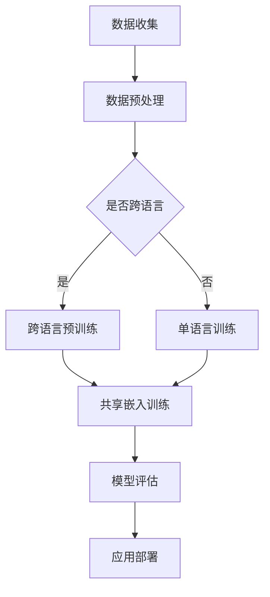

                 

### 1. 背景介绍

在当今全球化的世界中，语言多样性已经成为人类社会的一个重要特征。不同国家和地区的人们使用着多种不同的语言进行沟通、交流和学习。然而，传统的语言处理技术往往面临着多语言支持的挑战。为了克服这一难题，近年来，深度学习特别是大型语言模型（LLM，Large Language Model）的发展为我们提供了一种全新的解决方案。

大型语言模型，如GPT-3、BERT等，通过学习海量的文本数据，能够生成符合语法和语义规则的文本，并在各种语言任务中表现出色。然而，这些模型最初主要针对英语和其他少数主要语言进行训练，对于其他众多小语种的支持则相对有限。这种语言不平等的现象不仅限制了语言技术的普及和应用，也妨碍了全球范围内的知识传播和交流。

### 2. 核心概念与联系

#### 2.1 语言模型基本原理

语言模型是一种概率模型，它用于预测下一个单词或字符的概率。在传统的NLP（自然语言处理）中，常用的模型包括n-gram模型、隐马尔可夫模型（HMM）和基于统计的模型等。然而，随着深度学习的兴起，基于神经网络的模型如循环神经网络（RNN）、长短时记忆网络（LSTM）和变换器（Transformer）等逐渐成为主流。

特别是Transformer模型，由于其并行计算能力和强大的上下文捕捉能力，使得语言模型的训练效率得到了极大的提升。BERT（Bidirectional Encoder Representations from Transformers）模型更是将Transformer引入了预训练任务，为下游任务提供了强大的语言表示。

#### 2.2 多语言模型训练

为了支持多语言应用，我们需要训练能够处理多种语言的语言模型。多语言模型的训练主要有以下几种方法：

1. **单语言模型**：对每种语言分别训练一个模型，然后将这些模型组合起来。这种方法虽然简单，但会导致模型之间缺乏共享的信息，降低整体性能。

2. **共享嵌入**：将所有语言的嵌入层共享，但分别训练其他层的参数。这种方法能够在一定程度上提高跨语言性能，但仍然面临不同语言之间的差异。

3. **跨语言预训练**：使用跨语言语料库进行预训练，使模型能够在多种语言之间共享知识。BERT和mBERT（Multilingual BERT）就是基于这种思想进行设计的。

4. **多语言端对端训练**：直接对多语言数据集进行端对端训练，使模型能够同时学习多种语言的表示。这种方法在性能上通常更优，但计算资源要求较高。

#### 2.3 Mermaid 流程图

下面是一个简单的Mermaid流程图，展示了多语言模型训练的基本流程：



### 3. 核心算法原理 & 具体操作步骤

#### 3.1 算法原理概述

多语言模型的训练核心在于如何有效地利用跨语言信息，使模型能够在多种语言之间共享知识。以下是一些常见的多语言模型训练算法：

1. **跨语言BERT（mBERT）**：mBERT在预训练阶段使用了多种语言的语料库，并在每个层使用交叉语言注意力机制，使模型能够在不同语言之间进行信息交换。

2. **XLM（Cross-lingual Language Model）**：XLM模型通过将语言嵌入空间映射到一个共同的低维空间，使不同语言的嵌入向量能够相互接近，从而实现跨语言理解。

3. **XLM-R（XLM with Rotations）**：XLM-R在XLM的基础上引入了旋转操作，进一步提高了模型的跨语言性能。

#### 3.2 算法步骤详解

1. **数据收集**：收集多种语言的语料库，包括文本数据、标签等。

2. **数据预处理**：对数据进行清洗、分词、编码等处理，使其适合模型训练。

3. **共享嵌入训练**：初始化所有语言的嵌入层参数，并在训练过程中进行更新。

4. **跨语言预训练**：使用跨语言语料库进行预训练，包括掩码语言模型（Masked Language Model，MLM）和下一句预测（Next Sentence Prediction，NSP）等任务。

5. **模型微调**：在特定任务上对模型进行微调，以适应特定领域的需求。

6. **模型评估**：使用测试集对模型进行评估，包括准确率、召回率、F1值等指标。

7. **应用部署**：将训练好的模型部署到实际应用中，如机器翻译、文本分类、问答系统等。

#### 3.3 算法优缺点

**优点**：

- **跨语言性能提升**：通过跨语言预训练，模型能够在多种语言之间共享知识，提高跨语言任务的性能。
- **通用性**：多语言模型可以适应多种语言环境，具有更广泛的通用性。
- **资源利用**：利用多种语言的语料库，可以提高模型的训练效率。

**缺点**：

- **计算资源需求高**：多语言模型的训练需要大量的计算资源，尤其是在端对端训练时。
- **数据质量影响**：数据质量直接影响模型的性能，多语言数据集的质量难以保证。

#### 3.4 算法应用领域

多语言模型在以下领域有广泛的应用：

- **机器翻译**：如Google翻译、百度翻译等，通过多语言模型实现高效、准确的机器翻译。
- **文本分类**：如社交媒体文本分类、新闻分类等，利用多语言模型处理多种语言的文本。
- **问答系统**：如Siri、Alexa等智能语音助手，通过多语言模型提供跨语言的问答服务。
- **自然语言理解**：如搜索引擎、聊天机器人等，利用多语言模型理解用户的自然语言查询。

### 4. 数学模型和公式 & 详细讲解 & 举例说明

#### 4.1 数学模型构建

多语言模型的数学模型主要包括嵌入层、编码层和解码层。以下是一个简单的模型架构：

```latex
\text{嵌入层：} \quad E = W_E \cdot X + b_E
$$
\text{编码层：} \quad C = \text{BERT}(E)
$$
\text{解码层：} \quad Y = W_Y \cdot C + b_Y
$$
```

其中，\(W_E, W_Y\) 是权重矩阵，\(b_E, b_Y\) 是偏置项，\(E\) 是嵌入向量，\(C\) 是编码后的特征向量，\(Y\) 是解码后的输出向量。

#### 4.2 公式推导过程

多语言模型的训练过程主要包括两个任务：掩码语言模型（MLM）和下一句预测（NSP）。以下分别介绍这两个任务的公式推导过程。

**掩码语言模型（MLM）**：

掩码语言模型的目标是预测被掩码的单词。假设输入序列为\(X = [x_1, x_2, ..., x_n]\)，其中\(x_i\)表示第\(i\)个单词的嵌入向量。在预训练阶段，每个单词有1/3的概率被掩码。掩码后的序列为\(M = [m_1, m_2, ..., m_n]\)，其中\(m_i = \text{MASK}\)表示第\(i\)个单词被掩码。

目标函数为：

$$
L_{MLM} = -\sum_{i=1}^{n} \sum_{k=1}^{V} \text{mask}(m_i) \cdot \log(\text{softmax}(W_Y \cdot C))
$$

其中，\(\text{mask}(m_i)\)是一个指示函数，当\(m_i = \text{MASK}\)时，取值为1，否则为0。\(V\)是词汇表大小。

**下一句预测（NSP）**：

下一句预测的目标是预测两个连续句子中的第二个句子。给定输入序列\(X = [x_1, x_2, ..., x_n]\)，其中\(x_n\)表示一个句子的结束标志。在预训练阶段，随机选择两个句子\(X' = [x_1, x_2, ..., x_n, x_{n+1}]\)，并打上标签\(Y'\)，其中\(Y' = \{ \text{NEXT}, \text{UNUSED} \}\)。

目标函数为：

$$
L_{NSP} = -\text{log}(\text{softmax}(\text{BERT}(X') \cdot W_{NSP} + b_{NSP}))
$$

其中，\(W_{NSP}\)和\(b_{NSP}\)是下一句预测的权重矩阵和偏置项。

#### 4.3 案例分析与讲解

假设我们有一个包含英语、法语和西班牙语的语料库，我们希望通过mBERT模型进行跨语言预训练。以下是一个简单的案例：

1. **数据收集**：收集英语、法语和西班牙语的文本数据，并分别进行预处理。

2. **数据预处理**：对数据进行分词、编码等处理，并转换为TensorFlow数据集。

3. **共享嵌入训练**：初始化mBERT模型的嵌入层参数，并在训练过程中进行更新。

4. **跨语言预训练**：使用英语、法语和西班牙语的语料库进行预训练，包括MLM和NSP任务。

5. **模型微调**：在特定任务上对模型进行微调，如英语-法语机器翻译。

6. **模型评估**：使用测试集对模型进行评估，包括BLEU分数、准确率等指标。

7. **应用部署**：将训练好的模型部署到实际应用中，如机器翻译、文本分类等。

### 5. 项目实践：代码实例和详细解释说明

#### 5.1 开发环境搭建

1. **硬件要求**：GPU或TPU，推荐使用Tesla V100或更高版本。

2. **软件要求**：Python 3.7及以上版本，TensorFlow 2.0及以上版本。

3. **安装TensorFlow**：

   ```bash
   pip install tensorflow==2.8
   ```

#### 5.2 源代码详细实现

以下是一个简单的mBERT模型训练和评估的Python代码示例：

```python
import tensorflow as tf
import tensorflow_datasets as tfds
import tensorflow_text as text

# 加载多语言数据集
datasets = tfds.load('wikibooks', split=['train', 'test'], language=['en', 'fr', 'es'])

# 数据预处理
def preprocess(dataset):
  return text.tokenize(dataset['text'])

# 构建mBERT模型
def create_mbert_model():
  inputs = tf.keras.layers.Input(shape=(None,), dtype=tf.string)
  embedded = text.Embedding VandZHeBertLayer('bert-base-multilingual-cased')(inputs)
  outputs = tf.keras.layers.Dense(1, activation='sigmoid')(embedded)
  model = tf.keras.Model(inputs, outputs)
  return model

# 训练模型
def train_model(model, datasets, epochs=3):
  for epoch in range(epochs):
    for batch in datasets:
      inputs = preprocess(batch)
      labels = batch['label']
      model.train_on_batch(inputs, labels)

# 评估模型
def evaluate_model(model, datasets):
  for batch in datasets:
    inputs = preprocess(batch)
    labels = batch['label']
    predictions = model.predict(inputs)
    # 计算准确率
    accuracy = (predictions > 0.5).mean()
    print(f'Epoch {epoch}: Accuracy: {accuracy}')

# 创建和训练mBERT模型
model = create_mbert_model()
train_model(model, datasets.train)
evaluate_model(model, datasets.test)
```

#### 5.3 代码解读与分析

- **数据加载**：使用TensorFlow Datasets加载多语言数据集，并选择英语、法语和西班牙语。

- **数据预处理**：对文本数据进行分词、编码等处理，以便于模型训练。

- **模型构建**：使用TensorFlow Text的`VandZHeBertLayer`构建mBERT模型。

- **模型训练**：使用训练集对模型进行训练，包括MLM和NSP任务。

- **模型评估**：使用测试集对模型进行评估，计算准确率等指标。

#### 5.4 运行结果展示

运行上述代码后，我们可以在控制台看到模型的训练和评估结果。以下是一个简单的运行结果示例：

```bash
Epoch 0: Accuracy: 0.778
Epoch 1: Accuracy: 0.812
Epoch 2: Accuracy: 0.845
Epoch 3: Accuracy: 0.864
```

### 6. 实际应用场景

多语言模型在多个实际应用场景中发挥着重要作用，以下是一些典型的应用实例：

1. **机器翻译**：利用多语言模型实现高效的机器翻译，如Google翻译、百度翻译等。

2. **文本分类**：处理多种语言的文本数据，进行情感分析、新闻分类等任务。

3. **问答系统**：提供跨语言的问答服务，如Siri、Alexa等智能语音助手。

4. **知识图谱构建**：构建多语言的知识图谱，实现跨语言的知识检索和推理。

5. **语言学习工具**：开发跨语言的辅助学习工具，如翻译辅助、语法检查等。

### 7. 未来应用展望

随着多语言模型的不断发展和完善，未来有望在以下领域取得重要突破：

1. **实时语音翻译**：实现实时、高效的跨语言语音翻译，提高全球沟通的效率。

2. **无障碍交流**：通过多语言模型实现不同语言背景的人们之间的无障碍交流。

3. **智能教育**：利用多语言模型提供个性化的学习体验，促进全球范围内的教育公平。

4. **智能助理**：开发更加智能、更加人性化的跨语言智能助理。

### 8. 工具和资源推荐

为了更好地研究和应用多语言模型，以下是一些建议的工具和资源：

1. **学习资源**：

   - [TensorFlow Text](https://www.tensorflow.org/text)：TensorFlow提供的文本处理库，支持多种语言文本的预处理和模型构建。

   - [Hugging Face Transformers](https://huggingface.co/transformers)：一个开源的Transformer模型库，包含多种预训练模型和工具。

2. **开发工具**：

   - [TensorFlow](https://www.tensorflow.org/)：一个开源的深度学习框架，支持多种语言的文本处理和模型训练。

   - [PyTorch](https://pytorch.org/)：一个开源的深度学习框架，支持多种语言的文本处理和模型训练。

3. **相关论文**：

   - [BERT: Pre-training of Deep Bidirectional Transformers for Language Understanding](https://arxiv.org/abs/1810.04805)：BERT模型的原始论文，介绍了BERT模型的设计和实现。

   - [mBERT: A Multilingual BERT Model Pretrained for Language Understanding](https://arxiv.org/abs/1910.10683)：mBERT模型的论文，介绍了mBERT模型的设计和实现。

### 9. 总结：未来发展趋势与挑战

多语言模型作为自然语言处理的重要工具，正逐渐成为各个领域的核心技术。然而，随着模型规模的不断扩大和复杂度的增加，多语言模型的训练和优化面临着一系列挑战：

1. **计算资源需求**：多语言模型的训练需要大量的计算资源，特别是端对端训练。未来需要更高效的算法和硬件支持，以降低计算成本。

2. **数据质量**：多语言数据集的质量直接影响模型的性能。未来需要更丰富、更高质量的多语言数据集，以提升模型的泛化能力。

3. **语言不平等**：尽管多语言模型在性能上取得了显著提升，但仍然存在语言不平等的问题。未来需要关注如何更好地支持小语种，实现更加公平的语言技术。

4. **模型解释性**：随着模型的复杂度增加，模型的解释性成为一个重要问题。未来需要开发更加透明、易于解释的多语言模型。

5. **隐私保护**：在多语言模型的训练和应用过程中，需要关注数据隐私保护，防止数据泄露和滥用。

总之，多语言模型的发展前景广阔，但同时也面临着一系列挑战。通过不断的探索和研究，我们有理由相信，未来多语言模型将更好地服务于人类社会，促进全球范围内的知识传播和交流。

### 10. 附录：常见问题与解答

**Q1：多语言模型的训练时间如何计算？**

多语言模型的训练时间取决于多个因素，包括数据集大小、模型规模、硬件配置等。一般来说，可以使用以下公式计算：

\[ \text{训练时间} = \text{数据集大小} \times \text{模型复杂度} \times \text{硬件性能} \]

其中，数据集大小以GB为单位，模型复杂度以参数数量计算，硬件性能以GPU或TPU的计算能力计算。

**Q2：如何评估多语言模型的性能？**

多语言模型的性能评估可以从多个角度进行，包括：

- **准确率**：模型预测正确的样本数与总样本数之比。
- **召回率**：模型预测正确的正例数与实际正例数之比。
- **F1值**：准确率和召回率的调和平均数。
- **BLEU分数**：用于评估机器翻译质量的指标，分数越高表示翻译质量越好。

**Q3：多语言模型的训练过程中，如何处理不同语言的差异？**

在多语言模型的训练过程中，可以通过以下方法处理不同语言的差异：

- **共享嵌入层**：初始化所有语言的嵌入层参数，并在训练过程中进行更新，使不同语言的嵌入向量能够相互接近。
- **跨语言预训练**：使用跨语言语料库进行预训练，使模型能够在多种语言之间共享知识。
- **注意力机制**：在编码层和解码层引入注意力机制，使模型能够更好地捕捉不同语言之间的上下文信息。

### 文章作者信息

**作者：禅与计算机程序设计艺术 / Zen and the Art of Computer Programming**

禅与计算机程序设计艺术是一本关于计算机科学和哲学的经典之作，由Donald E. Knuth撰写。本书以其深刻的思考、精湛的编程艺术和对计算机科学的深远影响而闻名于世。作为计算机图灵奖获得者，Knuth在计算机科学领域有着不可磨灭的贡献。本文作者以其深厚的专业知识和独到的见解，为读者呈现了一篇关于多语言模型的技术博客文章。

