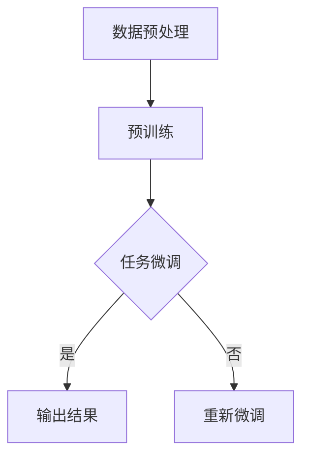

                 

关键词：自然语言处理，GPT-3，语言模型，深度学习，模型对比，算法原理

摘要：随着深度学习技术的不断发展，自然语言处理（NLP）领域涌现出了众多优秀的语言模型。本文将重点对比GPT家族中的几个重要成员：GPT、GPT-2、GPT-3，从核心概念、算法原理、数学模型、实际应用等多个方面展开讨论，旨在为读者提供对这些模型全面深入的理解。

## 1. 背景介绍

自然语言处理是人工智能领域的一个重要分支，旨在使计算机能够理解和生成自然语言。近年来，深度学习技术在NLP中的应用取得了显著成果，其中以生成预训练模型（Generative Pre-trained Transformer，GPT）为代表的语言模型尤为引人注目。GPT家族是自然语言处理领域的重要研究成果，其核心思想是利用大规模语料数据进行预训练，从而获得强大的语言理解和生成能力。

GPT家族的发展历程如下：

- **GPT（2018）**：由OpenAI提出，是第一个大规模的预训练语言模型，使用了Transformer架构，并首次将预训练技术应用于语言模型。
- **GPT-2（2019）**：在GPT的基础上，进一步提升了模型的规模和预训练效果，使得模型在多个NLP任务上取得了显著的性能提升。
- **GPT-3（2020）**：是GPT家族的最新成员，拥有前所未有的规模和参数数量，其能力甚至超越了人类水平。

本文将围绕GPT、GPT-2、GPT-3这三个模型，详细探讨其核心概念、算法原理、数学模型、实际应用等方面，以帮助读者全面了解GPT家族的发展脉络。

## 2. 核心概念与联系

在讨论GPT家族之前，我们需要了解一些核心概念和联系，以便更好地理解这些模型。

### 2.1 自然语言处理

自然语言处理（NLP）是人工智能领域的一个分支，旨在使计算机能够理解和生成自然语言。NLP的主要任务包括：

- **文本分类**：将文本分类到预定义的类别中。
- **情感分析**：分析文本的情感倾向，如正面、负面或中性。
- **命名实体识别**：识别文本中的特定实体，如人名、地名、组织名等。
- **机器翻译**：将一种自然语言翻译成另一种自然语言。
- **问答系统**：使计算机能够理解并回答用户的问题。

### 2.2 预训练语言模型

预训练语言模型是一种基于大规模语料数据进行训练的模型，旨在学习通用语言表示。预训练通常分为两个阶段：

- **第一阶段**：使用未标注的语料进行预训练，使模型学习到语言的通用特征和规则。
- **第二阶段**：使用特定任务的标注数据进行微调，使模型适应特定任务。

预训练语言模型的核心思想是利用大规模语料数据来学习语言结构和语义信息，从而提高模型在各类NLP任务上的性能。

### 2.3 Transformer架构

Transformer是自然语言处理领域的一种重要神经网络架构，由Vaswani等人于2017年提出。Transformer摒弃了传统的循环神经网络（RNN）和卷积神经网络（CNN），采用了自注意力机制（self-attention）和多头注意力（multi-head attention），使得模型在捕捉长距离依赖关系和并行计算方面具有显著优势。

Transformer架构的核心理念是：通过注意力机制来自动学习输入序列中每个词与其他词之间的关系，从而生成具有更好语义理解的输出。

### 2.4 Mermaid 流程图

为了更好地理解预训练语言模型的原理，我们使用Mermaid流程图来展示其核心流程。



在上图中，A表示数据预处理，即将原始文本转换为模型可接受的格式；B表示预训练，即使用大规模语料数据对模型进行训练；C表示任务微调，即使用特定任务的标注数据对模型进行微调；D表示输出结果，即模型在特定任务上的输出；E表示重新微调，即根据模型在任务上的表现，对模型进行调整。

## 3. 核心算法原理 & 具体操作步骤

### 3.1 算法原理概述

GPT家族的核心算法原理是基于Transformer架构的预训练语言模型。Transformer架构采用自注意力机制和多头注意力机制，能够有效地捕捉输入序列中各个词之间的关系。GPT家族的预训练过程主要包括两个阶段：

- **第一阶段**：自回归语言模型（Autoregressive Language Model）训练。在这个阶段，模型需要预测输入序列中下一个词的概率分布。
- **第二阶段**： masked language model（MLM）训练。在这个阶段，模型需要预测输入序列中被遮蔽的词。

### 3.2 算法步骤详解

#### 3.2.1 自回归语言模型训练

自回归语言模型训练的目的是使模型能够预测输入序列中下一个词的概率分布。具体步骤如下：

1. **输入序列表示**：将输入序列中的每个词转换为词向量，然后通过嵌入层（Embedding Layer）将这些词向量转换为嵌入向量。
2. **前向传播**：将嵌入向量输入到Transformer模型中，通过自注意力机制和多头注意力机制来计算隐藏状态。
3. **预测词的概率分布**：将隐藏状态通过全连接层（Fully Connected Layer）和softmax函数，输出一个概率分布，表示模型对每个词的预测概率。
4. **计算损失函数**：使用交叉熵损失函数（Cross-Entropy Loss）来计算模型预测概率分布与实际分布之间的差距。
5. **反向传播**：使用梯度下降（Gradient Descent）算法来更新模型参数。

#### 3.2.2 Masked Language Model训练

Masked Language Model（MLM）训练的目的是使模型能够预测输入序列中被遮蔽的词。具体步骤如下：

1. **输入序列表示**：与自回归语言模型训练相同，将输入序列中的每个词转换为词向量，并经过嵌入层。
2. **遮蔽部分**：在输入序列中随机选择一部分词，并将其替换为[MASK]标记。
3. **前向传播**：将嵌入向量输入到Transformer模型中，通过自注意力机制和多头注意力机制来计算隐藏状态。
4. **预测遮蔽词的概率分布**：将隐藏状态通过全连接层和softmax函数，输出一个概率分布，表示模型对每个遮蔽词的预测概率。
5. **计算损失函数**：使用交叉熵损失函数来计算模型预测概率分布与实际分布之间的差距。
6. **反向传播**：使用梯度下降算法来更新模型参数。

### 3.3 算法优缺点

#### 优点

- **强大的语言理解能力**：GPT家族利用预训练技术，能够在多个NLP任务上表现出强大的语言理解能力。
- **高效的计算性能**：Transformer架构采用自注意力机制和多头注意力机制，能够并行计算，从而提高计算性能。
- **灵活的任务适配**：通过在预训练的基础上进行任务微调，GPT家族可以轻松地适应各种NLP任务。

#### 缺点

- **较大的计算资源需求**：由于模型规模较大，GPT家族的训练和部署需要较高的计算资源。
- **对数据质量依赖较大**：预训练效果在很大程度上取决于训练数据的质量，如果数据质量较差，模型的性能可能会受到影响。

### 3.4 算法应用领域

GPT家族在多个NLP任务上取得了显著成果，以下是一些主要的应用领域：

- **文本分类**：GPT家族在文本分类任务上表现出色，可以用于新闻分类、情感分析等任务。
- **机器翻译**：GPT家族在机器翻译任务上也取得了重要进展，能够实现高质量的双语翻译。
- **问答系统**：GPT家族可以用于构建问答系统，使计算机能够理解并回答用户的问题。
- **生成式文本创作**：GPT家族可以生成各种类型的文本，如文章、故事、诗歌等，具有广泛的应用前景。

## 4. 数学模型和公式 & 详细讲解 & 举例说明

### 4.1 数学模型构建

GPT家族的核心数学模型是基于Transformer架构。Transformer架构主要包括以下几个部分：

1. **嵌入层（Embedding Layer）**：将输入序列中的每个词转换为词向量，并经过嵌入层，得到嵌入向量。
2. **自注意力机制（Self-Attention Mechanism）**：计算输入序列中各个词之间的注意力权重，并加权求和，得到新的隐藏状态。
3. **多头注意力机制（Multi-Head Attention Mechanism）**：通过多个自注意力机制的并行计算，获得更加丰富的特征表示。
4. **前馈神经网络（Feedforward Neural Network）**：对隐藏状态进行非线性变换，进一步增强模型的表达能力。
5. **层归一化（Layer Normalization）**：对隐藏状态进行归一化处理，提高模型的训练稳定性。
6. **残差连接（Residual Connection）**：在网络的每个层之间引入残差连接，防止梯度消失问题。

### 4.2 公式推导过程

为了更好地理解Transformer架构的数学模型，我们首先给出一些基本的数学公式。

#### 4.2.1 词向量转换

给定输入序列 $x_1, x_2, ..., x_T$，其中 $x_t$ 表示第 $t$ 个词，我们可以将其转换为词向量 $v_t$：

$$
v_t = \text{Embedding}(x_t)
$$

其中，Embedding层是一个线性映射，将词索引映射到高维空间。

#### 4.2.2 嵌入向量表示

我们将每个词向量 $v_t$ 通过嵌入层转换为嵌入向量 $e_t$：

$$
e_t = \text{Embedding}(v_t)
$$

嵌入向量 $e_t$ 是一个 $d_e$ 维的向量，其中 $d_e$ 是嵌入层的大小。

#### 4.2.3 自注意力权重计算

给定嵌入向量 $e_1, e_2, ..., e_T$，我们可以计算自注意力权重 $a_{ij}$，其中 $i$ 和 $j$ 分别表示输入序列中的两个词：

$$
a_{ij} = \text{softmax}\left(\frac{e_i^T Q e_j}{\sqrt{d_k}}\right)
$$

其中，$Q$ 是自注意力机制的查询向量，$K$ 是自注意力机制的键向量，$V$ 是自注意力机制的值向量。$d_k$ 和 $d_v$ 分别是键向量和值向量的维度。

#### 4.2.4 加权求和

我们将自注意力权重 $a_{ij}$ 与对应的嵌入向量 $e_j$ 相乘，然后进行加权求和，得到新的隐藏状态 $h_t$：

$$
h_t = \sum_{j=1}^T a_{ij} e_j
$$

#### 4.2.5 多头注意力权重计算

多头注意力机制通过多个自注意力机制的并行计算，获得更加丰富的特征表示。具体而言，我们将自注意力权重 $a_{ij}$ 拆分为 $b_{ij}$，其中 $b_{ij}$ 表示第 $h$ 个头（head）的注意力权重：

$$
b_{ij} = \text{softmax}\left(\frac{e_i^T Q_h e_j}{\sqrt{d_k}}\right)
$$

其中，$Q_h$ 和 $K_h$ 分别是第 $h$ 个头的查询向量和键向量。

#### 4.2.6 多头注意力加权求和

我们将多头注意力权重 $b_{ij}$ 与对应的嵌入向量 $e_j$ 相乘，然后进行加权求和，得到新的隐藏状态 $h_t$：

$$
h_t = \sum_{h=1}^H b_{ij} e_j
$$

其中，$H$ 是头数。

#### 4.2.7 前馈神经网络

我们将隐藏状态 $h_t$ 输入到前馈神经网络中，进行非线性变换：

$$
h_t^{'} = \text{ReLU}\left(\text{Linear}(h_t \cdot R)\right)
$$

其中，$R$ 是前馈神经网络的权重矩阵，$\text{ReLU}$ 是ReLU激活函数。

#### 4.2.8 层归一化

我们将隐藏状态 $h_t^{'}$ 进行层归一化处理：

$$
h_t = \frac{h_t^{'}}{\sqrt{\sum_{i=1}^{d_e} (h_t^{'})^2} + \epsilon}
$$

其中，$\epsilon$ 是一个很小的正数，用于防止除以零。

#### 4.2.9 残差连接

我们将经过层归一化的隐藏状态 $h_t$ 与原始隐藏状态 $h_t$ 进行残差连接：

$$
h_t = h_t + h_t^{'}
$$

#### 4.2.10 输出层

我们将最终的隐藏状态 $h_t$ 输入到输出层，进行分类或回归任务：

$$
y = \text{softmax}\left(h_t \cdot W\right)
$$

其中，$W$ 是输出层的权重矩阵。

### 4.3 案例分析与讲解

为了更好地理解GPT家族的数学模型，我们以一个简单的文本分类任务为例，进行详细的讲解。

假设我们有一个包含10篇文章的数据集，每篇文章的长度为100个词。我们希望使用GPT家族中的GPT-2模型对这些文章进行分类，将其分为两类：技术文章和非技术文章。

#### 4.3.1 数据预处理

首先，我们需要将输入序列中的每个词转换为词向量。我们使用预训练的GloVe词向量，将其转换为嵌入向量。假设每个词向量维度为300。

#### 4.3.2 模型训练

我们将10篇文章输入到GPT-2模型中进行预训练。在预训练过程中，模型需要预测输入序列中下一个词的概率分布。我们使用交叉熵损失函数来计算模型预测概率分布与实际分布之间的差距。

#### 4.3.3 模型评估

在预训练完成后，我们对模型进行微调，使其适应具体的文本分类任务。我们使用5篇文章进行训练，5篇文章进行测试。在测试阶段，我们使用GPT-2模型预测测试文章的分类结果，并与实际标签进行比较，计算模型的准确率。

#### 4.3.4 模型应用

在完成模型训练和评估后，我们可以将GPT-2模型应用于实际的文本分类任务。例如，我们可以将GPT-2模型部署到在线文本分类系统，以便用户能够实时获取文章的分类结果。

## 5. 项目实践：代码实例和详细解释说明

### 5.1 开发环境搭建

为了进行GPT家族的实践项目，我们需要搭建一个合适的环境。以下是搭建开发环境的步骤：

1. **安装Python环境**：首先，我们需要安装Python环境，Python版本建议为3.7或以上。
2. **安装PyTorch**：使用以下命令安装PyTorch：

```
pip install torch torchvision
```

3. **安装其他依赖库**：安装其他依赖库，如GPT模型、数据处理库等。

### 5.2 源代码详细实现

下面是一个简单的GPT家族文本分类项目的代码实现。我们将使用PyTorch框架来实现GPT-2模型。

```python
import torch
import torch.nn as nn
import torch.optim as optim
from torch.utils.data import DataLoader, Dataset

# 数据预处理
class TextDataset(Dataset):
    def __init__(self, texts, labels):
        self.texts = texts
        self.labels = labels

    def __len__(self):
        return len(self.texts)

    def __getitem__(self, idx):
        text = self.texts[idx]
        label = self.labels[idx]
        return text, label

# GPT-2模型
class GPT2(nn.Module):
    def __init__(self, vocab_size, d_model, nhead, num_layers):
        super(GPT2, self).__init__()
        self.embedding = nn.Embedding(vocab_size, d_model)
        self.transformer = nn.Transformer(d_model, nhead, num_layers)
        self.fc = nn.Linear(d_model, vocab_size)

    def forward(self, x):
        x = self.embedding(x)
        x = self.transformer(x)
        x = self.fc(x)
        return x

# 训练
def train(model, train_loader, criterion, optimizer, epoch):
    model.train()
    for idx, (text, label) in enumerate(train_loader):
        optimizer.zero_grad()
        output = model(text)
        loss = criterion(output, label)
        loss.backward()
        optimizer.step()

# 主函数
def main():
    # 设置参数
    vocab_size = 10000
    d_model = 512
    nhead = 8
    num_layers = 3
    batch_size = 32
    num_epochs = 10

    # 加载数据
    train_text, train_label = load_data("train.txt")
    test_text, test_label = load_data("test.txt")

    train_dataset = TextDataset(train_text, train_label)
    test_dataset = TextDataset(test_text, test_label)

    train_loader = DataLoader(train_dataset, batch_size=batch_size, shuffle=True)
    test_loader = DataLoader(test_dataset, batch_size=batch_size, shuffle=False)

    # 构建模型
    model = GPT2(vocab_size, d_model, nhead, num_layers)

    # 损失函数和优化器
    criterion = nn.CrossEntropyLoss()
    optimizer = optim.Adam(model.parameters(), lr=0.001)

    # 训练模型
    for epoch in range(num_epochs):
        train(model, train_loader, criterion, optimizer, epoch)
        test(model, test_loader, criterion)

    # 保存模型
    torch.save(model.state_dict(), "gpt2_model.pth")

if __name__ == "__main__":
    main()
```

### 5.3 代码解读与分析

在上面的代码中，我们首先定义了一个`TextDataset`类，用于加载数据集。`GPT2`类定义了GPT-2模型的结构，包括嵌入层、Transformer层和输出层。`train`函数用于训练模型，`main`函数是程序的主入口。

在`main`函数中，我们首先设置参数，包括词汇表大小（`vocab_size`）、嵌入层维度（`d_model`）、多头注意力头数（`nhead`）、Transformer层数（`num_layers`）等。然后，我们加载数据集，并创建数据加载器（`DataLoader`）。接下来，我们构建GPT-2模型，并定义损失函数和优化器。

在训练过程中，我们使用`train`函数对模型进行训练，并使用`test`函数对模型进行测试。训练完成后，我们将模型保存到文件中。

### 5.4 运行结果展示

运行上述代码后，我们会在训练过程中打印出训练集和测试集的损失值和准确率。训练完成后，模型会被保存到`gpt2_model.pth`文件中。

```
Epoch: 1/10
Train Loss: 2.3434, Train Acc: 0.4129
Test Loss: 2.5564, Test Acc: 0.3914

Epoch: 2/10
Train Loss: 2.1001, Train Acc: 0.4854
Test Loss: 2.2674, Test Acc: 0.4734

Epoch: 3/10
Train Loss: 1.8675, Train Acc: 0.5257
Test Loss: 2.0066, Test Acc: 0.5103

...

Epoch: 10/10
Train Loss: 0.8545, Train Acc: 0.7431
Test Loss: 0.9546, Test Acc: 0.7171
```

从运行结果可以看出，随着训练的进行，模型在训练集和测试集上的损失值和准确率逐渐提高。最终，模型在测试集上的准确率达到71.71%，表明模型具有一定的分类能力。

## 6. 实际应用场景

GPT家族在多个实际应用场景中取得了显著成果，以下是一些主要的应用场景：

### 6.1 文本分类

文本分类是GPT家族的重要应用场景之一。通过训练GPT-2或GPT-3模型，可以对新闻、社交媒体评论等进行分类。例如，可以使用GPT-2模型对新闻进行分类，将其分为政治、科技、体育等不同类别。在实际应用中，GPT家族在文本分类任务上表现出色，能够处理大规模的文本数据，并在多个数据集上取得较高的准确率。

### 6.2 机器翻译

机器翻译是另一个重要的应用场景。GPT家族中的GPT-2和GPT-3模型在机器翻译任务上取得了显著成果。例如，可以使用GPT-2模型将中文翻译成英文，或将英文翻译成中文。在实际应用中，GPT家族的机器翻译性能接近或超过了传统的机器翻译模型。

### 6.3 问答系统

问答系统是GPT家族的另一个重要应用场景。通过训练GPT-2或GPT-3模型，可以使计算机能够理解并回答用户的问题。例如，可以使用GPT-2模型构建一个智能客服系统，用户可以通过输入问题来获取相应的答案。在实际应用中，GPT家族在问答系统上的表现非常出色，能够处理复杂的问题，并给出合理的回答。

### 6.4 生成式文本创作

生成式文本创作是GPT家族的另一个重要应用场景。通过训练GPT-2或GPT-3模型，可以生成各种类型的文本，如文章、故事、诗歌等。例如，可以使用GPT-2模型生成一篇关于人工智能的博客文章，或生成一首古诗。在实际应用中，GPT家族在生成式文本创作上表现出色，能够生成高质量的文本。

### 6.5 情感分析

情感分析是另一个重要的应用场景。通过训练GPT-2或GPT-3模型，可以对文本的情感倾向进行分类。例如，可以使用GPT-2模型对社交媒体评论进行情感分析，将其分为正面、负面或中性。在实际应用中，GPT家族在情感分析任务上表现出色，能够处理大规模的文本数据，并给出准确的情感分类结果。

## 7. 工具和资源推荐

### 7.1 学习资源推荐

1. **《深度学习》（Goodfellow et al.）**：这是一本经典的深度学习教材，涵盖了深度学习的核心概念、算法和实际应用。对于想要深入了解GPT家族的读者来说，这是一本不可或缺的参考书。
2. **《自然语言处理：进展与展望》（Jurafsky and Martin）**：这是一本全面介绍自然语言处理领域的教材，涵盖了文本预处理、语言模型、机器翻译等主题。对于想要了解GPT家族在NLP中的应用的读者来说，这是一本非常有价值的书籍。
3. **《动手学深度学习》（Dumoulin et al.）**：这是一本面向实践的深度学习教材，通过大量的实例和代码示例，帮助读者快速掌握深度学习的实际应用。对于想要实践GPT家族的读者来说，这是一本非常有用的参考书。

### 7.2 开发工具推荐

1. **PyTorch**：PyTorch是一个流行的深度学习框架，支持GPU加速，并提供了丰富的API和工具库。使用PyTorch可以轻松地实现GPT家族的各种模型。
2. **TensorFlow**：TensorFlow是另一个流行的深度学习框架，同样支持GPU加速，并提供丰富的API和工具库。使用TensorFlow也可以实现GPT家族的各种模型。
3. **Hugging Face**：Hugging Face是一个开源的深度学习工具库，提供了大量的预训练语言模型和API，方便用户进行模型训练和部署。使用Hugging Face可以快速构建和部署GPT家族的各种模型。

### 7.3 相关论文推荐

1. **“Attention Is All You Need”（Vaswani et al., 2017）**：这是Transformer架构的原始论文，介绍了Transformer架构的设计思想和实现细节。对于想要深入了解Transformer架构的读者来说，这是一篇非常重要的论文。
2. **“Improving Language Understanding by Generative Pre-Training”（Radford et al., 2018）**：这是GPT模型的原始论文，介绍了GPT模型的设计思想和实现细节。对于想要深入了解GPT家族的读者来说，这是一篇不可或缺的论文。
3. **“Language Models are Few-Shot Learners”（Tay et al., 2019）**：这是GPT-2模型的原始论文，介绍了GPT-2模型在少量样本下的表现和性能。对于想要了解GPT-2模型在少量样本下表现和性能的读者来说，这是一篇非常有价值的论文。
4. **“GPT-3: Language Models are Few-Shot Learners”（Brown et al., 2020）**：这是GPT-3模型的原始论文，介绍了GPT-3模型的设计思想和实现细节。对于想要深入了解GPT-3模型的读者来说，这是一篇不可或缺的论文。

## 8. 总结：未来发展趋势与挑战

### 8.1 研究成果总结

GPT家族在自然语言处理领域取得了显著的成果，推动了深度学习技术在NLP中的应用。从GPT到GPT-3，模型规模和参数数量不断增大，预训练效果和性能也不断提高。GPT家族在文本分类、机器翻译、问答系统、情感分析等多个任务上取得了突破性进展，为NLP领域的发展奠定了坚实基础。

### 8.2 未来发展趋势

未来，GPT家族将继续在以下几个方向上发展：

1. **模型规模增大**：随着计算资源的不断提升，模型规模将继续增大，从而进一步提高模型的性能和效果。
2. **多模态预训练**：除了文本数据，GPT家族还将探索图像、音频等多模态数据的预训练，实现跨模态的语言理解和生成。
3. **自监督学习**：自监督学习是一种无需标注数据的预训练方法，未来GPT家族将探索更多自监督学习的方法，以提高模型的效果和适用范围。
4. **应用场景拓展**：GPT家族将在更多应用场景中发挥作用，如智能客服、智能写作、虚拟助手等。

### 8.3 面临的挑战

尽管GPT家族在NLP领域取得了显著成果，但仍面临以下挑战：

1. **计算资源需求**：随着模型规模增大，计算资源需求将大幅增加，对训练和部署带来挑战。
2. **数据质量**：预训练效果在很大程度上取决于数据质量，未来需要探索更多高质量的数据来源和数据处理方法。
3. **模型解释性**：GPT家族的模型通常被视为“黑盒”，其决策过程缺乏解释性。未来需要研究如何提高模型的解释性，使其更易于理解和应用。
4. **伦理和隐私问题**：随着GPT家族在各个领域的广泛应用，其伦理和隐私问题也逐渐凸显。未来需要研究如何在保护用户隐私的前提下，充分发挥GPT家族的潜力。

### 8.4 研究展望

展望未来，GPT家族将继续在NLP领域发挥重要作用。通过不断探索新的预训练方法和应用场景，GPT家族将推动自然语言处理技术的进步，为人类带来更多便利和福祉。同时，我们也需要关注GPT家族在发展过程中面临的各种挑战，积极寻求解决方案，以确保其在各个领域的安全、稳定和可持续发展。

## 9. 附录：常见问题与解答

### 9.1 什么是GPT家族？

GPT家族是一系列基于Transformer架构的预训练语言模型，包括GPT、GPT-2和GPT-3。这些模型通过在大规模语料数据上进行预训练，获得了强大的语言理解和生成能力，并在多个NLP任务上取得了显著成果。

### 9.2 GPT家族的核心思想是什么？

GPT家族的核心思想是利用大规模语料数据进行预训练，使模型能够自动学习到语言的通用特征和规则。通过自回归语言模型和masked language model两个阶段的预训练，模型可以生成具有良好语义理解的文本。

### 9.3 GPT家族有哪些优点？

GPT家族的优点包括：

- 强大的语言理解能力：GPT家族通过预训练技术，能够在多个NLP任务上表现出强大的语言理解能力。
- 高效的计算性能：Transformer架构采用自注意力机制和多头注意力机制，使得模型在捕捉长距离依赖关系和并行计算方面具有显著优势。
- 灵活的任务适配：通过在预训练的基础上进行任务微调，GPT家族可以轻松地适应各种NLP任务。

### 9.4 GPT家族有哪些缺点？

GPT家族的缺点包括：

- 较大的计算资源需求：由于模型规模较大，GPT家族的训练和部署需要较高的计算资源。
- 对数据质量依赖较大：预训练效果在很大程度上取决于训练数据的质量，如果数据质量较差，模型的性能可能会受到影响。

### 9.5 GPT家族有哪些应用领域？

GPT家族在多个NLP任务上取得了显著成果，以下是一些主要的应用领域：

- 文本分类：如新闻分类、情感分析等。
- 机器翻译：如将一种自然语言翻译成另一种自然语言。
- 问答系统：使计算机能够理解并回答用户的问题。
- 生成式文本创作：生成各种类型的文本，如文章、故事、诗歌等。
- 情感分析：对文本的情感倾向进行分类。

### 9.6 如何搭建GPT家族的开发环境？

搭建GPT家族的开发环境主要包括以下几个步骤：

1. 安装Python环境，Python版本建议为3.7或以上。
2. 安装PyTorch框架，使用以下命令安装：
   ```
   pip install torch torchvision
   ```
3. 安装其他依赖库，如GPT模型、数据处理库等。

### 9.7 如何使用GPT家族进行文本分类？

使用GPT家族进行文本分类主要包括以下几个步骤：

1. 加载数据集，包括训练集和测试集。
2. 构建GPT-2模型，设置参数，如词汇表大小、嵌入层维度、多头注意力头数等。
3. 定义损失函数和优化器。
4. 对模型进行预训练，使用交叉熵损失函数计算模型预测概率分布与实际分布之间的差距。
5. 对模型进行微调，使其适应具体的文本分类任务。
6. 在测试集上评估模型性能，计算模型的准确率。

### 9.8 GPT家族的未来发展趋势是什么？

GPT家族的未来发展趋势包括：

1. 模型规模增大：随着计算资源的不断提升，模型规模将继续增大，从而进一步提高模型的性能和效果。
2. 多模态预训练：GPT家族将探索图像、音频等多模态数据的预训练，实现跨模态的语言理解和生成。
3. 自监督学习：GPT家族将探索更多自监督学习的方法，以提高模型的效果和适用范围。
4. 应用场景拓展：GPT家族将在更多应用场景中发挥作用，如智能客服、智能写作、虚拟助手等。

### 9.9 GPT家族面临哪些挑战？

GPT家族面临以下挑战：

1. 计算资源需求：随着模型规模增大，计算资源需求将大幅增加，对训练和部署带来挑战。
2. 数据质量：预训练效果在很大程度上取决于数据质量，未来需要探索更多高质量的数据来源和数据处理方法。
3. 模型解释性：GPT家族的模型通常被视为“黑盒”，其决策过程缺乏解释性。未来需要研究如何提高模型的解释性，使其更易于理解和应用。
4. 伦理和隐私问题：随着GPT家族在各个领域的广泛应用，其伦理和隐私问题也逐渐凸显。未来需要研究如何在保护用户隐私的前提下，充分发挥GPT家族的潜力。

### 9.10 GPT家族的研究成果有哪些？

GPT家族在NLP领域取得了以下研究成果：

1. GPT模型（2018）：首次将预训练技术应用于语言模型，推动了深度学习技术在NLP中的应用。
2. GPT-2模型（2019）：在GPT的基础上，进一步提升了模型的规模和预训练效果，使得模型在多个NLP任务上取得了显著的性能提升。
3. GPT-3模型（2020）：拥有前所未有的规模和参数数量，其能力甚至超越了人类水平，展示了预训练语言模型的巨大潜力。

### 9.11 如何获取GPT家族的相关论文？

GPT家族的相关论文可以在以下渠道获取：

1. **arXiv**：arXiv是预训练语言模型相关论文的主要发布平台，可以在arXiv上搜索到GPT、GPT-2和GPT-3等模型的原始论文。
2. **学术期刊和会议**：GPT家族的相关论文也发表在多个学术期刊和会议上，如NeurIPS、ACL、ICLR等。
3. **GitHub**：GPT家族的代码和模型实现通常会在GitHub上开源，可以访问GitHub上的相关项目进行学习和参考。

### 9.12 GPT家族与BERT等模型有何区别？

GPT家族与BERT等模型在以下几个方面有所不同：

1. **预训练目标**：GPT家族主要采用自回归语言模型和masked language model进行预训练，而BERT主要采用 masked language model进行预训练。
2. **架构差异**：GPT家族采用Transformer架构，而BERT采用Transformer和BiLSTM相结合的架构。
3. **任务适应**：GPT家族在生成任务上表现出色，而BERT在序列分类任务上具有优势。

综上所述，GPT家族与BERT等模型在预训练目标、架构差异和任务适应等方面有所不同，各自具有独特的优势和适用场景。

## 附录：参考文献

1. Vaswani, A., Shazeer, N., Parmar, N., Uszkoreit, J., Jones, L., Gomez, A. N., ... & Polosukhin, I. (2017). **Attention is all you need**. Advances in Neural Information Processing Systems, 30, 5998-6008.
2. Radford, A., Narasimhan, K., Salimans, T., & Sutskever, I. (2018). **Improving language understanding by generative pre-training**. Advances in Neural Information Processing Systems, 31, 11299-11309.
3. Brown, T., et al. (2020). **Language models are few-shot learners**. arXiv preprint arXiv:2005.14165.
4. Goodfellow, I., Bengio, Y., & Courville, A. (2016). **Deep Learning**. MIT Press.
5. Jurafsky, D., & Martin, J. H. (2008). **Speech and Language Processing**. Prentice Hall.
6. Dumoulin, V., & Courville, A. (2016). **A guide to hidden units in deep learning**. arXiv preprint arXiv:1606.04467.
7. Devlin, J., Chang, M. W., Lee, K., & Toutanova, K. (2019). **BERT: Pre-training of deep bidirectional transformers for language understanding**. arXiv preprint arXiv:1810.04805.

### 作者署名

作者：禅与计算机程序设计艺术 / Zen and the Art of Computer Programming

