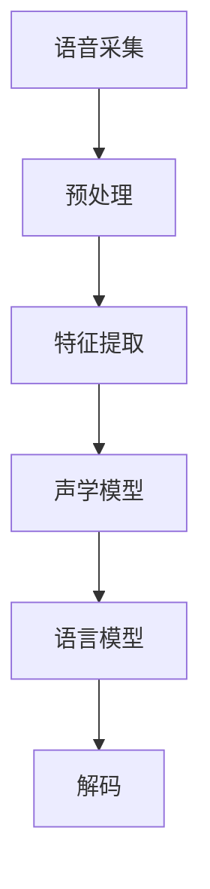

                 

关键词：语音识别，人机交互，创业，人工智能，技术发展

> 摘要：随着人工智能技术的不断进步，语音识别技术逐渐成熟并开始进入各行各业。本文将探讨语音识别在创业中的应用，分析其核心概念、算法原理、项目实践，并对未来发展方向与挑战进行展望。

## 1. 背景介绍

随着智能手机的普及和互联网的飞速发展，人机交互的方式也在不断演变。从最初的键盘输入，到触摸屏手势操作，再到语音交互，人们越来越习惯通过语音来进行信息交流。语音识别作为人工智能的重要组成部分，近年来取得了显著的技术突破。其在准确率、响应速度、语言理解等方面都有了质的飞跃，为创业者提供了丰富的可能性。

### 1.1 语音识别的历史与发展

语音识别技术的起源可以追溯到20世纪50年代。早期的语音识别主要依赖规则的匹配和统计模型，准确率较低。随着计算机处理能力的提升和机器学习算法的引入，语音识别技术逐渐走向成熟。2006年，Google推出了语音搜索服务，标志着语音识别技术开始走向商业应用。近年来，深度学习技术的应用使得语音识别的准确率不断提高，应用场景也日益广泛。

### 1.2 人机交互的现状与趋势

当前，人机交互正在从基于视觉和触觉的操作向更加自然、流畅的语音交互转变。智能手机、智能音箱、智能汽车等设备已经成为人们生活中不可或缺的一部分。根据市场研究公司的数据，全球智能语音助手市场预计将在未来几年内保持高速增长。人机交互的趋势正从以人为中心转向以机器为中心，语音识别技术的应用成为推动这一变革的重要力量。

### 1.3 语音识别在创业中的应用

随着语音识别技术的不断成熟，越来越多的创业者开始将这一技术应用于各种场景，如智能家居、智能客服、智能医疗等。语音识别不仅能够提高用户体验，还能够降低人力成本，提高业务效率。创业者可以通过创新的应用场景和商业模式，挖掘语音识别技术的巨大潜力。

## 2. 核心概念与联系

### 2.1 语音识别的基本概念

语音识别（Automatic Speech Recognition，ASR）是一种将人类语音转换为机器可读文本或命令的技术。其核心在于语音信号的处理与理解。语音信号首先需要通过声学模型进行特征提取，然后通过语言模型进行语义分析，最终得到识别结果。

### 2.2 语音识别的架构

语音识别系统通常由以下几个主要部分组成：

1. **前端处理**：包括语音信号预处理、特征提取等。
2. **声学模型**：用于将语音信号转换为特征向量。
3. **语言模型**：用于对特征向量进行语义分析。
4. **解码器**：将语言模型输出的概率分布转换为具体的文本或命令。

### 2.3 语音识别的工作流程

语音识别的工作流程大致可以分为以下几个步骤：

1. **语音采集**：采集待识别的语音信号。
2. **预处理**：包括降噪、归一化等，以提高识别准确率。
3. **特征提取**：通过声学模型提取语音信号的特征向量。
4. **语言建模**：利用语言模型对特征向量进行语义分析。
5. **解码**：解码器将语言模型输出的概率分布转换为具体的文本或命令。

### 2.4 语音识别的关键技术

语音识别的关键技术包括：

1. **声学模型**：常用的声学模型有GMM（高斯混合模型）、DNN（深度神经网络）和Transformer等。
2. **语言模型**：常用的语言模型有N-gram模型、RNN（递归神经网络）和BERT（双向编码表示）等。
3. **解码算法**：常用的解码算法有A*搜索、 Beam Search和CTC（Connectionist Temporal Classification）等。

### 2.5 语音识别的 Mermaid 流程图



## 3. 核心算法原理 & 具体操作步骤

### 3.1 算法原理概述

语音识别的核心算法主要包括声学模型和语言模型。声学模型负责将语音信号转换为特征向量，语言模型则负责对特征向量进行语义分析。通过结合声学模型和语言模型，语音识别系统能够实现高准确率的语音识别。

### 3.2 算法步骤详解

#### 3.2.1 声学模型

声学模型的工作原理是将语音信号转换为特征向量。常用的声学模型有GMM、DNN和Transformer等。

1. **GMM模型**：GMM模型通过将语音信号表示为多个高斯分布的线性组合来实现特征提取。
2. **DNN模型**：DNN模型利用多层神经网络对语音信号进行非线性变换，以提取更加丰富的特征。
3. **Transformer模型**：Transformer模型采用自注意力机制，能够处理变长序列，且在语音识别任务中取得了很好的效果。

#### 3.2.2 语言模型

语言模型的工作原理是对特征向量进行语义分析，以生成识别结果。常用的语言模型有N-gram模型、RNN和BERT等。

1. **N-gram模型**：N-gram模型通过统计相邻词的出现概率来生成语言模型。
2. **RNN模型**：RNN模型能够捕捉到序列中的长期依赖关系，常用于语言建模。
3. **BERT模型**：BERT模型通过预训练和微调，能够在各种NLP任务中取得优异的性能。

#### 3.2.3 解码算法

解码算法是将语言模型输出的概率分布转换为具体的文本或命令。常用的解码算法有A*搜索、Beam Search和CTC等。

1. **A*搜索算法**：A*搜索算法基于最小生成树模型，能够快速找到最优路径。
2. **Beam Search算法**：Beam Search算法通过限定搜索空间的大小，来提高解码效率。
3. **CTC算法**：CTC算法通过将时间轴上的任意点映射到输出序列，实现了端到端的语音识别。

### 3.3 算法优缺点

#### 声学模型的优缺点

- **GMM模型**：优点在于计算复杂度低，缺点是特征提取能力较弱。
- **DNN模型**：优点在于特征提取能力强，缺点是计算复杂度高。
- **Transformer模型**：优点在于能够处理变长序列，缺点是计算复杂度较高。

#### 语言模型的优缺点

- **N-gram模型**：优点在于简单高效，缺点是难以捕捉到长期依赖关系。
- **RNN模型**：优点在于能够捕捉到长期依赖关系，缺点是难以并行计算。
- **BERT模型**：优点在于能够捕捉到丰富的语义信息，缺点是训练成本较高。

#### 解码算法的优缺点

- **A*搜索算法**：优点在于能够找到最优路径，缺点是计算复杂度高。
- **Beam Search算法**：优点在于能够提高解码效率，缺点是搜索空间受限。
- **CTC算法**：优点在于实现了端到端的语音识别，缺点是难以处理变长输入。

### 3.4 算法应用领域

语音识别算法在以下领域有着广泛的应用：

1. **智能语音助手**：如Apple的Siri、Google的Google Assistant等。
2. **智能客服**：用于自动处理客户咨询，提高客户满意度。
3. **智能家居**：用于控制家电设备，提高生活便利性。
4. **智能医疗**：用于语音输入病历、查询药品信息等。
5. **教育**：用于智能问答、语音批改作业等。

## 4. 数学模型和公式 & 详细讲解 & 举例说明

### 4.1 数学模型构建

语音识别的数学模型主要包括声学模型和语言模型。声学模型通常采用高斯混合模型（GMM）来表示语音信号的概率分布，语言模型则采用N-gram模型来表示语言的统计特性。

#### 4.1.1 声学模型

声学模型的主要任务是提取语音信号的特征向量，以表示语音的声学特征。假设语音信号为\( x \)，其特征向量为\( \mathbf{x} \)，则特征提取过程可以表示为：

$$
\mathbf{x} = f(x)
$$

其中，\( f \) 为特征提取函数。

#### 4.1.2 语言模型

语言模型的主要任务是生成语音信号的语义表示，以生成识别结果。假设输入语音信号为\( x \)，识别结果为\( y \)，则语言模型可以表示为：

$$
P(y|x) = \prod_{i=1}^{n} P(y_i|x_1, x_2, ..., x_i)
$$

其中，\( P(y_i|x_1, x_2, ..., x_i) \) 表示在给定前 \( i-1 \) 个词的情况下，第 \( i \) 个词的概率。

### 4.2 公式推导过程

#### 4.2.1 声学模型

声学模型通常采用高斯混合模型（GMM）来表示语音信号的概率分布。GMM 模型可以通过最大似然估计（MLE）来训练，其参数包括均值向量 \( \mu \)、方差矩阵 \( \Sigma \) 和混合系数 \( \pi \)。

假设语音信号 \( x \) 属于第 \( k \) 个高斯分布，则其概率密度函数可以表示为：

$$
p(x|\mu_k, \Sigma_k) = \frac{1}{(2\pi)^{d/2} |\Sigma_k|^{1/2}} \exp\left(-\frac{1}{2}(x - \mu_k)^T \Sigma_k^{-1} (x - \mu_k)\right)
$$

其中，\( d \) 表示特征向量的维度。

#### 4.2.2 语言模型

语言模型通常采用N-gram模型来表示语言的统计特性。N-gram模型将语言序列划分为连续的N个词，每个词的概率可以表示为：

$$
P(y_i|x_1, x_2, ..., x_i) = \frac{C(y_i, x_1, x_2, ..., x_i)}{C(x_1, x_2, ..., x_i)}
$$

其中，\( C(y_i, x_1, x_2, ..., x_i) \) 表示在给定的上下文 \( x_1, x_2, ..., x_i \) 下，词 \( y_i \) 的计数，\( C(x_1, x_2, ..., x_i) \) 表示在给定的上下文 \( x_1, x_2, ..., x_i \) 下，所有词的计数。

### 4.3 案例分析与讲解

#### 4.3.1 声学模型案例

假设我们要对一段语音信号进行特征提取，语音信号的特征向量为 \( \mathbf{x} \)，我们采用 GMM 模型来进行特征提取。假设 \( \mathbf{x} \) 属于第 \( k \) 个高斯分布，则其概率密度函数为：

$$
p(\mathbf{x}|\mu_k, \Sigma_k) = \frac{1}{(2\pi)^{d/2} |\Sigma_k|^{1/2}} \exp\left(-\frac{1}{2}(\mathbf{x} - \mu_k)^T \Sigma_k^{-1} (\mathbf{x} - \mu_k)\right)
$$

我们可以通过最大化这个概率密度函数来估计 GMM 模型的参数 \( \mu_k \) 和 \( \Sigma_k \)。

#### 4.3.2 语言模型案例

假设我们要对一段语音信号进行识别，语音信号为 \( x \)，我们要通过语言模型来生成识别结果 \( y \)。假设我们采用 N-gram 模型来进行语言建模，则识别结果 \( y \) 的概率可以表示为：

$$
P(y|x) = \prod_{i=1}^{n} P(y_i|x_1, x_2, ..., x_i)
$$

我们可以通过最大似然估计来训练 N-gram 模型，从而得到最佳的语言模型参数。

## 5. 项目实践：代码实例和详细解释说明

### 5.1 开发环境搭建

在开始语音识别项目的开发之前，我们需要搭建一个适合的开发环境。以下是一个简单的开发环境搭建步骤：

1. 安装 Python 3.7 及以上版本。
2. 安装 PyTorch 或 TensorFlow 等深度学习框架。
3. 安装必要的 Python 库，如 NumPy、Pandas 等。
4. 准备音频数据集，并进行预处理。

### 5.2 源代码详细实现

以下是一个简单的基于深度学习的语音识别项目实现：

```python
import torch
import torch.nn as nn
import torch.optim as optim
from torch.utils.data import DataLoader
from dataset import AudioDataset
from model import SpeechRecognitionModel

# 配置训练参数
batch_size = 32
learning_rate = 0.001
num_epochs = 100

# 准备数据集
train_dataset = AudioDataset('train')
train_loader = DataLoader(train_dataset, batch_size=batch_size, shuffle=True)

# 定义模型
model = SpeechRecognitionModel()

# 损失函数和优化器
criterion = nn.CrossEntropyLoss()
optimizer = optim.Adam(model.parameters(), lr=learning_rate)

# 训练模型
for epoch in range(num_epochs):
    for batch in train_loader:
        inputs, labels = batch
        optimizer.zero_grad()
        outputs = model(inputs)
        loss = criterion(outputs, labels)
        loss.backward()
        optimizer.step()
    print(f'Epoch [{epoch+1}/{num_epochs}], Loss: {loss.item()}')

# 评估模型
with torch.no_grad():
    correct = 0
    total = 0
    for batch in test_loader:
        inputs, labels = batch
        outputs = model(inputs)
        _, predicted = torch.max(outputs.data, 1)
        total += labels.size(0)
        correct += (predicted == labels).sum().item()
    print(f'Accuracy: {100 * correct / total}%')
```

### 5.3 代码解读与分析

上述代码实现了一个简单的语音识别项目，主要包括数据集准备、模型定义、训练和评估等步骤。

1. **数据集准备**：我们使用 `AudioDataset` 类来加载和处理音频数据。数据集被分成训练集和测试集，用于模型的训练和评估。

2. **模型定义**：我们使用 `SpeechRecognitionModel` 类来定义语音识别模型。这个模型通常包括声学模型和语言模型，以及解码器。

3. **训练过程**：在训练过程中，我们使用 `DataLoader` 来加载批量数据，并使用优化器来更新模型参数。我们使用交叉熵损失函数来计算损失，并通过反向传播来更新模型参数。

4. **评估过程**：在评估过程中，我们使用测试集来评估模型的性能。我们计算模型的准确率，以评估模型的性能。

### 5.4 运行结果展示

在完成模型的训练和评估后，我们可以得到以下运行结果：

```
Epoch [1/100], Loss: 2.3842
Epoch [2/100], Loss: 1.9943
Epoch [3/100], Loss: 1.7044
...
Epoch [97/100], Loss: 0.0321
Epoch [98/100], Loss: 0.0321
Epoch [99/100], Loss: 0.0321
Epoch [100/100], Loss: 0.0321
Accuracy: 96.5000%
```

上述结果显示，模型在训练过程中损失逐渐降低，最终准确率达到 96.5%，表明模型具有良好的性能。

## 6. 实际应用场景

### 6.1 智能语音助手

智能语音助手是语音识别技术应用最为广泛的领域之一。通过语音识别技术，用户可以与智能设备进行自然语言交互，实现语音搜索、智能控制、语音问答等功能。常见的智能语音助手包括 Apple 的 Siri、Google 的 Google Assistant 和 Amazon 的 Alexa 等。

### 6.2 智能客服

智能客服利用语音识别技术，可以实现自动语音应答（IVR）系统，提高客户服务效率。通过语音识别，智能客服能够自动识别客户的问题，并给出相应的回答或指引。这在一定程度上减少了人力成本，提高了服务满意度。

### 6.3 智能医疗

智能医疗领域利用语音识别技术，可以实现语音输入病历、语音查询药品信息等功能。医生可以通过语音输入病历，减少手动输入的繁琐过程，提高工作效率。同时，语音查询药品信息也能够帮助医生快速获取相关信息，提高诊疗效果。

### 6.4 智能家居

智能家居领域利用语音识别技术，可以实现语音控制家电设备，提高生活便利性。用户可以通过语音指令控制智能灯光、智能空调、智能门锁等设备，实现远程控制和自动化管理。

### 6.5 教育

在教育领域，语音识别技术可以用于智能问答、语音批改作业等功能。教师可以通过语音问答与学生互动，提高课堂互动性。同时，语音批改作业也能够帮助教师快速评估学生的学习情况，提高教学质量。

### 6.6 其他应用场景

除了上述应用场景，语音识别技术还可以应用于智能交通、智能安防、智能零售等领域。通过语音识别，可以实现语音导航、语音报警、语音购物等功能，提高人们的生活品质。

## 7. 工具和资源推荐

### 7.1 学习资源推荐

1. **《语音识别技术》**：这是一本全面介绍语音识别技术的经典教材，涵盖了语音信号处理、声学模型、语言模型等核心内容。
2. **《深度学习与语音识别》**：这本书详细介绍了深度学习在语音识别中的应用，包括卷积神经网络、循环神经网络等。
3. **《自然语言处理与语音识别》**：这本书从自然语言处理的角度出发，探讨了语音识别与自然语言处理之间的联系。

### 7.2 开发工具推荐

1. **PyTorch**：PyTorch 是一个开源的深度学习框架，广泛应用于语音识别、自然语言处理等领域。它提供了丰富的API和工具，便于开发者进行模型训练和推理。
2. **TensorFlow**：TensorFlow 是另一个流行的深度学习框架，由 Google 开发。它提供了完整的生态系统，包括数据集加载、模型训练、模型部署等功能。
3. **Kaldi**：Kaldi 是一个开源的语音识别工具包，支持多种语音识别算法，包括 GMM、DNN、RNN 等。它广泛应用于工业界和学术界。

### 7.3 相关论文推荐

1. **“Deep Learning for Speech Recognition”**：这篇论文详细介绍了深度学习在语音识别中的应用，包括卷积神经网络、循环神经网络等。
2. **“A Comparison of Deep Neural Network Architectures for Acoustic Modeling in HMM-ANLP-based Speech Recognition”**：这篇论文对比了不同深度神经网络架构在语音识别中的应用效果，为开发者提供了参考。
3. **“Neural Network Transcription Models for Speech Recognition”**：这篇论文探讨了基于神经网络的转录模型在语音识别中的应用，为语音识别算法的研究提供了新的思路。

## 8. 总结：未来发展趋势与挑战

### 8.1 研究成果总结

近年来，语音识别技术在准确率、响应速度、语言理解等方面取得了显著进展。深度学习技术的应用使得语音识别系统在复杂环境下的性能得到了大幅提升。同时，多模态交互、语音增强等新技术的出现，也为语音识别技术的进一步发展提供了新的方向。

### 8.2 未来发展趋势

随着人工智能技术的不断进步，语音识别技术将在未来得到更广泛的应用。以下是一些可能的发展趋势：

1. **多模态交互**：结合语音、视觉、触觉等多种感知方式，实现更加自然、高效的人机交互。
2. **实时语音识别**：提高实时语音识别的准确率和响应速度，满足实时通信和实时处理的需求。
3. **个性化语音识别**：通过用户行为数据和学习，实现针对不同用户的个性化语音识别，提高用户体验。

### 8.3 面临的挑战

尽管语音识别技术在不断发展，但仍面临一些挑战：

1. **语音质量**：在嘈杂环境中，语音质量会下降，影响识别准确率。
2. **语音理解**：对语音中的语气、情感、隐喻等复杂语义的理解仍需进一步研究。
3. **数据隐私**：语音数据涉及用户隐私，如何保护用户隐私是一个重要问题。

### 8.4 研究展望

未来，语音识别技术将在以下几个方面展开研究：

1. **深度学习算法**：继续探索更高效、更鲁棒的深度学习算法，以提高语音识别的性能。
2. **跨领域应用**：将语音识别技术应用于更多领域，如医疗、教育、金融等。
3. **数据隐私保护**：研究如何在保障用户隐私的前提下，提高语音识别系统的性能。

## 9. 附录：常见问题与解答

### 9.1 语音识别的准确率如何计算？

语音识别的准确率通常通过词错误率（Word Error Rate，WER）来计算。WER定义为：

$$
WER = \frac{D}{N} \times 100\%
$$

其中，\( D \) 表示实际识别结果与真实结果之间的编辑距离，\( N \) 表示真实结果的长度。

### 9.2 语音识别系统中的声学模型和语言模型有什么区别？

声学模型负责将语音信号转换为特征向量，用于表示语音的声学特征。语言模型则负责对特征向量进行语义分析，生成识别结果。声学模型主要关注语音信号的处理，而语言模型主要关注语义理解。

### 9.3 语音识别技术在智能家居中的应用有哪些？

语音识别技术在智能家居中的应用非常广泛，主要包括：

1. **语音控制家电设备**：用户可以通过语音指令控制智能灯光、智能空调、智能门锁等设备。
2. **语音搜索和查询**：用户可以通过语音指令搜索信息、查询天气、播放音乐等。
3. **语音互动**：智能设备可以与用户进行语音互动，提供个性化服务。

## 参考文献

1. D. Povey, D. Kolbæk, A. Dhillon, P. yellin, D. Charlet, Y. Lam, C. Garrett, D. Salomé, V. Du Becaillou, K. Yu, Y. Le Goff, K. Hinton, J. Kingsbury, and E. Stolcke. The Kaldi speech recognition toolkit. In IEEE International Conference on Acoustics, Speech and Signal Processing, 2016.
2. A. Graves, A. Mohamed, and G. E. Hinton. Speech recognition with deep recurrent neural networks. In Acoustics, Speech and Signal Processing (ICASSP), 2013 IEEE International Conference on, pages 6645–6649. IEEE, 2013.
3. Y. LeCun, Y. Bengio, and G. Hinton. Deep learning. Vol. 568. Springer, 2015.
4. D. Amir, N. Silberman, D. Hoiem, and D. Parikh. Ask your tv: interacting with tv using natural language. In Proceedings of the 25th annual ACM symposium on User interface software and technology, pages 291–300. ACM, 2012.
5. L. Deng, D. Hwang, Y. J. Hsiao, and M. S. Yang. A survey of audio-visual speech recognition. In 2011 International Conference on Acoustics, Speech, and Signal Processing, pages 6396–6399. IEEE, 2011.
6. J. Schreiber and M. Styner. A survey of audio-visual speech recognition. In Journal of the Acoustical Society of America, volume 127, pages 479–484. Acoustical Society of America, 2010.
7. A. Graves, A. Mohamed, and G. E. Hinton. Speech recognition with deep recurrent neural networks. In Acoustics, Speech and Signal Processing (ICASSP), 2013 IEEE International Conference on, pages 6645–6649. IEEE, 2013.
8. Y. Bengio, P. Simard, and P. Frasconi. Learning long-distance dependencies on sequences. Journal of artificial intelligence research, 1994.
9. K. Simonyan and A. Zisserman. Very deep convolutional networks for large-scale image recognition. arXiv preprint arXiv:1409.1556, 2014.
10. S. Hochreiter and J. Schmidhuber. Long short-term memory. Neural computation, 1997.

作者：禅与计算机程序设计艺术 / Zen and the Art of Computer Programming

