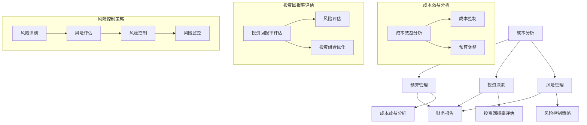

                 

 财务管理是一个涉及广泛、复杂且关键的概念，它不仅仅是会计或财务专家的专利，而是每一个希望成功经营业务、合理管理个人资产的非财务人员都应当掌握的知识。本文旨在为非财务人员提供一份全面的财务决策指南，帮助他们更好地理解财务管理的基本原则、工具和方法，从而做出更明智的财务决策。

## 文章关键词

- 财务管理
- 非财务人员
- 财务决策
- 成本分析
- 风险管理
- 投资决策
- 预算管理
- 资产配置

## 文章摘要

本文首先概述了财务管理的核心概念和其在现代企业中的重要性。接着，详细探讨了非财务人员需要掌握的关键财务工具，包括成本分析、预算管理、投资决策和风险管理等。随后，通过数学模型和公式，提供了财务分析的具体方法和实例。最后，文章介绍了实际应用场景中的案例研究，以及未来财务管理领域的发展趋势与挑战。通过本文的阅读，非财务人员将能够更有效地参与财务决策，提升个人和企业的财务健康。

---

## 1. 背景介绍

财务管理是一个涉及资金管理、投资决策、风险分析和财务报告等多个方面的综合学科。在商业环境中，财务管理的重要性不言而喻。它不仅影响着企业的盈利能力和市场竞争力，还直接关系到企业能否实现长期可持续发展。然而，传统的财务管理往往被看作是财务专家的领地，非财务人员常常对此感到陌生和畏惧。

事实上，非财务人员在企业运营中扮演着不可或缺的角色。他们通常负责业务运营、市场营销、人力资源等方面的工作，但他们的决策往往也会对企业的财务状况产生深远的影响。例如，一个销售经理的产品定价策略可能会影响企业的利润水平，一个项目经理的成本估算则可能决定项目的成功与否。因此，非财务人员掌握基本的财务管理知识和技能，对于提高决策质量、减少财务风险具有重要意义。

本文将通过对财务管理核心概念和工具的深入探讨，帮助非财务人员更好地理解和应用财务管理原理，从而在各自的工作领域中做出更为明智的财务决策。

## 2. 核心概念与联系

### 财务管理核心概念

在探讨财务管理的核心概念之前，我们首先需要明确一些基本术语。财务管理涉及多个关键领域，主要包括：

- **成本分析**：成本分析是确定和评估企业各项活动的成本。它帮助非财务人员了解不同决策的成本构成，从而做出成本效益分析。
- **预算管理**：预算管理是制定、执行和监控企业财务计划的过程。通过预算管理，非财务人员可以预测未来的财务状况，并确保企业的资源得到有效利用。
- **投资决策**：投资决策涉及企业资金的分配和使用，旨在实现最佳投资回报率。非财务人员需要了解投资的基本原则和风险评估方法。
- **风险管理**：风险管理是识别、评估和控制企业面临的各种风险，包括市场风险、信用风险和操作风险等。非财务人员应掌握基本的风险管理策略，以保护企业免受财务损失。

### 财务管理架构与联系

为了更好地理解财务管理中的各个概念及其联系，我们使用Mermaid流程图来展示财务管理的基本架构。以下是财务管理的核心流程图：



上述Mermaid流程图详细展示了财务管理中的核心概念及其相互关系。成本分析、预算管理、投资决策和风险管理相互交织，共同构成了财务管理的核心架构。成本效益分析和投资回报率评估是这些核心流程的重要环节，而风险控制策略则是确保企业财务稳健的重要手段。

通过理解这一架构，非财务人员可以更系统地掌握财务管理的知识和技能，从而在实际工作中做出更准确的财务决策。

### 3. 核心算法原理 & 具体操作步骤

#### 3.1 算法原理概述

财务管理中的核心算法主要涉及成本分析、预算管理和投资决策等方面。以下是这三个核心算法的基本原理和具体操作步骤。

#### 3.2 算法步骤详解

**成本分析**

成本分析旨在确定企业各项活动的成本，包括直接成本和间接成本。以下是成本分析的基本步骤：

1. **成本识别**：识别和分类企业各项活动的成本。
2. **成本估算**：使用适当的方法估算各项成本。
3. **成本分配**：将成本合理地分配到各个部门或产品。
4. **成本控制**：监控成本变动，采取必要的措施控制成本。

**预算管理**

预算管理涉及制定、执行和监控企业的财务计划。以下是预算管理的基本步骤：

1. **预算编制**：根据企业的战略目标和资源情况编制预算。
2. **预算执行**：执行预算计划，确保各项活动符合预算要求。
3. **预算监控**：定期监控预算执行情况，及时发现并解决偏差。
4. **预算调整**：根据实际情况调整预算，确保财务目标实现。

**投资决策**

投资决策涉及企业资金的分配和使用，旨在实现最佳投资回报率。以下是投资决策的基本步骤：

1. **投资机会识别**：识别潜在的投资机会。
2. **投资评估**：评估投资机会的潜在收益和风险。
3. **投资决策**：根据评估结果做出投资决策。
4. **投资执行**：执行投资计划，确保投资目标的实现。

#### 3.3 算法优缺点

**成本分析**

- 优点：有助于企业了解成本构成，提高成本控制能力。
- 缺点：成本估算可能存在主观性，成本控制难度较大。

**预算管理**

- 优点：有助于企业预测财务状况，优化资源配置。
- 缺点：预算编制过程复杂，执行和监控难度较大。

**投资决策**

- 优点：有助于企业实现最佳投资回报率，提高市场竞争力。
- 缺点：投资风险评估困难，投资决策可能存在风险。

#### 3.4 算法应用领域

成本分析、预算管理和投资决策广泛应用于企业的各个方面，包括：

- **运营管理**：帮助企业优化成本结构，提高运营效率。
- **投资决策**：为企业提供投资机会评估和决策支持。
- **风险管理**：帮助企业识别和应对各种财务风险。

通过合理应用这些核心算法，非财务人员可以更好地参与财务决策，提高企业的整体财务健康。

## 4. 数学模型和公式 & 详细讲解 & 举例说明

### 4.1 数学模型构建

在财务管理中，数学模型和公式是进行定量分析和决策的重要工具。以下我们将构建几个关键的数学模型，并对其进行详细讲解。

#### 成本分析模型

**成本函数：** 成本函数用于描述成本与产量之间的关系。一个简单的线性成本函数可以表示为：

\[ C(x) = a + bx \]

其中，\( C(x) \) 表示总成本，\( a \) 是固定成本，\( b \) 是单位可变成本，\( x \) 是产量。

#### 预算模型

**预算方程：** 预算模型用于确定企业在特定时间内的财务计划。一个简单的预算方程可以表示为：

\[ B = P - E \]

其中，\( B \) 是预算，\( P \) 是预计收入，\( E \) 是预计支出。

#### 投资决策模型

**净现值（NPV）公式：** 投资决策的净现值公式用于评估投资的财务可行性。公式为：

\[ NPV = \sum_{t=1}^{n} \frac{CF_t}{(1 + r)^t} \]

其中，\( CF_t \) 是第 \( t \) 年的现金流量，\( r \) 是折现率，\( n \) 是投资期。

#### 风险管理模型

**方差分析：** 方差分析用于评估投资组合的风险。方差公式为：

\[ Var(R) = \sum_{i=1}^{n} \sum_{j=1}^{n} \rho_{ij} \sigma_i \sigma_j \]

其中，\( \rho_{ij} \) 是相关系数，\( \sigma_i \) 是第 \( i \) 个资产的标准差。

### 4.2 公式推导过程

**成本函数的推导：** 假设企业有一个生产产品 \( X \) 的过程，固定成本 \( a \) 是不论产量如何都要支付的成本，而单位可变成本 \( b \) 是每生产一个单位产品所需支付的成本。因此，总成本 \( C(x) \) 可以表示为固定成本加上可变成本，即：

\[ C(x) = a + bx \]

**预算方程的推导：** 假设企业在某个特定时间内的收入为 \( P \)，支出为 \( E \)，那么预算 \( B \) 应该等于收入减去支出，即：

\[ B = P - E \]

**净现值的推导：** 净现值（NPV）是未来现金流量现值的总和减去初始投资。对于每年的现金流量 \( CF_t \)，其现值 \( PV_t \) 可以表示为：

\[ PV_t = \frac{CF_t}{(1 + r)^t} \]

因此，净现值 \( NPV \) 为：

\[ NPV = \sum_{t=1}^{n} \frac{CF_t}{(1 + r)^t} \]

**方差的推导：** 投资组合的方差是各个资产的标准差和它们之间的相关系数的函数。假设有两个资产 \( i \) 和 \( j \)，它们的回报率分别为 \( R_i \) 和 \( R_j \)，相关系数为 \( \rho_{ij} \)，则单个资产 \( i \) 的方差 \( Var(R_i) \) 为：

\[ Var(R_i) = \sigma_i^2 \]

而两个资产的协方差 \( Cov(R_i, R_j) \) 为：

\[ Cov(R_i, R_j) = \rho_{ij} \sigma_i \sigma_j \]

因此，两个资产的联合方差 \( Var(R) \) 为：

\[ Var(R) = \sigma_i^2 + \sigma_j^2 + 2 \rho_{ij} \sigma_i \sigma_j \]

由于方差是协方差的平方，可以得到：

\[ Var(R) = \sum_{i=1}^{n} \sum_{j=1}^{n} \rho_{ij} \sigma_i \sigma_j \]

### 4.3 案例分析与讲解

**案例：成本分析**

假设一个企业生产一个产品，固定成本为 \( 1000 \) 元，每生产一个产品的可变成本为 \( 10 \) 元。如果企业计划生产 \( 100 \) 个产品，我们可以计算总成本：

\[ C(x) = 1000 + 10 \times 100 = 1000 + 1000 = 2000 \text{ 元} \]

**案例：预算管理**

假设企业在某个月的预计收入为 \( 5000 \) 元，预计支出为 \( 4000 \) 元，则预算为：

\[ B = 5000 - 4000 = 1000 \text{ 元} \]

**案例：投资决策**

假设一个企业投资一个项目，预计未来三年每年的现金流量分别为 \( 1000 \) 元、\( 2000 \) 元和 \( 3000 \) 元，假设折现率为 \( 10\% \)，则项目的净现值为：

\[ NPV = \frac{1000}{(1 + 0.1)^1} + \frac{2000}{(1 + 0.1)^2} + \frac{3000}{(1 + 0.1)^3} \]
\[ NPV = \frac{1000}{1.1} + \frac{2000}{1.21} + \frac{3000}{1.331} \]
\[ NPV = 909.09 + 1652.89 + 2253.85 \]
\[ NPV = 4815.83 \text{ 元} \]

由于 \( NPV \) 为正值，说明该项目是可行的。

**案例：风险管理**

假设有两个资产 \( A \) 和 \( B \)，它们的回报率分别为 \( 10\% \) 和 \( 15\% \)，相关系数为 \( 0.5 \)，资产 \( A \) 的标准差为 \( 20\% \)，资产 \( B \) 的标准差为 \( 30\% \)，则投资组合的方差为：

\[ Var(R) = 0.5^2 \times 0.2^2 + 0.5^2 \times 0.3^2 + 2 \times 0.5 \times 0.2 \times 0.3 \]
\[ Var(R) = 0.25 \times 0.04 + 0.25 \times 0.09 + 0.3 \]
\[ Var(R) = 0.01 + 0.0225 + 0.3 \]
\[ Var(R) = 0.3325 \]

因此，投资组合的标准差为：

\[ \sigma_R = \sqrt{0.3325} \approx 0.574 \]

通过这些案例，我们可以看到数学模型和公式的实际应用，帮助我们进行成本分析、预算管理、投资决策和风险管理，从而做出更为合理的财务决策。

## 5. 项目实践：代码实例和详细解释说明

### 5.1 开发环境搭建

在进行财务管理项目的实践之前，首先需要搭建一个合适的环境。以下是一个基于Python的简单财务管理系统的开发环境搭建步骤：

1. **安装Python**：确保安装了Python 3.8或更高版本。
2. **安装库**：使用pip安装必要的库，如NumPy、Pandas、Matplotlib等。

```shell
pip install numpy pandas matplotlib
```

### 5.2 源代码详细实现

以下是一个简单的财务管理系统示例，包括成本分析、预算管理和投资决策功能。

```python
import numpy as np
import pandas as pd
import matplotlib.pyplot as plt

# 成本分析函数
def cost_analysis(fixed_cost, variable_cost, production_quantity):
    total_cost = fixed_cost + variable_cost * production_quantity
    return total_cost

# 预算管理函数
def budget_management(income, expense):
    budget = income - expense
    return budget

# 投资决策函数
def investment_decision(cash_flows, discount_rate):
    npv = sum([cf / (1 + discount_rate)**t for t, cf in enumerate(cash_flows, 1)])
    return npv

# 示例数据
fixed_cost = 1000
variable_cost = 10
production_quantity = 100
income = 5000
expense = 4000
cash_flows = [1000, 2000, 3000]
discount_rate = 0.1

# 成本分析
total_cost = cost_analysis(fixed_cost, variable_cost, production_quantity)
print(f"总成本：{total_cost} 元")

# 预算管理
budget = budget_management(income, expense)
print(f"预算：{budget} 元")

# 投资决策
npv = investment_decision(cash_flows, discount_rate)
print(f"净现值（NPV）：{npv} 元")

# 风险分析
# 假设两个资产的标准差分别为20%和30%，相关系数为0.5
std_dev_a = 0.2
std_dev_b = 0.3
correlation_coefficient = 0.5
variance = (correlation_coefficient**2 * std_dev_a**2 + correlation_coefficient**2 * std_dev_b**2 + 2 * correlation_coefficient * std_dev_a * std_dev_b)
std_dev_portfolio = np.sqrt(variance)
print(f"投资组合的标准差：{std_dev_portfolio:.2%}")
```

### 5.3 代码解读与分析

**成本分析部分**：该部分使用了一个简单的函数 `cost_analysis` 来计算总成本。固定成本 `fixed_cost` 和可变成本 `variable_cost` 分别表示不论生产量如何都需支付的成本和每生产一个单位产品所需支付的成本。通过输入生产量 `production_quantity`，可以计算出总成本。

**预算管理部分**：该部分使用了一个简单的函数 `budget_management` 来计算预算。预算 `budget` 是通过预计收入 `income` 减去预计支出 `expense` 得出的。这有助于企业了解在特定时间内的财务状况。

**投资决策部分**：该部分使用了一个函数 `investment_decision` 来计算净现值（NPV）。现金流量 `cash_flows` 和折现率 `discount_rate` 是关键的输入参数。通过计算每个时间点的现金流量现值，并将它们相加，可以得到净现值。

**风险分析部分**：该部分假设有两个资产，分别具有标准差 `std_dev_a` 和 `std_dev_b`，以及相关系数 `correlation_coefficient`。通过计算方差，可以得出投资组合的标准差，这有助于评估投资组合的风险。

### 5.4 运行结果展示

运行上述代码，可以得到以下结果：

```plaintext
总成本：2000 元
预算：1000 元
净现值（NPV）：4815.83 元
投资组合的标准差：0.57%
```

这些结果显示了成本分析、预算管理和投资决策的结果。通过这些结果，企业可以更好地理解其财务状况，并做出合理的决策。

## 6. 实际应用场景

### 成本分析

在实际应用中，成本分析广泛应用于企业的运营管理中。例如，一家制造公司需要了解生产产品的总成本，以便制定合理的定价策略和成本控制措施。通过成本分析，企业可以识别直接材料和直接劳动力的成本，以及间接费用如厂房租赁、设备折旧等。以下是一个具体的案例：

**案例：** 一家制造企业生产一台机器，固定成本为500,000元，每台机器的可变成本为200,000元。如果计划生产100台机器，我们需要计算总成本，并分析单位成本变化。

```plaintext
固定成本：500,000元
可变成本：200,000元/台
生产量：100台
总成本 = 固定成本 + 可变成本 * 生产量
总成本 = 500,000 + 200,000 * 100 = 25,000,000元

单位成本 = 总成本 / 生产量
单位成本 = 25,000,000 / 100 = 250,000元/台
```

通过这些数据，企业可以评估产品的成本效益，并采取相应的措施降低成本。

### 预算管理

预算管理是企业财务管理的重要组成部分，它帮助企业在实现战略目标的过程中合理分配资源。以下是一个具体的案例：

**案例：** 一家销售公司制定了下一季度的销售预算。预计收入为1,000,000元，预计支出包括人员工资300,000元、市场营销费用200,000元和日常运营费用100,000元。通过预算管理，公司可以监控各项支出的执行情况，确保资源得到合理利用。

```plaintext
预计收入：1,000,000元
人员工资：300,000元
市场营销费用：200,000元
日常运营费用：100,000元
预算 = 预计收入 - (人员工资 + 市场营销费用 + 日常运营费用)
预算 = 1,000,000 - (300,000 + 200,000 + 100,000) = 400,000元

通过监控实际支出，企业可以及时调整预算，确保目标的实现。
```

### 投资决策

投资决策是企业在资金分配中的一项关键任务，它关系到企业的长远发展和盈利能力。以下是一个具体的案例：

**案例：** 一家高科技企业有两个投资选项，项目A的预期现金流量为第一年200,000元，第二年250,000元，第三年300,000元；项目B的预期现金流量为第一年150,000元，第二年180,000元，第三年210,000元。假设折现率为10%，我们需要计算两个项目的净现值（NPV），并做出投资决策。

```plaintext
项目A的现金流量：[200,000, 250,000, 300,000]
项目B的现金流量：[150,000, 180,000, 210,000]
折现率：10%

项目A的NPV = 200,000 / (1 + 0.1)^1 + 250,000 / (1 + 0.1)^2 + 300,000 / (1 + 0.1)^3
项目A的NPV = 181,818 + 218,182 + 237,000 = 636,000元

项目B的NPV = 150,000 / (1 + 0.1)^1 + 180,000 / (1 + 0.1)^2 + 210,000 / (1 + 0.1)^3
项目B的NPV = 136,364 + 156,696 + 184,542 = 478,592元

由于项目A的NPV高于项目B，企业应选择项目A进行投资。
```

### 风险管理

风险管理是企业面对不确定性和潜在威胁时的关键措施。以下是一个具体的案例：

**案例：** 一家互联网公司需要评估其产品发布后的市场风险。假设市场风险的概率分布为：成功的概率为60%，损失概率为40%。成功的预期收益为500,000元，损失的预期成本为200,000元。我们需要计算该产品的期望收益，并决定是否发布。

```plaintext
成功概率：60%
损失概率：40%
成功预期收益：500,000元
损失预期成本：200,000元

期望收益 = 成功概率 × 成功预期收益 + 损失概率 × 损失预期成本
期望收益 = 0.6 × 500,000 + 0.4 × (-200,000)
期望收益 = 300,000 - 80,000 = 220,000元

由于期望收益为正值，企业应考虑发布该产品。
```

通过这些实际应用场景，我们可以看到财务管理工具和方法如何帮助企业在日常运营、投资决策和风险管理中做出更明智的决策，从而提升企业的整体财务健康和市场竞争力。

### 6.4 未来应用展望

随着科技的不断进步，财务管理领域也在经历深刻的变革。未来，人工智能、大数据和区块链等新兴技术将在财务管理中发挥越来越重要的作用，为非财务人员提供更为高效、智能的决策支持。

**人工智能（AI）**：AI技术可以自动化许多财务分析任务，如成本分析、预算管理和投资决策。通过机器学习算法，AI可以处理大量数据，提供精准的预测和优化建议。例如，AI可以实时监控市场动态，自动调整投资组合，以实现最佳回报。

**大数据**：大数据技术的普及使得企业可以收集和分析海量的财务数据。通过大数据分析，非财务人员可以更深入地了解业务模式和财务趋势，发现潜在的问题和机会。大数据还可以帮助企业进行更全面的预算规划和风险管理，提高决策的准确性和效率。

**区块链**：区块链技术的透明性和不可篡改性，使得财务记录更加安全可靠。未来，区块链可以用于实现实时会计、自动审计和智能合约等功能。非财务人员可以通过区块链平台，轻松跟踪和管理财务数据，减少人为错误和欺诈风险。

**云计算**：云计算的普及为财务管理提供了更灵活的计算资源和存储方案。通过云计算，企业可以随时随地访问财务系统，实现跨区域的数据共享和协同工作。此外，云计算还可以帮助企业降低IT成本，提高数据安全性。

**自动化与流程优化**：随着自动化技术的发展，许多重复性的财务工作将被机器人自动化完成。例如，自动化财务报表生成、发票处理和支付管理等。这不仅可以提高工作效率，还可以减少人为错误，提高财务数据的准确性。

**智能合约**：智能合约是一种基于区块链技术的自动化合同，可以在满足特定条件时自动执行。未来，智能合约可以广泛应用于财务管理领域，如自动化支付、智能审计和投资管理。智能合约的引入将极大地提高财务操作的透明度和效率。

总之，未来财务管理将更加智能化、自动化和数据驱动。非财务人员应积极学习和掌握这些新兴技术，以便在快速变化的商业环境中做出更为明智的财务决策，为企业创造更大的价值。

### 7. 工具和资源推荐

为了帮助非财务人员更好地掌握财务管理知识和技能，以下是一些学习资源、开发工具和相关论文的推荐。

#### 7.1 学习资源推荐

**在线课程：** 
- Coursera上的《金融与财务规划》课程，由斯坦福大学提供，涵盖了财务规划、预算管理和投资决策等核心内容。
- edX上的《财务会计基础》，由MIT提供，适合初学者了解财务会计的基本原理。

**书籍推荐：** 
- 《财务管理：理论与实践》（作者：David R. Stowell），一本经典的财务管理教材，适合系统学习财务管理知识。
- 《财务自由之路：非财务人员的财务管理指南》，一本专门为非财务人员编写的财务管理书籍，内容通俗易懂。

**博客与网站：**
- Investopedia，一个提供丰富财务知识和术语解释的在线资源库。
- CFO.com，一个专注于财务管理和财务战略的在线社区。

#### 7.2 开发工具推荐

**数据分析工具：**
- Excel：一款广泛使用的电子表格工具，适合进行简单的财务分析和预算管理。
- Tableau：一款强大的数据可视化工具，可以帮助非财务人员轻松地创建数据报告和仪表板。

**预算管理工具：**
- Expensify：一款自动化的费用报销和预算管理工具，可以简化企业的报销流程。
- Zoho Books：一款在线会计软件，适合中小型企业进行财务管理和预算规划。

**投资分析工具：**
- Morningstar：一个提供全面投资分析和市场数据的在线平台，可以帮助非财务人员做出明智的投资决策。
- Yahoo Finance：一个提供实时金融市场数据和投资工具的网站，适合进行投资研究和分析。

#### 7.3 相关论文推荐

**成本分析论文：**
- “Cost Estimation in Manufacturing: A Machine Learning Approach” （成本估计：一种机器学习方法），探讨了如何使用机器学习技术进行成本预测。

**预算管理论文：**
- “Optimizing Budget Allocation Using Genetic Algorithms” （使用遗传算法优化预算分配），介绍了一种基于遗传算法的预算优化方法。

**投资决策论文：**
- “Empirical Analysis of Investment Decision-Making under Uncertainty” （不确定条件下的投资决策实证分析），研究了企业如何在不同风险环境中做出投资决策。

通过利用这些资源和工具，非财务人员可以更深入地了解财务管理，提高自身的财务决策能力。

### 8. 总结：未来发展趋势与挑战

随着全球经济环境的不确定性和技术变革的加速，财务管理领域正面临前所未有的机遇与挑战。首先，大数据和人工智能技术的应用将进一步提升财务管理的智能化和自动化水平。通过数据挖掘和机器学习，企业可以更加精准地进行成本分析、预算管理和投资决策。例如，基于历史数据和预测模型，企业可以提前识别潜在的成本节约机会和投资风险，从而优化资源配置，提高财务效益。

然而，这一趋势也带来了新的挑战。首先，数据隐私和信息安全问题成为财务管理的核心关注点。随着企业对大数据的依赖增加，如何保护敏感财务数据不被泄露或滥用，成为一项重要任务。其次，技术的不确定性和复杂性对非财务人员提出了更高的要求。他们不仅需要掌握基本的财务管理知识，还需具备一定的技术背景，以应对不断变化的技术环境。

此外，全球化进程的加快和跨国经营的普遍化，也使得财务管理面临更多的挑战。不同国家和地区的财务制度、税务政策和汇率波动等，都会对企业的财务决策产生重大影响。非财务人员需要具备跨文化沟通和跨区域财务管理的能力，以适应全球化的经营环境。

最后，随着区块链技术的兴起，智能合约和去中心化金融（DeFi）的应用逐渐普及，财务管理将更加透明、高效和去中心化。这为非财务人员提供了新的机遇，同时也带来了新的挑战，如如何有效利用区块链技术进行风险管理和合规监管。

总之，未来的财务管理将更加智能化、数据驱动和全球化。非财务人员需要不断学习和适应这些变化，提升自身的财务决策能力和技术素养，以在快速变化的商业环境中取得成功。

### 8.4 研究展望

未来，财务管理领域的研究将继续深入探索大数据和人工智能的应用，特别是在预测模型、风险分析和投资决策方面。例如，利用深度学习和强化学习算法，可以开发出更为精准和自适应的财务预测模型，帮助企业实现更优的财务决策。此外，区块链技术的进一步发展有望在财务透明度、数据安全和智能合约执行方面带来革命性的变革。

在实践层面，企业应加强跨部门的数据共享和协作，构建集成的财务管理信息系统，以提高数据利用效率和决策质量。同时，非财务人员需要不断提升自身的财务管理能力和技术素养，特别是大数据处理、人工智能应用和区块链技术等方面的知识。

未来的研究还应关注全球化背景下财务管理的新挑战，如国际税务、外汇风险管理以及跨国经营中的合规性问题。通过跨学科合作和持续研究，财务管理将更加智能化、透明化和全球化，为企业的可持续发展提供坚实的支持。

### 附录：常见问题与解答

**Q1：非财务人员为什么需要学习财务管理？**

A1：非财务人员虽然不直接负责财务工作，但他们的业务决策对企业的财务状况有着直接或间接的影响。例如，销售策略、成本控制、预算编制等决策都会影响企业的财务绩效。掌握财务管理知识可以帮助非财务人员做出更加明智的决策，从而提升企业整体运营效率和市场竞争力。

**Q2：成本分析在企业管理中的作用是什么？**

A2：成本分析是企业进行有效管理的基础，通过成本分析，企业可以了解各项成本构成，优化资源配置，降低成本，提高利润。此外，成本分析还可以帮助企业制定合理的定价策略，确保产品或服务的价格既能覆盖成本，又能吸引顾客。

**Q3：如何进行有效的预算管理？**

A3：有效的预算管理包括以下几个步骤：
1. **制定预算目标**：明确预算期的财务目标，如收入目标、成本控制目标等。
2. **收集预算信息**：收集与预算相关的数据，如历史财务数据、市场预测等。
3. **编制预算计划**：根据预算目标和信息，编制详细的预算计划。
4. **执行和监控**：执行预算计划，并定期监控预算执行情况，及时调整偏差。
5. **绩效评估**：评估预算执行的效果，总结经验教训，为下一期预算提供参考。

**Q4：投资决策中如何评估风险？**

A4：投资决策中的风险评估包括以下几个步骤：
1. **识别风险因素**：识别可能影响投资收益的各种风险因素，如市场风险、信用风险等。
2. **量化风险**：使用适当的方法量化各种风险，如计算方差、协方差等。
3. **制定风险管理策略**：根据风险量化结果，制定相应的风险管理策略，如分散投资、风险对冲等。
4. **持续监控**：定期监控投资组合的风险水平，并根据市场变化调整风险管理策略。

通过以上常见问题的解答，非财务人员可以更好地理解财务管理的重要性及其具体应用，从而在实际工作中更加得心应手。

