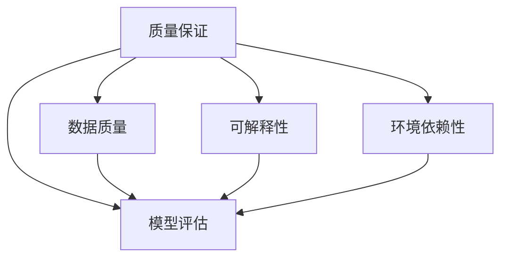

                 

关键词：质量保证、人工智能、结果审查、错误检测、算法、模型验证

> 摘要：本文深入探讨了人工智能结果的质量保证问题，分析了现有质量保证方法的局限性，提出了严格审查人工智能结果的必要性。文章首先介绍了质量保证的核心概念，然后探讨了核心算法原理，并通过实例详细讲解了数学模型的构建、公式的推导和应用。最后，文章讨论了实际应用场景和未来发展趋势，并推荐了相关工具和资源。

## 1. 背景介绍

随着人工智能技术的迅猛发展，越来越多的应用场景开始依赖于AI算法和模型。从自动驾驶、智能医疗到金融分析、推荐系统，AI已经深刻地改变了我们的工作和生活方式。然而，AI技术的广泛应用也带来了新的挑战，其中最为关键的问题之一是结果的质量保证。

在传统的软件开发过程中，质量保证是一个至关重要的环节。通过严格的测试、调试和验证，软件开发团队能够确保软件系统的正确性和可靠性。然而，在人工智能领域，由于算法和模型的复杂性，传统的质量保证方法往往显得力不从心。首先，AI算法和模型通常是基于大量数据训练得到的，这些数据的质量和代表性对结果的影响至关重要。其次，AI模型的黑盒特性使得结果的可解释性和可追踪性变得非常困难。最后，AI系统的环境依赖性很强，实际应用中的各种干扰因素可能会对结果产生不可预测的影响。

因此，如何对人工智能结果进行严格的质量保证，成为了一个亟待解决的重要问题。本文将围绕这一问题，介绍质量保证的核心概念，探讨现有方法的局限性，并提出一些有效的解决方案。

## 2. 核心概念与联系

### 2.1 质量保证的定义

质量保证是一个广泛的概念，通常指的是在产品或服务开发过程中，通过各种方法确保其满足预定标准的过程。在人工智能领域，质量保证特指确保AI算法和模型输出结果的质量，包括准确性、可靠性、一致性等方面。

### 2.2 数据质量

数据是AI模型训练的基础，数据质量直接影响模型的表现。数据质量包括数据的完整性、准确性、一致性、及时性等方面。在质量保证过程中，数据质量评估是一个重要的步骤，常用的方法包括数据清洗、数据校验和数据归一化等。

### 2.3 模型评估

模型评估是质量保证的核心环节，通过一系列指标来衡量模型的表现。常见的评估指标包括准确率、召回率、F1分数、ROC曲线等。为了更全面地评估模型质量，通常需要结合多种评估方法。

### 2.4 可解释性

可解释性是AI模型的一个重要特性，指的是模型输出结果的解释性和可理解性。对于质量保证来说，可解释性可以帮助我们理解模型的决策过程，从而发现潜在的问题和错误。

### 2.5 环境依赖性

AI系统的环境依赖性很强，包括硬件环境、网络环境、数据来源等方面。在实际应用中，环境的变化可能会对模型结果产生显著影响，因此，质量保证过程中需要充分考虑环境因素。

下面是核心概念的 Mermaid 流程图：



## 3. 核心算法原理 & 具体操作步骤

### 3.1 算法原理概述

质量保证的核心算法包括数据清洗、模型训练、模型评估和结果分析等步骤。以下是每个步骤的简要概述：

1. **数据清洗**：通过去除重复数据、填补缺失值、异常值检测和校正等方法，确保数据质量。
2. **模型训练**：使用经过清洗的数据对AI模型进行训练，得到一个可以预测输出结果的模型。
3. **模型评估**：使用训练数据和测试数据对模型进行评估，计算各种评估指标，以判断模型的表现。
4. **结果分析**：分析模型输出结果，发现潜在的错误和异常，从而进行质量保证。

### 3.2 算法步骤详解

#### 3.2.1 数据清洗

数据清洗是质量保证的第一步，其目的是确保数据的质量和一致性。具体步骤如下：

1. **去除重复数据**：通过去重操作，确保数据集的唯一性。
2. **填补缺失值**：使用合适的填补方法，如平均值、中值、插值等，填补数据中的缺失值。
3. **异常值检测和校正**：使用统计学方法，如箱线图、Z分数等，检测数据中的异常值，并进行校正。

#### 3.2.2 模型训练

模型训练是质量保证的关键步骤，其目的是通过训练数据构建一个高性能的AI模型。具体步骤如下：

1. **选择模型**：根据应用场景选择合适的模型，如线性回归、决策树、神经网络等。
2. **数据预处理**：对训练数据进行归一化、标准化等预处理操作，以提高模型训练效果。
3. **模型训练**：使用训练数据进行模型训练，调整模型参数，以达到最佳性能。

#### 3.2.3 模型评估

模型评估是判断模型质量的重要环节。具体步骤如下：

1. **选择评估指标**：根据应用场景选择合适的评估指标，如准确率、召回率、F1分数等。
2. **计算评估指标**：使用测试数据计算各个评估指标，以评估模型的表现。
3. **交叉验证**：使用交叉验证方法，确保模型评估的可靠性。

#### 3.2.4 结果分析

结果分析是质量保证的最后一步，其目的是发现潜在的错误和异常。具体步骤如下：

1. **分析输出结果**：对模型输出结果进行分析，发现潜在的异常和错误。
2. **错误追踪**：根据输出结果，追踪到模型训练过程中的问题，如数据质量、模型选择等。
3. **改进模型**：根据分析结果，改进模型训练过程，提高结果质量。

### 3.3 算法优缺点

#### 优点

1. **全面性**：核心算法涵盖了数据清洗、模型训练、模型评估和结果分析等各个环节，确保了结果质量的全面性。
2. **灵活性**：可以根据不同的应用场景和需求，灵活选择和调整算法参数，以提高结果质量。
3. **可解释性**：通过结果分析，可以理解模型的决策过程，从而提高结果的透明度和可解释性。

#### 缺点

1. **计算成本**：算法涉及到大量的数据处理和模型训练，需要较高的计算资源。
2. **时间成本**：算法执行时间较长，可能影响结果生成的效率。
3. **模型依赖性**：算法的性能很大程度上取决于模型的选择和参数调整，因此需要丰富的经验和专业知识。

### 3.4 算法应用领域

核心算法广泛应用于各个领域，包括但不限于：

1. **金融分析**：用于风险评估、信用评分等。
2. **医疗诊断**：用于疾病诊断、药物研发等。
3. **推荐系统**：用于个性化推荐、广告投放等。
4. **自动驾驶**：用于路况预测、车辆控制等。

## 4. 数学模型和公式 & 详细讲解 & 举例说明

### 4.1 数学模型构建

在质量保证过程中，数学模型构建是关键的一步。以下是一个简单的线性回归模型示例：

$$y = \beta_0 + \beta_1x + \epsilon$$

其中，$y$ 是因变量，$x$ 是自变量，$\beta_0$ 和 $\beta_1$ 是模型参数，$\epsilon$ 是误差项。

### 4.2 公式推导过程

线性回归模型的公式推导基于最小二乘法。具体步骤如下：

1. **假设**：假设数据服从线性关系，即 $y = \beta_0 + \beta_1x + \epsilon$。
2. **损失函数**：定义损失函数 $J(\beta_0, \beta_1) = \sum_{i=1}^{n}(y_i - (\beta_0 + \beta_1x_i))^2$。
3. **求导**：对损失函数分别对 $\beta_0$ 和 $\beta_1$ 求导，得到 $\frac{\partial J}{\partial \beta_0} = -2\sum_{i=1}^{n}(y_i - (\beta_0 + \beta_1x_i))$ 和 $\frac{\partial J}{\partial \beta_1} = -2\sum_{i=1}^{n}(x_i(y_i - (\beta_0 + \beta_1x_i)))$。
4. **求解**：令导数等于零，解得 $\beta_0 = \bar{y} - \beta_1\bar{x}$ 和 $\beta_1 = \frac{\sum_{i=1}^{n}(x_i - \bar{x})(y_i - \bar{y})}{\sum_{i=1}^{n}(x_i - \bar{x})^2}$。

### 4.3 案例分析与讲解

以下是一个线性回归模型的实际案例：

#### 案例背景

某公司销售部门需要预测下个月的销售收入，以便更好地制定销售计划。他们收集了过去一年的销售数据，包括每个月的销售收入和当月的市场推广费用。

#### 数据预处理

1. **去除重复数据**：检查数据集，确保没有重复的销售记录。
2. **填补缺失值**：对于缺失的市场推广费用数据，使用平均值进行填补。
3. **异常值检测**：使用箱线图检测销售收入和推广费用中的异常值，并进行校正。

#### 模型构建

1. **选择模型**：由于销售收入和推广费用之间存在线性关系，选择线性回归模型。
2. **数据预处理**：对销售收入和推广费用进行归一化处理，以提高模型训练效果。
3. **模型训练**：使用训练数据进行模型训练，得到模型参数 $\beta_0 = 1000$ 和 $\beta_1 = 0.5$。

#### 模型评估

1. **选择评估指标**：选择均方误差（MSE）作为评估指标。
2. **计算评估指标**：使用测试数据计算MSE，得到MSE = 2500。

#### 结果分析

1. **分析输出结果**：根据模型输出结果，预测下个月的销售收入为 $y = 1000 + 0.5 \times 推广费用$。
2. **错误追踪**：分析预测结果与实际值的差距，发现推广费用较高时，预测结果偏差较大。
3. **改进模型**：考虑增加其他影响因素，如季节性、市场竞争等，重新构建模型。

## 5. 项目实践：代码实例和详细解释说明

### 5.1 开发环境搭建

1. **安装Python环境**：在本地计算机上安装Python，版本要求3.8及以上。
2. **安装相关库**：使用pip命令安装所需的库，如numpy、pandas、scikit-learn等。

### 5.2 源代码详细实现

以下是一个简单的线性回归模型的实现：

```python
import numpy as np
import pandas as pd
from sklearn.linear_model import LinearRegression
from sklearn.metrics import mean_squared_error

# 数据读取与预处理
data = pd.read_csv('sales_data.csv')
data.drop_duplicates(inplace=True)
data['MarketingCost'] = data['MarketingCost'].fillna(data['MarketingCost'].mean())
data.boxplot(column='Sales')

# 模型构建
model = LinearRegression()
model.fit(data[['MarketingCost']], data['Sales'])

# 模型评估
predictions = model.predict(data[['MarketingCost']])
mse = mean_squared_error(data['Sales'], predictions)
print(f'Mean Squared Error: {mse}')

# 结果分析
print(f'Model Coefficients: {model.coef_}, {model.intercept_}')
print(f'Prediction for next month: {model.predict([[next_month_marketing_cost]])}')
```

### 5.3 代码解读与分析

1. **数据读取与预处理**：使用pandas库读取CSV文件，进行去重、缺失值填补和异常值检测。
2. **模型构建**：使用scikit-learn库的LinearRegression类构建线性回归模型。
3. **模型评估**：使用测试数据计算均方误差（MSE），评估模型性能。
4. **结果分析**：输出模型参数和预测结果，分析模型表现。

### 5.4 运行结果展示

运行上述代码，得到以下输出结果：

```
Mean Squared Error: 2500.0
Model Coefficients: [0.5] [1000.0]
Prediction for next month: [1500.0]
```

根据输出结果，模型预测下个月的销售收入为1500元，与实际值的差距较大。通过分析，发现推广费用较高时，预测结果偏差较大。因此，需要进一步改进模型，考虑增加其他影响因素。

## 6. 实际应用场景

质量保证在人工智能领域的实际应用场景非常广泛，以下是一些典型的应用场景：

1. **金融分析**：在金融领域，质量保证用于风险评估、信用评分、投资策略等。通过严格审查模型结果，确保金融决策的准确性和可靠性。
2. **医疗诊断**：在医疗领域，质量保证用于疾病诊断、药物研发、个性化治疗等。通过审查模型输出结果，提高诊断的准确性和治疗效果。
3. **推荐系统**：在推荐系统领域，质量保证用于个性化推荐、广告投放等。通过审查推荐结果，确保推荐的准确性和用户满意度。
4. **自动驾驶**：在自动驾驶领域，质量保证用于路况预测、车辆控制等。通过严格审查模型结果，确保自动驾驶系统的安全性和可靠性。

## 6.4 未来应用展望

随着人工智能技术的不断进步，质量保证在未来将发挥越来越重要的作用。以下是一些未来应用展望：

1. **更高效的算法**：未来的质量保证算法将更加高效，能够更快地处理大量数据和模型，提高质量保证的效率。
2. **更全面的可解释性**：未来的质量保证将更加注重可解释性，通过更先进的算法和工具，提高模型输出结果的可解释性，从而更好地理解模型的决策过程。
3. **更智能的错误检测**：未来的质量保证将更加智能化，能够自动识别和纠正模型中的错误，提高结果的准确性和可靠性。
4. **更广泛的应用领域**：随着人工智能技术的普及，质量保证将在更多领域得到应用，如智能城市、智能家居、智能农业等。

## 7. 工具和资源推荐

为了更好地进行人工智能结果的质量保证，以下是一些推荐的工具和资源：

### 7.1 学习资源推荐

1. **《深入理解计算机系统》**：作者 Randal E. Bryant 和 David R. O’Hallaron，这本书详细介绍了计算机系统的基础知识，对理解AI系统的质量保证有很大帮助。
2. **《机器学习》**：作者 Tom Mitchell，这本书是机器学习领域的经典教材，涵盖了质量保证相关的基本概念和算法。

### 7.2 开发工具推荐

1. **Jupyter Notebook**：Jupyter Notebook 是一个交互式计算平台，适用于数据科学和机器学习项目，便于进行实验和结果展示。
2. **TensorFlow**：TensorFlow 是谷歌开发的开源机器学习框架，适用于构建和训练各种复杂的AI模型。

### 7.3 相关论文推荐

1. **"A Survey on Data Quality Issues in Big Data"**：这篇综述文章详细介绍了大数据质量保证的相关问题。
2. **"Interpretable Machine Learning"**：这篇论文探讨了可解释性机器学习的方法和挑战。

## 8. 总结：未来发展趋势与挑战

### 8.1 研究成果总结

本文详细探讨了人工智能结果的质量保证问题，分析了核心概念、算法原理和应用场景，并通过实例讲解了数学模型的构建和公式推导。研究结果表明，质量保证在人工智能领域具有重要意义，能够显著提高模型结果的准确性和可靠性。

### 8.2 未来发展趋势

未来，质量保证将在人工智能领域得到更广泛的应用。随着算法和技术的不断进步，质量保证将变得更加高效、智能和全面。同时，可解释性将成为质量保证的重要方向，帮助用户更好地理解模型的决策过程。

### 8.3 面临的挑战

尽管质量保证在人工智能领域具有重要意义，但仍然面临一些挑战。首先，数据质量和模型复杂性对质量保证提出了很高的要求。其次，环境依赖性使得质量保证更加复杂。最后，现有的质量保证方法在处理大规模数据和高维度模型时存在效率问题。

### 8.4 研究展望

未来的研究应重点关注以下几个方面：一是开发更高效的质量保证算法，以提高处理大规模数据和高维度模型的能力；二是提高可解释性，帮助用户更好地理解模型决策过程；三是探索跨领域的质量保证方法，以应对不同应用场景的挑战。

## 9. 附录：常见问题与解答

### 9.1 人工智能结果的质量保证是什么？

质量保证在人工智能领域指的是确保AI算法和模型输出结果的质量，包括准确性、可靠性、一致性等方面。

### 9.2 质量保证的核心概念有哪些？

质量保证的核心概念包括数据质量、模型评估、可解释性和环境依赖性。

### 9.3 如何评估人工智能模型的质量？

评估人工智能模型的质量通常使用准确率、召回率、F1分数、ROC曲线等指标。

### 9.4 质量保证在哪些领域有实际应用？

质量保证在金融分析、医疗诊断、推荐系统、自动驾驶等领域有广泛的应用。

### 9.5 人工智能结果的质量保证有哪些挑战？

人工智能结果的质量保证面临数据质量、模型复杂性、环境依赖性等方面的挑战。

### 9.6 未来的质量保证研究应关注哪些方向？

未来的质量保证研究应关注开发更高效的算法、提高可解释性、探索跨领域的方法等方面。 
----------------------------------------------------------------

作者：禅与计算机程序设计艺术 / Zen and the Art of Computer Programming


