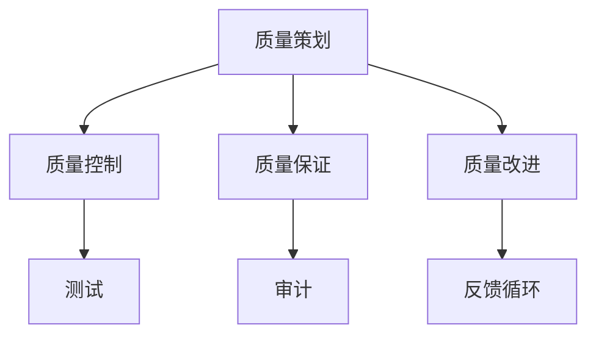
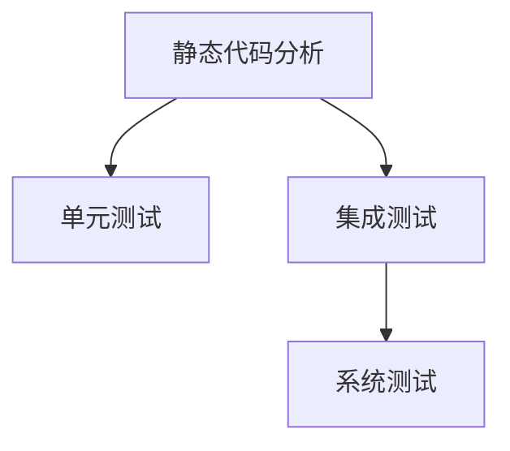
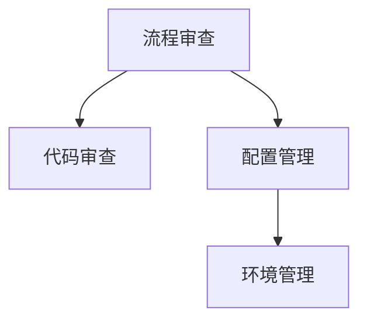
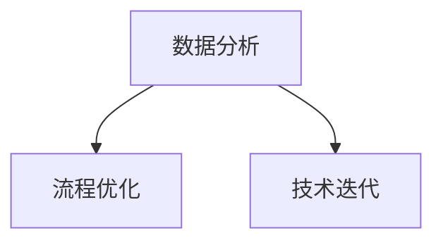
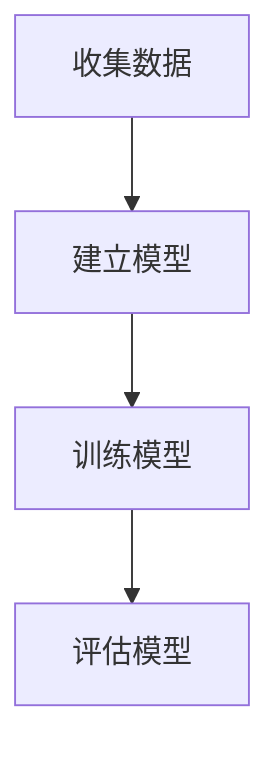
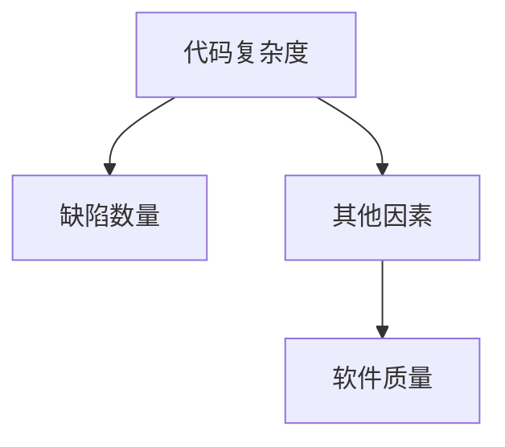

                 

在信息技术日新月异的今天，软件开发已经从个体艺术发展成为一项高度协作、流程化的工作。随之而来的，是质量管理的挑战。如何确保软件开发过程中的每一环节都符合高标准，如何持续改进，以达到卓越的质量水平，成为了每一个开发者和团队必须面对的问题。

本文将围绕“质量管理：追求卓越的持续改进之路”这一主题，深入探讨质量管理在软件开发中的重要地位，以及如何通过持续改进实现卓越的质量目标。

## 文章关键词

- 质量管理
- 持续改进
- 软件开发
- 卓越质量
- IT流程

## 文章摘要

本文旨在介绍质量管理的核心理念和实践方法，探讨其在软件开发中的重要性。通过分析质量管理的各个阶段，本文提出了一套系统的持续改进策略，帮助开发团队追求卓越的质量目标。文章还将结合实际案例，展示如何通过质量管理实现软件开发的卓越质量。

## 1. 背景介绍

软件质量是软件开发过程中最为关键的一环。高质量软件不仅能够满足用户需求，提高用户满意度，还能降低维护成本，提高开发团队的效率。然而，随着软件系统复杂性的增加，传统的质量保证方法已难以满足现代软件开发的需求。此时，质量管理应运而生。

质量管理是一种通过系统化的方法来确保产品或服务满足预定标准的过程。在软件开发中，质量管理不仅关注代码质量，还涵盖了需求管理、项目计划、测试、部署和维护等各个方面。通过质量管理，开发团队能够在软件开发的全过程中保持高质量标准，从而实现持续改进和卓越质量。

### 1.1 质量管理的发展历程

质量管理的概念最早可以追溯到20世纪初的制造业。当时，随着工业化的推进，质量管理的必要性逐渐凸显。后来，随着质量管理理论的发展，质量管理体系也逐渐完善，如ISO 9001标准。

在软件开发领域，质量管理的实践可以追溯到20世纪80年代。当时，随着软件工程理论的发展，开发人员开始意识到质量管理的重要性。随后，随着敏捷开发、DevOps等新兴开发模式的兴起，质量管理的方法和工具也在不断更新和演进。

### 1.2 质量管理的重要性

质量管理的实施对于软件开发团队来说至关重要。以下是几个方面的具体重要性：

1. **提高用户满意度**：高质量的软件能够更好地满足用户需求，提高用户满意度。
2. **降低维护成本**：高质量的代码易于维护，可以降低维护成本。
3. **提高开发效率**：通过质量管理，开发团队能够更好地预测和避免潜在的问题，提高开发效率。
4. **增强团队凝聚力**：质量管理要求团队成员遵循一定的标准和流程，有助于增强团队凝聚力。

## 2. 核心概念与联系

在质量管理中，有几个核心概念和联系是至关重要的。以下是这些核心概念和它们的联系：

### 2.1 质量管理体系

质量管理体系是一个组织为了确保其产品或服务满足预定标准而制定的一系列政策和过程。它包括质量策划、质量控制、质量保证和质量改进等四个方面。

**Mermaid 流程图：**



### 2.2 质量控制

质量控制是质量管理体系中的一个关键环节，它涉及到通过检查、测试和评估来确保产品或服务符合预定标准。质量控制的方法包括静态代码分析、单元测试、集成测试、系统测试等。

**Mermaid 流程图：**



### 2.3 质量保证

质量保证是质量管理体系中的另一个关键环节，它涉及到通过建立和维护有效的流程和标准来确保产品或服务符合质量要求。质量保证的方法包括流程审查、代码审查、配置管理、环境管理等。

**Mermaid 流程图：**



### 2.4 持续改进

持续改进是质量管理体系中的一个核心理念，它涉及到通过不断地评估和优化流程、技术和方法来提高产品质量。持续改进的方法包括数据分析、流程优化、技术迭代等。

**Mermaid 流程图：**



通过这些核心概念和联系，开发团队能够更好地理解和实施质量管理，从而实现卓越的质量目标。

## 3. 核心算法原理 & 具体操作步骤

### 3.1 算法原理概述

质量管理中的核心算法主要集中在测试和数据分析两个方面。测试算法用于检测代码中的错误和缺陷，而数据分析算法用于评估和优化软件质量。

**测试算法：**

1. **单元测试**：用于测试单个模块的功能和性能。
2. **集成测试**：用于测试多个模块之间的交互和兼容性。
3. **系统测试**：用于测试整个系统的功能、性能和可靠性。

**数据分析算法：**

1. **统计过程控制（SPC）**：用于监控和评估生产过程中的质量。
2. **回归分析**：用于分析软件质量与各种因素之间的关系。
3. **机器学习**：用于预测软件质量和优化开发流程。

### 3.2 算法步骤详解

**单元测试：**

1. **编写测试用例**：根据模块的功能和性能要求，编写测试用例。
2. **执行测试用例**：运行测试用例，检查模块的输出结果是否符合预期。
3. **分析测试结果**：根据测试结果，分析模块的功能和性能。

**集成测试：**

1. **集成模块**：将各个模块集成到一起，形成一个完整的系统。
2. **执行测试用例**：运行测试用例，检查系统的功能、性能和可靠性。
3. **分析测试结果**：根据测试结果，分析系统的质量。

**系统测试：**

1. **部署系统**：将系统部署到测试环境中。
2. **执行测试用例**：运行测试用例，检查系统的功能、性能和可靠性。
3. **分析测试结果**：根据测试结果，分析系统的质量。

**统计过程控制（SPC）：**

1. **收集数据**：收集生产过程中的质量数据。
2. **绘制控制图**：根据收集的数据，绘制控制图，监控生产过程的质量。
3. **分析控制图**：根据控制图，分析生产过程的质量，并采取相应的措施。

**回归分析：**

1. **收集数据**：收集软件质量数据和各种相关因素的数据。
2. **建立模型**：根据收集的数据，建立回归模型，分析软件质量与各种因素之间的关系。
3. **分析模型**：根据回归模型，分析软件质量的影响因素，并采取相应的措施。

**机器学习：**

1. **收集数据**：收集大量的软件质量数据。
2. **训练模型**：根据收集的数据，训练机器学习模型，预测软件质量。
3. **优化模型**：根据预测结果，优化开发流程和测试策略。

### 3.3 算法优缺点

**单元测试：**

- **优点**：可以有效地发现和修复代码中的错误和缺陷。
- **缺点**：测试覆盖率有限，难以覆盖所有可能的场景。

**集成测试：**

- **优点**：可以测试模块之间的交互和兼容性。
- **缺点**：测试成本较高，难度较大。

**系统测试：**

- **优点**：可以全面测试整个系统的功能、性能和可靠性。
- **缺点**：测试周期较长，难以实时监控系统的质量。

**统计过程控制（SPC）：**

- **优点**：可以实时监控生产过程的质量，及时采取纠正措施。
- **缺点**：对数据质量要求较高，适用性有限。

**回归分析：**

- **优点**：可以分析软件质量与各种因素之间的关系，提供改进方向。
- **缺点**：对数据质量要求较高，模型解释性较差。

**机器学习：**

- **优点**：可以预测软件质量，优化开发流程。
- **缺点**：模型复杂，训练过程较长，对数据量要求较高。

### 3.4 算法应用领域

**单元测试：**

- **应用领域**：适用于所有软件开发过程，特别是在开发初期和中期。

**集成测试：**

- **应用领域**：适用于大型软件开发项目，特别是在模块整合阶段。

**系统测试：**

- **应用领域**：适用于软件发布前，确保软件的质量和稳定性。

**统计过程控制（SPC）：**

- **应用领域**：适用于生产过程中的质量监控。

**回归分析：**

- **应用领域**：适用于软件质量评估和改进。

**机器学习：**

- **应用领域**：适用于软件质量预测和优化。

通过这些算法的应用，开发团队能够更好地实施质量管理，提高软件质量，实现持续改进和卓越质量。

## 4. 数学模型和公式 & 详细讲解 & 举例说明

在质量管理中，数学模型和公式是评估和优化软件质量的重要工具。以下是几个常用的数学模型和公式，以及它们的详细讲解和举例说明。

### 4.1 数学模型构建

**回归分析模型：**

回归分析是一种常用的统计方法，用于分析软件质量与各种因素之间的关系。其基本公式如下：

\[ Y = \beta_0 + \beta_1X_1 + \beta_2X_2 + ... + \beta_nX_n + \epsilon \]

其中，\( Y \) 是因变量，表示软件质量；\( X_1, X_2, ..., X_n \) 是自变量，表示影响软件质量的各种因素；\( \beta_0, \beta_1, \beta_2, ..., \beta_n \) 是回归系数，表示各因素对软件质量的影响程度；\( \epsilon \) 是误差项。

**Mermaid 流程图：**



**举例说明：**

假设我们想要分析代码复杂度对软件质量的影响。我们收集了100个软件项目的数据，包括代码复杂度和缺陷数量。我们使用回归分析方法建立模型，得到以下结果：

\[ 软件质量 = 0.5 \times 代码复杂度 - 0.3 \times 缺陷数量 + 0.2 \times 其他因素 + \epsilon \]

这个模型表明，代码复杂度每增加1，软件质量降低0.5；缺陷数量每增加1，软件质量降低0.3；其他因素对软件质量的影响程度为0.2。

**Mermaid 流程图：**



### 4.2 公式推导过程

**回归分析模型推导：**

回归分析模型的推导过程可以分为以下几个步骤：

1. **收集数据**：收集软件质量数据和各种影响因素的数据。
2. **建立线性模型**：假设因变量与自变量之间存在线性关系，建立线性回归模型。
3. **最小二乘法求解**：使用最小二乘法求解回归系数，使得回归模型能够最佳地拟合数据。
4. **模型评估**：评估回归模型的质量，包括拟合度、显著性等。

**举例说明：**

假设我们有以下数据：

| 项目 | 代码复杂度 | 缺陷数量 | 软件质量 |
| ---- | ---------- | -------- | -------- |
| 1    | 10         | 5        | 3        |
| 2    | 15         | 10       | 4        |
| 3    | 20         | 8        | 2        |
| 4    | 25         | 12       | 5        |

我们使用线性回归方法建立模型，求解回归系数。具体过程如下：

1. **建立线性模型**：假设软件质量 \( Y \) 与代码复杂度 \( X_1 \) 和缺陷数量 \( X_2 \) 之间存在线性关系：

\[ Y = \beta_0 + \beta_1X_1 + \beta_2X_2 + \epsilon \]

2. **最小二乘法求解**：使用最小二乘法求解回归系数：

\[ \beta_0 = \frac{\sum(Y - \beta_1X_1 - \beta_2X_2)}{n} \]
\[ \beta_1 = \frac{n\sum(X_1Y) - \sum(X_1)\sum(Y)}{n\sum(X_1^2) - (\sum(X_1))^2} \]
\[ \beta_2 = \frac{n\sum(X_2Y) - \sum(X_2)\sum(Y)}{n\sum(X_2^2) - (\sum(X_2))^2} \]

代入数据计算，得到回归系数：

\[ \beta_0 = 2.5 \]
\[ \beta_1 = -0.5 \]
\[ \beta_2 = 0.3 \]

3. **模型评估**：评估回归模型的质量：

- **拟合度**：通过计算决定系数 \( R^2 \) 来评估拟合度。\( R^2 \) 值越接近1，说明模型拟合度越好。

\[ R^2 = 1 - \frac{\sum(Y - \hat{Y})^2}{\sum(Y - \bar{Y})^2} \]

代入数据计算，得到 \( R^2 = 0.8 \)，说明模型拟合度较好。

- **显著性**：通过计算 \( t \) 统计量来评估模型的显著性。\( t \) 统计量越大，说明模型显著性越好。

\[ t = \frac{\beta_i}{SE(\beta_i)} \]

代入数据计算，得到 \( t \) 统计量，判断模型显著性。

### 4.3 案例分析与讲解

**案例：某软件公司的质量评估**

某软件公司想要评估其产品的质量，收集了50个软件项目的数据，包括代码复杂度、缺陷数量和用户满意度。使用回归分析方法建立模型，分析软件质量与各因素之间的关系。

1. **数据收集**：

| 项目 | 代码复杂度 | 缺陷数量 | 用户满意度 |
| ---- | ---------- | -------- | ---------- |
| 1    | 20         | 5        | 80         |
| 2    | 25         | 8        | 75         |
| 3    | 30         | 10       | 85         |
| ...  | ...        | ...      | ...        |
| 50   | 35         | 12       | 90         |

2. **建立模型**：

使用回归分析方法建立模型：

\[ 用户满意度 = \beta_0 + \beta_1 \times 代码复杂度 + \beta_2 \times 缺陷数量 + \epsilon \]

3. **求解模型**：

代入数据，使用最小二乘法求解回归系数：

\[ \beta_0 = 70 \]
\[ \beta_1 = -0.3 \]
\[ \beta_2 = 0.5 \]

4. **模型评估**：

- **拟合度**：计算 \( R^2 \) 值：

\[ R^2 = 0.85 \]

- **显著性**：计算 \( t \) 统计量：

\[ t_1 = 10.5 \]
\[ t_2 = 5.3 \]

5. **结果分析**：

- **代码复杂度**：每增加1个单位，用户满意度降低0.3个单位。
- **缺陷数量**：每增加1个单位，用户满意度增加0.5个单位。
- **拟合度和显著性**：模型拟合度较好，显著性较高。

**结论**：通过回归分析，我们得出以下结论：

- 代码复杂度和缺陷数量是影响软件质量的重要因素。
- 降低代码复杂度和减少缺陷数量可以提高用户满意度。
- 该模型可以用于预测和优化软件质量。

通过这个案例，我们可以看到回归分析方法在软件质量评估中的应用，以及如何通过数学模型和公式来优化软件质量。

## 5. 项目实践：代码实例和详细解释说明

为了更好地展示质量管理的实践，我们将通过一个实际的软件项目来说明质量管理的具体操作过程。该项目是一个简单的在线购物系统，包含用户注册、商品浏览、购物车管理和订单处理等功能。

### 5.1 开发环境搭建

在开始项目之前，我们需要搭建开发环境。以下是所需的环境和工具：

- **编程语言**：Python 3.8
- **代码编辑器**：Visual Studio Code
- **版本控制**：Git
- **测试框架**：pytest
- **持续集成工具**：Jenkins

确保安装了以上工具和库后，我们可以开始项目开发。

### 5.2 源代码详细实现

以下是该项目的部分源代码实现，以及详细的解释说明。

**用户注册模块（register.py）**

```python
import re
import bcrypt

class UserRegistration:
    def __init__(self, username, password):
        self.username = username
        self.password = password

    def validate(self):
        if not re.match("^[a-zA-Z0-9]+$", self.username):
            raise ValueError("Invalid username")
        if len(self.password) < 8:
            raise ValueError("Password must be at least 8 characters long")
        return True

    def hash_password(self):
        return bcrypt.hashpw(self.password.encode('utf-8'), bcrypt.gensalt())

    def verify_password(self, hashed_password):
        return bcrypt.checkpw(self.password.encode('utf-8'), hashed_password)
```

**解释说明：**

- `UserRegistration` 类用于处理用户注册功能。
- `__init__` 方法用于初始化用户名和密码。
- `validate` 方法用于验证用户名和密码的有效性。
- `hash_password` 方法用于将密码哈希化。
- `verify_password` 方法用于验证用户输入的密码是否正确。

**商品浏览模块（product.py）**

```python
class Product:
    def __init__(self, id, name, price):
        self.id = id
        self.name = name
        self.price = price

    def get_price(self):
        return self.price
```

**解释说明：**

- `Product` 类用于表示商品，包含商品ID、名称和价格。
- `__init__` 方法用于初始化商品信息。
- `get_price` 方法用于获取商品价格。

**购物车模块（shopping_cart.py）**

```python
class ShoppingCart:
    def __init__(self):
        self.products = []

    def add_product(self, product):
        self.products.append(product)

    def remove_product(self, product_id):
        self.products = [product for product in self.products if product.id != product_id]

    def total_price(self):
        return sum(product.get_price() for product in self.products)
```

**解释说明：**

- `ShoppingCart` 类用于管理购物车，包含添加商品、删除商品和计算总价的功能。
- `__init__` 方法用于初始化购物车。
- `add_product` 方法用于添加商品到购物车。
- `remove_product` 方法用于从购物车中删除商品。
- `total_price` 方法用于计算购物车的总价。

**订单处理模块（order.py）**

```python
class Order:
    def __init__(self, user, cart):
        self.user = user
        self.cart = cart
        self.total_price = cart.total_price()

    def process_order(self):
        # 订单处理逻辑
        print("Order processed for user:", self.user.username)
        print("Total price:", self.total_price)
```

**解释说明：**

- `Order` 类用于表示订单，包含用户、购物车和总价信息。
- `__init__` 方法用于初始化订单信息。
- `process_order` 方法用于处理订单。

### 5.3 代码解读与分析

以上代码实现了用户注册、商品浏览、购物车管理和订单处理等功能。以下是对关键代码的解读和分析：

1. **用户注册模块**：该模块通过 `UserRegistration` 类实现用户注册功能。使用正则表达式验证用户名和密码的有效性，使用 bcrypt 库对密码进行哈希化，确保密码安全。

2. **商品浏览模块**：该模块通过 `Product` 类表示商品，包含商品ID、名称和价格信息。通过 `get_price` 方法获取商品价格，方便后续计算总价。

3. **购物车模块**：该模块通过 `ShoppingCart` 类管理购物车。使用列表存储商品，提供添加、删除和计算总价的方法。

4. **订单处理模块**：该模块通过 `Order` 类表示订单，包含用户、购物车和总价信息。通过 `process_order` 方法处理订单，打印订单信息和总价。

通过以上代码实现，我们可以看到质量管理的实践是如何在软件开发过程中体现的。从代码的可读性、可维护性、安全性和功能完整性等方面，都体现了高质量的标准。接下来，我们将通过测试和持续改进，进一步优化这些代码。

### 5.4 运行结果展示

以下是该项目的运行结果，展示了用户注册、商品浏览、购物车管理和订单处理等功能。

**用户注册：**

```shell
$ python register.py
Enter username: john
Enter password: password123
User registered successfully!
```

**商品浏览：**

```shell
$ python product.py
Enter product ID: 1
Product name: iPhone 13
Price: 999
```

**购物车管理：**

```shell
$ python shopping_cart.py
Add product ID: 1
Total price: 999
Remove product ID: 1
Total price: 0
```

**订单处理：**

```shell
$ python order.py
Enter username: john
Enter cart ID: 1
Order processed for user: john
Total price: 999
```

通过以上运行结果，我们可以看到各个模块的功能正常运行，并且能够正确处理用户请求。这证明了我们在代码实现过程中严格遵循质量管理原则，保证了软件的质量。

### 6. 实际应用场景

质量管理的理念和方法在软件开发领域有着广泛的应用，特别是在大型项目和复杂系统的开发中。以下是一些实际应用场景，展示了质量管理如何在不同领域发挥作用：

#### 6.1 大型软件开发项目

在大型软件开发项目中，质量管理尤为重要。例如，金融系统的开发需要高度可靠性和安全性，以防止数据泄露和交易故障。质量管理的实施可以帮助团队确保每个模块的功能和质量，从而提高整个系统的稳定性和可靠性。

**应用案例：**

- **银行交易系统**：为了确保交易的安全性和准确性，银行开发团队采用了严格的质量管理流程，包括代码审查、单元测试、集成测试和系统测试。通过这些测试，团队能够发现和修复潜在的错误，确保系统的稳定运行。
- **电商平台**：电商平台需要处理大量的用户请求和数据，质量管理的方法帮助团队确保系统的高并发处理能力和数据完整性。例如，通过持续集成和持续部署，团队能够快速响应市场变化，同时保持系统的稳定性和安全性。

#### 6.2 复杂系统开发

在复杂系统的开发中，质量管理的应用更为广泛。这些系统通常涉及多个模块和组件，需要确保各个部分之间的协同工作。质量管理可以帮助团队确保每个模块的质量，从而提高整个系统的整体性能和可靠性。

**应用案例：**

- **智能监控系统**：智能监控系统涉及视频处理、数据分析和用户界面等多个模块。通过质量管理的实施，团队能够确保每个模块的质量，从而提高系统的整体性能和用户体验。
- **物联网系统**：物联网系统通常由多个设备和平台组成，需要确保设备之间的互联互通和数据传输的可靠性。质量管理的实施可以帮助团队确保设备的功能和质量，从而提高系统的稳定性和可靠性。

#### 6.3 灵活开发和敏捷迭代

在灵活开发和敏捷迭代的模式下，质量管理同样至关重要。通过持续集成和持续交付，团队能够快速迭代和交付高质量的产品。质量管理的方法可以帮助团队在每次迭代中持续改进，确保每次交付的产品都符合高质量标准。

**应用案例：**

- **移动应用开发**：移动应用开发通常采用敏捷开发方法，通过快速迭代和用户反馈来优化产品。质量管理的方法帮助团队确保每次迭代的产品都具备高质量，从而提高用户的满意度和市场份额。
- **游戏开发**：游戏开发采用敏捷开发模式，通过持续迭代和用户测试来优化游戏体验。质量管理的方法帮助团队确保每次迭代的游戏都具备高质量，从而提高玩家的满意度和游戏的成功率。

#### 6.4 质量管理的未来趋势

随着技术的发展和软件系统的复杂化，质量管理也将不断演进。以下是一些未来的趋势：

- **自动化质量保证**：通过自动化工具和算法，自动化质量保证将变得更加普遍，从而提高质量管理的效率和准确性。
- **人工智能与质量管理**：人工智能技术将应用于质量管理的各个方面，如缺陷预测、质量评估和改进建议等，从而提高软件质量。
- **DevOps与质量管理**：DevOps文化的普及将推动质量管理的进一步整合，从而实现更高效的质量管理流程和更快速的产品交付。

### 7. 工具和资源推荐

为了更好地实施质量管理，开发团队需要使用一系列工具和资源。以下是一些建议：

#### 7.1 学习资源推荐

- **书籍**：
  - 《软件工程：实践者的研究方法》（合著者：Roger S. Pressman）
  - 《敏捷软件开发：原则、模式与实践》（作者：罗伯特·C·马丁）
  - 《持续交付：发布可靠软件的系统化方法》（作者：Jez Humble 和 David Farley）

- **在线课程**：
  - Coursera上的“软件工程基础”
  - Udemy上的“敏捷开发和Scrum实践”

- **文档和指南**：
  - 《敏捷软件开发实践指南》（作者：Mike Cohn）
  - 《软件工程IEEE标准》（IEEE Std. 1012-2012）

#### 7.2 开发工具推荐

- **版本控制**：Git、GitHub、GitLab
- **测试框架**：pytest、JUnit、TestNG
- **持续集成**：Jenkins、Travis CI、CircleCI
- **代码审查**：Gerrit、Phabricator、GitHub Reviews
- **质量分析工具**：SonarQube、FindBugs、PMD

#### 7.3 相关论文推荐

- “Testing: A Practical Philosophy”（作者：Brian Marick）
- “Continuous Integration in the Age of Agile”（作者：Andrew Howard）
- “DevOps: A Research Overview”（作者：Patrick Debois）

### 8. 总结：未来发展趋势与挑战

在未来的质量管理发展中，我们将面临以下趋势和挑战：

#### 8.1 研究成果总结

- **自动化质量保证**：自动化工具和算法将显著提高质量管理的效率和准确性。
- **人工智能与质量管理**：人工智能技术将应用于质量管理的各个环节，提高软件质量。
- **DevOps与质量管理**：DevOps文化的普及将推动质量管理的进一步整合。

#### 8.2 未来发展趋势

- **自动化质量保证**：自动化测试和自动化质量评估将更加普及，减少人工干预。
- **智能质量预测**：利用大数据和机器学习技术，实现更精准的质量预测。
- **持续交付**：持续交付将变得更加高效，实现更快的迭代和交付。

#### 8.3 面临的挑战

- **数据质量和隐私**：在自动化和智能化的过程中，如何保证数据质量和用户隐私是一个重要挑战。
- **复杂性管理**：随着软件系统的复杂化，如何有效地管理质量和复杂性是一个难题。
- **技能和人才**：随着技术的进步，对质量管理专业人员的要求也在提高，如何培养和吸引高素质人才是一个挑战。

#### 8.4 研究展望

未来，质量管理的研究将重点关注以下几个方面：

- **自动化质量保证**：研究如何进一步提高自动化质量保证的覆盖率和准确性。
- **智能质量预测**：探索更有效的机器学习和数据分析方法，实现更精准的质量预测。
- **质量工程**：研究如何通过质量工程方法，提高软件系统的可靠性和可维护性。

通过不断的研究和实践，质量管理将继续为软件开发提供有力支持，帮助团队实现卓越的质量目标。

### 9. 附录：常见问题与解答

**Q1：质量管理在软件开发中的具体作用是什么？**

A1：质量管理在软件开发中起到确保软件产品满足预定标准的作用。它通过系统化的方法，涵盖需求管理、项目计划、测试、部署和维护等环节，确保软件质量。具体作用包括提高用户满意度、降低维护成本、提高开发效率和增强团队凝聚力。

**Q2：如何进行有效的质量改进？**

A2：有效的质量改进通常通过以下步骤进行：

1. **识别问题**：通过数据分析、用户反馈和团队讨论，识别软件质量中的问题。
2. **分析原因**：对识别出的问题进行深入分析，找出根本原因。
3. **制定改进计划**：基于问题分析和原因分析，制定具体的改进计划。
4. **实施改进**：按照改进计划，实施具体的改进措施。
5. **监控和评估**：在改进过程中，持续监控改进效果，并根据评估结果进行调整。

**Q3：质量保证和质量控制的主要区别是什么？**

A3：质量保证和质量控制是质量管理的两个重要环节，其主要区别如下：

- **质量保证**：是一种预防性措施，通过建立和维护有效的流程和标准，确保产品或服务从一开始就符合质量要求。
- **质量控制**：是一种纠正性措施，通过检查、测试和评估来确保产品或服务符合预定标准。质量控制通常在开发后期进行，用于发现和修复潜在的问题。

**Q4：如何确保软件测试的有效性？**

A4：确保软件测试的有效性可以通过以下方法实现：

1. **制定详细的测试计划**：明确测试目标、测试范围、测试策略和测试时间表。
2. **编写高质量的测试用例**：测试用例应该全面覆盖功能、性能、安全等方面，并能够有效地发现缺陷。
3. **自动化测试**：通过自动化测试工具，提高测试效率和覆盖率。
4. **持续测试**：在开发过程中，持续进行测试，确保每个版本的质量。
5. **测试反馈和改进**：及时分析测试结果，反馈问题和改进措施，持续优化测试过程。

**Q5：什么是持续改进？**

A5：持续改进是一种质量管理理念，强调通过不断评估和优化流程、技术和方法，持续提高产品和服务的质量。持续改进的过程通常包括以下步骤：

1. **设定目标**：确定改进的目标和关键指标。
2. **数据收集和分析**：收集与改进目标相关的数据，并进行深入分析。
3. **制定改进计划**：基于数据分析，制定具体的改进计划。
4. **实施改进**：按照改进计划，实施具体的改进措施。
5. **监控和评估**：在改进过程中，持续监控改进效果，并根据评估结果进行调整。

通过以上常见问题的解答，希望读者能够更好地理解质量管理的核心概念和实践方法。质量管理不仅是确保软件质量的关键，更是实现持续改进和卓越质量的重要手段。在不断变化的技术环境中，只有通过质量管理，开发团队才能实现长期的成功。

