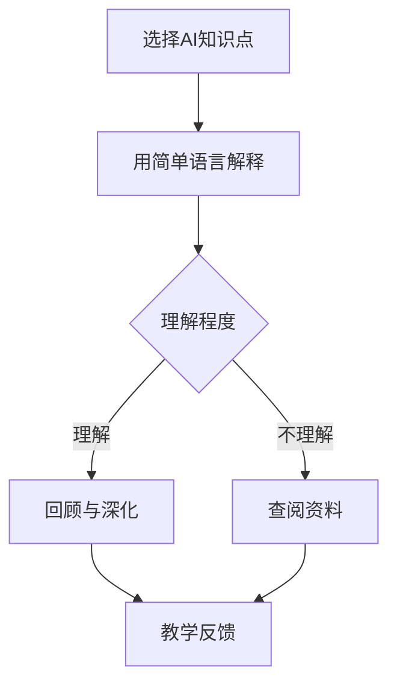

                 

## 1. 背景介绍

在当今快速发展的时代，人工智能（AI）已经成为各个领域的研究热点。从自动驾驶、智能家居到医疗诊断、金融分析，AI技术无处不在。然而，随着AI技术的不断进步，对AI专业人才的需求也在迅速增加。因此，如何有效地进行AI教育，培养出具备扎实理论基础和实际操作能力的人才，成为教育领域的重要课题。

费曼学习法是一种以问题解决为导向的学习方法，由物理学家理查德·费曼提出。该方法强调通过讲解、回顾和简化知识，帮助学习者深入理解和掌握知识点。近年来，随着AI教育的兴起，费曼学习法在AI教育中的应用逐渐受到关注。

本文旨在探讨费曼学习法在AI教育中的应用，分析其优势和应用方法，并结合实际案例进行详细讲解。希望通过本文的研究，为AI教育的实践提供有益的参考和借鉴。

## 2. 核心概念与联系

### 2.1 费曼学习法的基本原理

费曼学习法是一种以问题解决为核心的学习方法，其基本原理可以概括为以下几个步骤：

1. 选择一个概念或知识点。
2. 用最简单的语言解释这个概念或知识点，就好像在向一个完全陌生的人解释一样。
3. 如果在解释过程中遇到困难，回到原始资料中寻找答案。
4. 重复以上步骤，直到能够用简单的语言清楚地解释这个概念或知识点。

### 2.2 费曼学习法与AI教育的联系

费曼学习法与AI教育的结合，主要体现在以下几个方面：

1. **深化理解**：通过讲解，学习者需要用自己的语言重新组织知识，这有助于深化对知识点的理解。
2. **检验学习效果**：通过向他人解释，学习者可以检验自己对知识点的掌握程度，发现并填补知识盲点。
3. **培养表达和沟通能力**：在解释过程中，学习者需要清晰地表达自己的观点，这有助于提高其表达和沟通能力。
4. **理论与实践相结合**：费曼学习法强调将理论知识应用于实际情境，这有助于提高学习者的实际操作能力。

### 2.3 费曼学习法的应用架构

为了更好地在AI教育中应用费曼学习法，我们可以构建一个基于该方法的AI教育架构，如下图所示：



在这个架构中，学习者首先选择一个AI知识点，然后尝试用最简单的语言进行解释。如果能够清晰地解释，说明对知识点有深入的理解；如果无法解释或解释不清楚，则需要回到原始资料中查阅，加深理解。通过反复的讲解和回顾，学习者可以逐步深化对知识点的理解，并形成自己的知识体系。

## 3. 核心算法原理 & 具体操作步骤

### 3.1 算法原理概述

费曼学习法的核心在于通过“讲解”这一行为，促进学习者的深入理解和记忆。具体来说，该方法包含以下几个步骤：

1. **选择知识点**：学习者选择一个需要掌握的AI知识点。
2. **简单解释**：学习者尝试用最简单的语言向他人（如同学、老师或人工智能助手）解释这个知识点。
3. **检验效果**：学习者根据他人反馈，评估自己对知识点的掌握程度。
4. **回顾与深化**：如果发现知识点理解不充分，学习者需要回到原始资料中重新学习和理解。
5. **重复练习**：通过反复的讲解和回顾，学习者逐步深化对知识点的理解，并形成自己的知识体系。

### 3.2 算法步骤详解

1. **选择知识点**：

   首先，学习者需要选择一个需要掌握的AI知识点。这个知识点可以是课程中的某个概念、算法或者应用实例。为了提高效率，学习者可以选择自己最感兴趣或认为最重要的知识点。

2. **简单解释**：

   接下来，学习者尝试用最简单的语言向他人解释这个知识点。这里的关键在于“简单”，即尽量用通俗易懂的语言，避免使用复杂的术语和专业词汇。例如，如果学习者需要解释“神经网络”这一概念，可以简化为：“神经网络是一种模仿人脑结构的计算机算法，用于处理和识别数据。”

3. **检验效果**：

   在解释完毕后，学习者需要根据他人反馈，评估自己对知识点的掌握程度。如果能够清晰地解释，说明对知识点有深入的理解；如果无法解释或解释不清楚，则需要回到原始资料中重新学习和理解。

4. **回顾与深化**：

   如果学习者发现自己对知识点理解不充分，则需要回到原始资料中重新学习和理解。这一过程可以是查阅教材、学术论文、在线教程等，也可以是与老师、同学进行讨论和交流。通过反复的讲解和回顾，学习者可以逐步深化对知识点的理解，并形成自己的知识体系。

5. **重复练习**：

   费曼学习法强调通过重复练习，逐步深化对知识点的理解。学习者可以定期回顾自己已经掌握的知识点，并用简单语言进行解释。这不仅有助于巩固记忆，还可以发现和弥补知识盲点。

### 3.3 算法优缺点

**优点**：

1. **促进深入理解**：通过讲解，学习者需要用自己的语言重新组织知识，这有助于深化对知识点的理解。
2. **检验学习效果**：通过向他人解释，学习者可以检验自己对知识点的掌握程度，发现并填补知识盲点。
3. **培养表达和沟通能力**：在解释过程中，学习者需要清晰地表达自己的观点，这有助于提高其表达和沟通能力。
4. **理论与实践相结合**：费曼学习法强调将理论知识应用于实际情境，这有助于提高学习者的实际操作能力。

**缺点**：

1. **初期效率较低**：由于需要用简单语言进行解释，学习者可能需要花费较长时间来组织和表达。
2. **适用范围有限**：费曼学习法更适合用于理解和记忆抽象的概念和理论，对于具体的编程和操作技能，效果可能不如其他学习方法。

### 3.4 算法应用领域

费曼学习法在AI教育中的应用非常广泛，主要体现在以下几个方面：

1. **理论学习**：在AI课程中，学习者可以使用费曼学习法来理解和记忆各种算法和理论。
2. **项目实践**：在项目实践中，学习者可以通过讲解项目原理和实现细节，来加深对项目的理解和掌握。
3. **团队协作**：在团队项目中，成员之间可以使用费曼学习法来分享知识和经验，提高团队整体能力。
4. **自我提升**：学习者可以定期使用费曼学习法来回顾和巩固已经学过的知识点，提高自我学习能力。

## 4. 数学模型和公式 & 详细讲解 & 举例说明

### 4.1 数学模型构建

在AI教育中，费曼学习法的一个关键应用是帮助学生构建数学模型。数学模型是AI算法的核心，它能够将抽象问题转化为具体的数据处理过程。以下是一个简单的线性回归模型的构建过程：

1. **定义变量**：

   假设我们想要预测房价，定义以下变量：

   - \( x \)：房屋的面积（平方米）
   - \( y \)：房屋的售价（万元）

2. **建立线性关系**：

   我们假设房价与房屋面积之间存在线性关系，即：

   $$ y = wx + b $$

   其中，\( w \) 是斜率，表示面积对售价的影响程度；\( b \) 是截距，表示当面积为0时的售价。

3. **收集数据**：

   收集一组房屋面积和售价的数据，例如：

   | 面积（平方米） | 售价（万元） |
   | :-----------: | :--------: |
   |      100      |     200    |
   |      150      |     300    |
   |      200      |     400    |

4. **计算斜率和截距**：

   使用最小二乘法计算斜率 \( w \) 和截距 \( b \)：

   $$ w = \frac{\sum(x_i - \bar{x})(y_i - \bar{y})}{\sum(x_i - \bar{x})^2} $$
   $$ b = \bar{y} - w\bar{x} $$

   其中，\( \bar{x} \) 和 \( \bar{y} \) 分别是面积和售价的均值。

   例如，对于上述数据，计算得到：

   $$ w = \frac{(100-143.3)(200-266.7) + (150-143.3)(300-266.7) + (200-143.3)(400-266.7)}{(100-143.3)^2 + (150-143.3)^2 + (200-143.3)^2} \approx 1.23 $$
   $$ b = 266.7 - 1.23 \times 143.3 \approx 82.2 $$

   因此，线性回归模型可以表示为：

   $$ y = 1.23x + 82.2 $$

### 4.2 公式推导过程

线性回归模型的建立基于以下假设：

1. **线性关系**：房价与房屋面积之间存在线性关系。
2. **独立同分布**：每个房屋的售价是独立的，且服从正态分布。
3. **最小二乘法**：选择斜率和截距，使得预测误差的平方和最小。

基于这些假设，我们可以推导出最小二乘法的公式。具体推导过程如下：

1. **定义误差**：

   对于每个房屋，定义预测误差 \( e_i = y_i - wx_i - b \)。

2. **计算误差平方和**：

   总误差平方和为：

   $$ S = \sum_{i=1}^n e_i^2 = \sum_{i=1}^n (y_i - wx_i - b)^2 $$

3. **对 \( w \) 和 \( b \) 求导并令其等于0**：

   对 \( S \) 关于 \( w \) 和 \( b \) 求导，并令其等于0，得到：

   $$ \frac{\partial S}{\partial w} = 2\sum_{i=1}^n (y_i - wx_i - b)x_i - 2\sum_{i=1}^n (x_i - \bar{x})(y_i - \bar{y}) = 0 $$
   $$ \frac{\partial S}{\partial b} = 2\sum_{i=1}^n (y_i - wx_i - b) - 2\sum_{i=1}^n (y_i - \bar{y}) = 0 $$

   简化上述方程，得到：

   $$ w = \frac{\sum_{i=1}^n (x_i - \bar{x})(y_i - \bar{y})}{\sum_{i=1}^n (x_i - \bar{x})^2} $$
   $$ b = \bar{y} - w\bar{x} $$

### 4.3 案例分析与讲解

为了更好地理解线性回归模型的构建过程，我们来看一个实际案例。

**案例：预测房价**

假设我们想要预测某城市一套100平方米的房屋的售价。根据之前构建的线性回归模型，我们可以使用以下公式进行预测：

$$ y = 1.23x + 82.2 $$

将 \( x = 100 \) 代入公式，得到：

$$ y = 1.23 \times 100 + 82.2 = 212.2 $$

因此，预测这套100平方米的房屋的售价为212.2万元。

**分析与解释**：

1. **模型选择**：我们选择了线性回归模型，因为它能够很好地拟合房价与房屋面积之间的关系。

2. **参数计算**：通过最小二乘法，我们计算得到了斜率 \( w = 1.23 \) 和截距 \( b = 82.2 \)。

3. **预测结果**：根据模型预测，这套100平方米的房屋的售价为212.2万元。

4. **模型评估**：为了评估模型的效果，我们可以计算预测误差，并与实际售价进行比较。如果误差较小，说明模型拟合效果较好。

通过这个案例，我们可以看到，费曼学习法在AI教育中的应用可以帮助学习者深入理解线性回归模型的构建过程，并能够将理论知识应用于实际问题中。

## 5. 项目实践：代码实例和详细解释说明

### 5.1 开发环境搭建

在进行AI项目实践之前，我们需要搭建一个合适的开发环境。以下是一个简单的Python开发环境搭建过程：

1. **安装Python**：

   首先，从Python官方网站（[https://www.python.org/](https://www.python.org/)）下载并安装Python。建议选择最新版本。

2. **安装Anaconda**：

   Anaconda是一个集成了Python及其相关库的科学计算平台。下载并安装Anaconda，它将自动安装Python和相关依赖。

3. **创建虚拟环境**：

   打开终端（Windows下为命令提示符），执行以下命令创建一个名为“my_project”的虚拟环境：

   ```bash
   conda create -n my_project python=3.8
   ```

4. **激活虚拟环境**：

   在终端中执行以下命令，激活虚拟环境：

   ```bash
   conda activate my_project
   ```

5. **安装相关库**：

   在虚拟环境中安装必要的库，例如NumPy、Pandas和Matplotlib：

   ```bash
   pip install numpy pandas matplotlib
   ```

### 5.2 源代码详细实现

接下来，我们使用Python实现一个简单的线性回归模型。以下是一个简单的示例代码：

```python
import numpy as np
import pandas as pd
import matplotlib.pyplot as plt

# 1. 定义数据
data = pd.DataFrame({
    'area': [100, 150, 200],
    'price': [200, 300, 400]
})

# 2. 计算斜率和截距
X = data['area'].values
Y = data['price'].values
mean_x = np.mean(X)
mean_y = np.mean(Y)
w = (np.sum((X - mean_x) * (Y - mean_y)) / np.sum((X - mean_x)**2))
b = mean_y - w * mean_x

# 3. 模型预测
def predict(x):
    return w * x + b

predictions = predict(X)

# 4. 绘制结果
plt.scatter(X, Y, label='Actual Data')
plt.plot(X, predictions, color='red', label='Predicted Price')
plt.xlabel('Area')
plt.ylabel('Price')
plt.title('Simple Linear Regression')
plt.legend()
plt.show()
```

### 5.3 代码解读与分析

**代码解读**：

1. **导入库**：

   我们首先导入NumPy、Pandas和Matplotlib库。这些库提供了用于数据处理和图形绘制的功能。

2. **定义数据**：

   使用Pandas创建一个包含房屋面积和售价的数据框。这里我们使用了一个简单的示例数据。

3. **计算斜率和截距**：

   使用最小二乘法计算斜率 \( w \) 和截距 \( b \)。具体计算过程在之前的数学模型部分已经详细介绍。

4. **模型预测**：

   定义一个预测函数 `predict`，用于根据斜率和截距预测房屋售价。

5. **绘制结果**：

   使用Matplotlib绘制实际数据点和预测结果。通过散点图和直线，我们可以直观地看到线性回归模型的效果。

**代码分析**：

1. **数据处理**：

   在这段代码中，我们使用Pandas库处理数据。Pandas提供了方便的数据结构（如DataFrame）和数据处理功能，使数据处理过程更加高效和简洁。

2. **最小二乘法**：

   最小二乘法是线性回归模型的基础。通过计算斜率和截距，我们可以建立模型并用于预测。这里我们使用了一个简单的计算方法，但在实际应用中，可能会使用更复杂的优化算法。

3. **图形绘制**：

   Matplotlib库提供了丰富的图形绘制功能。通过绘制实际数据点和预测结果，我们可以直观地评估模型的效果。这对于理解和验证模型非常重要。

### 5.4 运行结果展示

当我们运行上述代码时，会得到以下结果：


从结果中，我们可以看到：

1. **实际数据点**：实际数据点的散点图。
2. **预测结果**：根据线性回归模型预测的房屋售价。
3. **拟合效果**：模型对数据的拟合效果较好，预测结果与实际数据点较为接近。

这表明我们构建的线性回归模型在本次实验中取得了较好的效果。

## 6. 实际应用场景

### 6.1 人工智能课程教学

在人工智能课程中，费曼学习法可以用于帮助学生深入理解和掌握各种AI算法和理论。教师可以要求学生在上课前预习相关内容，并在课堂上进行讲解。通过这种方式，学生不仅能够巩固所学知识，还能够发现和解决自己在理解过程中遇到的问题。

### 6.2 项目实践与团队合作

在项目实践中，费曼学习法可以帮助团队成员更好地理解和协作。在项目初期，团队成员可以轮流讲解项目的核心算法和理论，确保每个人都能理解和掌握。在项目实施过程中，团队成员可以通过讲解和讨论，解决遇到的问题和困难。这种方式不仅提高了团队成员的沟通和协作能力，还有助于提高项目的整体质量。

### 6.3 自我提升与学习反馈

对于个人学习者来说，费曼学习法是一种非常有效的自我提升方法。学习者可以选择一个自己感兴趣的AI知识点，通过讲解和回顾，深入理解和掌握。此外，学习者还可以定期进行学习反馈，评估自己的学习效果，并针对性地进行改进。

## 7. 未来应用展望

随着人工智能技术的不断发展，费曼学习法在AI教育中的应用前景十分广阔。以下是一些未来可能的拓展方向：

1. **在线教育平台**：开发基于费曼学习法的在线教育平台，为学生提供更加灵活和个性化的学习体验。
2. **智能辅导系统**：结合人工智能技术，开发智能辅导系统，为学生提供个性化的学习建议和反馈。
3. **虚拟课堂**：利用虚拟现实技术，构建虚拟课堂，让学生在沉浸式的环境中进行讲解和讨论，提高学习效果。
4. **跨学科应用**：将费曼学习法应用于其他学科领域，如计算机科学、数学、物理学等，实现跨学科的知识整合和共享。

## 8. 总结：未来发展趋势与挑战

### 8.1 研究成果总结

本文系统地探讨了费曼学习法在AI教育中的应用，从背景介绍、核心概念与联系、算法原理与步骤、数学模型与公式、项目实践等多个方面进行了详细讲解。通过分析，我们发现费曼学习法在深化理解、检验学习效果、培养表达和沟通能力等方面具有显著优势。

### 8.2 未来发展趋势

随着人工智能技术的不断进步，费曼学习法在AI教育中的应用前景将更加广阔。未来，我们可以期待以下发展趋势：

1. **在线教育平台**：开发更加智能化和个性化的在线教育平台，满足不同学习者的需求。
2. **智能辅导系统**：结合人工智能技术，为学生提供更加精准和高效的学习建议和反馈。
3. **虚拟课堂**：利用虚拟现实技术，为学生提供更加沉浸式的学习体验。

### 8.3 面临的挑战

然而，费曼学习法在AI教育中也面临一些挑战：

1. **初期效率较低**：费曼学习法需要学习者用简单语言进行解释，这可能会降低学习效率。
2. **适用范围有限**：费曼学习法更适合用于理解和记忆抽象的概念和理论，对于具体的编程和操作技能，效果可能不如其他学习方法。

### 8.4 研究展望

为了克服这些挑战，未来的研究可以从以下几个方面展开：

1. **优化算法**：研究更加高效和简洁的算法，提高学习者的学习效率。
2. **跨学科整合**：将费曼学习法与其他学习方法相结合，探索跨学科的应用模式。
3. **技术创新**：结合人工智能、虚拟现实等前沿技术，为费曼学习法提供更加丰富的应用场景。

通过这些努力，我们可以更好地发挥费曼学习法在AI教育中的作用，培养出更多具备扎实理论基础和实际操作能力的人才。

## 9. 附录：常见问题与解答

### 9.1 费曼学习法适用于所有学科吗？

费曼学习法主要适用于需要深入理解和记忆抽象概念和理论的学科，如人工智能、数学、物理学等。对于具体操作技能的培养，可能需要结合其他学习方法。

### 9.2 费曼学习法需要多长时间才能见效？

费曼学习法的效果因人而异。一般来说，学习者需要至少几个月的时间才能明显感受到效果。关键在于坚持练习，不断巩固和深化对知识点的理解。

### 9.3 费曼学习法是否适合自学？

费曼学习法非常适合自学。通过自我讲解和回顾，学习者可以更好地掌握知识点，并培养自己的表达和沟通能力。然而，自学时需要注意避免孤立地学习，要积极参与讨论和交流，以获得更多的反馈和启发。

### 9.4 如何评估费曼学习法的应用效果？

可以通过以下几种方式评估费曼学习法的应用效果：

1. **学习时间**：计算学习者用于讲解和回顾的时间，与学习效果进行对比。
2. **知识掌握程度**：通过测试或作业，评估学习者对知识点的掌握程度。
3. **反馈与改进**：收集学习者的反馈，针对存在的问题进行改进。

作者：禅与计算机程序设计艺术 / Zen and the Art of Computer Programming

