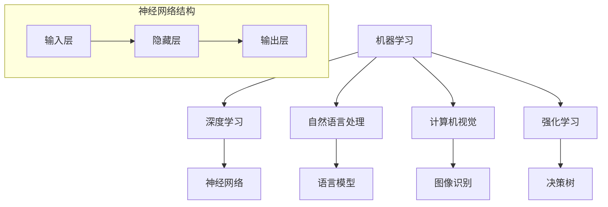

                 

### 1. 背景介绍

在科技迅猛发展的今天，人工智能（AI）已经成为了一个热门领域。然而，随着领域知识的不断更新和深化，如何有效地教授人工智能，让更多人理解和掌握这项技术，成为了一个重要的问题。传统的教学方法往往侧重于理论知识的传授，而忽略了实际操作和应用能力的培养。费曼技巧，作为一种行之有效的教学策略，可以帮助我们更好地教授AI，使其更加贴近实际应用，增强学习者的理解和记忆。

本文旨在探讨如何运用费曼技巧来教授人工智能，从背景介绍、核心概念、算法原理、数学模型、项目实践、实际应用、未来展望等多个方面，全方位解析这一教学方法的应用。

## 1.1 费曼技巧的起源

费曼技巧，又称“费曼学习法”，起源于著名物理学家理查德·费曼（Richard Feynman）的教学方法。费曼在学习物理的过程中，发现通过用自己的语言复述和理解过的知识，可以帮助自己更好地掌握和记忆这些知识。他将其称为“费曼技巧”，并将其应用于自己的教学实践中，取得了显著的成果。

费曼技巧的核心思想是：通过向他人讲解一个概念或问题，来检验和巩固自己的理解。这种方法强调的是主动思考、深层次理解和灵活运用知识，而不是单纯地记忆和复述。

## 1.2 费曼技巧的应用

费曼技巧在各个领域都有广泛的应用，尤其在科技教育和AI领域。通过费曼技巧，教师可以更有效地传授知识，学生可以更深入地理解和掌握知识。费曼技巧的应用范围包括但不限于：

1. **课程讲授**：教师可以利用费曼技巧，以故事化的方式讲解复杂的概念，使教学内容更加生动有趣，提高学生的理解能力和兴趣。

2. **学习辅导**：学生可以通过费曼技巧，对自己的学习内容进行复习和巩固，发现并填补知识盲点，提高学习效果。

3. **项目实践**：在项目实践中，团队成员可以利用费曼技巧，共同讨论和解决遇到的问题，促进知识的共享和团队协作。

4. **知识传播**：在学术论文、技术博客、在线课程等知识传播过程中，作者可以利用费曼技巧，使内容更加易懂、有趣，吸引更多读者。

## 1.3 AI领域的教学挑战

人工智能领域具有以下几个特点，使得传统教学方法面临挑战：

1. **高度复杂性**：人工智能涉及多个学科领域，如计算机科学、数学、统计学、神经科学等，教学内容复杂，知识点繁多。

2. **快速更新**：人工智能技术发展迅猛，新理论、新算法、新应用层出不穷，教师需要不断更新自己的知识库。

3. **实践性**：人工智能是一门实践性很强的学科，理论知识需要通过实际操作和项目实践来巩固和深化。

4. **跨学科融合**：人工智能涉及多个学科领域的知识，要求教师具备跨学科的知识储备和教学能力。

## 1.4 费曼技巧在AI教学中的优势

费曼技巧在AI教学中具有以下几个优势：

1. **提高理解深度**：通过向他人讲解，可以帮助学习者深入思考和理解概念，发现和解决自己的知识盲点。

2. **增强记忆效果**：通过讲解，可以将零散的知识点串联起来，形成一个完整的知识体系，提高记忆效果。

3. **培养解决问题的能力**：费曼技巧强调主动思考和灵活运用知识，有助于培养学习者的创新思维和解决问题的能力。

4. **促进知识共享**：费曼技巧可以促进团队成员之间的知识共享和协作，提高整体学习效果。

## 1.5 本文结构

本文将分为以下几个部分：

1. **背景介绍**：介绍费曼技巧的起源、应用和AI领域的教学挑战。

2. **核心概念与联系**：阐述人工智能的核心概念和联系，使用Mermaid流程图展示架构。

3. **核心算法原理 & 具体操作步骤**：介绍人工智能的核心算法原理和具体操作步骤，分析算法的优缺点和应用领域。

4. **数学模型和公式 & 详细讲解 & 举例说明**：构建数学模型，推导公式，并举例说明。

5. **项目实践：代码实例和详细解释说明**：展示项目实践中的代码实例，并进行详细解释说明。

6. **实际应用场景**：探讨人工智能的实际应用场景和未来展望。

7. **工具和资源推荐**：推荐学习资源、开发工具和相关论文。

8. **总结：未来发展趋势与挑战**：总结研究成果，展望未来发展趋势和面临的挑战。

9. **附录：常见问题与解答**：解答读者常见问题。

### 2. 核心概念与联系

在探讨如何使用费曼技巧教授AI之前，我们需要先了解AI的核心概念和它们之间的联系。人工智能是一门涉及多个学科领域的交叉学科，其核心概念包括但不限于：

1. **机器学习**：通过数据训练模型，使模型能够自主学习和优化。
2. **深度学习**：一种基于神经网络的机器学习方法。
3. **自然语言处理**：使计算机能够理解、生成和处理人类语言。
4. **计算机视觉**：使计算机能够理解和解析视觉信息。
5. **强化学习**：通过试错和反馈，使智能体能够在环境中做出最优决策。

下面我们将使用Mermaid流程图来展示这些核心概念之间的联系。



从图中可以看出，这些核心概念相互关联，共同构成了人工智能的技术体系。

### 3. 核心算法原理 & 具体操作步骤

在本节中，我们将探讨人工智能的核心算法原理，包括机器学习、深度学习、自然语言处理、计算机视觉和强化学习。我们将对这些算法的基本原理进行概述，并详细解释它们的操作步骤。

#### 3.1 机器学习算法原理

机器学习是一种使计算机通过数据自动学习和改进的方法。其基本原理可以概括为以下几个步骤：

1. **数据收集**：收集大量带有标签的数据，作为训练数据集。
2. **数据预处理**：对数据进行清洗、归一化和特征提取，以便模型训练。
3. **模型训练**：使用训练数据集，通过优化算法（如梯度下降）训练模型。
4. **模型评估**：使用验证数据集评估模型性能，调整模型参数。
5. **模型部署**：将训练好的模型部署到实际应用场景中。

机器学习算法可以分为监督学习、无监督学习和强化学习三种类型。

**监督学习**：已知输入和输出，通过训练数据集学习映射关系。常见的算法有线性回归、决策树、支持向量机等。

**无监督学习**：没有已知的输出，通过数据自身的结构和分布进行学习。常见的算法有聚类、主成分分析等。

**强化学习**：通过与环境的交互，学习最优策略。常见的算法有Q-learning、深度强化学习等。

#### 3.2 深度学习算法原理

深度学习是机器学习的一种重要分支，基于神经网络模型。其基本原理可以概括为以下几个步骤：

1. **数据输入**：将输入数据输入到神经网络中。
2. **前向传播**：通过神经网络的层层计算，将输入映射到输出。
3. **反向传播**：计算输出与实际输出之间的误差，并反向传播误差，更新模型参数。
4. **模型优化**：通过优化算法（如Adam优化器）调整模型参数，减小误差。
5. **模型评估**：使用验证数据集评估模型性能。

深度学习算法可以分为卷积神经网络（CNN）、循环神经网络（RNN）、生成对抗网络（GAN）等类型。

**卷积神经网络**：主要用于图像和视频处理，通过卷积层、池化层和全连接层等结构提取特征。

**循环神经网络**：主要用于序列数据处理，通过隐藏层的状态记忆和循环结构处理序列信息。

**生成对抗网络**：主要用于生成对抗任务，通过生成器和判别器的对抗训练生成高质量的数据。

#### 3.3 自然语言处理算法原理

自然语言处理是一种使计算机能够理解、生成和处理人类语言的技术。其基本原理可以概括为以下几个步骤：

1. **分词**：将文本分解为单词或词组。
2. **词向量化**：将单词或词组转换为向量表示。
3. **编码与解码**：使用编码器和解码器处理文本数据。
4. **模型训练**：通过训练数据集训练模型。
5. **模型评估**：使用验证数据集评估模型性能。

自然语言处理算法可以分为词向量表示、序列模型、文本生成等类型。

**词向量表示**：将单词或词组转换为高维向量表示，如Word2Vec、GloVe等。

**序列模型**：处理序列数据的神经网络模型，如RNN、LSTM、GRU等。

**文本生成**：使用生成模型生成文本，如序列到序列模型、变分自编码器等。

#### 3.4 计算机视觉算法原理

计算机视觉是一种使计算机能够理解、解析和生成视觉信息的技术。其基本原理可以概括为以下几个步骤：

1. **图像输入**：将图像数据输入到神经网络中。
2. **特征提取**：通过卷积层、池化层等结构提取图像特征。
3. **分类与检测**：使用分类器或检测器对图像进行分类或检测。
4. **模型训练**：通过训练数据集训练模型。
5. **模型评估**：使用验证数据集评估模型性能。

计算机视觉算法可以分为图像分类、目标检测、语义分割等类型。

**图像分类**：对图像进行分类，如ImageNet竞赛。
**目标检测**：检测图像中的目标对象，如YOLO、Faster R-CNN等。
**语义分割**：对图像中的每个像素进行分类，如U-Net、DeepLab等。

#### 3.5 强化学习算法原理

强化学习是一种通过试错和反馈学习最优策略的机器学习算法。其基本原理可以概括为以下几个步骤：

1. **环境建模**：建立环境模型，定义状态空间、动作空间和奖励函数。
2. **策略学习**：通过试错和反馈，学习最优策略。
3. **策略评估**：评估策略的优劣，调整策略参数。
4. **模型训练**：使用训练数据集训练模型。
5. **模型评估**：使用验证数据集评估模型性能。

强化学习算法可以分为值函数方法和策略方法。

**值函数方法**：通过值函数评估状态和动作的优劣，如Q-learning、深度Q网络（DQN）等。

**策略方法**：通过策略评估策略的优劣，如策略梯度方法、深度确定性策略梯度（DDPG）等。

#### 3.6 算法优缺点

每种算法都有其独特的优缺点，适用于不同的应用场景。下面我们将对这些算法的优缺点进行简要分析。

**机器学习**

- **优点**：通用性强，适用于各种类型的数据和问题。
- **缺点**：训练时间较长，对数据质量要求高。

**深度学习**

- **优点**：强大的特征提取能力，适用于复杂的数据和问题。
- **缺点**：计算资源消耗大，对数据质量和标注要求高。

**自然语言处理**

- **优点**：能够处理和理解人类语言，适用于各种文本处理任务。
- **缺点**：数据质量和标注对模型性能有很大影响。

**计算机视觉**

- **优点**：能够处理和理解视觉信息，适用于各种图像处理任务。
- **缺点**：对计算资源要求高，对数据质量和标注要求高。

**强化学习**

- **优点**：能够自主学习和优化策略，适用于动态环境和决策问题。
- **缺点**：训练时间较长，对环境和奖励函数设计要求高。

#### 3.7 算法应用领域

每种算法都有其特定的应用领域，下面我们将对这些算法的应用领域进行简要介绍。

**机器学习**

- **应用领域**：分类、回归、聚类、异常检测等。

**深度学习**

- **应用领域**：图像识别、语音识别、自然语言处理、推荐系统等。

**自然语言处理**

- **应用领域**：机器翻译、文本生成、情感分析、问答系统等。

**计算机视觉**

- **应用领域**：目标检测、图像识别、图像生成、视频分析等。

**强化学习**

- **应用领域**：游戏、机器人控制、自动驾驶、资源调度等。

### 4. 数学模型和公式 & 详细讲解 & 举例说明

在人工智能领域，数学模型和公式是理解和实现算法的核心。在本节中，我们将详细介绍几个关键的数学模型和公式，并使用具体案例来说明其应用。

#### 4.1 数学模型构建

数学模型是人工智能算法的基础，它将现实世界的问题转化为数学问题，使计算机能够处理和解决这些问题。以下是一些常见的数学模型：

1. **线性回归模型**：用于预测连续值。
   $$ y = \beta_0 + \beta_1x $$
   
2. **逻辑回归模型**：用于预测概率。
   $$ \sigma(x) = \frac{1}{1 + e^{-x}} $$

3. **神经网络模型**：用于分类和回归。
   $$ a_{\text{layer}} = \sigma(\sum_{i=1}^{n} w_{i}a_{\text{prev-layer}} + b) $$

4. **支持向量机模型**：用于分类。
   $$ \max \frac{1}{2} \sum_{i=1}^{n} w_i^2 - \sum_{i=1}^{n} y_i (w \cdot x_i) $$

5. **强化学习模型**：用于决策制定。
   $$ Q(s, a) = r + \gamma \max_{a'} Q(s', a') $$

#### 4.2 公式推导过程

为了更好地理解这些数学模型和公式，我们简要介绍其推导过程。

**线性回归模型**：
假设我们有 $n$ 个样本 $(x_i, y_i)$，我们希望找到一条直线 $y = \beta_0 + \beta_1x$ 来拟合这些点。通过最小化残差平方和，我们可以得到线性回归模型的公式。

**逻辑回归模型**：
逻辑回归是一种概率模型，用于预测二分类问题。其核心思想是使用一个线性模型来预测逻辑值，并通过sigmoid函数将其转换为概率。

**神经网络模型**：
神经网络模型通过层层计算，将输入映射到输出。每个神经元的激活函数可以是任何非线性函数，如sigmoid、ReLU等。

**支持向量机模型**：
支持向量机通过最大化分类边界上的支持向量，来实现分类。其目标是最小化分类误差和最大化分类边界。

**强化学习模型**：
强化学习模型通过评估当前状态和动作的效用，来更新策略。其目标是最大化长期奖励。

#### 4.3 案例分析与讲解

为了更好地理解这些数学模型和公式，我们将通过一个具体案例来进行讲解。

**案例：使用线性回归预测房价**

假设我们有 $n$ 个房产样本，每个样本包括房屋面积（$x$）和售价（$y$）。我们希望使用线性回归模型来预测新房屋的售价。

1. **数据预处理**：我们对数据进行归一化处理，将房屋面积和售价缩放到相同的范围。

2. **模型构建**：我们构建一个线性回归模型 $y = \beta_0 + \beta_1x$。

3. **模型训练**：使用最小二乘法训练模型，得到参数 $\beta_0$ 和 $\beta_1$。

4. **模型评估**：使用验证集评估模型性能，计算预测误差。

5. **模型部署**：将训练好的模型应用到新房屋的预测中。

通过这个案例，我们可以看到如何使用线性回归模型来预测房价，以及如何构建、训练和评估模型。

**案例：使用逻辑回归预测客户流失**

假设我们希望预测一个电信公司客户是否会流失。我们收集了客户的年龄、收入、使用时长等数据，并使用逻辑回归模型来预测流失概率。

1. **数据预处理**：对数据进行归一化处理，并编码类别变量。

2. **模型构建**：构建一个逻辑回归模型，输入特征为 $(x_1, x_2, ..., x_n)$，输出为流失概率 $\sigma(x)$。

3. **模型训练**：使用梯度下降法训练模型，更新模型参数。

4. **模型评估**：使用交叉验证法评估模型性能，计算准确率、召回率等指标。

5. **模型部署**：将训练好的模型应用到客户流失预测中。

通过这个案例，我们可以看到如何使用逻辑回归模型来预测客户流失，以及如何构建、训练和评估模型。

**案例：使用神经网络进行图像分类**

假设我们希望使用神经网络对图像进行分类。我们收集了一组包含不同类别图像的数据集，并使用卷积神经网络（CNN）进行训练。

1. **数据预处理**：对图像数据进行归一化处理，并转换为张量形式。

2. **模型构建**：构建一个卷积神经网络模型，包括卷积层、池化层和全连接层。

3. **模型训练**：使用反向传播算法训练模型，更新模型参数。

4. **模型评估**：使用验证集评估模型性能，计算分类准确率。

5. **模型部署**：将训练好的模型应用到实际图像分类任务中。

通过这个案例，我们可以看到如何使用神经网络进行图像分类，以及如何构建、训练和评估模型。

通过这些案例，我们可以更好地理解如何使用数学模型和公式来构建、训练和评估人工智能算法。

### 5. 项目实践：代码实例和详细解释说明

在本文的第五部分，我们将通过一个具体的项目实践，展示如何使用Python编写代码来实现一个简单的机器学习模型。这个项目将涉及数据收集、数据预处理、模型构建、训练和评估等多个步骤。通过这个项目，我们将详细解释代码的每个部分，并展示如何使用费曼技巧来理解和复述代码。

#### 5.1 开发环境搭建

首先，我们需要搭建一个Python开发环境，安装必要的库。以下是安装步骤：

1. 安装Python（建议使用Python 3.8及以上版本）。

2. 使用pip命令安装以下库：
   ```shell
   pip install numpy pandas scikit-learn matplotlib
   ```

3. 确保安装了Jupyter Notebook，以便在浏览器中运行和查看代码。

#### 5.2 源代码详细实现

接下来，我们将展示一个简单的线性回归模型，并使用Scikit-learn库实现。以下是项目的源代码：

```python
# 导入必要的库
import numpy as np
import pandas as pd
from sklearn.linear_model import LinearRegression
from sklearn.model_selection import train_test_split
from sklearn.metrics import mean_squared_error
import matplotlib.pyplot as plt

# 数据收集
data = pd.read_csv('house_prices.csv')
X = data[['area']]
y = data['price']

# 数据预处理
X_train, X_test, y_train, y_test = train_test_split(X, y, test_size=0.2, random_state=42)

# 模型构建
model = LinearRegression()
model.fit(X_train, y_train)

# 模型训练
y_train_pred = model.predict(X_train)
y_test_pred = model.predict(X_test)

# 模型评估
mse_train = mean_squared_error(y_train, y_train_pred)
mse_test = mean_squared_error(y_test, y_test_pred)
print(f"Train MSE: {mse_train}, Test MSE: {mse_test}")

# 可视化
plt.scatter(X_train, y_train, color='blue', label='Train')
plt.scatter(X_test, y_test, color='red', label='Test')
plt.plot(X_test, y_test_pred, color='green', linewidth=2, label='Prediction')
plt.xlabel('Area')
plt.ylabel('Price')
plt.legend()
plt.show()
```

#### 5.3 代码解读与分析

现在，我们将逐一解释代码的每个部分，并使用费曼技巧来深入理解代码的原理和实现。

**5.3.1 数据收集**

```python
data = pd.read_csv('house_prices.csv')
X = data[['area']]
y = data['price']
```

这段代码首先使用pandas库读取CSV文件，得到房屋价格数据。`pd.read_csv`函数读取CSV文件并创建一个DataFrame对象。然后，我们使用`[['area']]`选择数据集中的“area”列作为输入特征`X`，并选择“price”列作为目标变量`y`。

**5.3.2 数据预处理**

```python
X_train, X_test, y_train, y_test = train_test_split(X, y, test_size=0.2, random_state=42)
```

数据预处理是机器学习项目中至关重要的一步。在这里，我们使用`train_test_split`函数将数据集分为训练集和测试集，测试集占总数据的20%。`random_state`参数用于确保结果的可重复性。

**5.3.3 模型构建**

```python
model = LinearRegression()
model.fit(X_train, y_train)
```

线性回归模型使用`LinearRegression`类创建。`model.fit`方法使用训练集数据训练模型，并计算出模型参数。

**5.3.4 模型训练**

```python
y_train_pred = model.predict(X_train)
y_test_pred = model.predict(X_test)
```

模型训练后，我们使用`model.predict`方法对训练集和测试集数据进行预测，得到预测值`y_train_pred`和`y_test_pred`。

**5.3.5 模型评估**

```python
mse_train = mean_squared_error(y_train, y_train_pred)
mse_test = mean_squared_error(y_test, y_test_pred)
print(f"Train MSE: {mse_train}, Test MSE: {mse_test}")
```

我们使用`mean_squared_error`函数计算训练集和测试集的均方误差（MSE），这是一个常用的评估指标。MSE值越低，表示模型预测的准确性越高。

**5.3.6 可视化**

```python
plt.scatter(X_train, y_train, color='blue', label='Train')
plt.scatter(X_test, y_test, color='red', label='Test')
plt.plot(X_test, y_test_pred, color='green', linewidth=2, label='Prediction')
plt.xlabel('Area')
plt.ylabel('Price')
plt.legend()
plt.show()
```

最后，我们使用matplotlib库绘制散点图和拟合线，以便可视化模型的预测效果。蓝色点代表训练集，红色点代表测试集，绿色线代表模型预测的拟合线。

#### 5.4 费曼技巧应用

为了更好地理解和复述代码，我们可以使用费曼技巧进行以下步骤：

1. **讲解代码**：向他人详细解释代码的每个部分，包括数据收集、预处理、模型构建、训练、评估和可视化。

2. **复述代码**：让他人复述代码的实现过程，确保你能够清晰地表达代码的逻辑和结构。

3. **提问与讨论**：在复述过程中，提出问题和假设，与他人进行讨论，以便加深理解。

4. **迭代优化**：根据讨论的结果，修改和优化代码，提高其可读性和可理解性。

通过使用费曼技巧，我们可以更好地掌握代码的实现原理，并将知识传授给他人。

### 6. 实际应用场景

人工智能技术已经广泛应用于各个领域，为我们的生活带来了巨大的变革。以下是一些人工智能的实际应用场景：

#### 6.1 医疗健康

人工智能在医疗健康领域具有广泛的应用前景。例如，利用深度学习算法，可以分析医学影像，辅助医生进行疾病诊断。例如，AI可以识别早期癌症的微小病变，提高诊断的准确率。此外，人工智能还可以帮助分析患者数据，预测疾病发展趋势，为医生提供决策支持。

#### 6.2 金融行业

人工智能在金融行业发挥着重要作用，例如，通过机器学习算法，可以分析和预测股票市场趋势，帮助投资者做出更明智的投资决策。此外，人工智能还可以用于信用评估、风险控制、欺诈检测等方面，提高金融服务的效率和准确性。

#### 6.3 交通运输

自动驾驶是人工智能在交通运输领域的热门应用。通过结合计算机视觉、深度学习和强化学习等技术，自动驾驶车辆可以自主识别道路标志、行人、车辆等交通元素，并做出相应的驾驶决策。自动驾驶技术的应用有望提高交通安全、降低交通事故率，并提高交通效率。

#### 6.4 教育领域

人工智能在教育领域也具有广泛的应用。例如，智能辅导系统可以根据学生的学习情况和进度，提供个性化的学习资源和建议，帮助学生更有效地学习。此外，人工智能还可以用于自动批改作业、分析学生学习行为等，为教师提供教学支持和参考。

#### 6.5 物流与供应链

人工智能在物流与供应链管理中也发挥着重要作用。例如，利用机器学习算法，可以优化运输路线、预测库存需求、提高供应链的灵活性和响应速度。此外，人工智能还可以用于仓库自动化、货物跟踪等，提高物流效率，降低成本。

#### 6.6 智慧城市

智慧城市是人工智能技术的又一重要应用领域。通过整合物联网、大数据和人工智能等技术，智慧城市可以实现智能交通管理、环境保护、能源管理、公共安全等方面的高效运作。例如，智能路灯可以根据行人流量和天气状况自动调整亮度，提高能源利用效率。

#### 6.7 娱乐与游戏

人工智能在娱乐与游戏领域也具有广泛的应用。例如，通过深度学习算法，可以开发出更加智能和互动的游戏角色，提高游戏体验。此外，人工智能还可以用于音乐创作、图像生成等，为娱乐产业带来更多创新。

#### 6.8 农业与农业科技

人工智能在农业领域的应用也越来越广泛。例如，利用无人机和计算机视觉技术，可以实时监测农田状况，预测作物病虫害，提供精准农业解决方案。此外，人工智能还可以用于农业大数据分析、农业设备自动化控制等，提高农业生产效率。

### 7. 未来应用展望

随着人工智能技术的不断发展，其应用领域将不断扩展，未来将带来更多的变革和机遇。以下是一些未来人工智能应用展望：

#### 7.1 智能自动化

人工智能将进一步提升自动化水平，实现更多生产、服务和管理过程的自动化。例如，在制造业中，机器人与人工智能技术相结合，可以实现生产线的自动化和智能化，提高生产效率和产品质量。

#### 7.2 精准医疗

人工智能在医疗领域的应用将更加精准，通过对大数据的分析和深度学习算法的应用，可以实现个性化医疗、精准诊断和预测。例如，利用人工智能技术，可以更早地发现疾病的潜在风险，提供更精准的治疗方案。

#### 7.3 虚拟与现实融合

虚拟现实（VR）和增强现实（AR）技术将与人工智能深度融合，创造更加逼真的虚拟环境和互动体验。例如，在教育培训、游戏娱乐、远程工作等领域，VR和AR技术将带来全新的体验和应用场景。

#### 7.4 智能能源管理

人工智能将在能源管理领域发挥重要作用，实现能源的高效利用和优化。例如，利用人工智能技术，可以实时监测和预测能源需求，优化能源供应结构，降低能源消耗和碳排放。

#### 7.5 智慧环境监测

人工智能将应用于环境监测和管理，实现对大气、水质、土壤等环境的实时监测和预警。例如，利用无人机和传感器技术，可以实现对森林火灾、河流污染等环境问题的快速响应和治理。

#### 7.6 智能交通系统

人工智能将进一步提升交通系统的智能化水平，实现交通流量控制、自动驾驶、智能交通信号管理等功能。例如，通过智能交通系统，可以实现城市交通的高效运行，降低交通事故率，提高出行体验。

#### 7.7 社会治理与安全

人工智能将在社会治理和安全领域发挥重要作用，通过大数据分析和机器学习算法，实现社会风险的预测、预警和管理。例如，利用人工智能技术，可以更有效地预防和打击犯罪活动，提高社会治理的效率和水平。

总之，人工智能技术的发展将为各个领域带来深刻的变革，创造更多机遇和挑战。未来，我们将继续关注人工智能技术的最新动态，探索其在各个领域的应用潜力，推动科技与社会的持续进步。

### 8. 工具和资源推荐

在学习和实践人工智能的过程中，选择合适的工具和资源是非常重要的。以下是一些建议，包括学习资源、开发工具和相关论文，以帮助您在AI领域取得更好的成果。

#### 8.1 学习资源推荐

1. **在线课程**：
   - Coursera: 提供大量由世界顶级大学和公司开设的AI课程，如斯坦福大学的“机器学习”课程。
   - edX: 同样提供高质量的AI课程，涵盖深度学习、自然语言处理等多个领域。

2. **书籍**：
   - 《Python机器学习》（Michael Bowles）：适合初学者，内容全面，通俗易懂。
   - 《深度学习》（Ian Goodfellow、Yoshua Bengio、Aaron Courville）：深度学习领域的经典教材，内容深入且全面。

3. **博客与论坛**：
   - Medium: 有许多AI领域的专家和爱好者分享技术见解和经验。
   - Stack Overflow: AI开发者在遇到问题时，可以在这里找到解决方案。

#### 8.2 开发工具推荐

1. **编程语言**：
   - Python：由于其丰富的库和简洁的语法，成为AI开发的主流语言。
   - R：在统计分析和数据可视化方面表现出色。

2. **框架和库**：
   - TensorFlow：Google开发的开源深度学习框架，功能强大，适用于各种应用场景。
   - PyTorch：由Facebook AI研究院开发，以动态计算图著称，适合快速原型开发。

3. **数据集**：
   - Kaggle：提供大量公开的数据集，适合用于机器学习和深度学习项目。
   - UCI Machine Learning Repository：包含各种领域的数据集，适合进行研究和学习。

#### 8.3 相关论文推荐

1. **机器学习领域**：
   - “Deep Learning” (2015)：由Yoshua Bengio、Ian Goodfellow和Yann LeCun等人撰写，是深度学习的经典论文集。
   - “Learning Deep Architectures for AI” (2006)：由Yoshua Bengio讨论深度学习的理论基础。

2. **自然语言处理领域**：
   - “A Theoretically Grounded Application of Dropout in Recurrent Neural Networks” (2016)：讨论了在RNN中应用Dropout的方法，提高NLP模型性能。
   - “Attention Is All You Need” (2017)：提出了Transformer模型，彻底改变了NLP领域的范式。

3. **计算机视觉领域**：
   - “Convolutional Neural Networks for Visual Recognition” (2012)：由Alex Krizhevsky等人撰写的卷积神经网络在ImageNet竞赛中取得优异成绩的论文。
   - “Bilinear Averaging Networks for Joint Object Segmentation and Detection” (2018)：提出了用于目标检测和分割的Bilinear Averaging Networks。

这些工具和资源将帮助您在人工智能领域不断进步，探索更多可能。

### 9. 总结：未来发展趋势与挑战

#### 9.1 研究成果总结

人工智能（AI）在过去几十年中取得了显著的进展，从基础的机器学习算法到复杂的深度学习模型，再到广泛的实际应用，AI技术已经深刻改变了我们的生活方式和社会结构。从自动驾驶汽车到智能医疗诊断，从个性化推荐系统到智能助手，AI的应用场景不断扩展，为各行各业带来了前所未有的机遇。然而，这些成果的取得离不开无数科研人员的辛勤努力和不断创新。

在过去的研究中，AI技术在多个领域取得了重要突破。例如，在计算机视觉领域，卷积神经网络（CNN）的应用使得图像识别和物体检测的准确率大幅提升；在自然语言处理（NLP）领域，深度学习模型（如Transformer）的引入极大地提高了语言理解和生成能力；在强化学习领域，通过深度强化学习的结合，智能体能够在复杂的动态环境中实现自我学习和优化。

#### 9.2 未来发展趋势

展望未来，人工智能的发展趋势将继续朝着几个关键方向迈进：

1. **跨学科融合**：AI将与其他领域（如生物学、心理学、经济学等）深度融合，推动交叉学科的研究和应用。

2. **技术进步**：随着计算能力的提升和算法的优化，AI模型将变得更加高效和强大，能够处理更复杂的问题。

3. **数据驱动**：数据将成为AI发展的核心资源，通过大数据分析和数据挖掘，AI系统将能够更好地理解和预测现实世界。

4. **伦理与安全**：随着AI技术的广泛应用，伦理问题和隐私安全问题将越来越受到关注，如何确保AI系统的公平性、透明性和安全性将成为重要课题。

5. **普及化与民主化**：AI技术将变得更加普及和易于使用，更多的人将能够掌握和应用AI，推动AI技术的民主化。

#### 9.3 面临的挑战

尽管人工智能的未来充满希望，但在其快速发展过程中，我们也面临着一系列挑战：

1. **数据隐私**：随着AI系统对大量个人数据的依赖，如何保护用户隐私成为一个亟待解决的问题。

2. **算法透明性与解释性**：当前许多AI系统（尤其是深度学习）被视为“黑箱”，其决策过程缺乏透明性。如何提高算法的可解释性，使其能够被用户理解和信任，是一个重要的挑战。

3. **伦理问题**：AI技术在医疗、金融、法律等领域的应用引发了关于伦理和道德的讨论，如何确保AI系统的公平性、公正性和道德性是一个复杂的挑战。

4. **计算资源**：AI系统的训练和推理过程需要大量的计算资源，如何高效利用这些资源，降低能耗，是一个重要课题。

5. **法律与监管**：随着AI技术的普及，相关的法律和监管框架也需要不断完善，以应对AI技术带来的新挑战。

#### 9.4 研究展望

为了应对这些挑战，未来的研究可以从以下几个方面展开：

1. **算法创新**：继续探索新的机器学习算法，特别是具有可解释性和透明性的算法，以满足实际应用的需求。

2. **数据安全与隐私**：研究新的数据安全技术和隐私保护机制，确保AI系统的数据使用安全。

3. **伦理与道德**：建立AI伦理框架，制定相关标准和规范，确保AI系统的公正性和道德性。

4. **计算效率**：研究新的计算模型和优化技术，提高AI系统的计算效率和能效。

5. **跨学科研究**：促进AI与其他领域的交叉研究，推动跨学科的融合和创新。

总之，人工智能的发展前景广阔，但也面临着诸多挑战。通过不断创新和合作，我们有理由相信，人工智能将在未来为人类带来更多的福祉。

### 10. 附录：常见问题与解答

**Q1：如何选择合适的人工智能学习资源？**

A1：选择学习资源时，首先要考虑自己的基础和兴趣。对于初学者，可以选择入门级的书籍和在线课程，如《Python机器学习》和Coursera上的“机器学习”课程。对于有一定基础的学习者，可以选择进阶的教材和论文，如《深度学习》和《Attention Is All You Need》。此外，还可以关注顶级会议和期刊，如NeurIPS和JMLR，以了解最新的研究成果。

**Q2：如何评估人工智能模型的性能？**

A2：评估模型性能的指标有多种，常用的包括准确率（Accuracy）、精确率（Precision）、召回率（Recall）和F1分数（F1 Score）等。对于分类问题，准确率表示预测正确的样本比例；精确率表示预测为正类的样本中实际为正类的比例；召回率表示实际为正类的样本中预测为正类的比例；F1分数是精确率和召回率的调和平均。对于回归问题，常用的指标包括均方误差（Mean Squared Error, MSE）和均绝对误差（Mean Absolute Error, MAE）。

**Q3：为什么深度学习模型需要大量数据？**

A3：深度学习模型依赖于大规模数据来学习和提取特征。这是因为深度学习模型通常包含大量的参数，需要通过大量的样本来调整这些参数，以达到较好的泛化能力。此外，大量数据可以帮助模型避免过拟合，提高模型的鲁棒性。然而，获取大量标注数据通常成本较高，因此，数据增强和半监督学习等方法也被广泛应用于解决数据稀缺问题。

**Q4：如何优化深度学习模型的训练过程？**

A4：优化深度学习模型的训练过程可以从以下几个方面进行：

1. **数据预处理**：对训练数据进行清洗、归一化和数据增强，提高数据质量。

2. **模型选择**：选择合适的网络结构和优化算法，如卷积神经网络（CNN）和Adam优化器。

3. **超参数调优**：调整学习率、批量大小、正则化参数等超参数，以找到最优的配置。

4. **早期停止**：在模型性能开始下降时停止训练，避免过拟合。

5. **使用预训练模型**：利用预训练模型，通过迁移学习来提高模型的泛化能力。

**Q5：如何确保人工智能系统的公平性和透明性？**

A5：确保人工智能系统的公平性和透明性是一个复杂的问题，可以从以下几个方面进行：

1. **数据收集**：确保数据集的多样性和代表性，避免偏见。

2. **算法设计**：选择可解释性强的算法，如决策树和线性回归，使决策过程透明。

3. **模型评估**：使用多个评估指标，并考虑不同群体的表现，以确保公平性。

4. **伦理审查**：建立AI伦理委员会，对AI系统的设计和应用进行伦理审查。

5. **用户反馈**：收集用户反馈，不断优化和改进系统。

通过这些方法，可以在一定程度上确保人工智能系统的公平性和透明性。然而，这仍然是一个不断发展和完善的领域，需要持续的探索和努力。

