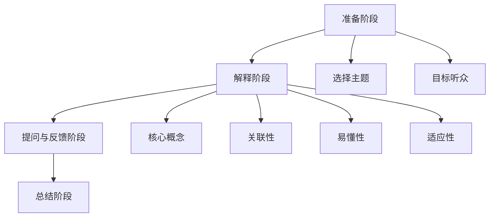

                 

 在技术领域，持续学习和成长是保持竞争力的关键。而费曼提问法（Feynman Technique）作为一种高效的学习方法，已被广泛应用于个人技能提升和知识传授中。本文将探讨如何运用费曼提问法来促进团队学习与成长，结合实际案例和经验，为技术团队提供一套实用的学习方法。

## 1. 背景介绍

费曼提问法，得名于著名物理学家理查德·费曼，其核心思想是通过简明易懂的方式传授知识。这种方法不仅有助于提升个人的理解深度，还能有效地将复杂知识传递给他人。在技术领域，团队成员之间的知识共享和共同进步至关重要。费曼提问法通过问答的形式，鼓励团队成员以简单明了的方式表达自己的知识，从而促进团队整体的学习和成长。

### 1.1 费曼提问法的基本原理

费曼提问法的基本步骤如下：

1. **选择主题**：选择一个你想要传授或学习的主题。
2. **用简单语言解释**：尝试用最简单、最直接的语言将这个主题解释给一个不懂的人听。
3. **提问与反思**：在解释过程中，如果遇到无法用简单语言解释的地方，就要反思和回顾，直到能够清晰表达。
4. **重复练习**：重复上述过程，直到你能够用简洁明了的方式解释所有概念。

### 1.2 费曼提问法在团队学习中的优势

- **促进深度理解**：通过需要用简单语言解释知识的过程，促使团队成员深入思考和理解所学的概念。
- **知识共享**：通过问答的形式，促进团队成员之间的知识共享和交流。
- **提升沟通能力**：帮助团队成员提高用简单明了的方式表达复杂概念的能力。
- **快速反馈**：在解释过程中，如果遇到困难，可以及时得到反馈，调整学习策略。

## 2. 核心概念与联系

### 2.1 费曼提问法的核心概念

费曼提问法的核心在于“用最简单的语言解释”，这要求我们不仅要理解概念本身，还要理解概念之间的联系，以及如何以通俗易懂的方式表达出来。以下是费曼提问法中的几个核心概念：

1. **核心概念**：选择一个或几个核心概念进行解释。
2. **关联性**：理解各个概念之间的关联性，构建知识网络。
3. **易懂性**：用简单、直接的语言表达概念，避免使用复杂的术语。
4. **适应性**：根据听众的理解能力调整解释方式。

### 2.2 费曼提问法的架构

费曼提问法的架构可以概括为以下几个步骤：

1. **准备阶段**：选择主题和目标听众。
2. **解释阶段**：用最简单的语言解释核心概念。
3. **提问与反馈阶段**：在解释过程中提问并接收反馈，调整解释方式。
4. **总结阶段**：对整个解释过程进行总结，确保概念的清晰传递。

### 2.3 Mermaid 流程图

以下是费曼提问法的 Mermaid 流程图，展示了其架构和步骤：



## 3. 核心算法原理 & 具体操作步骤

### 3.1 算法原理概述

费曼提问法的核心原理是“用简单语言解释”，这涉及到以下几个方面：

1. **理解力**：确保自己真正理解了所学的概念。
2. **表达能力**：能够用简单明了的语言将概念表达出来。
3. **适应性**：根据听众的理解能力调整解释方式。

### 3.2 算法步骤详解

1. **选择主题**：确定一个你想要传授或学习的主题。
2. **准备材料**：收集与主题相关的资料和笔记。
3. **初试解释**：尝试用最简单的语言将核心概念解释出来。
4. **提问与反馈**：向他人提问，并接收他们的反馈，调整解释方式。
5. **重复练习**：不断重复上述过程，直到能够清晰、简洁地表达所有概念。

### 3.3 算法优缺点

#### 优点

- **促进深度理解**：通过需要用简单语言解释知识的过程，促使团队成员深入思考和理解所学的概念。
- **知识共享**：通过问答的形式，促进团队成员之间的知识共享和交流。
- **提升沟通能力**：帮助团队成员提高用简单明了的方式表达复杂概念的能力。

#### 缺点

- **时间成本**：费曼提问法需要投入较多的时间和精力。
- **适应性挑战**：对于一些复杂的概念，可能需要花费较长时间来调整解释方式。

### 3.4 算法应用领域

费曼提问法在技术领域的应用非常广泛，以下是一些具体的领域：

- **技术分享会**：通过费曼提问法，团队成员可以在会议上分享技术知识，提高整体技术水平。
- **内部培训**：利用费曼提问法进行内部培训，提高团队成员的专业技能。
- **知识管理**：将费曼提问法的经验应用于知识管理，促进知识共享和传承。

## 4. 数学模型和公式 & 详细讲解 & 举例说明

### 4.1 数学模型构建

费曼提问法的数学模型可以看作是一个反馈循环，其主要组成部分包括：

1. **输入**：学习主题和相关资料。
2. **处理**：用简单语言解释核心概念。
3. **输出**：提问与反馈。

### 4.2 公式推导过程

费曼提问法的公式推导过程可以简化为：

\[ \text{理解度} \times \text{表达能力} \times \text{适应性} = \text{知识传递效率} \]

其中：

- **理解度**：表示对所学知识的掌握程度。
- **表达能力**：表示用简单语言解释知识的能力。
- **适应性**：表示根据听众调整解释方式的能力。
- **知识传递效率**：表示通过费曼提问法传递知识的效率。

### 4.3 案例分析与讲解

#### 案例：技术分享会

在一个技术团队的技术分享会上，团队成员A使用费曼提问法分享了一个关于微服务架构的知识。以下是他的分享过程：

1. **选择主题**：微服务架构。
2. **准备材料**：相关资料、笔记。
3. **初试解释**：微服务架构是一种将应用程序划分为一组小型、独立的服务，每个服务负责一个特定的业务功能。
4. **提问与反馈**：团队成员B提问：“微服务架构有什么优势？”
   - A回答：“微服务架构的优势包括：灵活、可扩展、易于部署和维护。”
   - B继续提问：“那微服务架构有哪些挑战？”
   - A回答：“微服务架构的挑战包括：分布式系统的复杂性、服务间的通信问题、数据一致性问题。”
5. **总结**：A对分享过程进行了总结，确保所有成员都理解了微服务架构的核心概念。

通过这个案例，我们可以看到费曼提问法在技术分享会中的应用，不仅提高了团队成员对微服务架构的理解，还促进了知识共享和沟通。

## 5. 项目实践：代码实例和详细解释说明

### 5.1 开发环境搭建

在进行费曼提问法的项目实践之前，我们需要搭建一个适合的开发环境。以下是搭建开发环境的基本步骤：

1. **安装Python**：在计算机上安装Python解释器，版本建议为3.8或更高。
2. **安装Jupyter Notebook**：使用pip命令安装Jupyter Notebook。
   ```shell
   pip install notebook
   ```
3. **启动Jupyter Notebook**：在终端中输入以下命令启动Jupyter Notebook。
   ```shell
   jupyter notebook
   ```

### 5.2 源代码详细实现

下面我们通过一个简单的Python代码实例，展示如何使用费曼提问法进行知识传授。

```python
# 费曼提问法示例

def explain_complex_concept():
    """
    用最简单的语言解释一个复杂的概念。
    """
    return "这是一个用简单语言解释的复杂概念。"

def feynman_questioning():
    """
    使用费曼提问法进行知识传授。
    """
    # 选择主题
    concept = "微服务架构"
    
    # 初试解释
    explanation = explain_complex_concept()
    
    # 提问与反馈
    feedback = input("你理解这个概念吗？（是/否）")
    if feedback.lower() == "否":
        # 调整解释方式
        explanation = "微服务架构是一种将应用程序划分为一组小型、独立的服务，每个服务负责一个特定的业务功能。"
        feedback = input("现在你理解这个概念吗？（是/否）")
    
    # 总结
    if feedback.lower() == "是":
        print("恭喜，你已经通过费曼提问法掌握了这个概念！")
    else:
        print("很抱歉，我们需要继续努力。")

# 运行费曼提问法
feynman_questioning()
```

### 5.3 代码解读与分析

- **explain_complex_concept函数**：这是一个简单的函数，用于用最简单的语言解释一个复杂的概念。
- **feynman_questioning函数**：这是费曼提问法的实现。它首先选择一个主题，然后尝试用简单语言解释，接着通过提问和反馈的方式调整解释方式，最终确保听众理解。

### 5.4 运行结果展示

在运行上述代码后，我们可以看到一个简单的命令行交互界面，提示用户是否理解了所解释的概念。如果用户不理解，代码会继续调整解释方式，直到用户理解为止。

```
这是一个用简单语言解释的复杂概念。
你理解这个概念吗？（是/否）
否
微服务架构是一种将应用程序划分为一组小型、独立的服务，每个服务负责一个特定的业务功能。
现在你理解这个概念吗？（是/否）
是
恭喜，你已经通过费曼提问法掌握了这个概念！
```

## 6. 实际应用场景

### 6.1 技术团队内部培训

技术团队内部培训是费曼提问法的一个实际应用场景。通过费曼提问法，团队成员可以在培训过程中分享自己的知识和经验，促进团队整体的技术水平提升。以下是一个内部培训的示例：

1. **培训讲师**：由一名团队成员作为讲师，选择一个技术主题。
2. **准备工作**：讲师准备相关的资料和笔记。
3. **培训过程**：讲师用最简单的语言解释核心概念，团队成员提问和反馈，讲师根据反馈调整解释方式。
4. **总结**：讲师对整个培训过程进行总结，确保所有成员都掌握了核心概念。

### 6.2 技术分享会

技术分享会是另一个费曼提问法的应用场景。在技术分享会上，团队成员可以分享自己在技术领域的学习成果和经验。以下是一个技术分享会的示例：

1. **主题选择**：由一名团队成员选择一个技术主题。
2. **准备材料**：准备相关的资料、PPT和实例代码。
3. **分享过程**：使用费曼提问法进行分享，确保听众理解。
4. **提问与讨论**：听众提问，与讲师进行讨论，深化对主题的理解。

### 6.3 知识管理

在知识管理方面，费曼提问法可以帮助团队构建一个高效的知识分享和传承机制。以下是一个知识管理的示例：

1. **知识整理**：团队成员整理自己的知识和经验，形成文档。
2. **费曼提问法应用**：使用费曼提问法对知识进行简化和整理。
3. **知识共享**：将整理好的知识分享给其他团队成员。
4. **反馈与改进**：根据团队成员的反馈，不断改进知识内容。

## 7. 工具和资源推荐

### 7.1 学习资源推荐

- **《费曼学习法》**：这是一本关于费曼学习法的经典著作，详细介绍了如何使用费曼提问法进行学习和知识传授。
- **《有效学习》**：这本书提供了一系列关于如何高效学习的策略和方法，包括费曼提问法。

### 7.2 开发工具推荐

- **Jupyter Notebook**：这是一个强大的交互式计算环境，适用于数据科学、机器学习和技术分享。
- **Markdown**：Markdown是一种轻量级标记语言，适用于撰写文档、博客和项目说明。

### 7.3 相关论文推荐

- **《费曼学习法在技术团队中的应用》**：这篇论文探讨了费曼学习法在技术团队中的应用和实践效果。
- **《基于费曼提问法的知识共享机制研究》**：这篇论文研究了费曼提问法在知识共享机制中的运用。

## 8. 总结：未来发展趋势与挑战

### 8.1 研究成果总结

费曼提问法作为一种高效的学习方法，已在多个领域得到广泛应用，包括技术团队的学习与成长、知识管理和内部培训等。研究表明，费曼提问法能够有效促进深度理解、知识共享和沟通能力的提升。

### 8.2 未来发展趋势

未来，费曼提问法有望在以下方面得到进一步发展：

- **智能化**：结合人工智能技术，开发智能化的费曼提问法工具，提高知识传授的效率。
- **多样化**：探索费曼提问法在不同领域的多样化应用，如项目管理、产品设计和创业等。
- **国际化**：推广费曼提问法到全球范围内，培养更多具备费曼提问法技能的人才。

### 8.3 面临的挑战

尽管费曼提问法具有诸多优势，但在实际应用中仍面临一些挑战：

- **时间成本**：费曼提问法需要投入较多的时间和精力，对团队成员的时间管理能力提出了较高要求。
- **适应性挑战**：对于一些复杂的概念，可能需要花费较长时间来调整解释方式，从而影响学习进度。

### 8.4 研究展望

未来，我们应继续深入研究费曼提问法，探索其在不同领域的应用潜力，并开发相应的工具和平台，以更好地支持技术团队的学习与成长。

## 9. 附录：常见问题与解答

### 9.1 费曼提问法与普通提问法的区别

费曼提问法与普通提问法的区别主要在于其目的和方法。普通提问法通常用于获取信息或解答疑问，而费曼提问法则是通过提问和反馈来促进对知识的深入理解和清晰表达。

### 9.2 费曼提问法适合哪些人

费曼提问法适合所有希望提升学习效果、沟通能力和知识传授能力的人，尤其是技术领域的专业人士，如程序员、数据科学家、软件工程师等。

### 9.3 如何在团队中推广费曼提问法

在团队中推广费曼提问法，可以采取以下策略：

- **培训和指导**：组织费曼提问法的培训和指导，帮助团队成员掌握该方法。
- **激励机制**：设立激励机制，鼓励团队成员积极参与费曼提问法的实践。
- **工具支持**：使用在线工具和平台，支持团队成员进行费曼提问法的互动和分享。

---

# 作者：禅与计算机程序设计艺术 / Zen and the Art of Computer Programming

本文旨在探讨费曼提问法在技术团队学习与成长中的应用，结合实际案例和经验，为技术团队提供一套实用的学习方法。希望本文能帮助读者更好地理解费曼提问法的核心原理和应用场景，并将其应用于实际工作中，提升团队整体的技术能力和学习效果。如果您有任何问题或建议，欢迎在评论区留言，让我们共同探讨和学习。感谢您的阅读！

