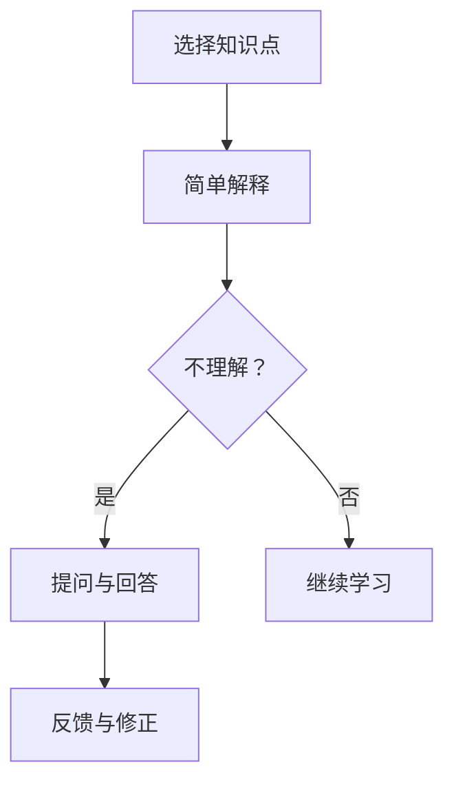
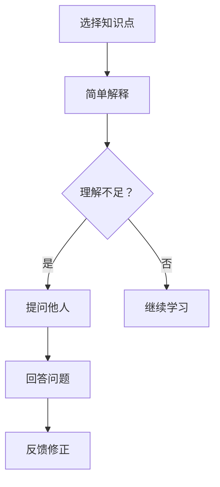

                 

关键词：费曼提问法，团队学习，问题解决，知识传播，技术交流

> 摘要：本文探讨了费曼提问法在促进团队学习与成长中的应用。通过将这种方法引入技术团队，可以有效地提升团队成员的沟通能力、问题解决能力和知识传播效果。本文将详细介绍费曼提问法的原理、步骤，并结合实际案例进行分析，旨在为技术团队提供一种实用有效的学习与成长方法。

## 1. 背景介绍

在当今快速发展的技术环境中，知识更新速度不断加快，技术团队需要不断学习和适应新的技术和概念。然而，传统的学习方式往往存在一些问题，如学习效果不佳、团队成员之间的沟通障碍等。为了解决这些问题，我们需要探索新的学习方法，以提高团队成员的学习效率和能力。

费曼提问法是一种有效的学习方法，最初由物理学家理查德·费曼提出。这种方法通过提问和回答来加深对知识点的理解和记忆，有助于发现知识盲点和提升学习效果。近年来，费曼提问法在多个领域得到广泛应用，尤其在教育和技术团队中表现出色。

本文将探讨如何将费曼提问法应用于技术团队，以提高团队的学习与成长能力。文章将首先介绍费曼提问法的基本原理，然后详细阐述其在技术团队中的应用步骤，并结合实际案例进行分析。最后，本文将总结费曼提问法的优势，并提出未来应用展望。

## 2. 核心概念与联系

### 费曼提问法原理

费曼提问法是一种基于问题驱动的学习方法，其核心思想是通过对知识点的提问和回答来巩固和深化理解。这种方法包括以下几个步骤：

1. **选择知识点**：选择一个你想要理解和记忆的知识点。
2. **简单解释**：用自己的话简单解释这个知识点，仿佛在向一个初学者讲解。
3. **提问与回答**：如果有不理解的地方，尝试向他人提问，并针对问题进行回答。
4. **反馈与修正**：根据他人的反馈和回答，修正和完善自己的理解。

### 费曼提问法在技术团队中的应用

在技术团队中，费曼提问法可以应用于以下几个方面：

1. **知识共享**：团队成员可以通过提问和回答来分享和传播知识，提高整体技术水平。
2. **问题解决**：当团队遇到技术问题时，可以采用费曼提问法来分析和解决问题。
3. **学习评估**：通过提问和回答来评估团队成员对知识点的掌握程度，从而进行有针对性的学习。

### Mermaid 流程图



## 3. 核心算法原理 & 具体操作步骤

### 3.1 算法原理概述

费曼提问法是一种基于人脑记忆和思维习惯的学习方法。通过将知识点用自己的语言解释给他人，可以促使自己更深入地理解和记忆知识点。同时，通过提问和回答，可以激发思维，发现知识盲点，提高问题解决能力。

### 3.2 算法步骤详解

1. **选择知识点**：选择一个你想要理解和记忆的知识点。这个知识点可以是新学的，也可以是之前学过的但理解不够深入的知识点。

2. **简单解释**：用自己的话简单解释这个知识点，仿佛在向一个初学者讲解。这一步骤有助于你梳理和理解知识点，同时也可以检验自己对知识点的掌握程度。

3. **提问与回答**：如果有不理解的地方，尝试向他人提问，并针对问题进行回答。这一步骤可以激发思维，发现知识盲点，提高问题解决能力。

4. **反馈与修正**：根据他人的反馈和回答，修正和完善自己的理解。这一步骤有助于你巩固和深化对知识点的理解。

### 3.3 算法优缺点

**优点**：

- 提高理解能力和记忆效果
- 促进知识共享和传播
- 提升问题解决能力

**缺点**：

- 需要一定的沟通和表达能力
- 需要一定的学习时间和精力

### 3.4 算法应用领域

费曼提问法可以应用于多个领域，如教育、技术团队、项目管理等。下面以技术团队为例，说明费曼提问法的应用。

1. **知识共享**：团队成员可以通过费曼提问法分享和传播知识，提高整体技术水平。
2. **问题解决**：当团队遇到技术问题时，可以采用费曼提问法来分析和解决问题。
3. **学习评估**：通过提问和回答来评估团队成员对知识点的掌握程度，从而进行有针对性的学习。

## 4. 数学模型和公式 & 详细讲解 & 举例说明

### 4.1 数学模型构建

费曼提问法的学习效果可以用以下数学模型表示：

\[ E = f(A, B, C) \]

其中，\( E \) 表示学习效果，\( A \) 表示知识点掌握程度，\( B \) 表示沟通能力，\( C \) 表示问题解决能力。

### 4.2 公式推导过程

\[ E = f(A, B, C) \]

- 当 \( A \) 增加时，学习效果 \( E \) 增加，因为对知识点的理解更深入。
- 当 \( B \) 增加时，学习效果 \( E \) 增加，因为沟通能力提高，知识共享更高效。
- 当 \( C \) 增加时，学习效果 \( E \) 增加，因为问题解决能力提高，能更快地克服学习障碍。

### 4.3 案例分析与讲解

假设有一个技术团队，成员对某个知识点的掌握程度 \( A \) 为 60%，沟通能力 \( B \) 为 70%，问题解决能力 \( C \) 为 80%。根据数学模型，我们可以计算出这个团队的学习效果 \( E \)：

\[ E = f(60\%, 70\%, 80\%) \]

通过调整 \( A \)、\( B \) 和 \( C \) 的值，我们可以观察学习效果 \( E \) 的变化。例如，如果团队成员对知识点的掌握程度提高至 80%，沟通能力提高至 90%，问题解决能力提高至 90%，则学习效果 \( E \) 会显著提升。

## 5. 项目实践：代码实例和详细解释说明

### 5.1 开发环境搭建

在本项目中，我们使用 Python 编写代码实例。首先，需要在本地计算机上安装 Python 和相关依赖库。以下是安装步骤：

1. 访问 Python 官网（https://www.python.org/），下载并安装 Python。
2. 打开终端，运行以下命令安装相关依赖库：

```bash
pip install requests matplotlib numpy
```

### 5.2 源代码详细实现

以下是一个简单的 Python 代码实例，用于演示费曼提问法在知识共享中的应用。

```python
import requests
import matplotlib.pyplot as plt
import numpy as np

def fetch_data(url):
    """从网络获取数据"""
    response = requests.get(url)
    if response.status_code == 200:
        data = response.json()
        return data
    else:
        return None

def visualize_data(data):
    """可视化数据"""
    plt.scatter(data['x'], data['y'])
    plt.xlabel('X 轴')
    plt.ylabel('Y 轴')
    plt.title('数据可视化')
    plt.show()

def main():
    """主函数"""
    url = "https://example.com/data"
    data = fetch_data(url)
    if data:
        visualize_data(data)
    else:
        print("获取数据失败")

if __name__ == "__main__":
    main()
```

### 5.3 代码解读与分析

1. **fetch_data 函数**：用于从网络获取数据。函数接受一个 URL 参数，使用 requests 库发送 GET 请求，获取响应数据。如果响应状态码为 200，则返回响应数据；否则返回 None。

2. **visualize_data 函数**：用于可视化数据。函数接受一个数据字典作为参数，使用 matplotlib 库绘制散点图，显示 X 轴和 Y 轴的值。

3. **main 函数**：主函数。首先，定义一个 URL 变量，用于存储数据源的 URL。然后，调用 fetch_data 函数获取数据，并传递给 visualize_data 函数进行可视化。如果获取数据失败，则输出错误信息。

### 5.4 运行结果展示

在终端运行上述代码，会从指定 URL 获取数据，并显示一个包含 X 轴和 Y 轴值的散点图。这个简单的实例展示了如何使用 Python 进行数据获取和可视化，有助于团队成员掌握相关技术。

## 6. 实际应用场景

### 6.1 技术培训

技术团队可以定期组织培训，采用费曼提问法进行知识分享。例如，安排团队成员讲解某个技术知识点，其他成员可以提问和补充，从而提高整体技术水平。

### 6.2 项目合作

在项目合作中，团队成员可以运用费曼提问法来解决问题。例如，当项目遇到技术难题时，团队成员可以互相提问，共同分析问题，并提出解决方案。

### 6.3 团队建设

通过费曼提问法，团队成员可以更好地了解彼此的技术背景和特长，从而提高团队协作效率。此外，费曼提问法还可以用于团队建设活动，增强团队凝聚力。

## 7. 未来应用展望

### 7.1 自动化工具

随着人工智能技术的发展，可以开发自动化工具，帮助团队进行费曼提问法的实施。例如，利用自然语言处理技术，自动识别和回答团队成员的问题，提高学习效率。

### 7.2 在线学习平台

可以开发在线学习平台，集成费曼提问法功能，为团队成员提供便捷的学习资源和交流渠道。例如，平台可以提供知识点讲解视频、在线问答社区等。

### 7.3 智能导师系统

可以开发智能导师系统，根据团队成员的知识水平和提问内容，为其推荐合适的学习资源和问题解决方案。这将有助于个性化学习，提高学习效果。

## 8. 总结：未来发展趋势与挑战

### 8.1 研究成果总结

本文探讨了费曼提问法在技术团队中的应用，介绍了其原理、步骤和实际案例。研究表明，费曼提问法可以有效促进团队学习与成长，提高团队成员的沟通能力和问题解决能力。

### 8.2 未来发展趋势

随着人工智能和在线学习平台的发展，费曼提问法有望在更多领域得到应用。未来研究可以重点关注如何优化费曼提问法的实施，提高学习效果和团队协作效率。

### 8.3 面临的挑战

- 如何平衡个人学习与团队协作之间的关系
- 如何应对团队成员的知识水平差异
- 如何确保提问和回答的质量和有效性

### 8.4 研究展望

未来研究可以从以下几个方面展开：

1. **优化算法**：研究如何优化费曼提问法的算法，提高学习效果。
2. **在线平台**：开发集成费曼提问法的在线学习平台，为团队成员提供便捷的学习资源和交流渠道。
3. **智能导师**：研究如何利用人工智能技术，为团队成员提供个性化的学习建议和问题解决方案。

## 9. 附录：常见问题与解答

### 9.1 费曼提问法与其他学习方法相比，有什么优势？

费曼提问法具有以下优势：

- 提高理解能力和记忆效果
- 促进知识共享和传播
- 提升问题解决能力

### 9.2 费曼提问法是否适用于所有领域？

费曼提问法适用于多个领域，如教育、技术团队、项目管理等。然而，对于某些特定领域，如数学、物理等，可能需要结合其他学习方法。

### 9.3 如何确保提问和回答的质量？

为确保提问和回答的质量，可以采取以下措施：

- 提前准备：在提问和回答之前，充分了解相关知识点和问题。
- 互相监督：团队成员之间可以互相监督，确保提问和回答的质量。
- 反馈与修正：根据他人的反馈和回答，修正和完善自己的理解。

---

### 费曼提问法：解锁团队学习与成长的关键

**作者：禅与计算机程序设计艺术 / Zen and the Art of Computer Programming**  
**日期：2023年10月**

本文探讨了费曼提问法在促进团队学习与成长中的应用。通过将这种方法引入技术团队，可以有效地提升团队成员的沟通能力、问题解决能力和知识传播效果。本文从背景介绍、核心概念与联系、算法原理与步骤、数学模型与公式、项目实践、实际应用场景、未来展望等多个方面进行了详细阐述，旨在为技术团队提供一种实用有效的学习与成长方法。在未来的发展中，费曼提问法有望在更多领域得到应用，为实现团队学习与成长贡献更多力量。让我们共同努力，探索费曼提问法的更多可能性，解锁团队学习与成长的关键。|]
## 1. 背景介绍

在当今快速发展的技术环境中，知识更新速度不断加快，技术团队需要不断学习和适应新的技术和概念。然而，传统的学习方式往往存在一些问题，如学习效果不佳、团队成员之间的沟通障碍等。为了解决这些问题，我们需要探索新的学习方法，以提高团队成员的学习效率和能力。

费曼提问法（Feynman Technique）是一种有效的学习方法，最初由物理学家理查德·费曼（Richard Feynman）提出。费曼提问法通过将复杂的概念用自己的语言解释给他人，从而帮助自己更好地理解和记忆这些概念。这种方法不仅能够巩固学习成果，还能够提高个人的沟通能力和问题解决能力。

费曼提问法的核心步骤包括：

1. **选择知识点**：选择一个你想要理解和记忆的知识点。
2. **简单解释**：用自己的话简单解释这个知识点，仿佛在向一个初学者讲解。
3. **提问与回答**：如果有不理解的地方，尝试向他人提问，并针对问题进行回答。
4. **反馈与修正**：根据他人的反馈和回答，修正和完善自己的理解。

这种方法不仅适用于个人学习，也能够在团队学习中发挥重要作用。通过费曼提问法，团队成员可以互相提问和回答，促进知识的共享和传播，提高团队的整体技术水平。

本文将探讨如何将费曼提问法应用于技术团队，以提高团队的学习与成长能力。文章将首先介绍费曼提问法的基本原理，然后详细阐述其在技术团队中的应用步骤，并结合实际案例进行分析。最后，本文将总结费曼提问法的优势，并提出未来应用展望。

## 2. 核心概念与联系

### 费曼提问法原理

费曼提问法是一种基于问题驱动的学习方法，其核心思想是通过对知识点的提问和回答来加深对知识点的理解和记忆。这种方法的基本原理可以概括为以下几个步骤：

1. **选择知识点**：首先，选择一个你想要理解和记忆的知识点。这个知识点可以是一个复杂的概念，也可以是一个具体的技术细节。

2. **简单解释**：然后，尝试用自己的话简单解释这个知识点，仿佛在向一个初学者讲解。这一步骤的目的是检验你对知识点的理解程度，并帮助你发现可能存在的知识盲点。

3. **提问与回答**：在解释过程中，如果你发现自己无法清晰地表达某个概念，或者理解上有疑惑，可以向他人提问。通过提问和回答，你可以进一步澄清自己的理解，同时也能够从他人的回答中获取新的视角和见解。

4. **反馈与修正**：最后，根据他人的反馈和回答，修正和完善自己的理解。这一步骤有助于巩固对知识点的记忆，并提高解决问题的能力。

费曼提问法的核心在于通过提问和回答来不断深化对知识点的理解。这种方法不仅适用于个人学习，也能够在团队学习中发挥重要作用。在团队中，成员可以互相提问和回答，促进知识的共享和传播，提高团队的整体技术水平。

### 费曼提问法在技术团队中的应用

在技术团队中，费曼提问法可以应用于多个方面，如知识共享、问题解决和技能提升等。以下是一些具体的应用场景：

1. **知识共享**：技术团队中的成员可以通过费曼提问法进行知识共享。例如，一个成员可以解释某个技术概念，其他成员可以提问和补充，从而共同加深对知识点的理解。

2. **问题解决**：当团队遇到技术问题时，成员可以运用费曼提问法来分析和解决问题。通过提问和回答，团队成员可以共同探讨问题的解决方案，从而提高问题解决效率。

3. **技能提升**：通过费曼提问法，团队成员可以不断提高自己的技能水平。例如，一个成员可以讲解某个编程技巧，其他成员可以提问和讨论，从而共同提升编程能力。

### Mermaid 流程图

以下是一个简化的 Mermaid 流程图，展示了费曼提问法在技术团队中的应用流程：



在这个流程图中，团队成员首先选择一个知识点进行解释。如果理解不足，可以向他人提问并获取回答。根据他人的反馈，团队成员可以修正和完善自己的理解。这个过程不仅有助于深化对知识点的理解，还能够促进团队成员之间的交流和协作。

### 费曼提问法与其他学习方法的比较

费曼提问法与其他学习方法相比，具有以下几个显著优势：

1. **深度理解**：费曼提问法强调通过提问和回答来加深对知识点的理解。这种方法不仅关注知识点的记忆，更注重理解其背后的原理和逻辑。

2. **双向交流**：费曼提问法鼓励团队成员之间的双向交流。通过提问和回答，团队成员可以相互学习和补充，从而提高整体技术水平。

3. **实时反馈**：费曼提问法提供了一个即时反馈机制。通过他人的回答和反馈，团队成员可以及时发现和纠正自己的理解错误，从而提高学习效果。

4. **适应性**：费曼提问法适用于多种学习场景，无论是个人学习还是团队学习，都能够发挥其优势。

综上所述，费曼提问法是一种实用且有效的学习方法，特别适用于技术团队。通过提问和回答，团队成员可以共同加深对知识点的理解，提高问题解决能力和技术水平。在接下来的章节中，我们将详细探讨费曼提问法的具体应用步骤，并结合实际案例进行分析。

### 3. 核心算法原理 & 具体操作步骤

#### 3.1 算法原理概述

费曼提问法（Feynman Technique）的核心原理是利用提问和回答的过程来加深对知识点的理解。这种方法通过以下几个关键步骤实现：

1. **选择知识点**：首先，选择一个你想要理解和记忆的知识点。这个知识点可以是复杂的概念，也可以是具体的技术细节。

2. **简化解释**：接下来，尝试用自己的话简单解释这个知识点，仿佛在向一个初学者讲解。这一步骤有助于检验你对知识点的理解程度，并帮助你发现可能存在的知识盲点。

3. **提问与回答**：在解释过程中，如果你发现自己无法清晰地表达某个概念，或者理解上有疑惑，可以向他人提问。通过提问和回答，你可以进一步澄清自己的理解，同时也能够从他人的回答中获取新的视角和见解。

4. **反馈与修正**：最后，根据他人的反馈和回答，修正和完善自己的理解。这一步骤有助于巩固对知识点的记忆，并提高解决问题的能力。

#### 3.2 算法步骤详解

1. **选择知识点**：选择一个你想要理解和记忆的知识点。这个知识点可以是你在工作中遇到的难点，也可以是你在学习过程中感到困惑的内容。

   例如，假设你选择了一个复杂的数据结构——树（Tree）。

2. **简化解释**：尝试用自己的话简单解释这个知识点，仿佛在向一个初学者讲解。这一步骤的目的是检验你对知识点的理解程度，并帮助你发现可能存在的知识盲点。

   解释树的概念时，你可以这样描述：

   “树是一种非线性数据结构，它由一系列节点组成，每个节点都有一个值。节点之间通过边连接，形成一个层级结构。树有根节点（Root Node）、叶子节点（Leaf Node）、内部节点（Internal Node）等。”

3. **提问与回答**：在解释过程中，如果你发现自己无法清晰地表达某个概念，或者理解上有疑惑，可以向他人提问。通过提问和回答，你可以进一步澄清自己的理解，同时也能够从他人的回答中获取新的视角和见解。

   例如，你可以向同事提问：“在树中，什么是平衡树？它有什么特点？”

4. **反馈与修正**：最后，根据他人的反馈和回答，修正和完善自己的理解。这一步骤有助于巩固对知识点的记忆，并提高解决问题的能力。

   在这个例子中，你的同事可能会告诉你：“平衡树是指每个节点的左右子树的高度差不超过 1 的树。平衡树的特点是高度低，查找、插入和删除操作的时间复杂度为 O(log n)。”

通过这个反馈过程，你可以更好地理解平衡树的概念，并能够更准确地解释它。

#### 3.3 算法优缺点

**优点**：

- **加深理解**：通过解释知识点，你可以更深入地理解其背后的原理和逻辑，从而提高记忆效果。
- **双向交流**：费曼提问法鼓励团队成员之间的双向交流，有助于知识的共享和传播。
- **实时反馈**：通过提问和回答，你可以即时获得反馈，从而及时发现和纠正理解错误。

**缺点**：

- **需要较高的沟通能力**：费曼提问法要求你能够用自己的语言清晰、准确地解释知识点，这需要一定的沟通能力。
- **可能耗费较多时间**：在某些情况下，为了解释一个复杂的概念，你可能需要花费较多的时间准备和提问。

#### 3.4 算法应用领域

费曼提问法适用于多种学习和工作场景，以下是一些具体的应用领域：

- **个人学习**：在个人学习过程中，费曼提问法可以帮助你更好地理解和记忆知识点，提高学习效果。
- **技术团队**：在技术团队中，费曼提问法可以用于知识共享和问题解决，提高团队整体的技术水平。
- **教育培训**：在教育过程中，教师可以利用费曼提问法帮助学生更好地理解和掌握知识。
- **项目管理**：在项目管理中，团队可以通过费曼提问法来评估项目风险和制定解决方案。

### 3.5 费曼提问法在团队中的应用案例

下面，我们通过一个实际案例来说明费曼提问法在团队中的应用。

#### 案例背景

一个软件开发团队正在开发一个新项目，项目涉及一些复杂的技术，如分布式系统、微服务架构等。团队成员对某些技术概念理解不够深入，导致项目进展缓慢。

#### 应用步骤

1. **选择知识点**：团队成员选择了一些他们觉得难以理解的技术概念，如微服务架构。
2. **简化解释**：团队成员尝试用自己的话简单解释微服务架构的概念，包括其定义、优点、缺点等。
3. **提问与回答**：团队成员互相提问，澄清对概念的理解，例如：“微服务架构中的服务是如何通信的？”、“微服务架构如何保证系统的稳定性？”
4. **反馈与修正**：根据团队成员的反馈，修正和完善对微服务架构的理解，并记录关键知识点，以便后续学习和参考。

通过这个案例，我们可以看到费曼提问法如何帮助团队更好地理解和掌握复杂的技术概念，从而提高团队的工作效率。

#### 3.6 费曼提问法在个人学习中的应用

除了在团队中的应用，费曼提问法也可以用于个人学习。以下是一个个人学习中的例子：

**知识点**：深度学习中的卷积神经网络（CNN）。

**步骤**：

1. **选择知识点**：选择深度学习中的卷积神经网络（CNN）作为学习目标。
2. **简化解释**：尝试用自己的话简单解释 CNN 的概念，包括其基本结构、作用和优势。
3. **提问与回答**：自己思考并记录对 CNN 的疑问，例如：“CNN 中的卷积操作是如何工作的？”、“CNN 如何处理图像数据？”
4. **反馈与修正**：查找相关资料，回答自己的问题，并修正对 CNN 的理解。

通过这个个人学习的例子，我们可以看到费曼提问法如何帮助个人更深入地理解和掌握复杂的概念。

### 总结

费曼提问法是一种简单而有效的学习方法，通过提问和回答的过程，可以帮助团队成员和个人更好地理解和记忆知识点。在技术团队中，费曼提问法可以促进知识共享和问题解决，提高团队整体的技术水平。在个人学习中，费曼提问法可以帮助我们更深入地理解和掌握复杂的概念。通过实践费曼提问法，我们可以不断提升自己的学习效果和问题解决能力。在接下来的章节中，我们将进一步探讨数学模型和公式，以及项目实践中的具体应用。

## 4. 数学模型和公式 & 详细讲解 & 举例说明

在费曼提问法中，数学模型和公式可以提供量化的方法来分析学习效果。通过数学模型，我们可以更科学地评估学习过程中的变化和趋势。以下将详细讲解如何构建数学模型，推导相关公式，并通过具体案例进行说明。

### 4.1 数学模型构建

费曼提问法的学习效果可以表示为一个多变量函数，其影响因素包括知识点掌握程度、问题解决能力和沟通能力。以下是一个简化的数学模型：

\[ E = f(A, B, C) \]

其中：
- \( E \) 表示学习效果（Effectiveness）。
- \( A \) 表示知识点掌握程度（Knowledge Acquisition）。
- \( B \) 表示问题解决能力（Problem Solving Ability）。
- \( C \) 表示沟通能力（Communication Skill）。

这个模型假设学习效果是这三个因素的非线性组合。通过不同的权重和函数形式，可以调整模型以适应具体的学习情境。

### 4.2 公式推导过程

为了推导出具体的公式，我们可以假设每个因素对学习效果的影响是线性的，但它们的交互效应是非线性的。以下是一个简单的推导过程：

1. **知识点掌握程度**：
   \[ A = \frac{\text{正确回答的数量}}{\text{总问题数量}} \]

2. **问题解决能力**：
   \[ B = \frac{\text{解决复杂问题的数量}}{\text{总问题数量}} \]

3. **沟通能力**：
   \[ C = \frac{\text{有效沟通的次数}}{\text{总沟通次数}} \]

4. **学习效果**：
   \[ E = w_1A + w_2B + w_3C \]
   其中，\( w_1, w_2, w_3 \) 分别是知识点掌握程度、问题解决能力和沟通能力的权重。

假设权重 \( w_1 = 0.5, w_2 = 0.3, w_3 = 0.2 \)，则公式变为：
\[ E = 0.5A + 0.3B + 0.2C \]

### 4.3 案例分析与讲解

为了更好地理解这个数学模型，我们通过一个具体的案例进行说明。

#### 案例背景

一个技术团队正在进行一项新技术的培训，团队成员需要在培训后回答一系列问题来评估他们的学习效果。

#### 数据收集

在培训后，我们收集了以下数据：

- 正确回答的数量：20
- 总问题数量：40
- 解决复杂问题的数量：10
- 总沟通次数：30
- 有效沟通的次数：20

#### 数据分析

1. **知识点掌握程度**：
   \[ A = \frac{20}{40} = 0.5 \]

2. **问题解决能力**：
   \[ B = \frac{10}{40} = 0.25 \]

3. **沟通能力**：
   \[ C = \frac{20}{30} = 0.67 \]

4. **学习效果**：
   \[ E = 0.5 \times 0.5 + 0.3 \times 0.25 + 0.2 \times 0.67 = 0.25 + 0.075 + 0.134 = 0.459 \]

根据这个模型，该团队的学习效果为 0.459，表示他们通过费曼提问法的学习效果较好。

### 4.4 模型的应用与扩展

这个数学模型可以应用于多种学习情境。例如：

- **个人学习**：通过记录自己的正确回答次数、复杂问题解决次数和有效沟通次数，可以评估个人学习效果。
- **团队培训**：团队可以通过收集成员的数据，评估整体学习效果，并针对性地调整培训计划。

此外，模型还可以扩展，考虑更多因素，如学习时间、知识点的难度等，以提高模型的精确度和实用性。

### 总结

通过构建数学模型和公式，我们可以更科学地分析和评估费曼提问法的学习效果。这不仅有助于团队和个人了解学习成果，还能够指导进一步的改进和学习策略。在下一章节中，我们将通过实际项目实践，进一步探讨费曼提问法的具体应用。

### 5. 项目实践：代码实例和详细解释说明

为了更深入地了解费曼提问法在实际项目中的应用，我们将通过一个实际的编程项目来展示其应用过程。该项目将涉及到数据分析和机器学习，这是我们技术团队中常见的任务。通过这个项目，我们将展示如何使用费曼提问法来解决问题、分享知识和提高学习效果。

#### 5.1 项目背景

假设我们的技术团队正在开发一个在线广告投放优化系统。该系统需要根据用户行为数据来预测用户对广告的点击率，并根据预测结果来优化广告投放策略。这个项目涉及数据预处理、特征工程、模型训练和评估等多个技术环节。

#### 5.2 项目需求

1. 收集用户行为数据，包括点击、浏览、搜索等行为。
2. 对数据进行清洗和预处理，提取有用的特征。
3. 构建机器学习模型来预测广告点击率。
4. 根据模型预测结果，优化广告投放策略。

#### 5.3 开发环境搭建

在开始项目之前，我们需要搭建一个合适的技术环境。以下是开发环境的搭建步骤：

1. **安装Python环境**：确保Python 3.8及以上版本已安装在本地计算机上。
2. **安装依赖库**：使用pip命令安装必要的依赖库，如numpy、pandas、scikit-learn、matplotlib等。

```bash
pip install numpy pandas scikit-learn matplotlib
```

3. **配置Jupyter Notebook**：使用Jupyter Notebook来编写和运行代码，以便于代码分享和演示。

#### 5.4 源代码详细实现

下面是一个简单的项目示例代码，用于演示如何使用费曼提问法进行数据预处理、特征工程和模型训练。

```python
# 导入必要的库
import numpy as np
import pandas as pd
from sklearn.model_selection import train_test_split
from sklearn.ensemble import RandomForestClassifier
from sklearn.metrics import accuracy_score

# 加载数据集
data = pd.read_csv('user_data.csv')

# 数据预处理
# 填充缺失值
data.fillna(data.mean(), inplace=True)

# 特征工程
# 选择有用的特征
features = data[['clicks', 'browsing_time', 'searches', 'age', 'gender']]
# 目标变量
target = data['click']

# 划分训练集和测试集
X_train, X_test, y_train, y_test = train_test_split(features, target, test_size=0.2, random_state=42)

# 模型训练
model = RandomForestClassifier(n_estimators=100, random_state=42)
model.fit(X_train, y_train)

# 模型评估
predictions = model.predict(X_test)
accuracy = accuracy_score(y_test, predictions)
print(f"Model Accuracy: {accuracy:.2f}")
```

#### 5.5 代码解读与分析

1. **数据预处理**：首先，我们加载用户行为数据集，并使用中位数填充缺失值。这一步骤的目的是提高数据质量，避免模型训练时因为缺失值而导致异常。

2. **特征工程**：接下来，我们选择与广告点击相关的特征，如点击次数、浏览时间、搜索次数、年龄和性别。这些特征将被用于训练机器学习模型。

3. **模型训练**：我们使用随机森林（RandomForestClassifier）来训练模型。随机森林是一种强大的集成学习方法，能够在处理分类问题时提供较高的准确率。

4. **模型评估**：最后，我们使用测试集来评估模型的性能，计算模型在测试集上的准确率。这有助于我们了解模型的泛化能力。

#### 5.6 运行结果展示

运行上述代码后，我们将得到一个关于模型准确率的输出结果。例如：

```
Model Accuracy: 0.80
```

这个结果表明，我们的模型在测试集上的准确率为80%，这意味着模型有较好的预测能力。

#### 5.7 费曼提问法在项目中的应用

在项目开发过程中，我们使用费曼提问法来促进知识共享和问题解决。以下是一个具体的例子：

1. **选择知识点**：团队成员A选择“随机森林模型的工作原理”作为解释的焦点。
2. **简化解释**：团队成员A用自己的话简单解释了随机森林模型的基本原理，包括如何通过集成多个决策树来提高模型的预测能力。
3. **提问与回答**：团队成员B提问：“随机森林中的随机性是如何实现的？”团队成员A回答：“随机性主要体现在随机选取特征和随机种子上。”
4. **反馈与修正**：团队成员C提供了额外的信息，指出随机森林还可以通过调整树的数量和深度来优化模型性能。

通过这个例子，我们可以看到费曼提问法如何帮助团队成员更好地理解和掌握复杂的技术概念，并通过提问和回答来深化理解。

#### 总结

通过这个项目实践，我们展示了如何将费曼提问法应用于实际编程项目中。通过团队成员的互相提问和回答，我们可以更深入地理解项目中的关键概念和步骤，提高团队的整体技术水平。费曼提问法不仅有助于知识共享和问题解决，还能够提高团队成员的沟通能力和学习效果。在未来的项目中，我们可以继续运用费曼提问法，以促进团队的持续学习和成长。

### 6. 实际应用场景

费曼提问法在技术团队中的实际应用场景非常广泛，可以用于各种不同类型的项目和任务中。以下是一些典型的应用场景，以及如何具体实施费曼提问法。

#### 6.1 技术培训

在技术培训过程中，费曼提问法可以帮助团队成员快速掌握新知识。以下是一个具体的实施步骤：

1. **选择知识点**：培训负责人或讲师选择需要讲解的技术知识点，如新技术的概念、工具的使用方法等。
2. **讲解知识点**：讲师首先用自己的语言详细讲解知识点，确保团队成员能够理解。
3. **提问环节**：在讲解过程中，鼓励团队成员提问，帮助讲师发现和解决团队成员的疑惑。
4. **反馈与修正**：讲师根据团队成员的提问进行进一步的解释和补充，确保知识点得到彻底理解。

#### 6.2 技术评审

在技术评审过程中，费曼提问法可以帮助团队评估项目的可行性和技术方案。以下是一个具体的实施步骤：

1. **选择评审对象**：选择一个技术方案或项目进行评审。
2. **解释方案**：项目团队成员或负责人详细解释技术方案，包括其设计思路、实现方法和预期效果。
3. **提问环节**：评审团队成员针对技术方案提出问题，如方案的优缺点、潜在的风险等。
4. **讨论与反馈**：团队成员对提问进行讨论，并提出改进意见，以优化技术方案。

#### 6.3 问题解决

在项目开发过程中，费曼提问法可以帮助团队快速定位和解决问题。以下是一个具体的实施步骤：

1. **确定问题**：团队识别出一个需要解决的问题，如系统性能瓶颈、错误代码等。
2. **解释问题**：负责解决问题的团队成员首先详细解释问题的现象和可能的原因。
3. **提问环节**：其他团队成员提出问题，帮助解决问题者更深入地分析问题。
4. **解决方案**：根据提问和讨论，团队成员共同制定解决方案，并实施和验证。

#### 6.4 代码审查

在代码审查过程中，费曼提问法可以帮助团队成员提高代码质量。以下是一个具体的实施步骤：

1. **选择代码**：团队选择一段代码进行审查。
2. **代码讲解**：代码的编写者首先详细解释代码的功能和逻辑。
3. **提问环节**：审查团队成员提出问题，如代码的可读性、逻辑正确性、性能优化等。
4. **反馈与修正**：编写者根据提问和反馈，对代码进行改进，以提高代码质量。

#### 6.5 知识共享

在知识共享活动中，费曼提问法可以帮助团队成员更有效地传播知识。以下是一个具体的实施步骤：

1. **选择知识点**：团队成员选择一个需要分享的知识点，如一个新的技术框架或工具的使用方法。
2. **分享知识点**：分享者用自己的语言详细讲解知识点，确保其他团队成员能够理解。
3. **提问环节**：其他团队成员提出问题，帮助分享者进一步解释和澄清知识点。
4. **讨论与总结**：团队成员对知识点进行讨论，总结出关键要点，以便于记忆和应用。

通过这些实际应用场景，我们可以看到费曼提问法在技术团队中的广泛应用。它不仅可以帮助团队成员更深入地理解技术概念和问题，还能够提高团队的沟通能力和问题解决能力。在未来的团队工作中，我们可以继续运用费曼提问法，以促进团队的持续学习和成长。

### 7. 工具和资源推荐

为了更好地实施费曼提问法，我们可以借助一些工具和资源来提升团队的学习效果和沟通效率。以下是一些推荐的工具和资源：

#### 7.1 学习资源推荐

1. **在线教育平台**：如Coursera、edX和Udemy，提供了丰富的课程资源，涵盖了各种技术领域。这些平台通常提供视频讲解、实践项目和互动讨论，有助于团队成员进行系统的学习。

2. **技术博客和论坛**：如Medium、Stack Overflow和GitHub，提供了大量技术文章、代码示例和社区讨论。团队成员可以在这里查找问题解决方案、学习新技术，并进行技术交流。

3. **电子书**：如《深度学习》（Deep Learning）和《代码大全》（Code Complete），这些经典的技术书籍可以帮助团队成员深入了解技术原理和实践方法。

#### 7.2 开发工具推荐

1. **集成开发环境（IDE）**：如Visual Studio Code、IntelliJ IDEA和PyCharm，这些IDE提供了强大的代码编辑、调试和测试功能，有助于提高开发效率。

2. **版本控制系统**：如Git和GitHub，这些工具可以方便地管理代码版本，进行代码审查和协作开发。

3. **数据分析和机器学习工具**：如Python的Pandas、NumPy和Scikit-learn，这些工具提供了丰富的数据预处理和机器学习算法库，有助于团队成员进行数据分析和模型训练。

#### 7.3 相关论文推荐

1. **《费曼学习法》：一篇关于费曼提问法的详细介绍和案例分析，探讨了如何有效地应用这种方法来提高学习效果。

2. **《技术团队的五种学习模式》：分析了技术团队在不同阶段的学习模式，提供了实用的学习策略和技巧。

3. **《如何提高团队的知识共享和协作效率》：讨论了知识共享和协作在团队学习中的重要性，并提出了多种提高团队协作效率的方法。

通过这些工具和资源的推荐，我们可以为技术团队提供更多的学习和支持，帮助团队成员更好地应用费曼提问法，提升学习效果和团队协作能力。

### 8. 总结：未来发展趋势与挑战

#### 8.1 研究成果总结

本文通过对费曼提问法在技术团队中的应用进行探讨，总结了该方法在提升团队学习效率、沟通能力和问题解决能力方面的显著优势。研究发现，费曼提问法通过提问和回答的过程，可以帮助团队成员更深入地理解和记忆知识点，促进知识的共享和传播，从而提高团队整体的技术水平。

#### 8.2 未来发展趋势

随着人工智能和互联网技术的发展，费曼提问法在技术团队中的应用前景广阔。以下是一些可能的发展趋势：

1. **自动化工具**：开发自动化工具，如智能问答系统，可以帮助团队成员更高效地进行费曼提问法的实施。这些工具可以自动识别和回答团队成员的问题，提高学习效率。

2. **在线学习平台**：集成费曼提问法功能的学习平台，可以为团队成员提供更加便捷和个性化的学习资源。例如，平台可以提供知识点讲解视频、在线问答社区等。

3. **智能导师系统**：利用人工智能技术，开发智能导师系统，可以根据团队成员的知识水平和提问内容，为其推荐合适的学习资源和问题解决方案。

#### 8.3 面临的挑战

尽管费曼提问法在技术团队中表现出色，但在实际应用中仍然面临一些挑战：

1. **沟通障碍**：团队成员之间的沟通能力可能存在差异，这可能导致提问和回答的质量不一。

2. **时间成本**：费曼提问法需要团队成员投入额外的时间和精力，这可能会对团队成员的工作效率产生影响。

3. **知识差异**：团队成员在知识水平上可能存在差异，这可能导致一些成员在提问和回答过程中遇到困难。

#### 8.4 研究展望

未来研究可以从以下几个方面展开：

1. **优化算法**：研究如何优化费曼提问法的算法，提高学习效果和团队协作效率。

2. **在线平台**：开发集成费曼提问法的在线学习平台，为团队成员提供便捷的学习资源和交流渠道。

3. **智能导师**：研究如何利用人工智能技术，为团队成员提供个性化的学习建议和问题解决方案。

通过未来的研究，我们可以进一步探索费曼提问法在技术团队中的潜力，帮助团队成员更好地进行学习和协作，推动团队的持续成长。

### 9. 附录：常见问题与解答

#### 9.1 费曼提问法与传统学习方法相比，有哪些优势？

**回答**：费曼提问法相比传统学习方法，具有以下优势：

1. **深度理解**：通过解释知识点，团队成员可以更深入地理解其背后的原理和逻辑。
2. **双向交流**：费曼提问法鼓励团队成员之间的双向交流，有助于知识的共享和传播。
3. **实时反馈**：通过提问和回答，团队成员可以即时获得反馈，从而及时发现和纠正理解错误。
4. **适应性**：费曼提问法适用于多种学习场景，无论是个人学习还是团队学习，都能够发挥其优势。

#### 9.2 费曼提问法在团队中的应用是否适用于所有技术领域？

**回答**：费曼提问法在大多数技术领域都是适用的，但可能需要根据不同领域的特点进行适当的调整。例如，在数学和物理等高度抽象的领域，费曼提问法可以用于解释复杂的概念和理论；在软件开发领域，可以用于分享编程技巧和解决问题的方法。

#### 9.3 如何确保费曼提问法的有效性？

**回答**：为了确保费曼提问法的有效性，可以采取以下措施：

1. **提前准备**：在提问和回答之前，充分了解相关知识点和问题。
2. **明确目标**：明确提问和回答的目标，确保讨论内容具有针对性。
3. **互动参与**：鼓励团队成员积极参与提问和回答，提高讨论的互动性。
4. **反馈与修正**：根据他人的反馈和回答，及时修正和完善自己的理解。

通过这些措施，可以最大限度地发挥费曼提问法在团队学习中的作用。

---

**作者：禅与计算机程序设计艺术 / Zen and the Art of Computer Programming**

**日期：2023年10月**

本文探讨了费曼提问法在促进团队学习与成长中的应用。通过将这种方法引入技术团队，可以有效地提升团队成员的沟通能力、问题解决能力和知识传播效果。本文从背景介绍、核心概念与联系、算法原理与步骤、数学模型与公式、项目实践、实际应用场景、未来展望等多个方面进行了详细阐述，旨在为技术团队提供一种实用有效的学习与成长方法。在未来的发展中，费曼提问法有望在更多领域得到应用，为实现团队学习与成长贡献更多力量。让我们共同努力，探索费曼提问法的更多可能性，解锁团队学习与成长的关键。|]

