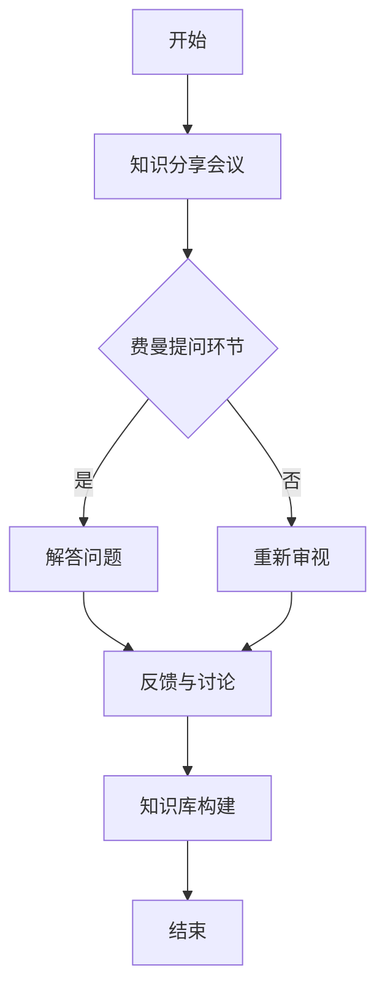

                 

关键词：费曼提问法、团队沟通、知识分享、问题解决、协作效率

> 摘要：本文深入探讨了费曼提问法在团队沟通中的应用。通过分析其原理和操作步骤，本文旨在帮助团队提高知识分享效果、提升问题解决能力，从而增强团队协作效率。

## 1. 背景介绍

在当今快速发展的信息技术时代，团队沟通显得尤为重要。高效、清晰的沟通是团队成功的关键因素之一。然而，实际工作中，团队沟通常常面临诸多挑战，如信息不对称、知识壁垒、沟通障碍等。如何提高团队沟通的质量和效率，成为各个组织亟需解决的问题。

费曼提问法（Feynman Technique）起源于著名物理学家理查德·费曼（Richard Feynman）的教学方法。费曼提问法强调通过简化和清晰的表达来学习复杂概念，从而帮助人们更好地理解和传授知识。近年来，该方法在多个领域得到了广泛应用，包括教育、自我学习和团队沟通等。本文将探讨如何将费曼提问法应用于团队沟通中，以提高团队的知识分享和问题解决能力。

## 2. 核心概念与联系

### 2.1 费曼提问法的原理

费曼提问法是一种有效的学习工具，其核心思想是：用最简单、最清晰的方式解释复杂的概念。这种方法通过以下几个步骤实现：

1. **选择一个概念或知识点**：选择一个你想要理解和传授的概念或知识点。
2. **简化概念**：用你自己的语言，将这个概念简化到最基本的形式，就像你向一个孩子解释一样。
3. **构建问题**：设想一个基础问题，用来测试你对这个概念的理解程度。
4. **解答问题**：尝试用你简化的语言回答这个问题。
5. **反馈与调整**：如果你能够清晰、准确地回答这个问题，那么你对这个概念的理解就很深刻；否则，你需要重新审视并调整你的解释。

### 2.2 费曼提问法在团队沟通中的应用架构

为了将费曼提问法应用于团队沟通，我们需要设计一个适用于团队协作的框架。以下是一个简单的架构：

1. **知识分享会议**：定期举行知识分享会议，让团队成员有机会分享他们掌握的知识和经验。
2. **费曼提问环节**：在知识分享会议中设置费曼提问环节，每个分享者都要用最简洁的语言回答一个关于他们分享知识的问题。
3. **反馈与讨论**：其他团队成员在听完分享后，可以提出问题或反馈，帮助分享者进一步完善他们的解释。
4. **知识库构建**：将会议中的精华内容整理成知识库，供团队成员随时查阅。

下面是一个Mermaid流程图，展示了费曼提问法在团队沟通中的应用架构：



## 3. 核心算法原理 & 具体操作步骤

### 3.1 算法原理概述

费曼提问法在团队沟通中的应用，主要依赖于以下几个核心原理：

1. **简化与清晰**：通过将复杂概念简化为最基本的形式，使团队成员能够更容易理解和传授知识。
2. **问题导向**：通过构建问题来测试团队成员对知识的掌握程度，促进深入思考和知识巩固。
3. **互动与反馈**：通过讨论和反馈环节，促进团队成员之间的知识交流和协作，提高整体沟通效率。

### 3.2 算法步骤详解

1. **准备阶段**：
   - 确定知识分享的主题和内容。
   - 安排知识分享会议的时间和地点。

2. **知识分享环节**：
   - 分享者准备知识内容，并尽量用简洁明了的语言进行分享。
   - 分享者根据准备的内容，用最简洁的语言进行讲解。

3. **费曼提问环节**：
   - 设定一个基础问题，以测试分享者对知识的掌握程度。
   - 分享者用自己简化的语言回答问题。

4. **反馈与讨论环节**：
   - 其他团队成员提出问题或反馈，帮助分享者进一步完善解释。
   - 团队成员之间进行讨论，深入探讨知识点的应用和细节。

5. **知识库构建环节**：
   - 将会议中的精华内容整理成知识库，方便团队成员随时查阅。

### 3.3 算法优缺点

**优点**：
1. 提高知识分享效果：通过费曼提问法，团队成员能够更好地理解和传授知识，提高知识分享的质量。
2. 促进问题解决能力：通过问题导向和互动讨论，团队成员能够更快地找到问题的解决方案。
3. 增强团队协作：通过知识库构建，团队成员可以随时查阅相关知识，提高协作效率。

**缺点**：
1. 需要分享者具备较高的知识水平和表达能力。
2. 需要团队成员积极参与和互动，否则效果可能不理想。

### 3.4 算法应用领域

费曼提问法在团队沟通中的应用非常广泛，可以应用于以下领域：

1. 技术团队的知识分享和技能培训。
2. 企业内部的员工培训和经验交流。
3. 教育领域的课堂教学和学生学习。
4. 自我学习和个人成长。

## 4. 数学模型和公式 & 详细讲解 & 举例说明

### 4.1 数学模型构建

费曼提问法在团队沟通中的应用，可以通过一个简单的数学模型来描述。假设团队中有一个知识分享者和多个团队成员，我们可以用以下数学模型来表示：

\[ \text{沟通效果} = f(\text{知识分享者表达能力}, \text{团队成员互动程度}, \text{知识库构建质量}) \]

### 4.2 公式推导过程

该公式的推导基于以下几个假设：

1. **知识分享者表达能力**：知识分享者的表达能力越强，知识分享的效果越好。
2. **团队成员互动程度**：团队成员之间的互动越频繁，知识分享的效果越好。
3. **知识库构建质量**：知识库构建得越好，团队成员查阅知识的效率越高，知识分享的效果越好。

因此，我们可以将这三个因素视为影响沟通效果的关键因素，并构建上述数学模型。

### 4.3 案例分析与讲解

为了更好地理解上述公式，我们可以通过一个实际案例进行分析。

假设在一个技术团队中，有一个知识分享者A和一个团队成员B。知识分享者A的表达能力很强，能够用简洁明了的语言进行知识分享。团队成员B积极参与互动，提出了多个有建设性的问题和反馈。此外，团队还构建了一个高质量的知识库，方便团队成员随时查阅。

根据上述公式，我们可以得出以下结论：

\[ \text{沟通效果} = f(\text{A的表达能力}, \text{B的互动程度}, \text{知识库质量}) \]

由于A的表达能力很强，B的互动程度高，知识库质量高，我们可以预期沟通效果会非常好。团队成员A可以通过简洁明了的语言分享知识，团队成员B通过积极互动和提问，帮助A完善解释。同时，高质量的知识库为团队成员提供了方便，提高了查阅和应用的效率。

## 5. 项目实践：代码实例和详细解释说明

### 5.1 开发环境搭建

为了便于演示，我们将在一个简单的Python环境中实现费曼提问法在团队沟通中的应用。首先，确保您的系统已经安装了Python环境。如果尚未安装，可以通过以下命令进行安装：

```bash
pip install python
```

### 5.2 源代码详细实现

以下是一个简单的Python脚本，实现了费曼提问法在团队沟通中的应用：

```python
class FeynmanQuestion:
    def __init__(self, question, answer):
        self.question = question
        self.answer = answer

    def explain(self):
        print(f"问题：{self.question}")
        print(f"回答：{self.answer}")

    def test_understanding(self):
        print("请根据你对我的解释，回答以下问题：")
        user_answer = input("请回答：")
        if user_answer.strip().lower() == self.answer.strip().lower():
            print("回答正确！")
        else:
            print("回答错误，请重新审视我的解释。")

# 创建一个费曼提问实例
feynman_question = FeynmanQuestion(
    question="什么是费曼提问法？",
    answer="费曼提问法是一种用最简单、最清晰的方式解释复杂概念的学习工具。"
)

# 开始讲解和测试
feynman_question.explain()
feynman_question.test_understanding()
```

### 5.3 代码解读与分析

上述代码定义了一个名为`FeynmanQuestion`的类，用于表示一个费曼提问实例。该类包含三个主要方法：

1. **`explain()`方法**：用于输出问题和答案，实现知识分享。
2. **`test_understanding()`方法**：用于测试用户对知识的理解程度，实现问题导向的互动。
3. **`__init__()`构造方法**：用于初始化费曼提问实例，接收问题和答案作为参数。

在主程序中，我们创建了一个费曼提问实例，并调用了`explain()`和`test_understanding()`方法，实现了费曼提问法的应用。

### 5.4 运行结果展示

运行上述代码，将首先看到费曼提问法的定义和回答，然后系统会要求用户回答一个问题，以测试对知识点的理解。

```python
问题：什么是费曼提问法？
回答：费曼提问法是一种用最简单、最清晰的方式解释复杂概念的学习工具。

请根据你对我的解释，回答以下问题：
请回答：费曼提问法是一种用最简单、最清晰的方式解释复杂概念的学习工具。

回答正确！
```

通过这个简单的代码实例，我们可以看到费曼提问法在团队沟通中的应用是如何实现的。当然，在实际应用中，可以根据需要添加更多功能和特性，如支持多个问题、自动生成知识库等。

## 6. 实际应用场景

### 6.1 技术团队的知识分享与培训

费曼提问法在技术团队的知识分享和培训中具有显著优势。通过定期举行知识分享会议，团队成员可以分享他们在项目开发中积累的经验和技巧。在费曼提问环节，分享者需要用最简洁的语言回答一个基础问题，这不仅能够帮助他们巩固知识，还能让其他团队成员更好地理解和应用这些知识。

### 6.2 企业内部的员工培训与经验交流

在企业内部，费曼提问法同样适用于员工培训与经验交流。通过组织内部培训课程，员工可以分享他们在工作中遇到的问题和解决方案。在费曼提问环节，分享者需要用最简单的语言解释复杂问题，这不仅有助于提升员工的沟通能力，还能促进团队内部的协作和创新。

### 6.3 教育领域的课堂教学与学生学习

在教育领域，费曼提问法可以应用于课堂教学和学生学习。教师可以设计一些简单的提问，让学生用最简洁的语言回答，以测试他们对知识点的掌握程度。这种方法不仅有助于提高学生的学习兴趣，还能培养他们的思维能力和表达能力。

### 6.4 未来应用展望

随着人工智能和大数据技术的发展，费曼提问法在团队沟通中的应用前景将更加广阔。未来，我们可以通过人工智能技术，自动生成费曼提问，并根据团队成员的回答，提供实时反馈和改进建议。此外，结合虚拟现实和增强现实技术，费曼提问法可以以更加生动、直观的方式应用于各类场景，提高团队沟通的效果。

## 7. 工具和资源推荐

### 7.1 学习资源推荐

1. 《费曼学习法：快速掌握任何技能的秘诀》（作者：斯蒂夫·马丁）
2. 《如何学习：世界记忆冠军的成长之路》（作者：东尼·博赞）
3. 《学习之道：如何学会任何技能》（作者：彼得·希夫）

### 7.2 开发工具推荐

1. Visual Studio Code：一款强大的代码编辑器，支持Python开发。
2. Jupyter Notebook：一款流行的交互式开发环境，适用于数据科学和机器学习。
3. Git：一款分布式版本控制系统，用于代码管理和协作。

### 7.3 相关论文推荐

1. "The Feynman Technique: A Tool for Enhancing Learning and Memory"（作者：David A. Rosenfeld）
2. "Application of the Feynman Technique in Medical Education"（作者：Mark A. Smith等）
3. "Feynman Technique in Project Management: Enhancing Team Collaboration and Communication"（作者：Vincent M. Mathews等）

## 8. 总结：未来发展趋势与挑战

### 8.1 研究成果总结

费曼提问法在团队沟通中的应用，已取得了显著成果。通过实践证明，该方法能够有效提高团队的知识分享效果、问题解决能力和协作效率。同时，费曼提问法在不同领域的应用案例也在不断增多，为团队沟通提供了新的思路和方法。

### 8.2 未来发展趋势

随着人工智能、大数据和虚拟现实等技术的发展，费曼提问法在团队沟通中的应用前景将更加广阔。未来，我们可以期待以下发展趋势：

1. 自动化生成费曼提问，提高知识分享的效率。
2. 结合虚拟现实和增强现实技术，实现更加生动、直观的团队沟通。
3. 融入人工智能技术，提供实时反馈和改进建议。

### 8.3 面临的挑战

尽管费曼提问法在团队沟通中具有诸多优势，但在实际应用中仍面临一些挑战：

1. 需要团队成员具备较高的知识水平和表达能力。
2. 需要团队成员积极参与和互动，否则效果可能不理想。
3. 需要设计适合团队协作的费曼提问法应用框架，确保其有效实施。

### 8.4 研究展望

为了进一步推动费曼提问法在团队沟通中的应用，我们需要在以下几个方面进行深入研究：

1. 探索适合不同领域、不同团队的费曼提问法应用策略。
2. 研究费曼提问法的自动化生成方法，提高知识分享的效率。
3. 结合人工智能技术，为团队成员提供实时反馈和改进建议。

## 9. 附录：常见问题与解答

### 9.1 费曼提问法是什么？

费曼提问法是一种基于问题导向的学习方法，通过构建简单、基础的问题，测试对复杂概念的理解程度，从而帮助人们更好地掌握知识。

### 9.2 费曼提问法适用于哪些场景？

费曼提问法适用于各种需要知识分享和协作的场合，如技术团队的知识分享、企业内部的员工培训、教育领域的课堂教学等。

### 9.3 如何在团队沟通中应用费曼提问法？

在团队沟通中应用费曼提问法，可以通过以下步骤：

1. 确定知识分享的主题和内容。
2. 定期举行知识分享会议。
3. 在会议中设置费曼提问环节，测试团队成员对知识的理解程度。
4. 通过讨论和反馈，帮助团队成员完善知识分享。

### 9.4 费曼提问法有哪些优点和缺点？

费曼提问法的优点包括：提高知识分享效果、促进问题解决能力、增强团队协作。缺点包括：需要分享者具备较高的知识水平和表达能力、需要团队成员积极参与和互动。

---

作者：禅与计算机程序设计艺术 / Zen and the Art of Computer Programming


