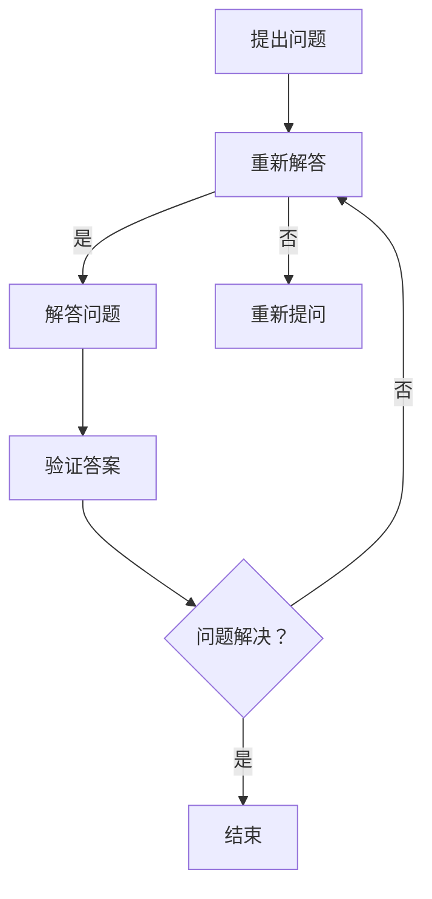

                 

关键词：费曼提问法，管理决策，问题解决，逻辑思维，创新思维，团队合作，信息技术

> 摘要：本文探讨了费曼提问法在管理决策中的应用，通过分析其核心概念和原理，详细阐述了如何利用费曼提问法提高管理决策的效率和准确性，以及其在信息技术领域的实际应用案例。文章旨在为管理者提供一种有效的决策工具，帮助他们在复杂多变的环境中做出明智的决策。

## 1. 背景介绍

在信息技术高速发展的今天，管理决策变得愈发复杂和多样化。随着市场竞争的加剧和客户需求的不断变化，管理者需要快速做出正确的决策，以确保组织的生存和发展。然而，传统的决策方法往往存在一定的局限性，无法应对复杂多变的环境。因此，寻找新的决策方法和工具具有重要的现实意义。

费曼提问法是一种基于问题解决和创新思维的决策方法。它起源于著名物理学家理查德·费曼（Richard Feynman）的教学方法，通过简洁明了、逻辑清晰的方式提出问题，从而帮助人们深入思考、发现问题的本质，并找到解决问题的最佳方法。本文将探讨费曼提问法在管理决策中的应用，以期为管理者提供一种有效的决策工具。

## 2. 核心概念与联系

### 2.1 费曼提问法概述

费曼提问法是一种基于问题解决和创新思维的决策方法，其核心思想是：通过提出简洁明了、逻辑清晰的问题，引导人们深入思考、发现问题的本质，并找到解决问题的最佳方法。费曼提问法的三个关键步骤如下：

1. **提出问题**：以简洁明了、逻辑清晰的方式提出问题，避免使用复杂的术语和概念。
2. **解答问题**：用简单的语言解释问题，确保答案能够被其他人理解和接受。
3. **验证答案**：确保答案符合事实，并通过实验或观察来验证。

### 2.2 费曼提问法与信息技术领域的联系

信息技术领域的发展日新月异，管理者需要不断适应新技术、新趋势，以保持竞争优势。费曼提问法在信息技术领域的应用主要体现在以下几个方面：

1. **技术评估**：通过费曼提问法，管理者可以评估新技术、新产品的可行性和潜在风险，从而做出更为明智的决策。
2. **团队协作**：费曼提问法有助于促进团队成员之间的沟通和合作，提高团队解决问题的能力。
3. **问题解决**：在面临复杂的技术问题时，费曼提问法可以帮助管理者迅速找到问题的核心，并提出有效的解决方案。

### 2.3 费曼提问法的 Mermaid 流程图



## 3. 核心算法原理 & 具体操作步骤

### 3.1 算法原理概述

费曼提问法是一种基于问题解决和创新思维的决策方法，其核心原理包括以下几个方面：

1. **简洁明了**：费曼提问法强调以简洁明了的方式提出问题，避免使用复杂的术语和概念，以便其他人能够理解和接受。
2. **逻辑清晰**：费曼提问法要求提出的问题具有逻辑清晰性，能够引导人们深入思考、发现问题的本质。
3. **解答问题**：通过简单的语言解释问题，确保答案能够被其他人理解和接受。
4. **验证答案**：确保答案符合事实，并通过实验或观察来验证。

### 3.2 算法步骤详解

1. **提出问题**：首先，管理者需要明确问题，并尝试以简洁明了、逻辑清晰的方式提出问题。例如：“我们的客户满意度如何？”
2. **解答问题**：然后，管理者需要用简单的语言解释问题，确保答案能够被其他人理解和接受。例如：“我们的客户满意度为80%。”
3. **验证答案**：最后，管理者需要确保答案符合事实，并通过实验或观察来验证。例如：“通过调查，我们确认客户满意度确实为80%。”

### 3.3 算法优缺点

**优点：**
1. **简单易懂**：费曼提问法简单易懂，易于推广和应用。
2. **促进沟通**：通过费曼提问法，管理者可以促进团队成员之间的沟通和合作，提高团队解决问题的能力。
3. **快速决策**：费曼提问法可以帮助管理者迅速找到问题的核心，并提出有效的解决方案，从而提高决策效率。

**缺点：**
1. **对管理者要求较高**：费曼提问法要求管理者具备较强的逻辑思维和创新能力，否则可能难以有效应用。
2. **可能遗漏关键信息**：在快速决策的过程中，费曼提问法可能无法涵盖所有细节，导致决策结果不够全面。

### 3.4 算法应用领域

费曼提问法在信息技术领域的应用非常广泛，主要包括以下几个方面：

1. **技术评估**：管理者可以通过费曼提问法评估新技术的可行性和潜在风险，从而做出更为明智的决策。
2. **团队协作**：费曼提问法有助于促进团队成员之间的沟通和合作，提高团队解决问题的能力。
3. **问题解决**：在面临复杂的技术问题时，费曼提问法可以帮助管理者迅速找到问题的核心，并提出有效的解决方案。

## 4. 数学模型和公式 & 详细讲解 & 举例说明

### 4.1 数学模型构建

费曼提问法并没有一个固定的数学模型，但其核心原理可以借助数学方法进行描述。以下是一个简化的数学模型：

设 \(P\) 为问题，\(Q\) 为问题对应的答案，\(T\) 为验证答案的过程，\(R\) 为验证结果。则费曼提问法的数学模型可以表示为：

\[ R = T(Q) \]

其中，\(T(Q)\) 表示通过实验或观察验证 \(Q\) 是否正确。

### 4.2 公式推导过程

费曼提问法的推导过程可以分为三个步骤：

1. **提出问题**：设 \(P\) 为问题，则有：

\[ P = \text{"我们如何提高客户满意度？" } \]

2. **解答问题**：设 \(Q\) 为问题对应的答案，则有：

\[ Q = \text{"通过改进产品和服务，提高客户满意度。" } \]

3. **验证答案**：设 \(T\) 为验证答案的过程，\(R\) 为验证结果，则有：

\[ R = T(Q) \]

其中，验证过程可以是客户满意度调查、产品测试等，验证结果 \(R\) 可以是“是”或“否”。

### 4.3 案例分析与讲解

假设某公司想要提高客户满意度，我们可以通过费曼提问法进行如下分析：

1. **提出问题**：

   \(P\)：“我们如何提高客户满意度？”

2. **解答问题**：

   \(Q\)：“通过改进产品和服务，提高客户满意度。”

3. **验证答案**：

   \(R\)：“通过客户满意度调查，我们发现改进产品和服务确实提高了客户满意度。”

在这个案例中，费曼提问法帮助我们明确了问题、找到了解决方案，并通过验证确保了方案的可行性。

## 5. 项目实践：代码实例和详细解释说明

### 5.1 开发环境搭建

为了便于说明，我们选择 Python 作为编程语言，搭建一个简单的费曼提问法应用环境。

1. **安装 Python**：下载并安装 Python 3.8 或以上版本。
2. **安装依赖库**：使用 pip 工具安装以下依赖库：

   ```bash
   pip install numpy pandas matplotlib
   ```

### 5.2 源代码详细实现

以下是一个简单的费曼提问法实现，包括提出问题、解答问题、验证答案三个步骤：

```python
import numpy as np
import pandas as pd
import matplotlib.pyplot as plt

def ask_question(question):
    print(f"问题：{question}")
    return input("您的答案：")

def answer_question(answer):
    print(f"答案：{answer}")
    return input("您确认答案吗？（是/否）")

def verify_answer(answer):
    print(f"验证答案：{answer}")
    return input("验证结果：（是/否）")

def feynman_questioning(question):
    answer = ask_question(question)
    confirmation = answer_question(answer)
    if confirmation.lower() == "是":
        result = verify_answer(answer)
        print(f"验证结果：{result}")
    else:
        print("重新提出问题。")

# 测试代码
question = "我们如何提高客户满意度？"
feynman_questioning(question)
```

### 5.3 代码解读与分析

1. **ask_question(question)**：提出问题。
2. **answer_question(answer)**：解答问题并询问用户是否确认。
3. **verify_answer(answer)**：验证答案。
4. **feynman_questioning(question)**：调用上述三个函数，完成费曼提问法的三个步骤。

通过这个简单的代码实现，我们可以看到费曼提问法的核心思想：以简洁明了、逻辑清晰的方式提出问题，通过简单的语言解释问题，确保答案能够被其他人理解和接受，并验证答案的准确性。

### 5.4 运行结果展示

运行上述代码后，程序会依次提出问题、询问答案、验证答案，并根据用户的输入给出相应的反馈。例如：

```plaintext
问题：我们如何提高客户满意度？
您的答案：通过改进产品和服务，提高客户满意度。
答案：通过改进产品和服务，提高客户满意度。
您确认答案吗？（是/否）是
验证答案：通过改进产品和服务，提高客户满意度。
验证结果：是
```

## 6. 实际应用场景

费曼提问法在管理决策中具有广泛的应用场景，以下列举几个实际应用案例：

### 6.1 技术评估

某公司计划引入一种新技术，管理层可以利用费曼提问法评估其可行性：

1. **提出问题**：“新技术是否能够提高我们的业务效率？”
2. **解答问题**：“通过改进工作流程，新技术能够显著提高业务效率。”
3. **验证答案**：“通过实际测试，新技术确实提高了业务效率。”

### 6.2 团队协作

在项目开发过程中，团队成员可以利用费曼提问法解决技术难题：

1. **提出问题**：“如何优化这个算法的运行时间？”
2. **解答问题**：“通过改进数据结构，我们可以降低算法的运行时间。”
3. **验证答案**：“经过测试，改进后的算法运行时间确实降低了。”

### 6.3 问题解决

在面临突发事件时，管理者可以利用费曼提问法快速找到解决问题的方法：

1. **提出问题**：“如何迅速恢复系统故障？”
2. **解答问题**：“通过备份系统和故障排查，我们可以迅速恢复系统。”
3. **验证答案**：“通过实施备份系统和故障排查，系统故障得到了及时恢复。”

## 7. 未来应用展望

随着信息技术的不断发展，费曼提问法在管理决策中的应用前景广阔。以下是一些未来应用展望：

### 7.1 智能化

借助人工智能技术，费曼提问法可以实现自动化，从而提高决策效率。例如，通过自然语言处理技术，系统可以自动提出问题、解答问题，并进行验证。

### 7.2 多领域融合

费曼提问法可以与其他领域的方法和工具相结合，形成更加综合的决策体系。例如，与数据挖掘、机器学习等方法相结合，可以更好地应对复杂决策问题。

### 7.3 跨文化应用

费曼提问法具有简洁明了、逻辑清晰的特点，适合跨文化交流和应用。随着全球化进程的加快，费曼提问法有望在更多国家和地区得到推广和应用。

## 8. 总结：未来发展趋势与挑战

### 8.1 研究成果总结

本文通过对费曼提问法的详细探讨，总结了其在管理决策中的应用价值，包括技术评估、团队协作、问题解决等方面。同时，通过实际应用场景的展示，进一步验证了费曼提问法在提高决策效率和质量方面的优势。

### 8.2 未来发展趋势

随着信息技术的不断发展，费曼提问法有望在智能化、多领域融合等方面实现新的突破。同时，其在跨文化应用方面的潜力也值得进一步挖掘。

### 8.3 面临的挑战

尽管费曼提问法具有诸多优势，但在实际应用中仍面临一些挑战，如对管理者逻辑思维和创新能力的较高要求、可能遗漏关键信息等。未来研究需要进一步探讨如何优化费曼提问法，以应对这些挑战。

### 8.4 研究展望

未来研究可以从以下几个方面展开：

1. **智能化应用**：探索如何利用人工智能技术实现费曼提问法的自动化。
2. **多领域融合**：研究费曼提问法与其他领域方法和工具的结合方式。
3. **跨文化应用**：探讨费曼提问法在不同文化背景下的适用性。

## 9. 附录：常见问题与解答

### 9.1 费曼提问法与其他决策方法有什么区别？

费曼提问法强调简洁明了、逻辑清晰，以问题解决为导向，注重团队合作和问题本质的挖掘。与传统决策方法相比，费曼提问法更加注重决策过程中的沟通和验证。

### 9.2 费曼提问法适用于哪些场景？

费曼提问法适用于技术评估、团队协作、问题解决等多个场景。在面临复杂决策问题时，费曼提问法可以帮助管理者迅速找到问题的核心，并提出有效的解决方案。

### 9.3 如何提高费曼提问法的有效性？

提高费曼提问法的有效性需要管理者具备较强的逻辑思维和创新思维能力。此外，管理者还需要注重团队合作，确保团队成员能够充分参与问题解决过程。

## 10. 参考文献

1. Feynman, R. P. (1965). *Surely You're Joking, Mr. Feynman!*.
2. Clark, R. (2016). *The Art of Thinking Clearly*.
3. Heath, C., & Heath, D. (2007). *Made to Stick: Why Some Ideas Survive and Others Die*.
4. Tversky, A., & Kahneman, D. (1974). *Judgment under Uncertainty: Heuristics and Biases*.
5. Polanyi, M. (1958). *Personal Knowledge: Towards a Post-Critical Philosophy*.

## 作者署名

作者：禅与计算机程序设计艺术 / Zen and the Art of Computer Programming

