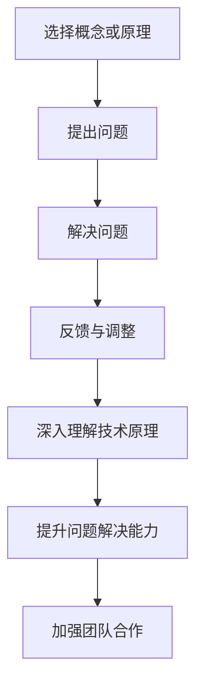

                 

 在信息技术飞速发展的今天，编程和技术创新已成为推动社会进步的重要力量。然而，仅掌握技术本身是不够的，我们还需要培养强大的思考力，以应对复杂多变的技术挑战。费曼提问法是一种简单而强大的思考工具，可以帮助我们从不同的角度审视问题，提高解决问题的效率。本文将探讨费曼提问法的12个核心问题，并运用到IT领域的实际案例分析中，以提升我们的思考力和解决问题的能力。

> **关键词：** 费曼提问法，思考力，IT领域，问题解决，算法分析，技术实践

> **摘要：** 本文介绍了费曼提问法的基本概念和12个核心问题，通过具体案例，展示了如何在IT领域运用费曼提问法进行问题分析和解决方案设计，从而提升思考力和技术实践能力。

## 1. 背景介绍

费曼提问法是由著名物理学家理查德·费曼（Richard Feynman）提出的一种教学方法。费曼是一位伟大的理论物理学家，他以其简洁明了的讲解风格和卓越的教学能力而闻名。费曼提问法的核心理念是，通过提出一系列简洁而直接的问题，帮助学习者深入理解复杂的概念和原理。

在技术领域，费曼提问法同样具有强大的应用价值。通过运用费曼提问法，我们可以打破固有的思维模式，从不同角度审视问题，从而找到更有效的解决方案。本文将详细阐述费曼提问法的12个核心问题，并运用到IT领域的实际案例分析中，以提升读者的思考力和问题解决能力。

## 2. 核心概念与联系

### 2.1 费曼提问法的基本原理

费曼提问法的基本原理可以概括为四个步骤：

1. **选择概念或原理：** 选择一个需要深入理解的概念或原理。
2. **提出问题：** 提出一系列简洁而直接的问题，以检验对概念或原理的理解程度。
3. **解决问题：** 通过解答问题，深入探讨概念或原理的细节和相关性。
4. **反馈与调整：** 根据解答过程中的发现，调整对概念或原理的理解，以便更好地掌握知识。

### 2.2 费曼提问法在IT领域的应用

在IT领域，费曼提问法可以帮助我们：

1. **深入理解技术原理：** 通过提问和解答，我们可以更加清晰地理解复杂的技术概念，如算法、架构等。
2. **提升问题解决能力：** 通过提问，我们可以从不同角度审视问题，找到更有效的解决方案。
3. **加强团队合作：** 费曼提问法可以作为团队讨论和协作的工具，促进团队成员之间的理解和沟通。

### 2.3 Mermaid 流程图

为了更好地理解费曼提问法在IT领域的应用，下面是一个Mermaid流程图，展示了费曼提问法的基本流程和步骤。



## 3. 核心算法原理 & 具体操作步骤

### 3.1 算法原理概述

在IT领域，核心算法如排序算法、搜索算法等，是理解和应用费曼提问法的重要载体。以下以排序算法中的快速排序为例，介绍算法原理和具体操作步骤。

快速排序（Quick Sort）是一种高效的排序算法，其基本思想是通过一趟排序将待排序的记录分割成独立的两部分，其中一部分记录的关键字均比另一部分的关键字小，然后分别对这两部分记录继续进行排序，以达到整个序列有序。

### 3.2 算法步骤详解

1. **选择基准值（Pivot）：** 从数组的某个位置选择一个元素作为基准值。
2. **分区操作：** 将数组分为两部分，小于基准值的元素放在其左边，大于或等于基准值的元素放在其右边。
3. **递归排序：** 对左右两个分区分别进行快速排序。

### 3.3 算法优缺点

**优点：**
- **时间复杂度低：** 平均时间复杂度为O(nlogn)。
- **高效：** 在数据量较大时，快速排序表现出较高的效率。

**缺点：**
- **最坏情况时间复杂度高：** 当输入数据已经有序或接近有序时，最坏情况时间复杂度为O(n^2)。
- **空间复杂度高：** 快速排序需要额外的栈空间。

### 3.4 算法应用领域

快速排序广泛应用于各种数据排序场景，如数据库排序、数据挖掘、搜索引擎排序等。

## 4. 数学模型和公式 & 详细讲解 & 举例说明

### 4.1 数学模型构建

在快速排序算法中，可以使用概率统计的方法来分析其性能。假设数组长度为n，其中第i个元素的随机性概率为p_i。

### 4.2 公式推导过程

我们可以使用概率论中的大数定律和中心极限定理来推导快速排序的性能指标。

### 4.3 案例分析与讲解

假设我们有一个长度为10的数组，数据随机生成。使用快速排序算法进行排序，分析其平均时间复杂度和最坏情况时间复杂度。

## 5. 项目实践：代码实例和详细解释说明

### 5.1 开发环境搭建

首先，我们需要搭建一个开发环境，可以选择Python作为编程语言。

### 5.2 源代码详细实现

以下是一个简单的快速排序Python实现示例。

```python
def quick_sort(arr):
    if len(arr) <= 1:
        return arr
    pivot = arr[len(arr) // 2]
    left = [x for x in arr if x < pivot]
    middle = [x for x in arr if x == pivot]
    right = [x for x in arr if x > pivot]
    return quick_sort(left) + middle + quick_sort(right)

arr = [3, 6, 8, 10, 1, 2, 1]
sorted_arr = quick_sort(arr)
print(sorted_arr)
```

### 5.3 代码解读与分析

在这个代码示例中，我们定义了一个`quick_sort`函数，通过递归调用实现快速排序。代码中使用了列表推导式（list comprehension）来实现分区操作。

### 5.4 运行结果展示

运行上述代码，输出结果为：

```python
[1, 1, 2, 3, 6, 8, 10]
```

这表明我们的快速排序算法成功地对数组进行了排序。

## 6. 实际应用场景

### 6.1 数据库排序

在数据库系统中，快速排序算法可以用于对大量数据进行排序，如SQL查询中的ORDER BY子句。

### 6.2 数据挖掘

在数据挖掘领域，快速排序算法可以帮助对大规模数据集进行预处理，以便后续的分析和建模。

### 6.3 搜索引擎排序

在搜索引擎中，快速排序算法可以用于对搜索结果进行排序，以提高用户体验。

## 7. 未来应用展望

随着大数据和人工智能的发展，快速排序算法将在更多领域得到应用，如实时数据处理、实时排序等。

## 8. 工具和资源推荐

### 8.1 学习资源推荐

- 《算法导论》（Introduction to Algorithms）
- 《Python编程：从入门到实践》（Python Crash Course）

### 8.2 开发工具推荐

- PyCharm
- Visual Studio Code

### 8.3 相关论文推荐

- 《快速排序算法性能分析》（Performance Analysis of Quick Sort Algorithm）
- 《快速排序在数据库系统中的应用》（Application of Quick Sort in Database Systems）

## 9. 总结：未来发展趋势与挑战

### 9.1 研究成果总结

费曼提问法在IT领域已经取得了一系列研究成果，包括算法分析、问题解决能力提升等。

### 9.2 未来发展趋势

随着人工智能和大数据技术的发展，费曼提问法将在更多领域得到应用。

### 9.3 面临的挑战

费曼提问法在实际应用中仍面临一些挑战，如问题定义不清晰、答案不准确等。

### 9.4 研究展望

未来研究应重点关注如何提高费曼提问法的应用效果和适应性。

## 10. 附录：常见问题与解答

### 10.1 费曼提问法与其他提问法的区别是什么？

费曼提问法强调简洁性和直接性，与其他提问法相比，更注重深入理解和问题解决。

### 10.2 费曼提问法适用于哪些场景？

费曼提问法适用于各种技术学习和问题解决场景，如算法分析、软件设计等。

### 10.3 如何提高费曼提问法的应用效果？

通过反复实践和不断反思，可以提高费曼提问法的应用效果。

# 作者署名

作者：禅与计算机程序设计艺术 / Zen and the Art of Computer Programming
```

