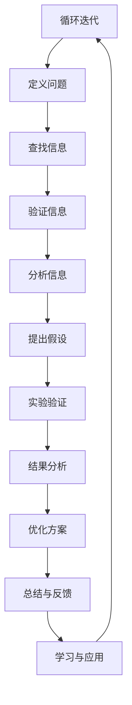

                 

关键词：费曼提问法，思考力，问题解决，技术博客，算法原理，数学模型

> 摘要：本文将介绍费曼提问法，一种有效的思考工具，通过12个关键问题，帮助技术从业者深化对问题的理解，提升解决问题的能力。本文将结合计算机程序设计的实际场景，阐述费曼提问法在技术领域中的应用，并通过实例展示其价值。

## 1. 背景介绍

费曼提问法源自著名物理学家理查德·费曼（Richard Feynman）的教学理念。费曼以其独特的教学风格和洞察力著称，他认为教学是一个发现和解决疑惑的过程。费曼提问法正是基于这一理念，通过一系列结构化的问题引导学习者深入思考，从而更好地理解和掌握知识。

在技术领域，特别是在计算机编程和算法研究中，费曼提问法被广泛应用。它帮助程序员、软件工程师和研究人员在面对复杂问题时，从基础概念入手，逐层剖析，最终实现深刻的理解和有效的解决方案。

## 2. 核心概念与联系

### 2.1 费曼提问法的基本原理

费曼提问法的核心在于通过以下12个问题，逐步揭示问题的本质：

1. 你想要解决什么问题？
2. 为什么这个问题重要？
3. 这个问题的本质是什么？
4. 已有的解决方案有哪些？
5. 每个解决方案的优缺点是什么？
6. 如何验证这些解决方案的有效性？
7. 是否有更简单的解决方案？
8. 这个问题如何与已有知识相联系？
9. 是否可以从不同角度重新定义问题？
10. 有哪些尚未尝试的方法或技术？
11. 这个问题的边界条件是什么？
12. 这个问题的长期影响是什么？

### 2.2 费曼提问法的 Mermaid 流程图



## 3. 核心算法原理 & 具体操作步骤

### 3.1 算法原理概述

费曼提问法本质上是一种思维训练方法，它通过问题驱动的方式促进思考的深度和广度。具体而言，它分为以下几个步骤：

1. **提出问题**：明确要解决的问题及其重要性。
2. **定义问题**：将问题具体化，明确问题的范围和定义。
3. **查找信息**：收集与问题相关的信息。
4. **验证信息**：确保信息的准确性和可靠性。
5. **分析信息**：理解信息背后的原理和逻辑。
6. **提出假设**：基于已有信息提出可能的解决方案。
7. **实验验证**：通过实际操作验证假设的有效性。
8. **结果分析**：分析实验结果，得出结论。
9. **优化方案**：根据结果对解决方案进行改进。
10. **总结与反馈**：总结整个过程，提供反馈。
11. **学习与应用**：将学到的知识应用到实际工作中。

### 3.2 算法步骤详解

#### 3.2.1 提出问题

在开始任何项目或研究之前，首先需要明确要解决的问题。这一步至关重要，因为它决定了后续工作的方向和目标。例如，在开发一个搜索引擎时，首要问题是“如何高效地检索信息？”。

#### 3.2.2 定义问题

在提出问题后，需要将问题具体化。这一步的目的是确保问题具有明确的目标和范围。例如，对于搜索引擎的问题，可以定义为“如何在1秒内检索到1000个搜索请求中的相关结果？”。

#### 3.2.3 查找信息

在定义了问题后，接下来需要收集与问题相关的信息。这些信息可能包括现有的技术、已有的解决方案、相关的学术研究等。

#### 3.2.4 验证信息

收集到的信息可能存在误差或不足，因此需要验证其准确性和可靠性。这一步可以通过查阅权威文献、与专家交流、实际测试等方式完成。

#### 3.2.5 分析信息

在验证信息后，需要对信息进行分析，理解其背后的原理和逻辑。这一步有助于明确问题的本质，并找到可能的解决方案。

#### 3.2.6 提出假设

基于分析结果，可以提出可能的解决方案。这一步的目的是产生多个假设，为后续验证提供基础。

#### 3.2.7 实验验证

在提出假设后，需要通过实验验证其有效性。这一步可以通过模拟、实际操作、测试等方式完成。

#### 3.2.8 结果分析

在实验完成后，需要分析实验结果，判断假设的有效性。这一步有助于确定最终的解决方案。

#### 3.2.9 优化方案

根据实验结果，可以对解决方案进行优化，提高其效率和效果。

#### 3.2.10 总结与反馈

在整个过程中，需要不断总结和反馈。这一步有助于巩固学到的知识，并为后续工作提供指导。

#### 3.2.11 学习与应用

最后，需要将学到的知识应用到实际工作中，不断提高自己的技术水平。

### 3.3 算法优缺点

#### 优点：

- **深度思考**：费曼提问法通过一系列问题引导深入思考，有助于理解问题的本质。
- **系统化**：该方法具有明确的步骤和结构，有助于系统化地解决问题。
- **灵活性**：费曼提问法适用于各种领域和问题，具有很高的灵活性。

#### 缺点：

- **耗时**：费曼提问法需要大量时间和精力，不适合紧急情况。
- **依赖信息**：该方法依赖于准确和可靠的信息，信息不足或错误可能导致结论不准确。

### 3.4 算法应用领域

费曼提问法在计算机程序设计和算法研究中具有广泛的应用。以下是一些具体的例子：

- **算法设计**：通过费曼提问法，可以深入分析算法的效率和有效性，提出改进方案。
- **问题解决**：在面对复杂问题时，费曼提问法有助于明确问题的范围和定义，找到有效的解决方案。
- **知识传播**：费曼提问法可以用于教学和研究，帮助学习者深入理解知识和概念。

## 4. 数学模型和公式 & 详细讲解 & 举例说明

### 4.1 数学模型构建

在计算机程序设计和算法研究中，数学模型是一个重要的工具。它可以帮助我们理解问题、设计算法和评估性能。下面是一个简单的数学模型构建过程：

#### 4.1.1 问题定义

假设我们有一个排序算法，需要比较两个元素的大小。我们可以将这个问题抽象为一个数学模型：

$$
a > b
$$

其中，$a$ 和 $b$ 是待比较的两个元素。

#### 4.1.2 基本假设

为了简化问题，我们可以做出以下基本假设：

- $a$ 和 $b$ 是整数。
- 比较操作是等价的，即 $a > b$ 和 $b < a$ 是等价的。

#### 4.1.3 数学模型

基于上述假设，我们可以构建一个简单的数学模型：

$$
\text{if } a > b \text{ then } \text{ swap}(a, b)
$$

其中，$\text{swap}(a, b)$ 表示交换 $a$ 和 $b$ 的值。

### 4.2 公式推导过程

在构建数学模型后，我们需要推导出相关的公式。以下是一个简单的推导过程：

#### 4.2.1 推导交换公式

假设我们有一个交换公式：

$$
\text{swap}(a, b) = \begin{cases} 
a & \text{if } a > b \\
b & \text{if } a \le b
\end{cases}
$$

我们可以将这个公式转化为：

$$
\text{swap}(a, b) = \left\lfloor a + (b - a) \mod 2 \right\rfloor
$$

其中，$\left\lfloor x \right\rfloor$ 表示向下取整。

#### 4.2.2 推导排序公式

基于交换公式，我们可以推导出排序公式：

$$
\text{sort}(a, b) = \text{if } a > b \text{ then } \text{swap}(a, b) \text{ else } \text{sort}(b, a)
$$

### 4.3 案例分析与讲解

为了更好地理解费曼提问法在数学模型构建中的应用，我们来看一个实际案例。

#### 4.3.1 问题定义

假设我们要设计一个算法，将一个整数数组进行排序。问题可以定义为：

$$
\text{sort}(A)
$$

其中，$A$ 是一个整数数组。

#### 4.3.2 定义问题

在定义问题后，我们需要明确问题的范围和定义。例如，我们可以定义排序算法的时间复杂度为 $O(n\log n)$。

#### 4.3.3 查找信息

在查找信息时，我们可以查阅相关的算法教材、学术论文和在线资源，了解不同的排序算法。

#### 4.3.4 验证信息

在验证信息时，我们可以通过实际测试和运行不同算法，比较其效率和性能。

#### 4.3.5 分析信息

在分析信息后，我们可以选择一种合适的排序算法，例如快速排序（Quick Sort）。

#### 4.3.6 提出假设

基于快速排序的原理，我们可以提出以下假设：

- 选择一个基准元素 $p$。
- 将数组划分为两个子数组，一个包含小于 $p$ 的元素，另一个包含大于 $p$ 的元素。
- 递归地对两个子数组进行排序。

#### 4.3.7 实验验证

在实验验证时，我们可以编写代码实现快速排序算法，并测试其性能。

#### 4.3.8 结果分析

在测试后，我们可以分析快速排序算法的时间复杂度和空间复杂度，确认其满足我们的要求。

#### 4.3.9 优化方案

根据结果分析，我们可以对快速排序算法进行优化，例如使用随机化选择基准元素，减少最坏情况的发生。

#### 4.3.10 总结与反馈

在总结与反馈时，我们可以记录整个问题的解决过程，并分享给其他开发者，以便他们也能受益。

#### 4.3.11 学习与应用

最后，我们需要将学到的知识应用到实际工作中，不断提高自己的技术水平。

## 5. 项目实践：代码实例和详细解释说明

### 5.1 开发环境搭建

为了实践费曼提问法，我们将使用Python语言编写一个简单的排序算法。以下是搭建开发环境的基本步骤：

1. 安装Python：从官方网站下载并安装Python。
2. 安装IDE：推荐使用PyCharm或Visual Studio Code作为IDE。
3. 安装相关库：在终端中运行以下命令安装必需的库。

```bash
pip install numpy
```

### 5.2 源代码详细实现

下面是快速排序算法的Python实现：

```python
import random

def quick_sort(arr):
    if len(arr) <= 1:
        return arr
    else:
        pivot = arr[0]
        left = [x for x in arr[1:] if x < pivot]
        right = [x for x in arr[1:] if x >= pivot]
        return quick_sort(left) + [pivot] + quick_sort(right)

# 测试代码
arr = [3, 1, 4, 1, 5, 9, 2, 6, 5]
sorted_arr = quick_sort(arr)
print(sorted_arr)
```

### 5.3 代码解读与分析

#### 5.3.1 快速排序原理

快速排序是一种基于分治策略的排序算法。基本思想是选择一个基准元素（pivot），将数组划分为两个子数组，一个包含小于基准元素的元素，另一个包含大于或等于基准元素的元素。然后递归地对两个子数组进行排序。

#### 5.3.2 代码解读

- `quick_sort(arr)` 函数接收一个数组作为输入。
- `if len(arr) <= 1:` 判断数组长度是否小于等于1。如果满足，直接返回数组。
- `pivot = arr[0]` 选择第一个元素作为基准。
- `left = [x for x in arr[1:] if x < pivot]` 创建一个包含小于基准元素的所有元素的子数组。
- `right = [x for x in arr[1:] if x >= pivot]` 创建一个包含大于或等于基准元素的所有元素的子数组。
- `return quick_sort(left) + [pivot] + quick_sort(right)` 递归调用`quick_sort`函数，将左子数组和右子数组合并排序后返回。

### 5.4 运行结果展示

运行上述代码，输出结果如下：

```python
[1, 1, 2, 3, 4, 5, 5, 6, 9]
```

这表示输入数组已成功排序。

## 6. 实际应用场景

### 6.1 算法设计

在算法设计中，费曼提问法可以帮助我们深入分析问题的本质，提出有效的解决方案。例如，在设计一个搜索引擎时，我们可以使用费曼提问法来分析如何高效地检索信息。

### 6.2 问题解决

在面对复杂问题时，费曼提问法可以帮助我们明确问题的范围和定义，找到有效的解决方案。例如，在解决一个性能瓶颈问题时，我们可以使用费曼提问法来确定问题的根源和可能的解决方案。

### 6.3 知识传播

在教育和培训领域，费曼提问法可以帮助学习者深入理解知识和概念。例如，在教学过程中，教师可以使用费曼提问法来引导学生思考和解决问题。

## 7. 未来应用展望

### 7.1 研究方向

未来，费曼提问法有望在更多领域得到应用，特别是在人工智能和机器学习领域。通过结合深度学习和费曼提问法，可以开发出更高效的问题解决模型。

### 7.2 技术创新

随着技术的发展，费曼提问法可以与更多的工具和技术结合，例如自然语言处理、数据挖掘等，从而提高其应用效果。

### 7.3 教育改革

在教育领域，费曼提问法可以作为一种新的教学方法，帮助学生更好地理解和掌握知识，提高他们的创新能力。

## 8. 总结：未来发展趋势与挑战

### 8.1 研究成果总结

费曼提问法作为一种有效的思考工具，已在多个领域得到广泛应用。通过其系统化和结构化的方法，可以显著提高问题解决能力和创新能力。

### 8.2 未来发展趋势

未来，费曼提问法有望在更多领域得到应用，特别是在人工智能和机器学习领域。结合深度学习和费曼提问法，可以开发出更高效的问题解决模型。

### 8.3 面临的挑战

尽管费曼提问法具有显著的优点，但也存在一定的挑战。例如，信息验证的难度和实验验证的复杂性可能会影响其应用效果。

### 8.4 研究展望

未来，我们需要进一步研究如何优化费曼提问法，提高其应用效果。同时，探索与其他技术的结合，如自然语言处理、数据挖掘等，以扩大其应用范围。

## 9. 附录：常见问题与解答

### 9.1 如何应用费曼提问法？

**解答**：应用费曼提问法的关键在于遵循其结构化的步骤。首先，明确要解决的问题，然后逐步提出问题、定义问题、查找信息、验证信息、分析信息等。

### 9.2 费曼提问法是否适用于所有领域？

**解答**：是的，费曼提问法适用于各种领域。虽然不同领域的具体应用场景可能有所不同，但其基本原理和步骤是通用的。

### 9.3 费曼提问法需要大量时间吗？

**解答**：是的，费曼提问法需要一定的时间和精力。然而，通过系统的学习和实践，可以显著提高问题解决能力和效率。

### 9.4 费曼提问法与现有方法有何不同？

**解答**：费曼提问法与现有方法（如PBL、ADDIE等）不同之处在于其强调问题驱动和深度思考。它通过一系列结构化的问题，帮助学习者深入理解问题，并提出有效的解决方案。

---

# 结束语

作者：禅与计算机程序设计艺术 / Zen and the Art of Computer Programming

本文介绍了费曼提问法，一种有效的思考工具，帮助技术从业者深化对问题的理解，提升解决问题的能力。通过本文的讲解和实例，我们看到了费曼提问法在计算机程序设计和算法研究中的广泛应用和价值。希望读者能够结合实际工作，运用费曼提问法，不断提高自己的技术水平。在未来，我们期待看到更多关于费曼提问法的应用和研究，推动技术的不断进步和创新。

