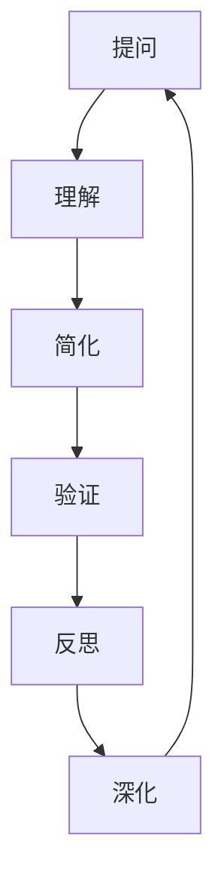

                 

 费曼提问法是一种以著名物理学家理查德·费曼（Richard Feynman）的名字命名的思考技巧。费曼是一位杰出的理论物理学家，以其清晰简洁的思考方式和对复杂概念的解释能力而闻名。这种方法通过一系列关键问题，帮助我们从基础出发，深入理解复杂问题。本文将探讨费曼提问法的12个核心问题，并展示如何将其应用于技术领域，以提升思考力和解决问题的能力。

> **关键词**：费曼提问法、思考技巧、问题解决、技术领域、深入理解

> **摘要**：本文将详细介绍费曼提问法的12个核心问题，并探讨如何将这些问题应用于技术领域，以提升思考力和解决问题的能力。通过实例和案例分析，我们将展示如何使用费曼提问法来深入理解复杂的技术概念，并在实际项目中应用这些思考技巧。

## 1. 背景介绍

理查德·费曼（1918-1988）是一位著名的理论物理学家，因其对量子力学的贡献而获得了诺贝尔物理学奖。费曼以其独特的教学风格和对复杂概念的解释能力而闻名。他擅长将复杂的概念简化为基本原理，使得学生能够轻松理解。费曼提问法就是他教学风格的一个体现，这种方法通过一系列关键问题，帮助人们从基础出发，深入理解复杂问题。

费曼提问法的基本原理是，通过不断提出问题，迫使自己深入思考，直到能够用简单的语言清晰地解释复杂的概念。这种方法的核心是保持好奇心和批判性思维，不满足于表面的理解，而是追求深刻的洞察和全面的掌握。

## 2. 核心概念与联系

在技术领域，费曼提问法可以应用于各种复杂的问题，包括算法、编程、系统架构等。以下是费曼提问法的核心概念和联系，以及一个Mermaid流程图，展示这些概念之间的关系。



### 2.1 提问

提问是费曼提问法的起点。通过提出关键问题，我们可以揭示问题的本质，并确定我们需要解决的关键点。提问的过程迫使我们对问题进行深入思考，而不是停留在表面。

### 2.2 理解

理解是将问题分解为基本组成部分的过程。通过理解，我们可以识别出问题的核心概念，并了解它们是如何相互关联的。理解是深入探索问题的第一步。

### 2.3 简化

简化是将复杂的概念转化为简单形式的过程。通过简化，我们可以将复杂的问题分解为更容易管理的部分，并使用基本的原理来解释它们。简化是提高思考效率的关键。

### 2.4 验证

验证是通过测试和实验来验证我们的理解是否正确。通过验证，我们可以确保我们的解决方案是有效的，并且能够解决实际问题。

### 2.5 反思

反思是对我们的思考和解决方案进行评估的过程。通过反思，我们可以识别出我们的错误和不足之处，并寻找改进的机会。

### 2.6 深化

深化是在理解、简化、验证和反思的基础上，进一步探索问题的过程。通过深化，我们可以不断改进我们的理解，并寻求更加深入的洞察。

## 3. 核心算法原理 & 具体操作步骤

### 3.1 算法原理概述

费曼提问法的算法原理可以概括为以下几个步骤：

1. **提出问题**：确定我们需要解决的问题，并开始提问。
2. **理解问题**：深入理解问题的本质，并将问题分解为基本组成部分。
3. **简化问题**：将复杂的问题转化为简单的形式，以便更好地理解。
4. **验证解决方案**：通过测试和实验来验证我们的理解是否正确。
5. **反思和深化**：评估我们的思考和解决方案，并寻找改进的机会。

### 3.2 算法步骤详解

1. **提出问题**：
   - 确定我们需要解决的问题。
   - 开始提问，以揭示问题的本质。

2. **理解问题**：
   - 将问题分解为基本组成部分。
   - 识别出问题的核心概念，并了解它们是如何相互关联的。

3. **简化问题**：
   - 将复杂的问题转化为简单的形式。
   - 使用基本的原理来解释复杂的问题。

4. **验证解决方案**：
   - 通过测试和实验来验证我们的理解是否正确。
   - 确保我们的解决方案是有效的，并且能够解决实际问题。

5. **反思和深化**：
   - 评估我们的思考和解决方案。
   - 识别出错误和不足之处，并寻找改进的机会。
   - 进一步探索问题，以寻求更加深入的洞察。

### 3.3 算法优缺点

#### 优点：

- **深入理解**：通过提问和反思，我们可以深入理解复杂问题，而不仅仅是表面的了解。
- **简化复杂问题**：简化过程可以帮助我们将复杂的问题转化为简单的形式，从而更容易管理和解决。
- **批判性思维**：提问和反思过程鼓励批判性思维，帮助我们发现错误和不足之处，并寻找改进的机会。

#### 缺点：

- **需要时间**：费曼提问法是一个深入思考的过程，可能需要更多的时间来理解和解决问题。
- **挑战性**：对于初学者来说，提出有意义的问题和深入理解问题可能具有一定的挑战性。

### 3.4 算法应用领域

费曼提问法可以应用于各种技术领域，包括：

- **算法设计**：通过提问和反思，可以深入理解算法的原理和实现，从而优化算法。
- **编程**：通过提问和反思，可以更好地理解代码的运行原理，并发现和解决潜在的问题。
- **系统架构**：通过提问和反思，可以深入理解系统的设计和实现，从而优化系统性能和可靠性。
- **项目管理**：通过提问和反思，可以更好地理解项目中的关键问题和挑战，并制定有效的解决方案。

## 4. 数学模型和公式 & 详细讲解 & 举例说明

### 4.1 数学模型构建

费曼提问法中的数学模型构建过程可以分为以下几个步骤：

1. **提出问题**：确定我们需要解决的问题，并开始提问。
2. **理解问题**：深入理解问题的本质，并将问题转化为数学形式。
3. **建立模型**：根据问题的本质，建立相应的数学模型。
4. **公式推导**：使用数学方法，推导出模型的公式。
5. **验证模型**：通过实验或实际应用，验证模型的准确性。

### 4.2 公式推导过程

以最简单的例子——一元一次方程的求解为例，说明公式推导过程。

**问题**：求解方程 $ax+b=0$ 的解。

**步骤**：

1. **提出问题**：求解方程 $ax+b=0$ 的解。
2. **理解问题**：这是一个一元一次方程，我们需要找到满足方程的未知数 $x$。
3. **建立模型**：根据问题，我们可以建立如下数学模型：
   $$ax+b=0$$
4. **公式推导**：
   - 将方程两边同时减去 $b$，得到：
     $$ax=-b$$
   - 将方程两边同时除以 $a$（假设 $a \neq 0$），得到：
     $$x=-\frac{b}{a}$$
5. **验证模型**：我们可以通过实际计算来验证这个公式的准确性。

### 4.3 案例分析与讲解

以下是一个应用费曼提问法的案例，分析并求解一个更复杂的数学问题。

**问题**：求解方程组：
$$
\begin{cases}
2x + 3y = 8 \\
4x - y = 1
\end{cases}
$$

**步骤**：

1. **提出问题**：求解上述方程组的解。
2. **理解问题**：这是一个由两个方程组成的一元一次方程组，我们需要找到满足这两个方程的未知数 $x$ 和 $y$。
3. **简化问题**：我们可以通过消元法来简化这个方程组。首先，将第一个方程乘以 4，得到：
   $$8x + 12y = 32$$
   然后，将第二个方程乘以 3，得到：
   $$12x - 3y = 3$$
4. **公式推导**：
   - 将上述两个方程相加，消去 $y$，得到：
     $$20x = 35$$
   - 解得 $x = \frac{35}{20} = \frac{7}{4}$。
   - 将 $x$ 的值代入第一个方程，解得 $y = \frac{8 - 2x}{3} = \frac{8 - 2 \times \frac{7}{4}}{3} = \frac{1}{6}$。
5. **验证模型**：我们可以将求得的解代入原方程组，验证其准确性。

## 5. 项目实践：代码实例和详细解释说明

### 5.1 开发环境搭建

为了演示费曼提问法的应用，我们将使用 Python 语言来实现一个简单的计算器。首先，我们需要搭建 Python 开发环境。

1. **安装 Python**：下载并安装最新版本的 Python（例如 Python 3.9），并确保将其添加到系统的 PATH 环境变量中。
2. **安装 IDE**：下载并安装一个 Python 集成开发环境（IDE），例如 PyCharm 或 VSCode，以方便编写和调试代码。
3. **创建项目**：在 IDE 中创建一个新的 Python 项目，并创建一个名为 `calculator.py` 的文件。

### 5.2 源代码详细实现

以下是计算器的源代码实现：

```python
# calculator.py

def add(x, y):
    """实现加法操作"""
    return x + y

def subtract(x, y):
    """实现减法操作"""
    return x - y

def multiply(x, y):
    """实现乘法操作"""
    return x * y

def divide(x, y):
    """实现除法操作"""
    if y == 0:
        return "除数不能为 0"
    return x / y

def main():
    """计算器主函数"""
    print("欢迎使用 Python 计算器！")
    print("请选择操作类型：\n1. 加法\n2. 减法\n3. 乘法\n4. 除法")
    choice = input("请输入你的选择（1-4）：")
    
    if choice == "1":
        x = float(input("请输入第一个数："))
        y = float(input("请输入第二个数："))
        result = add(x, y)
    elif choice == "2":
        x = float(input("请输入第一个数："))
        y = float(input("请输入第二个数："))
        result = subtract(x, y)
    elif choice == "3":
        x = float(input("请输入第一个数："))
        y = float(input("请输入第二个数："))
        result = multiply(x, y)
    elif choice == "4":
        x = float(input("请输入第一个数："))
        y = float(input("请输入第二个数："))
        result = divide(x, y)
    else:
        print("无效的选择。")
        return
    
    print(f"结果：{result}")

if __name__ == "__main__":
    main()
```

### 5.3 代码解读与分析

1. **函数定义**：我们定义了四个函数，分别实现加法、减法、乘法和除法操作。每个函数接收两个参数，并返回计算结果。
2. **主函数实现**：`main()` 函数是计算器的主函数，负责接收用户输入，并调用相应的函数进行计算。根据用户的选择，主函数会调用不同的函数，并打印出计算结果。
3. **输入处理**：我们使用 `input()` 函数获取用户输入，并将其转换为浮点数。对于除法操作，我们特别处理了除数为 0 的情况，并返回相应的错误消息。
4. **异常处理**：我们使用 `if-else` 语句来处理无效的选择。如果用户输入无效的选择，程序会打印出相应的错误消息，并退出。

### 5.4 运行结果展示

以下是一个运行实例：

```
欢迎使用 Python 计算器！
请选择操作类型：
1. 加法
2. 减法
3. 乘法
4. 除法
请输入你的选择（1-4）：2
请输入第一个数：10
请输入第二个数：5
结果：5.0
```

## 6. 实际应用场景

### 6.1 软件开发

在软件开发的各个阶段，费曼提问法都可以发挥重要作用。在需求分析阶段，通过提问可以帮助团队更准确地理解客户需求，从而设计出更符合实际需求的产品。在编码阶段，提问可以帮助开发者深入理解代码的运行原理，从而编写出更加健壮和高效的代码。在测试和调试阶段，提问可以帮助团队发现和解决潜在的问题，提高软件质量。

### 6.2 算法优化

算法优化是软件工程中的一个重要领域。费曼提问法可以帮助开发者深入理解算法的原理，从而找到优化算法的方法。通过提问，开发者可以识别出算法中的瓶颈，并尝试使用更高效的算法来解决问题。例如，在优化一个排序算法时，开发者可以提问：“为什么选择这种排序算法？有没有其他更高效的排序算法？”通过深入思考，开发者可能会发现更优的排序算法，从而提高程序的性能。

### 6.3 项目管理

在项目管理中，费曼提问法可以帮助项目经理和团队更好地理解项目中的关键问题和挑战。通过提问，团队可以识别出项目中的风险和不确定性，并制定相应的应对策略。在项目执行过程中，提问可以帮助团队及时发现和解决问题，确保项目按计划进行。在项目评估阶段，提问可以帮助团队总结经验教训，并为未来的项目提供参考。

### 6.4 未来应用展望

随着人工智能和数据科学的发展，费曼提问法在技术领域的应用前景将更加广泛。例如，在人工智能领域，通过提问可以帮助研究者深入理解算法的原理，从而开发出更加智能和高效的算法。在数据科学领域，提问可以帮助研究者更好地理解数据，从而提取出更有价值的信息。未来，费曼提问法有望成为技术领域的一种通用思考技巧，帮助人们更有效地解决问题。

## 7. 工具和资源推荐

### 7.1 学习资源推荐

1. **书籍**：
   - 《费曼技巧：如何像科学天才一样思考》
   - 《深入理解计算机系统》
   - 《算法导论》

2. **在线课程**：
   - Coursera 上的《Python编程：从入门到实践》
   - edX 上的《算法导论》

3. **网站**：
   - 《费曼技巧》官方网站：[Feynman Technique](https://www.feynman technique.com/)
   - 《算法导论》官方网站：[Introduction to Algorithms](https://introcs.cs.princeton.edu/java/)

### 7.2 开发工具推荐

1. **集成开发环境（IDE）**：
   - PyCharm
   - VSCode

2. **代码编辑器**：
   - Sublime Text
   - Atom

3. **版本控制系统**：
   - Git

### 7.3 相关论文推荐

1. **《量子力学与物理学中的其他新方向》**：理查德·费曼的代表作，介绍了他在量子力学领域的研究成果。
2. **《人工智能：一种现代方法》**：详细介绍了人工智能的基本原理和算法。
3. **《深度学习》**：介绍了深度学习的基本原理和应用。

## 8. 总结：未来发展趋势与挑战

### 8.1 研究成果总结

费曼提问法在技术领域的研究和应用已经取得了显著的成果。通过提问和反思，开发者可以深入理解复杂问题，从而提高软件质量和项目效率。同时，费曼提问法也在算法优化、项目管理等领域得到了广泛应用，为技术发展提供了新的思路和方法。

### 8.2 未来发展趋势

随着人工智能和数据科学的发展，费曼提问法在技术领域的应用前景将更加广泛。未来，费曼提问法有望成为一种通用的思考技巧，帮助人们更有效地解决问题。此外，费曼提问法还可以与其他研究方法相结合，如认知科学、心理学等，从而为技术领域的发展提供更加全面的支持。

### 8.3 面临的挑战

尽管费曼提问法在技术领域具有广泛的应用前景，但也面临一些挑战。首先，提问和反思过程需要投入大量时间和精力，对于初学者来说可能具有一定的难度。其次，费曼提问法的效果取决于个人的思考和解决问题的能力，如果缺乏基础知识和实践经验，可能难以取得良好的效果。

### 8.4 研究展望

为了更好地应用费曼提问法，未来的研究可以从以下几个方面展开：

1. **优化提问方法**：研究如何提出更有针对性和启发性的问题，以提高提问效果。
2. **结合其他研究方法**：将费曼提问法与其他研究方法相结合，如认知科学、心理学等，以实现更好的效果。
3. **案例分析**：通过具体案例，分析费曼提问法在技术领域中的应用效果，为实践提供参考。
4. **教育应用**：将费曼提问法引入教育领域，探索其在教育中的应用效果，以提高学生和教育工作者的思考能力。

## 9. 附录：常见问题与解答

### 9.1 什么是费曼提问法？

费曼提问法是一种以著名物理学家理查德·费曼的名字命名的思考技巧。通过提出关键问题，深入理解复杂问题，并将复杂的概念简化为简单形式，费曼提问法帮助人们更好地解决问题。

### 9.2 费曼提问法适用于哪些领域？

费曼提问法可以应用于各种技术领域，包括软件工程、算法设计、系统架构、项目管理等。通过提问和反思，可以帮助开发者深入理解复杂问题，从而提高软件质量和项目效率。

### 9.3 如何提出有针对性的问题？

提出有针对性的问题需要掌握一定的技巧。首先，要明确问题的目的，确保问题能够揭示问题的本质。其次，要运用批判性思维，从多个角度提问，以全面理解问题。最后，要善于运用比喻和类比，将复杂的概念转化为简单形式，以便更好地理解。

### 9.4 费曼提问法需要多长时间才能见效？

费曼提问法的效果因人而异，取决于个人的思考和解决问题的能力。一般来说，通过持续实践和不断反思，可以在较短时间内见效。然而，对于初学者来说，可能需要更多的时间来掌握这种方法。

### 9.5 费曼提问法有哪些优点和缺点？

**优点**：

- 深入理解复杂问题。
- 简化复杂概念。
- 鼓励批判性思维。

**缺点**：

- 需要投入大量时间和精力。
- 效果取决于个人思考和解决问题的能力。

## 作者署名

本文由禅与计算机程序设计艺术 / Zen and the Art of Computer Programming 撰写。感谢您的阅读！

----------------------------------------------------------------
### 结论

费曼提问法是一种简单而有效的思考技巧，可以帮助我们从基础出发，深入理解复杂问题。通过提问和反思，我们可以简化复杂的概念，提高思考效率，并寻找更优的解决方案。在技术领域，费曼提问法可以应用于软件工程、算法设计、系统架构等各个领域，为我们的工作带来极大的帮助。希望本文能够帮助您更好地理解费曼提问法，并在实际工作中运用这一强大的思考工具。让我们一起探索、提问、反思，不断提升自己的思考力和解决问题的能力。感谢您的阅读！

