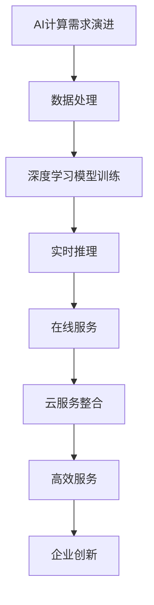

                 

关键词：AI计算需求、云服务整合、创业机遇、技术演进

摘要：随着人工智能技术的飞速发展，AI计算需求不断演进，为创业者提供了丰富的机遇。本文将从AI计算需求的演进、云服务整合的重要性以及创业实践等多个方面，深入探讨贾扬清的创业机遇。

## 1. 背景介绍

贾扬清是一位知名的人工智能领域专家，他在AI算法研究、计算机视觉等领域取得了显著成就。近年来，随着人工智能技术的不断成熟和应用场景的拓展，AI计算需求呈现出爆发式增长。与此同时，云计算技术的迅速发展，使得云服务成为了企业创新和发展的新引擎。在这样的背景下，如何把握AI计算需求演进的机遇，实现云服务与AI技术的深度融合，成为了一个值得探讨的问题。

## 2. 核心概念与联系

### 2.1 AI计算需求演进

AI计算需求演进是指随着人工智能技术的不断发展，计算需求从最初的简单数据处理，到复杂的深度学习模型训练，再到实时推理和在线服务的转变。这个过程体现了人工智能从理论研究到实际应用的逐步深化。

### 2.2 云服务整合

云服务整合是指将云计算技术与其他技术（如AI、大数据等）相结合，为企业提供更加丰富和高效的服务。云服务整合的核心在于如何实现技术之间的无缝对接，从而提升整体服务能力。

### 2.3 Mermaid 流程图

下面是一个描述AI计算需求演进与云服务整合关系的Mermaid流程图：



## 3. 核心算法原理 & 具体操作步骤

### 3.1 算法原理概述

AI计算需求演进的核心在于算法的创新与优化。云服务整合的关键在于如何高效地部署和管理这些算法。以下是一个典型的AI计算需求演进与云服务整合的算法原理概述：

- 数据预处理：对原始数据进行清洗、转换和归一化，为后续模型训练提供高质量的数据输入。
- 模型训练：使用深度学习框架（如TensorFlow、PyTorch等）训练模型，实现从数据到知识的转换。
- 模型评估：通过交叉验证等方法评估模型性能，确保模型达到预期的准确度。
- 模型部署：将训练好的模型部署到云端，实现实时推理和在线服务。

### 3.2 算法步骤详解

1. 数据预处理
2. 模型训练
3. 模型评估
4. 模型部署

### 3.3 算法优缺点

- 优点：提高计算效率，降低企业成本；实现实时推理和在线服务，提升用户体验。
- 缺点：对云计算基础设施和算法优化要求较高；模型部署和运维复杂。

### 3.4 算法应用领域

- 图像识别：用于人脸识别、物体检测等场景。
- 自然语言处理：用于语音识别、机器翻译等场景。
- 推荐系统：用于个性化推荐、广告投放等场景。

## 4. 数学模型和公式 & 详细讲解 & 举例说明

### 4.1 数学模型构建

以深度学习中的卷积神经网络（CNN）为例，其基本结构包括输入层、卷积层、池化层和全连接层。下面是CNN的数学模型构建：

$$
h_l = \sigma(\mathbf{W}_l \cdot \mathbf{a}_{l-1} + b_l)
$$

其中，$h_l$ 表示第$l$层的输出，$\sigma$ 表示激活函数（如ReLU函数），$\mathbf{W}_l$ 和 $b_l$ 分别表示第$l$层的权重和偏置。

### 4.2 公式推导过程

以卷积神经网络中的卷积操作为例，其公式推导过程如下：

$$
(\mathbf{X} \star \mathbf{K})_i = \sum_{j=1}^{M} X_j K_{i-j+1}
$$

其中，$\mathbf{X}$ 表示输入数据，$\mathbf{K}$ 表示卷积核，$M$ 表示卷积核的大小。

### 4.3 案例分析与讲解

以一个图像识别任务为例，说明如何构建和训练深度学习模型。具体步骤如下：

1. 数据预处理：对图像数据进行归一化处理，将像素值缩放到[0, 1]之间。
2. 模型构建：使用深度学习框架构建卷积神经网络，包括卷积层、池化层和全连接层。
3. 模型训练：使用训练数据对模型进行训练，优化模型参数。
4. 模型评估：使用验证数据评估模型性能，调整模型参数。
5. 模型部署：将训练好的模型部署到云端，实现实时推理和在线服务。

## 5. 项目实践：代码实例和详细解释说明

### 5.1 开发环境搭建

1. 安装Python环境
2. 安装深度学习框架（如TensorFlow、PyTorch等）
3. 准备训练数据和测试数据

### 5.2 源代码详细实现

以下是一个简单的卷积神经网络实现：

```python
import tensorflow as tf

# 定义卷积神经网络
model = tf.keras.Sequential([
    tf.keras.layers.Conv2D(32, (3, 3), activation='relu', input_shape=(28, 28, 1)),
    tf.keras.layers.MaxPooling2D((2, 2)),
    tf.keras.layers.Flatten(),
    tf.keras.layers.Dense(128, activation='relu'),
    tf.keras.layers.Dense(10, activation='softmax')
])

# 编译模型
model.compile(optimizer='adam',
              loss='sparse_categorical_crossentropy',
              metrics=['accuracy'])

# 训练模型
model.fit(train_images, train_labels, epochs=5)

# 评估模型
test_loss, test_acc = model.evaluate(test_images, test_labels)

# 预测
predictions = model.predict(test_images)
```

### 5.3 代码解读与分析

1. 导入相关库：包括TensorFlow等。
2. 定义模型：使用`tf.keras.Sequential`创建一个序列模型，包括卷积层、池化层、全连接层等。
3. 编译模型：指定优化器、损失函数和评价指标。
4. 训练模型：使用`fit`方法训练模型，指定训练数据和迭代次数。
5. 评估模型：使用`evaluate`方法评估模型性能。
6. 预测：使用`predict`方法对测试数据进行预测。

### 5.4 运行结果展示

1. 训练过程中会输出训练集和验证集的损失和准确率。
2. 评估过程中会输出测试集的损失和准确率。
3. 预测过程中会输出测试集的预测结果。

## 6. 实际应用场景

AI计算需求在图像识别、自然语言处理、推荐系统等领域有着广泛的应用。以下是一些典型的实际应用场景：

- 图像识别：用于人脸识别、物体检测等场景，如安防监控、自动驾驶等。
- 自然语言处理：用于语音识别、机器翻译等场景，如智能客服、语音助手等。
- 推荐系统：用于个性化推荐、广告投放等场景，如电商平台、社交媒体等。

## 7. 未来应用展望

随着人工智能技术的不断发展，AI计算需求将继续演进。未来，我们将看到更多跨领域的应用，如智能医疗、智能交通、智能金融等。同时，云服务与AI技术的深度融合，将为企业带来更多的创新机遇。

## 8. 工具和资源推荐

### 8.1 学习资源推荐

- 《深度学习》（Goodfellow, Bengio, Courville著）
- 《Python机器学习》（Sebastian Raschka著）
- 《计算机视觉基础与算法》（刘铁岩著）

### 8.2 开发工具推荐

- TensorFlow
- PyTorch
- Keras

### 8.3 相关论文推荐

- “Deep Learning” (Ian Goodfellow, Yoshua Bengio, Aaron Courville著)
- “Convolutional Neural Networks for Visual Recognition” (Geoffrey Hinton, et al.著)
- “Recurrent Neural Networks for Language Modeling” (Yoshua Bengio, et al.著)

## 9. 总结：未来发展趋势与挑战

随着AI计算需求的不断演进和云服务的发展，企业将面临更多的创新机遇。然而，这也将带来一系列挑战，如算法优化、数据安全、隐私保护等。未来，企业需要不断创新，抓住AI计算需求的机遇，迎接挑战。

### 附录：常见问题与解答

1. **什么是AI计算需求演进？**
   AI计算需求演进是指随着人工智能技术的不断发展，计算需求从简单数据处理到复杂深度学习模型训练，再到实时推理和在线服务的转变。

2. **什么是云服务整合？**
   云服务整合是指将云计算技术与其他技术（如AI、大数据等）相结合，为企业提供更加丰富和高效的服务。

3. **如何构建和训练深度学习模型？**
   可以使用深度学习框架（如TensorFlow、PyTorch等）构建和训练深度学习模型。具体步骤包括数据预处理、模型构建、模型训练、模型评估和模型部署等。

4. **AI计算需求演进与云服务整合有哪些应用领域？**
   AI计算需求演进与云服务整合在图像识别、自然语言处理、推荐系统等领域有着广泛的应用，如安防监控、自动驾驶、智能客服等。

### 作者署名

作者：禅与计算机程序设计艺术 / Zen and the Art of Computer Programming
----------------------------------------------------------------

以上就是本文的完整内容，包括文章标题、关键词、摘要、各个章节的详细内容以及附录等。希望本文能够为读者提供有价值的参考和启示。如有任何问题，欢迎随时提问。

