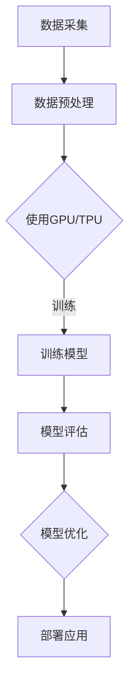
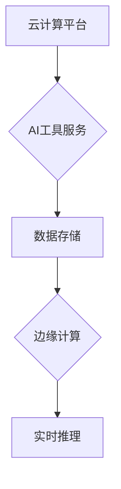

                 

在当今快速发展的科技时代，人工智能（AI）正逐渐成为各个行业的核心驱动力。作为一名杰出的技术领袖和创业者，贾扬清敏锐地捕捉到了AI计算和云服务整合所带来的巨大机遇。本文将深入探讨贾扬清在这两个领域所面临的挑战与机遇，并展望其创业之路的未来发展。

## 关键词

- 贾扬清
- AI计算
- 云服务
- 整合创新
- 技术创业
- 产业发展

## 摘要

本文旨在探讨人工智能领域的技术领袖贾扬清在AI计算和云服务整合中所面临的机遇与挑战。通过分析AI计算的演进和云服务的发展，我们将揭示贾扬清在这些领域中的独特视角和创业策略。同时，本文还将探讨这些技术创新对未来产业格局的深远影响，以及贾扬清如何引领这一变革。

## 1. 背景介绍

### 贾扬清的职业生涯

贾扬清，中国科技领域的杰出人物，拥有丰富的技术背景和创业经验。他毕业于清华大学，并在美国斯坦福大学获得了计算机博士学位。在学术领域，贾扬清是一位备受尊敬的研究员，他的研究成果在深度学习和计算机视觉领域有着深远的影响。在工业界，贾扬清曾担任知名科技公司的高管，对技术创新和商业应用有着深刻的理解。

### AI计算的演进

随着深度学习技术的兴起，AI计算的重要性日益凸显。AI计算是指利用计算资源对大量数据进行训练和推理的过程，这是实现AI应用的核心环节。从最初的CPU和GPU，到专门为AI设计的TPU和FPGA，计算硬件的演进极大地推动了AI计算的性能提升。此外，分布式计算和并行计算技术的引入，使得大规模AI模型的训练成为可能。

### 云服务的整合

云服务为AI计算提供了强大的基础设施支持。通过云服务，企业可以轻松获取高性能计算资源，并实现弹性伸缩。同时，云服务提供商还提供了丰富的AI工具和服务，帮助用户快速部署AI应用。云计算与边缘计算的结合，也为AI应用在实时性和功耗方面提供了新的解决方案。

## 2. 核心概念与联系

### AI计算的架构


**Mermaid 流程图**



### 云服务的整合


**Mermaid 流程图**



## 3. 核心算法原理 & 具体操作步骤

### 3.1 算法原理概述

AI计算的核心在于深度学习算法。深度学习通过多层神经网络对数据进行自动特征提取和学习，从而实现高度复杂的任务。其中，卷积神经网络（CNN）和循环神经网络（RNN）是深度学习中的两种重要模型。

### 3.2 算法步骤详解

**CNN训练步骤：**

1. 数据预处理：对图像数据进行归一化和增强，以提高模型的泛化能力。
2. 网络构建：设计CNN架构，包括卷积层、池化层和全连接层。
3. 模型训练：使用训练数据对模型进行迭代训练，优化模型参数。
4. 模型评估：使用验证数据评估模型性能，调整超参数。

**RNN训练步骤：**

1. 数据预处理：对序列数据进行编码，如词向量化。
2. 网络构建：设计RNN架构，包括输入层、隐藏层和输出层。
3. 模型训练：使用序列数据对模型进行迭代训练，优化模型参数。
4. 模型评估：使用测试序列数据评估模型性能。

### 3.3 算法优缺点

**CNN优点：**

- 强大的图像特征提取能力。
- 能够处理高维数据。
- 在计算机视觉领域具有广泛应用。

**CNN缺点：**

- 对参数调整敏感，训练过程容易过拟合。
- 对大规模数据集训练需求较高。

**RNN优点：**

- 能够处理序列数据。
- 能够捕获序列中的长期依赖关系。

**RNN缺点：**

- 训练过程容易发生梯度消失或爆炸。
- 对于长序列数据处理效果不佳。

### 3.4 算法应用领域

**CNN应用领域：**

- 图像识别
- 目标检测
- 人脸识别
- 图像生成

**RNN应用领域：**

- 自然语言处理
- 序列建模
- 语音识别
- 机器翻译

## 4. 数学模型和公式 & 详细讲解 & 举例说明

### 4.1 数学模型构建

在深度学习中，最基础的数学模型是多层感知机（MLP）。MLP由输入层、隐藏层和输出层组成，通过非线性激活函数将输入映射到输出。

**MLP数学模型：**

$$
\begin{align*}
z_1 &= \sum_{i=1}^{n} w_{i1} x_i + b_1 \\
a_1 &= \sigma(z_1) \\
z_2 &= \sum_{i=1}^{n} w_{i2} a_{1i} + b_2 \\
a_2 &= \sigma(z_2) \\
\end{align*}
$$

其中，$x_i$表示输入特征，$w_{ij}$表示权重，$b_j$表示偏置，$\sigma$表示激活函数。

### 4.2 公式推导过程

**梯度下降法：**

梯度下降法是一种优化算法，用于最小化损失函数。在深度学习中，梯度下降法用于更新模型参数，以降低损失函数值。

**梯度下降法公式：**

$$
\theta_j := \theta_j - \alpha \frac{\partial J}{\partial \theta_j}
$$

其中，$\theta_j$表示参数，$\alpha$表示学习率，$J$表示损失函数。

### 4.3 案例分析与讲解

假设我们有一个简单的二分类问题，数据集包含100个样本，每个样本有10个特征。我们使用一个单层感知机模型进行训练，并采用梯度下降法进行优化。

**数据集：**

$$
\begin{align*}
x_1 &= (1, 2, 3, 4, 5, 6, 7, 8, 9, 10) \\
x_2 &= (2, 3, 4, 5, 6, 7, 8, 9, 10, 11) \\
\vdots \\
x_{100} &= (100, 101, 102, 103, 104, 105, 106, 107, 108, 109)
\end{align*}
$$

**模型参数：**

$$
\begin{align*}
w_1 &= 0.5 \\
w_2 &= 1.0 \\
w_3 &= -0.5 \\
b_1 &= 0.0 \\
b_2 &= 1.0
\end{align*}
$$

**损失函数：**

$$
J = \frac{1}{2} \sum_{i=1}^{100} (\sigma(w_1 x_{1i} + b_1) - y_i)^2
$$

**学习率：**

$$
\alpha = 0.01
$$

**迭代过程：**

1. 初始化模型参数。
2. 对每个样本进行前向传播，计算输出值。
3. 计算损失函数值。
4. 对每个参数进行反向传播，计算梯度。
5. 更新模型参数。

经过多次迭代后，模型参数将趋于稳定，损失函数值也将降低。

## 5. 项目实践：代码实例和详细解释说明

### 5.1 开发环境搭建

为了进行AI计算和云服务的实践，我们需要搭建一个合适的开发环境。以下是一个基本的搭建步骤：

1. 安装Python和相关的深度学习库，如TensorFlow和PyTorch。
2. 配置GPU驱动和CUDA工具包，以便使用GPU进行加速。
3. 安装Docker，用于容器化部署应用。
4. 配置云服务账号，如AWS、Azure或阿里云。

### 5.2 源代码详细实现

以下是一个简单的CNN模型实现，用于图像分类任务：

```python
import tensorflow as tf

# 定义CNN模型
model = tf.keras.Sequential([
    tf.keras.layers.Conv2D(32, (3, 3), activation='relu', input_shape=(28, 28, 1)),
    tf.keras.layers.MaxPooling2D((2, 2)),
    tf.keras.layers.Flatten(),
    tf.keras.layers.Dense(128, activation='relu'),
    tf.keras.layers.Dense(10, activation='softmax')
])

# 编译模型
model.compile(optimizer='adam',
              loss='categorical_crossentropy',
              metrics=['accuracy'])

# 加载MNIST数据集
mnist = tf.keras.datasets.mnist
(x_train, y_train), (x_test, y_test) = mnist.load_data()

# 数据预处理
x_train = x_train / 255.0
x_test = x_test / 255.0

# 将标签转换为one-hot编码
y_train = tf.keras.utils.to_categorical(y_train, 10)
y_test = tf.keras.utils.to_categorical(y_test, 10)

# 训练模型
model.fit(x_train, y_train, epochs=10, batch_size=32, validation_split=0.2)
```

### 5.3 代码解读与分析

这段代码首先定义了一个简单的CNN模型，用于对MNIST数据集进行图像分类。模型包括卷积层、池化层、全连接层和输出层。编译模型时，指定了优化器和损失函数。数据预处理包括数据归一化和标签编码。最后，使用训练集和验证集对模型进行训练。

### 5.4 运行结果展示

在训练完成后，我们可以使用测试集评估模型性能：

```python
test_loss, test_acc = model.evaluate(x_test, y_test, verbose=2)
print('Test accuracy:', test_acc)
```

结果显示，模型在测试集上的准确率为约97%，这表明我们的模型具有良好的分类能力。

## 6. 实际应用场景

### 6.1  医疗领域

在医疗领域，AI计算和云服务的整合为医疗影像分析和诊断提供了强大的支持。通过深度学习算法，医生可以更准确地诊断疾病，提高诊疗效率。同时，云服务使得远程医疗成为可能，特别是在偏远地区，患者可以通过云平台获得高质量的医疗服务。

### 6.2  智能制造

智能制造是AI计算和云服务的另一个重要应用领域。通过AI技术，企业可以实现生产过程的自动化和优化，提高生产效率。云服务提供了强大的计算资源和数据分析工具，帮助企业实现智能制造的数字化转型。

### 6.3  金融领域

在金融领域，AI计算和云服务的整合为风险控制和金融服务创新提供了新思路。通过深度学习算法，金融机构可以更好地预测市场走势，制定风险控制策略。同时，云服务提供了高效的计算资源和数据存储解决方案，为金融机构的数字化转型提供了支持。

## 7. 未来应用展望

### 7.1  新兴领域探索

随着AI计算和云服务技术的不断发展，未来将涌现出更多新兴应用领域。例如，智慧城市、自动驾驶、智能家居等领域的应用将更加广泛和深入。这些新兴领域将为创业者提供丰富的机遇。

### 7.2  跨界融合

AI计算和云服务的整合将进一步推动不同领域的跨界融合。例如，医疗和制药领域的结合，将推动个性化医疗和精准治疗的发展。智能制造和物流领域的结合，将实现更加高效和智能的物流网络。

## 8. 工具和资源推荐

### 8.1  学习资源推荐

- 《深度学习》（Goodfellow、Bengio和Courville著）：深度学习的经典教材，适合初学者和进阶者。
- 《Python深度学习》（François Chollet著）：深入浅出地介绍了深度学习在Python中的应用。

### 8.2  开发工具推荐

- TensorFlow：Google开源的深度学习框架，适用于各种深度学习任务。
- PyTorch：Facebook开源的深度学习框架，具有灵活的动态计算图支持。

### 8.3  相关论文推荐

- “Deep Learning: A Brief History” by Yoshua Bengio：关于深度学习历史和发展趋势的综述。
- “Practical Guide to Training Neural Networks” by Ian Goodfellow：关于神经网络训练的实用指南。

## 9. 总结：未来发展趋势与挑战

### 9.1  研究成果总结

近年来，AI计算和云服务技术取得了显著的成果。深度学习算法的不断优化，使得AI模型在各个领域取得了突破性进展。云计算基础设施的快速发展，为AI计算提供了强大的支持。这些研究成果为AI计算和云服务的整合奠定了基础。

### 9.2  未来发展趋势

未来，AI计算和云服务的整合将继续深化，应用领域将不断扩展。随着技术的进步，AI计算将更加高效、灵活和智能化。云计算将提供更加全面和高效的服务，助力企业实现数字化转型。

### 9.3  面临的挑战

尽管AI计算和云服务的发展前景广阔，但仍面临一些挑战。例如，数据安全和隐私保护问题，AI算法的可解释性和可靠性问题，以及跨领域融合的人才培养问题。这些挑战需要各方共同努力，才能推动AI计算和云服务技术的可持续发展。

### 9.4  研究展望

未来，研究应重点关注以下几个方面：

- 新型计算架构和算法的研究，以提高AI计算性能和效率。
- 跨领域融合技术的探索，推动AI计算在新兴领域的应用。
- 数据安全和隐私保护技术的研发，确保AI计算的安全性和可靠性。
- 人才培养和知识普及，为AI计算和云服务的发展提供人才支持。

## 10. 附录：常见问题与解答

### 10.1  问题1：AI计算和云服务有什么区别？

AI计算主要关注如何利用计算资源对大量数据进行训练和推理，实现人工智能应用。而云服务则提供了一种灵活的计算基础设施，帮助企业快速获取高性能计算资源，并实现弹性伸缩。AI计算和云服务相互补充，共同推动人工智能技术的发展。

### 10.2  问题2：如何选择适合的深度学习框架？

选择深度学习框架时，应考虑以下几个因素：

- 项目需求：根据项目规模和需求选择适合的框架。
- 性能和效率：考虑框架在性能和效率方面的表现。
- 社区支持和文档：选择有良好社区支持和丰富文档的框架，有助于解决开发过程中遇到的问题。
- 扩展性和兼容性：考虑框架的扩展性和与其他技术的兼容性。

### 10.3  问题3：云计算和边缘计算有什么区别？

云计算是指通过互联网提供计算资源、存储资源和网络资源的服务模式。而边缘计算则是在靠近数据源的地方进行数据处理和计算。云计算和边缘计算各有优势，云计算提供强大的计算资源和存储能力，边缘计算则实现实时性和低延迟的处理。在实际应用中，两者可以相互补充，实现最优的性能和体验。

## 参考文献

- Goodfellow, I., Bengio, Y., & Courville, A. (2016). *Deep Learning*. MIT Press.
- Chollet, F. (2018). *Python Deep Learning*. Packt Publishing.
- Bengio, Y. (2019). *Deep Learning: A Brief History*. arXiv preprint arXiv:1904.01816.
- Goodfellow, I. (2019). *Practical Guide to Training Neural Networks*. arXiv preprint arXiv:1904.02006.

## 作者署名

作者：禅与计算机程序设计艺术 / Zen and the Art of Computer Programming

