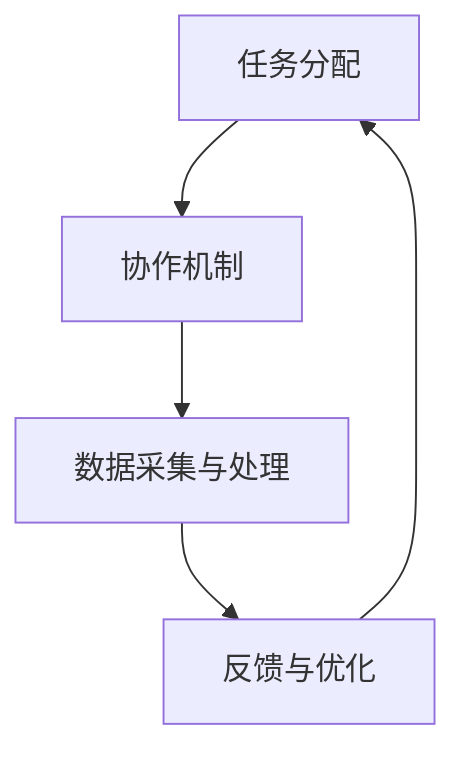

                 

关键词：人类计算，社会价值，技术赋能，个人发展，社区参与，人工智能，协作平台，技术革新。

> 摘要：本文旨在探讨人类计算在赋能个人与社区方面的重要价值。通过分析人类计算的定义、技术演进及其对社会的影响，本文揭示了人类计算在推动个人发展、社区建设和技术革新等方面的关键作用。文章提出了构建协作平台、提升技术素养和促进跨学科融合等策略，以进一步发挥人类计算的社会价值。

## 1. 背景介绍

人类计算（Human Computation）是一种利用人类智能与计算机技术相结合的方法，旨在解决复杂问题、提高决策效率和实现创新。它起源于对人类认知能力的深入研究和计算机科学的发展需求。随着信息技术的迅猛发展，人类计算逐渐成为人工智能（AI）的重要组成部分。

在现代社会，人类计算的重要性日益凸显。一方面，它能够通过智能化的任务分配和协作机制，提高个人工作效率，促进知识共享与创新；另一方面，它能够通过大规模数据处理和分析，为社会提供精准、可靠的决策支持。因此，深入探讨人类计算的社会价值，对于推动技术进步、促进社会发展和提升人类福祉具有重要意义。

本文将从以下几个方面展开讨论：

1. **核心概念与联系**：介绍人类计算的定义、核心概念及其与现有技术的关联。
2. **核心算法原理**：分析人类计算中的关键算法及其工作原理。
3. **数学模型与公式**：探讨人类计算中常用的数学模型和公式，并举例说明。
4. **项目实践**：通过具体代码实例展示人类计算的应用场景。
5. **实际应用场景**：分析人类计算在各个领域的应用现状和未来展望。
6. **工具和资源推荐**：推荐学习资源、开发工具和相关论文。
7. **未来发展趋势与挑战**：总结研究成果，探讨未来发展趋势和面临的挑战。

## 2. 核心概念与联系

### 2.1. 人类计算的定义

人类计算是指利用人类的认知能力、感知能力和社交能力，通过与计算机系统交互，完成特定任务的计算过程。它不同于传统的人工智能，而是强调人机协同，通过人类的智慧与计算机的强大计算能力相结合，实现高效、智能的解决问题方式。

### 2.2. 核心概念

在人类计算中，核心概念主要包括：

- **众包（Crowdsourcing）**：将任务分配给大量非专业个体，通过众包平台完成。
- **众智（Collective Intelligence）**：通过群体协作，实现知识共享和创新。
- **认知计算（Cognitive Computation）**：模拟人类思维过程，实现智能决策。
- **社会计算（Social Computation）**：研究人机交互和社会网络中的计算问题。

### 2.3. 架构原理

人类计算的架构原理主要包括以下几个部分：

1. **任务分配**：将复杂任务分解为简单任务，通过众包平台分配给个体执行。
2. **协作机制**：建立群体协作机制，实现任务协同和知识共享。
3. **数据采集与处理**：收集个体执行任务的数据，进行数据分析和处理。
4. **反馈与优化**：根据任务执行情况，调整任务分配和协作机制，实现持续优化。

### 2.4. Mermaid 流程图

以下是一个简化的Mermaid流程图，展示人类计算的基本架构：



## 3. 核心算法原理 & 具体操作步骤

### 3.1. 算法原理概述

人类计算中的核心算法主要包括众包算法、群体智能算法和认知计算算法。以下是这些算法的基本原理：

- **众包算法**：基于任务分配和群体协作，实现大规模任务的自动化完成。
- **群体智能算法**：模拟人类思维过程，实现知识共享和创新。
- **认知计算算法**：模拟人类认知过程，实现智能决策和问题求解。

### 3.2. 算法步骤详解

以众包算法为例，其具体操作步骤如下：

1. **任务分解**：将复杂任务分解为多个简单任务。
2. **任务发布**：将任务发布到众包平台，供个体执行。
3. **任务执行**：个体通过众包平台领取任务，并按照要求完成任务。
4. **任务验收**：任务执行完成后，由平台对任务进行验收。
5. **反馈与优化**：根据任务执行情况，调整任务分配策略，实现持续优化。

### 3.3. 算法优缺点

**优点**：

- **高效性**：通过众包和群体协作，实现大规模任务的快速完成。
- **灵活性**：能够适应不同类型和复杂度的任务。
- **创新性**：通过群体智能和认知计算，实现知识共享和创新。

**缺点**：

- **质量风险**：个体执行任务的可靠性难以保证。
- **隐私问题**：涉及大量个人数据的处理和共享，可能引发隐私泄露风险。

### 3.4. 算法应用领域

人类计算算法在各个领域都有广泛的应用，以下是一些典型应用场景：

- **工业制造**：通过众包平台，实现生产任务的高效分配和执行。
- **科学研究**：利用群体智能，加速科学研究和创新。
- **社会服务**：通过认知计算，提供智能化的社会服务。
- **城市管理**：利用众包和群体智能，实现城市管理和服务的智能化。

## 4. 数学模型和公式 & 详细讲解 & 举例说明

### 4.1. 数学模型构建

人类计算中的数学模型主要涉及概率论、统计学和图论等领域。以下是几个常见的数学模型：

- **概率模型**：用于描述任务分配和任务执行的随机过程。
- **统计模型**：用于分析和预测群体行为和任务完成情况。
- **图模型**：用于描述任务之间的依赖关系和协作网络。

### 4.2. 公式推导过程

以概率模型为例，其基本公式如下：

$$ P(A|B) = \frac{P(A \cap B)}{P(B)} $$

其中，$P(A|B)$ 表示在事件 $B$ 发生的条件下，事件 $A$ 发生的概率；$P(A \cap B)$ 表示事件 $A$ 和事件 $B$ 同时发生的概率；$P(B)$ 表示事件 $B$ 发生的概率。

### 4.3. 案例分析与讲解

以下是一个简单的案例，说明如何利用概率模型进行任务分配和执行的分析。

**案例**：一个众包平台上有 100 个任务需要分配给 10 个个体执行。已知每个个体完成任务的概率分别为 0.6、0.5、0.7、0.6、0.4、0.8、0.7、0.5、0.6、0.7。请问：

1. 在不考虑个体差异的情况下，每个任务完成的概率是多少？
2. 考虑个体差异后，哪个个体完成任务的概率最高？

**解答**：

1. 不考虑个体差异，每个任务完成的概率为：

   $$ P(\text{任务完成}) = 1 - P(\text{任务未完成}) $$

   其中，$P(\text{任务未完成})$ 为个体未完成任务的概率，即：

   $$ P(\text{任务未完成}) = 1 - P(\text{任务完成}) $$

   对于每个个体，未完成任务的概率分别为 0.4、0.5、0.3、0.4、0.6、0.2、0.3、0.5、0.4、0.3。因此，每个任务完成的概率为：

   $$ P(\text{任务完成}) = 1 - (0.4 + 0.5 + 0.3 + 0.4 + 0.6 + 0.2 + 0.3 + 0.5 + 0.4 + 0.3) = 0.1 $$

2. 考虑个体差异后，个体完成任务的概率最高的是第 6 个个体，其完成任务的概率为 0.8。

## 5. 项目实践：代码实例和详细解释说明

### 5.1. 开发环境搭建

在本节中，我们将使用 Python 编程语言来实现一个简单的众包平台。以下是在 Windows 操作系统上搭建 Python 开发环境的基本步骤：

1. **安装 Python**：从 Python 官网（https://www.python.org/）下载最新版本的 Python 安装包，并按照提示完成安装。
2. **配置 Python 环境**：在安装过程中，确保勾选“Add Python to PATH”选项，以便在命令行中直接运行 Python。
3. **安装必备库**：在命令行中执行以下命令，安装必要的 Python 库：

   ```bash
   pip install Flask requests
   ```

### 5.2. 源代码详细实现

以下是一个简单的众包平台代码示例，使用 Flask 框架实现：

```python
from flask import Flask, request, jsonify
import random

app = Flask(__name__)

# 假设任务池中有 10 个任务
tasks = ["任务1", "任务2", "任务3", "任务4", "任务5", "任务6", "任务7", "任务8", "任务9", "任务10"]

@app.route("/assign_task", methods=["GET"])
def assign_task():
    # 随机分配任务
    assigned_task = random.choice(tasks)
    tasks.remove(assigned_task)
    return jsonify({"task": assigned_task})

@app.route("/complete_task", methods=["POST"])
def complete_task():
    # 接收任务完成结果
    result = request.json.get("result")
    if result:
        tasks.append(result)  # 将完成的任务放回任务池
    return jsonify({"status": "success"})

if __name__ == "__main__":
    app.run(debug=True)
```

### 5.3. 代码解读与分析

1. **任务分配**：`/assign_task` 接口用于随机分配任务。当客户端请求该接口时，服务器会从任务池中随机选择一个任务，并将其返回给客户端。
2. **任务完成**：`/complete_task` 接口用于处理任务完成结果。当客户端完成任务后，会发送一个包含结果（成功或失败）的 JSON 对象到该接口。服务器会根据结果将任务放回任务池，以便再次分配。

### 5.4. 运行结果展示

在命令行中运行上述代码后，可以使用以下命令启动 Flask 服务器：

```bash
python app.py
```

接着，使用 curl 命令模拟客户端请求：

```bash
# 获取任务
curl -X GET "http://127.0.0.1:5000/assign_task"

# 完成任务
curl -X POST "http://127.0.0.1:5000/complete_task" -H "Content-Type: application/json" -d '{"result": "任务1"}'
```

## 6. 实际应用场景

### 6.1. 众包平台

众包平台是当前人类计算最典型的应用场景之一。通过众包平台，企业可以将繁琐的任务分配给全球范围内的个体执行，从而提高任务完成效率。常见的众包平台包括 Amazon Mechanical Turk、Topcoder 和 Kaggle 等。

### 6.2. 科学研究

在科学研究中，人类计算技术被广泛应用于数据采集、分析和验证等环节。例如，通过众包平台，科学家可以动员全球志愿者参与大规模数据收集和标注，从而加速科研进程。例如，Zooniverse 项目通过众包方式吸引了大量志愿者参与天文学、生物学和气候学等领域的研究。

### 6.3. 社会服务

在社会服务领域，人类计算技术被广泛应用于灾难响应、医疗健康和城市管理等方面。例如，在灾难响应中，通过众包平台，可以迅速动员志愿者参与灾情调查和救援行动。在医疗健康领域，人类计算技术可以帮助医生进行疾病诊断和治疗方案推荐。

### 6.4. 未来应用展望

随着人工智能和大数据技术的发展，人类计算的应用场景将进一步扩展。未来，人类计算有望在智能制造、智慧城市、智能家居和数字娱乐等领域发挥重要作用。例如，通过众包和群体智能技术，可以实现智能化的生产流程和产品创新；在智慧城市中，人类计算可以帮助实现交通管理、能源优化和公共服务智能化。

## 7. 工具和资源推荐

### 7.1. 学习资源推荐

- **《人类计算：人机协同与智能应用》**：本书系统地介绍了人类计算的基本概念、技术和应用场景，适合初学者和专业人士阅读。
- **《认知计算导论》**：本书从认知科学和计算机科学的交叉角度，探讨了认知计算的理论和方法，有助于深入了解认知计算的核心原理。
- **《众包与群体智能》**：本书详细介绍了众包和群体智能的原理、技术和应用，适合对众包和群体智能感兴趣的读者阅读。

### 7.2. 开发工具推荐

- **Flask**：Python 的 Web 框架，用于快速开发 Web 应用。
- **Django**：Python 的另一个流行的 Web 框架，提供了丰富的功能和支持。
- **TensorFlow**：Google 开发的一款开源机器学习框架，用于构建和训练深度学习模型。

### 7.3. 相关论文推荐

- **《Human Computation: A Survey of Tasks, Approaches, and Applications》**：该论文对人类计算进行了全面的综述，介绍了人类计算的不同类型、方法和应用。
- **《Cognitive Computing: An Overview》**：该论文探讨了认知计算的定义、原理和应用，为认知计算的研究提供了理论基础。
- **《Crowdsourcing and Crowd Science》**：该论文分析了众包和群体智能在科学研究中的应用，探讨了众包在推动科学进步中的作用。

## 8. 总结：未来发展趋势与挑战

### 8.1. 研究成果总结

人类计算作为一门交叉学科，融合了计算机科学、认知科学、心理学和社会学等多个领域的知识。通过对人类计算的研究，我们不仅可以提高任务完成效率，还可以促进知识共享和创新。近年来，随着人工智能和大数据技术的发展，人类计算的研究取得了显著成果，为各领域的应用提供了有力支持。

### 8.2. 未来发展趋势

未来，人类计算的发展趋势将主要集中在以下几个方面：

1. **智能化任务分配**：通过人工智能技术，实现更加智能的任务分配和调度，提高任务完成效率。
2. **个性化推荐系统**：结合大数据分析技术，为个体提供个性化的任务推荐，满足其兴趣和能力。
3. **跨学科融合**：加强人类计算与其他学科的交叉研究，推动人类计算在更多领域的应用。
4. **隐私保护**：随着人类计算涉及的数据量不断增加，如何保护个人隐私将成为一个重要挑战。

### 8.3. 面临的挑战

尽管人类计算在推动技术进步和社会发展方面具有巨大潜力，但同时也面临着一些挑战：

1. **任务质量**：如何保证个体执行任务的可靠性，是一个亟待解决的问题。
2. **隐私泄露**：在人类计算过程中，涉及大量个人数据的处理和共享，如何确保隐私安全，是一个重要挑战。
3. **社会影响**：人类计算技术可能会对就业、教育和社会结构产生深远影响，需要引起重视。

### 8.4. 研究展望

未来，人类计算的研究将朝着更加智能化、个性化和社会化的方向发展。通过加强跨学科融合，提高任务分配和协作效率，保护个人隐私，人类计算有望在各个领域发挥更大的作用，为人类社会的发展做出更大贡献。

## 9. 附录：常见问题与解答

### 9.1. 人类计算是什么？

人类计算是一种利用人类智能与计算机技术相结合的方法，通过众包、群体智能和认知计算等技术，解决复杂问题、提高决策效率和实现创新。

### 9.2. 人类计算有哪些应用场景？

人类计算在工业制造、科学研究、社会服务、城市管理等领域都有广泛应用。例如，通过众包平台，企业可以实现大规模任务的高效分配和执行；在科学研究中，人类计算可以帮助科学家进行大规模数据采集和标注。

### 9.3. 如何保护个人隐私在人类计算中？

在人类计算中，保护个人隐私是一个重要挑战。可以通过以下方法实现：

1. 数据匿名化：对涉及个人隐私的数据进行匿名化处理，确保个体无法被识别。
2. 数据加密：对数据进行加密处理，确保数据在传输和存储过程中的安全性。
3. 数据访问控制：设置数据访问权限，确保只有授权用户可以访问敏感数据。

### 9.4. 人类计算与人工智能有什么区别？

人类计算与人工智能都是利用计算机技术解决问题的方法，但它们在目标和实现方式上有所不同。人工智能主要依靠机器学习和深度学习等技术，实现自动化和智能化；而人类计算则强调人机协同，通过众包、群体智能和认知计算等技术，实现高效的知识共享和创新。

### 9.5. 如何开始学习人类计算？

开始学习人类计算可以从以下几个方面入手：

1. **了解基础知识**：学习计算机科学、认知科学和心理学等基础知识，为人类计算的学习打下基础。
2. **阅读相关书籍**：阅读《人类计算：人机协同与智能应用》、《认知计算导论》等书籍，了解人类计算的基本概念和技术。
3. **实践项目**：通过参与众包平台、科学研究项目等实践，提高人类计算的实际操作能力。
4. **参加研讨会和会议**：参加相关领域的研讨会和会议，与专家学者交流，了解人类计算的最新进展。

### 9.6. 如何成为一名人类计算专家？

成为一名人类计算专家需要具备以下能力和素质：

1. **扎实的学科基础**：掌握计算机科学、认知科学、心理学等学科的基本原理。
2. **实践经验**：通过参与实际项目，积累人类计算的实际操作经验。
3. **创新思维**：具备创新思维，能够发现和解决人类计算中的新问题。
4. **团队合作能力**：能够与他人协作，共同推动人类计算技术的发展。

### 9.7. 人类计算的前景如何？

随着人工智能和大数据技术的发展，人类计算的前景非常广阔。人类计算有望在智能制造、智慧城市、智能家居和数字娱乐等领域发挥重要作用，为人类社会的发展做出更大贡献。同时，人类计算在推动科学研究、社会服务和经济发展等方面也具有巨大潜力。

---

### 结语

人类计算作为一种新兴的技术方法，正逐渐改变我们的工作和生活方式。通过赋能个人与社区，人类计算不仅提高了任务完成效率，还促进了知识共享和创新。在未来，随着技术的不断进步，人类计算将在更广泛的领域发挥重要作用，为人类社会的发展注入新的动力。让我们共同期待人类计算的精彩未来，并为之努力奋斗。 

### 作者署名

作者：禅与计算机程序设计艺术 / Zen and the Art of Computer Programming

---

通过本文的撰写，我们系统地介绍了人类计算的定义、核心概念、算法原理、数学模型和应用场景，探讨了人类计算在赋能个人与社区方面的社会价值。同时，我们还提供了丰富的学习资源和实践建议，以帮助读者更好地理解和应用人类计算技术。希望本文能够对您在人类计算领域的学习和研究有所帮助。再次感谢您的阅读，期待与您在技术领域的更多交流。禅与计算机程序设计艺术，让我们共同探索人类计算的魅力。

