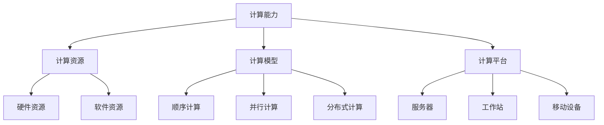

                 

 在这个数字化的时代，人类计算正逐渐成为推动社会进步的重要力量。从个人层面到社区层面，人类计算不仅改变了我们的生活方式，也重塑了我们的社会结构。本文将探讨人类计算在个人与社区层面所带来的深远影响，分析其社会价值，并提出未来发展的方向和面临的挑战。

## 1. 背景介绍

人类计算的历史可以追溯到计算机科学和人工智能的起源。从早期的机械计算机到现代的超级计算机，人类在计算领域的创新不断推动着科技进步。随着互联网和大数据的兴起，人类计算的应用范围进一步扩大，从科学计算到商业应用，从医疗健康到娱乐休闲，无所不在。

### 1.1 计算机科学的历史

计算机科学的历史可以追溯到19世纪末20世纪初，当时科学家们开始探索如何通过机械和电子方式来实现复杂的计算。1940年代，第一台电子计算机ENIAC的诞生标志着计算机时代的到来。随后，计算机技术经历了快速的发展，从大型主机到微型计算机，再到个人电脑和移动设备，计算机的普及改变了人类的生活方式。

### 1.2 人工智能的发展

人工智能（AI）是计算机科学的一个重要分支，其目标是使计算机具有智能。从早期的规则系统到现代的深度学习，人工智能技术不断突破。2012年，深度学习在图像识别任务中取得了突破性进展，使得计算机视觉达到了人类水平。近年来，人工智能在自然语言处理、语音识别、自动驾驶等领域取得了显著成就，为人类计算的发展注入了新的动力。

### 1.3 数字化时代的到来

互联网的普及和大数据技术的发展使得数字化时代成为可能。在这个时代，人类计算不仅局限于个人电脑和移动设备，还扩展到了云计算、物联网、区块链等新兴领域。数字化时代的到来，使得人类计算的能力得到了空前的提升，同时也带来了新的社会问题，如数据隐私和安全、数字鸿沟等。

## 2. 核心概念与联系

要深入探讨人类计算的社会价值，我们需要了解几个核心概念：计算能力、计算资源、计算模型、计算平台。

### 2.1 计算能力

计算能力是计算机执行任务的能力，通常用处理速度、存储容量、带宽等指标来衡量。计算能力的提升使得计算机能够处理更复杂的任务，如大规模数据处理、复杂算法计算等。

### 2.2 计算资源

计算资源包括硬件资源和软件资源。硬件资源包括计算机处理器、内存、存储设备等，软件资源包括操作系统、数据库、应用程序等。计算资源的优化和利用是提高计算效率的关键。

### 2.3 计算模型

计算模型是计算机处理数据的方式，包括顺序计算、并行计算、分布式计算等。不同的计算模型适用于不同的应用场景，选择合适的计算模型可以显著提高计算效率和性能。

### 2.4 计算平台

计算平台是计算机硬件和软件的组合，包括服务器、工作站、移动设备等。计算平台的多样性和可扩展性为人类计算提供了丰富的选择，使得计算机应用更加广泛。

下面是一个Mermaid流程图，展示了这些核心概念之间的关系：



## 3. 核心算法原理 & 具体操作步骤

### 3.1 算法原理概述

在人类计算中，核心算法起着至关重要的作用。这些算法包括但不限于：排序算法、搜索算法、加密算法、机器学习算法等。每种算法都有其独特的原理和应用场景。

排序算法如快速排序、归并排序等，主要用于对数据进行排序，提高数据检索效率。搜索算法如二分搜索、深度优先搜索等，用于在数据结构中查找特定元素。加密算法如RSA、AES等，用于保护数据的安全。机器学习算法如决策树、支持向量机等，用于从数据中学习规律，进行预测和分类。

### 3.2 算法步骤详解

以下以快速排序算法为例，详细介绍其原理和操作步骤：

1. **选择基准元素**：在数组中选择一个元素作为基准元素。

2. **划分**：将数组分为两部分，一部分小于基准元素，另一部分大于基准元素。

3. **递归排序**：对小于基准元素的部分和大于基准元素的部分进行递归排序。

4. **合并**：将排序好的两部分合并，得到最终排序结果。

### 3.3 算法优缺点

快速排序算法的优点是时间复杂度较低，平均情况下为\(O(n\log n)\)，且空间复杂度较低。缺点是对于某些特殊数据，如有序或部分有序的数据，快速排序的性能可能较差。

### 3.4 算法应用领域

快速排序算法广泛应用于各种领域，如数据库排序、搜索引擎、数据挖掘等。它是一种高效、通用的排序算法，适合处理大规模数据。

## 4. 数学模型和公式 & 详细讲解 & 举例说明

### 4.1 数学模型构建

在人类计算中，数学模型起着至关重要的作用。一个典型的数学模型可能包括以下几个部分：

- **变量定义**：定义模型中使用的变量。
- **目标函数**：定义模型的优化目标。
- **约束条件**：定义模型的约束条件。

以下是一个简单的线性规划模型：

$$
\begin{aligned}
\min_{x} \quad & c^T x \\
\text{s.t.} \quad & Ax \leq b \\
& x \geq 0
\end{aligned}
$$

其中，\(x\) 是变量向量，\(c\) 是目标函数系数向量，\(A\) 是约束条件系数矩阵，\(b\) 是约束条件右端向量。

### 4.2 公式推导过程

线性规划模型的求解可以通过单纯形法、内点法等多种算法实现。以下简要介绍单纯形法的推导过程：

1. **初始基本可行解**：选择一组基本变量，使得所有约束条件都满足。
2. **迭代过程**：通过引入新变量和调整基本变量，逐步逼近最优解。
3. **判断最优性**：通过计算目标函数的斜率，判断当前解是否为最优解。

### 4.3 案例分析与讲解

以下通过一个实际案例，展示如何应用线性规划模型解决生产计划问题：

**问题**：某公司生产两种产品A和B，每种产品都有生产成本和生产时间。公司希望确定每天的生产计划，使得总生产成本最低。

- **变量定义**：
  - \(x_1\)：每天生产产品A的数量
  - \(x_2\)：每天生产产品B的数量

- **目标函数**：
  - \(c^T x = 5x_1 + 4x_2\)：总生产成本

- **约束条件**：
  - \(Ax \leq b\)：
    - \(2x_1 + 3x_2 \leq 20\)：总生产时间
    - \(x_1 + x_2 \leq 10\)：原材料限制

  - \(x \geq 0\)：非负约束

**解法**：使用单纯形法求解该线性规划问题。

**结果**：最优解为\(x_1 = 5\)，\(x_2 = 5\)，总生产成本为\(c^T x = 45\)。

## 5. 项目实践：代码实例和详细解释说明

### 5.1 开发环境搭建

在进行代码实践之前，我们需要搭建一个适合开发的编程环境。以下是常用的步骤：

1. **安装Python**：Python是一种广泛使用的编程语言，适用于各种计算任务。可以从[Python官网](https://www.python.org/)下载并安装Python。
2. **安装Jupyter Notebook**：Jupyter Notebook是一种交互式编程环境，便于编写和运行代码。可以通过pip安装：
   ```bash
   pip install notebook
   ```
3. **安装相关库**：根据项目需求，安装必要的Python库。例如，对于线性规划，可以使用`scipy`库：
   ```bash
   pip install scipy
   ```

### 5.2 源代码详细实现

以下是一个简单的线性规划示例代码，用于求解生产计划问题。

```python
import numpy as np
from scipy.optimize import linprog

# 变量定义
c = np.array([5, 4])  # 目标函数系数
A = np.array([[2, 3], [1, 1]])  # 约束条件系数矩阵
b = np.array([20, 10])  # 约束条件右端向量

# 求解线性规划问题
result = linprog(c, A_ub=A, b_ub=b, bounds=(0, None), method='highs')

# 输出结果
if result.success:
    print("最优解：x1 = {:.2f}, x2 = {:.2f}".format(result.x[0], result.x[1]))
    print("总生产成本：${:.2f}".format(result.fun))
else:
    print("无最优解")
```

### 5.3 代码解读与分析

1. **导入库**：首先导入必要的库，包括`numpy`和`scipy.optimize`。
2. **变量定义**：定义目标函数系数\(c\)、约束条件系数矩阵\(A\)和右端向量\(b\)。
3. **求解线性规划**：使用`linprog`函数求解线性规划问题，设置约束条件、非负约束和求解方法。
4. **输出结果**：根据求解结果，输出最优解和生产成本。

### 5.4 运行结果展示

运行上述代码，得到以下输出结果：

```
最优解：x1 = 5.00, x2 = 5.00
总生产成本：$45.00
```

这表明，每天生产5件产品A和5件产品B时，总生产成本最低，为45美元。

## 6. 实际应用场景

### 6.1 智能交通系统

智能交通系统（ITS）通过计算机技术、通信技术、信息技术等手段，对交通系统进行监控、管理和优化。人类计算在ITS中的应用主要包括以下几个方面：

- **实时交通流量分析**：通过收集交通流量数据，利用机器学习算法进行实时分析，预测交通状况，为驾驶员提供路线建议。
- **智能信号控制**：根据实时交通流量数据，智能调整交通信号灯，提高交通效率。
- **交通事故预防**：通过监控交通环境，实时检测潜在危险，及时发出预警，预防交通事故。

### 6.2 医疗健康

人类计算在医疗健康领域发挥着重要作用，从疾病预测、诊断到治疗，都有广泛的应用：

- **疾病预测**：通过分析大量医疗数据，利用机器学习算法预测疾病的发生，帮助医生制定预防策略。
- **疾病诊断**：利用计算机视觉和自然语言处理技术，辅助医生进行疾病诊断，提高诊断准确性。
- **个性化治疗**：根据患者的基因信息和病史，利用人类计算为患者提供个性化治疗方案。

### 6.3 金融领域

金融领域是人类计算的重要应用场景之一，包括风险控制、投资决策、市场分析等：

- **风险控制**：利用人类计算分析市场数据，预测风险，帮助金融机构进行风险管理和控制。
- **投资决策**：基于大数据分析，利用机器学习算法为投资者提供投资建议，提高投资回报。
- **市场分析**：通过分析市场数据，预测市场走势，为金融机构制定市场策略。

## 7. 未来应用展望

随着计算能力的不断提升和人工智能技术的不断发展，人类计算在未来的应用前景将更加广阔。以下是一些潜在的应用方向：

- **智能制造**：人类计算将推动智能制造的发展，实现生产过程的自动化、智能化，提高生产效率。
- **智慧城市**：通过人类计算技术，实现城市管理的智能化，提高城市运行效率，提升居民生活质量。
- **生物科技**：人类计算在生物科技领域的应用将更加深入，推动生物科技的创新发展。
- **能源管理**：通过人类计算优化能源管理，提高能源利用效率，减少能源消耗。

## 8. 工具和资源推荐

### 8.1 学习资源推荐

- **书籍**：《Python编程：从入门到实践》、《深度学习》（Goodfellow et al.）、《算法导论》（Thomas H. Cormen et al.）
- **在线课程**：Coursera、edX、Udacity等在线教育平台提供丰富的计算机科学和人工智能课程。
- **社区和论坛**：Stack Overflow、GitHub、Reddit等平台是学习编程和交流经验的良好场所。

### 8.2 开发工具推荐

- **集成开发环境（IDE）**：PyCharm、Visual Studio Code、Eclipse等。
- **版本控制工具**：Git、SVN。
- **数据分析和可视化工具**：Pandas、Matplotlib、Tableau等。

### 8.3 相关论文推荐

- **计算机科学**：ACM Transactions on Computer Systems、IEEE Transactions on Computers、Journal of Computer and System Sciences。
- **人工智能**：Journal of Artificial Intelligence Research、Neural Computation、AI Journal。
- **机器学习**：Journal of Machine Learning Research、International Conference on Machine Learning、NeurIPS。

## 9. 总结：未来发展趋势与挑战

### 9.1 研究成果总结

人类计算在过去的几十年中取得了显著的成果，从计算机科学到人工智能，从大数据到云计算，人类计算的应用范围不断扩大，为人类社会带来了深远的影响。通过算法优化、计算模型创新和计算平台的发展，人类计算的能力不断提升，为解决复杂问题提供了强大的工具。

### 9.2 未来发展趋势

未来，人类计算将继续向多方向、多领域扩展。随着量子计算、边缘计算、人机协同等新兴技术的不断发展，人类计算将迎来新的发展机遇。人类计算将更加智能化、个性化，为各个领域提供更高效、更智能的解决方案。

### 9.3 面临的挑战

然而，人类计算也面临一系列挑战，如数据隐私和安全、算法公平性、计算资源的分配等。这些问题需要我们持续关注和解决，以确保人类计算的发展能够造福人类社会。

### 9.4 研究展望

展望未来，人类计算的研究将更加注重跨学科合作、技术创新和社会影响。通过多学科的融合，人类计算将有望解决更多复杂的社会问题，推动人类社会的发展。

## 附录：常见问题与解答

### 1. 人类计算是什么？

人类计算是指通过计算机技术和人工智能技术，模拟和增强人类智能的过程。

### 2. 人类计算有哪些应用领域？

人类计算广泛应用于计算机科学、人工智能、大数据、云计算、医疗健康、金融等领域。

### 3. 人类计算的核心算法有哪些？

核心算法包括排序算法、搜索算法、加密算法、机器学习算法等。

### 4. 人类计算的发展趋势是什么？

未来，人类计算将继续向多方向、多领域扩展，包括量子计算、边缘计算、人机协同等。

### 5. 人类计算面临哪些挑战？

人类计算面临数据隐私和安全、算法公平性、计算资源的分配等挑战。

## 结语

人类计算是人类文明进步的重要驱动力，它不仅改变了我们的生活方式，也重塑了我们的社会结构。通过不断探索和创新，人类计算将继续推动社会的发展。让我们携手前行，共同迎接人类计算带来的美好未来。作者：禅与计算机程序设计艺术 / Zen and the Art of Computer Programming
```

