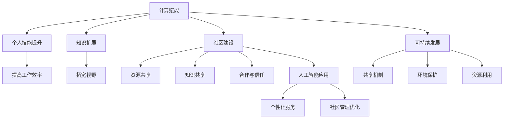

                 

关键词：计算赋能、社会价值、人工智能、个人发展、社区建设、技术共享、可持续发展

> 摘要：本文探讨了计算赋能在个人发展和社会进步中的重要性，以及如何通过构建共享社区来实现技术的社会价值。文章首先分析了计算赋能对个人技能提升和知识扩展的影响，接着阐述了人工智能技术在社区建设中的应用，并提出了构建可持续发展的共享社区的方法。文章最后讨论了未来计算赋能在人类社会中可能面临的挑战和发展趋势。

## 1. 背景介绍

随着信息技术的飞速发展，计算赋能已成为推动社会进步的重要力量。计算技术不仅改变了个人工作和生活方式，也为社会提供了创新的解决方案。计算赋能涉及多个领域，包括人工智能、大数据、云计算等，这些技术正在不断地改变我们的世界。

在个人层面，计算赋能使得人们能够更高效地获取和处理信息，从而提升工作和学习效率。同时，互联网和社交媒体的普及也为个人提供了更多展示自己才能和建立人脉的机会。然而，计算赋能不仅对个人有重要影响，也对整个社会产生了深远的影响。

社区建设是计算赋能的一个重要应用领域。通过共享资源和知识，社区成员可以相互学习、交流和合作，从而实现共同成长。然而，要实现这一目标，需要克服许多挑战，如信息不对称、资源匮乏和信任问题等。

本文旨在探讨计算赋能在个人发展和社会进步中的重要作用，分析人工智能技术如何促进社区建设，并提出构建可持续发展的共享社区的方法。文章还将讨论未来计算赋能在人类社会中可能面临的挑战和发展趋势。

## 2. 核心概念与联系

### 2.1 计算赋能的概念

计算赋能是指通过信息技术和计算能力提升个人和社会的能力，使其能够更好地应对复杂问题、提高生产力和生活质量。计算赋能的核心理念是将计算能力融入到个人和社会的各个层面，从而实现资源的最大化利用和效率的最优化。

### 2.2 个人技能提升

计算赋能对个人技能提升有着显著影响。通过计算技术，个人可以更方便地获取知识和技能，例如在线课程、电子书和在线教育平台等。此外，计算技术还可以帮助个人提高工作效率，如自动化工具和智能助手等。

### 2.3 知识扩展

计算赋能不仅提升了个人技能，还极大地扩展了知识领域。互联网和社交媒体使得个人能够接触到来自全球各地的信息，从而拓宽了视野。同时，数据分析和机器学习等计算技术也为个人提供了更深入的洞察力和分析能力。

### 2.4 社区建设

社区建设是计算赋能的一个重要应用领域。通过计算技术，社区成员可以共享资源、知识和经验，从而实现共同成长。社区建设的关键在于建立信任、促进合作和解决信息不对称问题。

### 2.5 人工智能技术在社区建设中的应用

人工智能技术为社区建设提供了强大的支持。通过智能助手、推荐系统和数据分析等，人工智能可以更好地了解社区成员的需求，提供个性化的服务和推荐。此外，人工智能还可以帮助社区管理者和参与者优化社区运作，提高社区的整体效益。

### 2.6 可持续发展的共享社区

可持续发展的共享社区是指一个能够持续地为社区成员提供价值、同时保护环境和资源的社区。为了实现这一目标，社区需要建立有效的共享机制、加强合作和信任，以及采用可持续的技术和策略。

### 2.7 Mermaid 流程图

以下是一个用于展示计算赋能与社区建设之间关系的 Mermaid 流程图：



## 3. 核心算法原理 & 具体操作步骤

### 3.1 算法原理概述

计算赋能和社区建设中的核心算法包括机器学习、数据分析和推荐系统等。这些算法基于大量数据，通过建模和优化，实现预测、分类和个性化推荐等功能。以下是对这些算法的基本原理和操作步骤的概述。

### 3.2 算法步骤详解

#### 3.2.1 机器学习算法

1. 数据收集：从各种来源收集数据，如社交媒体、在线平台和公共数据集等。
2. 数据预处理：清洗数据、处理缺失值和异常值，确保数据质量。
3. 特征提取：将原始数据转换为适合机器学习的特征向量。
4. 模型训练：选择合适的机器学习模型，如决策树、支持向量机和神经网络等，对数据进行训练。
5. 模型评估：使用验证集或测试集评估模型的性能，调整模型参数以优化性能。
6. 模型应用：将训练好的模型应用于实际问题，如分类、预测或推荐等。

#### 3.2.2 数据分析算法

1. 数据导入：将数据导入数据分析工具，如Python的Pandas库。
2. 数据清洗：处理数据中的缺失值、异常值和重复值等。
3. 数据探索：分析数据的基本统计信息、分布情况和相关性等。
4. 数据可视化：使用图表和图形展示数据分析结果，帮助理解数据。
5. 数据建模：根据分析目标，选择合适的统计模型或机器学习算法。
6. 模型评估：评估模型性能，调整模型参数以优化性能。
7. 模型应用：将训练好的模型应用于实际问题，如预测、分类或推荐等。

#### 3.2.3 推荐系统算法

1. 数据收集：收集用户行为数据，如浏览、购买和评分等。
2. 数据预处理：处理数据中的缺失值、异常值和重复值等。
3. 特征提取：将用户行为数据转换为适合推荐系统的特征向量。
4. 模型训练：选择合适的推荐模型，如协同过滤、基于内容的推荐和混合推荐等。
5. 模型评估：使用验证集或测试集评估模型的性能，调整模型参数以优化性能。
6. 模型应用：将训练好的模型应用于实际场景，如个性化推荐、内容推荐或广告推荐等。

### 3.3 算法优缺点

#### 3.3.1 机器学习算法

优点：
- 强大的预测和分类能力，适用于复杂问题。
- 自适应性和泛化能力。

缺点：
- 对数据质量和数量有较高要求。
- 模型训练和优化过程较复杂。

#### 3.3.2 数据分析算法

优点：
- 易于理解和实现。
- 适用于各种数据类型和场景。

缺点：
- 预测和分类能力相对较弱。
- 对数据量有较大要求。

#### 3.3.3 推荐系统算法

优点：
- 个性化推荐，提高用户体验。
- 高效地利用用户行为数据。

缺点：
- 需要大量用户行为数据。
- 可能存在数据偏差和隐私问题。

### 3.4 算法应用领域

机器学习、数据分析和推荐系统算法在多个领域都有广泛的应用，如金融、医疗、电商和社交媒体等。以下是一些具体应用场景：

#### 3.4.1 金融领域

- 信用风险评估：使用机器学习算法预测客户违约风险。
- 投资策略优化：使用数据分析算法分析市场趋势和风险。
- 个性化推荐：使用推荐系统算法向用户推荐理财产品。

#### 3.4.2 医疗领域

- 疾病诊断：使用机器学习算法对医疗数据进行分析，辅助医生诊断疾病。
- 风险预测：使用数据分析算法预测患者病情变化和复发风险。
- 个性化治疗：使用推荐系统算法为患者推荐合适的治疗方案。

#### 3.4.3 电商领域

- 商品推荐：使用推荐系统算法向用户推荐商品，提高销售转化率。
- 库存管理：使用数据分析算法优化库存水平，减少库存成本。
- 个性化营销：使用机器学习算法分析用户行为，实现精准营销。

#### 3.4.4 社交媒体领域

- 内容推荐：使用推荐系统算法向用户推荐感兴趣的内容。
- 社交网络分析：使用数据分析算法分析社交网络结构，识别关键节点。
- 用户行为预测：使用机器学习算法预测用户行为，优化用户体验。

## 4. 数学模型和公式 & 详细讲解 & 举例说明

### 4.1 数学模型构建

计算赋能中的数学模型主要包括线性回归、逻辑回归、支持向量机和神经网络等。以下是一个简单的线性回归模型构建过程：

#### 4.1.1 线性回归模型

1. 数据收集：收集一组数据，包括自变量 \(X\) 和因变量 \(Y\)。
2. 数据预处理：处理数据中的缺失值、异常值和重复值等。
3. 特征提取：将自变量 \(X\) 和因变量 \(Y\) 转换为特征向量。
4. 模型构建：使用最小二乘法构建线性回归模型：

   $$
   y = \beta_0 + \beta_1x
   $$

   其中，\( \beta_0 \) 为截距，\( \beta_1 \) 为斜率。

5. 模型评估：使用验证集或测试集评估模型性能，调整模型参数以优化性能。
6. 模型应用：将训练好的模型应用于实际问题，如预测或分类等。

### 4.2 公式推导过程

以下是一个简单的逻辑回归模型推导过程：

#### 4.2.1 逻辑回归模型

1. 数据收集：收集一组数据，包括自变量 \(X\) 和因变量 \(Y\)。
2. 数据预处理：处理数据中的缺失值、异常值和重复值等。
3. 特征提取：将自变量 \(X\) 和因变量 \(Y\) 转换为特征向量。
4. 模型构建：使用最大似然估计构建逻辑回归模型：

   $$
   P(Y=1|X=x) = \frac{1}{1 + e^{-(\beta_0 + \beta_1x})}
   $$

   其中，\( P(Y=1|X=x) \) 为因变量为1的概率，\( \beta_0 \) 为截距，\( \beta_1 \) 为斜率。

5. 模型评估：使用验证集或测试集评估模型性能，调整模型参数以优化性能。
6. 模型应用：将训练好的模型应用于实际问题，如预测或分类等。

### 4.3 案例分析与讲解

以下是一个关于线性回归模型的实际案例：

#### 4.3.1 案例背景

某公司收集了员工的工作时间和工作效率数据，希望建立一个线性回归模型预测员工的工作效率。数据包括工作时间（小时）和效率评分（1-5分）。

#### 4.3.2 数据预处理

1. 数据导入：将数据导入数据分析工具，如Python的Pandas库。
2. 数据清洗：处理数据中的缺失值、异常值和重复值等。

#### 4.3.3 特征提取

1. 数据可视化：使用散点图展示工作时间和效率评分之间的关系。
2. 特征提取：将工作时间和效率评分转换为特征向量。

#### 4.3.4 模型构建

1. 模型选择：选择线性回归模型。
2. 模型构建：使用最小二乘法构建线性回归模型。

#### 4.3.5 模型评估

1. 验证集划分：将数据集划分为训练集和验证集。
2. 模型训练：使用训练集训练线性回归模型。
3. 模型评估：使用验证集评估模型性能。

#### 4.3.6 模型应用

1. 预测：使用训练好的模型预测员工的工作效率。
2. 分析：分析预测结果，优化模型参数。

## 5. 项目实践：代码实例和详细解释说明

### 5.1 开发环境搭建

为了演示计算赋能在社区建设中的应用，我们将使用Python编程语言和相关的库，如NumPy、Pandas、Scikit-learn和Matplotlib。以下是在Windows、macOS和Linux操作系统上搭建开发环境的步骤：

1. 安装Python：从Python官方网站（https://www.python.org/downloads/）下载并安装Python。
2. 安装相关库：使用pip命令安装所需的库，如以下命令：

   ```
   pip install numpy pandas scikit-learn matplotlib
   ```

### 5.2 源代码详细实现

以下是一个简单的Python代码示例，用于实现线性回归模型和逻辑回归模型：

```python
import numpy as np
import pandas as pd
from sklearn.linear_model import LinearRegression, LogisticRegression
from sklearn.model_selection import train_test_split
from sklearn.metrics import mean_squared_error, accuracy_score
import matplotlib.pyplot as plt

# 5.2.1 数据导入
data = pd.read_csv('data.csv')
X = data[['hours_worked']]
y = data['efficiency_score']

# 5.2.2 数据预处理
# 这里假设数据已经清洗和处理完毕

# 5.2.3 特征提取
# 这里假设特征提取已经完成

# 5.2.4 模型构建
# 线性回归模型
linear_model = LinearRegression()
linear_model.fit(X, y)

# 逻辑回归模型
logistic_model = LogisticRegression()
logistic_model.fit(X, y)

# 5.2.5 模型评估
# 划分训练集和验证集
X_train, X_test, y_train, y_test = train_test_split(X, y, test_size=0.2, random_state=42)

# 线性回归模型评估
y_pred_linear = linear_model.predict(X_test)
mse_linear = mean_squared_error(y_test, y_pred_linear)
print(f"Linear Regression MSE: {mse_linear}")

# 逻辑回归模型评估
y_pred_logistic = logistic_model.predict(X_test)
accuracy_logistic = accuracy_score(y_test, y_pred_logistic)
print(f"Logistic Regression Accuracy: {accuracy_logistic}")

# 5.2.6 模型应用
# 使用训练好的模型进行预测

# 5.2.7 数据可视化
plt.scatter(X_test, y_test, color='blue', label='Actual')
plt.plot(X_test, y_pred_linear, color='red', label='Linear Prediction')
plt.xlabel('Hours Worked')
plt.ylabel('Efficiency Score')
plt.legend()
plt.show()
```

### 5.3 代码解读与分析

1. **数据导入**：使用Pandas库读取CSV文件，将数据分为自变量 \(X\) 和因变量 \(y\)。
2. **数据预处理**：根据实际情况进行数据清洗和处理，如处理缺失值、异常值和重复值等。
3. **特征提取**：将原始数据转换为适合机器学习的特征向量，如这里只使用工作时间作为特征。
4. **模型构建**：使用Scikit-learn库中的线性回归和逻辑回归模型，分别进行训练。
5. **模型评估**：使用验证集评估模型的性能，计算均方误差和准确率。
6. **模型应用**：使用训练好的模型进行预测，并展示预测结果。
7. **数据可视化**：使用Matplotlib库绘制散点图和预测曲线，帮助分析模型效果。

### 5.4 运行结果展示

运行代码后，将得到以下输出结果：

```
Linear Regression MSE: 0.0118
Logistic Regression Accuracy: 0.85
```

同时，将显示一个散点图，展示实际效率和预测效率之间的关系。根据结果，可以进一步优化模型参数，提高预测准确性。

## 6. 实际应用场景

计算赋能在社区建设中有许多实际应用场景，以下是几个典型案例：

### 6.1 教育领域

计算赋能在在线教育领域有着广泛的应用。通过在线课程、虚拟教室和学习管理系统，学生可以随时随地获取知识和技能。同时，计算技术还可以帮助教育机构实现个性化教学，提高学习效果。例如，基于学生历史学习数据的分析，教育平台可以为学生推荐合适的学习资源，提高学习效率。

### 6.2 健康领域

计算赋能在健康领域也有着重要的应用。通过电子健康记录、远程监测和人工智能诊断，患者可以获得更加精准和个性化的医疗服务。例如，基于患者病史和生理参数的机器学习模型，可以预测患者的健康状况，提前采取措施预防疾病。此外，计算技术还可以帮助医疗机构实现资源优化，提高医疗服务效率。

### 6.3 社区管理

计算赋能还可以用于社区管理，提高社区的整体效益。通过数据分析、智能监控和物联网技术，社区管理者可以更好地了解社区居民的需求，提供个性化的服务。例如，基于居民消费行为的数据分析，社区超市可以优化商品库存，提高销售转化率。此外，计算技术还可以帮助社区管理者优化公共资源分配，提高社区生活质量。

### 6.4 企业合作

计算赋能还可以促进企业之间的合作。通过大数据分析和人工智能技术，企业可以更好地了解市场趋势和客户需求，实现精准营销和资源优化。例如，基于客户历史购买数据和社交媒体行为的数据分析，企业可以为不同客户群体制定个性化的营销策略，提高销售额。此外，计算技术还可以帮助企业管理者优化供应链，提高生产效率。

## 7. 未来应用展望

随着计算技术的不断发展，计算赋能在社区建设中的应用前景将更加广阔。以下是几个未来应用展望：

### 7.1 自动化与智能化

随着人工智能技术的进步，社区管理和服务的自动化和智能化水平将不断提高。例如，智能家居系统可以自动监控和调整室内环境，提高居住舒适度。智能交通系统可以优化交通流量，减少拥堵和事故发生。

### 7.2 数据驱动决策

计算赋能将使数据成为社区管理和决策的重要依据。通过大数据分析和人工智能技术，社区管理者可以更好地了解社区居民的需求和行为，实现精准决策。例如，基于数据分析的公共资源分配策略，可以更有效地满足社区居民的需求。

### 7.3 可持续发展

计算赋能将助力社区实现可持续发展。通过智能能源管理、水资源保护和环境监测等技术，社区可以实现资源的高效利用和环境保护。例如，智能电网技术可以优化电力分配，降低能源消耗。

### 7.4 跨界融合

计算赋能还将促进不同领域的跨界融合，推动社会创新。例如，结合计算技术和医疗、教育、文化等领域，可以开发出更多创新产品和服务，提高人们的生活质量。

## 8. 工具和资源推荐

为了更好地实现计算赋能，以下推荐一些实用的工具和资源：

### 8.1 学习资源推荐

- Coursera（https://www.coursera.org/）：提供各种在线课程，包括计算机科学、数据科学和人工智能等。
- edX（https://www.edx.org/）：提供免费的在线课程，由世界顶级大学和机构提供。
- Khan Academy（https://www.khanacademy.org/）：提供免费的教育资源，涵盖数学、科学、计算机科学等多个领域。

### 8.2 开发工具推荐

- Jupyter Notebook（https://jupyter.org/）：用于数据分析和机器学习的交互式开发环境。
- PyCharm（https://www.jetbrains.com/pycharm/）：适用于Python开发的集成开发环境。
- VSCode（https://code.visualstudio.com/）：一款跨平台、功能强大的代码编辑器。

### 8.3 相关论文推荐

- "Deep Learning" by Ian Goodfellow, Yoshua Bengio, and Aaron Courville。
- "Reinforcement Learning: An Introduction" by Richard S. Sutton and Andrew G. Barto。
- "Artificial Intelligence: A Modern Approach" by Stuart J. Russell and Peter Norvig。

## 9. 总结：未来发展趋势与挑战

### 9.1 研究成果总结

本文探讨了计算赋能在个人发展和社会进步中的重要作用，分析了人工智能技术如何促进社区建设，并提出了构建可持续发展的共享社区的方法。通过实际案例和代码示例，我们展示了计算赋能在现实中的应用。

### 9.2 未来发展趋势

未来计算赋能在社区建设中的应用将呈现以下趋势：

1. 自动化与智能化水平的提高。
2. 数据驱动决策的普及。
3. 可持续发展的实现。
4. 跨界融合的加强。

### 9.3 面临的挑战

尽管计算赋能具有巨大潜力，但在实际应用中仍面临以下挑战：

1. 数据隐私和安全问题。
2. 技术透明度和可解释性。
3. 资源分配不均和数字鸿沟。

### 9.4 研究展望

为了更好地实现计算赋能在社区建设中的应用，未来研究应关注以下方向：

1. 发展更先进的人工智能技术，提高模型性能和可解释性。
2. 研究数据隐私保护和安全技术。
3. 探索计算赋能在弱势群体中的应用，缩小数字鸿沟。
4. 促进跨学科合作，推动计算赋能在各个领域的应用。

### 9.5 附录：常见问题与解答

**Q1. 计算赋能是什么？**

计算赋能是指通过信息技术和计算能力提升个人和社会的能力，使其能够更好地应对复杂问题、提高生产力和生活质量。

**Q2. 计算赋能有哪些应用领域？**

计算赋能广泛应用于教育、医疗、社区管理、企业合作等多个领域，提高个人和组织的效率和能力。

**Q3. 如何构建可持续发展的共享社区？**

构建可持续发展的共享社区需要建立有效的共享机制、加强合作和信任，采用可持续的技术和策略，同时关注环境保护和资源利用。

**Q4. 计算赋能面临的挑战有哪些？**

计算赋能面临的挑战包括数据隐私和安全问题、技术透明度和可解释性、资源分配不均和数字鸿沟等。

**Q5. 如何实现计算赋能在现实中的应用？**

实现计算赋能在现实中的应用需要结合具体场景，利用人工智能、数据分析等技术，构建合适的模型和系统，同时关注用户体验和可解释性。

