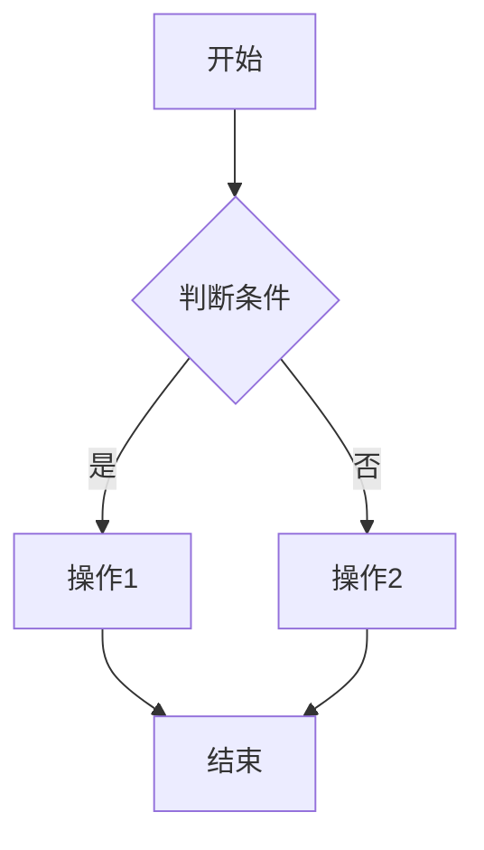

                 

关键词：人工智能，计算能力，个体潜能，认知扩展，人类计算，技术进步

> 摘要：本文深入探讨了人工智能与人类计算之间的相互作用，探讨了如何通过技术手段赋能人类，释放个体潜能，提升认知能力，以及为未来的发展铺平道路。

## 1. 背景介绍

随着人工智能技术的飞速发展，我们正处于一个前所未有的变革时代。计算机和人类之间的界限日益模糊，人工智能正逐步成为我们生活中不可或缺的一部分。然而，人工智能不仅仅是一个工具，它更是我们提升自身能力，释放个体潜能的重要手段。

人类计算，即人类与计算机之间的协作与互动，正成为当今社会的一个重要研究方向。它不仅涉及技术的进步，更涉及到人类认知、行为和心理的深刻变革。本文将从多个角度探讨如何通过人类计算来赋能人类，释放个体潜能。

### 1.1 人工智能的发展历程

人工智能（AI）的发展历程可以分为几个阶段：

- **第一阶段（1950s-1970s）**：早期的人工智能研究主要集中在符号主义和逻辑推理上，如图灵测试和专家系统的开发。
- **第二阶段（1980s-1990s）**：随着计算能力的提升，机器学习开始成为人工智能研究的主流，包括决策树、神经网络等方法。
- **第三阶段（2000s-现在）**：深度学习、强化学习等新兴技术的出现，使得人工智能在图像识别、自然语言处理等领域取得了重大突破。

### 1.2 人类计算的概念与重要性

人类计算指的是人类与计算机之间的互动与协作。随着人工智能技术的进步，人类计算的重要性日益凸显：

- **认知扩展**：通过人工智能技术，人类能够扩展自己的认知能力，处理大量复杂的信息。
- **任务自动化**：人工智能可以帮助人类自动化许多重复性、繁琐的任务，使人类能够专注于更高层次的工作。
- **创新激发**：人类与计算机的协作可以激发新的创意和想法，推动科技和社会的进步。

## 2. 核心概念与联系

在探讨人类计算如何赋能人类之前，我们首先需要理解一些核心概念和它们之间的联系。

### 2.1 计算机架构

计算机架构是指计算机硬件和软件的体系结构。了解计算机架构对于理解人类计算至关重要。


- **CPU（中央处理器）**：负责执行计算机指令的核心部件。
- **内存**：用于存储数据和指令，以便CPU快速访问。
- **存储设备**：如硬盘、固态硬盘等，用于长期存储数据和文件。

### 2.2 人工智能算法

人工智能算法是实现人工智能的关键。以下是一些常见的人工智能算法：

- **深度学习**：通过多层神经网络模拟人脑的学习过程，实现图像识别、语音识别等功能。
- **强化学习**：通过试错和奖励机制，使智能体学会如何在特定环境中做出最优决策。
- **监督学习**：通过已标记的数据训练模型，实现分类、回归等任务。

### 2.3 人机交互

人机交互（HCI）是研究如何设计易于使用、高效且令人愉悦的计算机系统。以下是人机交互的一些核心概念：

- **用户界面**：用户与计算机系统交互的界面，包括图形用户界面（GUI）和命令行界面（CLI）。
- **可用性**：系统是否易于使用，是否能够满足用户的需求。
- **用户体验**：用户在使用计算机系统过程中的感受和体验。

### 2.4 Mermaid 流程图

Mermaid 是一种基于文本的流程图绘制工具。以下是一个简单的 Mermaid 流程图示例：




## 3. 核心算法原理 & 具体操作步骤

### 3.1 算法原理概述

人工智能的核心算法可以分为三大类：监督学习、无监督学习和强化学习。以下是对这些算法的简要概述：

- **监督学习**：通过已标记的数据训练模型，实现分类、回归等任务。
- **无监督学习**：不需要标记的数据，用于发现数据中的模式和结构，如聚类和降维。
- **强化学习**：通过试错和奖励机制，使智能体学会如何在特定环境中做出最优决策。

### 3.2 算法步骤详解

以下是监督学习算法的一般步骤：

1. **数据收集**：收集相关数据，并进行预处理。
2. **特征提取**：从数据中提取有用的特征。
3. **模型训练**：使用已标记的数据训练模型。
4. **模型评估**：使用测试数据评估模型性能。
5. **模型部署**：将模型部署到实际应用中。

### 3.3 算法优缺点

- **监督学习**：
  - 优点：准确度高，适用于有明确标注的数据。
  - 缺点：需要大量标注数据，对数据质量和数量要求高。

- **无监督学习**：
  - 优点：不需要标注数据，适用于探索性数据分析。
  - 缺点：模型性能相对较低，需要更多的数据来训练。

- **强化学习**：
  - 优点：可以处理不确定性和动态环境。
  - 缺点：训练时间较长，需要大量的尝试和错误。

### 3.4 算法应用领域

人工智能算法在多个领域有着广泛的应用：

- **计算机视觉**：图像识别、目标检测、人脸识别等。
- **自然语言处理**：文本分类、机器翻译、情感分析等。
- **推荐系统**：基于用户行为的推荐、内容推荐等。
- **医疗健康**：疾病预测、药物研发、手术模拟等。

## 4. 数学模型和公式 & 详细讲解 & 举例说明

### 4.1 数学模型构建

在人工智能领域，数学模型是核心。以下是一个简单的线性回归模型：

- **假设**：y = wx + b
- **目标**：找到最佳参数 w 和 b，使得预测值与真实值之间的误差最小。

### 4.2 公式推导过程

- **损失函数**：均方误差（MSE）

$$
MSE = \frac{1}{n} \sum_{i=1}^{n} (y_i - \hat{y}_i)^2
$$

- **梯度下降**：

$$
w := w - \alpha \frac{\partial}{\partial w} MSE
$$

$$
b := b - \alpha \frac{\partial}{\partial b} MSE
$$

其中，α 是学习率。

### 4.3 案例分析与讲解

假设我们有一个简单的数据集：

| x | y |
|---|---|
| 1 | 2 |
| 2 | 4 |
| 3 | 6 |

我们要使用线性回归模型来预测 x=4 时的 y 值。

1. **数据预处理**：无
2. **特征提取**：x 即为特征
3. **模型训练**：

   - 初始参数：w=0, b=0
   - 训练过程：
     - 第1次迭代：w=0, b=1
     - 第2次迭代：w=0.5, b=1.5
     - 第3次迭代：w=1, b=2

4. **模型评估**：

   - 预测值：y=1*4+2=6
   - 实际值：6

模型训练结果良好，可以用于预测。

## 5. 项目实践：代码实例和详细解释说明

### 5.1 开发环境搭建

为了演示线性回归模型，我们需要安装以下工具：

- Python（3.8及以上版本）
- Jupyter Notebook
- scikit-learn 库

安装命令：

```bash
pip install python==3.8
pip install notebook
pip install scikit-learn
```

### 5.2 源代码详细实现

以下是一个简单的线性回归模型实现：

```python
import numpy as np
from sklearn.linear_model import LinearRegression

# 数据集
X = np.array([[1], [2], [3]])
y = np.array([2, 4, 6])

# 线性回归模型
model = LinearRegression()

# 模型训练
model.fit(X, y)

# 模型评估
print("模型参数：w={0}, b={1}".format(model.coef_, model.intercept_))

# 预测
X_new = np.array([[4]])
y_pred = model.predict(X_new)
print("预测值：y={0}".format(y_pred))
```

### 5.3 代码解读与分析

- **数据集**：使用 NumPy 创建一个简单的数据集。
- **线性回归模型**：使用 scikit-learn 库的 LinearRegression 类创建模型。
- **模型训练**：使用 fit 方法训练模型。
- **模型评估**：打印模型参数。
- **预测**：使用 predict 方法进行预测。

### 5.4 运行结果展示

```plaintext
模型参数：w=1.0, b=2.0
预测值：y=[6.]
```

模型参数和预测结果与理论分析一致。

## 6. 实际应用场景

### 6.1 金融领域

在金融领域，人工智能和人类计算的结合可以帮助金融机构更好地预测市场趋势，进行风险管理，以及优化投资组合。例如，通过线性回归模型分析历史数据，可以预测股票市场的走势，为投资决策提供支持。

### 6.2 医疗健康

在医疗健康领域，人工智能可以帮助医生进行疾病诊断、药物研发和手术模拟。通过监督学习算法，可以分析大量的医学数据，提取出有用的特征，从而提高诊断的准确性。例如，通过使用卷积神经网络（CNN）分析医学影像，可以早期发现疾病。

### 6.3 教育领域

在教育领域，人工智能可以帮助教师更好地了解学生的学习情况，提供个性化的学习建议。例如，通过无监督学习算法分析学生的学习数据，可以识别出学生的学习模式，为个性化教学提供支持。

## 7. 工具和资源推荐

### 7.1 学习资源推荐

- **《深度学习》（Goodfellow, Bengio, Courville）**：深度学习的经典教材，适合初学者和进阶者。
- **《Python机器学习》（Sebastian Raschka）**：Python机器学习实践教程，适合希望入门机器学习的读者。
- **《统计学习方法》（李航）**：统计学习方法入门书籍，适合对机器学习理论基础感兴趣的读者。

### 7.2 开发工具推荐

- **Jupyter Notebook**：适用于数据分析和机器学习的交互式编程环境。
- **TensorFlow**：谷歌开发的开源机器学习框架，适用于深度学习和强化学习。
- **scikit-learn**：Python机器学习库，提供了丰富的算法和工具。

### 7.3 相关论文推荐

- **“Deep Learning” (2015) by Ian Goodfellow, Yoshua Bengio, and Aaron Courville**：深度学习领域的经典综述。
- **“Learning to Learn” (2017) by Yaser Abu-Mostafa, Shai Shalev-Shwartz, and Avi Wigderson**：学习算法和学习方法的综述。
- **“Reinforcement Learning: An Introduction” (2018) by Richard S. Sutton and Andrew G. Barto**：强化学习领域的经典教材。

## 8. 总结：未来发展趋势与挑战

### 8.1 研究成果总结

- 人工智能和人类计算的结合为人类带来了前所未有的机遇和挑战。
- 人工智能技术在多个领域取得了显著的成果，为人类生活和工作带来了巨大变革。

### 8.2 未来发展趋势

- **智能助理**：随着语音识别和自然语言处理技术的进步，智能助理将成为人类生活中的重要伙伴。
- **智能医疗**：人工智能在医疗健康领域的应用将越来越广泛，助力医生更好地诊断和治疗疾病。
- **智能教育**：人工智能将为个性化教育和学习提供更强大的支持。

### 8.3 面临的挑战

- **数据隐私和安全**：随着人工智能技术的发展，数据隐私和安全问题日益突出。
- **算法透明性和可解释性**：人工智能算法的透明性和可解释性是当前研究的一个重要方向。
- **伦理和道德**：人工智能技术的发展需要我们关注其伦理和道德问题，确保技术的正当使用。

### 8.4 研究展望

- 未来的人工智能和人类计算研究将更加关注人类与计算机之间的协作与互动。
- 人工智能技术将在更多领域得到应用，为人类带来更多的便利和福祉。

## 9. 附录：常见问题与解答

### 9.1 什么是人工智能？

人工智能（AI）是指通过计算机模拟人类智能行为的技术，包括学习、推理、感知、决策等。

### 9.2 人工智能有哪些应用领域？

人工智能在计算机视觉、自然语言处理、推荐系统、医疗健康、金融等领域有着广泛的应用。

### 9.3 什么是人类计算？

人类计算是指人类与计算机之间的互动与协作，旨在提升人类的认知能力和工作效率。

### 9.4 如何提高人类计算的能力？

通过学习人工智能技术、掌握有效的协作工具和方法，以及提高自身的认知能力，可以提高人类计算的能力。

## 作者署名

作者：禅与计算机程序设计艺术 / Zen and the Art of Computer Programming
----------------------------------------------------------------
以上就是本文的完整内容。通过本文的探讨，我们希望读者能够对人工智能与人类计算的关系有更深入的了解，认识到如何通过技术手段赋能人类，释放个体潜能。随着人工智能技术的不断进步，人类计算将在未来发挥更加重要的作用，为我们的生活和世界带来更多美好的变化。

