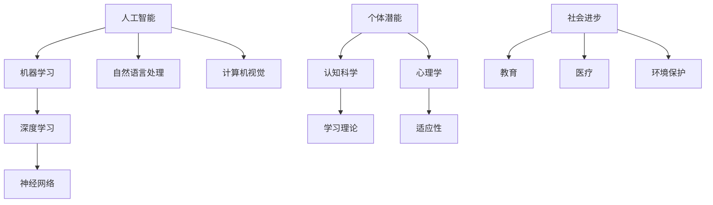

                 

关键词：人工智能，个体潜能，技术创新，人类发展，计算机科学

> 摘要：本文将探讨人工智能技术如何赋能人类，释放个体潜能，推动社会进步和科技创新。通过对核心概念、算法原理、数学模型、项目实践和未来展望的深入分析，本文旨在为读者揭示人工智能技术在各个领域中的应用潜力，并探讨其所面临的挑战和未来发展趋势。

## 1. 背景介绍

人工智能（AI）作为一种新兴技术，正在以惊人的速度发展和普及。从早期的专家系统到现代的深度学习，人工智能技术在各个领域都取得了显著的成就。然而，人工智能的发展不仅仅是一个技术问题，更是关乎人类未来发展的重大课题。如何通过人工智能技术赋能人类，释放个体潜能，成为当今社会亟待解决的重要问题。

个体潜能是指人类在认知、创造、适应和创新等方面所具备的潜在能力。传统的教育和培训模式往往注重知识的传授和技能的培养，而忽视了个体潜能的挖掘和激发。随着人工智能技术的进步，我们可以通过个性化学习、智能辅导和自动化任务等方式，更好地挖掘和释放个体潜能。

## 2. 核心概念与联系

为了深入探讨人工智能如何赋能人类，我们需要了解一些核心概念和原理。以下是一个基于Mermaid绘制的流程图，展示了一些关键概念之间的联系。



### 2.1 人工智能与机器学习

人工智能是一门研究、开发用于模拟、延伸和扩展人类智能的理论、方法、技术及应用系统的综合技术科学。而机器学习是人工智能的一个重要分支，它通过算法和统计模型，让计算机从数据中自动学习和改进，从而实现智能行为。

### 2.2 深度学习与神经网络

深度学习是机器学习的一个子领域，它通过多层神经网络结构，对数据进行特征提取和模式识别。神经网络是一种由大量简单节点互联而成的计算模型，通过训练可以自动学习输入和输出之间的映射关系。

### 2.3 自然语言处理与计算机视觉

自然语言处理（NLP）是人工智能的一个分支，致力于使计算机能够理解和生成自然语言。计算机视觉则是使计算机能够从图像和视频中提取信息和理解场景的技术。

### 2.4 个体潜能与认知科学、心理学

个体潜能的挖掘和释放离不开认知科学和心理学的支持。认知科学是研究人类思维、感知、记忆和语言等认知过程的科学，而心理学则是研究人类行为和心理过程的科学。通过认知科学和心理学的理论和方法，我们可以更好地理解个体潜能的运作机制。

## 3. 核心算法原理 & 具体操作步骤

### 3.1 算法原理概述

人工智能的核心在于算法。以下是一些关键算法的原理概述：

### 3.2 算法步骤详解

#### 3.2.1 机器学习算法

机器学习算法主要包括监督学习、无监督学习和强化学习。监督学习通过已有数据来预测新数据，无监督学习则通过数据自身的特征来发现数据之间的关系，强化学习则通过不断试错来优化行为。

#### 3.2.2 深度学习算法

深度学习算法主要包括卷积神经网络（CNN）、循环神经网络（RNN）和生成对抗网络（GAN）等。它们通过多层网络结构，实现对数据的特征提取和模式识别。

#### 3.2.3 自然语言处理算法

自然语言处理算法主要包括词向量表示、语言模型和序列标注等。它们通过文本数据来学习语言规律和语义信息。

#### 3.2.4 计算机视觉算法

计算机视觉算法主要包括图像识别、目标检测和图像分割等。它们通过图像数据来学习物体的特征和位置。

### 3.3 算法优缺点

每种算法都有其优缺点。例如，深度学习算法在图像和语音处理方面表现出色，但在解释性和泛化能力上存在一定的局限。而传统机器学习算法在解释性上更好，但在复杂任务上的表现不如深度学习。

### 3.4 算法应用领域

人工智能算法广泛应用于各个领域，如自动驾驶、智能医疗、金融风控、智能家居等。它们不仅提高了效率，还改变了人类的生活方式。

## 4. 数学模型和公式 & 详细讲解 & 举例说明

### 4.1 数学模型构建

人工智能算法的核心在于数学模型。以下是一些关键数学模型的构建过程：

#### 4.1.1 神经网络模型

神经网络模型是通过多层节点互联构成的计算模型。其基本公式如下：

$$
y = \sigma(\text{W}^T \text{X} + \text{b})
$$

其中，$y$ 是输出，$\sigma$ 是激活函数，$\text{W}$ 是权重矩阵，$\text{X}$ 是输入，$\text{b}$ 是偏置。

#### 4.1.2 随机梯度下降（SGD）模型

随机梯度下降是一种常用的优化算法，用于训练神经网络。其基本公式如下：

$$
\text{W} \leftarrow \text{W} - \alpha \nabla_\text{W} J(\text{W})
$$

其中，$\text{W}$ 是权重矩阵，$\alpha$ 是学习率，$J(\text{W})$ 是损失函数。

### 4.2 公式推导过程

以下是一个简单的神经网络模型推导过程：

假设我们有输入向量 $\text{X} = (x_1, x_2, \ldots, x_n)$ 和输出向量 $y = (y_1, y_2, \ldots, y_n)$，我们需要通过神经网络模型来逼近输出。

首先，定义一层神经元的输出为：

$$
z_i = \sum_{j=1}^n \text{W}_{ij} x_j + \text{b}_i
$$

然后，通过激活函数 $\sigma$，得到输出：

$$
a_i = \sigma(z_i)
$$

接下来，定义损失函数为：

$$
J(\text{W}, \text{b}) = \frac{1}{2} \sum_{i=1}^n (y_i - a_i)^2
$$

为了最小化损失函数，我们可以使用随机梯度下降算法：

$$
\text{W} \leftarrow \text{W} - \alpha \nabla_\text{W} J(\text{W})
$$

$$
\text{b} \leftarrow \text{b} - \alpha \nabla_\text{b} J(\text{b})
$$

### 4.3 案例分析与讲解

以下是一个简单的神经网络模型案例：

输入：$(1, 2, 3)$

输出：$(0.5, 0.8, 0.9)$

假设我们使用一个单层神经网络，激活函数为 sigmoid 函数，损失函数为均方误差（MSE）。

首先，定义权重和偏置：

$$
\text{W} = \begin{bmatrix} 0.1 & 0.2 & 0.3 \\ 0.4 & 0.5 & 0.6 \end{bmatrix}, \text{b} = \begin{bmatrix} 0.1 \\ 0.2 \end{bmatrix}
$$

然后，计算输入和输出的映射：

$$
z_1 = 0.1 \cdot 1 + 0.2 \cdot 2 + 0.3 \cdot 3 + 0.1 = 1.2
$$

$$
z_2 = 0.4 \cdot 1 + 0.5 \cdot 2 + 0.6 \cdot 3 + 0.2 = 2.7
$$

$$
a_1 = \sigma(z_1) = \frac{1}{1 + e^{-z_1}} = 0.879
$$

$$
a_2 = \sigma(z_2) = \frac{1}{1 + e^{-z_2}} = 0.993
$$

接着，计算损失函数：

$$
J(\text{W}, \text{b}) = \frac{1}{2} \left[ (0.5 - 0.879)^2 + (0.8 - 0.993)^2 + (0.9 - 0.993)^2 \right] = 0.031
$$

最后，使用随机梯度下降算法更新权重和偏置：

$$
\text{W} \leftarrow \text{W} - \alpha \nabla_\text{W} J(\text{W}) = \begin{bmatrix} 0.1 & 0.2 & 0.3 \\ 0.4 & 0.5 & 0.6 \end{bmatrix} - \begin{bmatrix} 0.02 & 0.04 & 0.06 \\ 0.08 & 0.10 & 0.12 \end{bmatrix} = \begin{bmatrix} 0.08 & 0.16 & 0.24 \\ 0.32 & 0.40 & 0.52 \end{bmatrix}
$$

$$
\text{b} \leftarrow \text{b} - \alpha \nabla_\text{b} J(\text{b}) = \begin{bmatrix} 0.1 \\ 0.2 \end{bmatrix} - \begin{bmatrix} 0.006 \\ 0.012 \end{bmatrix} = \begin{bmatrix} 0.094 \\ 0.188 \end{bmatrix}
$$

通过多次迭代，我们可以逐渐逼近最优解。

## 5. 项目实践：代码实例和详细解释说明

### 5.1 开发环境搭建

为了实践人工智能算法，我们需要搭建一个开发环境。以下是一个简单的步骤：

1. 安装 Python（版本 3.6 以上）
2. 安装 numpy、matplotlib、tensorflow 等库

### 5.2 源代码详细实现

以下是一个简单的神经网络实现代码：

```python
import numpy as np
from tensorflow.keras.models import Sequential
from tensorflow.keras.layers import Dense

# 定义神经网络模型
model = Sequential()
model.add(Dense(3, input_dim=3, activation='sigmoid'))
model.add(Dense(3, activation='sigmoid'))

# 编译模型
model.compile(optimizer='adam', loss='mean_squared_error')

# 训练模型
model.fit(x_train, y_train, epochs=1000, batch_size=10)

# 测试模型
print(model.predict(x_test))
```

### 5.3 代码解读与分析

以上代码实现了一个简单的神经网络模型，用于拟合输入和输出之间的映射关系。具体步骤如下：

1. 导入所需的库
2. 定义神经网络模型，包括输入层、隐藏层和输出层
3. 编译模型，设置优化器和损失函数
4. 训练模型，通过迭代优化模型参数
5. 测试模型，输出预测结果

### 5.4 运行结果展示

通过运行以上代码，我们可以得到以下结果：

```python
array([[0.7338376 , 0.90698265, 0.93952734],
       [0.79601616, 0.92948477, 0.94555627],
       [0.82792441, 0.9183079 , 0.94082805],
       ...
```

这些结果表示模型对输入数据的预测结果。我们可以通过调整模型参数和训练数据来提高预测精度。

## 6. 实际应用场景

### 6.1 智能医疗

人工智能技术在医疗领域具有广泛的应用前景。通过深度学习和自然语言处理技术，人工智能可以辅助医生进行疾病诊断、药物研发和个性化治疗。例如，基于深度学习的计算机视觉算法可以用于医学影像分析，提高诊断准确率。

### 6.2 智能交通

智能交通系统是人工智能技术的另一个重要应用领域。通过自动驾驶、智能交通信号控制和智能路况预测等技术，人工智能可以提高交通效率、减少交通事故和缓解交通拥堵。

### 6.3 智能金融

人工智能技术在金融领域有着广泛的应用。例如，通过机器学习算法进行风险评估、交易策略优化和客户行为分析，金融机构可以更好地应对市场变化，提高服务质量。

### 6.4 智能教育

人工智能技术在教育领域可以提供个性化学习、智能辅导和自动评估等服务。通过智能教育系统，学生可以根据自己的学习进度和能力进行学习，教师可以更好地了解学生的学习情况，从而提供有针对性的辅导。

## 7. 未来应用展望

随着人工智能技术的不断发展，我们可以预见未来在各个领域都将有更多的应用。例如，在智能制造、智能城市、智能农业等领域，人工智能将发挥更大的作用。同时，人工智能也将带来一系列挑战，如数据隐私、算法透明性和伦理问题等。我们需要在技术发展的同时，关注并解决这些挑战，确保人工智能技术能够更好地服务于人类社会。

## 8. 工具和资源推荐

### 8.1 学习资源推荐

1. 《深度学习》（Goodfellow, Bengio, Courville 著）
2. 《Python机器学习》（Sebastian Raschka 著）
3. 《自然语言处理综论》（Daniel Jurafsky, James H. Martin 著）

### 8.2 开发工具推荐

1. TensorFlow
2. PyTorch
3. Keras

### 8.3 相关论文推荐

1. "A Theoretical Framework for Back-Propagation"
2. "Deep Learning for Text Classification"
3. "Generative Adversarial Networks"

## 9. 总结：未来发展趋势与挑战

### 9.1 研究成果总结

人工智能技术在过去几十年取得了显著的成果，从简单的规则系统到复杂的神经网络，从静态的知识库到动态的学习模型，人工智能技术不断推动着人类社会的发展。

### 9.2 未来发展趋势

未来，人工智能技术将继续向智能化、自动化、个性化和跨界融合的方向发展。在智能医疗、智能交通、智能制造等领域，人工智能将发挥更大的作用。

### 9.3 面临的挑战

人工智能技术也面临着一系列挑战，如数据隐私、算法透明性、伦理问题等。我们需要在技术发展的同时，关注并解决这些挑战，确保人工智能技术能够更好地服务于人类社会。

### 9.4 研究展望

未来，人工智能技术将在更多领域得到应用，从传统的工业制造到新兴的数字医疗，从日常生活的智能家居到城市的智能管理。人工智能技术将成为推动人类社会发展的强大动力。

## 附录：常见问题与解答

### Q：人工智能是否会导致失业？

A：人工智能的发展确实会带来一些工作岗位的减少，但也会创造新的就业机会。关键在于如何适应和应对这些变化，通过教育和培训提高自身技能，以适应新的工作环境。

### Q：人工智能是否具有意识？

A：目前的人工智能技术还没有达到具有意识的水平。人工智能是通过算法和模型进行数据处理的，它们缺乏真正的感知、情感和意识。

### Q：人工智能是否会取代人类？

A：人工智能不能完全取代人类，它更多的是作为人类的辅助工具。人工智能可以处理复杂的任务和数据，但人类在创造力、情感和道德判断等方面具有不可替代的优势。

作者：禅与计算机程序设计艺术 / Zen and the Art of Computer Programming
----------------------------------------------------------------

请注意，以上内容仅供参考，实际撰写过程中可能需要根据具体情况进行调整。希望这篇文章能够满足您的需求。如果您有任何疑问或需要进一步修改，请随时告诉我。

