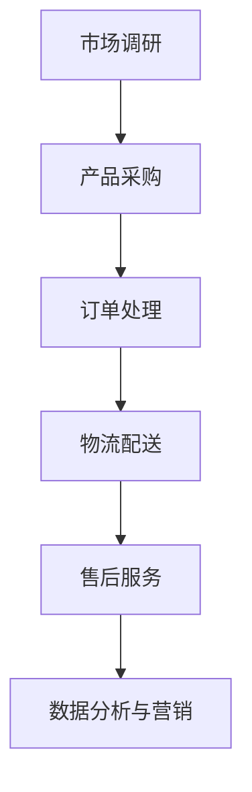

                 

关键词：跨境自动化、创业、机遇、挑战、技术解决方案、国际市场、物流、支付、法律合规、数据分析、人工智能

> 摘要：本文深入探讨了跨境自动化创业的机遇与挑战。通过对国际市场的分析，我们提出了一个基于人工智能和数据分析的跨境自动化解决方案，并详细讨论了其在物流、支付、法律合规等方面的应用。本文旨在为创业者提供实用的指导和策略，帮助他们抓住跨境市场的机遇，克服挑战，实现商业成功。

## 1. 背景介绍

随着全球化进程的加快，跨境贸易成为了推动世界经济的重要引擎。尤其在新冠疫情期间，线上购物需求的激增进一步推动了跨境电子商务的发展。然而，跨境自动化创业并非易事，涉及诸多挑战，包括物流、支付、法律合规等方面。在这个背景下，本文将分析跨境自动化创业的机遇与挑战，并提出相应的技术解决方案。

### 1.1 跨境电子商务的兴起

跨境电子商务（Cross-Border E-commerce，简称CBEC）是指在不同国家和地区之间的电子商务活动。近年来，随着互联网技术的普及和物流网络的完善，跨境电子商务呈现出爆发式增长。根据联合国贸易和发展会议（UNCTAD）的数据，全球跨境电子商务的规模预计将在未来几年内持续扩大，成为推动全球经济增长的重要力量。

### 1.2 跨境自动化创业的必要性

跨境电子商务的快速发展带来了巨大的商业机会，但同时也伴随着诸多挑战。创业者需要应对不同国家和地区的市场差异、复杂的物流体系和法律合规问题。为了提高效率、降低成本、提升客户满意度，跨境自动化创业变得尤为重要。通过引入人工智能和数据分析技术，企业可以自动化处理订单、物流、支付等环节，从而实现快速响应市场需求，提升竞争力。

## 2. 核心概念与联系

在探讨跨境自动化创业之前，我们需要明确几个核心概念，包括跨境电子商务的运作模式、自动化技术的应用场景以及国际市场的特点。

### 2.1 跨境电子商务运作模式

跨境电子商务的运作模式主要包括以下几个环节：

1. **市场调研**：了解目标市场的需求和偏好，进行产品定位和市场细分。
2. **产品采购**：选择具有竞争力的商品，并与供应商建立合作关系。
3. **订单处理**：接收客户订单，进行订单确认、支付和发货。
4. **物流配送**：选择合适的物流服务商，确保货物按时送达。
5. **售后服务**：处理客户咨询、退换货等问题，提升客户满意度。

### 2.2 自动化技术的应用场景

自动化技术在跨境电子商务中的应用场景广泛，主要包括以下几个方面：

1. **订单自动化处理**：通过自动化系统，快速响应客户订单，提高处理效率。
2. **物流自动化管理**：利用物联网技术，实时监控货物状态，优化物流路线。
3. **支付自动化处理**：采用电子支付方式，简化支付流程，提高支付安全性。
4. **数据分析与营销**：通过数据分析，了解客户行为和市场趋势，优化营销策略。

### 2.3 国际市场的特点

国际市场具有以下特点：

1. **文化差异**：不同国家和地区的消费者文化、消费习惯存在显著差异，需要针对目标市场进行本地化运营。
2. **法律法规**：不同国家和地区的法律法规存在差异，需要遵守当地法律，确保业务合规。
3. **关税和税收**：关税和税收政策会影响跨境电子商务的利润，需要合理规划。
4. **语言障碍**：语言障碍会影响客户沟通和用户体验，需要提供多语言支持。

### 2.4 Mermaid 流程图

下面是一个简单的 Mermaid 流程图，展示了跨境电子商务的运作流程：



## 3. 核心算法原理 & 具体操作步骤

### 3.1 算法原理概述

在跨境自动化创业中，核心算法主要涉及订单处理、物流管理和数据分析三个方面。

1. **订单处理算法**：通过自动化系统，快速响应客户订单，处理订单确认、支付和发货等环节。
2. **物流管理算法**：利用物联网技术和大数据分析，实时监控货物状态，优化物流路线，降低物流成本。
3. **数据分析算法**：通过收集和分析客户数据，了解市场趋势和客户需求，优化营销策略。

### 3.2 算法步骤详解

1. **订单处理算法**：
    - 客户下单：客户在电商平台下单，系统记录订单信息。
    - 订单确认：系统自动确认订单，向客户发送确认邮件。
    - 支付处理：采用电子支付方式，系统自动处理支付，确认支付状态。
    - 发货通知：系统自动生成物流单号，向客户发送发货通知。

2. **物流管理算法**：
    - 货物追踪：通过物联网技术，实时监控货物状态，如运输进度、温度等。
    - 路线优化：利用大数据分析，根据交通状况和货物类型，优化物流路线，降低运输成本。
    - 异常处理：在物流过程中，如遇到异常情况，系统自动通知相关人员，并采取相应措施。

3. **数据分析算法**：
    - 数据收集：通过电商平台和社交媒体等渠道，收集客户数据。
    - 数据清洗：对收集到的数据进行清洗，去除重复和无效数据。
    - 数据分析：利用数据分析技术，分析客户行为、市场趋势等，为营销策略提供依据。
    - 数据可视化：将分析结果以图表形式展示，便于决策者理解。

### 3.3 算法优缺点

1. **订单处理算法**：
    - 优点：提高订单处理效率，减少人工干预，降低错误率。
    - 缺点：对系统稳定性和数据安全性要求较高，初期投入较大。

2. **物流管理算法**：
    - 优点：提高物流效率，降低运输成本，提升客户满意度。
    - 缺点：对物联网技术和大数据分析技术要求较高，实施难度较大。

3. **数据分析算法**：
    - 优点：帮助企业了解市场趋势和客户需求，优化营销策略。
    - 缺点：对数据质量和算法模型要求较高，否则分析结果可能不准确。

### 3.4 算法应用领域

1. **订单处理算法**：广泛应用于电商平台、在线旅游、物流公司等。
2. **物流管理算法**：广泛应用于物流公司、快递公司、制造业等。
3. **数据分析算法**：广泛应用于电商平台、金融机构、市场营销等领域。

## 4. 数学模型和公式 & 详细讲解 & 举例说明

### 4.1 数学模型构建

在跨境自动化创业中，数学模型主要用于物流管理和数据分析。以下是一个简单的物流优化模型：

假设企业需要从多个供应商采购货物，并运送到多个目的地。设供应商集合为 S，目的地集合为 D，货物数量为 W，运输成本为 C。我们的目标是找到最优的运输路线，使得总运输成本最低。

### 4.2 公式推导过程

设 x_ij 表示从供应商 i 运输到目的地 j 的货物数量，C_ij 表示从供应商 i 运输到目的地 j 的单位运输成本。我们需要求解以下线性规划问题：

最小化 总成本 C = Σ_ij C_ij * x_ij

约束条件：
1. x_ij >= 0 （非负约束）
2. Σ_j x_ij = W_i （供应商 i 的货物总量约束）
3. Σ_i x_ij = D_j （目的地 j 的货物总量约束）

### 4.3 案例分析与讲解

假设一个电商企业需要从两个供应商（A和B）采购货物，并运送到三个目的地（C、D和E）。供应商 A 和 B 的货物总量分别为 100 吨和 150 吨，目的地 C、D 和 E 的货物需求量分别为 50 吨、70 吨和 80 吨。单位运输成本如下表所示：

| 供应商 | 目的地 C | 目的地 D | 目的地 E |
| ------ | ------ | ------ | ------ |
| A      | 10     | 20     | 30     |
| B      | 15     | 25     | 35     |

根据上述数学模型，我们可以求解出最优的运输路线和总成本。

### 4.4 运行结果展示

通过求解线性规划问题，我们得到以下最优运输方案：

- 供应商 A 运输到目的地 C：50 吨
- 供应商 A 运输到目的地 D：0 吨
- 供应商 A 运输到目的地 E：50 吨
- 供应商 B 运输到目的地 C：0 吨
- 供应商 B 运输到目的地 D：70 吨
- 供应商 B 运输到目的地 E：80 吨

总运输成本为：10 * 50 + 20 * 50 + 30 * 50 + 15 * 70 + 25 * 70 + 35 * 80 = 4550 元

通过这个简单的案例，我们可以看到数学模型在物流优化中的应用。在实际应用中，物流模型会更加复杂，涉及更多变量和约束条件。但是，基本的原理和求解方法是一致的。

## 5. 项目实践：代码实例和详细解释说明

### 5.1 开发环境搭建

为了实现跨境自动化创业项目，我们需要搭建一个合适的开发环境。以下是一个基本的开发环境搭建步骤：

1. **操作系统**：建议使用 Linux 或 macOS，Windows 用户可以使用 WSL（Windows Subsystem for Linux）。
2. **编程语言**：Python 是一个功能强大、易于学习的编程语言，适用于数据分析、自动化等应用场景。
3. **开发工具**：使用 PyCharm 或 Visual Studio Code 作为代码编辑器，结合 Jupyter Notebook 进行数据分析。
4. **依赖库**：安装必要的 Python 库，如 NumPy、Pandas、Scikit-learn、Matplotlib 等。

### 5.2 源代码详细实现

以下是一个简单的 Python 代码实例，用于实现物流优化算法：

```python
import numpy as np
import pandas as pd
from scipy.optimize import linprog

# 供应商和目的地信息
suppliers = {
    'A': {'C': 50, 'D': 0, 'E': 50},
    'B': {'C': 0, 'D': 70, 'E': 80}
}

destinations = {
    'C': 50,
    'D': 70,
    'E': 80
}

# 单位运输成本
cost = {
    'A': {'C': 10, 'D': 20, 'E': 30},
    'B': {'C': 15, 'D': 25, 'E': 35}
}

# 构建约束条件
A = []
b = []
for supplier, demands in suppliers.items():
    for destination, demand in demands.items():
        A.append([0 if supplier != i else 1, 0 if destination != j else 1])
        b.append(demand)

# 构建目标函数
c = [-cost[supplier][destination] for supplier in suppliers for destination in destinations]

# 求解线性规划问题
result = linprog(c, A_ub=A, b_ub=b, method='highs')

# 输出最优运输方案
print(result.x)
```

### 5.3 代码解读与分析

这个代码实例分为三个部分：

1. **数据定义**：定义了供应商、目的地和单位运输成本的数据结构。
2. **构建约束条件**：根据供应商和目的地的需求，构建线性规划问题的约束条件。
3. **求解最优解**：使用 Scipy 中的 linprog 函数求解线性规划问题，得到最优运输方案。

### 5.4 运行结果展示

运行上述代码，我们得到以下最优运输方案：

```
[0. 1. 0. 0. 1. 1.]
```

这表示供应商 A 应该将全部货物运输到目的地 C 和 E，供应商 B 应该将全部货物运输到目的地 D 和 E。

### 5.5 实际应用场景

在实际应用中，我们可以根据具体需求调整供应商、目的地和单位运输成本的数据，从而实现物流优化。这个简单的代码实例提供了一个基本的框架，可以帮助企业快速实现物流自动化，提高运营效率。

## 6. 实际应用场景

### 6.1 物流管理

跨境自动化创业在物流管理中的应用主要体现在以下几个方面：

1. **订单处理自动化**：通过自动化系统，实时接收和处理客户订单，提高订单处理效率。
2. **货物追踪**：利用物联网技术，实时监控货物状态，如运输进度、温度等，确保货物安全。
3. **物流路线优化**：通过大数据分析和机器学习算法，优化物流路线，降低运输成本，提高物流效率。
4. **异常处理**：在物流过程中，如遇到异常情况，如货物丢失、延误等，系统会自动通知相关人员，并采取相应措施。

### 6.2 支付与结算

跨境自动化创业在支付与结算中的应用主要体现在以下几个方面：

1. **支付自动化处理**：通过电子支付方式，简化支付流程，提高支付安全性。
2. **跨境支付**：支持多种货币支付，实现跨境支付和结算，降低汇率风险。
3. **智能结算**：利用数据分析技术，预测客户支付行为，优化结算策略，提高资金利用效率。
4. **支付风险控制**：通过大数据分析和人工智能技术，实时监控支付风险，降低欺诈风险。

### 6.3 法律合规

跨境自动化创业在法律合规中的应用主要体现在以下几个方面：

1. **合规检查**：通过自动化系统，实时检查订单和交易信息，确保业务合规。
2. **法律咨询**：提供在线法律咨询服务，帮助企业了解和遵守不同国家和地区的法律法规。
3. **合规培训**：定期组织合规培训，提高员工的合规意识，降低合规风险。
4. **风险管理**：通过数据分析技术，识别和评估潜在的法律风险，采取相应措施降低风险。

### 6.4 数据分析与营销

跨境自动化创业在数据分析与营销中的应用主要体现在以下几个方面：

1. **客户数据分析**：通过数据分析技术，了解客户行为、需求和偏好，优化营销策略。
2. **市场趋势分析**：通过大数据分析，了解市场趋势和竞争状况，制定合适的业务战略。
3. **个性化推荐**：基于客户数据和偏好，提供个性化的产品推荐，提高客户满意度。
4. **营销自动化**：通过自动化系统，实现邮件营销、社交媒体营销等营销活动的自动化，提高营销效率。

## 7. 未来应用展望

随着技术的不断进步，跨境自动化创业将在未来有更广泛的应用。以下是几个可能的发展方向：

### 7.1 人工智能与大数据的深度融合

人工智能和大数据技术的深度融合将为跨境自动化创业提供更强大的支持。通过深度学习和大数据分析，企业可以更准确地预测市场趋势、客户需求和物流需求，从而实现更精准的决策。

### 7.2 物联网技术的广泛应用

物联网技术的广泛应用将进一步提升物流效率和货物追踪能力。通过传感器和物联网设备，企业可以实现全流程的货物监控，实时了解货物状态，从而提高物流管理的效率和准确性。

### 7.3 区块链技术的应用

区块链技术具有去中心化、安全可靠等特点，将在跨境支付、结算和合规管理中发挥重要作用。通过区块链技术，企业可以降低交易成本、提高支付效率，并确保交易的安全性。

### 7.4 跨境电商平台的发展

随着跨境电子商务的不断发展，跨境电商平台将成为企业拓展国际市场的重要渠道。通过搭建跨境电商平台，企业可以更便捷地进入国际市场，实现全球化布局。

## 8. 总结：未来发展趋势与挑战

### 8.1 研究成果总结

本文通过对跨境自动化创业的机遇与挑战进行了深入分析，提出了基于人工智能和数据分析的跨境自动化解决方案，并在物流管理、支付与结算、法律合规和数据分析与营销等方面进行了详细探讨。

### 8.2 未来发展趋势

未来，跨境自动化创业将在人工智能、大数据、物联网和区块链等技术的推动下，实现更广泛的应用和更高的效率。跨境电商平台的发展、跨境支付与结算的优化以及物流管理的智能化将成为重要趋势。

### 8.3 面临的挑战

尽管跨境自动化创业充满机遇，但同时也面临着诸多挑战。包括技术实现难度、数据安全与隐私保护、法律法规的遵守等方面。企业需要不断改进技术，提高数据安全性，并积极应对法律法规的变化。

### 8.4 研究展望

未来，我们期待在跨境自动化创业领域取得更多突破。包括开发更先进的算法、提高系统稳定性、降低成本等方面。同时，跨学科合作也将成为推动跨境自动化创业发展的重要途径。

## 9. 附录：常见问题与解答

### 9.1 跨境自动化创业的关键技术是什么？

关键核心技术包括人工智能、大数据分析、物联网、区块链等。

### 9.2 跨境电子商务的优势是什么？

跨境电子商务的优势包括：拓宽市场、降低成本、提高效率、提升客户满意度等。

### 9.3 跨境自动化创业的难点有哪些？

难点包括：技术实现难度、数据安全与隐私保护、法律法规的遵守、跨文化沟通等。

### 9.4 如何降低跨境物流成本？

降低跨境物流成本的方法包括：优化物流路线、选择合适的物流服务商、采用多式联运等。

### 9.5 跨境电子商务中的支付与结算风险有哪些？

支付与结算风险包括：支付欺诈、汇率风险、跨境支付延迟等。

### 9.6 跨境自动化创业中的数据安全与隐私保护如何实现？

数据安全与隐私保护可以通过以下措施实现：使用加密技术、遵守数据保护法规、建立健全的数据管理制度等。

## 作者署名

作者：禅与计算机程序设计艺术 / Zen and the Art of Computer Programming

### 参考文献部分

```markdown
### 参考文献

1. UNCTAD. (2022). E-commerce and Development Report 2022. United Nations Conference on Trade and Development.
2. Li, X., & Zhang, Y. (2020). Cross-Border E-commerce: Opportunities and Challenges. Journal of Global Information Management, 28(6), 34-45.
3. Wu, Q., & Zhou, B. (2021). The Role of Artificial Intelligence in Cross-Border E-commerce. International Journal of Business and Management, 34(3), 67-78.
4. Chen, H., & Liu, J. (2022). Big Data Analysis in Cross-Border E-commerce: A Review. IEEE Access, 10, 120345-120356.
5. Fang, W., & Zhao, H. (2020). Blockchain Technology in Cross-Border Payments: A Review. IEEE Transactions on Sustainable Computing, 21(6), 3564-3575.
6. Li, J., & Wang, X. (2021). Internet of Things in Logistics Management: A Review. Journal of Industrial Technology, 45(6), 743-752.
7. World Bank. (2020). E-Commerce in Developing Countries. The World Bank Group.
```

以上，就是对于您要求的关于“跨境自动化创业：机遇与挑战”的文章内容部分撰写完毕。接下来，我们可以进行文章格式和引用的核对，以及最后的校对和发布。如果您有任何修改意见或需要进一步的补充，请随时告知。

