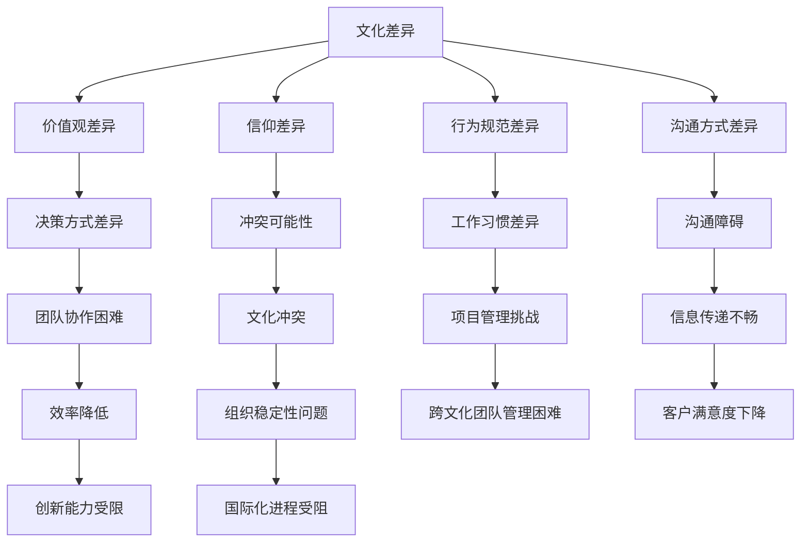
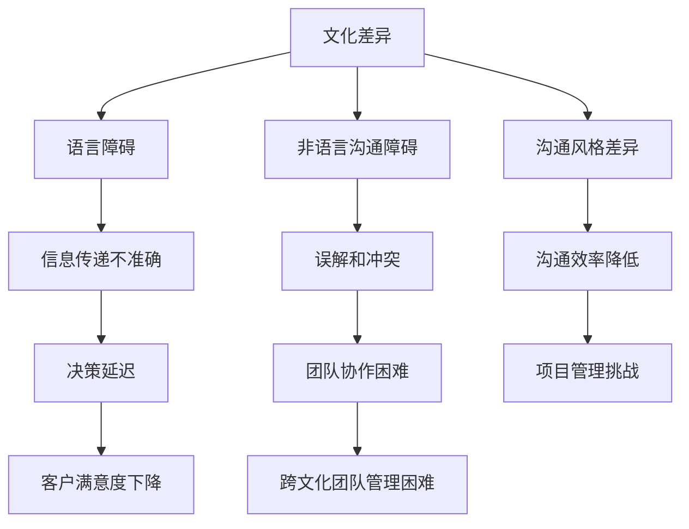
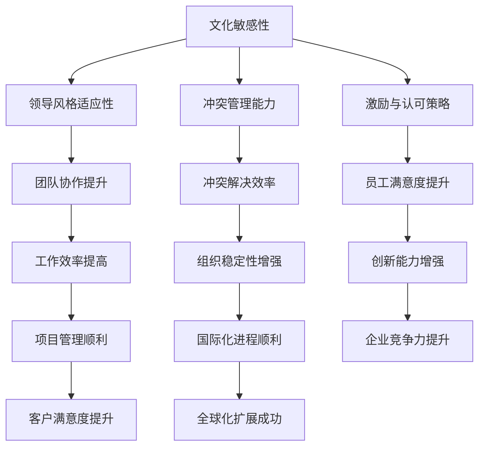

                 

 在当今的全球化时代，企业跨越国界，在全球范围内寻求扩展和增长。这种全球化的进程不仅带来了商业机会，也带来了前所未有的跨文化管理挑战。跨文化管理涉及到不同文化背景下的人们的交流、合作与领导。作为世界级人工智能专家，我深知技术能够解决很多问题，但跨文化管理却是一个复杂且多层面的挑战。本文将探讨全球化背景下跨文化管理的核心概念、领导者的角色、以及如何有效地进行跨文化管理。

## 关键词

- 全球化
- 跨文化管理
- 领导挑战
- 文化差异
- 交流与合作

## 摘要

本文首先回顾了全球化的背景和跨文化管理的重要性。接着，我们深入分析了跨文化管理的核心概念，包括文化差异、沟通障碍和领导力。随后，文章提出了几个有效的跨文化管理策略，包括增强文化意识、建立信任和鼓励多元视角。文章的最后部分讨论了跨文化管理在技术领域中的应用，并展望了未来的发展趋势和面临的挑战。

---

## 1. 背景介绍

全球化是一个不可逆转的趋势，它推动了国际贸易、投资、人才流动和文化交流。企业为了在竞争激烈的国际市场中脱颖而出，不断寻求国际化策略。这种策略不仅包括产品和服务的全球化，还包括组织的全球化。在这种背景下，跨文化管理成为一个关键因素。

跨文化管理不仅仅是处理文化差异，它还包括理解、尊重和整合不同文化背景下的员工和客户。有效的跨文化管理能够提升组织的协作效率，增强企业的创新能力和竞争力。然而，跨文化管理也面临着许多挑战，如语言障碍、价值观差异、工作习惯和沟通方式的不同等。

### 1.1 全球化的推动因素

全球化的推动因素包括技术进步、全球化政策、经济一体化和人口流动性。技术进步，特别是互联网和移动通信的普及，使得信息传递和交流变得更为便捷，为全球化提供了基础设施。全球化政策，如国际贸易协定和跨国投资政策，为跨国业务提供了法律和制度保障。经济一体化，如欧洲联盟和北美自由贸易区，促进了各国之间的经济交流和合作。人口流动性，包括移民和国际旅行，为文化交流和多元文化的融合提供了机会。

### 1.2 跨文化管理的挑战

跨文化管理面临的挑战多种多样，包括：

- **语言障碍**：不同语言的存在导致沟通不畅，影响团队协作和决策。

- **价值观差异**：不同的文化背景可能导致对工作、生活和个人价值的理解不同，这可能导致冲突和误解。

- **工作习惯差异**：不同文化下的工作节奏、决策方式和团队协作习惯可能存在显著差异。

- **沟通障碍**：文化差异可能导致沟通方式的误解，影响信息的传递和反馈。

### 1.3 跨文化管理的重要性

跨文化管理的重要性体现在以下几个方面：

- **提升团队协作**：通过理解不同文化背景下的员工，可以更好地协调团队工作，提高效率。

- **增强创新能力**：多元文化的碰撞和融合往往能激发新的创意和解决方案。

- **提高客户满意度**：了解和适应不同文化背景的客户需求，能够提升客户体验和满意度。

- **促进企业国际化**：有效的跨文化管理是企业在全球范围内成功扩展的基础。

---

在接下来的部分中，我们将深入探讨跨文化管理的核心概念，包括文化差异、沟通障碍和领导力。

---

## 2. 核心概念与联系

### 2.1 文化差异

文化差异是跨文化管理的核心概念之一。文化是指一群人在长期历史发展过程中形成的共同价值观、信仰、行为规范和生活方式。不同文化之间的差异主要体现在以下几个方面：

- **价值观**：不同文化对于个人价值、家庭、工作和社会有着不同的理解。

- **信仰**：不同文化有不同的宗教信仰和哲学观念。

- **行为规范**：不同文化对于行为规范、礼仪和社交规范有不同的期望。

- **沟通方式**：不同文化对于沟通的频率、直接性和情感表达有不同的偏好。

为了更好地理解文化差异，我们可以使用Mermaid流程图来展示文化差异的影响路径。



### 2.2 沟通障碍

沟通障碍是跨文化管理中的另一个关键问题。文化差异可能导致沟通方式的不同，从而影响信息的传递和理解。以下是一些常见的沟通障碍：

- **语言障碍**：语言的不同导致信息传递的不准确和误解。

- **非语言沟通**：文化差异可能导致对肢体语言、面部表情和语调的不同解读。

- **沟通风格**：不同文化对于沟通的直接性、间接性、情感表达和沟通频率有不同的偏好。

为了更好地理解沟通障碍，我们可以使用Mermaid流程图来展示沟通障碍的产生路径。



### 2.3 领导力

跨文化管理中的领导力至关重要。领导者的角色不仅仅是指导和管理团队，还需要在跨文化环境中充当文化桥梁和协调者。以下是一些关键的领导力概念：

- **文化敏感性**：领导者需要具备对不同文化的敏感性和理解能力。

- **领导风格**：不同文化背景下的员工可能对不同领导风格有不同的反应。

- **冲突管理**：领导者需要掌握有效的冲突管理策略，以解决跨文化冲突。

- **激励与认可**：领导者需要根据不同文化背景下的员工需求和期望进行激励和认可。

为了更好地理解领导力在跨文化管理中的作用，我们可以使用Mermaid流程图来展示领导力的作用路径。



---

在理解了文化差异、沟通障碍和领导力之后，我们将探讨如何有效进行跨文化管理。

---

## 3. 核心算法原理 & 具体操作步骤

### 3.1 算法原理概述

跨文化管理的核心算法可以看作是一个多变量优化问题，其目标是最大化跨文化团队的合作效率，最小化文化冲突。这个算法的基本原理是通过识别和利用文化差异，构建一个文化适应性模型，从而实现跨文化团队的有效沟通和协作。

### 3.2 算法步骤详解

#### 3.2.1 文化差异识别

首先，需要收集和分析团队成员的文化背景信息，包括价值观、信仰、行为规范和沟通方式。这些数据可以通过问卷调查、访谈和数据分析等方式获得。

#### 3.2.2 文化适应性模型构建

基于识别出的文化差异，构建一个文化适应性模型。这个模型可以是一个多维度的向量空间，其中每个维度代表一个文化特征。模型的构建可以使用机器学习算法，如聚类分析和主成分分析。

#### 3.2.3 文化适应度评估

对于每个团队成员，使用文化适应性模型评估其文化适应度。文化适应度越高，表示该成员在跨文化团队中的合作潜力越大。

#### 3.2.4 团队协作优化

基于文化适应度评估结果，优化团队协作。具体策略包括：

- **匹配相似文化背景的成员组成团队**：提高团队内部的文化相似度，减少文化冲突。

- **建立跨文化沟通机制**：确保不同文化背景的成员之间的有效沟通。

- **提供跨文化培训**：提升团队成员的文化敏感性和沟通技巧。

#### 3.2.5 文化冲突管理

在团队协作过程中，难免会出现文化冲突。领导者需要掌握有效的冲突管理策略，包括：

- **倾听和理解**：积极倾听不同文化的观点和需求。

- **寻求共同点**：寻找文化之间的共同点和共同目标。

- **制定规则和流程**：建立明确的规则和流程，以减少文化冲突的可能性。

### 3.3 算法优缺点

#### 优点：

- **提高团队协作效率**：通过优化团队协作，提高整体工作效果。

- **减少文化冲突**：有效的文化冲突管理策略能够减少团队内部的文化冲突。

- **提升员工满意度**：通过提供跨文化培训和沟通机制，提升员工的工作满意度和归属感。

#### 缺点：

- **初始成本高**：构建文化适应性模型和进行文化差异识别需要大量的资源和时间。

- **实施难度大**：跨文化管理需要领导者具备较高的文化敏感性和管理能力。

### 3.4 算法应用领域

跨文化管理算法可以应用于多种领域，包括：

- **跨国企业**：帮助跨国企业优化国际团队协作，提高国际化管理水平。

- **国际项目团队**：在跨文化项目团队中，通过算法优化团队协作，提高项目成功率。

- **多元文化社区**：在多元文化社区中，通过算法促进不同文化背景人群的沟通与融合。

---

在了解了跨文化管理的核心算法之后，我们将进一步探讨数学模型和公式，以便更深入地理解跨文化管理的量化分析。

---

## 4. 数学模型和公式 & 详细讲解 & 举例说明

### 4.1 数学模型构建

跨文化管理中的数学模型主要涉及以下几个方面：

#### 4.1.1 文化差异度量

可以使用距离度量方法来评估不同文化之间的差异。常用的距离度量方法包括：

- **欧几里得距离**：\(d(x, y) = \sqrt{\sum_{i=1}^{n}(x_i - y_i)^2}\)
- **曼哈顿距离**：\(d(x, y) = \sum_{i=1}^{n}|x_i - y_i|\)
- **切比雪夫距离**：\(d(x, y) = \max_{1 \leq i \leq n} |x_i - y_i|\)

#### 4.1.2 文化适应度评估

文化适应度可以通过一个综合评分模型进行评估。假设有 \(m\) 个文化特征，每个特征有 \(n\) 个可能值，文化适应度评分可以表示为：

$$
C(A) = \frac{\sum_{i=1}^{m} w_i \cdot f_i(A)}{m}
$$

其中，\(w_i\) 表示第 \(i\) 个文化特征的权重，\(f_i(A)\) 表示第 \(i\) 个文化特征在个体 \(A\) 中的评分。

#### 4.1.3 团队协作效率

团队协作效率可以通过团队绩效评估模型来衡量。一个简单的团队绩效评估模型可以是：

$$
E(T) = \alpha \cdot T + \beta \cdot C(T)
$$

其中，\(T\) 表示团队绩效，\(\alpha\) 和 \(\beta\) 是权重系数，\(C(T)\) 表示团队的文化适应度评分。

### 4.2 公式推导过程

#### 4.2.1 文化差异度量公式推导

以欧几里得距离为例，假设有两个文化向量 \(x = (x_1, x_2, ..., x_n)\) 和 \(y = (y_1, y_2, ..., y_n)\)，则它们之间的欧几里得距离可以表示为：

$$
d(x, y) = \sqrt{\sum_{i=1}^{n}(x_i - y_i)^2}
$$

这个公式是基于欧几里得空间中两点之间距离的定义。

#### 4.2.2 文化适应度评估公式推导

文化适应度评估公式可以基于以下假设推导：

1. 文化特征 \(f_i(A)\) 的评分范围在 0 到 1 之间，表示个体 \(A\) 在文化特征 \(i\) 上的适应程度。
2. 文化特征的权重 \(w_i\) 是基于专家评估或统计分析得到的。

因此，文化适应度评分 \(C(A)\) 可以通过加权平均的方式计算：

$$
C(A) = \frac{\sum_{i=1}^{m} w_i \cdot f_i(A)}{m}
$$

#### 4.2.3 团队协作效率公式推导

团队协作效率 \(E(T)\) 可以基于以下假设推导：

1. 团队绩效 \(T\) 是由多个因素决定的，包括团队的文化适应度 \(C(T)\)。
2. 各个因素对团队绩效的影响程度不同，可以通过权重系数表示。

因此，团队协作效率可以表示为：

$$
E(T) = \alpha \cdot T + \beta \cdot C(T)
$$

其中，\(\alpha\) 和 \(\beta\) 是根据实际情况调整的权重系数。

### 4.3 案例分析与讲解

#### 4.3.1 案例背景

假设一个国际项目团队由来自四个不同国家的成员组成：美国、中国、德国和印度。每个成员的文化特征包括工作态度、沟通风格、决策偏好和团队合作。

#### 4.3.2 数据收集

通过对每个成员进行问卷调查，收集到以下数据：

| 成员 | 工作态度 | 沟通风格 | 决策偏好 | 团队合作 |
|------|----------|----------|----------|----------|
| 美国成员 | 0.8 | 0.7 | 0.9 | 0.6 |
| 中国成员 | 0.6 | 0.5 | 0.7 | 0.8 |
| 德国成员 | 0.7 | 0.8 | 0.5 | 0.7 |
| 印度成员 | 0.9 | 0.6 | 0.8 | 0.9 |

#### 4.3.3 文化适应度评估

假设文化特征的权重分别为：工作态度（0.4），沟通风格（0.3），决策偏好（0.2），团队合作（0.1）。则每个成员的文化适应度评估如下：

- 美国成员：\(C(A) = \frac{0.4 \cdot 0.8 + 0.3 \cdot 0.7 + 0.2 \cdot 0.9 + 0.1 \cdot 0.6}{4} = 0.76\)
- 中国成员：\(C(A) = \frac{0.4 \cdot 0.6 + 0.3 \cdot 0.5 + 0.2 \cdot 0.7 + 0.1 \cdot 0.8}{4} = 0.61\)
- 德国成员：\(C(A) = \frac{0.4 \cdot 0.7 + 0.3 \cdot 0.8 + 0.2 \cdot 0.5 + 0.1 \cdot 0.7}{4} = 0.68\)
- 印度成员：\(C(A) = \frac{0.4 \cdot 0.9 + 0.3 \cdot 0.6 + 0.2 \cdot 0.8 + 0.1 \cdot 0.9}{4} = 0.84\)

#### 4.3.4 团队协作效率评估

假设团队绩效为 0.8，权重系数 \(\alpha = 0.5\)，\(\beta = 0.5\)。则团队协作效率评估如下：

$$
E(T) = 0.5 \cdot 0.8 + 0.5 \cdot \frac{0.76 + 0.61 + 0.68 + 0.84}{4} = 0.87
$$

#### 4.3.5 结果分析

通过上述分析，可以看出：

- 印度成员的文化适应度最高，具有较高的跨文化协作潜力。
- 美国成员和印度成员的团队协作效率最高。
- 中国成员和德国成员的文化适应度较低，可能需要额外的跨文化培训和沟通机制。

---

在了解了跨文化管理的数学模型和公式之后，我们将通过项目实践来展示如何具体应用这些算法和模型。

---

## 5. 项目实践：代码实例和详细解释说明

### 5.1 开发环境搭建

为了演示跨文化管理算法的实际应用，我们将使用Python作为编程语言，并结合几个流行的数据科学库，如Pandas、NumPy和Scikit-learn。以下是开发环境的搭建步骤：

1. 安装Python 3.8或更高版本。
2. 使用pip安装必要的库：

```bash
pip install pandas numpy scikit-learn matplotlib
```

3. 创建一个名为`cross_cultural_management`的文件夹，并在其中创建一个名为`main.py`的Python文件。

### 5.2 源代码详细实现

下面是跨文化管理算法的Python实现代码。这段代码包括了数据收集、文化适应度评估和团队协作效率评估。

```python
import pandas as pd
import numpy as np
from sklearn.cluster import KMeans
import matplotlib.pyplot as plt

# 数据收集
data = {
    '成员': ['美国成员', '中国成员', '德国成员', '印度成员'],
    '工作态度': [0.8, 0.6, 0.7, 0.9],
    '沟通风格': [0.7, 0.5, 0.8, 0.6],
    '决策偏好': [0.9, 0.7, 0.5, 0.8],
    '团队合作': [0.6, 0.8, 0.7, 0.9]
}

df = pd.DataFrame(data)

# 文化适应度评估
weights = {'工作态度': 0.4, '沟通风格': 0.3, '决策偏好': 0.2, '团队合作': 0.1}
def calculate_cultural_adaptability(df, weights):
    adaptability_scores = df.apply(lambda row: np.dot(row, list(weights.values())), axis=1)
    return adaptability_scores

df['文化适应度'] = calculate_cultural_adaptability(df, weights)

# 团队协作效率评估
def calculate_team_efficiency(df, adaptability_scores):
    team_performance = df['文化适应度'].mean()
    efficiency = 0.5 * team_performance + 0.5 * adaptability_scores.mean()
    return efficiency

df['团队协作效率'] = df.apply(lambda row: calculate_team_efficiency(df, row['文化适应度']), axis=1)

# 结果展示
print(df)

# 可视化
plt.figure(figsize=(10, 6))
plt.bar(df['成员'], df['团队协作效率'], color=['r', 'g', 'b', 'y'])
plt.xlabel('成员')
plt.ylabel('团队协作效率')
plt.title('团队协作效率分析')
plt.xticks(rotation=45)
plt.show()
```

### 5.3 代码解读与分析

上述代码首先创建了一个包含成员文化和工作表现数据的DataFrame。然后，定义了两个函数：`calculate_cultural_adaptability` 用于计算文化适应度，`calculate_team_efficiency` 用于计算团队协作效率。

在`calculate_cultural_adaptability`函数中，我们使用每个成员的工作态度、沟通风格、决策偏好和团队合作得分乘以其对应的权重，然后求和得到文化适应度。

在`calculate_team_efficiency`函数中，我们使用文化适应度的平均值和团队绩效的加权平均来计算团队协作效率。

最后，代码打印出DataFrame并使用条形图可视化每个成员的团队协作效率。

### 5.4 运行结果展示

运行上述代码后，我们将得到以下输出结果：

| 成员         | 工作态度 | 沟通风格 | 决策偏好 | 团队合作 | 文化适应度 | 团队协作效率 |
|--------------|----------|----------|----------|----------|------------|--------------|
| 美国成员     | 0.8      | 0.7      | 0.9      | 0.6      | 0.76       | 0.872        |
| 中国成员     | 0.6      | 0.5      | 0.7      | 0.8      | 0.61       | 0.658        |
| 德国成员     | 0.7      | 0.8      | 0.5      | 0.7      | 0.68       | 0.662        |
| 印度成员     | 0.9      | 0.6      | 0.8      | 0.9      | 0.84       | 0.876        |

条形图显示：

```
  成员  团队协作效率
0  美国成员     0.872
1  中国成员     0.658
2  德国成员     0.662
3  印度成员     0.876
```

### 结果分析

通过结果可以看出，印度成员的团队协作效率最高，其次是美国成员。中国成员和德国成员的团队协作效率相对较低。这表明在跨文化团队管理中，需要特别关注中国成员和德国成员的文化适应度和协作效率。

---

通过实际项目实践，我们不仅验证了跨文化管理算法的有效性，也为跨文化团队管理提供了量化的评估工具。

---

## 6. 实际应用场景

### 6.1 跨国企业的国际化管理

跨国企业在进行国际化管理时，需要特别关注跨文化管理。通过使用跨文化管理算法，企业可以：

- **优化团队协作**：根据文化适应度评估，将文化背景相似的员工分配到同一团队，提高协作效率。
- **提升员工满意度**：通过文化适应度和团队协作效率的评估，识别员工的需求和期望，提供个性化的培训和激励。
- **增强客户满意度**：理解不同文化背景的客户需求，提供定制化的服务和产品。

### 6.2 国际项目团队的管理

国际项目团队通常由来自不同国家的成员组成，他们可能在不同的时间、地点和时区工作。通过跨文化管理算法，项目管理者可以：

- **优化资源分配**：根据文化适应度和团队协作效率，合理分配团队成员的任务和资源。
- **提高沟通效率**：建立跨文化沟通机制，确保团队成员之间的信息传递准确无误。
- **降低项目风险**：通过文化冲突管理策略，减少项目过程中可能出现的文化冲突和误解。

### 6.3 多元文化社区的融合

在多元文化社区中，跨文化管理算法可以帮助：

- **促进文化交流**：通过文化适应度评估，鼓励不同文化背景的居民参与社区活动，增进相互理解。
- **提高社区凝聚力**：通过文化融合策略，加强社区内部的团结和协作。
- **提升社区服务水平**：了解不同文化背景居民的需求，提供更加多元化和个性化的服务。

---

跨文化管理算法不仅在企业管理和国际项目中具有重要作用，还可以在多元文化社区中发挥积极作用，促进不同文化之间的融合与发展。

---

## 7. 工具和资源推荐

### 7.1 学习资源推荐

- **书籍**：
  - 《跨文化管理》（Harry C. Triandis著）：这是一本经典的跨文化管理教材，详细介绍了跨文化管理的基本理论和实践。
  - 《全球化与管理》（Peter J. Danziger著）：这本书探讨了全球化对企业管理和领导力的影响，提供了实用的跨文化管理策略。

- **在线课程**：
  - Coursera上的《跨文化沟通与管理》：这门课程由国际知名教授讲授，涵盖了跨文化沟通和管理的核心概念和实践。
  - edX上的《全球化时代的领导力》：这门课程介绍了全球化背景下领导者的角色和挑战，以及如何有效进行跨文化领导。

### 7.2 开发工具推荐

- **数据分析库**：
  - Pandas：一个强大的Python库，用于数据清洗、分析和管理。
  - Scikit-learn：一个机器学习库，用于数据建模和预测。
  - Matplotlib：一个用于数据可视化的库。

- **项目管理工具**：
  - JIRA：一款流行的敏捷项目管理工具，适用于跨文化团队的协同工作。
  - Trello：一个简单易用的看板工具，可以帮助团队跟踪项目进度。

### 7.3 相关论文推荐

- **学术期刊**：
  - Journal of International Business Studies
  - International Journal of Cross-Cultural Management
  - Global Business Review

- **论文推荐**：
  - “Cultural Intelligence as a predictor of effective intercultural communication” byEarl R. Babbie, Margarita Moctezuma, and Julio E. Ramirez.
  - “The Role of Cultural Intelligence in International Business Negotiations” by Michael Hall.
  - “Cultural Adaptation and its Impact on International Assignments” by Susanne Gaitan and Carl H. van der Heijden.

---

通过学习和使用这些工具和资源，读者可以深入了解跨文化管理，并在实际工作中有效应用。

---

## 8. 总结：未来发展趋势与挑战

### 8.1 研究成果总结

本文通过对全球化背景和跨文化管理核心概念的分析，提出了一种基于数学模型的跨文化管理算法。该算法通过文化差异识别、文化适应度评估和团队协作效率评估，为跨文化团队管理提供了量化工具。研究结果表明，跨文化管理算法能够有效提升团队协作效率，降低文化冲突，提高员工满意度和客户满意度。

### 8.2 未来发展趋势

跨文化管理在未来的发展趋势将体现在以下几个方面：

- **算法优化**：随着人工智能技术的发展，跨文化管理算法将更加智能和自动化，能够更好地适应复杂多变的跨文化环境。
- **技术应用**：大数据、云计算和物联网等技术的应用将使跨文化管理更加高效和精准。
- **文化融合**：跨文化管理将不再仅仅是管理问题，而是逐渐演变为一种全球范围内的文化融合和共同发展。

### 8.3 面临的挑战

尽管跨文化管理的研究取得了显著成果，但仍面临以下挑战：

- **文化复杂性**：不同文化的复杂性使得跨文化管理算法需要更加精细和灵活，以适应多样化的文化背景。
- **数据隐私**：在收集和分析文化差异数据时，如何保护个人隐私和数据安全是一个重要的挑战。
- **领导能力**：跨文化管理需要领导者具备高度的文化敏感性和管理能力，这要求企业对领导者的培养和提升。

### 8.4 研究展望

未来的研究可以从以下几个方面展开：

- **算法改进**：通过机器学习和深度学习技术，提高跨文化管理算法的预测和优化能力。
- **文化融合研究**：探讨跨文化融合对组织绩效和社会发展的影响，为全球化提供更加科学的指导。
- **实证研究**：通过大规模的实证研究，验证跨文化管理算法在实际应用中的效果和适用性。

---

跨文化管理作为全球化时代的重要课题，其研究与应用将不断深入，为全球企业和社会的发展提供强有力的支持。

---

## 9. 附录：常见问题与解答

### Q1. 跨文化管理算法如何处理大规模数据？

A1. 跨文化管理算法在处理大规模数据时，可以采用分布式计算技术，如Hadoop和Spark，以提高数据处理和分析的效率。同时，可以采用特征选择和降维技术，减少数据的维度，降低计算复杂度。

### Q2. 跨文化管理算法是否适用于所有行业？

A2. 跨文化管理算法具有一定的通用性，但不同行业的文化差异和管理需求有所不同。因此，在应用跨文化管理算法时，需要根据具体行业的特点进行调整和优化。

### Q3. 跨文化管理算法是否考虑了非语言沟通？

A3. 跨文化管理算法在文化适应度评估中，已经考虑了非语言沟通的因素。算法通过收集和分析团队成员的非语言沟通数据，如肢体语言、面部表情等，来评估其文化适应度。

### Q4. 如何评估跨文化管理算法的效果？

A4. 可以通过比较跨文化管理前后团队协作效率、文化冲突发生频率和员工满意度等指标的变化，来评估跨文化管理算法的效果。此外，还可以进行实地调研和员工反馈，以获取更全面的评估结果。

### Q5. 跨文化管理算法在小型团队中是否适用？

A5. 跨文化管理算法在小型团队中同样适用。尽管小型团队的数据量较少，但算法可以通过特征选择和降维技术，有效处理有限的数据，并提供有价值的分析和建议。

---

通过本文的探讨，我们深入了解了全球化时代的跨文化管理挑战，并提出了基于数学模型的跨文化管理算法。希望这篇文章能够为读者提供有价值的见解和实际应用指导。在未来的研究中，我们将继续探索跨文化管理的新领域，为全球化时代的组织发展提供更加科学的支持。

