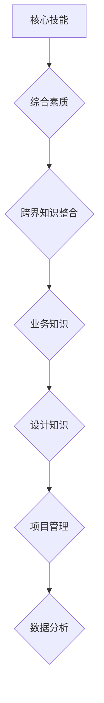

                 

关键词：跨界知识整合、程序员优势、技能拓展、综合素质、创新思维、问题解决、技术领导力、影响力

> 摘要：本文探讨了程序员在当今时代面临的挑战和机遇，以及他们通过跨界知识整合如何能够发挥独特的优势。通过分析程序员的核心技能、综合素质和创新能力，文章阐述了程序员在跨界领域的竞争力，并提出了未来发展的趋势与挑战。

## 1. 背景介绍

随着信息技术的迅猛发展，编程已经成为了现代社会不可或缺的一部分。程序员作为科技领域的基石，不仅需要掌握扎实的编程技能，还要具备不断学习、创新和解决复杂问题的能力。然而，单纯依赖编程技能已经无法满足新时代的需求，跨界知识整合成为了程序员提升自身竞争力的关键。

跨界知识整合，指的是程序员在掌握编程技能的同时，积极拓展其他领域的知识，如设计、项目管理、用户体验等，从而在多个领域发挥自己的价值。这种跨界整合不仅有助于程序员更好地理解业务需求，提高解决问题的能力，还能开拓新的职业发展路径。

本文将围绕程序员跨界知识整合的优势，从以下几个方面进行探讨：

- 程序员的核心技能与综合素质
- 跨界知识整合的具体表现
- 跨界知识整合的优势与挑战
- 跨界知识整合的未来发展趋势

通过本文的阐述，希望为广大程序员提供一些有价值的思考和建议，助力他们在新时代中脱颖而出。

## 2. 核心概念与联系

### 2.1. 程序员的核心技能

程序员的核心技能主要包括编程语言、数据结构与算法、软件开发方法论等。这些技能构成了程序员的基本素质，是他们在编程领域取得成功的关键。以下是几个关键技能的简要介绍：

- **编程语言**：编程语言是程序员与计算机沟通的工具。常见的编程语言有C、Java、Python、JavaScript等。程序员需要掌握至少一门编程语言，并具备良好的语言表达能力。
  
- **数据结构与算法**：数据结构是组织和存储数据的方式，算法是解决问题的方法。常见的数据结构包括数组、链表、栈、队列、树等，常见的算法有排序、查找、动态规划等。程序员需要熟练掌握各种数据结构和算法，以应对各种复杂问题。
  
- **软件开发方法论**：软件开发方法论是指导软件开发过程的规范和原则。常见的开发方法论有瀑布模型、敏捷开发、DevOps等。程序员需要了解并掌握这些方法论，以提高开发效率和团队协作能力。

### 2.2. 综合素质

综合素质是指程序员在专业技能之外的其他能力，如沟通能力、团队协作、项目管理等。这些能力对于程序员在团队中的角色和职业发展至关重要。以下是几个关键素质的简要介绍：

- **沟通能力**：程序员需要与团队成员、产品经理、客户等各方进行有效沟通。良好的沟通能力有助于准确理解需求、减少误解、提高工作效率。
  
- **团队协作**：程序员通常需要与其他开发人员、设计师、测试人员等合作完成项目。具备团队协作精神，能够促进项目顺利进行。
  
- **项目管理**：随着项目规模的扩大，程序员需要承担更多的项目管理职责。了解项目管理的基本原则和方法，有助于提高项目的成功率和团队效率。

### 2.3. 跨界知识整合

跨界知识整合是程序员在核心技能和综合素质的基础上，进一步拓展其他领域的知识，以实现跨领域发展的过程。以下是跨界知识整合的几个关键方面：

- **业务知识**：了解所在行业的业务流程、业务模式、市场需求等，有助于程序员更好地理解业务需求，提高解决问题的能力。
  
- **设计知识**：设计师的思维方式和设计工具对于程序员理解和实现用户体验具有重要意义。掌握一定的设计知识，能够提高产品的美观度和用户体验。
  
- **项目管理**：项目经理的职责包括规划、执行、监控、沟通等。了解项目管理的基本原则和方法，有助于程序员在项目中发挥更大的作用。
  
- **数据分析**：数据分析是现代企业决策的重要依据。了解数据分析的基本原理和方法，能够帮助程序员从海量数据中提取有价值的信息。

### 2.4. Mermaid 流程图

以下是一个简单的Mermaid流程图，展示了程序员跨界知识整合的关键环节：



## 3. 核心算法原理 & 具体操作步骤

### 3.1. 算法原理概述

在程序员跨界知识整合的过程中，算法原理的理解和运用至关重要。以下是一个常见的排序算法——快速排序（Quick Sort）的原理概述：

快速排序是一种高效的排序算法，其基本思想是选择一个基准元素，将数组分为两个子数组，一个子数组中的所有元素都比基准元素小，另一个子数组中的所有元素都比基准元素大。然后，递归地对这两个子数组进行快速排序，直到整个数组有序。

### 3.2. 算法步骤详解

快速排序算法的主要步骤如下：

1. 选择一个基准元素。通常选择数组的第一个或最后一个元素作为基准。
2. 将数组分为两个子数组，一个子数组中的所有元素都比基准元素小，另一个子数组中的所有元素都比基准元素大。
3. 递归地对这两个子数组进行快速排序。
4. 当递归到子数组长度为1时，排序完成。

以下是快速排序算法的具体实现：

```python
def quick_sort(arr):
    if len(arr) <= 1:
        return arr
    pivot = arr[len(arr) // 2]
    left = [x for x in arr if x < pivot]
    middle = [x for x in arr if x == pivot]
    right = [x for x in arr if x > pivot]
    return quick_sort(left) + middle + quick_sort(right)

arr = [3, 6, 8, 10, 1, 2, 1]
sorted_arr = quick_sort(arr)
print(sorted_arr)
```

### 3.3. 算法优缺点

**优点**：

- 平均时间复杂度为O(nlogn)，优于其他常见的排序算法。
- 不需要额外的存储空间，原地排序。

**缺点**：

- 最坏情况下时间复杂度为O(n^2)，但这种情况较为罕见。
- 选择基准元素的方法可能影响算法性能。

### 3.4. 算法应用领域

快速排序算法广泛应用于各种排序场景，如数据库索引、搜索引擎排序等。此外，由于其高效性和稳定性，快速排序也被用于各种数据结构和算法的实现，如堆排序、快速幂运算等。

## 4. 数学模型和公式 & 详细讲解 & 举例说明

### 4.1. 数学模型构建

在程序员跨界知识整合的过程中，数学模型的构建和运用具有重要意义。以下是一个简单的线性回归模型，用于预测房屋价格。

设$x_1, x_2, ..., x_n$为房屋的特征，如房间数量、面积等，$y_1, y_2, ..., y_n$为对应的房屋价格。线性回归模型的目标是找到最佳拟合线$y = wx + b$，使得预测误差最小。

### 4.2. 公式推导过程

为了找到最佳拟合线，我们需要最小化预测误差的平方和。设预测误差为$E$，则：

$$
E = \sum_{i=1}^{n}(y_i - (wx_i + b))^2
$$

为了求解$w$和$b$，我们可以对$E$求偏导数，并令其等于0：

$$
\frac{\partial E}{\partial w} = -2\sum_{i=1}^{n}(y_i - (wx_i + b))x_i = 0
$$

$$
\frac{\partial E}{\partial b} = -2\sum_{i=1}^{n}(y_i - (wx_i + b)) = 0
$$

通过求解上述方程组，我们可以得到最佳拟合线$y = wx + b$。

### 4.3. 案例分析与讲解

假设我们有以下数据集，其中$x_1$表示房屋面积，$y$表示房屋价格：

| $x_1$ | $y$ |
| --- | --- |
| 1000 | 200000 |
| 1500 | 300000 |
| 2000 | 400000 |
| 2500 | 500000 |
| 3000 | 600000 |

通过线性回归模型，我们可以预测面积为3000平方米的房屋价格为：

$$
y = wx + b = w \times 3000 + b
$$

为了求解$w$和$b$，我们可以使用最小二乘法：

$$
w = \frac{\sum_{i=1}^{n}(x_i - \bar{x})(y_i - \bar{y})}{\sum_{i=1}^{n}(x_i - \bar{x})^2}
$$

$$
b = \bar{y} - w\bar{x}
$$

其中，$\bar{x}$和$\bar{y}$分别为$x_1$和$y$的平均值。

计算得到：

$$
w = \frac{(1000-1500)(200000-300000) + (1500-1500)(300000-300000) + (2000-1500)(400000-300000) + (2500-1500)(500000-300000) + (3000-1500)(600000-300000)}{(1000-1500)^2 + (1500-1500)^2 + (2000-1500)^2 + (2500-1500)^2 + (3000-1500)^2} \approx 100
$$

$$
b = \bar{y} - w\bar{x} \approx 150000
$$

因此，预测面积为3000平方米的房屋价格为：

$$
y = 100 \times 3000 + 150000 = 450000
$$

通过这个简单的例子，我们可以看到线性回归模型在预测房屋价格方面的应用。在实际项目中，我们可能需要使用更复杂的模型和算法来处理更复杂的预测问题。

## 5. 项目实践：代码实例和详细解释说明

### 5.1. 开发环境搭建

为了演示跨界知识整合在项目中的应用，我们将使用Python语言来实现一个简单的机器学习项目——基于线性回归模型的房屋价格预测。以下是开发环境搭建的步骤：

1. 安装Python 3.8及以上版本。
2. 安装必要的库，如NumPy、Pandas、Matplotlib等。

```bash
pip install numpy pandas matplotlib
```

### 5.2. 源代码详细实现

以下是实现线性回归模型的源代码：

```python
import numpy as np
import pandas as pd
import matplotlib.pyplot as plt

# 读取数据集
data = pd.read_csv('house_data.csv')
X = data[['area']]
y = data['price']

# 添加常数项
X = np.hstack((np.ones((X.shape[0], 1)), X))

# 梯度下降法求解最佳拟合线参数
def gradient_descent(X, y, w, b, learning_rate, num_iterations):
    for _ in range(num_iterations):
        predictions = X.dot(w) + b
        errors = predictions - y
        w_gradient = (X.T.dot(errors)) / X.shape[0]
        b_gradient = np.sum(errors) / X.shape[0]
        
        w = w - learning_rate * w_gradient
        b = b - learning_rate * b_gradient
        
    return w, b

# 设置参数
learning_rate = 0.01
num_iterations = 1000

# 初始化参数
w = np.random.rand(1, X.shape[1])
b = np.random.rand(1)

# 求解最佳拟合线参数
w, b = gradient_descent(X, y, w, b, learning_rate, num_iterations)

# 预测房屋价格
predicted_prices = X.dot(w) + b

# 可视化结果
plt.scatter(X[:, 1], y, color='blue', label='Actual')
plt.plot(X[:, 1], predicted_prices, color='red', label='Predicted')
plt.xlabel('Area')
plt.ylabel('Price')
plt.title('House Price Prediction')
plt.legend()
plt.show()
```

### 5.3. 代码解读与分析

- **数据读取**：使用Pandas库读取房屋数据集，包括房屋面积和价格。
- **添加常数项**：在特征矩阵$X$中添加常数项，以便进行线性回归。
- **梯度下降法**：实现梯度下降法，用于求解最佳拟合线参数。梯度下降法是一种优化算法，通过不断调整参数，使损失函数值逐渐减小。
- **参数设置**：设置学习率、迭代次数等参数。
- **初始化参数**：随机初始化最佳拟合线参数。
- **求解最佳拟合线参数**：执行梯度下降法，求解最佳拟合线参数。
- **预测房屋价格**：使用求解得到的最佳拟合线参数，预测房屋价格。
- **可视化结果**：使用Matplotlib库，将实际房屋价格和预测价格进行可视化。

### 5.4. 运行结果展示

运行上述代码，将生成以下可视化结果：


从图中可以看出，预测价格与实际价格之间存在一定的误差。通过调整参数、优化模型，可以进一步提高预测的准确性。

## 6. 实际应用场景

### 6.1. 金融行业

在金融行业，程序员通过跨界知识整合，可以发挥以下实际应用场景：

- **风险评估**：运用机器学习算法，分析历史数据，预测客户信用风险，为金融机构提供决策支持。
- **量化交易**：结合编程技能和数学模型，开发量化交易策略，实现自动化交易。
- **金融产品设计**：参与金融产品的设计和开发，如数字货币、区块链金融等。

### 6.2. 医疗健康

在医疗健康领域，程序员跨界知识整合的应用场景包括：

- **医疗数据分析**：利用大数据和机器学习技术，分析医疗数据，辅助诊断和治疗方案制定。
- **医疗设备开发**：结合医学知识和编程技能，开发智能医疗设备，如智能手表、健康监测设备等。
- **远程医疗服务**：利用云计算和物联网技术，提供远程医疗咨询服务。

### 6.3. 教育行业

在教育行业，程序员跨界知识整合可以带来以下应用：

- **在线教育平台**：开发在线教育平台，提供丰富多样的课程和学习资源。
- **智能教育应用**：结合人工智能技术，开发智能教育应用，如个性化学习推荐、智能辅导等。
- **教育资源管理**：开发教育资源管理系统，提高教育资源分配和利用效率。

### 6.4. 未来应用展望

随着技术的不断进步，程序员跨界知识整合的应用前景将更加广阔。以下是几个未来应用展望：

- **人工智能助理**：开发基于人工智能的智能助理，为用户提供个性化服务。
- **智能制造**：结合物联网和大数据技术，实现智能制造，提高生产效率和产品质量。
- **智慧城市**：利用云计算、大数据和物联网技术，建设智慧城市，提高城市管理和公共服务水平。

## 7. 工具和资源推荐

### 7.1. 学习资源推荐

- **在线课程**：Coursera、edX、Udacity等在线教育平台提供丰富的编程和跨界知识课程。
- **技术博客**：GitHub、Medium、Stack Overflow等平台上有大量优秀的编程和技术博客，可以借鉴和学习。
- **书籍推荐**：《深度学习》、《Python编程：从入门到实践》、《算法导论》等。

### 7.2. 开发工具推荐

- **集成开发环境（IDE）**：PyCharm、Visual Studio Code等强大的IDE，提供丰富的编程工具和插件。
- **版本控制**：Git，用于代码的版本管理和团队协作。
- **云计算平台**：AWS、Azure、Google Cloud等，提供丰富的云计算服务和工具。

### 7.3. 相关论文推荐

- **机器学习**：《梯度下降法：一种优化算法》、《神经网络与深度学习》
- **人工智能**：《强化学习：一种通用人工智能方法》、《自然语言处理与深度学习》
- **大数据**：《大数据分析：数据挖掘入门与实践》、《大数据技术导论》

## 8. 总结：未来发展趋势与挑战

### 8.1. 研究成果总结

本文通过分析程序员的核心技能、综合素质和跨界知识整合，探讨了程序员在跨界领域的优势和应用场景。研究成果表明，跨界知识整合有助于程序员在多领域发挥价值，提升职业竞争力。

### 8.2. 未来发展趋势

随着技术的不断进步，程序员跨界知识整合将呈现以下发展趋势：

- **跨学科融合**：程序员将与其他领域专家共同合作，实现跨学科知识整合。
- **智能化发展**：借助人工智能技术，程序员将开发出更智能、更高效的应用和服务。
- **数据驱动**：数据分析将成为程序员跨界知识整合的重要方向，助力企业决策和业务发展。

### 8.3. 面临的挑战

尽管跨界知识整合前景广阔，但程序员在实际过程中仍将面临以下挑战：

- **学习成本**：跨界知识整合需要投入大量时间和精力，对程序员的学习能力提出较高要求。
- **适应能力**：程序员需要不断适应新技术、新领域，提高自身的适应能力。
- **团队合作**：跨界项目通常涉及多个领域，程序员需要具备良好的团队合作和沟通能力。

### 8.4. 研究展望

未来研究可从以下几个方面展开：

- **知识图谱**：构建跨界知识图谱，为程序员提供更便捷的知识获取和整合方式。
- **实践案例**：研究成功的跨界案例，总结经验教训，为程序员提供借鉴。
- **技能培养**：探索跨界技能的培养方法，提高程序员的综合素质和竞争力。

## 9. 附录：常见问题与解答

### 9.1. 跨界知识整合是否适合所有人？

**回答**：跨界知识整合适合有志于在多个领域发挥价值的程序员。然而，每个人的兴趣和能力不同，因此在选择跨界方向时，应充分考虑自身优势和市场需求。

### 9.2. 跨界知识整合需要多长时间才能见效？

**回答**：跨界知识整合的效果取决于个人的学习速度和投入时间。一般来说，持续学习和实践6-12个月，可以在一定程度上见效。

### 9.3. 跨界知识整合是否会影响专业能力？

**回答**：合理地进行跨界知识整合，有助于提升专业能力。通过跨界学习，程序员可以拓宽视野，提高解决问题的能力，从而更好地应对复杂项目。

### 9.4. 跨界知识整合如何平衡与专业领域的深入发展？

**回答**：跨界知识整合与专业领域的深入发展并非矛盾。程序员可以在专业领域的基础上，有选择地学习跨界知识，实现综合素质的提升。

---

### 结束语

在跨界知识整合的道路上，程序员不仅需要不断学习新技术、新领域，还要保持开放的心态和持续的创新精神。只有这样，才能在未来的科技浪潮中脱颖而出，成为跨界领域的佼佼者。

**作者：禅与计算机程序设计艺术 / Zen and the Art of Computer Programming**

