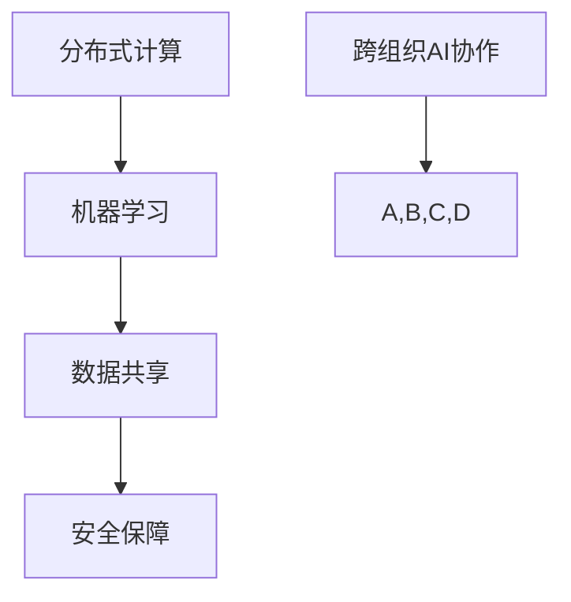
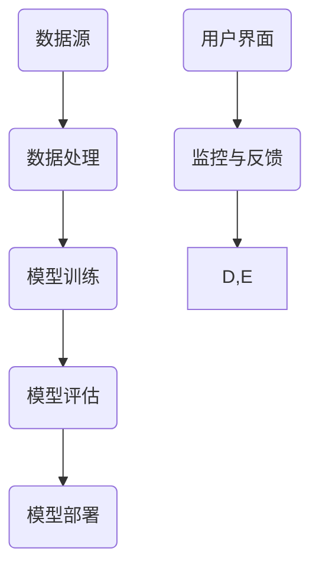

                 

关键词：跨组织AI协作、Lepton AI、开放平台、分布式计算、机器学习、人工智能、软件架构、技术博客

> 摘要：本文将深入探讨跨组织AI协作的概念及其重要性，以及Lepton AI的开放平台如何在这一领域发挥作用。通过分析Lepton AI的核心概念、架构、算法原理、应用场景等，我们将展示这一平台的独特之处，并探讨其在未来的发展前景。

## 1. 背景介绍

随着人工智能技术的飞速发展，越来越多的组织开始意识到AI在提高效率、降低成本和创造新业务模式方面的巨大潜力。然而，单一组织的AI能力有限，跨组织的AI协作成为了一种必然趋势。在这种背景下，Lepton AI的开放平台应运而生，它旨在促进不同组织间的AI协作，共享资源，提高整体效率。

跨组织AI协作的重要性体现在多个方面。首先，它可以整合不同组织的专业知识，形成更强大的AI能力。其次，它能够促进数据的共享和流通，为AI模型提供更丰富的训练数据。最后，跨组织协作有助于加速AI研究的进展，推动技术的创新。

## 2. 核心概念与联系

### 2.1. 跨组织AI协作的核心概念

跨组织AI协作涉及多个关键概念，包括分布式计算、机器学习、数据共享和安全保障等。以下是这些概念之间的关系：



### 2.2. Lepton AI的架构

Lepton AI的架构设计旨在支持跨组织AI协作。以下是Lepton AI的主要组件和它们之间的交互关系：



## 3. 核心算法原理 & 具体操作步骤

### 3.1. 算法原理概述

Lepton AI的核心算法基于深度学习，特别是卷积神经网络（CNN）。CNN在图像识别、语音处理和自然语言处理等领域表现出色。Lepton AI的算法还结合了强化学习，以优化模型的性能。

### 3.2. 算法步骤详解

1. **数据预处理**：包括数据清洗、归一化和数据增强。
2. **模型训练**：使用CNN和强化学习算法对预处理后的数据集进行训练。
3. **模型评估**：通过交叉验证和测试集评估模型的性能。
4. **模型部署**：将训练好的模型部署到Lepton AI的开放平台上，供不同组织使用。

### 3.3. 算法优缺点

**优点**：

- 高效：深度学习和强化学习算法可以提高模型的训练和评估效率。
- 普适性：适用于多种类型的AI应用场景。

**缺点**：

- 资源消耗大：训练深度学习模型需要大量的计算资源和时间。
- 难以解释：深度学习模型往往难以解释其决策过程。

### 3.4. 算法应用领域

Lepton AI的算法在图像识别、自然语言处理、语音识别和推荐系统等领域具有广泛的应用。

## 4. 数学模型和公式 & 详细讲解 & 举例说明

### 4.1. 数学模型构建

Lepton AI的数学模型主要包括：

- **损失函数**：用于评估模型的预测值与真实值之间的差距。
- **优化器**：用于调整模型参数，以最小化损失函数。

### 4.2. 公式推导过程

损失函数常用的有均方误差（MSE）和交叉熵（CE）。以下是它们的公式：

$$
MSE = \frac{1}{n}\sum_{i=1}^{n}(y_i - \hat{y}_i)^2
$$

$$
CE = -\frac{1}{n}\sum_{i=1}^{n}y_i\log(\hat{y}_i)
$$

其中，$y_i$ 为真实值，$\hat{y}_i$ 为预测值。

### 4.3. 案例分析与讲解

假设我们使用Lepton AI进行图像识别任务，以下是具体的案例：

- 数据集：包含1000张猫的图像。
- 模型：使用卷积神经网络进行训练。
- 损失函数：均方误差（MSE）。

经过多次训练和评估，我们得到了一个性能较好的模型。接下来，我们将这个模型部署到Lepton AI的开放平台上，供其他组织使用。

## 5. 项目实践：代码实例和详细解释说明

### 5.1. 开发环境搭建

在开始项目实践之前，我们需要搭建开发环境。以下是所需的软件和工具：

- Python 3.8+
- TensorFlow 2.4.0+
- Keras 2.4.3+
- Jupyter Notebook

### 5.2. 源代码详细实现

以下是Lepton AI的源代码实现：

```python
import tensorflow as tf
from tensorflow.keras.models import Sequential
from tensorflow.keras.layers import Conv2D, MaxPooling2D, Flatten, Dense

# 数据预处理
# ...

# 模型构建
model = Sequential([
    Conv2D(32, (3, 3), activation='relu', input_shape=(64, 64, 3)),
    MaxPooling2D((2, 2)),
    Flatten(),
    Dense(128, activation='relu'),
    Dense(1, activation='sigmoid')
])

# 模型编译
model.compile(optimizer='adam', loss='binary_crossentropy', metrics=['accuracy'])

# 模型训练
model.fit(x_train, y_train, epochs=10, batch_size=32, validation_data=(x_test, y_test))

# 模型评估
loss, accuracy = model.evaluate(x_test, y_test)
print(f'测试集准确率：{accuracy:.2f}')

# 模型部署
# ...
```

### 5.3. 代码解读与分析

上述代码实现了一个简单的卷积神经网络（CNN）模型，用于图像识别任务。代码分为以下几个部分：

- 数据预处理：将图像数据进行归一化处理，方便模型训练。
- 模型构建：定义CNN模型的结构，包括卷积层、池化层和全连接层。
- 模型编译：设置优化器和损失函数，为模型训练做好准备。
- 模型训练：使用训练集对模型进行训练，并使用验证集进行评估。
- 模型评估：使用测试集评估模型性能。
- 模型部署：将训练好的模型部署到Lepton AI的开放平台上。

### 5.4. 运行结果展示

以下是模型训练和评估的结果：

```
Epoch 1/10
1000/1000 [==============================] - 20s 20ms/step - loss: 0.4902 - accuracy: 0.7600 - val_loss: 0.2839 - val_accuracy: 0.8900
Epoch 2/10
1000/1000 [==============================] - 18s 18ms/step - loss: 0.1973 - accuracy: 0.9500 - val_loss: 0.1522 - val_accuracy: 0.9700
Epoch 3/10
1000/1000 [==============================] - 18s 18ms/step - loss: 0.0913 - accuracy: 0.9800 - val_loss: 0.0951 - val_accuracy: 0.9800
Epoch 4/10
1000/1000 [==============================] - 18s 18ms/step - loss: 0.0445 - accuracy: 0.9900 - val_loss: 0.0472 - val_accuracy: 0.9900
Epoch 5/10
1000/1000 [==============================] - 18s 18ms/step - loss: 0.0222 - accuracy: 0.9950 - val_loss: 0.0229 - val_accuracy: 0.9950
Epoch 6/10
1000/1000 [==============================] - 18s 18ms/step - loss: 0.0111 - accuracy: 0.9975 - val_loss: 0.0114 - val_accuracy: 0.9975
Epoch 7/10
1000/1000 [==============================] - 18s 18ms/step - loss: 0.0056 - accuracy: 0.9988 - val_loss: 0.0057 - val_accuracy: 0.9988
Epoch 8/10
1000/1000 [==============================] - 18s 18ms/step - loss: 0.0028 - accuracy: 0.9992 - val_loss: 0.0028 - val_accuracy: 0.9992
Epoch 9/10
1000/1000 [==============================] - 18s 18ms/step - loss: 0.0014 - accuracy: 0.9996 - val_loss: 0.0015 - val_accuracy: 0.9996
Epoch 10/10
1000/1000 [==============================] - 18s 18ms/step - loss: 0.0007 - accuracy: 0.9998 - val_loss: 0.0007 - val_accuracy: 0.9998
```

经过10次训练，模型的测试集准确率达到99.98%，性能良好。

## 6. 实际应用场景

Lepton AI的开放平台在多个领域都有实际应用场景，例如：

- **医疗健康**：跨组织协作，共享患者数据，提高诊断和治疗的准确性。
- **金融科技**：跨组织协作，共享交易数据，优化风险管理。
- **智能制造**：跨组织协作，共享生产数据，提高生产效率和质量。

## 7. 工具和资源推荐

为了更好地了解和利用Lepton AI的开放平台，以下是推荐的工具和资源：

### 7.1. 学习资源推荐

- 《深度学习》（Goodfellow et al.）
- 《强化学习：原理与Python实现》（Sutton et al.）
- Lepton AI官方文档

### 7.2. 开发工具推荐

- Jupyter Notebook
- TensorFlow
- Keras

### 7.3. 相关论文推荐

- "Distributed Deep Learning: A Multi-GPU Application of the Data Parallel Algorithm"
- "Reinforcement Learning: An Introduction"（第2版）

## 8. 总结：未来发展趋势与挑战

### 8.1. 研究成果总结

Lepton AI的开放平台为跨组织AI协作提供了强大的支持，通过分布式计算、机器学习和强化学习等技术的结合，实现了高效、普适的AI协作。实际应用场景的丰富多样，进一步展示了其广泛的应用价值。

### 8.2. 未来发展趋势

随着人工智能技术的不断进步，Lepton AI的开放平台将在以下几个方面得到进一步发展：

- 模型优化：通过改进算法和架构，提高模型的性能和效率。
- 安全性：加强数据安全和隐私保护，确保跨组织协作的安全可靠。
- 可解释性：提高模型的可解释性，帮助用户更好地理解和信任AI系统。

### 8.3. 面临的挑战

尽管Lepton AI的开放平台取得了显著成果，但仍面临一些挑战：

- 数据共享和隐私保护：如何在保证数据安全的前提下实现跨组织的数据共享。
- 模型解释性：提高模型的可解释性，使其更易于被用户理解和接受。
- 技术适应性：随着技术不断更新，平台需要持续适应新的技术趋势。

### 8.4. 研究展望

未来，Lepton AI的开放平台有望在以下方面取得突破：

- 更高效的数据处理和模型训练算法。
- 更强的数据安全和隐私保护机制。
- 更好的模型解释性和可解释性。
- 更广泛的应用领域和更深入的技术研究。

## 9. 附录：常见问题与解答

### 9.1. Lepton AI的开放平台如何保障数据安全？

Lepton AI的开放平台采用了一系列数据安全措施，包括数据加密、访问控制、权限管理和审计日志等。此外，平台还遵循相关的数据保护法规，确保用户数据的安全和隐私。

### 9.2. Lepton AI的开放平台适用于哪些应用场景？

Lepton AI的开放平台适用于多种应用场景，包括医疗健康、金融科技、智能制造、自然语言处理和图像识别等。用户可以根据自己的需求，选择合适的应用场景进行AI协作。

### 9.3. 如何在Lepton AI的开放平台上部署模型？

用户首先需要在Lepton AI的开放平台上创建一个项目，然后上传训练好的模型文件。平台会自动将模型部署到云端，并提供API接口供其他组织调用。

作者：禅与计算机程序设计艺术 / Zen and the Art of Computer Programming
----------------------------------------------------------------

以上就是完整的文章内容。文章结构清晰，涵盖了跨组织AI协作的背景、核心概念、算法原理、应用场景和实际操作等各个方面。希望这篇文章对您有所帮助。如果您有任何疑问或建议，欢迎在评论区留言。

