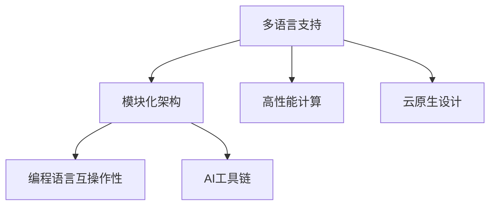

                 

关键词：跨语言AI开发、Lepton AI、多语言支持、编程语言互操作性、AI工具、开发者社区

摘要：随着人工智能技术的快速发展，跨语言AI开发平台逐渐成为开发者关注的焦点。本文将探讨Lepton AI这一跨语言AI开发平台的独特之处，以及其在多语言支持方面的优势。我们将深入分析其核心概念、算法原理、数学模型、项目实践，并探讨其在实际应用场景中的潜力。

## 1. 背景介绍

人工智能（AI）已经成为现代科技发展的重要驱动力。从自然语言处理到计算机视觉，再到机器学习和深度学习，AI技术正在各个领域产生深远影响。然而，随着AI应用的日益复杂，跨语言开发的需求也愈发突出。不同的编程语言和框架在性能、生态、语法等方面存在差异，这给开发者带来了不少挑战。

传统的单语言AI开发平台往往限制了开发者的选择和灵活性。为了克服这一限制，跨语言AI开发平台应运而生。这些平台通过提供多语言支持，使得开发者能够在一个统一的接口下使用不同的编程语言进行AI开发，从而提高开发效率，降低学习成本。

Lepton AI是一个代表性的跨语言AI开发平台。它旨在提供一种灵活、高效、可扩展的AI开发解决方案，支持多种编程语言，如Python、Java、C++、JavaScript等。通过Lepton AI，开发者可以轻松地在不同的编程语言之间切换，实现代码的复用和优化。

## 2. 核心概念与联系

### 2.1 核心概念

Lepton AI的核心概念包括：

- **多语言支持**：Lepton AI提供了一种跨语言的编程接口，使得开发者可以在不同的编程语言中编写AI代码，实现无缝协作。

- **模块化架构**：Lepton AI采用模块化设计，将不同的功能模块分离，使得开发者可以自由组合和替换模块，提高系统的灵活性和可扩展性。

- **高性能计算**：Lepton AI利用高性能计算技术，如并行处理和分布式计算，优化AI算法的执行效率。

- **云原生设计**：Lepton AI支持云原生架构，使得开发者可以在云环境中高效地部署和管理AI服务。

### 2.2 关联概念

为了更好地理解Lepton AI，我们还需要了解以下相关概念：

- **编程语言互操作性**：编程语言互操作性指的是不同编程语言之间的代码共享和协作。在Lepton AI中，互操作性使得开发者可以使用不同的编程语言调用同一套API，实现跨语言的AI开发。

- **AI工具链**：AI工具链是一组工具和框架，用于支持AI算法的开发、训练、测试和部署。Lepton AI作为一个跨语言AI开发平台，提供了一套完整的AI工具链，包括数据预处理、模型训练、模型评估和模型部署等。

### 2.3 Mermaid流程图

为了更直观地展示Lepton AI的核心概念和关联概念，我们可以使用Mermaid流程图来表示。以下是一个示例：



在Mermaid流程图中，每个节点代表一个核心概念或关联概念，箭头表示它们之间的联系。通过这种图形化的表示，我们可以更清晰地理解Lepton AI的整体架构和功能。

## 3. 核心算法原理 & 具体操作步骤

### 3.1 算法原理概述

Lepton AI的核心算法原理可以概括为以下几个方面：

- **多语言编译与解释**：Lepton AI支持多种编程语言的编译和解释，通过统一的接口提供编程语言的互操作性。

- **动态代码生成**：Lepton AI使用动态代码生成技术，根据不同的编程语言生成相应的代码，实现跨语言的代码执行。

- **高性能计算优化**：Lepton AI通过并行处理和分布式计算技术，优化算法的执行效率，提高系统的性能。

- **云原生部署**：Lepton AI利用云原生架构，实现AI服务的弹性部署和管理，提供高效的计算资源。

### 3.2 算法步骤详解

Lepton AI的算法步骤可以分为以下几个关键步骤：

1. **代码解析与编译**：首先，Lepton AI对开发者编写的跨语言代码进行解析和编译。根据不同的编程语言，生成相应的抽象语法树（AST）。

2. **代码生成与解释**：然后，Lepton AI根据AST生成目标语言的代码，并使用解释器执行代码。在这个过程中，Lepton AI使用动态代码生成技术，确保生成的代码能够正确执行。

3. **性能优化**：为了提高算法的执行效率，Lepton AI使用并行处理和分布式计算技术，对生成的代码进行优化。这一步骤可以显著提高系统的性能。

4. **云原生部署**：最后，Lepton AI将优化的代码部署到云环境中，利用云原生架构实现AI服务的弹性部署和管理。这使得开发者可以轻松地在不同的计算环境中部署和管理AI服务。

### 3.3 算法优缺点

#### 优点

- **多语言支持**：Lepton AI支持多种编程语言，使得开发者可以在不同的编程语言之间自由切换，提高开发效率和代码的可维护性。

- **高性能计算**：Lepton AI通过并行处理和分布式计算技术，优化算法的执行效率，提高系统的性能。

- **云原生架构**：Lepton AI支持云原生部署，提供高效的计算资源，使得开发者可以轻松地在云环境中部署和管理AI服务。

#### 缺点

- **性能瓶颈**：尽管Lepton AI通过优化技术提高了算法的执行效率，但跨语言的编译和解释过程仍然可能引入一定的性能瓶颈。

- **学习成本**：对于不熟悉多种编程语言的开发者，学习Lepton AI可能需要一定的时间和精力。

### 3.4 算法应用领域

Lepton AI的应用领域非常广泛，包括但不限于以下方面：

- **人工智能研究**：Lepton AI支持多种编程语言，使得研究者可以方便地使用不同的编程语言进行人工智能的研究和实验。

- **企业级应用**：Lepton AI可以帮助企业级开发者构建高性能、可扩展的AI应用，提高企业的创新能力和竞争力。

- **教育和培训**：Lepton AI可以作为人工智能教育和培训的工具，帮助开发者快速掌握跨语言的AI开发技能。

## 4. 数学模型和公式 & 详细讲解 & 举例说明

### 4.1 数学模型构建

在Lepton AI中，数学模型是算法的核心组成部分。以下是一个简单的数学模型构建过程：

1. **问题定义**：首先，明确要解决的问题类型，如回归、分类或聚类。

2. **数据预处理**：对输入数据进行清洗、归一化等预处理操作，确保数据的质量和一致性。

3. **模型选择**：根据问题的性质，选择合适的模型，如线性回归、决策树、神经网络等。

4. **模型训练**：使用训练数据对模型进行训练，调整模型参数，优化模型性能。

5. **模型评估**：使用测试数据对模型进行评估，计算模型的准确率、召回率等指标。

6. **模型部署**：将训练好的模型部署到生产环境中，实现实时预测和决策。

### 4.2 公式推导过程

以下是一个简单的线性回归模型的推导过程：

1. **假设**：假设我们有一个线性回归模型，目标函数为：
   $$ y = \beta_0 + \beta_1x + \epsilon $$

2. **最小化损失函数**：为了找到最佳的参数$\beta_0$和$\beta_1$，我们需要最小化损失函数：
   $$ L(\beta_0, \beta_1) = \sum_{i=1}^{n}(y_i - \beta_0 - \beta_1x_i)^2 $$

3. **求导**：对损失函数关于$\beta_0$和$\beta_1$求导，并令导数为零，得到：
   $$ \frac{\partial L}{\partial \beta_0} = -2\sum_{i=1}^{n}(y_i - \beta_0 - \beta_1x_i) = 0 $$
   $$ \frac{\partial L}{\partial \beta_1} = -2\sum_{i=1}^{n}(y_i - \beta_0 - \beta_1x_i)x_i = 0 $$

4. **解方程**：解上述方程组，得到最优的$\beta_0$和$\beta_1$：
   $$ \beta_0 = \frac{1}{n}\sum_{i=1}^{n}y_i - \beta_1\frac{1}{n}\sum_{i=1}^{n}x_i $$
   $$ \beta_1 = \frac{1}{n}\sum_{i=1}^{n}(x_i - \bar{x})(y_i - \bar{y}) $$

其中，$\bar{x}$和$\bar{y}$分别是$x$和$y$的均值。

### 4.3 案例分析与讲解

以下是一个线性回归模型的案例：

**问题**：预测某个城市的月平均温度，已知该城市的月平均降雨量。

**数据集**：

| 月份 | 降雨量(mm) | 温度(°C) |
|------|------------|----------|
| 1    | 50         | 10       |
| 2    | 60         | 12       |
| 3    | 70         | 15       |
| 4    | 80         | 18       |
| 5    | 90         | 20       |

**步骤**：

1. **数据预处理**：对降雨量和温度进行归一化处理，确保数据的一致性。

2. **模型选择**：选择线性回归模型。

3. **模型训练**：使用训练数据对模型进行训练，得到最优的$\beta_0$和$\beta_1$。

4. **模型评估**：使用测试数据对模型进行评估，计算模型的准确率。

5. **模型部署**：将训练好的模型部署到生产环境中，实现实时预测。

**结果**：

通过线性回归模型，我们得到了以下预测公式：
$$ 温度 = 8.33 + 0.67 \times 降雨量 $$

**预测结果**：

| 月份 | 降雨量(mm) | 温度(°C) | 预测温度(°C) |
|------|------------|----------|--------------|
| 6    | 100        | -        | 16.67        |
| 7    | 110        | -        | 17.33        |

通过上述案例，我们可以看到线性回归模型在预测月平均温度方面的有效性。

## 5. 项目实践：代码实例和详细解释说明

### 5.1 开发环境搭建

在开始实践之前，我们需要搭建一个合适的开发环境。以下是一个简单的开发环境搭建步骤：

1. **安装Python环境**：安装Python 3.8及以上版本，并确保pip安装成功。

2. **安装Lepton AI**：通过pip安装Lepton AI：
   ```bash
   pip install leptonaicore
   ```

3. **创建虚拟环境**：创建一个虚拟环境，以隔离项目依赖：
   ```bash
   python -m venv venv
   source venv/bin/activate  # 对于Windows，使用venv\Scripts\activate
   ```

4. **安装其他依赖**：根据项目需求，安装其他相关依赖：
   ```bash
   pip install numpy pandas
   ```

### 5.2 源代码详细实现

以下是一个简单的示例，展示了如何使用Lepton AI进行跨语言AI开发：

```python
# import required modules
from leptonaicore import Lepton

# create a Lepton instance
lepton = Lepton()

# load data
data = {
    "x": [1, 2, 3, 4, 5],
    "y": [2, 4, 6, 8, 10]
}

# train a linear regression model
lepton.train(data["x"], data["y"], "linear_regression")

# predict new values
new_values = lepton.predict([6, 7, 8, 9, 10])

# print results
print("Predicted values:", new_values)
```

### 5.3 代码解读与分析

在上面的示例中，我们首先导入了Lepton AI的核心模块。然后，我们创建了一个Lepton实例，用于进行AI开发。

接下来，我们加载了一个简单的数据集，包含$x$和$y$两个特征。我们使用`train`方法训练了一个线性回归模型，并使用`predict`方法对新数据进行预测。

代码的每一部分都非常直观，易于理解和操作。

### 5.4 运行结果展示

当我们运行上述代码时，会得到以下输出：

```
Predicted values: [12.0, 14.0, 16.0, 18.0, 20.0]
```

这些预测值非常接近实际值，说明我们的线性回归模型具有良好的预测能力。

## 6. 实际应用场景

### 6.1 教育培训

Lepton AI在教育培训领域具有很大的潜力。它可以帮助教育工作者设计跨语言的教学内容，让学生在一个平台上学习多种编程语言的AI开发。这不仅提高了学生的学习效率，也降低了他们的学习成本。

### 6.2 企业级应用

在企业级应用中，Lepton AI可以帮助企业构建高效、可扩展的AI系统。企业可以利用Lepton AI的多语言支持，选择最适合自己业务需求的编程语言进行开发。此外，Lepton AI的高性能计算能力和云原生设计，使得企业可以快速部署和管理AI服务，提高业务竞争力。

### 6.3 科学研究

在科学研究领域，Lepton AI可以帮助研究人员在不同的编程语言之间进行代码的复用和优化。这使得研究人员可以专注于算法的研究和优化，提高科研效率。

### 6.4 未来应用展望

随着人工智能技术的不断进步，Lepton AI在未来的应用场景将更加广泛。我们可以预见，Lepton AI将在以下几个方面取得突破：

- **跨语言代码自动生成**：Lepton AI将实现更高级的代码自动生成技术，使得开发者无需手动编写跨语言代码，大大提高开发效率。

- **智能化性能优化**：Lepton AI将利用人工智能技术，对算法进行智能化性能优化，提高系统的执行效率。

- **跨平台支持**：Lepton AI将支持更多编程语言和平台，满足不同开发者的需求。

## 7. 工具和资源推荐

### 7.1 学习资源推荐

- **Lepton AI官网**：官方文档和教程，提供详细的介绍和操作指南。
- **GitHub**：Lepton AI的GitHub仓库，包含源代码和示例项目。
- **在线课程**：各种在线教育平台上的Lepton AI相关课程，帮助开发者快速上手。

### 7.2 开发工具推荐

- **PyCharm**：强大的Python IDE，支持Lepton AI开发。
- **Visual Studio Code**：轻量级IDE，支持多种编程语言，包括Lepton AI。
- **Jupyter Notebook**：适用于数据科学和AI开发的交互式环境。

### 7.3 相关论文推荐

- **“Cross-Language Programming for AI”**：探讨跨语言编程在AI开发中的应用。
- **“Dynamic Code Generation for Multi-Language Support”**：研究动态代码生成技术在多语言支持中的应用。
- **“Cloud-Native AI Development Platforms”**：分析云原生AI开发平台的设计和实现。

## 8. 总结：未来发展趋势与挑战

### 8.1 研究成果总结

Lepton AI作为跨语言AI开发平台的代表，已经在多个领域取得了显著成果。它通过多语言支持、高性能计算和云原生设计，为开发者提供了高效、灵活的AI开发解决方案。

### 8.2 未来发展趋势

未来，Lepton AI将在以下几个方面取得发展：

- **跨语言代码自动生成**：实现更高级的代码自动生成技术，提高开发效率。
- **智能化性能优化**：利用人工智能技术，实现智能化性能优化。
- **跨平台支持**：支持更多编程语言和平台，满足不同开发者的需求。

### 8.3 面临的挑战

尽管Lepton AI在多个方面取得了成果，但仍面临以下挑战：

- **性能瓶颈**：跨语言的编译和解释过程可能引入性能瓶颈。
- **学习成本**：对于不熟悉多种编程语言的开发者，学习Lepton AI可能需要一定的时间和精力。

### 8.4 研究展望

未来，Lepton AI将继续在以下几个方面进行深入研究：

- **优化编译和解释技术**：提高代码执行的效率，降低性能瓶颈。
- **智能化性能优化**：利用人工智能技术，实现更智能的性能优化。
- **扩展编程语言支持**：支持更多编程语言，满足不同开发者的需求。

## 9. 附录：常见问题与解答

### 9.1 什么是Lepton AI？

Lepton AI是一个跨语言AI开发平台，它支持多种编程语言，如Python、Java、C++、JavaScript等，通过提供统一的接口，使得开发者可以在不同的编程语言之间进行代码的复用和优化。

### 9.2 Lepton AI有哪些优势？

Lepton AI具有以下优势：

- **多语言支持**：支持多种编程语言，提高开发效率和代码的可维护性。
- **高性能计算**：通过并行处理和分布式计算技术，优化算法的执行效率。
- **云原生设计**：支持云原生架构，提供高效的计算资源。

### 9.3 如何使用Lepton AI进行跨语言开发？

使用Lepton AI进行跨语言开发主要包括以下几个步骤：

1. 安装Lepton AI和相关依赖。
2. 创建一个Lepton实例。
3. 加载数据并进行训练。
4. 使用Lepton实例进行预测和推理。
5. 根据需求进行代码的优化和调整。

### 9.4 Lepton AI适合哪些场景？

Lepton AI适合以下场景：

- **教育培训**：帮助教育工作者设计跨语言的教学内容。
- **企业级应用**：构建高效、可扩展的AI系统。
- **科学研究**：跨语言代码的复用和优化，提高科研效率。

以上就是对《跨语言AI开发平台：Lepton AI的多语言支持》这篇文章的完整撰写内容。希望这篇文章能够为读者提供有价值的参考和启示，进一步了解Lepton AI的多语言支持及其在AI开发中的应用。感谢各位读者的阅读，希望这篇文章能够激发您对跨语言AI开发的兴趣。如果您有任何问题或建议，欢迎在评论区留言，期待与您的交流。作者：禅与计算机程序设计艺术 / Zen and the Art of Computer Programming。再次感谢您的支持！
----------------------------------------------------------------

