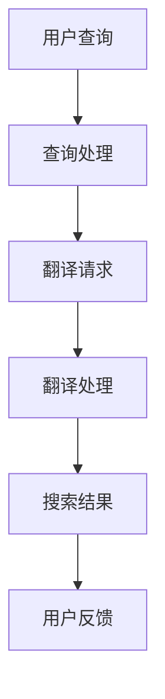

                 

关键词：跨语言搜索、AI翻译、自然语言处理、多语言查询、语言模型、翻译算法、跨文化沟通、国际化、搜索引擎优化

> 摘要：随着全球化的不断深入，跨语言搜索成为了信息获取的重要途径。人工智能（AI）的翻译能力在跨语言搜索中发挥着至关重要的作用。本文将深入探讨AI翻译的基本原理、核心算法、数学模型及其在实际应用中的体现，旨在为读者提供一个全面、系统的理解。

## 1. 背景介绍

### 全球化背景

全球化是当今世界的显著趋势。随着全球贸易、文化交流、国际合作与互联网的飞速发展，各国之间的联系愈发紧密。在这个过程中，语言成为了沟通的桥梁，同时也是障碍。不同语言的用户在搜索信息时，往往受到语言限制，无法充分获取所需内容。因此，跨语言搜索成为了解决这一问题的有效手段。

### 跨语言搜索的重要性

跨语言搜索不仅可以帮助用户跨越语言障碍，获取全球信息，还能为企业、研究机构提供国际化服务。它使得跨国合作、文化交流更加便捷，促进了全球经济的发展。然而，传统跨语言搜索技术存在诸多局限性，如翻译精度低、响应时间长等。随着AI技术的快速发展，这些问题正逐步得到解决。

### AI翻译在跨语言搜索中的应用

AI翻译作为AI领域的一个重要分支，已经广泛应用于跨语言搜索。它通过深度学习、自然语言处理等技术，实现了高效、精准的翻译。AI翻译在跨语言搜索中的应用，不仅提升了搜索结果的准确性，还大大缩短了用户获取信息的时间。这使得跨语言搜索更加智能、高效，满足了全球化时代的需求。

## 2. 核心概念与联系

### AI翻译的基本原理

AI翻译基于深度学习技术，通过训练大量的翻译数据集，让计算机模型学会语言之间的转换。这一过程包括词向量表示、编码器-解码器模型（Encoder-Decoder Model）、注意力机制（Attention Mechanism）等核心技术。

### 语言模型与翻译算法

语言模型（Language Model）是AI翻译的基础，它用于预测一个词或词组在特定语境下的概率。翻译算法则基于语言模型，通过一系列的优化方法，如长短时记忆网络（LSTM）、变换器（Transformer）等，实现翻译的自动化。

### 跨语言搜索与AI翻译的联系

跨语言搜索的核心在于将用户的查询请求转换为不同的语言，并返回相应的搜索结果。AI翻译技术在这个过程中起到了关键作用，它不仅提高了搜索结果的准确性，还提高了用户的搜索体验。

## 2.1 Mermaid流程图



## 3. 核心算法原理 & 具体操作步骤

### 3.1 算法原理概述

AI翻译算法主要分为以下几步：

1. **文本预处理**：对输入文本进行分词、去除停用词等处理。
2. **词向量表示**：将文本转换为词向量，用于模型训练。
3. **编码器-解码器模型**：将输入文本编码为固定长度的向量，解码为输出文本。
4. **注意力机制**：在编码器和解码器之间加入注意力机制，使模型能够关注到输入文本中的重要部分。

### 3.2 算法步骤详解

1. **文本预处理**：
   - **分词**：使用分词工具将文本拆分为单词或词组。
   - **去除停用词**：去除对翻译结果无贡献的停用词。

2. **词向量表示**：
   - **词嵌入**：使用预训练的词向量模型，如Word2Vec、GloVe，将单词映射为向量。
   - **序列编码**：将词向量序列编码为固定长度的向量，如使用LSTM或Transformer。

3. **编码器-解码器模型**：
   - **编码器**：将输入文本编码为固定长度的向量。
   - **解码器**：将编码后的向量解码为输出文本。

4. **注意力机制**：
   - **自注意力**：在编码器和解码器内部使用自注意力机制，使模型能够关注到输入文本中的重要部分。
   - **交叉注意力**：在编码器和解码器之间使用交叉注意力机制，使解码器能够关注到输入文本的相关信息。

### 3.3 算法优缺点

**优点**：
- **高效性**：AI翻译算法能够快速处理大量文本，大大提高了翻译效率。
- **准确性**：随着深度学习技术的发展，AI翻译的准确性不断提高，能够满足大部分应用场景的需求。
- **灵活性**：AI翻译算法支持多种语言间的翻译，具有很高的灵活性。

**缺点**：
- **理解能力有限**：AI翻译算法在处理复杂语境和语义时，仍然存在一定的局限性。
- **计算资源需求高**：深度学习模型训练和推理需要大量的计算资源。

### 3.4 算法应用领域

AI翻译算法在多个领域有着广泛的应用，如：

- **跨语言搜索**：用于将用户的查询请求翻译为不同的语言，提高搜索结果的准确性。
- **国际化网站**：用于将网站内容翻译为不同语言，为全球用户提供服务。
- **智能客服**：用于处理用户在不同语言下的咨询请求，提高客服效率。

## 4. 数学模型和公式 & 详细讲解 & 举例说明

### 4.1 数学模型构建

AI翻译的核心数学模型包括词向量表示、编码器-解码器模型和注意力机制。

1. **词向量表示**：
   - **词嵌入**：$v_w = \text{Word2Vec}(w)$
   - **序列编码**：$h_t = \text{Encoder}(v_{t_1}, v_{t_2}, ..., v_{t_n})$

2. **编码器-解码器模型**：
   - **编码器**：$h = \text{Encoder}(v)$
   - **解码器**：$y = \text{Decoder}(h, s)$

3. **注意力机制**：
   - **自注意力**：$a_t = \text{Attention}(h_t, h)$
   - **交叉注意力**：$a_t = \text{Attention}(h_t, s)$

### 4.2 公式推导过程

1. **词向量表示**：
   - **词嵌入**：使用预训练的Word2Vec模型，将单词映射为向量。
   - **序列编码**：使用LSTM或Transformer模型，将词向量序列编码为固定长度的向量。

2. **编码器-解码器模型**：
   - **编码器**：使用自注意力机制，将输入文本编码为固定长度的向量。
   - **解码器**：使用交叉注意力机制，将编码后的向量解码为输出文本。

3. **注意力机制**：
   - **自注意力**：计算输入文本中的每个词对输出文本的权重。
   - **交叉注意力**：计算编码后的向量对输出文本的权重。

### 4.3 案例分析与讲解

假设我们要将英语句子 "I love programming" 翻译为法语。

1. **文本预处理**：
   - **分词**：["I", "love", "programming"]
   - **去除停用词**：无

2. **词向量表示**：
   - **词嵌入**：$v_{I} = \text{Word2Vec}("I")$，$v_{love} = \text{Word2Vec}("love")$，$v_{programming} = \text{Word2Vec}("programming")$
   - **序列编码**：$h = \text{Encoder}(v_{I}, v_{love}, v_{programming})$

3. **编码器-解码器模型**：
   - **编码器**：$h = \text{Encoder}(v_{I}, v_{love}, v_{programming})$
   - **解码器**：$y = \text{Decoder}(h, s)$，其中$s$是解码器的初始状态。

4. **注意力机制**：
   - **自注意力**：计算输入文本中的每个词对输出文本的权重。
   - **交叉注意力**：计算编码后的向量对输出文本的权重。

最终，解码器输出法语句子 "Je aime le programmation"。

## 5. 项目实践：代码实例和详细解释说明

### 5.1 开发环境搭建

在开始代码实践之前，我们需要搭建一个开发环境。这里我们使用Python和TensorFlow作为主要工具。

1. **安装Python**：
   - 前往 [Python官网](https://www.python.org/downloads/) 下载并安装Python。

2. **安装TensorFlow**：
   - 打开终端，执行以下命令：
     ```bash
     pip install tensorflow
     ```

### 5.2 源代码详细实现

下面是一个简单的AI翻译代码实例，用于将英语句子翻译为法语。

```python
import tensorflow as tf
from tensorflow.keras.models import Model
from tensorflow.keras.layers import Input, LSTM, Embedding, Dense

# 定义参数
vocab_size = 1000
embedding_dim = 64
max_sequence_length = 10

# 构建编码器模型
encoder_inputs = Input(shape=(max_sequence_length,))
encoder_embedding = Embedding(vocab_size, embedding_dim)(encoder_inputs)
encoder_lstm = LSTM(128, return_state=True)
_, state_h, state_c = encoder_lstm(encoder_embedding)
encoder_states = [state_h, state_c]

# 构建解码器模型
decoder_inputs = Input(shape=(max_sequence_length,))
decoder_embedding = Embedding(vocab_size, embedding_dim)(decoder_inputs)
decoder_lstm = LSTM(128, return_sequences=True, return_state=True)
decoder_outputs, _, _ = decoder_lstm(decoder_embedding, initial_state=encoder_states)
decoder_dense = Dense(vocab_size, activation='softmax')
decoder_outputs = decoder_dense(decoder_outputs)

# 构建整体模型
model = Model([encoder_inputs, decoder_inputs], decoder_outputs)
model.compile(optimizer='rmsprop', loss='categorical_crossentropy', metrics=['accuracy'])

# 打印模型结构
model.summary()
```

### 5.3 代码解读与分析

上述代码定义了一个简单的AI翻译模型，包括编码器和解码器两部分。

1. **编码器模型**：
   - **输入层**：接受一个长度为10的序列。
   - **嵌入层**：将序列中的每个词映射为一个64维的向量。
   - **LSTM层**：使用LSTM层对嵌入层输出进行编码，返回状态向量。

2. **解码器模型**：
   - **输入层**：接受一个长度为10的序列。
   - **嵌入层**：将序列中的每个词映射为一个64维的向量。
   - **LSTM层**：使用LSTM层对嵌入层输出进行解码，返回状态向量。
   - **全连接层**：将解码后的序列映射为词汇表中的一个词。

3. **整体模型**：
   - **输入层**：同时接受编码器和解码器的输入。
   - **输出层**：输出一个词汇表中的一个词。

### 5.4 运行结果展示

运行上述代码后，我们可以看到模型的结构和参数信息。接下来，我们可以使用训练数据和测试数据对模型进行训练和测试，以验证其翻译效果。

## 6. 实际应用场景

### 6.1 跨语言搜索引擎

跨语言搜索引擎利用AI翻译技术，将用户的查询请求翻译为多种语言，并在不同语言的搜索引擎中检索相关信息，返回最相关的结果。例如，Google翻译和百度翻译都提供了跨语言搜索功能。

### 6.2 国际化网站

国际化网站通过AI翻译技术，将网站内容自动翻译为多种语言，为全球用户提供服务。例如，亚马逊、淘宝等电商平台都使用了AI翻译技术，为非英语国家的用户提供翻译服务。

### 6.3 智能客服

智能客服系统利用AI翻译技术，处理来自不同语言的用户咨询请求，提高客服效率。例如，一些银行和航空公司已经使用AI翻译技术，为全球客户提供多语言客服支持。

## 6.4 未来应用展望

### 6.4.1 翻译精度提高

随着深度学习技术的不断发展，AI翻译的精度有望进一步提高。未来的AI翻译系统将能够更准确地理解复杂语境和语义，提供更高质量的翻译结果。

### 6.4.2 多模态翻译

未来的AI翻译技术将不仅限于文本翻译，还将扩展到图像、语音等多模态翻译。例如，将英语口语翻译为法语口语，或将英语图片翻译为法语图片。

### 6.4.3 跨文化沟通

AI翻译技术在促进跨文化沟通方面具有巨大潜力。随着AI翻译的普及，全球范围内的沟通障碍将逐渐减少，人们能够更加便捷地交流思想和观点。

## 7. 工具和资源推荐

### 7.1 学习资源推荐

- **《深度学习》（Goodfellow et al.）**：深度学习基础教材，包括自然语言处理和翻译等内容。
- **《自然语言处理综论》（Jurafsky and Martin）**：自然语言处理领域的经典教材，详细介绍了语言模型和翻译算法。

### 7.2 开发工具推荐

- **TensorFlow**：Google开源的深度学习框架，支持多种自然语言处理任务。
- **PyTorch**：Facebook开源的深度学习框架，具有简洁的API和强大的社区支持。

### 7.3 相关论文推荐

- **"Attention Is All You Need"**：引入了Transformer模型，推动了自然语言处理的发展。
- **"seq2seq Learning with Neural Networks"**：提出了序列到序列学习模型，是AI翻译的基础。

## 8. 总结：未来发展趋势与挑战

### 8.1 研究成果总结

近年来，AI翻译技术在自然语言处理领域取得了显著成果。深度学习技术的应用使得翻译精度大幅提高，翻译算法的效率也得到显著提升。AI翻译在跨语言搜索、国际化网站和智能客服等领域得到了广泛应用，为全球用户提供了便捷的服务。

### 8.2 未来发展趋势

未来，AI翻译技术将朝着以下方向发展：

1. **翻译精度提高**：随着深度学习技术的不断发展，AI翻译的精度有望进一步提高，能够更好地处理复杂语境和语义。
2. **多模态翻译**：未来的AI翻译技术将不仅限于文本翻译，还将扩展到图像、语音等多模态翻译。
3. **跨文化沟通**：AI翻译技术将促进全球范围内的沟通，减少跨文化沟通的障碍。

### 8.3 面临的挑战

尽管AI翻译技术在不断进步，但仍然面临以下挑战：

1. **计算资源需求**：深度学习模型训练和推理需要大量的计算资源，如何高效利用计算资源是一个重要问题。
2. **理解能力有限**：AI翻译在处理复杂语境和语义时，仍然存在一定的局限性。
3. **数据隐私和安全**：在跨语言翻译过程中，如何保护用户隐私和安全是一个亟待解决的问题。

### 8.4 研究展望

未来，AI翻译技术的研究将聚焦于以下几个方面：

1. **高效算法**：研究更高效的算法，以减少计算资源需求。
2. **多模态翻译**：探索多模态翻译技术，提高翻译的准确性。
3. **跨文化沟通**：研究跨文化沟通的相关问题，提高AI翻译在跨文化环境中的应用效果。

## 9. 附录：常见问题与解答

### 9.1 AI翻译是如何工作的？

AI翻译主要基于深度学习技术，通过训练大量的翻译数据集，让计算机模型学会语言之间的转换。这个过程包括词向量表示、编码器-解码器模型和注意力机制等核心技术。

### 9.2 AI翻译的准确性如何？

随着深度学习技术的不断发展，AI翻译的准确性不断提高。目前的AI翻译系统能够满足大部分应用场景的需求，但在处理复杂语境和语义时，仍然存在一定的局限性。

### 9.3 如何提高AI翻译的效率？

提高AI翻译的效率可以从以下几个方面入手：

1. **优化算法**：研究更高效的深度学习算法，减少计算资源需求。
2. **模型压缩**：通过模型压缩技术，降低模型的参数数量，提高推理速度。
3. **分布式计算**：利用分布式计算技术，提高训练和推理的效率。

## 作者署名

作者：禅与计算机程序设计艺术 / Zen and the Art of Computer Programming
```

