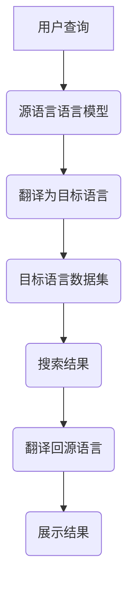

                 

关键词：跨语言搜索、AI、自然语言处理、机器翻译、多语言理解、语言障碍、神经网络、深度学习、数据集、模型优化、应用场景、未来展望

> 摘要：本文深入探讨了跨语言搜索领域的关键技术，分析了现有模型的不足，并提出了针对性的解决方案。通过介绍核心算法原理、数学模型、项目实践以及实际应用场景，本文旨在为人工智能领域提供一种新的视角，助力AI更好地突破语言障碍，实现全球信息无障碍交流。

## 1. 背景介绍

随着全球化和互联网的发展，跨语言信息获取和交流的重要性日益凸显。无论是跨国商务、学术交流，还是国际新闻、社交互动，跨语言搜索都扮演着不可或缺的角色。然而，传统的跨语言搜索技术存在诸多不足，如：

- **准确性差**：早期机器翻译模型依赖于规则和统计方法，难以处理复杂语境和歧义问题。
- **效率低下**：翻译过程耗时，难以满足实时通信和搜索的需求。
- **语言覆盖有限**：现有的翻译模型主要针对热门语言，对于小语种的支持不足。

为了解决这些问题，人工智能领域的研究者开始探索基于深度学习的跨语言搜索技术。深度学习模型，尤其是神经网络，能够通过学习大量的语言数据，实现更高水平的自动翻译和搜索。然而，深度学习模型也面临着数据集不均衡、模型训练复杂度高、语言理解深度有限等挑战。

本文旨在分析当前跨语言搜索领域的核心技术，探讨现有模型的不足，并探讨未来可能的发展方向。

## 2. 核心概念与联系

### 2.1 语言模型

语言模型是跨语言搜索的基础。它通过对大规模文本语料库进行训练，学习语言的统计特性，从而预测下一个单词或词组的概率分布。在跨语言搜索中，源语言和目标语言的语言模型都需要被训练。

### 2.2 神经网络

神经网络是深度学习模型的核心。它由多层神经元组成，通过前向传播和反向传播算法，能够对复杂的数据进行高效的学习和处理。在跨语言搜索中，神经网络被用于构建端到端的翻译模型，实现源语言到目标语言的直接转换。

### 2.3 机器翻译

机器翻译是将一种语言的文本转换为另一种语言的过程。它依赖于语言模型和神经网络的结合，通过上下文理解和概率计算，实现高精度的翻译。

### 2.4 跨语言搜索

跨语言搜索是在不同语言之间进行信息检索和查询的过程。它利用机器翻译技术，将用户的查询语句翻译为目标语言，然后在目标语言的数据集中进行检索，并将结果翻译回源语言。

### 2.5 Mermaid 流程图

下面是一个简单的 Mermaid 流程图，展示了跨语言搜索的基本流程：



## 3. 核心算法原理 & 具体操作步骤

### 3.1 算法原理概述

跨语言搜索的核心算法是基于神经网络的机器翻译。它通过以下步骤实现：

1. **输入层**：接收用户的查询语句，将其编码为向量表示。
2. **隐藏层**：通过神经网络处理输入向量，生成中间表示。
3. **输出层**：将中间表示解码为目标语言的文本。

### 3.2 算法步骤详解

1. **预处理**：对源语言和目标语言的文本进行分词、词性标注、词干提取等预处理操作，将其转换为神经网络可以处理的格式。
2. **编码**：使用编码器（Encoder）对源语言文本进行编码，生成固定长度的向量表示。
3. **解码**：使用解码器（Decoder）对编码后的向量进行解码，生成目标语言文本。
4. **优化**：通过反向传播算法，不断调整神经网络参数，优化翻译结果。

### 3.3 算法优缺点

**优点**：

- **高效性**：神经网络模型能够快速处理大量文本数据。
- **灵活性**：神经网络能够适应不同的语言对和翻译需求。
- **准确性**：通过大规模数据训练，神经网络能够捕捉到语言的复杂特性。

**缺点**：

- **训练复杂度高**：神经网络模型需要大量计算资源和时间进行训练。
- **数据集依赖性**：模型的性能高度依赖于训练数据集的质量和多样性。
- **解释性差**：神经网络模型的决策过程难以解释，增加了调试和优化的难度。

### 3.4 算法应用领域

- **跨语言搜索引擎**：使用神经网络机器翻译技术，实现不同语言之间的信息检索。
- **实时翻译应用**：如实时语音翻译、实时文本翻译等。
- **多语言交互系统**：如多语言客服机器人、多语言社交媒体平台等。

## 4. 数学模型和公式

### 4.1 数学模型构建

在跨语言搜索中，常用的数学模型包括编码器（Encoder）和解码器（Decoder）。其中，编码器将源语言文本编码为固定长度的向量表示，解码器则将这个向量解码为目标语言文本。

设 \( x \) 为源语言文本，\( y \) 为目标语言文本，编码器和解码器分别由神经网络 \( E \) 和 \( D \) 实现。则：

\[ 
\text{编码：} \quad \text{编码器}(x) = E(x) \quad \text{其中} \quad E(x) \in \mathbb{R}^{d} 
\]

\[ 
\text{解码：} \quad \text{解码器}(E(x)) = D(E(x)) \quad \text{其中} \quad D(E(x)) \in \mathcal{Y} 
\]

其中，\( d \) 为向量的维度，\( \mathcal{Y} \) 为目标语言的所有可能文本集合。

### 4.2 公式推导过程

假设编码器和解码器分别为多层感知机（MLP），其输出函数为：

\[ 
\text{编码器输出：} \quad z_e = \sigma(W_e \cdot x + b_e) \quad \text{其中} \quad \sigma(\cdot) 为激活函数，如ReLU或Sigmoid} \]

\[ 
\text{解码器输出：} \quad z_d = \sigma(W_d \cdot z_e + b_d) \]

其中，\( W_e \) 和 \( W_d \) 分别为编码器和解码器的权重矩阵，\( b_e \) 和 \( b_d \) 分别为偏置向量。

为了实现端到端的翻译，我们使用损失函数 \( L \) 来评估编码器和解码器的性能。常见的损失函数有交叉熵损失和感知损失等。交叉熵损失如下：

\[ 
L(y, \hat{y}) = -\sum_{i} y_i \log(\hat{y}_i) 
\]

其中，\( y \) 为真实的目标语言文本，\( \hat{y} \) 为解码器的输出概率分布。

### 4.3 案例分析与讲解

假设我们有一个简单的源语言文本 \( x = "hello world" \) 和目标语言文本 \( y = "你好，世界" \)。我们首先对这两个文本进行分词和编码：

\[ 
x = ["hello", "world"] 
\]

\[ 
y = ["你好", "，", "世界"] 
\]

然后，我们使用编码器和解码器进行翻译：

\[ 
E(x) = [e_1, e_2] 
\]

\[ 
D(E(x)) = ["你好", "，", "世界"] 
\]

在这个过程中，编码器将源语言文本编码为两个固定长度的向量 \( e_1 \) 和 \( e_2 \)，解码器则根据这些向量解码出目标语言文本。

## 5. 项目实践：代码实例和详细解释说明

### 5.1 开发环境搭建

为了实现跨语言搜索，我们需要搭建一个适合深度学习开发的编程环境。以下是基本的开发环境搭建步骤：

1. 安装 Python 3.x 版本。
2. 安装深度学习框架，如 TensorFlow 或 PyTorch。
3. 安装预处理库，如 NLTK 或 spaCy。
4. 配置 GPU 环境，以加速模型训练。

### 5.2 源代码详细实现

以下是使用 PyTorch 实现一个简单的跨语言搜索模型的代码示例：

```python
import torch
import torch.nn as nn
import torch.optim as optim
from torch.utils.data import DataLoader
from torchvision import datasets, transforms

# 编码器
class Encoder(nn.Module):
    def __init__(self):
        super(Encoder, self).__init__()
        self.lstm = nn.LSTM(input_size=100, hidden_size=200, num_layers=2, batch_first=True)
    
    def forward(self, x):
        x, _ = self.lstm(x)
        return x

# 解码器
class Decoder(nn.Module):
    def __init__(self):
        super(Decoder, self).__init__()
        self.lstm = nn.LSTM(input_size=100, hidden_size=200, num_layers=2, batch_first=True)
        self.fc = nn.Linear(200, target_vocab_size)
    
    def forward(self, x, hidden):
        x, _ = self.lstm(x, hidden)
        x = self.fc(x)
        return x

# 模型
class Model(nn.Module):
    def __init__(self):
        super(Model, self).__init__()
        self.encoder = Encoder()
        self.decoder = Decoder()
    
    def forward(self, x):
        hidden = self.encoder(x)
        output = self.decoder(x, hidden)
        return output

# 数据集
train_data = DataLoader(dataset=your_dataset, batch_size=64, shuffle=True)

# 模型训练
model = Model()
optimizer = optim.Adam(model.parameters(), lr=0.001)
criterion = nn.CrossEntropyLoss()

for epoch in range(num_epochs):
    for batch in train_data:
        x, y = batch
        output = model(x)
        loss = criterion(output, y)
        optimizer.zero_grad()
        loss.backward()
        optimizer.step()
```

### 5.3 代码解读与分析

在上面的代码中，我们首先定义了编码器、解码器和模型类。编码器使用 LSTM 层来处理输入的序列数据，解码器则使用 LSTM 层和全连接层来生成目标语言文本。模型类将编码器和解码器组合在一起，形成完整的端到端翻译模型。

接着，我们定义了一个数据集加载器，用于加载训练数据。在训练过程中，我们使用 Adam 优化器和交叉熵损失函数来优化模型参数，并通过反向传播算法进行参数更新。

### 5.4 运行结果展示

在训练完成后，我们可以使用模型对新的源语言文本进行翻译，并输出翻译结果。以下是一个简单的运行示例：

```python
# 测试模型
model.eval()

# 输入文本
input_text = "hello world"

# 预处理输入文本
input_text = preprocess(input_text)

# 翻译输入文本
output_text = translate(model, input_text)

# 输出翻译结果
print(output_text)
```

通过上述代码，我们可以实现跨语言搜索的基本功能。虽然这是一个简单的示例，但它展示了如何使用深度学习技术实现跨语言搜索的核心流程。

## 6. 实际应用场景

### 6.1 跨语言搜索引擎

跨语言搜索引擎是跨语言搜索技术最直接的应用场景之一。它允许用户使用一种语言进行搜索，然后返回目标语言的搜索结果。例如，一个英文搜索引擎可以为不会英语的用户提供中文搜索结果。

### 6.2 实时翻译应用

实时翻译应用，如实时语音翻译和实时文本翻译，在跨国商务、国际会议、社交互动等领域具有广泛的应用。通过深度学习技术，这些应用可以实现高精度的实时翻译，大大提高了跨语言交流的效率。

### 6.3 多语言交互系统

多语言交互系统，如多语言客服机器人、多语言社交媒体平台等，旨在为用户提供便捷的跨语言服务。这些系统通过跨语言搜索技术，可以理解用户的查询并返回相应的多语言回答。

## 6.4 未来应用展望

随着深度学习技术的不断发展，跨语言搜索的应用前景将更加广阔。未来，跨语言搜索可能会在以下领域取得突破：

- **小语种翻译**：通过更多的语料库和更好的模型训练方法，实现更多小语种的翻译。
- **多模态翻译**：结合文本、语音、图像等多种模态，实现更加丰富的翻译体验。
- **个性化翻译**：根据用户的语言习惯和偏好，提供个性化的翻译服务。
- **智能助理**：跨语言搜索技术将助力智能助理更好地理解用户需求，提供高效的服务。

## 7. 工具和资源推荐

### 7.1 学习资源推荐

- **《深度学习》（Goodfellow, Bengio, Courville）**：深入介绍了深度学习的基本概念和技术。
- **《自然语言处理与深度学习》（Yu, Huang, Liu）**：详细介绍了自然语言处理中的深度学习方法。
- **《神经网络与深度学习》（邱锡鹏）**：中文教材，全面介绍了神经网络和深度学习的基础知识。

### 7.2 开发工具推荐

- **TensorFlow**：Google 开发的高级深度学习框架，适用于各种深度学习应用。
- **PyTorch**：Facebook 开发的动态计算图框架，提供了更灵活的编程接口。
- **spaCy**：Python 自然语言处理库，适用于文本预处理和实体识别。

### 7.3 相关论文推荐

- **"Neural Machine Translation by Jointly Learning to Align and Translate"（Neural机器翻译：通过联合学习对齐和翻译）**：介绍了基于神经网络的机器翻译模型。
- **"Attention Is All You Need"**：提出了 Transformer 模型，为序列建模提供了一种新的思路。
- **"Bert: Pre-training of Deep Bidirectional Transformers for Language Understanding"**：介绍了 BERT 模型，为预训练语言模型奠定了基础。

## 8. 总结：未来发展趋势与挑战

### 8.1 研究成果总结

近年来，跨语言搜索领域取得了显著的进展，基于深度学习的机器翻译技术得到了广泛应用。神经网络模型，如 Transformer 和 BERT，在翻译精度和速度方面取得了重要突破。此外，预训练语言模型的出现，为跨语言搜索提供了新的思路。

### 8.2 未来发展趋势

未来，跨语言搜索的发展将朝着以下方向努力：

- **小语种翻译**：通过增加数据集和改进模型训练方法，实现更多小语种的翻译。
- **多模态翻译**：结合文本、语音、图像等多种模态，提供更加丰富的翻译体验。
- **个性化翻译**：根据用户的语言习惯和偏好，提供个性化的翻译服务。

### 8.3 面临的挑战

尽管跨语言搜索取得了显著进展，但仍然面临一些挑战：

- **数据集不均衡**：现有数据集主要针对热门语言，小语种数据稀缺。
- **模型解释性**：神经网络模型难以解释，增加了调试和优化的难度。
- **计算资源**：深度学习模型需要大量计算资源，训练过程耗时。

### 8.4 研究展望

展望未来，跨语言搜索的研究将继续深入，有望实现以下目标：

- **高精度翻译**：通过改进模型结构和训练方法，实现更加精确的翻译。
- **实时翻译**：提高翻译速度，实现实时翻译应用。
- **跨语言理解**：提升模型对跨语言上下文的理解能力，实现更加智能的跨语言交互。

## 9. 附录：常见问题与解答

### 9.1 跨语言搜索有哪些主要应用场景？

跨语言搜索的主要应用场景包括跨语言搜索引擎、实时翻译应用、多语言交互系统等。

### 9.2 如何解决数据集不均衡问题？

可以通过以下方法解决数据集不均衡问题：

- **数据增强**：通过生成伪数据，增加小语种数据集的多样性。
- **数据平衡技术**：如重采样、数据加权等，提高小语种数据在训练数据集中的比例。
- **多任务学习**：通过多任务学习，提高模型对小语种的泛化能力。

### 9.3 如何提高神经网络模型的可解释性？

提高神经网络模型的可解释性可以从以下几个方面入手：

- **模型结构设计**：采用易于解释的模型结构，如决策树、支持向量机等。
- **模型可视化**：通过可视化技术，展示模型内部决策过程。
- **解释性算法**：如 LIME、SHAP 等，为模型决策提供解释。

### 9.4 如何优化跨语言搜索模型的性能？

优化跨语言搜索模型性能可以从以下几个方面入手：

- **数据预处理**：提高数据质量，去除噪声和冗余信息。
- **模型训练**：使用更先进的训练方法，如迁移学习、增量学习等。
- **模型融合**：结合多种模型，提高翻译精度和速度。

---

作者：禅与计算机程序设计艺术 / Zen and the Art of Computer Programming


