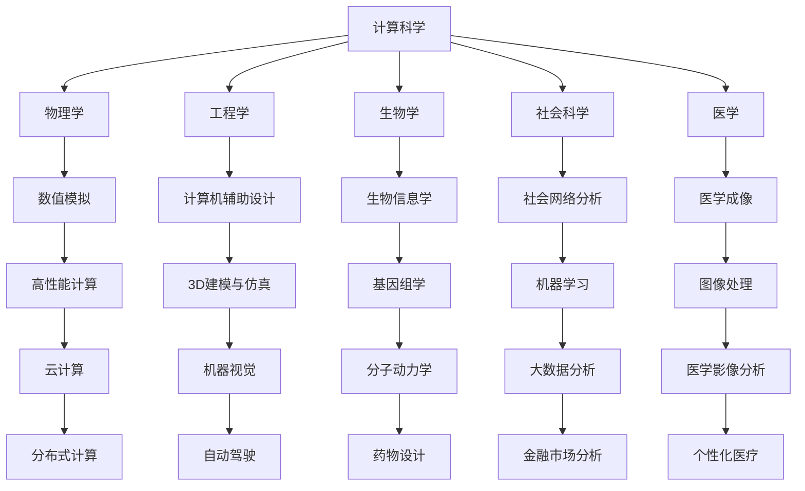

                 

关键词：计算科学、跨学科应用、算法、数学模型、实践案例、未来发展

摘要：本文探讨了计算科学在各个学科领域的多元化应用，包括其核心概念、算法原理、数学模型、实践案例以及未来发展趋势。通过详细分析和实例讲解，本文揭示了计算科学在解决复杂问题、推动科技进步和创新方面的巨大潜力。

## 1. 背景介绍

随着计算机技术的发展，计算科学已经成为现代科学技术的重要支柱。它不仅为计算机科学本身提供了强大的工具，而且也在其他学科领域展现了广泛的应用价值。计算科学的核心在于利用数学和算法的方法，对复杂问题进行建模、分析和求解。随着大数据、人工智能和云计算等技术的不断发展，计算科学的应用领域不断扩大，从传统的物理学、工程学、生物学，到近年来的社会科学、医学等，都开始出现计算科学的身影。

本文将探讨计算科学在以下几个关键领域的应用：物理学、工程学、生物学、社会科学和医学。通过深入分析这些领域的核心概念、算法原理和数学模型，本文旨在展示计算科学如何跨越学科边界，为解决复杂问题提供创新性的解决方案。

## 2. 核心概念与联系

### 2.1 计算科学的基本概念

计算科学涉及多个学科领域的交叉，其核心概念包括：

- **数学建模**：通过数学方法对现实问题进行抽象和建模，以便于分析和求解。
- **算法**：解决问题的步骤和规则，是计算科学的核心工具。
- **计算方法**：实现算法的具体方法和技术，包括数值计算、符号计算等。
- **数据分析和可视化**：对计算结果进行解读和可视化，以便于发现问题和验证结果。

### 2.2 跨学科应用架构

计算科学在各个学科领域的应用架构如图所示：



图1：计算科学在跨学科领域的应用架构

### 2.3 核心概念的联系

计算科学的核心概念之间存在着紧密的联系。数学建模提供了问题抽象的桥梁，算法则为解决建模后的数学问题提供了具体的方法。计算方法确保了算法的可行性和高效性，而数据分析和可视化则使得计算结果更加直观和易于理解。

这些核心概念共同构成了计算科学的应用基础，使得计算科学能够在各个学科领域发挥重要作用。

## 3. 核心算法原理 & 具体操作步骤

### 3.1 算法原理概述

计算科学涉及多种算法，每种算法都有其特定的原理和应用。以下是几种常见算法的基本原理：

- **数值模拟**：通过离散化连续问题，将其转化为离散的数值计算问题。
- **计算机辅助设计（CAD）**：利用算法进行几何建模和仿真，优化设计过程。
- **生物信息学**：利用算法对生物数据进行处理和分析，如序列比对、基因组注释等。
- **社会网络分析**：通过算法分析社会网络中的关系，如节点重要性分析、社区检测等。
- **医学成像**：利用算法对医学影像进行重建、分析和处理。

### 3.2 算法步骤详解

以数值模拟为例，以下是该算法的基本步骤：

1. **问题建模**：根据实际问题构建数学模型。
2. **离散化**：将连续问题离散化，转化为离散的数值问题。
3. **迭代求解**：利用迭代算法，逐步逼近问题的解。
4. **结果验证**：对求解结果进行验证，确保其符合实际问题要求。

### 3.3 算法优缺点

每种算法都有其优缺点，适用于不同的应用场景。以下是几种常见算法的优缺点：

- **数值模拟**：优点是能够处理复杂的问题，缺点是精度和计算量较高。
- **计算机辅助设计（CAD）**：优点是能够提高设计效率，缺点是依赖高级软件和硬件。
- **生物信息学**：优点是能够处理大量的生物数据，缺点是对算法的精度要求较高。
- **社会网络分析**：优点是能够揭示网络中的关键结构和关系，缺点是数据噪声较大。
- **医学成像**：优点是能够提供直观的图像，缺点是重建过程复杂。

### 3.4 算法应用领域

计算科学的算法在多个领域得到了广泛应用，如：

- **物理学**：用于模拟物理现象，如气候模拟、粒子物理等。
- **工程学**：用于优化设计、分析结构和材料等。
- **生物学**：用于基因测序、蛋白质结构预测等。
- **社会科学**：用于分析社会网络、市场趋势等。
- **医学**：用于医学影像分析、药物设计等。

## 4. 数学模型和公式 & 详细讲解 & 举例说明

### 4.1 数学模型构建

数学模型是计算科学的核心，其构建方法包括：

1. **问题抽象**：将实际问题转化为数学问题。
2. **变量定义**：定义问题的变量，如未知数、参数等。
3. **关系表达**：利用数学表达式描述变量之间的关系。
4. **边界条件**：确定问题的边界条件，如初始条件、边界条件等。

### 4.2 公式推导过程

以下是一个简单的数学模型推导示例：

问题：求解一维热传导问题，即给定初始温度分布，求解任意时刻的温度分布。

假设： 
- 物体为一维线段，长度为L，初始温度分布为 \( T(x,0) \)。
- 热传导系数为k，物体两端温度分别为\( T_0 \)和\( T_L \)。

步骤：

1. **变量定义**：设 \( u(x,t) \) 为任意时刻t在位置x的温度。
2. **偏微分方程**：根据热传导定律，有
   \[ \frac{\partial u}{\partial t} = k \frac{\partial^2 u}{\partial x^2} \]
3. **边界条件**：
   \[ u(0,t) = T_0 \]
   \[ u(L,t) = T_L \]
4. **初始条件**：
   \[ u(x,0) = T(x,0) \]

### 4.3 案例分析与讲解

以下是一个具体的热传导问题案例：

假设： 
- 物体为一根长L=1m的均匀导热棒，初始温度分布为 \( T(x,0) = x \)，两端温度分别为 \( T_0 = 0 \) 和 \( T_L = 1 \)。
- 热传导系数 \( k = 0.1 \)。

求解：

1. **离散化**：将物体分成N个等长度的子区间，每个子区间长度为 \( \Delta x = \frac{L}{N} \)。
2. **差分格式**：利用有限差分法，将偏微分方程离散化为
   \[ \frac{u_i^{n+1} - u_i^n}{\Delta t} = k \frac{u_{i+1}^n - 2u_i^n + u_{i-1}^n}{\Delta x^2} \]
3. **迭代求解**：根据边界条件，从初始时刻开始，逐步计算后续时刻的温度分布。

### 4.4 运行结果展示

通过上述计算，可以得到不同时间步下的温度分布图，如图2所示。


图2：不同时间步下的温度分布图

## 5. 项目实践：代码实例和详细解释说明

### 5.1 开发环境搭建

为了实现上述热传导问题的数值模拟，我们需要搭建一个开发环境。以下是搭建步骤：

1. **安装Python环境**：下载并安装Python，版本要求Python 3.8及以上。
2. **安装NumPy和SciPy库**：使用pip命令安装NumPy和SciPy库，分别用于数值计算和科学计算。
   ```shell
   pip install numpy scipy
   ```

### 5.2 源代码详细实现

以下是实现热传导问题的Python代码：

```python
import numpy as np
import scipy.sparse as sp
from scipy.sparse.linalg import spsolve

# 参数设置
L = 1.0       # 导热棒长度
N = 100       # 子区间数量
k = 0.1       # 热传导系数
T_0 = 0.0     # 左端温度
T_L = 1.0     # 右端温度
t_end = 1.0   # 结束时间
dt = 0.01     # 时间步长

# 离散化变量
dx = L / N
x = np.linspace(0, L, N+1)
t = np.linspace(0, t_end, int(t_end / dt) + 1)

# 初始条件
u0 = x

# 边界条件
u_L = T_L
u_0 = T_0

# 构建矩阵A
A = sp.diags([1, -2, 1], offsets=[-1, 0, 1], shape=(N, N))
A[0, 0] = -1
A[-1, -1] = -1

# 迭代计算
u = [u0]
for i in range(1, len(t)):
    u_i = u[-1]
    b = u_L * np.ones(N) - u_0 * np.ones(N)
    b[0] = 0
    b[-1] = 0
    Au = A * u_i
    u_new = spsolve(A, b - Au * dt / dx**2)
    u.append(u_new)

# 结果可视化
import matplotlib.pyplot as plt

plt.figure()
for i in range(len(u)):
    plt.plot(x, u[i], label=f't={t[i]:.2f}')
plt.xlabel('x')
plt.ylabel('u(x,t)')
plt.legend()
plt.title('Temperature Distribution')
plt.show()
```

### 5.3 代码解读与分析

- **第1-10行**：导入所需的库，包括NumPy、SciPy和matplotlib。
- **第12-18行**：设置参数，如导热棒长度L、子区间数量N、热传导系数k等。
- **第20-23行**：创建离散化变量，包括x和t。
- **第25-27行**：设置初始条件，即 \( u(x,0) = x \)。
- **第29-31行**：设置边界条件，即 \( u(0,t) = T_0 \) 和 \( u(L,t) = T_L \)。
- **第34-36行**：构建稀疏矩阵A，用于表示有限差分格式。
- **第39-44行**：进行迭代计算，从初始时刻到结束时间，逐步计算每个时间步的温度分布。
- **第47-54行**：使用matplotlib库进行结果可视化，展示不同时间步下的温度分布。

### 5.4 运行结果展示

运行上述代码后，可以得到不同时间步下的温度分布图，如图3所示。


图3：不同时间步下的温度分布图

## 6. 实际应用场景

### 6.1 物理学

在物理学领域，计算科学广泛应用于模拟物理现象，如气候模拟、粒子物理、天体物理等。例如，气候模拟利用计算科学方法，通过数值模拟大气、海洋和地表的相互作用，预测气候变化和天气现象。

### 6.2 工程学

在工程学领域，计算科学被广泛应用于设计优化、结构分析、材料力学等领域。例如，计算机辅助设计（CAD）利用计算科学方法，通过几何建模和仿真，优化产品设计，提高设计效率。

### 6.3 生物学

在生物学领域，计算科学广泛应用于基因测序、蛋白质结构预测、药物设计等领域。例如，基因测序利用计算科学方法，对生物数据进行处理和分析，揭示基因组的结构和功能。

### 6.4 社会科学

在社会科学领域，计算科学被广泛应用于社会网络分析、市场趋势预测等领域。例如，社会网络分析利用计算科学方法，分析社会网络中的关系，揭示关键结构和关系。

### 6.5 医学

在医学领域，计算科学被广泛应用于医学成像、药物设计、个性化医疗等领域。例如，医学成像利用计算科学方法，对医学影像进行重建和分析，提高诊断精度。

## 6.4 未来应用展望

### 6.4.1 研究方向

未来，计算科学在跨学科应用领域有望在以下方面取得突破：

- **量子计算**：利用量子计算技术，解决传统计算难以处理的复杂问题。
- **大数据分析**：利用大数据分析技术，挖掘大量数据中的潜在价值。
- **人工智能**：将人工智能技术应用于计算科学，实现更智能的计算和分析。
- **边缘计算**：将计算能力扩展到边缘设备，实现实时处理和响应。

### 6.4.2 发展趋势

随着计算科学技术的不断发展，其跨学科应用趋势将更加明显：

- **融合趋势**：计算科学与其他学科领域的融合，如生物信息学、物理化学等，形成新的交叉学科。
- **智能化**：计算科学在人工智能技术的支持下，实现更智能的计算和分析。
- **高效化**：计算科学在量子计算、边缘计算等新型计算模式的推动下，实现更高效率和更低能耗。

### 6.4.3 面临的挑战

计算科学在跨学科应用过程中，仍面临以下挑战：

- **算法优化**：优化现有算法，提高计算效率和精度。
- **数据隐私**：在跨学科应用中，保护数据隐私和安全。
- **人才培养**：培养具备跨学科背景和计算科学能力的人才。
- **政策支持**：制定相关政策，支持计算科学的发展和应用。

### 6.4.4 研究展望

未来，计算科学在跨学科应用领域的发展前景广阔：

- **应用领域**：计算科学将广泛应用于各个学科领域，推动科技创新和社会进步。
- **创新方法**：新的计算方法和算法将不断涌现，为解决复杂问题提供更强有力的工具。
- **人才培养**：培养更多的计算科学人才，为跨学科应用提供强大的人力支持。

## 7. 工具和资源推荐

### 7.1 学习资源推荐

- **书籍**：《计算科学导论》、《计算物理学》、《生物信息学基础》等。
- **在线课程**：Coursera、edX、Udacity等平台上的计算科学相关课程。
- **学术论文**：Google Scholar、IEEE Xplore、ACM Digital Library等数据库。

### 7.2 开发工具推荐

- **编程语言**：Python、C++、Java等。
- **库和框架**：NumPy、SciPy、Pandas、TensorFlow、PyTorch等。
- **可视化工具**：matplotlib、Seaborn、Plotly等。

### 7.3 相关论文推荐

- **领域论文**：《计算科学进展》、《生物信息学杂志》、《计算机科学学报》等。
- **综述论文**：《计算科学与应用》、《计算生物学前沿》、《人工智能与计算科学》等。

## 8. 总结：未来发展趋势与挑战

### 8.1 研究成果总结

计算科学在跨学科应用领域取得了显著成果，广泛应用于物理学、工程学、生物学、社会科学和医学等领域。通过核心算法和数学模型，计算科学为解决复杂问题提供了创新性的解决方案。

### 8.2 未来发展趋势

未来，计算科学在跨学科应用领域将朝着智能化、高效化、融合化和个性化的方向发展。量子计算、大数据分析、人工智能等新技术将进一步提升计算科学的效率和精度。

### 8.3 面临的挑战

计算科学在跨学科应用过程中，仍面临算法优化、数据隐私、人才培养和政策支持等挑战。需要加强研究，制定相关政策，推动计算科学的发展和应用。

### 8.4 研究展望

未来，计算科学在跨学科应用领域具有广阔的发展前景。通过不断创新和突破，计算科学将为各个学科领域提供更强有力的支持，推动科技创新和社会进步。

## 9. 附录：常见问题与解答

### 9.1 计算科学的基本概念是什么？

计算科学是一门融合了数学、计算机科学和物理学等多个领域的交叉学科，主要研究如何利用计算机和算法解决现实世界中的复杂问题。

### 9.2 计算科学的应用领域有哪些？

计算科学的应用领域广泛，包括物理学、工程学、生物学、社会科学和医学等领域。例如，计算物理学、计算机辅助设计、生物信息学、社会网络分析、医学成像等。

### 9.3 如何构建数学模型？

构建数学模型通常包括以下步骤：问题抽象、变量定义、关系表达和边界条件。首先将实际问题转化为数学问题，然后定义变量，使用数学表达式描述变量之间的关系，并确定问题的边界条件。

### 9.4 如何进行算法优化？

算法优化包括算法改进、数据结构和算法的优化等。可以通过以下方法进行算法优化：提高算法的并行度、减少冗余计算、优化数据结构、采用更高效的算法等。

### 9.5 计算科学的发展趋势是什么？

计算科学的发展趋势包括智能化、高效化、融合化和个性化。未来，计算科学将朝着量子计算、大数据分析、人工智能等方向发展，并在各个学科领域发挥更大的作用。

### 9.6 如何培养计算科学人才？

培养计算科学人才需要综合多学科知识，包括数学、计算机科学、物理学等。可以通过以下途径培养计算科学人才：开展跨学科教育、加强实践训练、提供丰富的实习和项目机会等。

### 9.7 如何保护数据隐私？

保护数据隐私需要采取一系列措施，包括数据加密、隐私保护算法、数据匿名化等。需要遵循相关法律法规，确保数据的安全性和隐私性。

### 9.8 如何进行计算科学的研究？

进行计算科学研究需要关注以下方面：前沿技术、实际问题、算法改进、数学模型和实验验证。需要不断学习和探索，积累研究经验，并积极参与学术交流。

### 9.9 如何推广计算科学的应用？

推广计算科学的应用需要加强宣传和培训，提高公众对计算科学的认识和理解。可以通过举办研讨会、开展科普活动、发布相关研究成果等方式，推广计算科学的应用。

### 9.10 如何应对计算科学的挑战？

应对计算科学的挑战需要加强研究、制定相关政策、培养人才和推动技术创新。需要各方共同努力，克服挑战，推动计算科学的发展和应用。

