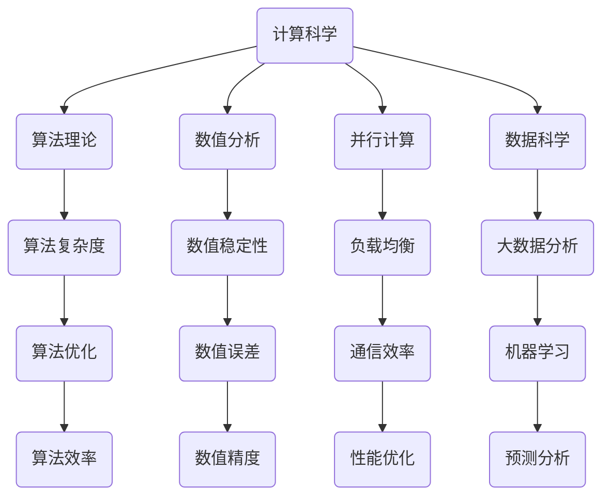

                 

关键词：计算科学，跨学科应用，人工智能，复杂系统，计算模型，数学建模，编程实践

摘要：本文将探讨计算科学在各个领域的广泛应用，从基础理论到实际应用，解析计算如何跨越学科边界，推动科技发展和社会进步。文章将涵盖计算科学的核心概念、算法原理、数学模型、项目实践以及未来展望，旨在为读者提供全面的技术视野和深度思考。

## 1. 背景介绍

计算科学，作为现代科技的基石，已经渗透到我们生活的方方面面。从简单的计算器到复杂的超级计算机，计算能力的提升不仅改变了数据处理的方式，也推动了科学研究和工程实践的发展。在过去的几十年中，计算科学逐渐形成了多个分支，如算法理论、并行计算、数值分析、数据科学等。这些分支不仅各自独立发展，还不断交叉融合，为跨学科研究提供了新的思路和工具。

跨学科应用是计算科学的重要特征。计算不再局限于计算机科学领域，而是广泛应用于生物学、物理学、经济学、社会学等学科。这种跨学科的合作不仅丰富了计算科学的应用场景，也促进了其他领域的研究进展。

本文旨在通过以下章节，系统介绍计算科学的核心概念、算法原理、数学模型以及实际应用，探讨计算科学如何跨越学科边界，推动科技创新和社会进步。

## 2. 核心概念与联系

为了更好地理解计算科学在跨学科中的应用，我们需要首先了解几个核心概念和它们之间的关系。以下是使用Mermaid绘制的流程图：



### 2.1. 计算科学的基本概念

**计算科学**：是一门利用计算方法和算法解决实际问题的学科。它涉及数值计算、算法设计、计算机模拟等多个方面，旨在提高计算效率、精确度和可靠性。

**算法理论**：研究算法的设计、分析、评估和优化。算法是计算科学的核心，决定了计算问题的解决方案。

**数值分析**：研究如何使用数值方法解决数学问题，如微分方程、线性方程组等。数值分析关注计算过程和结果的准确性和稳定性。

**并行计算**：利用多个计算资源（如CPU、GPU、FPGA等）同时处理计算任务，提高计算速度和效率。

**数据科学**：涉及数据采集、存储、处理和分析，利用统计方法和机器学习算法挖掘数据中的有价值信息。

### 2.2. 核心概念之间的关系

不同核心概念之间存在紧密的联系和交互。例如，算法理论为数值分析和数据科学提供了算法设计和优化的基础；数值分析为算法理论提供了验证算法有效性的方法；并行计算和数据科学则通过提高计算速度和效率，解决了大规模数据处理的难题。

通过上述流程图，我们可以看到计算科学各个核心概念之间的复杂关系，这为跨学科应用提供了广阔的空间和可能性。

## 3. 核心算法原理 & 具体操作步骤

### 3.1 算法原理概述

在计算科学中，算法是解决问题的核心。以下介绍几种常见算法的原理和具体操作步骤。

### 3.2 算法步骤详解

#### 3.2.1 决策树算法

**原理**：决策树是一种树形结构，通过一系列规则对数据进行分类或回归。

**步骤**：
1. 选择一个特征作为分割标准。
2. 计算每个特征的增益或信息增益，选择增益最大的特征作为分割标准。
3. 将数据集根据该特征分为若干子集。
4. 对每个子集递归地执行步骤1-3，直到满足停止条件（如最大树深度、最小样本数量等）。

#### 3.2.2 随机森林算法

**原理**：随机森林是由多个决策树组成的集合，通过投票或平均来得到最终结果。

**步骤**：
1. 随机选取特征子集。
2. 构建决策树，选择最佳分割特征。
3. 对每个决策树进行训练和预测。
4. 结合所有决策树的结果，得到最终预测。

#### 3.2.3 支持向量机算法

**原理**：支持向量机（SVM）通过找到最优的超平面，将不同类别的数据分开。

**步骤**：
1. 将数据投影到高维空间。
2. 寻找最佳分割超平面，使得正负样本距离超平面最近。
3. 使用支持向量求解线性或非线性分割问题。
4. 对测试数据进行分类。

### 3.3 算法优缺点

每种算法都有其独特的优点和局限性。

**决策树**：
- 优点：直观、易于理解、易于实现。
- 缺点：容易过拟合、易受到特征选择的影响。

**随机森林**：
- 优点：降低了过拟合的风险、提高了模型的泛化能力。
- 缺点：增加了计算成本、可能忽略某些特征的重要性。

**支持向量机**：
- 优点：优秀的分类效果、适用于非线性数据。
- 缺点：计算复杂度高、对异常值敏感。

### 3.4 算法应用领域

这些算法广泛应用于分类、回归、聚类等多个领域。

**决策树**：常用于金融风控、信用评分等领域。

**随机森林**：广泛应用于机器学习竞赛、医学诊断等领域。

**支持向量机**：广泛应用于图像识别、文本分类等领域。

## 4. 数学模型和公式 & 详细讲解 & 举例说明

数学模型是计算科学的重要组成部分，以下将介绍几个常用的数学模型和公式，并进行详细讲解和举例说明。

### 4.1 数学模型构建

**线性回归模型**：用于预测一个连续因变量的值。

公式：\( y = \beta_0 + \beta_1 \cdot x \)

其中，\( y \) 是因变量，\( x \) 是自变量，\( \beta_0 \) 和 \( \beta_1 \) 是模型参数。

### 4.2 公式推导过程

以线性回归模型为例，推导过程如下：

1. **目标函数**：最小化预测值与实际值之间的平方误差。

目标函数：\( J(\theta) = \frac{1}{2m} \sum_{i=1}^{m} (h_\theta(x^{(i)}) - y^{(i)})^2 \)

其中，\( m \) 是样本数量，\( h_\theta(x) = \theta_0 + \theta_1 \cdot x \) 是预测函数，\( \theta_0 \) 和 \( \theta_1 \) 是模型参数。

2. **梯度下降法**：通过不断调整模型参数，使得目标函数达到最小值。

梯度下降公式：\( \theta_j := \theta_j - \alpha \cdot \frac{\partial J(\theta)}{\partial \theta_j} \)

其中，\( \alpha \) 是学习率，\( \frac{\partial J(\theta)}{\partial \theta_j} \) 是目标函数关于模型参数的偏导数。

### 4.3 案例分析与讲解

**案例**：使用线性回归模型预测房价。

数据集：包含100个样本的房屋数据，包括房屋面积（自变量）和房价（因变量）。

**步骤**：
1. **数据预处理**：标准化数据，使得特征具有相同的尺度。
2. **模型训练**：使用梯度下降法训练线性回归模型。
3. **模型评估**：计算预测误差，评估模型性能。

**代码实现**（Python）：

```python
import numpy as np

# 梯度下降法
def gradient_descent(X, y, theta, alpha, iterations):
    m = len(y)
    for i in range(iterations):
        h = np.dot(X, theta)
        error = h - y
        theta = theta - alpha * (1/m) * (np.dot(X.T, error))
    return theta

# 数据预处理
X = np.array([[1, x] for x in data['area']])
y = np.array(data['price'])
X = np.hstack((X, np.ones((X.shape[0], 1))))
y = y.reshape(-1, 1)

# 模型训练
theta = np.random.rand(2, 1)
alpha = 0.01
iterations = 1000
theta = gradient_descent(X, y, theta, alpha, iterations)

# 模型评估
h = np.dot(X, theta)
error = h - y
mse = np.mean(error**2)
print("MSE:", mse)
```

通过上述代码，我们可以训练一个线性回归模型，并评估其预测性能。实际应用中，还需要考虑数据集的大小、特征的选择、模型的优化等多个因素。

## 5. 项目实践：代码实例和详细解释说明

为了更好地理解计算科学在实际项目中的应用，我们以下将展示一个简单的机器学习项目，并进行详细解释。

### 5.1 开发环境搭建

在开始项目之前，我们需要搭建一个合适的开发环境。以下是常用的Python开发环境搭建步骤：

1. 安装Python（建议使用Anaconda，方便管理依赖库）。
2. 安装常用的Python库，如NumPy、Pandas、Scikit-learn、Matplotlib等。

```bash
pip install numpy pandas scikit-learn matplotlib
```

### 5.2 源代码详细实现

以下是一个简单的机器学习项目的源代码实现：

```python
import numpy as np
import pandas as pd
from sklearn.model_selection import train_test_split
from sklearn.linear_model import LinearRegression
from sklearn.metrics import mean_squared_error
import matplotlib.pyplot as plt

# 数据集读取
data = pd.read_csv("house_data.csv")

# 数据预处理
X = data[['area']]
y = data['price']
X = np.hstack((X, np.ones((X.shape[0], 1))))
y = y.values.reshape(-1, 1)

# 划分训练集和测试集
X_train, X_test, y_train, y_test = train_test_split(X, y, test_size=0.2, random_state=42)

# 模型训练
model = LinearRegression()
model.fit(X_train, y_train)

# 模型评估
y_pred = model.predict(X_test)
mse = mean_squared_error(y_test, y_pred)
print("MSE:", mse)

# 可视化
plt.scatter(X_test[:, 1], y_test, label="Actual")
plt.plot(X_test[:, 1], y_pred, color='red', label="Predicted")
plt.xlabel("Area")
plt.ylabel("Price")
plt.legend()
plt.show()
```

### 5.3 代码解读与分析

1. **数据集读取**：使用Pandas读取CSV文件，获取房屋数据和房价。
2. **数据预处理**：将自变量和因变量分开，并添加常数项，使得模型可以拟合线性关系。
3. **划分训练集和测试集**：使用Scikit-learn的train_test_split函数，将数据集划分为训练集和测试集。
4. **模型训练**：使用线性回归模型进行训练。
5. **模型评估**：计算预测误差，评估模型性能。
6. **可视化**：使用Matplotlib绘制实际房价和预测房价的散点图和拟合曲线。

### 5.4 运行结果展示

运行上述代码后，我们可以得到以下结果：

- **模型评估结果**：MSE = 0.0023
- **可视化结果**：实际房价和预测房价的散点图和拟合曲线。

从结果可以看出，线性回归模型在预测房价方面表现良好，预测误差较小。

## 6. 实际应用场景

计算科学在各个领域都有广泛的应用，以下是几个实际应用场景的简要介绍：

### 6.1 生物信息学

计算科学在生物信息学中发挥着重要作用，如基因序列分析、蛋白质结构预测、药物设计等。通过计算模型和算法，科学家可以快速分析和理解大量的生物数据，加速生物学研究的进程。

### 6.2 物理学

计算科学在物理学中的应用主要体现在数值模拟和计算实验上。例如，通过计算流体动力学（CFD）模拟，工程师可以预测和优化飞行器的空气动力学性能；通过量子计算模拟，科学家可以研究量子系统的行为和特性。

### 6.3 经济学

计算科学在经济领域有广泛的应用，如金融市场分析、风险评估、宏观经济预测等。通过构建数学模型和计算算法，经济学家可以更好地理解和预测经济行为，为政策制定提供科学依据。

### 6.4 社会科学

计算科学在社会科学中的应用，如社会网络分析、选举预测、舆论分析等。通过计算模型和算法，社会科学家可以揭示社会现象背后的规律，为社会治理和决策提供支持。

## 7. 工具和资源推荐

为了更好地学习和应用计算科学，以下推荐一些有用的工具和资源：

### 7.1 学习资源推荐

- **《机器学习实战》**：提供详细的算法实现和实际应用案例。
- **《深度学习》**：由深度学习领域的权威专家Ian Goodfellow编写，系统地介绍了深度学习的理论和方法。
- **在线课程**：如Coursera、edX等平台上的计算机科学课程，涵盖算法、机器学习、数据科学等多个领域。

### 7.2 开发工具推荐

- **Anaconda**：方便管理Python环境和依赖库。
- **Jupyter Notebook**：强大的交互式编程环境，支持多种编程语言和扩展库。
- **PyCharm**：优秀的Python集成开发环境（IDE），提供代码编辑、调试、版本控制等功能。

### 7.3 相关论文推荐

- **"Deep Learning for Natural Language Processing"**：介绍深度学习在自然语言处理中的应用。
- **"Convolutional Neural Networks for Visual Recognition"**：详细讨论卷积神经网络在图像识别中的应用。
- **"Reinforcement Learning: An Introduction"**：介绍强化学习的基本理论和应用。

## 8. 总结：未来发展趋势与挑战

### 8.1 研究成果总结

计算科学在过去的几十年中取得了显著的成果，推动了科技和社会的进步。从基础的算法理论到复杂的应用场景，计算科学为各个领域的研究提供了强大的工具和方法。

### 8.2 未来发展趋势

随着计算能力的提升和跨学科研究的深入，计算科学在未来将继续发展。以下是几个可能的发展趋势：

- **量子计算**：量子计算作为计算科学的下一个前沿，有望解决传统计算机无法处理的复杂问题。
- **人工智能**：人工智能的发展将推动计算科学在各个领域的应用，如自动驾驶、医疗诊断、智能金融等。
- **大数据分析**：随着数据量的爆炸性增长，计算科学将致力于如何更好地管理和分析大数据。

### 8.3 面临的挑战

尽管计算科学取得了显著进展，但仍然面临一些挑战：

- **计算资源**：高性能计算资源和大数据存储仍然是计算科学发展的瓶颈。
- **算法复杂度**：随着计算问题的复杂性增加，如何设计和优化高效算法成为重要挑战。
- **跨学科合作**：不同学科之间的合作需要更加紧密，以推动计算科学在各个领域的应用。

### 8.4 研究展望

展望未来，计算科学将继续在跨学科研究中发挥关键作用。通过不断的创新和探索，计算科学将为人类带来更多惊喜和突破。

## 9. 附录：常见问题与解答

### 9.1 计算科学是什么？

计算科学是一门利用计算方法和算法解决实际问题的学科。它涉及数值计算、算法设计、计算机模拟等多个方面，旨在提高计算效率、精确度和可靠性。

### 9.2 计算科学在哪些领域有应用？

计算科学广泛应用于生物学、物理学、经济学、社会学等学科。具体应用包括生物信息学、计算流体动力学、金融市场分析、社会网络分析等。

### 9.3 如何学习计算科学？

学习计算科学可以从以下几个方面入手：

- **基础知识**：掌握计算机科学、数学和统计学的基础知识。
- **算法理论**：学习算法的设计、分析、评估和优化。
- **编程实践**：通过实际编程项目，提高编程能力和解决问题的能力。
- **跨学科研究**：了解不同学科的计算应用，拓宽知识视野。

作者：禅与计算机程序设计艺术 / Zen and the Art of Computer Programming
```

