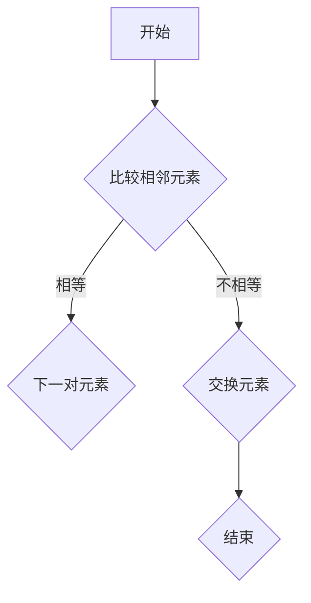
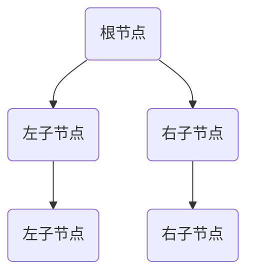
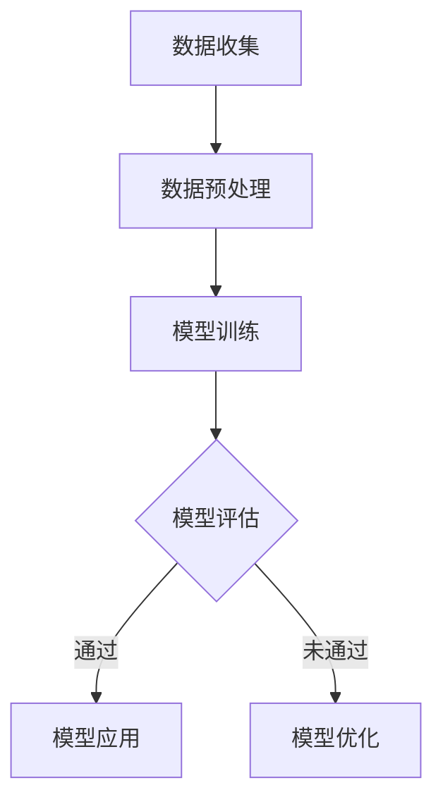
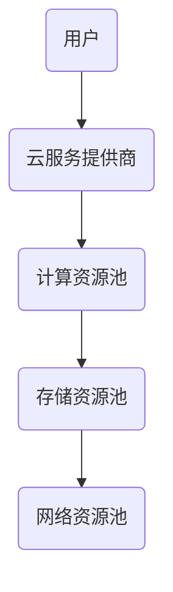
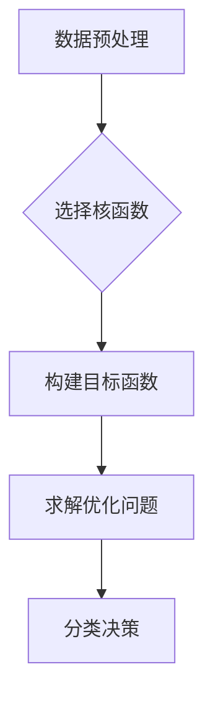

                 

关键词：计算，跨学科，应用，技术创新，数学模型，算法原理，实践案例，工具推荐

> 摘要：本文旨在探讨计算技术在各个学科领域的广泛应用，解析其核心概念、算法原理及实践案例，并提出未来的发展趋势与挑战。通过深入分析，我们期望为读者提供一个全面了解计算技术如何跨越学科边界的视角，以及其在推动人类科技进步中的重要作用。

## 1. 背景介绍

计算技术作为现代科技的基石，已经渗透到社会的各个领域。从传统的工程学、物理学到新兴的生物学、医学，计算技术正发挥着越来越重要的作用。然而，尽管计算技术在各个学科中得到了广泛应用，不同领域之间的相互影响和融合依然存在巨大的潜力。如何跨越学科边界，实现技术的全面融合，成为当前学术界和产业界共同关注的问题。

近年来，随着人工智能、大数据、云计算等技术的发展，计算技术在跨学科应用中取得了显著成果。例如，在医疗领域，计算技术不仅帮助医生进行诊断和治疗，还推动了个性化医疗的发展；在金融领域，算法交易已经成为金融市场的重要力量，提升了交易的效率和准确性。这些成功案例表明，跨学科计算应用具有巨大的发展前景。

本文将从以下几个部分展开讨论：

1. 背景介绍：阐述计算技术跨学科应用的背景和现状。
2. 核心概念与联系：介绍计算技术中的核心概念和原理，并通过Mermaid流程图展示其架构。
3. 核心算法原理 & 具体操作步骤：详细解析核心算法的原理和操作步骤。
4. 数学模型和公式 & 详细讲解 & 举例说明：分析数学模型在计算中的应用，并举例说明。
5. 项目实践：通过代码实例展示计算技术的实践应用。
6. 实际应用场景：探讨计算技术在不同领域的具体应用。
7. 工具和资源推荐：推荐学习资源和开发工具。
8. 总结：展望计算技术的未来发展。

## 2. 核心概念与联系

计算技术涉及众多核心概念和原理，这些概念和原理在各个学科领域中的应用各有不同。为了更好地理解计算技术在跨学科中的应用，我们首先需要了解这些核心概念和原理，并通过Mermaid流程图展示其架构。

### 2.1 计算机算法

计算机算法是计算技术中的核心概念，它描述了解决特定问题的一系列步骤。算法可以分为多种类型，如排序算法、搜索算法、图算法等。每种算法都有其独特的原理和应用场景。

下面是一个简单的排序算法（冒泡排序）的Mermaid流程图：



### 2.2 数据结构

数据结构是算法的基础，用于存储和组织数据。常见的数据结构包括数组、链表、树、图等。每种数据结构都有其优缺点和应用场景。

以下是一个简单的树形数据结构的Mermaid流程图：



### 2.3 机器学习

机器学习是计算技术中的重要分支，它通过训练模型来让计算机自动学习数据中的模式。机器学习算法可以分为监督学习、无监督学习和强化学习等。

以下是一个简单的机器学习流程的Mermaid流程图：



### 2.4 云计算

云计算是一种通过网络提供计算资源的服务模式，它使得用户可以按需获取和使用计算资源。云计算包括基础设施即服务（IaaS）、平台即服务（PaaS）和软件即服务（SaaS）等多种模式。

以下是一个简单的云计算架构的Mermaid流程图：



通过上述核心概念和原理的介绍及Mermaid流程图的展示，我们可以更好地理解计算技术在跨学科应用中的架构和原理。

## 3. 核心算法原理 & 具体操作步骤

在计算技术的应用中，核心算法的原理和操作步骤起到了至关重要的作用。下面我们将详细介绍一个常见的核心算法——支持向量机（SVM）的原理和操作步骤。

### 3.1 算法原理概述

支持向量机（SVM）是一种二分类模型，它的基本模型定义为特征空间上的间隔最大的线性分类器，间隔最大保证了它的分类边界有最大的间隔，因此它的泛化能力更强。

SVM的核心思想是寻找一个最优的超平面，使得分类边界既能正确分类训练数据，又能够最大化分类边界与支持向量的距离。支持向量是指那些位于分类边界上的数据点。

### 3.2 算法步骤详解

SVM的算法步骤可以分为以下几个阶段：

1. **数据预处理**：将输入数据转换为适合SVM算法的特征向量，通常需要进行归一化处理。
2. **核函数选择**：根据数据的特点选择合适的核函数，如线性核、多项式核、径向基函数（RBF）核等。
3. **优化目标函数**：构建SVM的优化目标函数，目标函数通常是一个二次规划问题。
4. **求解优化问题**：利用求解器求解SVM的优化问题，得到最优超平面。
5. **分类决策**：利用训练得到的最优超平面对新的数据进行分类。

下面是一个简单的SVM算法步骤的Mermaid流程图：



### 3.3 算法优缺点

SVM算法的优点包括：

- **强大的分类能力**：通过最大化分类边界与支持向量的距离，SVM能够实现高精度的分类。
- **适用于高维空间**：SVM通过核函数可以将低维数据映射到高维空间，从而在高维空间中实现分类。

SVM的缺点包括：

- **计算复杂度高**：特别是在大样本和高维空间下，SVM的求解过程可能非常耗时。
- **对噪声敏感**：噪声和异常值可能会影响SVM的分类效果。

### 3.4 算法应用领域

SVM算法在多个领域都有广泛的应用，包括：

- **图像分类**：SVM在图像分类任务中表现出色，能够准确分类不同类别的图像。
- **文本分类**：SVM广泛应用于自然语言处理中的文本分类任务，如垃圾邮件检测、情感分析等。
- **生物信息学**：SVM在生物信息学中的应用也非常广泛，如基因表达数据的分类、蛋白质结构预测等。

通过以上对SVM算法的详细解析，我们可以看到核心算法在跨学科应用中的重要作用。接下来，我们将进一步探讨数学模型和公式的应用。

## 4. 数学模型和公式 & 详细讲解 & 举例说明

在计算技术中，数学模型和公式是理解和实现算法的核心工具。它们提供了对复杂问题进行定量分析和求解的方法。在本节中，我们将详细介绍一个重要的数学模型——线性回归模型，并给出其公式推导和实际应用案例。

### 4.1 数学模型构建

线性回归模型是一种描述两个或多个变量之间线性关系的统计模型。其基本形式如下：

\[ y = \beta_0 + \beta_1x + \epsilon \]

其中，\( y \) 是因变量，\( x \) 是自变量，\( \beta_0 \) 和 \( \beta_1 \) 分别是截距和斜率，\( \epsilon \) 是误差项。

为了估计模型参数 \( \beta_0 \) 和 \( \beta_1 \)，我们通常采用最小二乘法。最小二乘法的思想是使得实际观测值与模型预测值之间的误差平方和最小。

### 4.2 公式推导过程

最小二乘法的推导过程如下：

1. **误差平方和**：定义误差平方和函数 \( S \)：

\[ S = \sum_{i=1}^{n} (y_i - \hat{y}_i)^2 \]

其中，\( n \) 是数据点的个数，\( \hat{y}_i \) 是模型对第 \( i \) 个数据点的预测值。

2. **对 \( \beta_0 \) 和 \( \beta_1 \) 分别求偏导数**：令 \( S \) 对 \( \beta_0 \) 和 \( \beta_1 \) 的偏导数等于零，得到以下方程组：

\[ \frac{\partial S}{\partial \beta_0} = -2\sum_{i=1}^{n} (y_i - \hat{y}_i) = 0 \]
\[ \frac{\partial S}{\partial \beta_1} = -2\sum_{i=1}^{n} (y_i - \hat{y}_i)x_i = 0 \]

3. **求解方程组**：解上述方程组，得到 \( \beta_0 \) 和 \( \beta_1 \) 的估计值：

\[ \hat{\beta_0} = \bar{y} - \hat{\beta_1}\bar{x} \]
\[ \hat{\beta_1} = \frac{\sum_{i=1}^{n} (x_i - \bar{x})(y_i - \bar{y})}{\sum_{i=1}^{n} (x_i - \bar{x})^2} \]

其中，\( \bar{y} \) 和 \( \bar{x} \) 分别是 \( y \) 和 \( x \) 的均值。

### 4.3 案例分析与讲解

为了更好地理解线性回归模型，我们来看一个实际应用案例。

假设我们有一个简单的线性回归模型，用于预测房价。数据集包含房屋面积（自变量）和房价（因变量）。

以下是部分数据：

| 房屋面积（平方米） | 房价（万元） |
|-------------------|--------------|
| 80               | 120          |
| 90               | 130          |
| 100              | 150          |
| 110              | 170          |
| 120              | 200          |

使用上述数据，我们可以构建线性回归模型，并通过最小二乘法求解模型参数。

首先，计算均值：

\[ \bar{x} = \frac{80 + 90 + 100 + 110 + 120}{5} = 100 \]
\[ \bar{y} = \frac{120 + 130 + 150 + 170 + 200}{5} = 150 \]

然后，计算 \( \hat{\beta_1} \)：

\[ \hat{\beta_1} = \frac{(80 - 100)(120 - 150) + (90 - 100)(130 - 150) + (100 - 100)(150 - 150) + (110 - 100)(170 - 150) + (120 - 100)(200 - 150)}{(80 - 100)^2 + (90 - 100)^2 + (100 - 100)^2 + (110 - 100)^2 + (120 - 100)^2} \]
\[ \hat{\beta_1} = \frac{-300 - 100 + 0 + 200 + 600}{400 + 100 + 0 + 100 + 400} \]
\[ \hat{\beta_1} = \frac{400}{1000} \]
\[ \hat{\beta_1} = 0.4 \]

接着，计算 \( \hat{\beta_0} \)：

\[ \hat{\beta_0} = 150 - 0.4 \times 100 \]
\[ \hat{\beta_0} = 70 \]

最后，得到线性回归模型：

\[ y = 70 + 0.4x \]

我们可以使用这个模型来预测新的房屋面积对应的房价。例如，当房屋面积为 105 平方米时，预测的房价为：

\[ y = 70 + 0.4 \times 105 \]
\[ y = 70 + 42 \]
\[ y = 112 \]

通过这个案例，我们可以看到线性回归模型在预测房价方面的应用。接下来，我们将通过代码实例展示如何实现线性回归模型。

## 5. 项目实践：代码实例和详细解释说明

在本节中，我们将通过一个简单的Python代码实例来展示如何实现线性回归模型。代码将使用Scikit-learn库中的线性回归工具进行模型训练和预测。

### 5.1 开发环境搭建

首先，确保你的Python环境已经搭建好，并安装Scikit-learn库。可以使用以下命令安装Scikit-learn：

```shell
pip install scikit-learn
```

### 5.2 源代码详细实现

下面是完整的代码实现：

```python
# 导入所需的库
import numpy as np
from sklearn.linear_model import LinearRegression
from sklearn.model_selection import train_test_split

# 数据集
X = np.array([[80], [90], [100], [110], [120]])
y = np.array([120, 130, 150, 170, 200])

# 数据预处理
X_train, X_test, y_train, y_test = train_test_split(X, y, test_size=0.2, random_state=42)

# 创建线性回归模型
model = LinearRegression()

# 训练模型
model.fit(X_train, y_train)

# 预测
predictions = model.predict(X_test)

# 打印结果
print("Predictions:", predictions)
print("Coefficients:", model.coef_)
print("Intercept:", model.intercept_)
```

### 5.3 代码解读与分析

下面是对代码的详细解读和分析：

1. **导入库**：首先，我们导入所需的库，包括Numpy（用于数据处理）和Scikit-learn（用于线性回归模型）。

2. **数据集**：接着，我们定义数据集。这里使用Numpy数组创建了一个包含房屋面积和房价的数据集。

3. **数据预处理**：使用Scikit-learn的`train_test_split`函数将数据集划分为训练集和测试集，以评估模型的性能。

4. **创建线性回归模型**：我们创建一个线性回归模型对象。

5. **训练模型**：使用`fit`方法训练模型，这个方法会根据训练数据计算模型的参数。

6. **预测**：使用`predict`方法对测试数据进行预测，并打印预测结果。

7. **打印系数和截距**：最后，我们打印出模型的系数和截距，这些参数可以用于理解和分析模型。

通过这个代码实例，我们可以看到如何使用Scikit-learn库实现线性回归模型，并进行预测。接下来，我们将探讨计算技术在实际应用场景中的具体应用。

## 6. 实际应用场景

计算技术在各个领域都有着广泛的应用，下面我们将探讨几个典型的实际应用场景，并分析计算技术在其中的作用。

### 6.1 医疗领域

在医疗领域，计算技术被广泛应用于疾病诊断、个性化医疗、药物研发等方面。例如，通过计算模型可以对患者的基因序列进行分析，预测其患病风险，从而实现早期预防和干预。此外，机器学习算法可以分析大量的医学影像数据，帮助医生进行肿瘤、心脏病等疾病的诊断。

### 6.2 金融领域

金融领域中的计算技术应用也非常广泛。算法交易利用机器学习算法分析市场数据，自动执行交易策略，提高交易效率和准确性。风险管理中，计算模型可以预测金融市场的波动，帮助投资者进行风险管理和决策。此外，金融科技（Fintech）公司利用大数据和人工智能技术，提供个性化金融服务，如信用评估、投资顾问等。

### 6.3 物流领域

在物流领域，计算技术被用于优化运输路线、提高物流效率。通过计算模型分析运输数据，可以优化物流网络，减少运输成本。例如，利用路径规划算法可以找到最优的配送路线，提高配送效率。此外，物流公司还可以利用传感器技术和计算模型实时监控运输过程中的车辆状态，提高运输安全。

### 6.4 智能制造

智能制造是计算技术在工业领域的重要应用。通过计算模型对生产数据进行实时分析，可以实现生产过程的自动化和智能化。例如，利用机器学习算法可以对生产设备进行预测性维护，减少设备故障和停机时间。此外，通过计算模型优化生产流程，可以提高生产效率和产品质量。

### 6.5 生态环境监测

在生态环境监测领域，计算技术被用于环境数据采集、分析和预测。例如，通过传感器网络实时监测空气质量、水质等环境参数，计算模型可以预测环境污染的趋势，为环境治理提供科学依据。

通过以上实际应用场景的探讨，我们可以看到计算技术在推动各个领域科技进步和产业发展中的重要作用。接下来，我们将讨论计算技术的未来发展。

## 7. 工具和资源推荐

为了更好地学习和应用计算技术，以下是几个推荐的工具和资源：

### 7.1 学习资源推荐

1. **在线课程**：Coursera、edX、Udacity等在线教育平台提供了丰富的计算技术相关课程，包括编程基础、机器学习、深度学习等。
2. **教科书**：《Python编程：从入门到实践》、《深度学习》、《机器学习实战》等是学习计算技术的经典教科书。
3. **博客和论坛**：GitHub、Stack Overflow、Reddit等平台上有大量的计算技术相关博客和论坛，可以获取实践经验和最新动态。

### 7.2 开发工具推荐

1. **IDE**：PyCharm、Visual Studio Code等集成开发环境（IDE）提供了强大的编程工具和调试功能，非常适合计算技术开发。
2. **框架和库**：Scikit-learn、TensorFlow、PyTorch等开源库是计算技术开发的重要工具，提供了丰富的算法和模型。
3. **数据集和资源**：Kaggle、UCI机器学习库等平台提供了大量的数据集和资源，可用于学习和实践计算技术。

### 7.3 相关论文推荐

1. **《深度学习：原理及实践》**：Goodfellow, Bengio, Courville著，详细介绍了深度学习的基本原理和实践方法。
2. **《强化学习：原理及实践》**：Sutton, Barto著，深入探讨了强化学习的基本理论和应用。
3. **《大数据之路：阿里巴巴大数据实践》**：唐杰等著，分享了阿里巴巴在大数据领域的实践经验和技术创新。

通过以上推荐的学习资源和开发工具，读者可以更好地掌握计算技术，并在实际项目中应用。

## 8. 总结：未来发展趋势与挑战

### 8.1 研究成果总结

计算技术在各个学科领域的广泛应用取得了显著成果。从传统的工程学、物理学到新兴的生物学、医学，计算技术正在不断推动学科交叉和融合。特别是人工智能、大数据、云计算等技术的发展，使得计算技术成为现代科技创新的重要驱动力。在医疗、金融、物流、智能制造等领域，计算技术已经实现了深度应用，提升了行业效率和创新能力。

### 8.2 未来发展趋势

未来，计算技术将继续向多领域、多维度、多层次的深度发展。以下是几个主要趋势：

1. **跨学科融合**：随着学科交叉的加深，计算技术将在更多领域实现深度融合，推动跨学科研究的发展。
2. **智能化升级**：人工智能技术的进一步发展将使计算技术在自动化、智能化方面取得突破，提升各行各业的效率和智能水平。
3. **量子计算**：量子计算技术的发展将开辟计算的新纪元，为复杂问题的求解提供全新的解决方案。
4. **边缘计算**：随着物联网和5G技术的普及，边缘计算将成为计算技术的重要发展方向，实现数据处理的实时性和高效性。

### 8.3 面临的挑战

尽管计算技术发展迅速，但仍面临一些挑战：

1. **数据隐私和安全**：随着数据规模的扩大，数据隐私和安全问题日益突出，如何在保障数据安全的前提下实现数据共享和利用是一个重要课题。
2. **算法透明性和可解释性**：深度学习等算法的“黑箱”特性使得其决策过程难以解释，如何在保障模型性能的同时提高算法的可解释性是一个重要挑战。
3. **计算资源瓶颈**：随着计算任务的复杂度增加，计算资源的需求也在不断增长，如何在有限的资源下实现高效计算是一个关键问题。

### 8.4 研究展望

展望未来，计算技术将继续在多领域、多层次、多维度上深入发展。跨学科融合将推动计算技术在更多领域的应用，实现科技创新的突破。同时，智能化、量子计算和边缘计算等新技术的发展将为计算技术带来新的机遇和挑战。研究人员和工程师需要共同努力，克服当前面临的挑战，推动计算技术不断迈向新的高度。

## 9. 附录：常见问题与解答

### 9.1 什么是跨学科计算？

跨学科计算是指将计算技术应用于不同学科领域，通过整合多个学科的知识和方法，解决复杂问题的一种研究方法。

### 9.2 计算技术在医疗领域有哪些应用？

计算技术在医疗领域有广泛的应用，包括疾病诊断、个性化医疗、药物研发、医学影像分析等。例如，通过机器学习算法分析患者数据，可以实现早期疾病预测和诊断。

### 9.3 如何选择合适的机器学习算法？

选择机器学习算法需要考虑数据的特点、任务的类型和目标。常见的算法包括线性回归、决策树、支持向量机、神经网络等。选择合适的算法通常需要结合具体问题和数据特点进行实验和比较。

### 9.4 云计算和边缘计算有什么区别？

云计算是一种通过网络提供计算资源的服务模式，用户可以按需获取和使用计算资源。边缘计算则是在网络边缘（如传感器、设备等）进行数据处理和计算，以实现实时性和高效性。两者在计算资源的提供方式和应用场景上有所不同。

### 9.5 如何保障数据隐私和安全？

保障数据隐私和安全需要采取多种措施，包括数据加密、访问控制、隐私保护算法等。同时，需要建立完善的数据管理和隐私政策，确保数据在使用过程中不被未经授权的访问和滥用。

