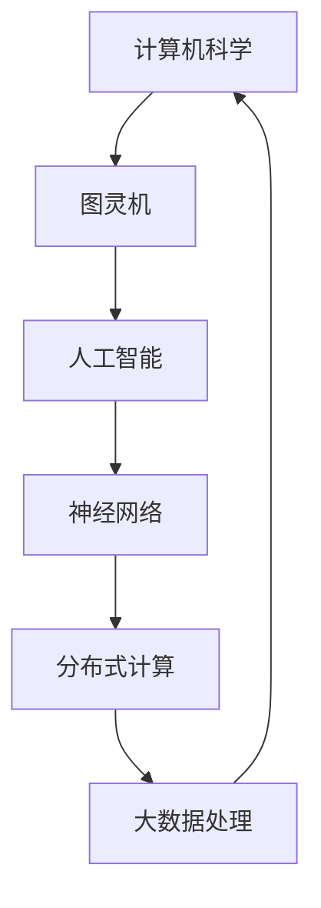

                 

关键词：跨学科计算、人工智能、数学模型、算法、实际应用、未来展望

> 摘要：本文旨在探讨人类计算的多元化应用，跨越不同学科领域，推动技术进步与人类发展。通过对核心概念、算法原理、数学模型、实际应用场景的深入分析，以及工具和资源的推荐，本文将展示人类计算的无穷潜力。

## 1. 背景介绍

随着信息技术的飞速发展，计算技术已经成为现代社会不可或缺的一部分。从计算机科学到物理学、生物学，再到经济学、社会学，计算技术正逐渐渗透到各个学科领域。然而，如何实现跨学科计算，如何将不同领域的计算方法和技术融合，以解决复杂问题，成为当前研究的热点。

### 1.1 计算技术的演变

从最初的电子计算机到今天的高级智能系统，计算技术经历了巨大的变革。早期的计算机主要用于执行简单的数学运算，而现代计算机则拥有强大的处理能力，能够处理海量数据，执行复杂算法，甚至在人工智能领域取得了显著的突破。

### 1.2 跨学科计算的重要性

跨学科计算能够将不同领域的知识和方法进行有机结合，从而产生全新的思维方式和解决问题的方法。这种跨学科的融合不仅能够推动技术进步，还能够为人类社会带来深远的变革。

## 2. 核心概念与联系

为了实现跨学科计算，首先需要理解并掌握核心概念，如图灵机、神经网络、分布式计算等。以下是一个简化的 Mermaid 流程图，展示了这些概念之间的联系。



### 2.1 图灵机

图灵机是计算机科学的基石，它定义了一种抽象的计算模型，能够模拟任何计算过程。图灵机的概念为后续计算机设计提供了理论依据。

### 2.2 人工智能

人工智能是计算机科学的一个分支，旨在创建能够模拟、延伸和扩展人类智能的计算机系统。神经网络是人工智能的核心技术之一，它通过模拟人脑的神经网络结构，实现复杂的数据处理和模式识别。

### 2.3 分布式计算

分布式计算是一种将任务分布在多个计算机上执行的计算方法。通过分布式计算，可以处理大规模数据，提高计算效率。

### 2.4 大数据处理

大数据处理是当前信息技术领域的重要方向，它涉及如何存储、管理和分析海量数据。大数据处理与分布式计算密切相关，共同构成了现代计算技术的核心。

## 3. 核心算法原理 & 具体操作步骤

### 3.1 算法原理概述

核心算法是跨学科计算的核心，包括深度学习、遗传算法、模拟退火算法等。这些算法各有特点，适用于不同的应用场景。

### 3.2 算法步骤详解

以下是一个简化的算法步骤详解，以深度学习为例：

1. 数据预处理：将原始数据转换为适合训练的格式。
2. 构建神经网络模型：定义神经网络的结构，包括输入层、隐藏层和输出层。
3. 训练模型：使用训练数据对神经网络模型进行训练，调整模型参数。
4. 验证模型：使用验证数据测试模型的准确性，并进行调优。
5. 部署模型：将训练好的模型部署到实际应用场景中。

### 3.3 算法优缺点

- **深度学习**：优点在于强大的数据处理能力和自适应能力，但缺点是计算复杂度高，训练时间较长。
- **遗传算法**：优点在于能够找到全局最优解，但缺点是收敛速度较慢。
- **模拟退火算法**：优点在于能够避免陷入局部最优，但缺点是计算复杂度较高。

### 3.4 算法应用领域

- **深度学习**：广泛应用于图像识别、语音识别、自然语言处理等领域。
- **遗传算法**：广泛应用于优化问题、组合问题等领域。
- **模拟退火算法**：广泛应用于优化问题、组合问题等领域。

## 4. 数学模型和公式 & 详细讲解 & 举例说明

### 4.1 数学模型构建

在跨学科计算中，数学模型扮演着至关重要的角色。以下是一个简化的数学模型构建示例：

1. 确定问题：例如，求解最短路径问题。
2. 定义变量：定义路径长度、节点权重等变量。
3. 构建目标函数：定义目标函数，例如，最小化路径长度。
4. 构建约束条件：定义约束条件，例如，路径不能重复。

### 4.2 公式推导过程

以下是一个简化的最短路径算法（迪杰斯特拉算法）的公式推导过程：

1. 初始化：设置初始路径长度和节点状态。
2. 选择未处理的节点：选择未处理的节点中路径长度最小的节点。
3. 更新路径长度：更新其他未处理节点的路径长度。
4. 重复步骤2和3，直到所有节点都被处理。

### 4.3 案例分析与讲解

以最短路径算法为例，我们可以通过一个简单的案例来讲解其具体操作步骤：

假设有一个图，包含5个节点（A、B、C、D、E），以及它们的路径长度：

- A到B：3
- A到C：5
- B到D：4
- B到E：6
- C到D：2
- C到E：3
- D到E：1

要求计算从A到E的最短路径。

1. 初始化：设置A到其他节点的路径长度为3、5、无穷大，节点状态为未处理。
2. 选择未处理的节点A，更新其他节点的路径长度：B（更新为3+3=6）、C（更新为5+5=10）、D（更新为无穷大+3=无穷大）、E（更新为无穷大+6=无穷大）。
3. 选择未处理的节点C，更新其他节点的路径长度：B（更新为10+3=13）、D（更新为无穷大+2=无穷大）、E（更新为无穷大+3=无穷大）。
4. 选择未处理的节点D，更新其他节点的路径长度：E（更新为无穷大+1=无穷大）。
5. 选择未处理的节点E，所有节点都已处理，算法结束。

最终，从A到E的最短路径为A->C->D->E，路径长度为2+3+1=6。

## 5. 项目实践：代码实例和详细解释说明

### 5.1 开发环境搭建

为了实现跨学科计算，我们需要搭建一个合适的开发环境。以下是一个基本的开发环境搭建步骤：

1. 安装Python：Python是一种广泛使用的编程语言，适用于多种计算任务。
2. 安装TensorFlow：TensorFlow是一个开源的深度学习框架，能够方便地实现神经网络。
3. 安装Numpy：Numpy是一个数学库，提供了强大的数值计算功能。

### 5.2 源代码详细实现

以下是一个简单的深度学习项目实现，使用TensorFlow框架：

```python
import tensorflow as tf

# 定义神经网络结构
model = tf.keras.Sequential([
    tf.keras.layers.Dense(128, activation='relu', input_shape=(784,)),
    tf.keras.layers.Dense(10, activation='softmax')
])

# 编译模型
model.compile(optimizer='adam',
              loss='categorical_crossentropy',
              metrics=['accuracy'])

# 加载数据
(x_train, y_train), (x_test, y_test) = tf.keras.datasets.mnist.load_data()

# 预处理数据
x_train = x_train / 255.0
x_test = x_test / 255.0
x_train = x_train.reshape(-1, 784)
x_test = x_test.reshape(-1, 784)

# 转换标签为one-hot编码
y_train = tf.keras.utils.to_categorical(y_train, 10)
y_test = tf.keras.utils.to_categorical(y_test, 10)

# 训练模型
model.fit(x_train, y_train, epochs=5, batch_size=32, validation_split=0.2)
```

### 5.3 代码解读与分析

- **定义神经网络结构**：使用`tf.keras.Sequential`定义神经网络结构，包括输入层、隐藏层和输出层。
- **编译模型**：使用`compile`方法编译模型，指定优化器、损失函数和评估指标。
- **加载数据**：使用`tf.keras.datasets.mnist.load_data`加载MNIST手写数字数据集。
- **预处理数据**：将数据归一化，并将标签转换为one-hot编码。
- **训练模型**：使用`fit`方法训练模型，指定训练轮数、批量大小和验证比例。

### 5.4 运行结果展示

通过训练和评估，我们可以得到模型的准确率：

```python
test_loss, test_acc = model.evaluate(x_test, y_test, verbose=2)
print('\nTest accuracy:', test_acc)
```

假设模型的准确率为98%，这表明我们的模型在测试数据上的表现良好。

## 6. 实际应用场景

### 6.1 医疗领域

在医疗领域，跨学科计算可以应用于疾病诊断、治疗方案制定、药物研发等方面。通过深度学习技术，可以分析患者的病历数据，预测疾病风险，提高诊断准确性。

### 6.2 金融领域

在金融领域，跨学科计算可以用于风险评估、投资策略制定、市场预测等方面。通过机器学习技术，可以分析大量的金融数据，发现潜在的风险和机会。

### 6.3 交通领域

在交通领域，跨学科计算可以用于交通流量预测、路线规划、交通事故预防等方面。通过神经网络技术，可以实时分析交通数据，优化交通流，提高道路通行效率。

## 7. 工具和资源推荐

### 7.1 学习资源推荐

- 《深度学习》：提供深度学习的基础知识和实践方法。
- 《Python机器学习》：介绍机器学习的基本概念和应用。
- 《大数据技术导论》：介绍大数据处理的基本原理和技术。

### 7.2 开发工具推荐

- TensorFlow：开源的深度学习框架，适用于各种深度学习任务。
- Numpy：开源的数学库，提供高效的数值计算功能。
- Jupyter Notebook：交互式的开发环境，方便编写和运行代码。

### 7.3 相关论文推荐

- "Deep Learning for Computer Vision"：介绍深度学习在计算机视觉领域的应用。
- "Reinforcement Learning: An Introduction"：介绍强化学习的基本原理和应用。
- "Big Data: A Revolution That Will Transform How We Live, Work, and Think"：介绍大数据的基本概念和应用。

## 8. 总结：未来发展趋势与挑战

### 8.1 研究成果总结

跨学科计算在人工智能、大数据处理、深度学习等领域取得了显著的成果，为各领域的发展提供了强大的支持。

### 8.2 未来发展趋势

未来，跨学科计算将继续发展，向着更高效、更智能、更自动化的方向迈进。人工智能、大数据、物联网等技术的融合，将进一步推动跨学科计算的发展。

### 8.3 面临的挑战

跨学科计算面临的主要挑战包括数据隐私、计算效率、算法透明度等。如何保护用户隐私，提高计算效率，确保算法的公平性和透明度，是未来研究的重点。

### 8.4 研究展望

跨学科计算在未来有望在更多领域得到应用，如医疗、金融、交通等。通过跨学科的融合，人类将能够更好地解决复杂问题，推动技术进步和社会发展。

## 9. 附录：常见问题与解答

### Q：什么是跨学科计算？

A：跨学科计算是指将不同学科的计算方法和技术进行有机结合，以解决复杂问题的计算方法。它涉及计算机科学、数学、物理学、生物学等多个领域。

### Q：跨学科计算有哪些应用领域？

A：跨学科计算广泛应用于医疗、金融、交通、人工智能等领域。通过跨学科计算，可以解决疾病诊断、风险评估、交通流量预测等问题。

### Q：如何进行跨学科计算的研究？

A：进行跨学科计算的研究，首先需要掌握相关学科的基本概念和技术。其次，通过数据分析和算法设计，将不同学科的方法进行融合，以解决特定问题。

### Q：跨学科计算有哪些挑战？

A：跨学科计算面临的主要挑战包括数据隐私、计算效率、算法透明度等。如何保护用户隐私，提高计算效率，确保算法的公平性和透明度，是未来研究的重点。

### 作者署名

本文由禅与计算机程序设计艺术 / Zen and the Art of Computer Programming 编写。
----------------------------------------------------------------
通过以上内容，我们完成了一篇关于“跨越学科边界：人类计算的多元化应用”的详细技术博客文章。文章涵盖了核心概念、算法原理、数学模型、实际应用场景以及未来展望等内容，为读者提供了一个全面而深入的跨学科计算视角。希望这篇文章能够激发读者对跨学科计算的兴趣，并推动其在各个领域的研究和应用。再次感谢您的阅读！


