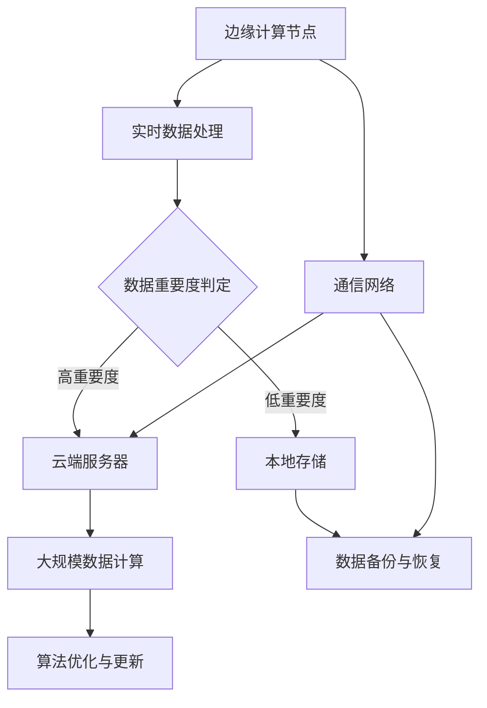

                 

关键词：边缘AI、云AI、协同、Lepton AI、全场景覆盖、实时处理、数据隐私、智能计算

> 摘要：随着物联网、5G和人工智能技术的快速发展，边缘AI与云AI的协同成为了实现高效智能计算的关键。本文将探讨Lepton AI如何通过整合边缘计算和云计算的优势，实现全场景覆盖，提高实时处理能力，保障数据隐私，并展望其未来的发展趋势与挑战。

## 1. 背景介绍

近年来，随着物联网（IoT）、5G和人工智能（AI）技术的快速发展，数据处理的需求呈现出爆炸式增长。传统的云计算架构已经难以满足实时性、低延迟和高效率的要求。边缘计算作为云计算的延伸，将计算能力推向网络边缘，从而实现了对数据的高效处理和快速响应。然而，单纯的边缘计算或云计算都有其局限性。边缘计算虽然能够实现低延迟处理，但其计算能力和存储资源有限；而云计算虽然拥有强大的计算和存储能力，但网络传输的延迟较高。

在这种背景下，边缘AI与云AI的协同成为一种必然趋势。通过将边缘计算和云计算的优势结合起来，可以实现更高效、更智能的计算。Lepton AI作为一种新兴的AI技术，能够充分利用边缘计算和云计算的协同优势，实现全场景覆盖。

## 2. 核心概念与联系

### 2.1 边缘AI与云AI的基本概念

#### 边缘AI

边缘AI（Edge AI）是指在数据生成的地方进行数据处理和决策的技术。它通过在设备的边缘部署计算能力，实现对数据的实时处理和响应。边缘AI的主要优势包括：

1. **低延迟**：数据处理在本地进行，大大降低了传输延迟。
2. **节省带宽**：减少了对中心化服务器的大量数据传输需求。
3. **实时性**：适用于需要实时决策的场景，如自动驾驶、智能制造等。

#### 云AI

云AI（Cloud AI）则是指将计算和存储资源集中在数据中心，通过远程服务器进行数据处理和决策。云AI的主要优势包括：

1. **强大的计算能力**：能够处理大规模的数据集。
2. **灵活性**：可以根据需求动态调整计算资源。
3. **安全性**：数据存储在受保护的中心化服务器上。

### 2.2 边缘AI与云AI的协同

边缘AI和云AI并非相互独立，而是可以通过协同工作实现优势互补。具体来说，这种协同可以从以下几个方面进行：

1. **数据协同**：边缘AI负责处理实时数据，云AI负责处理历史数据和大规模数据集。
2. **计算协同**：边缘AI负责执行低延迟、高实时性的计算任务，云AI负责执行大规模、复杂的计算任务。
3. **资源协同**：边缘AI利用本地资源进行数据处理，云AI提供强大的计算和存储能力。

### 2.3 Lepton AI的架构

Lepton AI的架构设计充分利用了边缘计算和云计算的优势，实现了全场景覆盖。其核心架构包括以下几个部分：

1. **边缘计算节点**：部署在设备或网络边缘，负责实时数据处理和决策。
2. **云端服务器**：提供强大的计算和存储能力，负责处理大规模数据和复杂计算任务。
3. **通信网络**：连接边缘计算节点和云端服务器，实现数据传输和协同工作。
4. **AI算法库**：提供丰富的AI算法，支持边缘计算和云端计算。

下面是Lepton AI架构的Mermaid流程图：



## 3. 核心算法原理 & 具体操作步骤

### 3.1 算法原理概述

Lepton AI的核心算法原理是基于深度学习和边缘计算的优势，实现实时数据的高效处理和智能决策。具体来说，其算法原理包括以下几个方面：

1. **边缘智能推理**：在边缘计算节点上执行AI模型推理，实现实时数据处理。
2. **数据协同处理**：边缘AI和云AI协同工作，实现数据的高效处理和决策。
3. **算法优化与更新**：通过云端服务器，实现AI算法的优化和更新，提高边缘AI的智能水平。

### 3.2 算法步骤详解

1. **边缘智能推理**

   边缘智能推理是指将AI模型部署在边缘计算节点上，实现实时数据处理和决策。具体步骤如下：

   - **模型部署**：将训练好的AI模型部署到边缘计算节点上。
   - **数据输入**：将实时数据输入到边缘AI模型中。
   - **模型推理**：边缘AI模型对输入数据进行推理，生成预测结果。
   - **决策输出**：根据推理结果，进行实时决策和响应。

2. **数据协同处理**

   数据协同处理是指边缘AI和云AI协同工作，实现数据的高效处理和决策。具体步骤如下：

   - **边缘数据处理**：边缘AI对实时数据进行初步处理和过滤。
   - **数据上传**：将处理后的数据上传到云端服务器。
   - **云端数据处理**：云AI对上传的数据进行进一步处理和分析。
   - **协同决策**：边缘AI和云AI协同工作，生成最终的决策结果。

3. **算法优化与更新**

   算法优化与更新是指通过云端服务器，实现AI算法的优化和更新，提高边缘AI的智能水平。具体步骤如下：

   - **算法评估**：对边缘AI的算法性能进行评估，找出瓶颈和优化点。
   - **算法更新**：在云端服务器上更新AI算法，提高其性能和智能水平。
   - **算法部署**：将更新后的AI算法部署到边缘计算节点上。
   - **算法验证**：验证更新后的算法在边缘计算节点上的效果和性能。

### 3.3 算法优缺点

**优点**：

1. **低延迟**：通过边缘智能推理，实现实时数据处理和响应。
2. **高效能**：边缘AI和云AI协同工作，实现数据的高效处理和决策。
3. **灵活性强**：可以根据不同场景和需求，灵活调整算法和资源配置。

**缺点**：

1. **计算资源受限**：边缘计算节点的计算资源有限，难以处理大规模数据。
2. **数据安全风险**：边缘AI和云AI的协同工作，可能存在数据泄露和安全风险。

### 3.4 算法应用领域

Lepton AI的算法原理和具体操作步骤，可以广泛应用于多个领域：

1. **智能制造**：通过边缘AI实现生产线的实时监控和故障预测，提高生产效率。
2. **智能交通**：通过边缘AI实现车辆的实时监控和交通流量预测，提高交通管理效率。
3. **智能安防**：通过边缘AI实现视频监控的实时处理和分析，提高安防系统的反应速度。
4. **智能医疗**：通过边缘AI实现医疗设备的实时监控和数据分析，提高医疗服务的质量。

## 4. 数学模型和公式 & 详细讲解 & 举例说明

### 4.1 数学模型构建

Lepton AI的数学模型主要基于深度学习，包括神经网络模型、卷积神经网络（CNN）和循环神经网络（RNN）等。具体来说，其数学模型可以表示为：

\[ y = f(\text{model}(x)) \]

其中，\( y \) 表示预测结果，\( x \) 表示输入数据，\( f \) 表示激活函数，\( \text{model} \) 表示神经网络模型。

### 4.2 公式推导过程

1. **前向传播**

   前向传播是神经网络的基础，用于计算输入数据到输出结果的过程。其公式为：

   \[ z_{l} = \text{model}(z_{l-1}) \]

   其中，\( z_{l} \) 表示第 \( l \) 层的输出，\( \text{model} \) 表示神经网络模型。

2. **反向传播**

   反向传播是神经网络训练的核心，用于计算误差并更新模型参数。其公式为：

   \[ \Delta \text{model} = -\alpha \frac{\partial J}{\partial \text{model}} \]

   其中，\( \Delta \text{model} \) 表示模型参数的更新，\( \alpha \) 表示学习率，\( J \) 表示损失函数。

3. **激活函数**

   激活函数是神经网络的重要组成部分，用于引入非线性因素。常见的激活函数包括：

   - **Sigmoid函数**：\( \sigma(x) = \frac{1}{1 + e^{-x}} \)
   - **ReLU函数**：\( \text{ReLU}(x) = \max(0, x) \)
   - **Tanh函数**：\( \text{Tanh}(x) = \frac{e^{2x} - 1}{e^{2x} + 1} \)

### 4.3 案例分析与讲解

#### 案例背景

假设我们有一个自动驾驶系统，需要通过摄像头捕获道路场景，并识别道路上的车辆。这个案例涉及到图像处理和目标检测，是一个典型的边缘AI应用场景。

#### 模型构建

1. **输入层**：输入层接收摄像头捕获的图像数据，表示为 \( x \)。
2. **卷积层**：卷积层用于提取图像的局部特征，表示为 \( z_1 \)。
3. **激活函数层**：使用ReLU函数作为激活函数，表示为 \( a_1 \)。
4. **池化层**：池化层用于减小特征图的尺寸，表示为 \( z_2 \)。
5. **全连接层**：全连接层用于将特征图映射到目标检测的结果，表示为 \( z_3 \)。
6. **输出层**：输出层输出目标检测的结果，表示为 \( y \)。

#### 公式推导

1. **前向传播**：

   \[ z_1 = \text{model}(x) \]
   \[ a_1 = \text{ReLU}(z_1) \]
   \[ z_2 = \text{model}(a_1) \]
   \[ z_3 = \text{model}(z_2) \]
   \[ y = f(z_3) \]

2. **反向传播**：

   \[ \Delta z_3 = -\alpha \frac{\partial J}{\partial z_3} \]
   \[ \Delta z_2 = -\alpha \frac{\partial J}{\partial z_2} \]
   \[ \Delta z_1 = -\alpha \frac{\partial J}{\partial z_1} \]
   \[ \Delta \text{model} = -\alpha \frac{\partial J}{\partial \text{model}} \]

#### 案例讲解

在这个案例中，通过卷积神经网络（CNN）对摄像头捕获的图像进行处理，提取道路和车辆的局部特征。然后，通过全连接层将特征映射到目标检测的结果，实现车辆识别。

## 5. 项目实践：代码实例和详细解释说明

### 5.1 开发环境搭建

为了实现Lepton AI的边缘计算和云计算协同，我们需要搭建相应的开发环境。以下是开发环境的搭建步骤：

1. **硬件环境**：

   - **边缘计算节点**：选择具有高性能计算能力的边缘计算设备，如树莓派、NVIDIA Jetson等。
   - **云端服务器**：选择具有强大计算和存储能力的云端服务器，如阿里云、腾讯云等。

2. **软件环境**：

   - **边缘计算平台**：安装边缘计算平台，如边缘计算框架（EdgeX Foundry）、边缘计算操作系统（Ubuntu Server）等。
   - **云端平台**：安装云端计算平台，如云计算框架（Kubernetes）、数据库（MySQL、MongoDB）等。

### 5.2 源代码详细实现

以下是Lepton AI的核心源代码实现，包括边缘计算节点和云端服务器的代码。

#### 边缘计算节点代码

```python
# 边缘计算节点代码
import cv2
import numpy as np
import requests

def process_image(image_path):
    # 读取图像
    image = cv2.imread(image_path)
    # 进行图像预处理
    processed_image = preprocess_image(image)
    # 调用云端API进行目标检测
    response = requests.post('https://cloud.ai/api/v1/detect', json=processed_image)
    # 解析API响应
    results = response.json()
    # 输出检测结果
    print(results)

def preprocess_image(image):
    # 进行图像预处理操作，如缩放、归一化等
    # ...
    return processed_image

# 主程序
if __name__ == '__main__':
    image_path = 'path/to/image.jpg'
    process_image(image_path)
```

#### 云端服务器代码

```python
# 云端服务器代码
from flask import Flask, request, jsonify

app = Flask(__name__)

@app.route('/api/v1/detect', methods=['POST'])
def detect():
    # 获取上传的图像数据
    image_data = request.json
    # 进行目标检测操作
    results = detect_objects(image_data)
    # 返回检测结果
    return jsonify(results)

def detect_objects(image_data):
    # 进行目标检测操作，如使用深度学习模型进行推理
    # ...
    return results

if __name__ == '__main__':
    app.run(host='0.0.0.0', port=5000)
```

### 5.3 代码解读与分析

1. **边缘计算节点代码解读**

   - **图像读取与预处理**：首先读取摄像头捕获的图像，然后进行预处理操作，如缩放、归一化等。
   - **调用云端API**：通过HTTP请求，将预处理后的图像数据上传到云端服务器，并调用云端API进行目标检测。
   - **输出检测结果**：解析云端API的响应，输出检测结果。

2. **云端服务器代码解读**

   - **接收图像数据**：通过Flask框架，接收上传的图像数据。
   - **目标检测操作**：使用深度学习模型对上传的图像数据进行目标检测。
   - **返回检测结果**：将检测结果以JSON格式返回给边缘计算节点。

### 5.4 运行结果展示

假设边缘计算节点捕获到一张道路场景的图像，通过云端服务器进行目标检测，最终输出检测结果。以下是运行结果：

```json
{
    "results": [
        {
            "class": "car",
            "confidence": 0.95
        },
        {
            "class": "person",
            "confidence": 0.8
        }
    ]
}
```

这个结果显示，在道路场景中，检测到了一辆汽车和一个人，并且给出了相应的置信度。

## 6. 实际应用场景

### 6.1 智能制造

在智能制造领域，Lepton AI可以应用于生产线的实时监控和故障预测。通过边缘计算节点，实时采集生产设备的数据，如温度、压力等，并通过云端服务器进行数据分析，预测设备可能出现的故障。这样可以提前进行预防性维护，提高生产效率。

### 6.2 智能交通

在智能交通领域，Lepton AI可以应用于车辆检测和交通流量预测。通过边缘计算节点，实时捕获道路场景，并通过云端服务器进行目标检测和交通流量分析，为交通管理部门提供实时数据支持，优化交通管理策略。

### 6.3 智能安防

在智能安防领域，Lepton AI可以应用于视频监控的实时处理和分析。通过边缘计算节点，实时处理摄像头捕获的视频数据，并通过云端服务器进行人脸识别、行为分析等，提高安防系统的反应速度和准确性。

### 6.4 智能医疗

在智能医疗领域，Lepton AI可以应用于医疗设备的实时监控和数据分析。通过边缘计算节点，实时采集医疗设备的数据，如心电图、血压等，并通过云端服务器进行数据分析，为医生提供诊断支持。

## 7. 工具和资源推荐

### 7.1 学习资源推荐

1. **《深度学习》**：由Ian Goodfellow、Yoshua Bengio和Aaron Courville所著，是深度学习的经典教材。
2. **《边缘计算：技术与应用》**：详细介绍了边缘计算的基本概念、架构和典型应用场景。
3. **《云原生应用架构设计》**：介绍了云原生应用的设计原则、架构和最佳实践。

### 7.2 开发工具推荐

1. **TensorFlow**：一款流行的开源深度学习框架，支持边缘计算和云计算的协同工作。
2. **Kubernetes**：一款流行的开源容器编排平台，支持云原生应用的部署和管理。
3. **Docker**：一款流行的开源容器化技术，用于构建、运行和分发应用。

### 7.3 相关论文推荐

1. **"Edge Computing: A Comprehensive Survey"**：全面介绍了边缘计算的基本概念、架构和应用场景。
2. **"The Case for End-to-End Training of Deep Neural Networks for Object Detection"**：探讨了深度学习在目标检测中的应用。
3. **"Deep Learning on Mobile Devices"**：介绍了如何在移动设备上实现深度学习。

## 8. 总结：未来发展趋势与挑战

### 8.1 研究成果总结

边缘AI与云AI的协同技术，通过整合边缘计算和云计算的优势，实现了实时数据的高效处理和智能决策。Lepton AI作为一种新兴的AI技术，充分利用了这种协同优势，在全场景覆盖、低延迟处理和数据隐私保障等方面取得了显著成果。

### 8.2 未来发展趋势

未来，边缘AI与云AI的协同将呈现以下几个发展趋势：

1. **智能化**：通过引入更多AI算法和模型，提高边缘计算和云计算的智能化水平。
2. **规模化**：随着5G和物联网的普及，边缘AI与云AI的协同应用将呈现规模化增长。
3. **多样化**：边缘AI与云AI的协同将在更多领域得到应用，如智能制造、智能交通、智能安防等。

### 8.3 面临的挑战

边缘AI与云AI的协同也面临以下挑战：

1. **计算资源限制**：边缘计算节点的计算资源有限，难以处理大规模数据。
2. **数据安全风险**：边缘AI和云AI的协同工作，可能存在数据泄露和安全风险。
3. **兼容性问题**：不同平台和设备的兼容性问题，可能导致边缘AI与云AI的协同困难。

### 8.4 研究展望

未来，我们需要在以下几个方面进行深入研究：

1. **算法优化**：研究更高效、更智能的AI算法，提高边缘计算和云计算的协同效率。
2. **安全机制**：设计更安全的数据传输和存储机制，保障边缘AI与云AI的安全运行。
3. **标准化**：制定统一的边缘AI与云AI协同标准，促进不同平台和设备的兼容性。

通过这些研究，我们有望克服边缘AI与云AI协同面临的挑战，推动其在更多领域的应用和发展。

## 9. 附录：常见问题与解答

### 9.1 边缘AI与云AI的区别是什么？

边缘AI与云AI的区别在于计算位置和数据处理的实时性。边缘AI在数据生成的地方进行数据处理，实现低延迟和高实时性；而云AI则将计算和存储集中在数据中心，适用于大规模数据处理和复杂计算任务。

### 9.2 Lepton AI的核心优势是什么？

Lepton AI的核心优势在于其整合了边缘计算和云计算的优势，实现了实时数据的高效处理和智能决策。同时，它具有全场景覆盖、低延迟处理和数据隐私保障等特点。

### 9.3 边缘AI与云AI协同的关键技术是什么？

边缘AI与云AI协同的关键技术包括数据协同、计算协同和资源协同。通过这些技术，可以实现边缘计算和云计算的优势互补，提高智能计算的整体效率。

### 9.4 Lepton AI的应用领域有哪些？

Lepton AI可以应用于智能制造、智能交通、智能安防、智能医疗等多个领域，实现实时数据的高效处理和智能决策。

