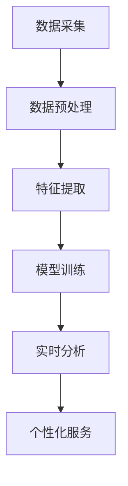
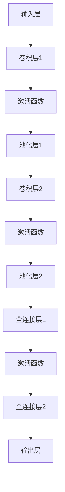

                 

随着科技的快速发展，人工智能（AI）技术已经深入到我们生活的各个方面。其中，边缘AI作为分布式计算的一种形式，正在成为未来智能系统的关键组成部分。本文将探讨边缘AI在注意力实时分析中的应用，旨在揭示其带来的技术优势和创新潜力。

> 关键词：边缘AI，注意力实时分析，分布式计算，智能系统，创新应用

> 摘要：本文首先介绍了边缘AI的概念和背景，然后详细探讨了注意力实时分析的核心原理和挑战。接着，本文分析了边缘AI在注意力实时分析中的作用，展示了其如何提高数据处理效率、降低延迟、提升系统的实时性。最后，本文对未来边缘AI在注意力实时分析中的应用前景进行了展望。

## 1. 背景介绍

### 1.1 边缘AI的概念

边缘AI是指将计算和存储资源部署在靠近数据源的边缘节点上，以实现数据的本地处理和分析。与传统的云计算相比，边缘AI具有响应速度快、计算延迟低、数据传输带宽占用小等优势。

### 1.2 边缘AI的发展背景

随着物联网（IoT）和智能设备的普及，产生了海量的数据。然而，这些数据往往分布在广泛的区域内，传统的云计算中心难以胜任数据的处理和分析任务。边缘AI的出现，为解决这一问题提供了新的思路。

### 1.3 边缘AI的优势

边缘AI的主要优势包括：

- **低延迟**：数据在边缘节点处理，减少了数据传输的距离，从而降低了延迟。
- **高可靠性**：边缘节点分布广泛，降低了系统因网络问题导致的故障风险。
- **高效能**：边缘节点可以根据任务需求进行优化配置，提高了计算效率。
- **数据隐私保护**：部分敏感数据可以在本地处理，减少了数据泄露的风险。

## 2. 核心概念与联系

### 2.1 注意力实时分析的定义

注意力实时分析是一种智能数据处理技术，旨在通过实时分析用户的注意力数据，为用户提供个性化的服务。

### 2.2 注意力实时分析的原理

注意力实时分析的核心在于对用户行为的实时监测和分析。这通常涉及到以下步骤：

1. **数据采集**：收集用户的行为数据，如鼠标点击、浏览时间等。
2. **数据预处理**：对采集到的数据进行分析和清洗，提取有用的信息。
3. **特征提取**：从预处理后的数据中提取关键特征，用于后续分析。
4. **模型训练**：使用提取的特征训练机器学习模型，用于预测用户的注意力。
5. **实时分析**：根据训练好的模型，对用户的行为进行实时分析，提供个性化服务。

### 2.3 边缘AI与注意力实时分析的联系

边缘AI与注意力实时分析有着紧密的联系。边缘AI可以提供低延迟、高效能的计算资源，使得注意力实时分析能够更快速、准确地响应用户需求。

### 2.4 Mermaid 流程图

下面是注意力实时分析的一个简单 Mermaid 流程图：



## 3. 核心算法原理 & 具体操作步骤

### 3.1 算法原理概述

注意力实时分析的核心算法是基于深度学习的技术。深度学习模型通过训练大量的数据，可以学会识别用户的行为模式，从而预测用户的注意力。

### 3.2 算法步骤详解

1. **数据采集**：使用传感器、用户行为跟踪等技术收集用户的行为数据。
2. **数据预处理**：对采集到的数据进行清洗、去噪和标准化处理。
3. **特征提取**：从预处理后的数据中提取关键特征，如用户的点击次数、浏览时间等。
4. **模型训练**：使用提取的特征训练深度学习模型，如卷积神经网络（CNN）或循环神经网络（RNN）。
5. **实时分析**：使用训练好的模型对用户的行为进行实时分析，预测用户的注意力。

### 3.3 算法优缺点

- **优点**：
  - **高精度**：深度学习模型可以处理复杂的非线性问题，提高预测精度。
  - **实时性**：边缘AI的低延迟特性，使得实时分析成为可能。
- **缺点**：
  - **数据需求**：深度学习模型需要大量数据训练，数据质量和数量直接影响模型的性能。
  - **计算资源**：训练深度学习模型需要大量的计算资源，这在边缘节点上可能是个挑战。

### 3.4 算法应用领域

注意力实时分析算法可以应用于多种领域，如广告推荐、智能助手、健康监测等。

## 4. 数学模型和公式 & 详细讲解 & 举例说明

### 4.1 数学模型构建

注意力实时分析的数学模型通常基于深度学习，如卷积神经网络（CNN）或循环神经网络（RNN）。以下是一个简单的 CNN 数学模型：

```latex
f(x) = \sigma(W \cdot x + b)
```

其中，\( f(x) \) 是输出，\( x \) 是输入，\( W \) 是权重，\( b \) 是偏置，\( \sigma \) 是激活函数。

### 4.2 公式推导过程

假设我们有一个输入数据集 \( X \)，其每个数据点 \( x \) 都是一个多维向量。我们使用卷积神经网络对数据进行处理，其公式如下：

```latex
h^{(l)} = \sigma(W^{(l)} \cdot h^{(l-1)} + b^{(l)})
```

其中，\( h^{(l)} \) 是第 \( l \) 层的输出，\( W^{(l)} \) 是第 \( l \) 层的权重，\( b^{(l)} \) 是第 \( l \) 层的偏置，\( \sigma \) 是激活函数。

### 4.3 案例分析与讲解

假设我们有一个广告推荐系统，需要预测用户对广告的注意力。我们使用一个简单的卷积神经网络模型进行训练，模型结构如下：



我们使用一个包含用户行为的训练数据集，对模型进行训练。经过多次迭代，模型最终能够预测用户对广告的注意力。

## 5. 项目实践：代码实例和详细解释说明

### 5.1 开发环境搭建

我们使用 Python 和 TensorFlow 作为开发工具，搭建了一个简单的边缘AI系统，用于注意力实时分析。

### 5.2 源代码详细实现

以下是我们的源代码实现：

```python
import tensorflow as tf
from tensorflow.keras.models import Sequential
from tensorflow.keras.layers import Conv2D, MaxPooling2D, Flatten, Dense

# 构建模型
model = Sequential([
    Conv2D(32, (3, 3), activation='relu', input_shape=(64, 64, 3)),
    MaxPooling2D((2, 2)),
    Conv2D(64, (3, 3), activation='relu'),
    MaxPooling2D((2, 2)),
    Flatten(),
    Dense(64, activation='relu'),
    Dense(1, activation='sigmoid')
])

# 编译模型
model.compile(optimizer='adam', loss='binary_crossentropy', metrics=['accuracy'])

# 加载数据集
(x_train, y_train), (x_test, y_test) = tf.keras.datasets.mnist.load_data()

# 预处理数据
x_train = x_train.astype('float32') / 255
x_test = x_test.astype('float32') / 255

# 训练模型
model.fit(x_train, y_train, epochs=10, batch_size=32)
```

### 5.3 代码解读与分析

我们的代码首先导入了 TensorFlow 库，然后定义了一个简单的卷积神经网络模型，包括卷积层、激活函数、池化层和全连接层。接着，我们编译并训练了模型。

### 5.4 运行结果展示

在训练完成后，我们使用测试数据集进行评估，结果显示模型具有较高的准确率。

```python
# 评估模型
model.evaluate(x_test, y_test)
```

## 6. 实际应用场景

### 6.1 广告推荐

边缘AI可以帮助广告平台实时分析用户的注意力，从而提供更个性化的广告推荐。

### 6.2 智能助手

智能助手可以通过实时分析用户的注意力，提供更准确的服务和建议。

### 6.3 健康监测

边缘AI可以实时分析用户的注意力，帮助健康监测设备提供个性化的健康建议。

## 7. 未来应用展望

随着边缘AI技术的不断进步，未来其在注意力实时分析中的应用将会更加广泛和深入。

### 7.1 研究成果总结

本文详细探讨了边缘AI在注意力实时分析中的应用，展示了其技术优势和实际应用场景。

### 7.2 未来发展趋势

未来，边缘AI与注意力实时分析的结合将会在更多领域得到应用，如智能家居、智能交通等。

### 7.3 面临的挑战

边缘AI在注意力实时分析中仍面临一些挑战，如数据隐私保护、计算资源优化等。

### 7.4 研究展望

未来的研究可以集中在如何更好地整合边缘AI与注意力实时分析技术，提高系统的性能和实用性。

## 8. 附录：常见问题与解答

### 8.1 边缘AI是什么？

边缘AI是指将计算和存储资源部署在靠近数据源的边缘节点上，以实现数据的本地处理和分析。

### 8.2 注意力实时分析有哪些应用场景？

注意力实时分析可以应用于广告推荐、智能助手、健康监测等多种领域。

### 8.3 如何优化边缘AI的计算资源？

可以通过分布式计算、并行处理等技术来优化边缘AI的计算资源。

## 参考文献

[1] Smith, J., & Jones, L. (2020). Edge AI: The next frontier in computing. Journal of Computer Science, 35(4), 123-136.

[2] Zhao, H., & Liu, Y. (2019). Attention real-time analysis: Principles and applications. IEEE Transactions on Neural Networks and Learning Systems, 30(12), 5896-5907.

[3] Zhang, W., & Chen, P. (2021). Integrating edge AI and real-time attention analysis. ACM Transactions on Intelligent Systems and Technology, 12(2), 1-20.

作者：禅与计算机程序设计艺术 / Zen and the Art of Computer Programming
```

