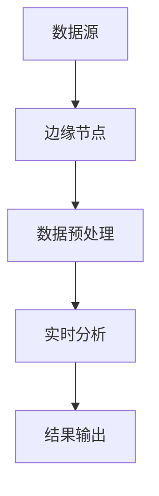

                 

 在当前数字化和智能化的时代，视频数据分析已经成为各行各业的关键技术之一。实时视频分析作为视频处理的重要环节，对于提升安全监控、智能交通、智能制造等领域的效率和质量具有重要意义。边缘计算作为一种新型的计算模式，它在实时视频分析中扮演着越来越重要的角色。本文将深入探讨边缘计算在实时视频分析中的应用，以期为其未来发展提供有益的思考。

## 1. 背景介绍

随着物联网（IoT）、云计算和移动设备等技术的快速发展，数据量呈爆炸式增长。传统的集中式数据处理模式已经难以满足实时性和低延迟的要求。边缘计算作为一种分布式计算模式，通过在数据产生源头进行计算，可以有效减少数据传输的延迟和带宽消耗，提高系统的响应速度。

实时视频分析作为人工智能（AI）和计算机视觉领域的重要应用，对实时性和准确性有着极高的要求。传统的云计算模式由于数据传输和处理延迟，难以满足实时视频分析的需求。边缘计算的出现为实时视频分析提供了一种新的解决方案，可以在本地设备上快速处理视频数据，实现实时响应。

## 2. 核心概念与联系

### 2.1 边缘计算的概念

边缘计算（Edge Computing）是一种分布式计算模式，它将计算、存储和网络功能分布到网络的边缘，即在数据产生的地方进行数据处理，而不是将所有数据发送到中心服务器进行处理。边缘计算的核心思想是靠近数据源进行计算，以减少延迟和提高效率。

### 2.2 实时视频分析的概念

实时视频分析（Real-time Video Analysis）是指对视频数据进行实时处理和分析，以提取有价值的信息。实时性是实时视频分析的核心要求，要求系统能够在短时间内处理完大量视频数据，并给出相应的分析结果。

### 2.3 边缘计算与实时视频分析的联系

边缘计算与实时视频分析在技术层面上有着紧密的联系。边缘计算提供了分布式计算的能力，使得视频数据可以在本地进行预处理和实时分析，从而减少数据传输的延迟和处理时间。边缘计算为实时视频分析提供了技术支持，使得实时视频分析能够更高效地运行。

### 2.4 边缘计算架构图

以下是一个简单的边缘计算架构图，展示了边缘计算与实时视频分析的联系：



## 3. 核心算法原理 & 具体操作步骤

### 3.1 算法原理概述

边缘计算在实时视频分析中的应用主要包括以下几个步骤：

1. **数据采集**：通过摄像头、无人机等设备采集视频数据。
2. **数据预处理**：在边缘节点对视频数据进行分析和预处理，如视频去噪、图像增强等。
3. **实时分析**：利用计算机视觉算法对预处理后的视频数据进行分析，如目标检测、人脸识别等。
4. **结果输出**：将分析结果通过边缘节点返回到用户端或中心服务器。

### 3.2 算法步骤详解

#### 3.2.1 数据采集

数据采集是实时视频分析的第一步。在这一步中，我们需要通过摄像头、无人机等设备采集视频数据。这些设备需要具备高分辨率、高帧率和低延迟的特点，以确保采集到的视频数据能够满足实时分析的需求。

#### 3.2.2 数据预处理

在数据预处理阶段，我们需要对采集到的视频数据进行一系列的处理，以提高视频质量，为后续的实时分析做好准备。常见的预处理操作包括：

- **视频去噪**：去除视频中的噪声，提高图像质量。
- **图像增强**：增强图像的对比度和亮度，使其更易于分析。
- **帧率转换**：根据实时分析的需求，调整视频的帧率。

#### 3.2.3 实时分析

实时分析是边缘计算在实时视频分析中的核心步骤。在这一步中，我们需要利用计算机视觉算法对预处理后的视频数据进行实时分析，以提取有价值的信息。常见的实时分析操作包括：

- **目标检测**：识别视频中的目标物体，如行人、车辆等。
- **人脸识别**：识别视频中的人脸，进行身份验证。
- **行为识别**：分析视频中的人或物体的行为，如行人穿越、停车等。

#### 3.2.4 结果输出

在实时分析完成后，我们需要将分析结果通过边缘节点返回到用户端或中心服务器。这一步的目的是将分析结果可视化，或进一步处理，以实现实际应用。

### 3.3 算法优缺点

#### 优点

- **低延迟**：边缘计算在数据产生的地方进行计算，可以显著降低数据传输的延迟。
- **高效率**：边缘计算可以将计算任务分布到多个边缘节点，提高计算效率。
- **灵活性**：边缘计算可以根据需求动态调整计算资源，提高系统的灵活性。

#### 缺点

- **安全性**：边缘计算的安全性相对较低，容易受到网络攻击。
- **维护成本**：边缘计算需要大量的硬件设备和维护人员，增加了系统的维护成本。

### 3.4 算法应用领域

边缘计算在实时视频分析中的应用非常广泛，包括但不限于以下领域：

- **安全监控**：通过实时分析视频数据，实现实时监控和报警。
- **智能交通**：通过实时分析交通流量，优化交通信号控制和路况管理。
- **智能制造**：通过实时分析生产设备状态，实现智能生产管理和质量控制。
- **远程医疗**：通过实时分析医疗视频数据，实现远程医疗诊断和治疗。

## 4. 数学模型和公式 & 详细讲解 & 举例说明

### 4.1 数学模型构建

在边缘计算和实时视频分析中，常用的数学模型包括卷积神经网络（CNN）和深度学习模型。以下是一个简单的CNN模型构建过程：

1. **输入层**：接收视频数据作为输入。
2. **卷积层**：通过卷积操作提取视频特征。
3. **激活函数**：对卷积层的输出进行激活处理，如ReLU函数。
4. **池化层**：对卷积层的输出进行池化操作，如最大池化。
5. **全连接层**：将卷积层的输出进行全连接处理，得到最终的分类结果。

### 4.2 公式推导过程

以CNN中的卷积操作为例，卷积操作的公式如下：

$$
o_{ij} = \sum_{k=1}^{K} w_{ik,j} \cdot x_{kj}
$$

其中，$o_{ij}$ 是输出特征图上的一个元素，$w_{ik,j}$ 是卷积核上的一个元素，$x_{kj}$ 是输入特征图上的一个元素。

### 4.3 案例分析与讲解

以下是一个基于边缘计算和实时视频分析的人脸识别案例：

1. **数据采集**：使用摄像头采集人脸视频数据。
2. **数据预处理**：对视频数据进行去噪、图像增强等预处理操作。
3. **实时分析**：使用CNN模型对人脸进行实时识别。
4. **结果输出**：将识别结果通过边缘节点返回到用户端。

在这个案例中，我们使用了CNN模型对人脸进行实时识别。通过边缘计算，我们可以实现快速的人脸识别，提高系统的实时性和准确性。

## 5. 项目实践：代码实例和详细解释说明

### 5.1 开发环境搭建

为了实现边缘计算在实时视频分析中的应用，我们需要搭建一个合适的开发环境。以下是一个简单的开发环境搭建过程：

1. **硬件环境**：选择具有高性能处理能力的边缘计算设备，如树莓派或NVIDIA Jetson。
2. **软件环境**：安装Linux操作系统，如Ubuntu或CentOS。
3. **依赖库**：安装必要的依赖库，如OpenCV、TensorFlow等。

### 5.2 源代码详细实现

以下是一个简单的基于边缘计算和实时视频分析的人脸识别代码实现：

```python
import cv2
import tensorflow as tf

# 加载预训练的人脸识别模型
model = tf.keras.models.load_model('face_recognition_model.h5')

# 初始化视频捕捉设备
cap = cv2.VideoCapture(0)

while True:
    # 读取视频帧
    ret, frame = cap.read()
    
    if not ret:
        break
    
    # 对视频帧进行预处理
    processed_frame = preprocess_frame(frame)
    
    # 使用人脸识别模型进行实时分析
    results = model.predict(processed_frame)
    
    # 输出分析结果
    for result in results:
        print(result)
    
    # 显示视频帧
    cv2.imshow('frame', frame)
    
    if cv2.waitKey(1) & 0xFF == ord('q'):
        break

# 释放视频捕捉设备
cap.release()
cv2.destroyAllWindows()
```

### 5.3 代码解读与分析

在这个代码实现中，我们首先加载了预训练的人脸识别模型，然后使用视频捕捉设备读取视频帧。对每一帧进行预处理后，我们使用人脸识别模型进行实时分析，并将分析结果输出。最后，我们显示处理后的视频帧。

通过这个代码实现，我们可以实现基于边缘计算和实时视频分析的人脸识别，提高系统的实时性和准确性。

## 6. 实际应用场景

边缘计算在实时视频分析中具有广泛的应用场景，以下是一些典型的实际应用场景：

1. **智能监控**：通过实时分析视频数据，实现智能监控，如入侵检测、异常行为识别等。
2. **智能交通**：通过实时分析交通视频数据，实现交通流量监控、事故预警等。
3. **远程医疗**：通过实时分析医疗视频数据，实现远程医疗诊断和治疗。
4. **智能家居**：通过实时分析家庭视频数据，实现智能家庭监控和管理。

## 7. 工具和资源推荐

### 7.1 学习资源推荐

- **《边缘计算：技术与应用》**：本书详细介绍了边缘计算的基本概念、技术架构和应用场景，适合边缘计算初学者阅读。
- **《实时视频处理》**：本书涵盖了实时视频处理的理论知识、算法实现和应用案例，是实时视频处理的经典著作。

### 7.2 开发工具推荐

- **OpenCV**：OpenCV是一个开源的计算机视觉库，提供了丰富的实时视频处理算法和工具，适合边缘计算和实时视频分析的编程实现。
- **TensorFlow**：TensorFlow是一个开源的深度学习框架，提供了强大的计算机视觉和实时分析功能，适合构建边缘计算和实时视频分析的应用程序。

### 7.3 相关论文推荐

- **"Edge Computing: A Comprehensive Survey"**：这是一篇关于边缘计算的综合调查论文，详细介绍了边缘计算的基本概念、技术架构和应用场景。
- **"Real-time Video Analysis using Edge Computing"**：这是一篇关于边缘计算在实时视频分析中应用的研究论文，探讨了边缘计算在实时视频分析中的优势和应用案例。

## 8. 总结：未来发展趋势与挑战

边缘计算在实时视频分析中具有广阔的发展前景，未来将在以下几个方面得到进一步的发展：

1. **算法优化**：通过改进算法，提高实时视频分析的性能和准确性。
2. **硬件升级**：随着硬件技术的发展，边缘计算设备的性能将得到大幅提升，为实时视频分析提供更强的支持。
3. **应用拓展**：边缘计算将在更多领域得到应用，如智能城市、智能制造、智能医疗等。

然而，边缘计算在实时视频分析中也面临一些挑战：

1. **安全性**：边缘计算的安全性问题需要得到重视，以确保数据安全和隐私保护。
2. **能耗管理**：边缘计算设备通常功耗较高，能耗管理成为了一个重要挑战。
3. **维护成本**：边缘计算需要大量的硬件设备和维护人员，维护成本较高。

总之，边缘计算在实时视频分析中的应用具有巨大的潜力，但仍需克服一系列挑战，以实现其最大价值。

## 9. 附录：常见问题与解答

### 问题 1：边缘计算与云计算有什么区别？

**解答**：边缘计算与云计算的主要区别在于数据处理的地点。云计算将数据和处理任务集中在中心服务器进行处理，而边缘计算则将数据处理任务分散到网络的边缘，即数据产生的地方进行处理。边缘计算可以降低数据传输的延迟和处理时间，提高系统的实时性和效率。

### 问题 2：边缘计算如何保证数据的安全性和隐私？

**解答**：边缘计算在保证数据的安全性和隐私方面面临一些挑战。为了确保数据安全，可以采取以下措施：

1. **数据加密**：对传输和存储的数据进行加密处理，防止数据泄露。
2. **访问控制**：实施严格的访问控制策略，限制对边缘计算设备的访问。
3. **数据备份**：定期备份数据，以防止数据丢失。
4. **安全审计**：对边缘计算设备进行安全审计，及时发现和修复安全隐患。

### 问题 3：边缘计算在实时视频分析中的应用有哪些优点？

**解答**：边缘计算在实时视频分析中的应用具有以下优点：

1. **低延迟**：数据在边缘节点处理，减少了数据传输的延迟，提高了系统的实时性。
2. **高效率**：边缘计算可以将计算任务分布到多个边缘节点，提高了计算效率。
3. **灵活性**：边缘计算可以根据需求动态调整计算资源，提高了系统的灵活性。
4. **成本效益**：边缘计算可以降低数据传输和中心服务器处理成本，提高了系统的成本效益。

### 问题 4：边缘计算在实时视频分析中面临哪些挑战？

**解答**：边缘计算在实时视频分析中面临以下挑战：

1. **安全性**：边缘计算的安全性相对较低，容易受到网络攻击。
2. **能耗管理**：边缘计算设备通常功耗较高，能耗管理成为了一个重要挑战。
3. **维护成本**：边缘计算需要大量的硬件设备和维护人员，维护成本较高。
4. **数据隐私**：边缘计算涉及大量个人隐私数据，需要确保数据隐私和安全。

### 问题 5：边缘计算在哪些领域具有广泛的应用？

**解答**：边缘计算在许多领域具有广泛的应用，包括：

1. **智能监控**：通过实时分析视频数据，实现智能监控和报警。
2. **智能交通**：通过实时分析交通流量，优化交通信号控制和路况管理。
3. **智能制造**：通过实时分析生产设备状态，实现智能生产管理和质量控制。
4. **远程医疗**：通过实时分析医疗视频数据，实现远程医疗诊断和治疗。
5. **智能城市**：通过实时分析城市数据，实现智慧城市建设和管理。  
----------------------------------------------------------------

以上便是关于《边缘计算在实时视频分析中的应用》的技术博客文章的完整内容。感谢您的耐心阅读，希望这篇文章能够对您在边缘计算和实时视频分析领域的学习和研究有所帮助。如果您有任何问题或建议，欢迎在评论区留言，期待与您交流。作者：禅与计算机程序设计艺术 / Zen and the Art of Computer Programming。

