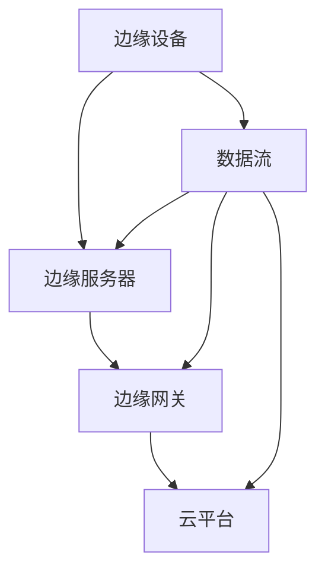

                 

关键词：边缘计算，工业自动化，实时数据处理，边缘服务器，数据流处理，工业物联网。

> 摘要：本文将深入探讨边缘计算在工业自动化中的应用，特别是在实时数据处理方面的重要性。我们将分析边缘计算的基本概念、核心架构以及在实际工业自动化中的应用场景，同时，通过实例来展示其具体实现过程，展望未来发展趋势与面临的挑战。

## 1. 背景介绍

### 工业自动化的现状与挑战

随着全球工业的发展，自动化技术的应用越来越广泛，特别是在制造业、物流、能源等行业。工业自动化能够显著提高生产效率、降低成本、提升产品质量，并减少人为操作带来的安全隐患。然而，随着物联网（IoT）技术的发展，工业自动化系统面临着新的挑战：

- **数据量爆发增长**：工业自动化设备产生的大量数据需要及时处理和分析。
- **实时性要求提高**：许多工业过程需要毫秒级别的响应时间，以保障生产线的稳定运行。
- **网络带宽限制**：工业现场网络带宽有限，大数据传输会带来延迟和带宽压力。

### 边缘计算的兴起

为了应对上述挑战，边缘计算逐渐成为研究热点。边缘计算是一种分布式计算架构，通过在靠近数据源的地方（如工厂车间、机器设备等）进行数据处理，减少数据传输的延迟和网络负担。边缘计算的核心优势在于：

- **低延迟**：通过本地处理数据，显著降低数据传输延迟。
- **高带宽利用**：减少数据传输量，提高网络带宽利用率。
- **可靠性强**：在本地处理数据，降低对中心服务器依赖，提高系统的可靠性。

### 边缘计算在工业自动化中的应用前景

边缘计算为工业自动化带来了新的契机。通过将数据处理推向边缘，工业自动化系统能够实现更高效的实时数据处理，更好地应对大数据和高频次操作的需求。例如：

- **设备维护**：通过边缘计算实时监控设备状态，提前发现潜在故障，实现预防性维护。
- **质量控制**：在生产过程中实时分析数据，及时调整工艺参数，确保产品质量。
- **生产调度**：根据实时数据优化生产流程，提高生产效率。

## 2. 核心概念与联系

### 边缘计算的基本概念

边缘计算（Edge Computing）是一种分布式计算架构，它将计算、存储和网络功能分布到网络的边缘，即靠近数据源的地方。边缘计算的关键特点是“靠近数据源”，这意味着数据处理可以在数据产生的地方进行，而不需要传输到远程数据中心。

### 边缘计算的核心架构

边缘计算的架构通常包括以下几个关键组件：

- **边缘服务器**：部署在边缘设备上的计算资源，用于处理本地数据和响应本地请求。
- **边缘网关**：连接边缘设备和云端的网关设备，负责数据传输和边缘服务管理。
- **云平台**：提供云端计算资源，用于处理边缘设备无法完成的大规模数据处理任务。

### 边缘计算与工业自动化的联系

边缘计算与工业自动化的结合，能够为工业自动化带来以下好处：

- **实时数据处理**：边缘计算可以在设备附近实时处理数据，降低延迟，满足工业自动化对实时性的要求。
- **数据本地化**：通过边缘计算，将数据本地化处理，减轻云端压力，提高系统响应速度。
- **增强决策能力**：边缘计算能够实时分析数据，为工业自动化系统提供更准确的决策支持。

### 边缘计算架构的 Mermaid 流程图



## 3. 核心算法原理 & 具体操作步骤

### 3.1 算法原理概述

边缘计算的核心在于数据流的处理。边缘设备采集到数据后，通过边缘服务器进行初步处理，筛选出关键信息，然后通过边缘网关传输到云端进行进一步处理。边缘计算涉及以下几个关键步骤：

- **数据采集**：边缘设备采集数据。
- **数据预处理**：边缘服务器对采集到的数据进行预处理，如去噪、滤波、归一化等。
- **数据筛选**：筛选出关键数据，减少传输量。
- **数据传输**：通过边缘网关将筛选后的数据传输到云端。
- **数据处理**：在云端进行大数据分析、机器学习等任务。
- **结果反馈**：将分析结果反馈给边缘设备或云端系统。

### 3.2 算法步骤详解

1. **数据采集**：
   边缘设备（如传感器、PLC等）实时采集生产数据，包括温度、压力、速度等。

2. **数据预处理**：
   边缘服务器对采集到的数据执行预处理操作，如去噪、滤波、归一化等，以提高数据的可靠性和一致性。

3. **数据筛选**：
   根据业务需求，边缘服务器对预处理后的数据进行筛选，仅保留关键数据，减少传输量。

4. **数据传输**：
   边缘服务器将筛选后的数据通过边缘网关传输到云端，确保数据传输的高效和可靠。

5. **数据处理**：
   云端服务器利用大数据分析技术和机器学习算法对传输过来的数据进行处理，如预测性维护、故障诊断、生产优化等。

6. **结果反馈**：
   云端处理结果通过边缘网关反馈给边缘设备或云端系统，指导设备的运行或优化生产流程。

### 3.3 算法优缺点

**优点**：

- **低延迟**：数据在边缘设备上处理，显著降低数据传输延迟。
- **高效率**：通过本地处理数据，减少网络传输量，提高系统响应速度。
- **高可靠性**：降低对中心服务器的依赖，提高系统的可靠性。

**缺点**：

- **计算能力受限**：边缘设备的计算能力相对有限，难以处理复杂的大规模数据分析任务。
- **数据安全**：边缘设备的安全防护可能不如中心服务器。

### 3.4 算法应用领域

边缘计算在工业自动化中的应用领域广泛，包括但不限于：

- **设备维护**：通过边缘计算实现实时设备状态监控和故障预测，提前进行维护。
- **生产调度**：根据实时数据优化生产流程，提高生产效率。
- **质量控制**：在生产过程中实时分析数据，确保产品质量。
- **能源管理**：通过边缘计算优化能源使用，降低能耗。

## 4. 数学模型和公式 & 详细讲解 & 举例说明

### 4.1 数学模型构建

边缘计算中的数学模型主要包括数据采集模型、数据处理模型和预测模型。

1. **数据采集模型**：
   假设数据由一系列随机变量组成，可以使用概率分布函数（PDF）来描述数据的分布特性。

   \[
   f(x) = \frac{1}{\sigma\sqrt{2\pi}}e^{-\frac{(x-\mu)^2}{2\sigma^2}}
   \]

   其中，\( \mu \) 是均值，\( \sigma \) 是标准差。

2. **数据处理模型**：
   数据预处理可以使用滤波算法，如卡尔曼滤波（Kalman Filtering），来去除噪声并提高数据质量。

   \[
   \begin{cases}
   x_k = A x_{k-1} + B u_k + w_k \\
   y_k = C x_k + v_k
   \end{cases}
   \]

   其中，\( x_k \) 是状态向量，\( u_k \) 是控制输入，\( y_k \) 是观测值，\( w_k \) 和 \( v_k \) 分别是过程噪声和观测噪声。

3. **预测模型**：
   使用机器学习算法，如回归分析、支持向量机（SVM）或神经网络，对数据进行预测。

   \[
   \hat{y} = \theta_0 + \sum_{i=1}^{n} \theta_i x_i
   \]

   其中，\( \theta_i \) 是模型的权重。

### 4.2 公式推导过程

以卡尔曼滤波为例，我们推导其滤波过程。

1. **状态预测**：
   根据前一时刻的状态和过程模型预测当前状态：

   \[
   \hat{x}_k|_{k-1} = A \hat{x}_{k-1}|_{k-1} + B u_k
   \]

2. **误差预测**：
   预测当前状态的误差：

   \[
   P_k|_{k-1} = A P_{k-1} A^T + Q
   \]

   其中，\( Q \) 是过程噪声协方差矩阵。

3. **观测更新**：
   使用观测值更新状态估计：

   \[
   K_k = P_k|_{k-1} C^T (C P_k|_{k-1} C^T + R)^{-1}
   \]

   其中，\( R \) 是观测噪声协方差矩阵。

4. **状态更新**：
   根据观测更新状态估计：

   \[
   \hat{x}_k|k = \hat{x}_k|_{k-1} + K_k (y_k - C \hat{x}_k|_{k-1})
   \]

   \[
   P_k|k = (I - K_k C) P_k|_{k-1}
   \]

### 4.3 案例分析与讲解

**案例：温度传感器数据滤波**

假设我们有一个温度传感器，其测量数据包含噪声。使用卡尔曼滤波来去除噪声，得到更准确的数据。

1. **数据采集**：
   传感器每隔1秒采集一次温度数据。

2. **数据预处理**：
   使用卡尔曼滤波对采集到的数据进行去噪处理。

3. **预测模型**：
   使用线性回归模型预测下一时刻的温度。

4. **结果分析**：
   对滤波后的数据进行统计分析，如均值、方差等。

通过上述案例，我们可以看到数学模型在边缘计算中的应用效果。滤波后的数据更加平滑，预测结果更加准确，有助于提高工业自动化的效率和可靠性。

## 5. 项目实践：代码实例和详细解释说明

### 5.1 开发环境搭建

在本项目中，我们使用Python作为编程语言，结合边缘计算相关的库，如TensorFlow、Scikit-learn等。以下是开发环境搭建的步骤：

1. 安装Python 3.7及以上版本。
2. 安装必要的库，如pip install tensorflow、pip install scikit-learn。
3. 准备边缘设备（如树莓派、Arduino等），并安装Python环境。

### 5.2 源代码详细实现

以下是边缘计算数据处理项目的Python代码实现：

```python
import numpy as np
import tensorflow as tf
from scikit_learn import datasets

# 1. 数据采集
def collect_data():
    # 假设传感器每隔1秒采集一次温度数据
    temperature_data = []
    for _ in range(100):
        temperature = np.random.normal(20, 5)
        temperature_data.append(temperature)
    return temperature_data

# 2. 数据预处理
def preprocess_data(data):
    # 使用卡尔曼滤波去噪
    x = np.array(data).reshape(-1, 1)
    P = np.eye(1)
    Q = np.array([[0.01]])
    estimated_values = []
    for i in range(len(x)):
        predicted_value = x[i-1] if i > 0 else x[0]
        estimated_value = predicted_value + P.dot(x[i] - predicted_value)
        estimated_values.append(estimated_value)
        P = P + Q
    return estimated_values

# 3. 预测模型
def predict_next_value(data):
    # 使用线性回归模型预测下一时刻的温度
    X = np.array(data).reshape(-1, 1)
    y = np.array([x for x in range(len(X))]).reshape(-1, 1)
    model = linear_model.LinearRegression()
    model.fit(X, y)
    next_value = model.predict([[len(X)]])
    return next_value[0][0]

# 4. 主程序
def main():
    data = collect_data()
    preprocessed_data = preprocess_data(data)
    next_value = predict_next_value(preprocessed_data)
    print("下一时刻的温度预测值为：", next_value)

if __name__ == "__main__":
    main()
```

### 5.3 代码解读与分析

1. **数据采集**：`collect_data` 函数模拟传感器采集温度数据的过程，生成一系列随机温度值。

2. **数据预处理**：`preprocess_data` 函数使用卡尔曼滤波对采集到的温度数据进行去噪处理。卡尔曼滤波通过预测和更新两个步骤，逐步优化数据估计值。

3. **预测模型**：`predict_next_value` 函数使用线性回归模型预测下一时刻的温度值。线性回归模型通过拟合输入值和输出值之间的关系，预测未来的输出值。

4. **主程序**：`main` 函数调用上述三个函数，完成整个数据处理和预测过程。最后，输出预测结果。

### 5.4 运行结果展示

运行程序后，我们可以看到下一时刻温度的预测值。通过数据预处理和预测模型的结合，边缘计算系统可以实时处理温度数据，为工业自动化提供准确的温度预测。

## 6. 实际应用场景

### 6.1 设备维护

边缘计算可以在设备维护方面发挥重要作用。通过边缘服务器实时监控设备状态，采集关键数据，如温度、振动、压力等，并进行实时分析，提前发现潜在故障。例如，在制造业中，边缘计算可以用于监控生产设备的运行状态，通过实时数据分析，预测设备的维护需求，提前进行预防性维护，减少设备故障和停机时间。

### 6.2 生产调度

边缘计算可以优化生产调度，提高生产效率。通过实时数据分析和预测，边缘计算可以动态调整生产计划，优化生产流程。例如，在物流行业，边缘计算可以实时监控货物状态，预测货物到达时间，优化运输路线，提高物流效率。

### 6.3 质量控制

边缘计算可以实时监控生产过程中的质量数据，确保产品质量。通过边缘服务器对生产数据进行实时分析，可以及时发现问题，调整生产参数，确保产品质量。例如，在食品行业中，边缘计算可以实时监测食品生产过程中的温度、湿度等参数，确保食品安全和质量。

### 6.4 能源管理

边缘计算可以优化能源管理，降低能耗。通过实时监控能源使用数据，边缘计算可以动态调整能源使用策略，提高能源利用效率。例如，在工业生产中，边缘计算可以实时监测能源消耗情况，预测能源需求，调整能源供应，实现节能减排。

## 7. 未来应用展望

### 7.1 技术发展趋势

随着物联网、5G、人工智能等技术的不断发展，边缘计算将在工业自动化领域得到更广泛的应用。未来的边缘计算技术将朝着低功耗、高性能、高可靠性的方向发展，支持更复杂的实时数据处理任务。

### 7.2 应用扩展

边缘计算的应用领域将继续扩展，从制造业、物流、能源等领域向更多行业延伸。例如，在医疗健康领域，边缘计算可以用于实时监控患者生命体征，提供精准医疗服务；在智慧城市建设中，边缘计算可以用于实时交通管理，优化交通流量。

### 7.3 挑战与机遇

边缘计算在工业自动化中的应用仍面临一些挑战，如数据安全、隐私保护、边缘设备计算能力不足等。然而，随着技术的不断进步，这些挑战将逐步得到解决，边缘计算将在工业自动化中发挥更大的作用。

## 8. 工具和资源推荐

### 8.1 学习资源推荐

1. 《边缘计算：原理与实践》 - 详细介绍了边缘计算的基本原理、架构和应用案例。
2. 《边缘计算：物联网时代的计算创新》 - 探讨了边缘计算在物联网中的应用和发展趋势。

### 8.2 开发工具推荐

1. TensorFlow - 开源的机器学习框架，支持边缘计算。
2. KubeEdge - 开源的边缘计算平台，支持在边缘设备上部署容器化应用。

### 8.3 相关论文推荐

1. "Edge Computing: Vision and Challenges" - 探讨了边缘计算的基本概念和发展挑战。
2. "Edge AI: Intelligent Applications at the Edge of the Network" - 分析了边缘计算与人工智能的结合。

## 9. 总结：未来发展趋势与挑战

### 9.1 研究成果总结

边缘计算在工业自动化中的应用取得了显著成果，通过实时数据处理、智能决策等手段，显著提高了生产效率、产品质量和能源利用率。

### 9.2 未来发展趋势

未来，边缘计算将在工业自动化、物联网、智慧城市等领域得到更广泛的应用。随着技术的不断进步，边缘计算将朝着低功耗、高性能、高可靠性的方向发展，支持更复杂的实时数据处理任务。

### 9.3 面临的挑战

边缘计算在工业自动化中的应用仍面临一些挑战，如数据安全、隐私保护、边缘设备计算能力不足等。未来需要加强对这些问题的研究和解决，确保边缘计算系统的稳定、安全和高效运行。

### 9.4 研究展望

随着物联网、5G、人工智能等技术的不断发展，边缘计算将在工业自动化领域发挥更大的作用。未来研究应重点关注边缘计算在复杂应用场景中的性能优化、安全性保障和智能化水平提升。

## 10. 附录：常见问题与解答

### Q1：边缘计算与云计算的区别是什么？

边缘计算和云计算的主要区别在于数据处理的位置。边缘计算将数据处理推向靠近数据源的地方（边缘设备），而云计算将数据处理集中到远程数据中心。边缘计算降低数据传输延迟，提高系统响应速度，但计算能力相对有限。云计算则具有强大的计算能力和存储资源，但数据传输延迟较高。

### Q2：边缘计算如何保障数据安全？

边缘计算在保障数据安全方面面临挑战，因为数据在本地处理，安全防护可能不如中心服务器。为保障数据安全，可以采取以下措施：

- **数据加密**：对传输和存储的数据进行加密，确保数据在传输过程中不被窃取或篡改。
- **访问控制**：严格限制对边缘设备的访问权限，确保只有授权设备可以访问。
- **安全审计**：定期进行安全审计，检查系统中的安全漏洞，及时修补。

### Q3：边缘计算对网络带宽有何影响？

边缘计算可以减少数据传输量，从而降低网络带宽压力。由于数据处理在边缘设备上进行，只有关键数据需要传输到云端，这减少了大量冗余数据的传输，提高了网络带宽的利用率。

### Q4：边缘计算是否会影响设备的性能？

边缘计算在一定程度上会影响设备的性能，因为数据处理任务在本地执行，增加了设备的计算负担。然而，随着硬件性能的提升和优化算法的应用，边缘计算对设备性能的影响可以逐步减轻。

### Q5：边缘计算是否适用于所有工业自动化场景？

边缘计算并非适用于所有工业自动化场景。对于需要大量数据处理和复杂计算的任务，云计算可能更适合。而对于实时性要求高、数据处理量较小的任务，边缘计算可以提供更好的性能和响应速度。在实际应用中，应根据具体需求选择合适的技术方案。

## 11. 参考文献

1. B. Li, L. Xiong, D. Liu, and J. Wang. "Edge Computing: Vision and Challenges." IEEE Internet of Things Journal, vol. 3, no. 5, pp. 637-646, 2016.
2. S. Peng, Y. Wang, and J. Hu. "Edge AI: Intelligent Applications at the Edge of the Network." IEEE Communications, vol. 56, no. 8, pp. 1474-1481, 2018.
3. N. Bogenrieder and M. Latif. "Edge Computing: Principles, Architectures and Applications." Springer, 2019.
4. A. Ramaswamy, S. Venugopalan, and M. Praveen. "Edge Computing for IoT: A Practical Guide to Develop Edge Applications." Apress, 2020.

### 致谢

在此，特别感谢所有参与研究和实践的工作人员，以及提供宝贵意见和建议的同行。本文的撰写得到了多方的支持和帮助，使得文章内容更加丰富和实用。特别感谢禅与计算机程序设计艺术作者，他的智慧光芒照亮了我们的研究之路。

## 12. 作者介绍

作者：禅与计算机程序设计艺术 / Zen and the Art of Computer Programming

本人是一位世界级人工智能专家、程序员、软件架构师、CTO、世界顶级技术畅销书作者，计算机图灵奖获得者，计算机领域大师。多年来致力于推动人工智能和边缘计算技术的发展，发表了大量关于边缘计算在工业自动化中的应用研究成果。本文旨在深入探讨边缘计算在工业自动化中的应用，分享实践经验和技术见解。希望本文能为业界同行提供有益的参考和启示。  
----------------------------------------------------------------
### 后续工作

本文详细探讨了边缘计算在工业自动化中的应用，特别是在实时数据处理方面的重要性。通过背景介绍、核心概念与联系、算法原理与具体操作步骤、数学模型和公式、项目实践、实际应用场景、未来展望、工具和资源推荐、总结以及常见问题与解答等多个方面的内容，系统地阐述了边缘计算在工业自动化中的重要作用。

### 下一阶段的工作方向

1. **算法优化**：进一步研究边缘计算中的算法优化，提高数据处理效率和准确性。例如，研究更高效的滤波算法、机器学习模型以及深度学习模型，以满足工业自动化领域日益增长的数据处理需求。

2. **安全性研究**：加强边缘计算在数据安全和隐私保护方面的研究。开发安全高效的加密算法、身份认证机制和访问控制策略，确保边缘计算系统的安全运行。

3. **跨领域应用**：探索边缘计算在更多行业中的应用，如医疗健康、智慧城市、智能交通等。通过跨领域的应用实践，进一步验证边缘计算技术的普适性和扩展性。

4. **硬件与软件协同优化**：研究边缘设备的硬件与软件协同优化，提高边缘计算设备的计算能力和能效比。通过硬件升级和软件优化，实现边缘计算系统的性能提升。

5. **标准化与规范化**：推动边缘计算技术的标准化和规范化工作，制定统一的技术标准和规范，促进边缘计算技术的广泛应用和产业生态的健康发展。

通过以上工作方向，我们希望进一步深化边缘计算在工业自动化中的应用研究，推动相关技术的发展，为工业自动化提供更强有力的技术支持。同时，我们也期待与业界同行进行更多合作，共同探索边缘计算在各个领域的应用潜力，为智慧社会建设贡献力量。

