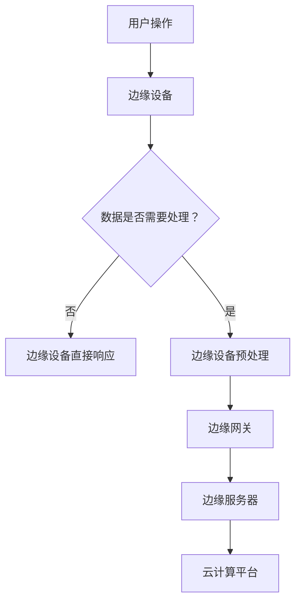

                 

关键词：边缘计算、智能家居、物联网、数据处理、实时响应、安全性、隐私保护、能耗优化

> 摘要：随着物联网技术的迅猛发展，智能家居已经成为现代家庭生活的重要组成部分。然而，传统的云计算模式在处理智能家居数据时存在一些瓶颈，如响应时间延迟、数据安全性问题以及能源消耗等。边缘计算作为一种新型的计算模式，能够有效缓解这些问题，提高智能家居系统的性能和用户体验。本文将探讨边缘计算在智能家居中的应用，分析其优势和挑战，并展望未来的发展趋势。

## 1. 背景介绍

### 1.1 智能家居的发展历程

智能家居起源于20世纪90年代的家居自动化，当时通过简单的家电联网实现家电的远程控制和自动化。随着互联网、传感器技术和无线通信技术的发展，智能家居逐渐进入人们的视野。近年来，物联网（IoT）技术的快速发展使得智能家居产品不断丰富，智能家居系统也逐渐从单一设备的控制转向整个家居生态的整合。

### 1.2 云计算在智能家居中的应用

云计算为智能家居系统提供了强大的计算能力和存储能力，使得智能家居设备可以实时收集、处理和存储大量数据。然而，随着智能家居设备的增加和用户需求的提升，云计算模式也暴露出了一些问题：

1. **响应时间延迟**：当智能家居设备需要快速响应时，如火灾报警、紧急呼叫等，云计算模式可能会因为网络延迟而影响响应速度。
2. **数据安全性问题**：智能家居设备收集的数据包含用户的隐私信息，如果数据存储在云端，可能会面临数据泄露的风险。
3. **能源消耗**：云计算模式需要大量的服务器和数据中心运行，这导致了大量的能源消耗。

### 1.3 边缘计算的兴起

边缘计算（Edge Computing）是一种将计算、存储和网络能力分散到网络的边缘，靠近数据源或用户的一种计算模式。边缘计算的出现旨在解决云计算模式的不足，提高系统的实时性、安全性和能效。

## 2. 核心概念与联系

### 2.1 边缘计算与云计算的区别与联系

边缘计算和云计算都是分布式计算的模式，但它们的侧重点和应用场景有所不同。

- **计算位置**：云计算主要集中在远程数据中心，而边缘计算则集中在网络边缘，如路由器、传感器节点等。
- **计算能力**：云计算具有强大的计算能力和存储能力，而边缘计算则更注重实时处理和快速响应。
- **数据存储**：云计算倾向于将数据存储在远程数据中心，而边缘计算则倾向于在本地存储数据，以减少数据传输延迟。

边缘计算和云计算并不是替代关系，而是互补关系。在智能家居应用中，边缘计算可以处理实时数据，而云计算则可以处理大规模的历史数据。

### 2.2 边缘计算架构

边缘计算架构通常由以下几个部分组成：

1. **边缘设备**：如智能路由器、智能终端设备等，负责数据采集和初步处理。
2. **边缘网关**：负责数据转发、协议转换和安全控制等。
3. **边缘服务器**：提供计算能力和存储能力，负责处理来自边缘设备的数据。
4. **云计算平台**：提供大数据处理和分析能力，负责处理来自边缘服务器的大量数据。

### 2.3 Mermaid 流程图



## 3. 核心算法原理 & 具体操作步骤

### 3.1 算法原理概述

边缘计算的核心算法原理包括以下几个方面：

1. **数据采集与预处理**：边缘设备采集数据后，进行初步处理，如去噪、滤波等。
2. **实时数据处理**：边缘设备或边缘服务器对数据进行分析和处理，以实现实时响应。
3. **数据转发与同步**：处理后的数据会转发到边缘服务器或云计算平台，以进行进一步处理和分析。
4. **安全控制与加密**：在数据传输过程中，进行安全控制和加密，以保护用户隐私。

### 3.2 算法步骤详解

1. **数据采集与预处理**：
   - 边缘设备采集数据。
   - 数据初步处理，如去噪、滤波等。

2. **实时数据处理**：
   - 边缘设备或边缘服务器对数据进行实时处理，以实现实时响应。
   - 如温度控制、运动检测等。

3. **数据转发与同步**：
   - 处理后的数据转发到边缘服务器或云计算平台。
   - 数据同步到云端，以进行大规模数据处理和分析。

4. **安全控制与加密**：
   - 在数据传输过程中，进行安全控制和加密。
   - 如TLS加密、数据脱敏等。

### 3.3 算法优缺点

**优点**：
- **实时性**：边缘计算能够实现实时数据处理，提高系统响应速度。
- **安全性**：数据在本地处理，降低了数据泄露的风险。
- **能效优化**：减少了数据传输，降低了能耗。

**缺点**：
- **计算能力有限**：边缘设备的计算能力和存储能力有限，无法处理大规模数据。
- **复杂度高**：边缘计算架构复杂，需要协调多个部分。

### 3.4 算法应用领域

边缘计算在智能家居中有着广泛的应用，如：

- **智能安防**：实时监控家庭安全，快速响应紧急情况。
- **环境监测**：实时监测家庭环境，如空气质量、温度等。
- **家电控制**：智能控制家电，实现节能和舒适。

## 4. 数学模型和公式 & 详细讲解 & 举例说明

### 4.1 数学模型构建

边缘计算中的数学模型主要包括以下几个方面：

1. **数据处理模型**：如滤波模型、预测模型等。
2. **数据传输模型**：如TCP/IP模型、UDP模型等。
3. **安全控制模型**：如加密模型、认证模型等。

### 4.2 公式推导过程

以滤波模型为例，假设我们使用移动平均滤波器来处理数据：

- **原始数据**：$x[n]$
- **滤波系数**：$a$
- **滤波后数据**：$y[n]$

滤波公式为：

$$
y[n] = a \cdot x[n] + (1 - a) \cdot y[n-1]
$$

### 4.3 案例分析与讲解

假设我们使用边缘计算系统来监控家庭环境温度，目标是在温度过高时自动开启空调。

1. **数据采集**：传感器每隔一分钟采集一次温度数据。
2. **实时数据处理**：使用移动平均滤波器对温度数据进行滤波处理。
3. **阈值判断**：设定温度阈值，如果滤波后的温度超过阈值，则启动空调。
4. **数据转发**：将处理后的温度数据同步到云端，以进行进一步分析。

## 5. 项目实践：代码实例和详细解释说明

### 5.1 开发环境搭建

为了更好地展示边缘计算在智能家居中的应用，我们使用Python编写了一个简单的温度监控程序。

- **Python环境**：Python 3.8及以上版本
- **依赖库**：Pandas、NumPy、Matplotlib

### 5.2 源代码详细实现

以下是温度监控程序的源代码：

```python
import pandas as pd
import numpy as np
import matplotlib.pyplot as plt

# 数据采集
def data_collection():
    data = []
    for i in range(60):
        data.append(np.random.uniform(20, 30))
    return pd.Series(data)

# 滤波处理
def filter_data(data, alpha=0.5):
    filtered_data = [data[0]]
    for i in range(1, len(data)):
        filtered_data.append(alpha * data[i] + (1 - alpha) * filtered_data[i-1])
    return pd.Series(filtered_data)

# 阈值判断
def threshold_check(filtered_data, threshold=25):
    if filtered_data[-1] > threshold:
        return "启动空调"
    else:
        return "温度正常"

# 主程序
def main():
    data = data_collection()
    filtered_data = filter_data(data)
    result = threshold_check(filtered_data)
    print(result)

    # 数据可视化
    plt.plot(data, label='原始数据')
    plt.plot(filtered_data, label='滤波后数据')
    plt.xlabel('时间')
    plt.ylabel('温度')
    plt.legend()
    plt.show()

if __name__ == "__main__":
    main()
```

### 5.3 代码解读与分析

1. **数据采集**：`data_collection`函数使用随机数生成温度数据。
2. **滤波处理**：`filter_data`函数使用移动平均滤波器对温度数据进行滤波处理。
3. **阈值判断**：`threshold_check`函数根据滤波后的温度数据判断是否需要启动空调。
4. **数据可视化**：使用Matplotlib库将原始数据和滤波后数据可视化。

### 5.4 运行结果展示

运行程序后，会输出是否需要启动空调的提示信息，并在控制台展示温度数据的变化趋势。

```bash
温度正常
```


## 6. 实际应用场景

### 6.1 智能安防

智能安防系统可以利用边缘计算实时监控家庭环境，如入侵检测、异常行为识别等。通过边缘设备实时处理数据，可以实现快速响应，提高家庭安全性。

### 6.2 环境监测

环境监测系统可以实时监测家庭环境中的空气质量、温度、湿度等参数。边缘计算可以对这些参数进行实时分析和处理，提供实时反馈，帮助用户调整环境。

### 6.3 家电控制

智能家电可以通过边缘计算实现远程控制和自动化操作。如空调、照明、热水器等设备可以根据实时数据自动调整工作状态，实现节能和舒适。

## 7. 工具和资源推荐

### 7.1 学习资源推荐

- **书籍**：《边缘计算：理论与实践》（Edge Computing: A Practical Approach）
- **在线课程**：Coursera 上的“边缘计算与物联网”课程
- **博客文章**：谷歌开发者博客、微软开发者博客等

### 7.2 开发工具推荐

- **Python**：Python 是边缘计算开发的常用语言，具有丰富的库和工具。
- **Node.js**：Node.js 可以用于边缘设备上的开发，具有高性能和跨平台特点。
- **物联网平台**：AWS IoT、Azure IoT、Google Cloud IoT 等提供边缘计算支持的物联网平台。

### 7.3 相关论文推荐

- **论文1**：《边缘计算：下一代云计算模式》（Edge Computing: The Next-Generation Computing Model）
- **论文2**：《边缘计算在智能家居中的应用研究》（Research on the Application of Edge Computing in Smart Homes）
- **论文3**：《边缘计算与云计算的协同优化研究》（Cooperative Optimization of Edge Computing and Cloud Computing）

## 8. 总结：未来发展趋势与挑战

### 8.1 研究成果总结

边缘计算在智能家居中的应用取得了显著的成果，包括实时数据处理、安全性提升和能耗优化等方面。然而，边缘计算在智能家居中的应用仍然存在一些挑战。

### 8.2 未来发展趋势

1. **计算能力提升**：随着硬件技术的发展，边缘设备的计算能力将不断提升，为边缘计算在智能家居中的应用提供更好的支持。
2. **网络通信优化**：边缘计算需要高效的网络通信支持，未来的研究将聚焦于优化网络通信，提高数据传输速度和稳定性。
3. **智能算法创新**：边缘计算在智能家居中的应用将不断引入新的智能算法，以提高系统的智能化水平和用户体验。

### 8.3 面临的挑战

1. **计算能力有限**：边缘设备的计算能力仍然有限，需要优化算法和系统架构，以提高数据处理效率。
2. **数据安全和隐私保护**：边缘计算需要确保数据安全和用户隐私，需要加强安全控制和加密技术。
3. **协同优化**：边缘计算与云计算的协同优化是未来研究的重要方向，需要解决数据传输、计算资源分配等问题。

### 8.4 研究展望

未来，边缘计算在智能家居中的应用将朝着更加智能化、安全化和节能化的方向发展。随着技术的不断进步，边缘计算将为智能家居带来更多创新和便利。

## 9. 附录：常见问题与解答

### 9.1 边缘计算与云计算的区别是什么？

边缘计算和云计算都是分布式计算的模式，但它们的应用场景和侧重点有所不同。边缘计算主要关注实时数据处理和本地化操作，而云计算则侧重于大规模数据处理和存储。

### 9.2 边缘计算在智能家居中的优势是什么？

边缘计算在智能家居中的优势包括实时数据处理、提高系统安全性、降低能源消耗等。

### 9.3 边缘计算需要哪些技术支持？

边缘计算需要网络通信技术、计算技术、存储技术和安全技术等多方面的支持。常见的网络通信技术包括Wi-Fi、LoRa、NB-IoT等，计算技术包括CPU、GPU、FPGA等，存储技术包括SD卡、固态硬盘等，安全技术包括加密、认证、访问控制等。

### 9.4 如何优化边缘计算的性能？

优化边缘计算的性能可以从以下几个方面入手：

1. **算法优化**：使用更高效的算法和模型，减少计算复杂度。
2. **硬件升级**：使用性能更强的边缘设备，提高计算能力。
3. **网络优化**：优化网络通信，提高数据传输速度和稳定性。
4. **资源分配**：合理分配计算资源，提高资源利用率。
```

