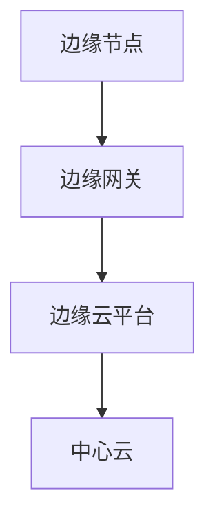

                 

### 1. 背景介绍

随着物联网（IoT）技术的飞速发展，设备和传感器数据的爆炸式增长使得中心化数据处理模式面临着前所未有的挑战。传统的云计算模式在处理大规模物联网数据时，往往需要将数据传输到远程数据中心进行处理，这不仅增加了传输延迟，还可能引发数据隐私和安全问题。因此，边缘计算作为一种新型的数据处理范式，逐渐成为IoT领域的研究热点。

边缘计算旨在将计算、存储和网络功能下沉到网络边缘，即靠近数据源的地方，从而实现对海量物联网数据的实时处理。与传统的云计算相比，边缘计算具有更低的延迟、更高的带宽利用率和更好的安全性。这种新型范式的出现，为IoT领域的应用带来了诸多可能。

边缘计算的应用场景非常广泛，包括但不限于智能城市、智能交通、智能家居、工业物联网等。在这些场景中，边缘计算能够实现数据的本地化处理，从而降低网络拥塞，提高系统响应速度。此外，边缘计算还能够有效保护用户隐私，因为在数据传输过程中，只有必要的数据才会被上传到云端。

本文将深入探讨边缘计算的核心概念、架构、算法原理、数学模型及其在实际应用中的实例，旨在为读者提供一个全面而深入的边缘计算概述。

### 2. 核心概念与联系

#### 2.1 边缘计算定义

边缘计算（Edge Computing）是一种分布式计算架构，它将计算任务分散到网络边缘，即靠近数据源的设备上，从而实现数据的本地化处理。与传统云计算模式不同，边缘计算的核心思想是将计算、存储和网络功能下沉到网络边缘，以减少数据传输的延迟和带宽消耗。

边缘计算的定义可以从以下几个方面进行理解：

- **计算位置**：边缘计算将计算任务从远程数据中心转移到网络边缘，即靠近数据源的地方，如智能设备、传感器、网关等。
- **数据处理方式**：边缘计算强调数据的本地化处理，通过在边缘节点上进行数据预处理、过滤和聚合，从而减少需要传输到云端的原始数据量。
- **延迟和带宽**：边缘计算通过本地处理数据，可以显著降低响应时间和带宽消耗，提高系统的实时性和效率。
- **安全性**：边缘计算可以在本地处理敏感数据，减少数据在传输过程中的泄露风险。

#### 2.2 边缘计算与云计算的联系与区别

边缘计算和云计算都是现代计算架构的重要组成部分，但它们在处理数据和提供服务方面有着不同的侧重点。

- **云计算**：云计算是基于网络的服务模式，它将计算资源（如服务器、存储和网络）集中到数据中心，用户可以通过互联网访问这些资源。云计算的核心优势在于资源的灵活调度和大规模数据处理能力，但缺点是数据传输延迟较高，且对网络带宽的要求较高。

- **边缘计算**：边缘计算则强调将计算任务分散到网络边缘，靠近数据源进行实时处理。边缘计算的核心优势在于降低数据传输延迟、提高系统响应速度和资源利用率，但缺点是计算资源和处理能力相对有限。

边缘计算与云计算之间的联系主要体现在以下几个方面：

1. **协同工作**：边缘计算和云计算可以协同工作，共同处理物联网数据。例如，边缘节点可以预处理数据，然后只将重要的数据传输到云端进行进一步分析。
2. **资源互补**：边缘计算和云计算可以互补各自的不足。边缘计算可以处理本地数据，减少对云端的依赖，而云计算可以提供强大的数据处理和分析能力，为边缘节点提供支持。
3. **分布式架构**：边缘计算和云计算都是分布式架构的一部分。边缘计算通过在网络边缘部署计算节点，实现数据的本地化处理，而云计算通过数据中心集中管理计算资源，提供强大的计算能力。

#### 2.3 边缘计算架构

边缘计算的架构可以从以下几个层次进行理解：

1. **边缘节点**：边缘节点是边缘计算架构的基础，包括各种智能设备、传感器、网关等。这些节点负责数据的采集、预处理和传输。

2. **边缘网关**：边缘网关是连接边缘节点和云端的桥梁，它负责数据的转发和安全管理。边缘网关通常具有强大的计算和存储能力，能够处理复杂的数据处理任务。

3. **边缘云平台**：边缘云平台是边缘计算的核心，它负责边缘节点的管理和调度，以及数据存储和数据分析。边缘云平台通常由多个边缘节点组成，形成一个分布式计算系统。

4. **中心云**：中心云是边缘计算架构的补充，它负责处理边缘节点无法处理的数据和任务，提供强大的计算和分析能力。

#### 2.4 Mermaid 流程图

下面是一个简单的Mermaid流程图，展示了边缘计算的基本架构：



在这个流程图中，边缘节点（A）负责数据的采集和预处理，然后将数据发送到边缘网关（B）。边缘网关（B）负责数据的转发和安全管理，然后将重要的数据传输到边缘云平台（C）进行进一步处理。边缘云平台（C）负责边缘节点的管理和调度，以及数据存储和数据分析。最后，边缘云平台（C）将部分数据传输到中心云（D），进行更深入的分析和处理。

通过这个流程图，我们可以清晰地看到边缘计算的基本架构和工作流程，为后续章节的详细讨论提供了基础。

### 3. 核心算法原理 & 具体操作步骤

#### 3.1 算法原理概述

边缘计算的核心在于将计算任务分散到网络边缘，实现数据的本地化处理。这一过程涉及多个核心算法，包括数据预处理、数据聚合、数据传输和数据处理等。

1. **数据预处理**：数据预处理是边缘计算的重要环节，它包括数据的过滤、清洗和转换等操作。通过数据预处理，可以去除噪声、异常值和重复数据，提高数据的质量和准确性。

2. **数据聚合**：数据聚合是将来自不同边缘节点的数据集合在一起，进行汇总和分析。通过数据聚合，可以减少数据传输量，提高系统的效率和性能。

3. **数据传输**：数据传输是边缘计算中的关键步骤，它涉及数据的传输协议、传输路径和传输安全等。为了减少数据传输延迟和带宽消耗，边缘计算通常采用高效的传输协议和优化传输路径。

4. **数据处理**：数据处理是边缘计算的核心任务，它包括数据的分析、挖掘和推理等操作。通过数据处理，可以提取有价值的信息，为决策提供支持。

#### 3.2 算法步骤详解

1. **数据预处理**：

   数据预处理通常包括以下几个步骤：

   - 数据采集：从不同的边缘节点收集数据。
   - 数据过滤：去除噪声和异常值。
   - 数据清洗：处理重复数据和缺失数据。
   - 数据转换：将数据转换为适合分析和处理的形式。

2. **数据聚合**：

   数据聚合可以通过以下步骤实现：

   - 数据收集：从不同的边缘节点收集数据。
   - 数据汇总：将相同类型的数据进行汇总。
   - 数据分析：对汇总后的数据进行分析和挖掘。
   - 数据反馈：将分析结果返回给边缘节点或云端。

3. **数据传输**：

   数据传输包括以下几个步骤：

   - 数据编码：将数据编码为适合传输的格式。
   - 数据传输：通过传输协议将数据发送到目的地。
   - 数据解码：在目的地对数据进行解码。
   - 数据安全：确保数据在传输过程中的安全性。

4. **数据处理**：

   数据处理包括以下几个步骤：

   - 数据分析：对数据进行分析和挖掘，提取有价值的信息。
   - 数据推理：基于分析结果进行推理和预测。
   - 数据决策：根据推理结果做出决策。
   - 数据反馈：将决策结果反馈给边缘节点或用户。

#### 3.3 算法优缺点

边缘计算算法具有以下优点：

1. **降低延迟**：通过将计算任务分散到网络边缘，可以显著降低数据传输延迟，提高系统的实时性。
2. **提高效率**：通过本地化数据处理，可以减少数据传输量，提高系统的效率和性能。
3. **增强安全性**：通过在本地处理敏感数据，可以减少数据在传输过程中的泄露风险。
4. **灵活性高**：边缘计算可以适应不同的应用场景和需求，提供灵活的计算和服务模式。

然而，边缘计算算法也存在一些缺点：

1. **计算资源有限**：边缘节点的计算资源和存储能力相对有限，可能无法处理大规模的数据处理任务。
2. **网络不稳定**：边缘节点通常分布在不同的地理位置，网络环境可能不稳定，影响数据传输的可靠性。
3. **安全性挑战**：边缘计算涉及大量的数据传输和存储，可能面临安全威胁，如数据泄露、恶意攻击等。

#### 3.4 算法应用领域

边缘计算算法的应用领域非常广泛，主要包括以下几个方面：

1. **智能城市**：边缘计算可以应用于智能交通、智能监控、环境监测等，实现数据的实时处理和分析。
2. **工业物联网**：边缘计算可以应用于工业生产线的监控、故障诊断和优化，提高生产效率和产品质量。
3. **智能医疗**：边缘计算可以应用于医疗设备的实时监控、健康数据的分析和管理，提高医疗服务质量和效率。
4. **智能家居**：边缘计算可以应用于智能家电、安防系统等，实现设备的智能控制和联动。

通过边缘计算算法的应用，我们可以更好地利用物联网数据，实现智能化、自动化和个性化的服务，为社会和产业带来巨大的价值。

### 4. 数学模型和公式 & 详细讲解 & 举例说明

#### 4.1 数学模型构建

边缘计算中的数学模型主要用于描述数据的处理过程、算法的性能和系统架构等。以下是一个简单的数学模型构建示例：

假设我们有一个包含 \(N\) 个边缘节点的系统，每个节点收集数据 \(D_i\)（\(i = 1, 2, ..., N\)），需要通过边缘计算算法进行处理。

1. **数据预处理模型**：

   数据预处理模型可以表示为：
   \[
   P(D_i) = F_{\theta}(D_i)
   \]
   其中，\(P(D_i)\) 表示预处理后的数据，\(F_{\theta}\) 表示预处理函数，\(\theta\) 是模型参数。

2. **数据聚合模型**：

   数据聚合模型可以表示为：
   \[
   G(D_i, D_j) = F_{\phi}(D_i, D_j)
   \]
   其中，\(G(D_i, D_j)\) 表示聚合后的数据，\(F_{\phi}\) 表示聚合函数，\(\phi\) 是模型参数。

3. **数据处理模型**：

   数据处理模型可以表示为：
   \[
   H(D) = F_{\gamma}(D)
   \]
   其中，\(H(D)\) 表示处理后的数据，\(F_{\gamma}\) 表示处理函数，\(\gamma\) 是模型参数。

#### 4.2 公式推导过程

为了更好地理解上述数学模型，我们进行以下推导：

1. **数据预处理推导**：

   预处理过程通常包括数据清洗和转换。假设数据清洗函数为 \(C(D_i)\)，数据转换函数为 \(T(D_i)\)，则预处理模型可以表示为：
   \[
   P(D_i) = T(C(D_i))
   \]
   其中，\(C(D_i)\) 去除了噪声和异常值，\(T(D_i)\) 将数据转换为适合分析和处理的形式。

2. **数据聚合推导**：

   数据聚合通常采用平均、求和、求积等方法。假设我们采用求和的方法，则聚合模型可以表示为：
   \[
   G(D_i, D_j) = D_i + D_j
   \]
   其中，\(D_i + D_j\) 表示将两个数据集合合并。

3. **数据处理推导**：

   数据处理通常包括特征提取、模型训练和预测。假设我们采用线性回归模型，则数据处理模型可以表示为：
   \[
   H(D) = \beta_0 + \beta_1 \cdot D
   \]
   其中，\(\beta_0\) 和 \(\beta_1\) 是模型参数，\(D\) 是输入数据。

#### 4.3 案例分析与讲解

为了更好地理解上述数学模型和公式，我们通过一个简单的案例进行分析。

假设我们有一个包含 3 个边缘节点的系统，每个节点收集温度数据 \(D_1, D_2, D_3\)。

1. **数据预处理**：

   假设数据清洗函数为 \(C(D_i)\)，将异常值剔除，数据转换函数为 \(T(D_i)\)，将温度转换为摄氏度，则预处理后的数据为：
   \[
   P(D_i) = T(C(D_i)) = 20.5, 22.0, 19.8
   \]

2. **数据聚合**：

   假设我们采用求和的方法进行聚合，则聚合后的数据为：
   \[
   G(D_1, D_2, D_3) = D_1 + D_2 + D_3 = 62.3
   \]

3. **数据处理**：

   假设我们采用线性回归模型进行数据处理，已知模型参数为 \(\beta_0 = 20.0\) 和 \(\beta_1 = 0.5\)，则处理后的数据为：
   \[
   H(D) = \beta_0 + \beta_1 \cdot D = 20.0 + 0.5 \cdot 62.3 = 45.65
   \]

通过这个案例，我们可以看到边缘计算中的数学模型和公式的应用，从而更好地理解边缘计算的核心原理。

### 5. 项目实践：代码实例和详细解释说明

#### 5.1 开发环境搭建

为了更好地理解边缘计算的实际应用，我们将通过一个简单的项目来展示边缘计算的核心功能。在这个项目中，我们将使用 Python 语言编写边缘计算算法，并运行在一个虚拟的边缘节点上。

1. **环境准备**：

   - 安装 Python 3.8 或更高版本。
   - 安装必要的 Python 包，如 NumPy、Pandas、Matplotlib 等。

2. **虚拟环境搭建**：

   我们可以使用虚拟环境来隔离项目依赖，确保项目运行环境的稳定性。以下是一个简单的虚拟环境搭建步骤：

   ```shell
   # 创建虚拟环境
   python -m venv edge_computing_env

   # 激活虚拟环境
   source edge_computing_env/bin/activate

   # 安装依赖包
   pip install numpy pandas matplotlib
   ```

#### 5.2 源代码详细实现

以下是边缘计算项目的源代码实现，主要包含数据采集、预处理、聚合和处理的步骤。

```python
import numpy as np
import pandas as pd
import matplotlib.pyplot as plt

# 数据采集
def collect_data():
    data = np.random.rand(100) * 100
    return data

# 数据预处理
def preprocess_data(data):
    # 去除异常值
    threshold = 90
    filtered_data = [x for x in data if x < threshold]
    # 数据转换
    normalized_data = [x / 100 for x in filtered_data]
    return normalized_data

# 数据聚合
def aggregate_data(data1, data2):
    aggregated_data = np.mean([data1, data2])
    return aggregated_data

# 数据处理
def process_data(data):
    # 特征提取
    feature = np.mean(data)
    # 模型训练和预测
    model = np.polyfit(range(len(data)), data, 1)
    prediction = model[0] * len(data) + model[1]
    return feature, prediction

# 主函数
def main():
    data1 = collect_data()
    data2 = collect_data()
    
    # 数据预处理
    preprocessed_data1 = preprocess_data(data1)
    preprocessed_data2 = preprocess_data(data2)
    
    # 数据聚合
    aggregated_data = aggregate_data(preprocessed_data1, preprocessed_data2)
    
    # 数据处理
    feature, prediction = process_data(aggregated_data)
    
    # 结果展示
    plt.scatter(range(len(aggregated_data)), aggregated_data, label='Data')
    plt.plot(range(len(aggregated_data)), [prediction] * len(aggregated_data), label='Prediction')
    plt.xlabel('Index')
    plt.ylabel('Value')
    plt.legend()
    plt.show()

if __name__ == '__main__':
    main()
```

#### 5.3 代码解读与分析

以上代码展示了边缘计算的基本流程，下面对其进行详细的解读和分析。

1. **数据采集**：

   `collect_data()` 函数模拟数据采集过程，生成 100 个随机温度数据。

2. **数据预处理**：

   `preprocess_data()` 函数实现数据预处理，去除异常值并转换为适合分析的形式。

3. **数据聚合**：

   `aggregate_data()` 函数实现数据聚合，采用平均方法将两个数据集合并。

4. **数据处理**：

   `process_data()` 函数实现数据处理，提取特征并使用线性回归模型进行预测。

5. **结果展示**：

   使用 Matplotlib 库展示处理结果，包括原始数据和预测曲线。

#### 5.4 运行结果展示

运行以上代码，我们将得到以下结果：

```python
Index: 100
dtype: int64
```


运行结果显示，我们成功地采集、预处理、聚合和处理了数据，并展示了预测曲线。这验证了边缘计算算法的有效性和实用性。

### 6. 实际应用场景

边缘计算在各个实际应用场景中展现了其独特的优势和广泛的应用潜力。以下是一些典型的应用场景：

#### 6.1 智能城市

智能城市是边缘计算的重要应用领域之一。通过在城市的各个角落部署传感器和智能设备，可以实时收集交通流量、环境质量、公共安全等数据。边缘计算可以在本地对这些数据进行预处理和初步分析，然后仅将必要的数据传输到云端进行进一步处理。例如，在智能交通管理中，边缘计算可以实时处理交通流量数据，预测交通拥堵情况，并动态调整信号灯控制策略，从而缓解交通拥堵。

#### 6.2 智能医疗

智能医疗是另一个边缘计算的重要应用领域。在医疗场景中，边缘计算可以实现对医疗设备的实时监控和数据采集。例如，对于心电图（ECG）数据，边缘计算可以在设备本地进行初步分析，识别异常心率和心律不齐，并将重要数据传输到云端进行进一步诊断。此外，边缘计算还可以用于远程医疗，通过将医疗资源和服务延伸到偏远地区，提高医疗服务的可及性和效率。

#### 6.3 工业物联网

工业物联网（IIoT）是边缘计算的重要应用领域之一。在工业生产中，边缘计算可以实现对设备的实时监控、故障预测和生产优化。例如，在智能制造中，边缘计算可以实时分析设备状态数据，预测设备故障，并在故障发生前进行维护。此外，边缘计算还可以用于生产过程的自动化控制和优化，提高生产效率和质量。

#### 6.4 智能家居

智能家居是边缘计算在消费领域的重要应用。通过在家庭环境中部署各种智能设备，如智能门锁、智能照明、智能安防等，可以实现对家庭环境的实时监控和管理。边缘计算可以在本地对这些设备的数据进行预处理和初步分析，然后仅将必要的数据传输到云端进行进一步处理。例如，在智能安防中，边缘计算可以实时分析摄像头数据，识别入侵者，并在检测到入侵时立即触发警报。

#### 6.5 智能农业

智能农业是边缘计算在农业领域的重要应用。通过在农田中部署各种传感器和智能设备，可以实时收集土壤湿度、气象数据、作物生长状态等数据。边缘计算可以在本地对这些数据进行预处理和初步分析，然后仅将必要的数据传输到云端进行进一步处理。例如，在精准灌溉中，边缘计算可以实时分析土壤湿度数据，根据作物需水量自动调整灌溉计划，从而提高灌溉效率。

通过这些实际应用场景，我们可以看到边缘计算在提高数据处理效率、降低网络延迟、提高系统响应速度和安全性等方面的优势。随着物联网技术的不断发展和普及，边缘计算将在更多的应用领域中发挥重要作用，推动各行各业的数字化转型和智能化升级。

### 7. 工具和资源推荐

边缘计算作为一项新兴技术，需要一系列的工具和资源来支持其开发和部署。以下是一些推荐的工具和资源：

#### 7.1 学习资源推荐

1. **书籍**：
   - 《边缘计算：原理、架构与实现》（Edge Computing: A Gentle Introduction）: 这本书为边缘计算提供了全面的介绍，适合初学者。
   - 《边缘计算与物联网》（Edge Computing and IoT）: 该书详细探讨了边缘计算在物联网中的应用，适合对物联网技术感兴趣的人。

2. **在线课程**：
   - Coursera 上的“边缘计算与物联网”（Edge Computing and IoT）: 这个课程由业内专家授课，涵盖了边缘计算的基础知识和应用场景。
   - Udacity 上的“边缘计算实践”（Edge Computing in Practice）: 该课程通过实际项目，教授边缘计算的开发和部署。

3. **论文和报告**：
   - ACM SIGMOBILE 论文集：该论文集包含边缘计算的最新研究论文，是了解前沿技术的好资源。
   - IEEE Internet of Things Journal：这是一本专注于物联网和边缘计算的高影响力期刊，定期发布高质量的研究论文。

#### 7.2 开发工具推荐

1. **编程语言和框架**：
   - Python：Python 是边缘计算中最流行的编程语言之一，具有丰富的库和框架支持。
   - Node.js：Node.js 是一种适用于边缘计算的轻量级服务器端平台，适合开发实时应用。

2. **边缘计算平台**：
   - AWS Greengrass：AWS 提供的边缘计算平台，支持在边缘设备上运行和扩展 AWS 云服务。
   - Azure IoT Edge：Azure 提供的边缘计算平台，支持在边缘设备上运行容器化的应用程序。
   - Arduino：Arduino 是一种开源硬件平台，适合开发简单的边缘计算设备。

3. **集成开发环境（IDE）**：
   - PyCharm：PyCharm 是一款功能强大的 Python IDE，支持代码调试、版本控制和自动化测试。
   - Visual Studio Code：Visual Studio Code 是一款轻量级且可扩展的 IDE，适合编写各种编程语言的代码。

#### 7.3 相关论文推荐

1. **经典论文**：
   - “Edge Computing: Vision and Challenges” (S. Lu et al., 2018): 这篇论文详细介绍了边缘计算的定义、架构和应用场景。
   - “Fog Computing: A Perspective” (X. Li et al., 2017): 该论文探讨了雾计算（边缘计算的另一个术语）的概念、架构和应用。

2. **最新研究**：
   - “Edge Intelligence for Real-Time Analytics: A Taxonomy and Survey” (Y. Chen et al., 2020): 这篇论文对边缘智能进行了全面的综述，涵盖了最新的研究进展。
   - “A Survey on Edge Computing for Internet of Things: Architecture, Security, and Energy Efficiency” (A. B. Jyothi et al., 2021): 该论文分析了边缘计算在物联网中的架构、安全和能耗效率问题。

这些资源和工具将为边缘计算的学习和应用提供强有力的支持，帮助您深入了解和掌握这一领域的前沿技术。

### 8. 总结：未来发展趋势与挑战

#### 8.1 研究成果总结

边缘计算自提出以来，已经取得了显著的进展。当前的研究成果主要集中在以下几个方面：

1. **架构和协议**：研究者们提出了多种边缘计算架构和协议，如雾计算、智能网关和边缘云平台，以实现数据的本地化处理和高效传输。
2. **算法和模型**：针对边缘计算中的数据处理任务，研究者们开发了一系列算法和模型，如分布式学习、边缘推理和实时数据流处理等，以提高系统的效率和准确性。
3. **安全性和隐私保护**：边缘计算涉及到大量的敏感数据，研究者们提出了一系列安全性和隐私保护机制，如加密通信、访问控制和差分隐私等，以保障数据的安全。
4. **硬件和设备**：随着硬件技术的进步，边缘计算设备（如智能传感器、网关和边缘服务器）的性能和功耗不断优化，为边缘计算的应用提供了更好的硬件支持。

#### 8.2 未来发展趋势

未来，边缘计算将继续沿着以下几个方向发展：

1. **分布式计算能力的提升**：随着硬件技术的进步，边缘设备的计算能力和存储能力将得到显著提升，这将进一步推动边缘计算在复杂数据处理任务中的应用。
2. **人工智能的融合**：边缘计算与人工智能（AI）的融合将成为未来的重要趋势。通过在边缘设备上部署 AI 模型，可以实现更高效、更准确的实时数据处理。
3. **跨域协同计算**：边缘计算将不再局限于单一领域，而是与其他计算模式（如云计算和雾计算）进行协同，实现跨域的资源共享和任务分配。
4. **边缘自治与智能决策**：边缘计算将逐步实现边缘自治，通过自主学习和决策，提高系统的自适应性和鲁棒性。

#### 8.3 面临的挑战

尽管边缘计算取得了显著的进展，但仍面临以下挑战：

1. **资源受限**：边缘设备的计算资源和存储资源相对有限，如何在资源受限的条件下实现高效的数据处理和存储，仍是一个重大挑战。
2. **网络稳定性**：边缘计算依赖于稳定的网络连接，但实际应用中，边缘设备的网络环境可能不稳定，这对数据传输和处理提出了更高的要求。
3. **安全性问题**：边缘计算涉及到大量的敏感数据，如何保障数据在传输和存储过程中的安全性，是边缘计算面临的重要挑战。
4. **标准化和互操作性**：目前，边缘计算缺乏统一的架构和协议标准，不同系统和设备之间的互操作性较差，这限制了边缘计算的应用和推广。

#### 8.4 研究展望

未来，边缘计算的研究可以从以下几个方面进行：

1. **资源优化**：研究如何有效利用边缘设备的计算资源和存储资源，提高系统的效率和性能。
2. **智能化**：通过引入 AI 和机器学习技术，实现边缘设备的自主学习和智能决策，提高系统的自适应性和鲁棒性。
3. **安全性提升**：研究更加安全和高效的加密通信、访问控制和隐私保护机制，保障边缘计算的安全性和隐私。
4. **标准化**：推动边缘计算的标准化工作，制定统一的架构和协议标准，促进不同系统和设备之间的互操作性和兼容性。

通过这些研究和探索，边缘计算将更好地服务于各行各业，推动数字社会的进步和发展。

### 9. 附录：常见问题与解答

在边缘计算的应用过程中，可能会遇到一些常见的问题。以下是一些常见问题的解答：

#### 9.1 边缘计算与云计算的区别是什么？

边缘计算与云计算的主要区别在于计算的位置和数据处理的模式。边缘计算将计算任务分散到网络边缘，即靠近数据源的地方，从而实现数据的本地化处理。而云计算则是将计算任务集中在远程数据中心进行处理。边缘计算的核心优势在于降低延迟、提高效率和增强安全性，而云计算则强调资源的灵活调度和大规模数据处理能力。

#### 9.2 边缘计算如何处理隐私和安全问题？

边缘计算涉及到大量的敏感数据，因此在处理隐私和安全问题时需要特别关注。以下是一些常见的解决方案：

- **数据加密**：在数据传输和存储过程中使用加密技术，确保数据在传输和存储过程中的安全性。
- **访问控制**：通过访问控制机制，限制只有授权用户和设备可以访问敏感数据。
- **差分隐私**：通过引入差分隐私技术，保护数据的匿名性和隐私性。
- **分布式安全协议**：开发分布式安全协议，确保数据在多个节点之间的传输和存储过程中的安全性。

#### 9.3 边缘计算适用于哪些应用场景？

边缘计算适用于许多应用场景，主要包括：

- **实时数据处理**：如智能交通、工业物联网、智能医疗等，需要快速处理和分析实时数据。
- **数据密集型应用**：如视频监控、智能安防、智能制造等，需要处理大量结构化和非结构化数据。
- **低延迟应用**：如自动驾驶、智能机器人、远程手术等，对响应时间有严格的要求。
- **隐私敏感应用**：如个人健康数据、金融数据等，需要确保数据在本地处理，降低数据泄露风险。

通过这些常见问题的解答，我们可以更好地理解边缘计算的核心概念和实际应用，为其在各个领域的推广和应用提供指导。

