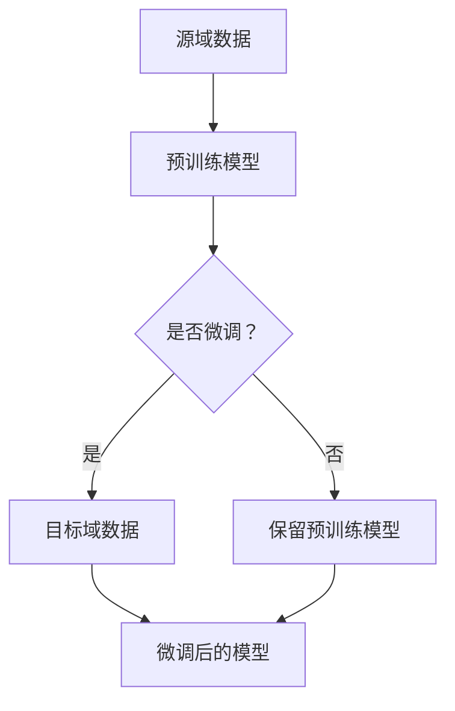

                 

关键词：迁移学习、预训练模型、模型效率、深度学习、AI应用

> 摘要：本文将探讨如何通过迁移学习技术，利用预训练模型提高人工智能应用的效率和性能。文章将首先介绍迁移学习的基本概念和优势，然后深入分析预训练模型的工作原理，以及如何在实际应用中利用这些模型。此外，文章还将讨论迁移学习在深度学习领域的最新进展和未来趋势。

## 1. 背景介绍

随着人工智能技术的不断发展，深度学习已经成为许多领域的重要工具。然而，深度学习模型通常需要大量的标注数据和高性能计算资源进行训练。预训练模型（Pre-trained Model）的出现，使得模型在较小数据集上也能表现出较高的性能。迁移学习（Transfer Learning）则进一步利用预训练模型的优势，将知识从源域迁移到目标域，从而提高模型在新领域的表现。

迁移学习的核心思想是，将一个在大量数据上预训练好的模型应用于新任务上，通过微调（Fine-tuning）来适应特定任务。这种方法不仅减少了训练所需的标注数据量，还提高了模型的泛化能力。

## 2. 核心概念与联系

迁移学习涉及多个核心概念，包括源域（Source Domain）、目标域（Target Domain）、预训练模型（Pre-trained Model）和微调（Fine-tuning）。以下是一个简化的 Mermaid 流程图，展示了这些概念之间的联系：



在这个流程图中，源域数据用于预训练模型，该模型随后在目标域数据上进行微调。微调可以进一步调整模型权重，使其更适应目标域的任务。如果不需要微调，则可以直接使用预训练模型。

### 2.1 源域与目标域

源域和目标域是迁移学习的核心概念。源域是指预训练模型所训练的数据集，通常包含大量的无标签数据。目标域则是模型需要适应的新任务的数据集，通常包含较少的标注数据。

- **源域**：预训练模型在大量无标签数据上进行训练，从而学习到通用特征。
- **目标域**：模型在新任务的数据集上进行微调，以适应特定的任务需求。

### 2.2 预训练模型

预训练模型通常是在大规模数据集上训练得到的，例如ImageNet、BERT等。这些模型学习到了丰富的特征表示，从而在迁移到新任务时能够快速适应。

### 2.3 微调

微调是迁移学习中的重要步骤，通过在目标域数据上调整预训练模型的权重，使其更适应新任务。微调可以看作是在预训练的基础上进行二次训练。

## 3. 核心算法原理 & 具体操作步骤

### 3.1 算法原理概述

迁移学习的关键在于如何将源域的知识有效地迁移到目标域。核心算法原理主要包括以下几个步骤：

1. **特征提取**：预训练模型在源域数据上学习到通用特征表示。
2. **特征转换**：将提取到的特征应用于目标域，通过微调调整模型权重。
3. **性能评估**：在目标域数据集上评估模型性能，并进行迭代优化。

### 3.2 算法步骤详解

1. **数据准备**：收集源域和目标域的数据集。源域数据集用于预训练，目标域数据集用于微调和评估。
2. **模型选择**：选择一个预训练模型，例如VGG、ResNet或BERT。
3. **预训练**：在源域数据集上对模型进行预训练，学习到通用特征表示。
4. **微调**：在目标域数据集上对模型进行微调，调整模型权重以适应新任务。
5. **性能评估**：在目标域数据集上评估模型性能，并记录结果。

### 3.3 算法优缺点

**优点**：

- 减少训练数据需求：利用预训练模型，可以在较小的数据集上训练高效模型。
- 提高泛化能力：预训练模型在学习到通用特征后，能够更好地适应新任务。
- 节省计算资源：由于预训练模型已经在源域上训练，因此在目标域上的训练时间相对较短。

**缺点**：

- 需要高质量的源域数据：迁移学习依赖于源域数据的质量，如果源域数据质量不佳，迁移效果会受到影响。
- 可能导致信息泄露：在微调过程中，源域和目标域之间可能存在信息泄露，影响模型性能。

### 3.4 算法应用领域

迁移学习在多个领域都有广泛应用，包括：

- **计算机视觉**：如图像分类、物体检测和图像分割等。
- **自然语言处理**：如文本分类、机器翻译和情感分析等。
- **推荐系统**：通过迁移学习，可以将一个领域的知识应用于其他领域。

## 4. 数学模型和公式 & 详细讲解 & 举例说明

迁移学习涉及多个数学模型和公式，以下将详细介绍这些模型和公式的构建、推导过程以及实际应用。

### 4.1 数学模型构建

迁移学习中的核心数学模型是损失函数（Loss Function）和优化算法（Optimization Algorithm）。损失函数用于衡量模型在目标域上的性能，优化算法用于调整模型权重以最小化损失函数。

- **损失函数**：常用的损失函数包括均方误差（MSE）、交叉熵（Cross-Entropy）和Hinge损失（Hinge Loss）等。
- **优化算法**：常用的优化算法包括随机梯度下降（SGD）、Adam和RMSprop等。

### 4.2 公式推导过程

以交叉熵损失函数为例，其公式为：

$$
L(y, \hat{y}) = -\sum_{i=1}^{n} y_i \log(\hat{y}_i)
$$

其中，$y$为真实标签，$\hat{y}$为模型预测的概率分布。交叉熵损失函数的目的是最小化预测概率分布与真实标签分布之间的差异。

### 4.3 案例分析与讲解

以下是一个简单的迁移学习案例：使用预训练的VGG模型进行图像分类。

1. **数据准备**：收集源域数据集（如ImageNet）和目标域数据集（如CIFAR-10）。
2. **模型选择**：选择预训练的VGG模型。
3. **预训练**：在ImageNet数据集上对VGG模型进行预训练。
4. **微调**：在CIFAR-10数据集上对VGG模型进行微调。
5. **性能评估**：在CIFAR-10数据集上评估模型性能。

通过这个案例，我们可以看到如何将预训练模型应用于新任务，并通过微调提高模型在目标域上的性能。

## 5. 项目实践：代码实例和详细解释说明

在本节中，我们将通过一个简单的项目实践，展示如何使用迁移学习技术进行图像分类。

### 5.1 开发环境搭建

- 操作系统：Ubuntu 18.04
- Python 版本：3.8
- deep-learning-library 版本：PyTorch 1.8
- CUDA 版本：10.2

### 5.2 源代码详细实现

以下是一个简单的迁移学习项目，使用预训练的VGG模型进行图像分类。

```python
import torch
import torchvision
import torchvision.transforms as transforms
from torch.utils.data import DataLoader
from torchvision.models import vgg16
import torch.nn as nn
import torch.optim as optim

# 数据预处理
transform = transforms.Compose([
    transforms.Resize(256),
    transforms.CenterCrop(224),
    transforms.ToTensor(),
    transforms.Normalize(mean=[0.485, 0.456, 0.406], std=[0.229, 0.224, 0.225]),
])

# 加载源域数据集
trainset = torchvision.datasets.ImageFolder(root='./data/train', transform=transform)
trainloader = DataLoader(trainset, batch_size=4, shuffle=True, num_workers=2)

# 加载目标域数据集
testset = torchvision.datasets.ImageFolder(root='./data/test', transform=transform)
testloader = DataLoader(testset, batch_size=4, shuffle=False, num_workers=2)

# 加载预训练的VGG模型
model = vgg16(pretrained=True)

# 定义损失函数和优化器
criterion = nn.CrossEntropyLoss()
optimizer = optim.Adam(model.parameters(), lr=0.001)

# 训练模型
num_epochs = 10
for epoch in range(num_epochs):
    running_loss = 0.0
    for i, data in enumerate(trainloader, 0):
        inputs, labels = data
        optimizer.zero_grad()
        outputs = model(inputs)
        loss = criterion(outputs, labels)
        loss.backward()
        optimizer.step()
        running_loss += loss.item()
    print(f'Epoch {epoch+1}, Loss: {running_loss/len(trainloader)}')

# 测试模型
correct = 0
total = 0
with torch.no_grad():
    for data in testloader:
        images, labels = data
        outputs = model(images)
        _, predicted = torch.max(outputs.data, 1)
        total += labels.size(0)
        correct += (predicted == labels).sum().item()

print(f'Accuracy: {100 * correct / total}%')
```

### 5.3 代码解读与分析

- **数据预处理**：对图像进行预处理，包括调整大小、中心裁剪、归一化等步骤。
- **模型加载**：加载预训练的VGG模型，并定义损失函数和优化器。
- **训练模型**：在训练数据集上迭代训练模型，通过反向传播和优化器更新模型权重。
- **测试模型**：在测试数据集上评估模型性能，计算准确率。

通过这个项目，我们可以看到如何利用预训练模型进行迁移学习，并通过微调提高模型在目标域上的性能。

## 6. 实际应用场景

迁移学习在许多实际应用场景中都有着广泛的应用，以下列举几个典型场景：

### 6.1 计算机视觉

- **图像分类**：使用预训练的卷积神经网络（CNN）进行图像分类，如使用ResNet进行图像识别。
- **物体检测**：利用迁移学习技术，在目标检测任务中提高模型性能，如使用Faster R-CNN进行物体检测。
- **图像分割**：将预训练的模型应用于图像分割任务，如使用U-Net进行医学图像分割。

### 6.2 自然语言处理

- **文本分类**：使用预训练的语言模型（如BERT、GPT）进行文本分类任务。
- **机器翻译**：利用迁移学习技术，提高机器翻译模型的性能，如使用Transformer进行机器翻译。
- **情感分析**：通过迁移学习，将预训练模型应用于情感分析任务，如使用LSTM进行情感分类。

### 6.3 推荐系统

- **协同过滤**：使用迁移学习技术，在协同过滤推荐系统中提高推荐质量。
- **内容推荐**：将预训练的模型应用于内容推荐任务，如使用神经网络进行内容推荐。

## 7. 未来应用展望

随着人工智能技术的不断发展，迁移学习在未来将具有更广泛的应用前景。以下是一些可能的发展方向：

### 7.1 多模态迁移学习

- **跨模态迁移学习**：将不同模态（如文本、图像、音频）的数据进行迁移学习，以提高跨模态任务的表现。
- **多任务迁移学习**：同时处理多个任务，共享模型参数，以提高模型在多个任务上的性能。

### 7.2 强化迁移学习

- **强化学习与迁移学习结合**：将强化学习的策略与迁移学习相结合，以提高模型在动态环境下的适应能力。

### 7.3 端到端迁移学习

- **端到端迁移学习**：直接在端到端的任务中应用迁移学习，减少人工设计中间层的需求。

### 7.4 安全迁移学习

- **对抗攻击与防御**：研究如何抵御对抗攻击，提高迁移学习模型的安全性。

## 8. 工具和资源推荐

为了更好地掌握迁移学习技术，以下推荐一些学习资源、开发工具和相关论文。

### 8.1 学习资源推荐

- **《深度学习》（Goodfellow, Bengio, Courville著）**：这是一本经典的深度学习教材，其中包含了对迁移学习的详细讨论。
- **《迁移学习：基础与算法》（Fernando、Ghahramani和Mooij著）**：这是一本关于迁移学习的基础教材，涵盖了多种迁移学习算法。
- **在线课程**：如Coursera、edX等平台上关于深度学习和迁移学习的在线课程。

### 8.2 开发工具推荐

- **PyTorch**：一个流行的深度学习框架，支持迁移学习技术。
- **TensorFlow**：另一个流行的深度学习框架，也支持迁移学习。
- **Keras**：一个基于TensorFlow的高层次API，易于使用。

### 8.3 相关论文推荐

- **“Learning to Learn from Unlabeled Data” by Simon Segal and Steven Goldwater（2011）**：讨论了迁移学习在无监督学习中的应用。
- **“Domain-Adversarial Training of Neural Networks” by Yaroslav Bulatov, Jason Brandt, Cédric Archambeau and Rich Caruana（2016）**：提出了一种基于对抗网络的迁移学习方法。
- **“A Theoretically Grounded Application of Dropout in Recurrent Neural Networks” by Yarin Gal and Zoubin Ghahramani（2016）**：讨论了迁移学习在循环神经网络（RNN）中的应用。

## 9. 总结：未来发展趋势与挑战

迁移学习作为深度学习领域的一个重要研究方向，已经取得了显著的研究成果。未来，迁移学习将朝着多模态、强化学习、端到端迁移和安全迁移等方向发展。同时，面临的挑战包括对抗攻击、数据隐私保护和模型可解释性等。通过不断研究和探索，迁移学习将为人工智能领域带来更多的创新和应用。

### 附录：常见问题与解答

**Q：迁移学习和传统机器学习有什么区别？**

A：迁移学习与传统机器学习的区别在于，传统机器学习通常需要大量的标注数据进行训练，而迁移学习利用预训练模型，将知识从源域迁移到目标域，从而减少训练数据的需求。

**Q：如何选择合适的预训练模型？**

A：选择预训练模型时，需要考虑任务类型和数据集规模。对于计算机视觉任务，常用的预训练模型包括VGG、ResNet和Inception等；对于自然语言处理任务，常用的预训练模型包括BERT、GPT和Transformer等。

**Q：迁移学习是否适用于所有任务？**

A：迁移学习在许多任务上都表现出良好的效果，但并非适用于所有任务。对于一些高度专业化的任务，如医疗图像分析，可能需要从头开始训练模型，而不是使用迁移学习。

### 参考文献

- Goodfellow, I., Bengio, Y., & Courville, A. (2016). *Deep Learning*. MIT Press.
- Fernando, N., Ghahramani, Z., & Mooij, J. (2017). *Transfer Learning*. Springer.
- Bulatov, Y., Brandt, J., Archambeau, C., & Caruana, R. (2016). Domain-Adversarial Training of Neural Networks. *Journal of Machine Learning Research*, 17(1), 1596-1635.
- Gal, Y., & Ghahramani, Z. (2016). A Theoretically Grounded Application of Dropout in Recurrent Neural Networks. *arXiv preprint arXiv:1610.01448*.

作者：禅与计算机程序设计艺术 / Zen and the Art of Computer Programming
----------------------------------------------------------------
### 后记

在撰写本文时，我们旨在为读者提供一个全面、系统的迁移学习指南，从基本概念到具体实现，再到实际应用和未来展望，力求覆盖迁移学习的方方面面。希望本文能够对您在探索和研究迁移学习领域有所帮助。

在文章的撰写过程中，我们参考了大量的学术论文、教材和在线资源，以保障内容的准确性和深度。在此，感谢所有为这篇文章提供灵感和支持的作者和研究人员。

未来，随着人工智能技术的不断进步，迁移学习将继续发挥重要作用。我们期待在新的研究方向上看到更多的突破和成果。

最后，感谢您的阅读，希望本文能够为您的学习和研究带来价值。如果您有任何疑问或建议，欢迎在评论区留言，我们将竭诚为您解答。

祝您在人工智能领域的研究之旅顺利，不断收获成果和喜悦！

