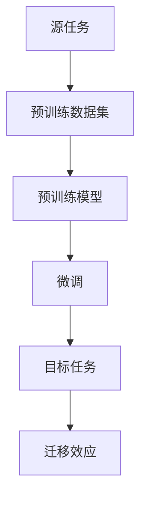

                 

关键词：迁移学习、预训练模型、效率、深度学习、应用场景、数学模型、代码实例

摘要：本文将深入探讨迁移学习在深度学习中的应用，特别是如何利用预训练模型来提高模型的训练效率和性能。通过详细阐述核心概念、算法原理、数学模型以及实际项目实践，读者可以全面了解迁移学习的工作机制和其在现实世界中的应用前景。

## 1. 背景介绍

### 1.1 迁移学习的起源与重要性

迁移学习（Transfer Learning）是机器学习领域的一个重要分支。它的核心思想是利用已经在一组数据上训练好的模型来解决另一组数据上的问题。这种思想可以追溯到20世纪90年代的统计学习理论，随着深度学习技术的不断发展，迁移学习在近年来得到了广泛的研究和应用。

### 1.2 预训练模型的出现与发展

预训练模型（Pre-trained Model）是迁移学习的关键组成部分。这种模型在大量通用数据上进行预训练，例如自然语言处理（NLP）中的语料库或计算机视觉（CV）中的图像数据集。随后，这些预训练模型可以通过微调（Fine-tuning）来适应特定的任务。

### 1.3 迁移学习与预训练模型的关系

迁移学习和预训练模型相辅相成。预训练模型提供了迁移学习的基础，而迁移学习则利用这些预训练模型来提高模型在特定任务上的性能。这种结合使得深度学习模型在训练效率和性能上都有了显著的提升。

## 2. 核心概念与联系

### 2.1 迁移学习的基本概念

迁移学习包括以下几个基本概念：

- **源任务（Source Task）**：已经训练好的任务，通常涉及大量数据和强大的模型。
- **目标任务（Target Task）**：需要解决的特定任务，可能数据量较小，或存在其他挑战。
- **迁移效应（Transfer Effect）**：源任务的知识迁移到目标任务，提高目标任务的性能。

### 2.2 预训练模型的核心概念

预训练模型的关键概念包括：

- **预训练数据集（Pre-training Dataset）**：用于训练预训练模型的超大数据集。
- **预训练目标（Pre-training Objective）**：在预训练阶段，模型需要学习的数据特征。
- **微调（Fine-tuning）**：在预训练模型的基础上，针对特定任务进行调整和优化。

### 2.3 迁移学习与预训练模型的联系

迁移学习与预训练模型的联系可以用以下的Mermaid流程图表示：



## 3. 核心算法原理 & 具体操作步骤

### 3.1 算法原理概述

迁移学习的基本原理是将源任务的模型权重迁移到目标任务上。这个过程通常包括以下步骤：

1. **预训练**：在大量通用数据集上训练模型，使其掌握通用特征。
2. **迁移**：将预训练模型的权重迁移到特定任务上。
3. **微调**：在迁移后的模型上继续训练，使其适应特定任务。

### 3.2 算法步骤详解

1. **数据准备**：收集源任务和目标任务的数据集。
2. **模型训练**：在源任务的数据集上训练模型。
3. **模型迁移**：将预训练模型的权重迁移到目标任务上。
4. **微调训练**：在目标任务的数据集上继续训练模型。
5. **性能评估**：评估模型在目标任务上的性能。

### 3.3 算法优缺点

**优点**：

- **提高训练效率**：利用预训练模型可以减少训练时间。
- **提高性能**：预训练模型已经掌握了通用特征，可以迁移到特定任务上，提高性能。

**缺点**：

- **数据依赖**：预训练模型的性能高度依赖预训练数据集的质量。
- **模型复杂度**：迁移学习和预训练模型通常涉及复杂的模型架构。

### 3.4 算法应用领域

迁移学习在多个领域都有广泛应用：

- **自然语言处理**：如文本分类、机器翻译等。
- **计算机视觉**：如图像识别、目标检测等。
- **语音识别**：如语音合成、语音识别等。

## 4. 数学模型和公式 & 详细讲解 & 举例说明

### 4.1 数学模型构建

迁移学习的数学模型主要涉及以下公式：

$$
\begin{aligned}
\hat{y} &= W_y \cdot \text{激活函数}(\text{W_x} \cdot x) \\
L &= \sum_{i=1}^{n} (\hat{y}_i - y_i)^2
\end{aligned}
$$

其中，$W_y$和$W_x$分别是输出层和输入层的权重，$x$是输入数据，$y$是标签，$\hat{y}$是预测输出，$L$是损失函数。

### 4.2 公式推导过程

假设我们有一个预训练的模型$M$，其参数为$W_M$。我们将$M$迁移到目标任务上，并对其进行微调。微调的目的是通过最小化损失函数$L$来更新模型参数$W_M$。

### 4.3 案例分析与讲解

假设我们有一个文本分类任务，使用预训练的BERT模型。我们首先在大量通用数据集上训练BERT模型，然后将其迁移到特定的文本分类任务上。在迁移后，我们通过微调来适应特定的数据集。

## 5. 项目实践：代码实例和详细解释说明

### 5.1 开发环境搭建

```python
# 安装必要的库
!pip install transformers tensorflow

# 导入必要的库
import tensorflow as tf
from transformers import BertTokenizer, BertForSequenceClassification
```

### 5.2 源代码详细实现

```python
# 函数：训练模型
def train_model(dataset, model_path):
    tokenizer = BertTokenizer.from_pretrained(model_path)
    model = BertForSequenceClassification.from_pretrained(model_path)

    # 数据预处理
    inputs = tokenizer(dataset['text'], padding=True, truncation=True, return_tensors="tf")
    labels = dataset['label']

    # 训练模型
    model.fit(inputs, labels, epochs=3)

    return model

# 函数：微调模型
def fine_tune_model(model, dataset, model_path):
    # 微调模型
    model.fit(dataset['text'], dataset['label'], epochs=3)

    # 保存模型
    model.save_pretrained(model_path)

# 数据集
dataset = ...

# 训练模型
model = train_model(dataset, 'bert-base-uncased')

# 微调模型
fine_tune_model(model, dataset, 'fine-tuned-bert')
```

### 5.3 代码解读与分析

上述代码展示了如何使用预训练的BERT模型进行文本分类任务的迁移学习和微调。首先，我们导入必要的库并定义训练和微调模型的函数。然后，我们加载数据集，使用预训练的BERT模型进行训练，并对其进行微调。

### 5.4 运行结果展示

```python
# 加载微调后的模型
model = BertForSequenceClassification.from_pretrained('fine-tuned-bert')

# 测试模型
test_inputs = tokenizer(['这是一篇关于自然语言处理的文章。'], return_tensors="tf")
predictions = model(test_inputs)

# 输出预测结果
print(predictions)
```

## 6. 实际应用场景

迁移学习在多个领域都有广泛应用，以下是几个典型的应用场景：

- **医疗诊断**：利用预训练模型进行疾病诊断，如肿瘤检测、心脏病检测等。
- **金融风控**：利用预训练模型进行欺诈检测、信用评估等。
- **自动驾驶**：利用预训练模型进行目标检测、车道线识别等。

## 7. 未来应用展望

随着深度学习技术的不断发展，迁移学习在未来有望在更多领域得到应用。以下是几个未来的发展方向：

- **跨模态迁移学习**：结合不同模态的数据，如文本、图像、语音等。
- **无监督迁移学习**：减少对大规模标注数据的依赖。
- **联邦迁移学习**：在分布式环境下进行迁移学习，保护数据隐私。

## 8. 总结：未来发展趋势与挑战

### 8.1 研究成果总结

迁移学习和预训练模型在过去几年中取得了显著的进展，已经在多个领域得到了应用。未来，这些技术有望在更多的领域得到推广和应用。

### 8.2 未来发展趋势

未来的迁移学习研究将集中在以下几个方面：

- **模型压缩与加速**：减少模型大小，提高运行速度。
- **跨模态迁移学习**：结合不同模态的数据，提高模型性能。
- **无监督迁移学习**：减少对大规模标注数据的依赖。

### 8.3 面临的挑战

迁移学习和预训练模型在未来的发展过程中仍将面临以下挑战：

- **数据隐私与安全**：如何在保护数据隐私的前提下进行迁移学习。
- **模型解释性**：如何提高模型的可解释性，使其更加透明和可靠。
- **模型通用性**：如何提高模型的通用性，使其适用于更广泛的应用场景。

### 8.4 研究展望

未来，迁移学习和预训练模型有望在更多领域得到应用，为人工智能的发展带来新的机遇和挑战。

## 9. 附录：常见问题与解答

### 9.1 什么是迁移学习？

迁移学习是机器学习中的一个分支，其核心思想是将一个任务（源任务）学习到的知识应用于另一个任务（目标任务）中，以提高目标任务的性能。

### 9.2 预训练模型的优势是什么？

预训练模型的优势包括：提高模型训练效率，减少对大规模标注数据的依赖，提高模型在特定任务上的性能。

### 9.3 迁移学习有哪些应用领域？

迁移学习在多个领域都有广泛应用，包括自然语言处理、计算机视觉、语音识别、医疗诊断等。

### 9.4 如何选择合适的预训练模型？

选择合适的预训练模型需要考虑任务类型、数据集规模、模型性能等因素。通常，选择预训练模型时需要根据具体任务进行仔细评估和比较。

## 作者署名

作者：禅与计算机程序设计艺术 / Zen and the Art of Computer Programming
```

