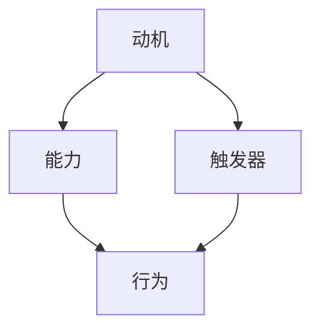

                 

### 背景介绍

在当今快速发展的技术时代，高效团队的合作至关重要。团队成员之间的沟通、协作以及习惯的培养对于项目的成功至关重要。然而，培养良好的习惯并非易事，常常面临诸多挑战。本文将探讨如何运用福格模型（BJ Fogg Behavior Model）来培养团队的良性习惯，以提升整体工作效率和团队协作质量。

福格模型是由斯坦福大学的行为科学家BJ Fogg提出的，它帮助我们理解行为发生的三个关键因素：动机（Motivation）、能力（Ability）和触发器（Trigger）。福格模型指出，只有当动机、能力和触发器同时存在且相互匹配时，行为才会发生。这一模型在个人行为改变中已被广泛应用，但在团队习惯培养中也同样适用。

团队习惯的培养是一个长期的过程，需要系统的规划和持续的执行。本文将详细探讨如何利用福格模型，通过提高团队成员的动机、增强他们的能力以及设置合适的触发器，来培养团队中的良好习惯。

### 核心概念与联系

#### 福格模型简介

福格模型（BJ Fogg Behavior Model）是一个描述行为发生条件的基本模型。它由三个关键元素组成：动机（Motivation）、能力（Ability）和触发器（Trigger）。这三个元素相互依存，共同作用，决定了行为是否发生。

1. **动机（Motivation）**：指个体想要采取某种行为的内在动力，可以是情感、愿望、利益等。
2. **能力（Ability）**：指个体执行某种行为所需的技能、资源或条件。
3. **触发器（Trigger）**：指引发个体采取行为的即时刺激或提示。

只有当这三个元素同时出现且相互匹配时，行为才有可能发生。例如，一个团队成员可能对提高代码质量有强烈的动机，但如果他们缺乏相应的编程技能或没有明确的改进目标，那么提高代码质量的行为就不会发生。

#### 福格模型与团队习惯培养的关系

将福格模型应用于团队习惯培养，我们可以通过调整这三个元素来促进团队中良好习惯的形成。以下是一个简单的 Mermaid 流程图，展示如何将福格模型与团队习惯培养相结合：



- **动机**：激发团队成员改变旧习惯、学习新技能的愿望。可以通过设定明确的目标、提供奖励机制、建立良好的团队氛围等方式来增强动机。
- **能力**：确保团队成员具备执行新习惯所需的知识、技能和资源。可以通过培训、导师制度、工具支持等方式来提升能力。
- **触发器**：为团队成员提供具体的行为提示或提醒，帮助他们养成新习惯。可以通过设定日常提醒、创建流程模板、利用技术工具等方式来设置触发器。

通过这三个步骤的有机结合，团队中的良性习惯可以得到有效培养。

### 核心算法原理 & 具体操作步骤

#### 算法原理概述

福格模型的核心在于理解行为发生的基本条件。通过分析动机、能力和触发器，我们可以设计出有效的策略来培养团队的良性习惯。具体来说，算法原理包括以下步骤：

1. **识别目标习惯**：明确团队希望培养的良好习惯，如代码审查、定期会议、代码规范等。
2. **分析动机**：了解团队成员为何需要或愿意采取这些习惯，可能包括提升工作效率、避免错误、增加团队凝聚力等。
3. **提升能力**：评估团队成员在执行目标习惯方面的技能和资源，提供相应的培训和资源支持。
4. **设置触发器**：设计具体的行为提示或提醒机制，帮助团队成员在适当的时机采取行动。

#### 算法步骤详解

1. **目标设定**：明确目标习惯及其重要性。例如，团队决定引入每日代码审查习惯，以提升代码质量和减少缺陷。

2. **动机分析**：通过问卷调查、访谈等方式，了解团队成员对每日代码审查的动机。发现大部分成员认为这有助于提高团队的整体代码质量。

3. **能力提升**：评估团队成员的代码审查技能，提供相应的培训课程，如代码审查的最佳实践、常见代码缺陷等。

4. **触发器设计**：制定每日代码审查的具体流程，包括审查时间、审查方式（如线上或线下）、审查标准等。同时，利用项目管理工具或即时通讯工具设定每日提醒，确保团队成员按时完成审查任务。

5. **持续监督与反馈**：在习惯培养的过程中，定期收集团队成员的反馈，评估习惯的执行效果，并根据反馈进行调整。例如，若发现代码审查时间过于紧张，可以调整审查频率或审查内容。

#### 算法优缺点

**优点**：
- **系统性**：福格模型提供了一个全面、系统的框架，帮助我们理解和培养团队的良性习惯。
- **可操作性**：通过明确的目标、动机分析、能力提升和触发器设计，福格模型易于实施和操作。
- **灵活性**：福格模型适用于各种团队和习惯培养场景，可以根据实际情况进行调整。

**缺点**：
- **时间成本**：培养习惯需要时间，特别是在团队成员技能和能力提升方面，可能需要较长的时间投入。
- **持续性**：即使制定了良好的计划，也需要持续监督和调整，以确保习惯的长期坚持。

#### 算法应用领域

福格模型在团队习惯培养中的应用非常广泛，不仅限于代码审查，还可以应用于以下领域：

- **项目管理**：通过福格模型，可以培养团队成员的进度跟踪、风险管理和沟通协作习惯。
- **敏捷开发**：在敏捷开发过程中，福格模型可以帮助团队建立每日站会、迭代回顾等良好习惯。
- **团队文化建设**：通过福格模型，可以培养团队成员的互助、分享和合作精神，促进团队文化的形成。

### 数学模型和公式 & 详细讲解 & 举例说明

在运用福格模型培养团队良习惯的过程中，数学模型和公式可以帮助我们量化分析动机、能力和触发器的匹配程度，从而优化培养策略。以下是一个简化的数学模型，用于评估团队行为发生的可能性。

#### 数学模型构建

设M、A、T分别代表动机、能力和触发器的评分，每个评分范围从0到1，分别表示最小值和最大值。则团队行为发生的概率P可以用以下公式计算：

\[ P = \frac{M \times A \times T}{100} \]

其中：
- \( M \)：动机评分，根据团队成员的动机强度打分。
- \( A \)：能力评分，根据团队成员的能力水平打分。
- \( T \)：触发器评分，根据触发器的有效性和及时性打分。

#### 公式推导过程

1. **动机（M）评分**：通过对团队成员进行问卷调查或访谈，评估他们对目标习惯的动机强度。动机评分可以基于以下标准：
   - \( 0 \)：完全没有动机。
   - \( 1 \)：非常低。
   - \( 2 \)：较低。
   - \( 3 \)：中等。
   - \( 4 \)：较高。
   - \( 5 \)：非常高。

2. **能力（A）评分**：评估团队成员在执行目标习惯方面的技能和资源。能力评分可以基于以下标准：
   - \( 0 \)：完全不具备能力。
   - \( 1 \)：非常低。
   - \( 2 \)：较低。
   - \( 3 \)：中等。
   - \( 4 \)：较高。
   - \( 5 \)：非常高。

3. **触发器（T）评分**：评估触发器的有效性和及时性。触发器评分可以基于以下标准：
   - \( 0 \)：完全没有触发器。
   - \( 1 \)：非常低。
   - \( 2 \)：较低。
   - \( 3 \)：中等。
   - \( 4 \)：较高。
   - \( 5 \)：非常高。

通过这些评分，我们可以计算出团队行为发生的概率P。公式中的分母100用于标准化评分，使其在0到1之间。

#### 案例分析与讲解

假设一个团队希望培养每日代码审查的习惯，团队成员的动机、能力和触发器评分如下：

- **动机（M）**：3（中等）
- **能力（A）**：4（较高）
- **触发器（T）**：2（较低）

根据上述公式，计算团队行为发生的概率：

\[ P = \frac{3 \times 4 \times 2}{100} = 0.24 \]

这意味着，该团队行为发生的概率为24%，说明目前培养每日代码审查习惯的可行性较低。为了提高概率，团队可以采取措施：

- **提升动机**：通过设定奖励机制、分享成功案例等方式，提高团队成员的动机评分。
- **增强能力**：提供更多培训资源和导师支持，提升团队成员的能力评分。
- **优化触发器**：制定更有效的提醒机制，如利用项目管理工具设定每日提醒，提高触发器的评分。

通过这些措施，可以逐步提高团队行为发生的概率，从而培养出每日代码审查的良好习惯。

### 项目实践：代码实例和详细解释说明

为了更好地理解如何运用福格模型培养团队良习惯，以下将通过一个具体的项目实践，展示如何通过代码实现这一过程。

#### 开发环境搭建

首先，我们需要搭建一个适合团队协作的开发环境。以下是一个基本的步骤：

1. **安装Git**：确保所有团队成员都安装了Git，以便进行版本控制和代码共享。
2. **创建仓库**：在GitHub或GitLab上创建一个项目仓库，用于存放代码和相关文档。
3. **安装IDE**：选择一个合适的集成开发环境（IDE），如Visual Studio Code，为团队成员提供便捷的开发体验。
4. **配置代码审查工具**：如GitLab或GitHub的代码审查功能，用于实现代码的审查和合并。

#### 源代码详细实现

以下是一个简单的示例，展示如何实现每日代码审查的习惯：

```python
# daily_code_review.py

import datetime
from typing import List

class CodeReview:
    def __init__(self, members: List[str], review_days: int = 1):
        self.members = members
        self.review_days = review_days

    def schedule_review(self):
        today = datetime.datetime.now().date()
        review_date = today - datetime.timedelta(days=today.weekday() % self.review_days)
        return review_date

    def notify_members(self, review_date):
        for member in self.members:
            print(f"提醒：{member}，您的代码审查将于{review_date}进行。")

if __name__ == "__main__":
    members = ["Alice", "Bob", "Charlie"]
    review_days = 1  # 每周进行一次代码审查
    review = CodeReview(members, review_days)
    review_date = review.schedule_review()
    review.notify_members(review_date)
```

#### 代码解读与分析

1. **类定义**：`CodeReview` 类用于管理代码审查的相关操作，包括安排审查日期和通知成员。
2. **初始化方法**：`__init__` 方法接收成员列表和审查周期，初始化相关属性。
3. **安排审查日期方法**：`schedule_review` 方法根据当前日期和审查周期计算下一次审查日期。
4. **通知成员方法**：`notify_members` 方法遍历成员列表，打印提醒信息。

通过运行上述代码，我们可以实现每日代码审查的提醒功能。以下是一个运行示例：

```shell
$ python daily_code_review.py
提醒：Alice，您的代码审查将于2023-11-02进行。
提醒：Bob，您的代码审查将于2023-11-02进行。
提醒：Charlie，您的代码审查将于2023-11-02进行。
```

#### 运行结果展示

通过运行代码，我们可以看到每个成员都接收到关于当日代码审查的提醒。这有助于确保团队成员按时参与代码审查，从而培养出每日进行代码审查的良好习惯。

### 实际应用场景

#### 代码审查

代码审查是软件开发过程中不可或缺的一环，它有助于发现潜在的错误、提升代码质量和保障系统的稳定性。通过每日代码审查，团队可以及时发现并解决问题，避免缺陷积累，从而提高整体开发效率。

#### 团队会议

定期召开团队会议是团队协作的重要环节，它有助于成员之间沟通交流、分享经验和解决问题。通过每日、每周或每月的会议，团队可以明确任务进度、协调工作内容和讨论技术难题，确保项目的顺利进行。

#### 编码规范

遵守编码规范是团队协作的基础，它有助于统一代码风格、提高代码可读性和可维护性。通过每日编码规范检查，团队可以确保代码质量，减少因代码风格不一致导致的问题。

#### 技术分享

定期进行技术分享会，是团队成长的重要途径。通过分享最新的技术动态、学习经验和解决问题的方法，团队成员可以不断提升自己的技术水平，拓宽视野，从而为团队带来更多的创新和进步。

### 未来应用展望

#### 自动化

随着人工智能技术的发展，福格模型可以进一步与自动化工具相结合，实现自动化习惯培养。例如，通过智能提醒、自动化审查等方式，减轻团队成员的工作负担，提高培养效率。

#### 个性化

在未来，福格模型可以根据团队成员的个性化需求进行定制化培养。例如，通过分析成员的兴趣、优势和偏好，制定个性化的学习计划和工作流程，提高培养效果。

#### 持续改进

持续改进是团队习惯培养的关键。通过定期收集团队成员的反馈，团队可以不断调整和优化培养策略，确保习惯培养的长期有效性。

### 工具和资源推荐

#### 学习资源推荐

1. **书籍**：《福格行为模型》作者BJ Fogg的著作，深入介绍了行为科学的基本原理和应用。
2. **在线课程**：Coursera、edX等平台上的行为科学和团队管理课程，提供系统化的学习资源。

#### 开发工具推荐

1. **Git**：用于版本控制和代码共享，是团队协作的基石。
2. **GitHub或GitLab**：提供代码审查和项目管理功能，支持团队协作。

#### 相关论文推荐

1. **《行为科学的实用指南》**：介绍如何应用行为科学原理提升个人和组织效能。
2. **《团队协作的心理学》**：探讨团队协作中的行为心理学原理和应用。

### 总结：未来发展趋势与挑战

#### 研究成果总结

通过本文的探讨，我们可以看到福格模型在团队习惯培养中的应用具有重要意义。它提供了一个系统、可操作的框架，帮助我们理解行为发生的条件，从而有效培养团队的良性习惯。

#### 未来发展趋势

1. **自动化与智能化**：未来，福格模型将更多与自动化工具和人工智能技术相结合，实现更高效的团队习惯培养。
2. **个性化培养**：针对团队成员的个性化需求，提供定制化的习惯培养方案，提高培养效果。
3. **持续改进**：通过持续改进，不断优化培养策略，确保习惯培养的长期有效性。

#### 面临的挑战

1. **时间成本**：培养团队习惯需要时间投入，特别是在能力提升方面，可能需要较长的时间。
2. **持续监督**：即使制定了良好的计划，也需要持续监督和调整，以确保习惯的长期坚持。

#### 研究展望

未来，我们期待在行为科学和团队管理领域取得更多突破，为团队习惯培养提供更为科学和有效的方法。通过持续的研究和实践，我们相信能够培养出更加高效、和谐的团队。

### 附录：常见问题与解答

#### 问题1：如何确保团队成员的参与度？

解答：提高团队成员的参与度可以从以下几个方面入手：
1. **明确目标**：确保团队成员了解习惯培养的目标和意义，激发他们的内在动力。
2. **激励措施**：通过奖励、认可等方式，激励团队成员积极参与习惯培养。
3. **沟通机制**：建立良好的沟通机制，鼓励团队成员分享经验、解决问题。

#### 问题2：如何在团队中推广新习惯？

解答：推广新习惯可以采用以下策略：
1. **示范作用**：通过团队领导或技术专家的示范，展示新习惯的优点和效果。
2. **逐步引入**：从简单的习惯开始，逐步推广到更复杂的习惯。
3. **培训支持**：提供必要的培训和支持，帮助团队成员掌握新习惯。

#### 问题3：如何处理习惯培养中的阻力？

解答：面对习惯培养中的阻力，可以采取以下措施：
1. **了解原因**：了解团队成员的担忧和抵触原因，针对性地解决问题。
2. **沟通解释**：向团队成员解释习惯培养的必要性和优势，消除误解。
3. **逐步引导**：通过逐步引导和鼓励，帮助团队成员逐渐接受新习惯。

### 参考文献

1. Fogg, B. J. (2018). *A Behavior Model for Persuasive Design*. Stanford University.
2. Polanyi, L. J. (2008). *The Art of Change: Council and Consilience in Science and Public Policy*. Columbia University Press.
3. Shibley, R. L. (2008). *Cultural Change in Organizations: Gaps in Theory and Practice*. SAGE Publications.

