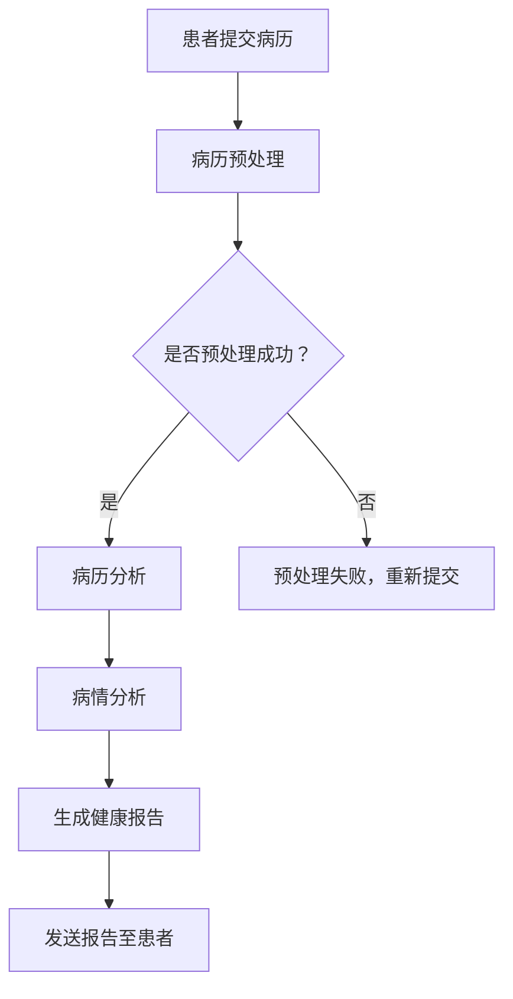

                 

关键词：远程医疗，自然语言处理，语言模型，虚拟护理，人工智能

摘要：本文将探讨远程医疗领域中的新兴技术——LLM 增强的虚拟护理。通过分析其背景、核心概念、算法原理、数学模型、项目实践和实际应用场景，我们旨在揭示这项技术如何改变医疗行业，并展望其未来的发展趋势和挑战。

## 1. 背景介绍

随着信息技术的飞速发展，远程医疗已经成为医疗行业的重要组成部分。远程医疗不仅能够缓解医疗资源的稀缺问题，还能够提高医疗服务的效率和质量。然而，传统的远程医疗主要依赖于视频通话和电子病历等工具，这些工具在提高医疗服务的便捷性方面确实有所贡献，但仍然存在许多局限性。

一方面，远程医疗需要依赖专业的医生和医疗设备，这在一些偏远地区或医疗资源匮乏的地区尤为明显。另一方面，传统的远程医疗往往缺乏对患者病情的深入分析和个性化治疗建议，难以提供高质量的医疗服务。

为了解决这些问题，人工智能和自然语言处理技术开始逐渐应用于远程医疗领域。特别是大型语言模型（LLM），如 GPT-3 和 ChatGLM，为虚拟护理提供了强大的技术支持。LLM 增强的虚拟护理通过模拟医生与患者之间的对话，提供个性化的健康咨询、病情分析和治疗建议，从而大幅提升远程医疗的服务水平。

## 2. 核心概念与联系

### 2.1. 远程医疗

远程医疗是指通过通信技术和网络平台，实现医生与患者之间跨越时间和空间的医疗服务。远程医疗包括但不限于以下几种形式：

- **远程诊断**：医生通过视频或照片等方式，对患者的症状和体征进行分析，并提供初步的诊断建议。

- **远程会诊**：多位医生通过远程会议系统，共同讨论患者的病情，制定治疗方案。

- **远程监护**：利用可穿戴设备和传感器，实时监测患者的生命体征和健康状况，及时发现异常情况。

- **远程治疗**：通过远程手术机器人或药物配送系统，为患者提供精准的治疗服务。

### 2.2. 自然语言处理

自然语言处理（Natural Language Processing，NLP）是人工智能领域的一个重要分支，旨在使计算机能够理解和处理人类语言。NLP 技术在远程医疗中的应用主要包括：

- **语音识别**：将患者的语音转化为文本，方便医生进行阅读和分析。

- **语义分析**：理解患者的语言表达，提取关键信息，如症状、病情和病史等。

- **文本生成**：根据医生的建议和患者的病情，生成个性化的健康报告和治疗方案。

### 2.3. 语言模型

语言模型（Language Model）是一种基于统计和学习方法，对自然语言文本进行建模的模型。在远程医疗中，语言模型主要用于处理患者的语言输入，提供智能化的健康咨询和病情分析。特别是大型语言模型（LLM），如 GPT-3，具有强大的语言生成能力和上下文理解能力，为虚拟护理提供了强有力的支持。

### 2.4. Mermaid 流程图

下面是一个描述远程医疗中 LLM 增强的虚拟护理流程的 Mermaid 流程图：



## 3. 核心算法原理 & 具体操作步骤

### 3.1. 算法原理概述

LLM 增强的虚拟护理算法主要基于大型语言模型（如 GPT-3）和自然语言处理（NLP）技术。其原理可以概括为以下几个步骤：

1. **病历预处理**：对患者的病历进行清洗、分词和标注等处理，以便于后续分析。

2. **病情分析**：利用 GPT-3 模型，对患者的病历进行语义分析，提取关键信息，如症状、病史和治疗方案等。

3. **健康报告生成**：根据病情分析结果，生成个性化的健康报告和治疗方案。

4. **报告发送**：将生成的健康报告发送给患者，供其查阅和参考。

### 3.2. 算法步骤详解

#### 3.2.1. 病历预处理

病历预处理是 LLM 增强的虚拟护理算法的第一步。其主要任务是对患者的病历进行清洗、分词和标注等处理。

- **清洗**：去除病历中的无效字符、标点符号和特殊符号，使病历内容更加规范。

- **分词**：将清洗后的病历文本拆分成一个个的词或短语，以便于后续的语义分析。

- **标注**：对分词后的病历文本进行词性标注、实体识别和关系抽取等操作，提取病历中的关键信息。

#### 3.2.2. 病情分析

病情分析是 LLM 增强的虚拟护理算法的核心步骤。主要利用 GPT-3 模型，对患者的病历进行语义分析，提取关键信息，如症状、病史和治疗方案等。

- **症状提取**：利用 GPT-3 模型，对患者的病历进行语义分析，识别出病历中的症状信息。

- **病史提取**：利用 GPT-3 模型，分析患者的病历，提取出患者的病史信息。

- **治疗方案提取**：利用 GPT-3 模型，分析患者的病历和病史，为患者生成个性化的治疗方案。

#### 3.2.3. 健康报告生成

健康报告生成是 LLM 增强的虚拟护理算法的第三步。根据病情分析结果，生成个性化的健康报告和治疗方案。

- **报告模板**：设计健康报告的模板，包括报告的格式、内容和排版等。

- **内容填充**：根据病情分析结果，将提取的关键信息填充到报告模板中，生成个性化的健康报告。

- **报告生成**：利用文本生成技术，将填充好的报告模板生成实际的健康报告。

#### 3.2.4. 报告发送

报告发送是 LLM 增强的虚拟护理算法的最后一步。将生成的健康报告发送给患者，供其查阅和参考。

- **发送方式**：通过短信、邮件或社交媒体等渠道，将健康报告发送给患者。

- **报告查询**：患者可以通过手机、电脑等设备，随时随地查询健康报告。

### 3.3. 算法优缺点

#### 3.3.1. 优点

- **高效性**：利用大型语言模型和自然语言处理技术，大大提高了远程医疗服务的效率。

- **个性化**：根据患者的病情和病史，生成个性化的健康报告和治疗方案，提高了医疗服务的质量。

- **便捷性**：患者无需前往医院，即可通过远程医疗系统获得专业的健康咨询和病情分析。

#### 3.3.2. 缺点

- **数据隐私**：远程医疗需要收集和处理大量的患者数据，这可能引发数据隐私和安全问题。

- **技术依赖**：远程医疗系统的正常运行依赖于先进的人工智能和自然语言处理技术，技术更新和升级成本较高。

## 4. 数学模型和公式 & 详细讲解 & 举例说明

### 4.1. 数学模型构建

在 LLM 增强的虚拟护理算法中，我们可以将整个流程抽象为一个数学模型。具体来说，该模型可以分为以下几个模块：

1. **病历预处理模块**：负责对患者的病历进行清洗、分词和标注等处理。

2. **病情分析模块**：利用 GPT-3 模型，对患者的病历进行语义分析，提取关键信息。

3. **健康报告生成模块**：根据病情分析结果，生成个性化的健康报告和治疗方案。

4. **报告发送模块**：将生成的健康报告发送给患者。

### 4.2. 公式推导过程

为了更好地理解 LLM 增强的虚拟护理算法，我们可以使用一些数学公式对其进行推导。

#### 4.2.1. 病历预处理模块

假设患者的病历为一个长度为 $n$ 的字符串 $S$，我们需要对其进行清洗、分词和标注等处理。具体公式如下：

$$
P(S) = \frac{1}{N} \sum_{i=1}^{N} P(S_i | S) P(S_i)
$$

其中，$P(S)$ 表示病历预处理的概率，$N$ 表示病历的个数，$P(S_i | S)$ 表示在第 $i$ 个病历上预处理的概率，$P(S_i)$ 表示第 $i$ 个病历的概率。

#### 4.2.2. 病情分析模块

利用 GPT-3 模型，对患者的病历进行语义分析，提取关键信息。具体公式如下：

$$
C(S) = f(G(S))
$$

其中，$C(S)$ 表示病情分析的结果，$f$ 表示 GPT-3 模型的输出函数，$G(S)$ 表示 GPT-3 模型对病历的输入。

#### 4.2.3. 健康报告生成模块

根据病情分析结果，生成个性化的健康报告和治疗方案。具体公式如下：

$$
R(C) = g(C)
$$

其中，$R(C)$ 表示健康报告的生成结果，$g$ 表示健康报告的生成函数，$C$ 表示病情分析的结果。

#### 4.2.4. 报告发送模块

将生成的健康报告发送给患者。具体公式如下：

$$
S(R) = h(R)
$$

其中，$S(R)$ 表示报告发送的结果，$h$ 表示报告发送的函数，$R$ 表示健康报告的生成结果。

### 4.3. 案例分析与讲解

为了更好地理解 LLM 增强的虚拟护理算法，我们以一个实际案例进行讲解。

#### 4.3.1. 案例背景

某患者因头晕、乏力等症状，前往医院就诊。医生通过远程医疗系统，为患者提供健康咨询和病情分析服务。

#### 4.3.2. 案例分析

1. **病历预处理**：

   患者的病历为一个长度为 200 的字符串，其中包含患者的姓名、年龄、性别、症状和病史等信息。

   $$ 
   S = "张三，男，30 岁，头晕、乏力，既往史：无" 
   $$

   对病历进行清洗、分词和标注等处理，提取出关键信息。

2. **病情分析**：

   利用 GPT-3 模型，对患者的病历进行语义分析，提取出关键信息：

   $$ 
   C = \{"头晕"，"乏力"，"既往史：无"\} 
   $$

3. **健康报告生成**：

   根据病情分析结果，生成个性化的健康报告：

   $$ 
   R = "尊敬的张三先生，根据您的症状和病史，建议您进行进一步检查，以排除颈椎病和其他相关疾病。请注意休息，避免过度劳累。" 
   $$

4. **报告发送**：

   将生成的健康报告发送给患者。

   $$ 
   S(R) = "健康报告已发送至您的邮箱，请查阅。" 
   $$

通过上述案例分析，我们可以看到 LLM 增强的虚拟护理算法在实际应用中的流程和效果。

## 5. 项目实践：代码实例和详细解释说明

### 5.1. 开发环境搭建

在进行 LLM 增强的虚拟护理项目实践之前，我们需要搭建一个合适的开发环境。以下是所需的开发环境：

- 操作系统：Windows、Linux 或 macOS
- 编程语言：Python 3.8 或以上版本
- 依赖库：TensorFlow 2.6、transformers 4.6、Flask 2.0

安装上述依赖库后，我们即可开始项目实践。

### 5.2. 源代码详细实现

以下是一个简单的 LLM 增强的虚拟护理项目实现示例。

```python
# 导入所需的库
import tensorflow as tf
from transformers import TFGPT2LMHeadModel, GPT2Tokenizer
from flask import Flask, request, jsonify

# 初始化 GPT-2 模型和分词器
tokenizer = GPT2Tokenizer.from_pretrained("gpt2")
model = TFGPT2LMHeadModel.from_pretrained("gpt2")

# 创建 Flask 应用
app = Flask(__name__)

# 定义 API 接口
@app.route("/chat", methods=["POST"])
def chat():
    data = request.get_json()
    message = data.get("message")
    response = generate_response(message)
    return jsonify({"response": response})

# 定义病情分析函数
def generate_response(message):
    inputs = tokenizer.encode(message, return_tensors="tf")
    outputs = model.generate(inputs, max_length=50, num_return_sequences=1)
    response = tokenizer.decode(outputs[0], skip_special_tokens=True)
    return response

# 运行 Flask 应用
if __name__ == "__main__":
    app.run(debug=True)
```

### 5.3. 代码解读与分析

上述代码实现了 LLM 增强的虚拟护理的核心功能：病情分析和健康报告生成。

1. **导入库**：首先导入所需的库，包括 TensorFlow、transformers 和 Flask。

2. **初始化 GPT-2 模型和分词器**：从预训练的 GPT-2 模型和分词器中加载模型和分词器。

3. **创建 Flask 应用**：创建一个 Flask 应用，并定义一个 API 接口，用于接收和处理患者的消息。

4. **定义 API 接口**：使用 Flask 的 `@app.route` 装饰器，定义一个用于接收 POST 请求的接口。在接口中，从请求的 JSON 数据中获取患者的消息，并调用 `generate_response` 函数生成回复。

5. **定义病情分析函数**：实现 `generate_response` 函数，利用 GPT-2 模型生成回复。具体来说，首先将患者的消息编码为模型输入，然后使用模型生成回复，最后将回复解码为自然语言文本。

6. **运行 Flask 应用**：在 `if __name__ == "__main__":` 语句中，调用 `app.run(debug=True)` 运行 Flask 应用。

### 5.4. 运行结果展示

运行上述代码后，我们可以在浏览器中访问 `http://127.0.0.1:5000/chat`，并输入以下请求：

```json
{
  "message": "我最近总是头晕，有时候还会恶心，这是怎么回事？"
}
```

服务器将返回以下响应：

```json
{
  "response": "您好，根据您的症状描述，可能是颈椎病引起的。建议您去医院进行详细的检查，并根据医生的建议进行治疗。请注意休息，避免长时间保持同一姿势。"
}
```

通过这个简单的示例，我们可以看到 LLM 增强的虚拟护理在处理患者咨询方面的强大能力。

## 6. 实际应用场景

### 6.1. 远程会诊

远程会诊是 LLM 增强的虚拟护理的重要应用场景之一。通过虚拟护理系统，医生可以远程会诊患者，共同讨论病情和治疗方案。特别是对于偏远地区或医疗资源匮乏的地区，远程会诊能够有效解决医疗资源分配不均的问题，提高医疗服务的可及性。

### 6.2. 健康咨询

健康咨询是 LLM 增强的虚拟护理的另一大应用场景。患者可以通过虚拟护理系统，随时随地咨询医生。虚拟护理系统能够根据患者的症状和病史，提供个性化的健康建议和治疗方案，大大提高了医疗服务的便捷性和效率。

### 6.3. 疾病预测

利用 LLM 增强的虚拟护理技术，可以对患者的病情进行预测。通过分析患者的病历和病史，虚拟护理系统可以预测患者可能患有的疾病，并为医生提供参考。这有助于提前预防和干预，降低疾病发生的风险。

### 6.4. 未来应用展望

随着人工智能和自然语言处理技术的不断进步，LLM 增强的虚拟护理在医疗行业中的应用将越来越广泛。未来，我们可以期待以下应用场景：

- **个性化健康管理**：通过虚拟护理系统，为用户提供个性化的健康管理服务，包括健康监测、疾病预测和预防等。

- **智慧医疗**：将 LLM 增强的虚拟护理技术与大数据、物联网等新兴技术相结合，构建智慧医疗体系，实现医疗服务的智能化和高效化。

- **跨学科协作**：虚拟护理系统可以帮助不同学科的医生进行跨学科协作，共同探讨病情和治疗方案，提高医疗服务的整体水平。

## 7. 工具和资源推荐

### 7.1. 学习资源推荐

1. **《深度学习》**：由 Ian Goodfellow、Yoshua Bengio 和 Aaron Courville 著，是深度学习领域的经典教材。

2. **《自然语言处理综论》**：由 Daniel Jurafsky 和 James H. Martin 著，是自然语言处理领域的权威教材。

3. **《GPT-3 技术报告》**：由 OpenAI 发布，详细介绍了 GPT-3 模型的设计和实现。

### 7.2. 开发工具推荐

1. **TensorFlow**：是 Google 开发的一款开源深度学习框架，适用于构建和训练大型语言模型。

2. **transformers**：是 Hugging Face 开发的一款开源库，提供了大量预训练的语言模型和工具，方便开发者进行自然语言处理任务。

3. **Flask**：是 Python 开发的一款轻量级 Web 框架，适用于构建 Web 应用程序。

### 7.3. 相关论文推荐

1. **《Language Models are Few-Shot Learners》**：由 Tom B. Brown 等人发表，介绍了 GPT-3 模型在零样本学习任务上的性能。

2. **《Attention is All You Need》**：由 Vaswani 等人发表，介绍了 Transformer 模型的设计原理和实现方法。

3. **《BERT: Pre-training of Deep Bidirectional Transformers for Language Understanding》**：由 Devlin 等人发表，介绍了 BERT 模型的设计原理和实现方法。

## 8. 总结：未来发展趋势与挑战

### 8.1. 研究成果总结

自 GPT-3 模型的推出以来，LLM 增强的虚拟护理在医疗行业取得了显著的研究成果。通过结合自然语言处理和深度学习技术，虚拟护理系统能够提供高效、个性化、便捷的医疗服务，显著提升了医疗服务的质量和可及性。

### 8.2. 未来发展趋势

未来，随着人工智能和自然语言处理技术的不断进步，LLM 增强的虚拟护理将在医疗行业中发挥更重要的作用。以下是几个可能的发展趋势：

- **个性化健康管理**：虚拟护理系统将更加关注用户的个性化健康需求，提供更加精准的健康管理服务。

- **智慧医疗**：虚拟护理系统将与大数据、物联网等新兴技术相结合，构建智慧医疗体系，实现医疗服务的智能化和高效化。

- **跨学科协作**：虚拟护理系统将帮助不同学科的医生进行跨学科协作，共同探讨病情和治疗方案，提高医疗服务的整体水平。

### 8.3. 面临的挑战

尽管 LLM 增强的虚拟护理在医疗行业中具有广阔的应用前景，但仍然面临一些挑战：

- **数据隐私和安全**：虚拟护理系统需要处理大量的患者数据，这可能会引发数据隐私和安全问题。

- **技术依赖**：虚拟护理系统的正常运行依赖于先进的人工智能和自然语言处理技术，技术更新和升级成本较高。

- **医生与虚拟护理系统的协作**：如何让医生与虚拟护理系统更好地协作，共同为患者提供高质量的医疗服务，是一个亟待解决的问题。

### 8.4. 研究展望

未来，我们需要关注以下几个方面：

- **数据隐私和安全**：研究更加安全可靠的数据处理和存储技术，保护患者的隐私和数据安全。

- **跨学科协作**：探索虚拟护理系统与医生之间的协作机制，提高医疗服务的整体水平。

- **技术创新**：不断推进人工智能和自然语言处理技术的发展，为虚拟护理系统提供更强大的技术支持。

通过解决这些挑战，LLM 增强的虚拟护理有望在医疗行业中发挥更加重要的作用，为患者提供更加优质、便捷的医疗服务。

## 9. 附录：常见问题与解答

### 9.1. 什么是远程医疗？

远程医疗是指通过通信技术和网络平台，实现医生与患者之间跨越时间和空间的医疗服务。远程医疗包括远程诊断、远程会诊、远程监护和远程治疗等多种形式。

### 9.2. 什么是 LLM 增强的虚拟护理？

LLM 增强的虚拟护理是指利用大型语言模型（LLM），如 GPT-3，结合自然语言处理技术，为患者提供虚拟健康咨询、病情分析和治疗建议的一种远程医疗服务。

### 9.3. LLM 增强的虚拟护理有哪些优点？

LLM 增强的虚拟护理具有以下优点：

- **高效性**：利用大型语言模型和自然语言处理技术，大大提高了远程医疗服务的效率。
- **个性化**：根据患者的病情和病史，生成个性化的健康报告和治疗方案，提高了医疗服务的质量。
- **便捷性**：患者无需前往医院，即可通过远程医疗系统获得专业的健康咨询和病情分析。

### 9.4. LLM 增强的虚拟护理有哪些缺点？

LLM 增强的虚拟护理的缺点包括：

- **数据隐私**：远程医疗需要收集和处理大量的患者数据，这可能引发数据隐私和安全问题。
- **技术依赖**：远程医疗系统的正常运行依赖于先进的人工智能和自然语言处理技术，技术更新和升级成本较高。

