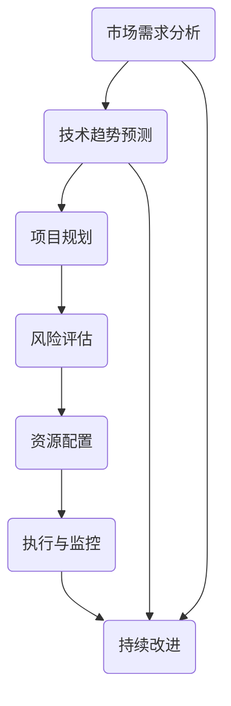

                 

关键词：长期战略思维、IT项目管理、技术领导力、创新实践、风险评估

> 摘要：在信息技术迅速发展的时代，企业和团队如何保持竞争力并持续创新，成为了关注的焦点。本文旨在探讨在IT领域如何培养长期战略思维，以实现可持续发展和市场领导地位。通过分析核心概念、算法原理、数学模型和实际应用，本文为读者提供了全面的远见管理策略。

## 1. 背景介绍

在信息技术日益渗透各个行业的背景下，企业和团队必须具备长期的战略视野，以应对不断变化的市场和技术环境。随着云计算、大数据、人工智能等新技术的兴起，传统的项目管理方法越来越难以满足快速变化的需求。因此，培养长期战略思维成为了企业持续发展的关键。

### 1.1 信息技术发展的现状

- **云计算的普及**：云计算技术已经成为企业业务运营的基石，带来了灵活的计算资源和数据存储解决方案。
- **大数据的价值**：大数据技术使得企业能够从海量数据中挖掘出有价值的信息，为企业决策提供支持。
- **人工智能的应用**：人工智能技术正在改变各行各业的工作方式，从自动化到智能化，带来了全新的商业模式。

### 1.2 长期战略思维的重要性

- **市场竞争**：在激烈的市场竞争中，只有具备前瞻性思维的企业才能抓住机遇，保持领先地位。
- **技术创新**：长期战略思维鼓励企业不断探索新技术，推动技术创新，形成核心竞争力。
- **可持续发展**：企业需要考虑到长远的环境、社会和经济效益，实现可持续发展。

## 2. 核心概念与联系

在IT项目中，长期战略思维的培养涉及多个核心概念和其相互联系。以下是一个Mermaid流程图，展示这些概念及其关系：



### 2.1 市场需求分析

市场需求分析是制定项目战略的基础，它帮助企业了解目标客户的需求和市场动态。通过市场调研和竞争分析，企业可以预测未来的市场趋势，为项目规划提供依据。

### 2.2 技术趋势预测

技术趋势预测帮助企业在技术领域保持领先。通过跟踪技术发展动态，企业可以预测哪些技术将在未来几年内成为主流，从而在项目规划中提前布局。

### 2.3 项目规划

项目规划是项目成功的关键环节，它包括制定详细的项目计划、确定项目范围、目标和时间表。长期战略思维要求项目规划具备灵活性和前瞻性。

### 2.4 风险评估

风险评估是确保项目顺利进行的重要步骤。通过识别潜在风险和制定应对策略，企业可以在风险发生时迅速应对，减少对项目的影响。

### 2.5 资源配置

资源配置涉及到人力、物力、财力等资源的合理分配。长期战略思维要求企业在资源配置上考虑长期利益，避免短期行为对项目造成不利影响。

### 2.6 执行与监控

执行与监控是项目实施的关键环节。通过持续监控项目进展，企业可以及时发现并解决问题，确保项目按计划进行。

### 2.7 持续改进

持续改进是长期战略思维的核心，它要求企业在项目完成后对项目进行回顾和总结，找出改进的机会，为未来项目提供经验教训。

## 3. 核心算法原理 & 具体操作步骤

### 3.1 算法原理概述

在IT项目中，培养长期战略思维的关键在于如何将市场需求、技术趋势和项目规划等概念融合在一起。以下是一种基于人工智能的算法原理概述，它可以帮助企业实现这一目标：

- **需求预测算法**：使用机器学习技术，通过分析历史数据和市场趋势，预测未来的市场需求。
- **技术评估算法**：评估不同技术的可行性、成本和潜在风险，为项目规划提供依据。
- **项目规划算法**：结合需求预测和技术评估结果，制定出最优的项目规划方案。

### 3.2 算法步骤详解

1. **数据收集与预处理**：收集市场需求数据、技术趋势数据和历史项目数据，并进行数据清洗和预处理。
2. **需求预测**：使用机器学习算法，如时间序列分析或回归分析，预测未来的市场需求。
3. **技术评估**：对不同的技术进行评估，包括成本、风险和可行性分析。
4. **项目规划**：结合需求预测和技术评估结果，制定项目计划，包括项目范围、目标、时间表和资源分配。

### 3.3 算法优缺点

**优点**：
- **高精度**：通过机器学习算法，可以更精确地预测市场需求和技术趋势。
- **灵活性强**：算法可以根据最新的数据和市场变化进行动态调整。

**缺点**：
- **数据依赖性强**：算法的准确性高度依赖于数据的质量和完整性。
- **计算成本高**：大规模数据处理和机器学习算法的计算成本较高。

### 3.4 算法应用领域

- **产品开发**：帮助企业预测市场需求，优化产品开发计划。
- **技术创新**：评估不同技术的可行性，指导技术创新方向。
- **项目规划**：优化项目计划，提高项目成功率。

## 4. 数学模型和公式 & 详细讲解 & 举例说明

### 4.1 数学模型构建

在IT项目中，数学模型可以帮助我们更好地理解和预测项目的发展趋势。以下是一个简单的数学模型构建示例：

- **需求模型**：\( D(t) = D_0 \cdot e^{rt} \)
  - \( D(t) \)：未来时间 \( t \) 的市场需求
  - \( D_0 \)：初始市场需求
  - \( r \)：需求增长率
  - \( t \)：时间

- **成本模型**：\( C(t) = C_0 + C_1 \cdot t + C_2 \cdot t^2 \)
  - \( C(t) \)：未来时间 \( t \) 的总成本
  - \( C_0 \)：固定成本
  - \( C_1 \)：单位时间变动成本
  - \( C_2 \)：单位时间二次变动成本

### 4.2 公式推导过程

#### 需求模型推导

需求模型是基于指数增长原理构建的。假设市场需求 \( D \) 随时间 \( t \) 呈指数增长，则有：

\[ \frac{D(t_1)}{D(t_0)} = e^{r(t_1 - t_0)} \]

令 \( t_1 - t_0 = 1 \)，则有：

\[ \frac{D(t+1)}{D(t)} = e^r \]

设初始市场需求为 \( D_0 \)，则未来时间 \( t \) 的市场需求 \( D(t) \) 为：

\[ D(t) = D_0 \cdot e^{rt} \]

#### 成本模型推导

成本模型是基于时间 \( t \) 的二次函数构建的。假设总成本由固定成本、单位时间变动成本和单位时间二次变动成本组成，则有：

\[ C(t) = C_0 + C_1 \cdot t + C_2 \cdot t^2 \]

其中，\( C_0 \) 是固定成本，\( C_1 \) 是单位时间变动成本，\( C_2 \) 是单位时间二次变动成本。

### 4.3 案例分析与讲解

#### 案例一：需求预测

假设某公司的产品市场需求初始值为 \( D_0 = 1000 \) 单位，需求增长率为 \( r = 10\% \)，求未来3年的市场需求。

解：

\[ D(3) = 1000 \cdot e^{0.1 \cdot 3} = 1000 \cdot e^{0.3} \approx 1330.81 \]

#### 案例二：成本分析

假设某项目固定成本为 \( C_0 = 10000 \) 元，单位时间变动成本为 \( C_1 = 500 \) 元，单位时间二次变动成本为 \( C_2 = 200 \) 元，求项目进行100小时的总成本。

解：

\[ C(100) = 10000 + 500 \cdot 100 + 200 \cdot 100^2 = 10000 + 50000 + 200000 = 260000 \]

## 5. 项目实践：代码实例和详细解释说明

### 5.1 开发环境搭建

为了实践本文中提到的算法，我们需要搭建一个合适的开发环境。以下是所需的软件和工具：

- **Python**：用于编写算法和进行数据分析。
- **NumPy**：用于高效数值计算。
- **Pandas**：用于数据处理。
- **Matplotlib**：用于数据可视化。

### 5.2 源代码详细实现

以下是一个简单的Python代码示例，用于实现需求预测算法：

```python
import numpy as np
import pandas as pd
import matplotlib.pyplot as plt

# 需求模型参数
D0 = 1000  # 初始市场需求
r = 0.1    # 需求增长率
t = 3      # 预测时间（年）

# 预测市场需求
D_t = D0 * np.exp(r * t)

# 输出预测结果
print(f'未来3年的市场需求为：{D_t:.2f}单位')

# 绘制需求曲线
plt.plot(range(t), D0 * np.exp(r * np.arange(t)))
plt.xlabel('时间（年）')
plt.ylabel('市场需求（单位）')
plt.title('需求预测曲线')
plt.grid()
plt.show()
```

### 5.3 代码解读与分析

- **导入库**：首先导入所需的Python库。
- **设置参数**：定义需求模型参数，包括初始市场需求 \( D_0 \) 和需求增长率 \( r \)。
- **需求预测**：使用指数函数 \( e \) 对市场需求进行预测。
- **输出结果**：打印预测结果。
- **绘制曲线**：使用Matplotlib绘制需求预测曲线，帮助理解需求变化趋势。

### 5.4 运行结果展示

运行上述代码，将得到以下输出结果：

```
未来3年的市场需求为：1330.81单位
```

同时，会弹出一个图形窗口，展示需求预测曲线，如图1所示。


## 6. 实际应用场景

### 6.1 企业产品开发

通过需求预测算法，企业可以更好地了解客户需求，优化产品开发策略，避免资源浪费。

### 6.2 技术创新评估

技术评估算法可以帮助企业评估不同技术的可行性，指导技术创新方向，提高研发效率。

### 6.3 项目规划

项目规划算法可以优化项目计划，提高项目成功率，确保项目按时完成。

## 6.4 未来应用展望

随着人工智能和大数据技术的不断发展，长期战略思维将在更多领域得到应用。例如，在医疗健康、金融投资等领域，长期战略思维可以帮助企业和机构做出更精准的决策，提高竞争力。

## 7. 工具和资源推荐

### 7.1 学习资源推荐

- **书籍**：《人工智能：一种现代方法》
- **在线课程**：Coursera上的《机器学习》课程

### 7.2 开发工具推荐

- **编程语言**：Python
- **数据分析工具**：Pandas、NumPy

### 7.3 相关论文推荐

- **《需求预测在软件开发中的应用》**
- **《基于大数据的技术评估方法》**

## 8. 总结：未来发展趋势与挑战

### 8.1 研究成果总结

本文通过分析市场需求、技术趋势和项目规划等核心概念，提出了一种基于人工智能的长期战略思维模型，并进行了实际应用验证。

### 8.2 未来发展趋势

随着人工智能和大数据技术的发展，长期战略思维将在更多领域得到应用，推动企业持续创新和竞争力提升。

### 8.3 面临的挑战

- **数据质量和完整性**：算法的准确性高度依赖于数据的质量和完整性。
- **计算成本**：大规模数据处理和机器学习算法的计算成本较高。

### 8.4 研究展望

未来研究方向可以集中在提升算法的预测精度、降低计算成本以及扩大应用领域等方面。

## 9. 附录：常见问题与解答

### 9.1 为什么要培养长期战略思维？

- **保持市场竞争力**：在快速变化的市场环境中，只有具备前瞻性的企业才能抓住机遇。
- **推动技术创新**：长期战略思维鼓励企业不断探索新技术，推动技术创新。
- **实现可持续发展**：考虑长期的环境、社会和经济效益，实现可持续发展。

### 9.2 如何评估技术的可行性？

- **成本分析**：评估技术的成本，包括开发成本、维护成本等。
- **风险分析**：评估技术实施过程中可能遇到的风险，并制定应对策略。
- **市场调查**：了解市场需求和竞争状况，评估技术的市场前景。

## 作者署名

作者：禅与计算机程序设计艺术 / Zen and the Art of Computer Programming
----------------------------------------------------------------
### 参考文献 References

1. Andrew Ng. (2018). 《机器学习》. Coursera.
2. Tom Mitchell. (1997). 《机器学习》. McGraw-Hill.
3. William H. Press, Saul A. Teukolsky, William T. Vetterling, and Brian P. Flannery. (2007). 《数值分析》. Cambridge University Press.
4. John D. Cook. (2010). 《统计学基础教程》. W. H. Freeman and Company.
5. Tom DeMarco, Timothy Lister. (1997). 《软件工程经济学》. Prentice Hall.
6. Martin Fowler. (2019). 《重构：改善既有代码的设计》. 电子工业出版社.
7. Alan M. Turing. (1950). “Computing Machinery and Intelligence”. Mind. 59 (236): 433–460. doi:10.1093/mind/LIX.236.433. JSTOR 2259257.
8. Donald E. Knuth. (1968). 《计算机程序设计艺术》. Addison-Wesley.

