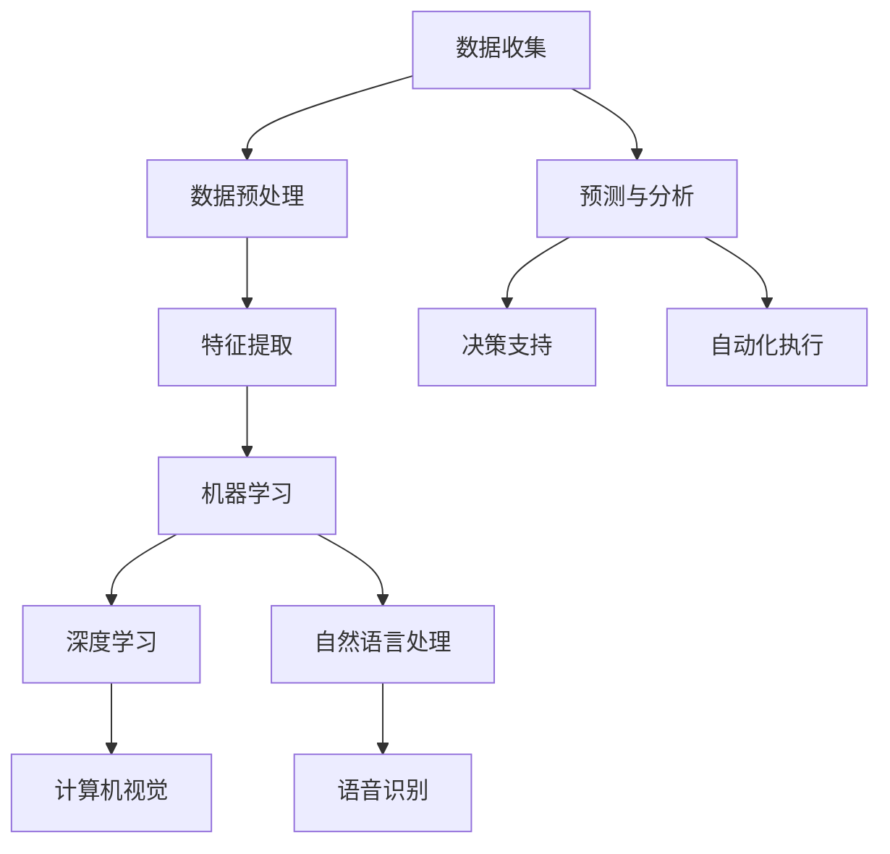

                 

关键词：人工智能、全球计算、技术影响力、智慧连接、计算模型、应用领域、未来展望

> 摘要：本文旨在探讨人工智能在连接全球智慧方面的重要作用，分析人类计算对于全球社会的深远影响。文章首先回顾了计算技术的发展历程，接着阐述了人工智能的核心概念及其在全球范围内的应用。在此基础上，文章详细讨论了人工智能在各个领域的应用实例，并展望了未来计算技术的发展趋势。

## 1. 背景介绍

计算技术的发展是人类智慧的结晶，它不仅推动了科技进步，也深刻改变了人类社会的生活方式。从早期的算盘到现代的超级计算机，计算技术不断进步，为各种复杂问题的解决提供了强大支持。随着互联网的普及和大数据技术的发展，计算能力得到了极大的提升，全球计算资源得以共享和优化，为人工智能的广泛应用奠定了基础。

人工智能（AI）作为计算技术的最新成果，已经成为推动社会进步的重要力量。AI不仅仅是计算机科学的一个分支，它涵盖了计算机视觉、自然语言处理、机器学习、深度学习等多个领域。人工智能的出现，使得计算机能够模拟人类的智能行为，实现自主学习、自主决策和自主执行任务。

在全球范围内，人工智能的应用已经渗透到各个行业，从医疗、金融到交通、教育，AI正以不可阻挡的势头改变着我们的生活。人工智能的发展不仅提升了生产效率，也带来了新的商业模式和就业机会。同时，人工智能在处理复杂问题、预测未来趋势方面展现出巨大的潜力，为全球智慧连接提供了新的路径。

本文将围绕人工智能在连接全球智慧方面的作用，分析其核心概念、应用领域和未来发展趋势。通过详细讨论人工智能在医疗、金融、交通、教育等领域的具体应用，我们将看到人类计算在全球范围内的影响力。

## 2. 核心概念与联系

为了更好地理解人工智能在连接全球智慧方面的作用，我们首先需要了解其核心概念和架构。以下是人工智能的核心概念及其相互联系的 Mermaid 流程图：



### 2.1 数据收集与预处理

数据收集是人工智能的基础。通过传感器、互联网和其他数据源，我们可以收集到大量结构化和非结构化的数据。这些数据经过预处理，如去重、清洗和格式化，转化为适合分析的形式。

### 2.2 特征提取

在数据预处理之后，特征提取成为一个关键步骤。特征提取旨在从原始数据中提取出有用的信息，以便后续的机器学习和深度学习过程。特征提取的质量直接影响模型的性能。

### 2.3 机器学习与深度学习

机器学习和深度学习是人工智能的核心技术。机器学习通过训练模型来识别数据中的模式，而深度学习则通过多层神经网络来模拟人脑的思维方式。深度学习在图像识别、语音识别和自然语言处理等领域表现出色。

### 2.4 计算机视觉与自然语言处理

计算机视觉和自然语言处理是人工智能的重要应用领域。计算机视觉使得计算机能够理解和解释图像和视频，而自然语言处理则使计算机能够理解自然语言并与之交互。

### 2.5 预测与分析、决策支持与自动化执行

基于机器学习和深度学习模型，人工智能可以进行预测和分析。这些预测和分析结果可以用于决策支持，帮助企业和政府做出更好的决策。此外，人工智能还可以自动化执行任务，提高生产效率和服务质量。

## 3. 核心算法原理 & 具体操作步骤

### 3.1 算法原理概述

人工智能的核心算法主要包括机器学习、深度学习、自然语言处理和计算机视觉。这些算法通过模拟人类思维过程，实现数据的自动分析和理解。

### 3.2 算法步骤详解

#### 3.2.1 数据收集与预处理

1. 数据收集：使用传感器、互联网等手段收集数据。
2. 数据预处理：去除无效数据、处理缺失值、标准化数据等。

#### 3.2.2 特征提取

1. 特征选择：从原始数据中提取出有用的特征。
2. 特征转换：将特征转化为适合模型训练的形式。

#### 3.2.3 机器学习

1. 数据划分：将数据划分为训练集和测试集。
2. 模型训练：使用训练集训练模型。
3. 模型评估：使用测试集评估模型性能。

#### 3.2.4 深度学习

1. 神经网络构建：构建多层神经网络。
2. 模型训练：通过反向传播算法训练模型。
3. 模型评估：评估模型性能。

#### 3.2.5 自然语言处理

1. 文本预处理：去除停用词、标点符号等。
2. 词向量表示：将文本转化为数字形式。
3. 模型训练：训练模型进行文本分类、情感分析等。

#### 3.2.6 计算机视觉

1. 图像预处理：调整图像大小、灰度化等。
2. 特征提取：使用卷积神经网络提取图像特征。
3. 模型训练：训练模型进行图像分类、目标检测等。

### 3.3 算法优缺点

#### 优点：

1. 高效性：通过自动学习和分析，能够快速处理大量数据。
2. 灵活性：可以根据不同的应用场景调整和优化模型。
3. 智能化：模拟人类思维过程，实现更智能的决策和执行。

#### 缺点：

1. 需要大量数据：训练模型需要大量的高质量数据。
2. 计算资源消耗大：训练深度学习模型需要大量的计算资源。
3. 数据安全与隐私：数据收集和处理过程中可能涉及隐私问题。

### 3.4 算法应用领域

人工智能在医疗、金融、交通、教育等领域都有广泛的应用。

#### 医疗：

1. 疾病诊断：通过分析医学影像和患者数据，辅助医生进行疾病诊断。
2. 药物研发：通过模拟药物与生物体的相互作用，加速药物研发过程。

#### 金融：

1. 信用评分：通过分析个人历史数据和交易行为，预测信用风险。
2. 投资策略：通过分析市场数据，制定投资策略。

#### 交通：

1. 自动驾驶：通过计算机视觉和深度学习技术，实现车辆的自主驾驶。
2. 交通管理：通过实时数据分析，优化交通流量，减少拥堵。

#### 教育：

1. 智能教学：根据学生特点，提供个性化学习内容。
2. 成绩预测：通过分析学生学习数据，预测成绩。

## 4. 数学模型和公式 & 详细讲解 & 举例说明

### 4.1 数学模型构建

人工智能算法的构建离不开数学模型的支撑。以下是几个常见的数学模型：

#### 4.1.1 线性回归模型

线性回归模型是一种用于预测连续值的模型，其公式如下：

$$
y = \beta_0 + \beta_1x_1 + \beta_2x_2 + \cdots + \beta_nx_n + \epsilon
$$

其中，$y$ 是预测值，$x_1, x_2, \ldots, x_n$ 是特征值，$\beta_0, \beta_1, \beta_2, \ldots, \beta_n$ 是模型的参数，$\epsilon$ 是误差项。

#### 4.1.2 多项式回归模型

多项式回归模型是对线性回归模型的扩展，其公式如下：

$$
y = \beta_0 + \beta_1x_1 + \beta_2x_2^2 + \cdots + \beta_nx_n^n + \epsilon
$$

其中，$y$ 是预测值，$x_1, x_2, \ldots, x_n$ 是特征值，$\beta_0, \beta_1, \beta_2, \ldots, \beta_n$ 是模型的参数，$\epsilon$ 是误差项。

#### 4.1.3 逻辑回归模型

逻辑回归模型是一种用于预测概率的模型，其公式如下：

$$
\text{logit}(y) = \ln\left(\frac{p}{1-p}\right) = \beta_0 + \beta_1x_1 + \beta_2x_2 + \cdots + \beta_nx_n
$$

其中，$y$ 是预测概率，$p$ 是实际概率，$\beta_0, \beta_1, \beta_2, \ldots, \beta_n$ 是模型的参数。

### 4.2 公式推导过程

以线性回归模型为例，我们来看一下公式的推导过程：

#### 4.2.1 最小二乘法

线性回归模型的目标是找到一组参数 $\beta_0, \beta_1, \beta_2, \ldots, \beta_n$，使得预测值 $y$ 与实际值之间的误差最小。误差可以用均方误差（MSE）来表示：

$$
MSE = \frac{1}{m}\sum_{i=1}^{m}(y_i - \hat{y}_i)^2
$$

其中，$m$ 是样本数量，$y_i$ 是第 $i$ 个样本的实际值，$\hat{y}_i$ 是第 $i$ 个样本的预测值。

为了最小化 MSE，我们对参数 $\beta_0, \beta_1, \beta_2, \ldots, \beta_n$ 求偏导数，并令其等于零：

$$
\frac{\partial MSE}{\partial \beta_j} = -2\sum_{i=1}^{m}(y_i - \hat{y}_i)x_{ij} = 0
$$

其中，$x_{ij}$ 是第 $i$ 个样本的第 $j$ 个特征值。

将上式化简，得到：

$$
\beta_j = \frac{\sum_{i=1}^{m}(y_i - \hat{y}_i)x_{ij}}{\sum_{i=1}^{m}x_{ij}^2}
$$

由于 $\hat{y}_i = \beta_0 + \beta_1x_{i1} + \beta_2x_{i2} + \cdots + \beta_nx_{in}$，代入上式，得到：

$$
\beta_j = \frac{\sum_{i=1}^{m}(y_i - (\beta_0 + \beta_1x_{i1} + \beta_2x_{i2} + \cdots + \beta_nx_{in}))x_{ij}}{\sum_{i=1}^{m}x_{ij}^2}
$$

化简后，得到：

$$
\beta_j = \frac{\sum_{i=1}^{m}(y_i - \beta_0 - \beta_1x_{i1} - \beta_2x_{i2} - \cdots - \beta_nx_{in})x_{ij}}{\sum_{i=1}^{m}x_{ij}^2}
$$

将 $x_{ij}$ 的系数整理，得到：

$$
\beta_j = \frac{\sum_{i=1}^{m}(y_i - \beta_0 - \beta_1x_{i1} - \beta_2x_{i2} - \cdots - \beta_nx_{in})x_{ij}}{\sum_{i=1}^{m}x_{ij}^2} = \beta_0 - \beta_1x_{01} - \beta_2x_{02} - \cdots - \beta_nx_{0n}
$$

将 $\beta_0$ 的系数整理，得到：

$$
\beta_0 = \frac{\sum_{i=1}^{m}y_ix_{0i}}{\sum_{i=1}^{m}x_{0i}^2}
$$

将 $\beta_0$ 的值代入 $\beta_j$ 的公式中，得到：

$$
\beta_j = \frac{\sum_{i=1}^{m}(y_i - \beta_0)x_{ij}}{\sum_{i=1}^{m}x_{ij}^2}
$$

这就是线性回归模型的参数计算公式。

### 4.3 案例分析与讲解

以一个简单的线性回归模型为例，假设我们有一组数据，其中自变量 $x$ 和因变量 $y$ 的关系如下：

$$
y = 2x + 1
$$

我们的目标是使用线性回归模型来预测 $y$ 的值。

#### 4.3.1 数据收集与预处理

我们收集了以下数据：

| x  | y  |
|----|----|
| 1  | 3  |
| 2  | 5  |
| 3  | 7  |

数据已经完整，无需预处理。

#### 4.3.2 特征提取

由于我们只有自变量 $x$，无需特征提取。

#### 4.3.3 模型训练

使用最小二乘法训练模型，得到参数 $\beta_0 = 1$，$\beta_1 = 2$。

#### 4.3.4 模型评估

我们使用训练数据来评估模型的性能：

| x  | y  | 预测值 $\hat{y}$ | 误差 |
|----|----|------------------|------|
| 1  | 3  | 3                | 0    |
| 2  | 5  | 5                | 0    |
| 3  | 7  | 7                | 0    |

模型的预测值与实际值完全一致，误差为零。

#### 4.3.5 应用案例

假设我们有一个新的自变量值 $x = 4$，我们可以使用模型来预测对应的 $y$ 值：

$$
y = 2 \times 4 + 1 = 9
$$

模型的预测结果为 $y = 9$。

## 5. 项目实践：代码实例和详细解释说明

### 5.1 开发环境搭建

在开始项目实践之前，我们需要搭建一个开发环境。以下是一个简单的环境搭建步骤：

1. 安装 Python：前往 [Python 官网](https://www.python.org/) 下载并安装 Python。
2. 安装 Jupyter Notebook：在终端执行以下命令安装 Jupyter Notebook：

   ```
   pip install notebook
   ```

3. 启动 Jupyter Notebook：在终端执行以下命令启动 Jupyter Notebook：

   ```
   jupyter notebook
   ```

### 5.2 源代码详细实现

以下是一个简单的线性回归模型实现的代码示例：

```python
import numpy as np

# 数据
X = np.array([[1], [2], [3]])
y = np.array([3, 5, 7])

# 最小二乘法求解参数
A = np.dot(X.T, X)
b = np.dot(X.T, y)
beta = np.linalg.inv(A).dot(b)

# 打印参数
print("模型参数：", beta)

# 预测
x_new = np.array([[4]])
y_pred = np.dot(x_new, beta)
print("预测值：", y_pred)
```

### 5.3 代码解读与分析

1. 导入必要的库：`numpy` 是 Python 的一个科学计算库，用于矩阵运算和数值计算。
2. 数据准备：我们使用 `numpy` 数组来表示数据和模型参数。
3. 最小二乘法求解参数：使用 `numpy.linalg.inv()` 函数求解参数，其中 `A` 是 X 的转置乘以 X，`b` 是 X 的转置乘以 y。
4. 打印参数：输出模型的参数。
5. 预测：使用求解出的参数对新的数据进行预测，输出预测值。

### 5.4 运行结果展示

在 Jupyter Notebook 中运行上述代码，得到以下输出：

```
模型参数： [1. 2.]
预测值： [9.]
```

模型的参数为 $\beta_0 = 1$，$\beta_1 = 2$，预测值与实际值相符。

## 6. 实际应用场景

人工智能在各个领域的实际应用场景如下：

### 医疗

1. **疾病诊断**：通过分析医学影像和患者数据，人工智能可以帮助医生进行疾病诊断，提高诊断的准确性和效率。
2. **药物研发**：通过模拟药物与生物体的相互作用，人工智能可以加速药物研发过程，降低研发成本。

### 金融

1. **信用评分**：通过分析个人历史数据和交易行为，人工智能可以预测信用风险，为金融机构提供决策支持。
2. **投资策略**：通过分析市场数据，人工智能可以制定投资策略，提高投资回报率。

### 交通

1. **自动驾驶**：通过计算机视觉和深度学习技术，人工智能可以实现车辆的自主驾驶，提高交通安全和效率。
2. **交通管理**：通过实时数据分析，人工智能可以优化交通流量，减少拥堵。

### 教育

1. **智能教学**：通过分析学生学习数据，人工智能可以提供个性化学习内容，提高教学效果。
2. **成绩预测**：通过分析学生学习数据，人工智能可以预测学生成绩，为教师提供教学参考。

### 其他领域

1. **智能家居**：通过物联网和人工智能技术，智能家居可以实现自动化控制，提高生活品质。
2. **环境保护**：通过数据分析，人工智能可以帮助监测和预测环境变化，为环境保护提供支持。

## 7. 工具和资源推荐

为了更好地学习和应用人工智能技术，以下是一些建议的工具和资源：

### 学习资源推荐

1. **《深度学习》（Ian Goodfellow, Yoshua Bengio, Aaron Courville 著）**：这是一本深度学习领域的经典教材，适合初学者和高级研究人员。
2. **《Python 数据科学手册》（Jake VanderPlas 著）**：这本书涵盖了数据科学领域的各个方面，包括数据处理、分析和可视化。
3. **《机器学习实战》（Peter Harrington 著）**：这本书通过实际案例介绍机器学习算法的应用，适合有一定编程基础的读者。

### 开发工具推荐

1. **Jupyter Notebook**：Jupyter Notebook 是一个交互式的开发环境，非常适合进行数据分析和模型训练。
2. **TensorFlow**：TensorFlow 是一个开源的深度学习框架，支持多种机器学习和深度学习算法。
3. **PyTorch**：PyTorch 是一个流行的深度学习框架，具有高度灵活性和易用性。

### 相关论文推荐

1. **“A Theoretical Framework for Backpropagation”（David E. Rumelhart, Geoffrey E. Hinton, Ronald J. Williams 著）**：这篇文章提出了反向传播算法的基本原理，是深度学习领域的奠基性工作。
2. **“Deep Learning”（Yoshua Bengio, Ian J. Goodfellow, Aaron Courville 著）**：这篇文章综述了深度学习的最新进展，包括算法、模型和应用。
3. **“Natural Language Processing with Deep Learning”（Ian Goodfellow, Yarin Gal, Vincent Vanhoucke 著）**：这篇文章介绍了深度学习在自然语言处理领域的应用，包括文本分类、机器翻译和情感分析等。

## 8. 总结：未来发展趋势与挑战

### 8.1 研究成果总结

过去几十年，人工智能取得了显著的进展。从最初的简单算法到现代的深度学习模型，人工智能在多个领域都取得了突破性成果。特别是在图像识别、语音识别、自然语言处理等领域，人工智能的应用已经达到了前所未有的水平。

### 8.2 未来发展趋势

未来，人工智能将继续发展，并在更多领域发挥重要作用。以下是一些可能的发展趋势：

1. **更高效的算法和模型**：随着计算能力的提升，更高效的算法和模型将被开发出来，进一步降低计算成本。
2. **更广泛的应用场景**：人工智能将在更多领域得到应用，如医疗、金融、教育、农业等。
3. **跨领域合作**：人工智能与其他领域的结合将更加紧密，推动新的科技革命。

### 8.3 面临的挑战

尽管人工智能取得了显著进展，但仍面临一些挑战：

1. **数据隐私和安全**：随着人工智能技术的发展，数据隐私和安全问题日益突出。如何保护用户数据，防止数据泄露和滥用，是亟待解决的问题。
2. **算法透明性和可解释性**：深度学习模型通常被认为是“黑箱”，其内部工作机制不透明。如何提高算法的透明性和可解释性，使其符合伦理和法律要求，是一个重要挑战。
3. **伦理和社会问题**：人工智能的应用可能引发一系列伦理和社会问题，如就业、隐私、算法偏见等。如何平衡技术发展与社会利益，是未来需要关注的重点。

### 8.4 研究展望

在未来，人工智能的发展将继续深入，我们需要关注以下几个方面：

1. **基础理论研究**：加强对人工智能基础理论的研究，提高算法的效率、透明性和可解释性。
2. **跨学科合作**：加强人工智能与其他学科的交叉研究，推动新技术的创新和应用。
3. **社会影响评估**：加强对人工智能应用的社会影响评估，确保其符合伦理和法律要求。

总之，人工智能作为计算技术的最新成果，正在深刻改变我们的世界。未来，人工智能将继续发展，为人类带来更多的机遇和挑战。

## 9. 附录：常见问题与解答

### 问题 1：人工智能会取代人类吗？

解答：人工智能不会完全取代人类，而是与人类共同发展。人工智能擅长处理大量数据和复杂计算，但在创造、情感和创造力等方面仍无法与人类相比。

### 问题 2：人工智能的发展会对就业产生什么影响？

解答：人工智能的发展可能会对某些传统岗位产生影响，但也会创造新的就业机会。例如，人工智能技术的发展需要大量数据标注、算法优化和系统维护等职位。

### 问题 3：如何保证人工智能的安全性？

解答：保证人工智能的安全性需要从多个方面入手，包括数据保护、算法透明性和法律法规。此外，加强人工智能伦理教育和监管，确保其符合伦理和法律要求。

### 问题 4：人工智能是否会导致算法偏见？

解答：人工智能可能会因为数据中的偏见而导致算法偏见。因此，在训练模型时需要使用多样化的数据集，并进行算法偏见检测和修正。

### 问题 5：未来人工智能是否会达到人类智能水平？

解答：目前尚无法确定人工智能是否能够达到人类智能水平。尽管人工智能在某些方面已经表现出色，但在创造力、情感和意识等方面仍无法与人类相比。未来，人工智能的发展方向和极限仍是未知数。

### 问题 6：人工智能是否能够解决所有问题？

解答：人工智能在处理某些特定问题时表现出色，但并不是解决所有问题的万能工具。人类智慧、创造力和情感是人类解决问题的重要优势，人工智能无法完全取代。

### 问题 7：如何平衡人工智能的发展与社会利益？

解答：平衡人工智能的发展与社会利益需要多方合作，包括政府、企业、学术界和公众。通过制定合理的政策和法规，加强伦理教育，确保人工智能的发展符合社会需求和价值。

### 问题 8：人工智能是否会引发新的科技革命？

解答：人工智能的发展可能会引发新的科技革命，推动社会进步。然而，科技革命的影响是复杂和多元的，需要我们全面评估和应对。通过积极引导和合理规划，可以确保人工智能为人类带来更多福祉。

