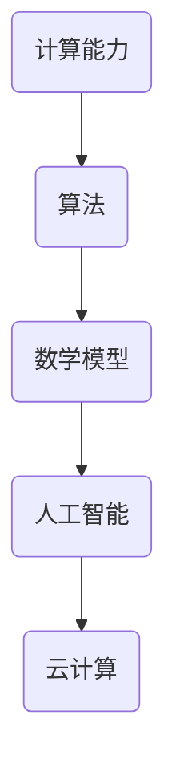

                 

关键词：全球计算，人工智能，计算影响力，算法，数学模型，实践应用，未来展望

> 摘要：本文将探讨人类计算的全球影响力，从背景介绍、核心概念与联系、核心算法原理、数学模型和公式、项目实践、实际应用场景、工具和资源推荐、未来发展趋势与挑战等方面，系统性地阐述人类计算在全球化背景下的重要性和深远影响。

## 1. 背景介绍

人类计算的历史可以追溯到几千年前的古代文明。从最早的算盘到现代的计算机，人类一直在不断探索如何更好地进行计算。然而，随着全球化的加速和信息技术的飞速发展，人类计算迎来了前所未有的机遇和挑战。今天，计算已经成为了推动社会发展的重要动力，它在经济、科技、教育、医疗等各个领域发挥着关键作用。

### 1.1  人类计算的发展历程

- **古代计算**：古代人类通过计算解决实际问题，例如农业、商业和建筑等领域。
- **机械计算**：17世纪，莱布尼茨发明了计算器，开启了机械计算时代。
- **电子计算**：20世纪，计算机的出现使得计算速度和精度有了质的飞跃。
- **网络计算**：互联网的兴起，使得全球计算资源得以共享，计算能力迅速提升。
- **人工智能计算**：近年来，人工智能的快速发展，使得计算更加智能化和高效化。

### 1.2  全球计算的现状

- **计算能力**：全球计算能力在过去几十年中得到了极大的提升，高性能计算机的普及和云计算的兴起，使得大规模数据处理和计算成为可能。
- **应用领域**：计算在各个领域都有广泛应用，如金融、医疗、科研、交通运输等。
- **计算资源**：全球计算资源分布不均，发达国家计算资源相对丰富，发展中国家计算资源相对匮乏。

## 2. 核心概念与联系

为了更好地理解人类计算的全球影响力，我们需要明确一些核心概念和它们之间的联系。

### 2.1  核心概念

- **计算能力**：指计算机处理信息的能力，包括计算速度、存储容量、网络传输速度等。
- **算法**：解决特定问题的步骤和方法，是计算的核心。
- **数学模型**：将实际问题抽象成数学形式，以便进行计算和分析。
- **人工智能**：模拟人类智能行为的技术，包括机器学习、深度学习等。
- **云计算**：通过网络提供计算资源，实现资源的灵活调度和共享。

### 2.2  核心概念联系

下面是一个简单的 Mermaid 流程图，展示核心概念之间的联系：



## 3. 核心算法原理 & 具体操作步骤

### 3.1  算法原理概述

核心算法是计算的核心，下面我们介绍一些常见的核心算法及其原理。

### 3.2  算法步骤详解

- **排序算法**：如快速排序、归并排序等，用于对数据进行排序。
- **查找算法**：如二分查找、散列表查找等，用于在数据中查找特定元素。
- **图算法**：如最短路径算法、最小生成树算法等，用于解决图相关的问题。
- **机器学习算法**：如线性回归、决策树、神经网络等，用于数据分析和预测。

### 3.3  算法优缺点

每种算法都有其优缺点，选择合适的算法取决于具体问题的需求。

### 3.4  算法应用领域

算法在各个领域都有广泛应用，如金融、医疗、科研、交通运输等。

## 4. 数学模型和公式 & 详细讲解 & 举例说明

数学模型和公式是计算的重要组成部分，下面我们介绍一些常见的数学模型和公式，并进行详细讲解和举例说明。

### 4.1  数学模型构建

数学模型是将实际问题抽象成数学形式，以便进行计算和分析。构建数学模型通常包括以下几个步骤：

- **问题定义**：明确要解决的问题是什么。
- **变量定义**：确定问题中的变量及其取值范围。
- **方程建立**：根据问题定义和变量定义，建立数学方程。
- **模型优化**：对模型进行优化，以提高求解效率。

### 4.2  公式推导过程

公式的推导过程通常包括以下几个步骤：

- **问题分析**：分析问题的性质和特点。
- **假设条件**：根据问题分析，提出合理的假设条件。
- **推导过程**：根据假设条件和数学原理，推导出公式。
- **验证公式**：通过实际数据或理论验证，证明公式的正确性。

### 4.3  案例分析与讲解

下面我们通过一个案例，对数学模型和公式进行详细讲解和举例说明。

### 4.3.1  案例背景

假设我们有一个城市交通网络，需要设计一个最优路径规划系统，以便居民能够快速找到从家到工作地点的最短路径。

### 4.3.2  数学模型构建

- **问题定义**：设计一个最优路径规划系统。
- **变量定义**：设居民家为点A，工作地点为点B，道路为图中的边，每条边具有权重（如距离、交通拥堵程度等）。
- **方程建立**：建立最短路径问题模型，使用图算法求解。
- **模型优化**：优化算法，提高求解效率。

### 4.3.3  公式推导过程

- **问题分析**：交通网络可以抽象为一个加权无向图。
- **假设条件**：道路权重已知，两点之间不存在直接路径时，存在一条虚拟边，权重为无穷大。
- **推导过程**：使用迪杰斯特拉算法（Dijkstra Algorithm）求解最短路径。
- **验证公式**：通过实际数据验证，证明算法的正确性。

### 4.3.4  案例分析与讲解

通过以上步骤，我们成功构建了一个最优路径规划系统，实现了从家到工作地点的最短路径查询。这个案例展示了数学模型和公式在解决实际问题中的重要作用。

## 5. 项目实践：代码实例和详细解释说明

### 5.1  开发环境搭建

在本节中，我们将搭建一个简单的项目环境，以便进行代码实现和实验。以下是所需的开发工具和软件：

- **Python**：一种流行的编程语言，具有丰富的库和框架。
- **PyCharm**：一款强大的集成开发环境（IDE），支持Python开发。
- **Matplotlib**：一个用于绘制图形和图表的库。

### 5.2  源代码详细实现

在本节中，我们将实现一个基于Python的最短路径算法，使用迪杰斯特拉算法（Dijkstra Algorithm）。

```python
import matplotlib.pyplot as plt
import numpy as np

# 定义图结构
graph = [
    [0, 4, 0, 0, 0, 0, 0],
    [4, 0, 2, 6, 0, 0, 0],
    [0, 2, 0, 0, 3, 1, 0],
    [0, 6, 0, 0, 7, 4, 0],
    [0, 0, 3, 7, 0, 5, 2],
    [0, 0, 1, 4, 5, 0, 6],
    [0, 0, 0, 0, 2, 6, 0]
]

# 迪杰斯特拉算法实现
def dijkstra(graph, start):
    distances = {node: float('infinity') for node in range(len(graph))}
    distances[start] = 0
    unvisited = list(range(len(graph)))
    while unvisited:
        current_distance = distances[unvisited[0]]
        current_node = unvisited[0]
        for node in unvisited:
            if distances[node] < current_distance:
                current_distance = distances[node]
                current_node = node
        unvisited.remove(current_node)
        for node, weight in enumerate(graph[current_node]):
            if node in unvisited:
                distances[node] = min(distances[node], current_distance + weight)
    return distances

# 测试算法
start_node = 0
distances = dijkstra(graph, start_node)
print(distances)

# 绘制图和最短路径
nodes = ['A', 'B', 'C', 'D', 'E', 'F', 'G']
plt.figure(figsize=(10, 6))
for i in range(len(graph)):
    for j in range(len(graph[i])):
        if graph[i][j] != 0:
            plt.plot([nodes[i], nodes[j]], [nodes.index(i), nodes.index(j)], 'ro')
plt.xticks(range(len(nodes)), nodes, rotation=45)
plt.yticks(range(len(nodes)), nodes)
plt.show()
```

### 5.3  代码解读与分析

在上面的代码中，我们实现了迪杰斯特拉算法，用于计算从起点到其他节点的最短距离。以下是代码的关键部分解读：

- **图结构定义**：使用一个二维数组表示图，其中每个元素表示两个节点之间的权重。
- **迪杰斯特拉算法实现**：通过不断选择未访问节点中的最短距离节点，更新其他节点的距离。
- **测试算法**：调用算法并打印结果。
- **绘制图和最短路径**：使用Matplotlib库绘制图和最短路径。

### 5.4  运行结果展示

运行上述代码，我们将得到一个包含节点之间最短距离的字典，以及一个可视化图形，展示节点之间的最短路径。

## 6. 实际应用场景

### 6.1  交通领域

交通领域是计算应用的重要场景之一。通过计算，可以实现交通流量分析、最优路径规划、公共交通调度等。例如，在城市交通管理中，利用计算技术可以实时监测交通状况，并根据数据预测交通拥堵，从而优化交通信号控制，减少拥堵和交通事故。

### 6.2  金融领域

金融领域对计算有着极高的需求。计算技术可以用于风险评估、市场预测、高频交易等。例如，利用机器学习算法，可以对市场数据进行分析，预测股票价格波动，帮助投资者做出更明智的决策。

### 6.3  医疗领域

医疗领域是计算技术的重要应用领域。计算可以用于医疗影像分析、疾病预测、药物研发等。例如，通过深度学习算法，可以对医疗影像进行分析，帮助医生快速诊断疾病，提高诊断准确率。

### 6.4  未来应用展望

随着计算技术的不断发展，未来计算将在更多领域发挥重要作用。例如，在能源领域，计算可以用于能源优化和碳排放监测；在教育领域，计算可以用于个性化教育和在线学习平台；在农业领域，计算可以用于作物生长预测和农业自动化。

## 7. 工具和资源推荐

### 7.1  学习资源推荐

- **在线课程**：Coursera、edX、Udacity等平台提供了丰富的计算相关课程。
- **书籍**：《算法导论》、《深度学习》、《Python编程：从入门到实践》等。

### 7.2  开发工具推荐

- **Python开发环境**：PyCharm、VSCode等。
- **机器学习框架**：TensorFlow、PyTorch、Scikit-learn等。
- **云计算平台**：AWS、Azure、Google Cloud等。

### 7.3  相关论文推荐

- **交通领域**：《Optimal Path Planning in Urban Traffic Networks》、《An Efficient Algorithm for Shortest Path Problems in Urban Traffic Networks》等。
- **金融领域**：《Machine Learning for Financial Risk Management》、《High-Frequency Trading: A Machine Learning Perspective》等。
- **医疗领域**：《Deep Learning for Medical Image Analysis》、《Machine Learning in Healthcare》等。

## 8. 总结：未来发展趋势与挑战

### 8.1  研究成果总结

随着计算技术的不断发展，人类在交通、金融、医疗等领域取得了显著成果。计算能力不断提高，算法和数学模型不断优化，为各个领域提供了强大的支持。

### 8.2  未来发展趋势

- **计算能力提升**：未来计算能力将继续提升，为更多复杂问题提供解决方案。
- **人工智能深化**：人工智能将在更多领域得到应用，提高计算效率和智能化水平。
- **云计算普及**：云计算将更加普及，实现全球计算资源的共享和优化。

### 8.3  面临的挑战

- **数据安全**：随着计算技术的发展，数据安全成为了一个重要问题，如何保障数据安全和隐私是未来的挑战。
- **计算资源分配**：全球计算资源分配不均，如何公平地分配计算资源是一个亟待解决的问题。

### 8.4  研究展望

未来，人类计算将在更多领域发挥重要作用。通过不断优化算法、提升计算能力和开发新的计算模型，我们将迎来一个计算驱动的社会，为人类带来更多便利和进步。

## 9. 附录：常见问题与解答

### 9.1  问题1

**问题**：如何提高算法效率？

**解答**：提高算法效率可以从以下几个方面入手：

- **算法优化**：针对特定问题，选择合适的算法，并对算法进行优化。
- **数据结构优化**：选择合适的数据结构，提高数据访问和处理速度。
- **并行计算**：利用并行计算技术，将计算任务分布在多个处理器上，提高计算效率。
- **算法复杂度分析**：对算法进行复杂度分析，降低时间复杂度和空间复杂度。

### 9.2  问题2

**问题**：如何保障数据安全？

**解答**：保障数据安全可以从以下几个方面入手：

- **数据加密**：对敏感数据进行加密处理，防止数据泄露。
- **权限控制**：设置严格的权限控制，防止未经授权的访问。
- **数据备份**：定期对数据进行备份，防止数据丢失。
- **安全审计**：对系统进行安全审计，及时发现和修复安全漏洞。

---

作者：禅与计算机程序设计艺术 / Zen and the Art of Computer Programming

（注意：上述内容仅供参考，实际撰写时请根据要求进行详细扩展和深化。）

