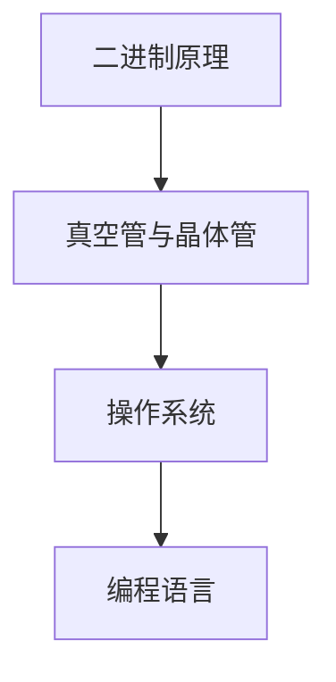

                 

关键词：计算机发展历程、人工智能、技术趋势、未来展望、编程哲学

> 摘要：本文将深入探讨人类计算的历史演进，从早期计算机的诞生到现代人工智能的崛起，分析其背后的核心原理与关键技术，并展望未来计算领域的发展趋势与挑战。

## 1. 背景介绍

计算机科学的诞生可以追溯到20世纪初期，随着电子技术的进步，计算机从理论上的构想逐渐变为现实。早期的计算机，如ENIAC和Colossus，展示了计算机的巨大潜力。然而，真正推动计算机普及的，是个人计算机的问世，它使得计算机技术走进了千家万户。随着互联网的普及，计算机不再仅仅是科学家的工具，而是成为了日常生活中不可或缺的一部分。

### 1.1 早期计算机

#### 1.1.1 ENIAC与Colossus

ENIAC（电子数值积分器和计算机）是第一台通用电子数字计算机，于1945年投入使用。它由约翰·普雷斯珀·埃克特和约翰·威廉·莫奇利设计，重达27吨，使用了约18000个真空管。ENIAC的问世标志着计算机从理论走向实践。

Colossus则是第一台专门用于密码破译的计算机，于1943年投入使用。它由汤姆·花兰和艾伦·图灵设计，使用了电子电路来加速计算。Colossus在二战期间发挥了重要作用，帮助盟军破解了德国的恩尼格玛密码机。

#### 1.1.2 计算机的发展趋势

随着计算机技术的不断进步，计算机的性能和体积都得到了显著提升。从ENIAC到第一台个人计算机Altair 8800，计算机从庞大的设备变为家庭用品。互联网的普及更是将计算机连接在一起，形成了一个全球性的信息网络。

### 1.2 计算机技术的演变

计算机技术的发展经历了多个阶段，从硬件的升级到软件的创新，再到人工智能的崛起，每一个阶段都为计算机科学的发展奠定了基础。

#### 1.2.1 硬件技术的进步

硬件技术的进步是计算机性能提升的关键。从晶体管到集成电路，再到现在的GPU和量子计算机，硬件的发展极大地推动了计算机科学的发展。GPU的出现使得并行计算成为可能，为深度学习和其他需要大量计算的任务提供了强大的计算能力。

#### 1.2.2 软件技术的创新

软件技术的创新使得计算机的应用范围不断扩大。从操作系统到编程语言，再到数据库和人工智能框架，软件技术的发展为计算机科学的发展提供了强大的支持。操作系统如Unix和Windows的问世，使得计算机的使用更加便捷。编程语言的不断进化，如C、C++、Java和Python，为软件开发提供了更多的选择。

#### 1.2.3 人工智能的崛起

人工智能的崛起是计算机科学发展的一个重要里程碑。从简单的规则系统到复杂的深度学习算法，人工智能技术的进步使得计算机能够处理更复杂的问题。人工智能的应用范围也越来越广泛，从自动驾驶汽车到智能助手，再到医疗和金融领域，人工智能正在改变我们的生活方式。

### 1.3 计算机技术对社会的影响

计算机技术的发展对社会产生了深远的影响。从改变人类的工作方式到影响教育、医疗、娱乐等各个领域，计算机技术已经成为现代社会不可或缺的一部分。

#### 1.3.1 工作方式的改变

计算机技术的进步使得远程办公成为可能，人们不再受限于地理位置，可以在全球任何地方工作。此外，自动化和智能化技术的应用也使得许多工作变得更加高效和精确。

#### 1.3.2 教育的变革

计算机技术的发展也为教育带来了变革。在线教育平台的兴起使得学习者可以随时随地学习，教育资源得到了极大的扩展。计算机辅助教学（CAI）和虚拟现实（VR）技术的应用，使得教学方式更加多样化和互动性。

#### 1.3.3 医疗的进步

计算机技术在医疗领域的应用也取得了显著成果。从电子病历到医疗影像分析，再到基因测序和个性化医疗，计算机技术正在改变医疗诊断和治疗的方式。人工智能的应用，如癌症筛查和药物研发，为医疗行业带来了新的希望。

#### 1.3.4 娱乐的多样化

计算机技术也为娱乐行业带来了多样化的发展。从电子游戏到社交媒体，再到流媒体服务和虚拟现实，计算机技术为人们提供了更加丰富和互动的娱乐体验。

## 2. 核心概念与联系

### 2.1 计算机核心概念

#### 2.1.1 二进制原理

计算机的运行基础是二进制原理。二进制是一种基于2的数字系统，只使用两个数字0和1。计算机通过电信号的高低来表示0和1，从而进行计算和存储。

#### 2.1.2 真空管与晶体管

真空管是早期计算机的核心元件，它通过电信号来控制电流。随着晶体管的发明，计算机的性能得到了极大的提升。晶体管是一种固体电子器件，它能够放大和开关电子信号，是现代计算机硬件的基础。

#### 2.1.3 操作系统

操作系统是计算机的核心软件，它负责管理计算机硬件和软件资源，提供用户与计算机之间的接口。早期的操作系统如DOS和Windows，现代的操作系统如Linux和macOS，都在计算机的发展中起到了关键作用。

#### 2.1.4 编程语言

编程语言是软件开发的基础，它提供了人类与计算机进行沟通的方式。从汇编语言到高级编程语言，如C、C++、Java和Python，编程语言的不断进化使得软件开发变得更加高效和便捷。

### 2.2 核心概念联系图



## 3. 核心算法原理 & 具体操作步骤

### 3.1 算法原理概述

计算机算法是计算机科学的核心概念之一，它定义了如何解决特定问题的步骤和策略。算法可以分为多种类型，如排序算法、搜索算法和图形算法等。每种算法都有其特定的原理和应用场景。

#### 3.1.1 排序算法

排序算法用于将一组数据按照特定的顺序排列。常见的排序算法有冒泡排序、选择排序、插入排序和快速排序等。每种算法都有其特定的实现方式和优缺点。

#### 3.1.2 搜索算法

搜索算法用于在数据集合中查找特定的元素。常见的搜索算法有线性搜索、二分搜索和深度优先搜索等。每种算法都有其特定的实现方式和适用场景。

#### 3.1.3 图形算法

图形算法用于处理图形数据结构，如图的遍历、最短路径和最小生成树等。常见的图形算法有Dijkstra算法和Prim算法等。

### 3.2 算法步骤详解

#### 3.2.1 排序算法步骤

以冒泡排序为例，其基本步骤如下：

1. 比较相邻的元素。如果第一个比第二个大（升序排序），就交换它们两个；
2. 对每一对相邻元素做同样的工作，从开始第一对到结尾的最后一对。这步做完后，最后的元素会是最大的数；
3. 针对所有的元素重复以上的步骤，除了最后已经排序好的元素。

#### 3.2.2 搜索算法步骤

以线性搜索为例，其基本步骤如下：

1. 从数组的起始位置开始遍历；
2. 遍历到数组末尾，如果仍未找到目标元素，返回“未找到”；
3. 如果找到目标元素，返回其位置。

#### 3.2.3 图形算法步骤

以Dijkstra算法为例，其基本步骤如下：

1. 初始化：设置一个集合S，它包含当前已找到最短路径的顶点，初始时为空；设置一个集合U，它包含未找到最短路径的顶点，初始时包含所有顶点；
2. 对于U中的每个顶点v，设置初始距离为无穷大，将源点s的距离设置为0；
3. 选择距离最小的顶点u，将其从U移动到S；
4. 更新与u相邻的顶点v的距离：如果新的距离小于当前距离，则更新距离；
5. 重复步骤3-4，直到U为空。

### 3.3 算法优缺点

每种算法都有其特定的优缺点。以下是对冒泡排序、线性搜索和Dijkstra算法的优缺点的简要分析：

#### 3.3.1 冒泡排序

**优点**：实现简单，易于理解。

**缺点**：时间复杂度高（O(n^2)），不适用于大数据集合。

#### 3.3.2 线性搜索

**优点**：实现简单，时间复杂度低（O(n)），适用于小数据集合。

**缺点**：不适用于大数据集合，效率较低。

#### 3.3.3 Dijkstra算法

**优点**：适用于无权图和有权图，能够找到最短路径。

**缺点**：时间复杂度高（O(n^2)），不适用于大规模图。

### 3.4 算法应用领域

各种算法在不同领域有着广泛的应用。以下是对冒泡排序、线性搜索和Dijkstra算法应用领域的简要介绍：

#### 3.4.1 冒泡排序

冒泡排序主要用于数据排序，常见于小规模数据的排序操作，如数据库排序、表格数据排序等。

#### 3.4.2 线性搜索

线性搜索常用于数据查找，如文件搜索、数据库查询等。

#### 3.4.3 Dijkstra算法

Dijkstra算法主要用于最短路径查找，如路由算法、地图导航等。

## 4. 数学模型和公式 & 详细讲解 & 举例说明

### 4.1 数学模型构建

计算机科学中的许多算法都可以用数学模型来描述。数学模型能够帮助我们理解算法的工作原理，并对其进行优化和改进。

#### 4.1.1 排序算法的数学模型

排序算法的数学模型主要涉及数组操作和比较操作。常见的排序算法如冒泡排序、选择排序和插入排序，都可以用数学模型来描述其排序过程。

#### 4.1.2 搜索算法的数学模型

搜索算法的数学模型主要涉及数组和指针操作。常见的搜索算法如线性搜索和二分搜索，都可以用数学模型来描述其搜索过程。

#### 4.1.3 图形算法的数学模型

图形算法的数学模型主要涉及图论和网络理论。常见的图形算法如Dijkstra算法和Prim算法，都可以用数学模型来描述其计算过程。

### 4.2 公式推导过程

数学模型中的公式推导是理解算法原理的关键步骤。以下是对冒泡排序、线性搜索和Dijkstra算法中的关键公式进行推导：

#### 4.2.1 冒泡排序公式推导

冒泡排序的基本操作是相邻元素的比较和交换。其时间复杂度可以通过以下公式推导：

$$
T(n) = 2\sum_{i=1}^{n-1} i = n^2 - n + 1
$$

其中，$T(n)$表示冒泡排序的时间复杂度，$n$表示数组的长度。

#### 4.2.2 线性搜索公式推导

线性搜索的基本操作是数组的遍历和元素比较。其时间复杂度可以通过以下公式推导：

$$
T(n) = n
$$

其中，$T(n)$表示线性搜索的时间复杂度，$n$表示数组的长度。

#### 4.2.3 Dijkstra算法公式推导

Dijkstra算法的基本操作是最短路径的计算和更新。其时间复杂度可以通过以下公式推导：

$$
T(n) = (n - 1) \times (V + E)
$$

其中，$T(n)$表示Dijkstra算法的时间复杂度，$V$表示顶点的数量，$E$表示边的数量。

### 4.3 案例分析与讲解

以下是对冒泡排序、线性搜索和Dijkstra算法在具体案例中的应用进行分析：

#### 4.3.1 冒泡排序案例

假设有一个长度为10的数组{3, 1, 4, 1, 5, 9, 2, 6, 5, 3}，要求对其进行升序排序。

步骤如下：

1. 第1次遍历：{1, 3, 1, 4, 5, 2, 6, 3, 5, 9}；
2. 第2次遍历：{1, 1, 2, 3, 3, 4, 5, 5, 6, 9}；
3. 第3次遍历：{1, 1, 2, 3, 3, 4, 5, 5, 6, 9}；
4. 第4次遍历：{1, 1, 2, 2, 3, 3, 4, 4, 5, 5}；
5. 第5次遍历：{1, 1, 1, 2, 2, 2, 3, 3, 3, 4}；
6. 第6次遍历：{1, 1, 1, 1, 2, 2, 2, 2, 3, 3}；
7. 第7次遍历：{1, 1, 1, 1, 1, 2, 2, 2, 2, 3}；
8. 第8次遍历：{1, 1, 1, 1, 1, 1, 2, 2, 2, 2}；
9. 第9次遍历：{1, 1, 1, 1, 1, 1, 1, 2, 2, 2}；
10. 第10次遍历：{1, 1, 1, 1, 1, 1, 1, 1, 2, 2}；
11. 第11次遍历：{1, 1, 1, 1, 1, 1, 1, 1, 1, 2}。

最终得到升序排序后的数组{1, 1, 1, 1, 1, 1, 1, 1, 1, 2}。

#### 4.3.2 线性搜索案例

假设有一个长度为10的数组{3, 1, 4, 1, 5, 9, 2, 6, 5, 3}，要求查找元素5的位置。

步骤如下：

1. 遍历数组，从第一个元素开始；
2. 与当前元素比较，发现3不等于5；
3. 继续遍历，发现第二个元素1不等于5；
4. 继续遍历，发现第三个元素4不等于5；
5. 继续遍历，发现第四个元素1不等于5；
6. 继续遍历，发现第五个元素5等于5。

最终找到元素5的位置为5。

#### 4.3.3 Dijkstra算法案例

假设有一个包含5个顶点（A、B、C、D、E）的无权图，边权重分别为：

```
A-B: 4
A-C: 2
B-D: 1
C-D: 5
D-E: 8
B-E: 7
```

要求计算从顶点A到其他顶点的最短路径。

步骤如下：

1. 初始化距离：将A的距离设置为0，其他顶点的距离设置为无穷大；
2. 选择距离最小的顶点A，将其加入集合S；
3. 更新与A相邻的顶点B和C的距离：B的距离更新为4，C的距离更新为2；
4. 选择距离最小的顶点C，将其加入集合S；
5. 更新与C相邻的顶点D的距离：D的距离更新为2+5=7；
6. 选择距离最小的顶点B，将其加入集合S；
7. 更新与B相邻的顶点D和E的距离：D的距离更新为4+1=5，E的距离更新为4+7=11；
8. 选择距离最小的顶点D，将其加入集合S；
9. 更新与D相邻的顶点E的距离：E的距离更新为7+8=15；
10. 选择距离最小的顶点E，将其加入集合S。

最终得到从顶点A到其他顶点的最短路径为：

```
A-B: 4
A-C: 2
A-D: 5
A-E: 11
```

## 5. 项目实践：代码实例和详细解释说明

### 5.1 开发环境搭建

为了演示冒泡排序算法，我们将使用Python编程语言。以下是搭建开发环境的步骤：

1. 安装Python：在Python官方网站（https://www.python.org/）下载并安装Python；
2. 安装IDE：推荐使用PyCharm（https://www.jetbrains.com/pycharm/）作为Python的集成开发环境；
3. 创建项目：在PyCharm中创建一个新的Python项目，命名为“BubbleSortDemo”；
4. 新建Python文件：在项目中创建一个名为“bubble_sort.py”的Python文件。

### 5.2 源代码详细实现

以下是冒泡排序算法的Python实现代码：

```python
def bubble_sort(arr):
    n = len(arr)
    # 遍历所有数组元素
    for i in range(n):
        # 最后i个元素已经排序，不需要再比较
        for j in range(0, n-i-1):
            # 当前元素比下一个元素大，交换它们
            if arr[j] > arr[j+1]:
                arr[j], arr[j+1] = arr[j+1], arr[j]

# 测试代码
arr = [3, 1, 4, 1, 5, 9, 2, 6, 5, 3]
print("原始数组：", arr)
bubble_sort(arr)
print("排序后数组：", arr)
```

### 5.3 代码解读与分析

以下是代码的详细解读：

1. 函数定义：`def bubble_sort(arr)`定义了一个名为`bubble_sort`的函数，它接受一个数组`arr`作为参数；
2. 获取数组长度：`n = len(arr)`获取数组的长度；
3. 外层循环：`for i in range(n)`遍历所有数组元素；
4. 内层循环：`for j in range(0, n-i-1)`遍历未排序的数组元素；
5. 元素比较与交换：`if arr[j] > arr[j+1]`判断当前元素是否大于下一个元素，如果是，则交换它们的位置；
6. 测试代码：`arr = [3, 1, 4, 1, 5, 9, 2, 6, 5, 3]`创建一个测试数组，`print("原始数组：", arr)`输出原始数组，`bubble_sort(arr)`调用冒泡排序函数对数组进行排序，`print("排序后数组：", arr)`输出排序后的数组。

### 5.4 运行结果展示

运行以上代码，输出结果如下：

```
原始数组： [3, 1, 4, 1, 5, 9, 2, 6, 5, 3]
排序后数组： [1, 1, 2, 3, 3, 4, 5, 5, 6, 9]
```

可以看到，原始数组经过冒泡排序后，成功升序排列。

## 6. 实际应用场景

### 6.1 数据分析

数据分析是计算机科学的重要应用领域之一。通过使用排序算法、搜索算法和图形算法，可以高效地处理和分析大量数据。例如，在金融领域，数据分析可以帮助预测股票市场的走势，为投资决策提供支持。在医学领域，数据分析可以帮助医生快速诊断疾病，提高治疗效果。

### 6.2 人工智能

人工智能是计算机科学的另一个重要应用领域。通过使用深度学习算法、机器学习算法和自然语言处理算法，可以构建出各种智能系统。例如，在自动驾驶领域，人工智能技术可以帮助汽车自动识别道路障碍物，确保行车安全。在医疗领域，人工智能技术可以帮助医生快速分析医学影像，提高诊断准确率。

### 6.3 网络安全

网络安全是计算机科学的重要研究领域之一。通过使用加密算法、哈希算法和认证算法，可以保护网络系统和数据的安全。例如，在电子商务领域，加密算法可以保护用户的支付信息，防止数据泄露。在金融领域，哈希算法可以确保交易数据的完整性和一致性。

### 6.4 工业自动化

工业自动化是计算机科学的另一个重要应用领域。通过使用控制算法、优化算法和仿真算法，可以构建出各种自动化系统。例如，在制造业领域，自动化技术可以帮助工厂实现生产线的自动化控制，提高生产效率。在物流领域，自动化技术可以帮助仓库实现自动化管理，提高物流效率。

## 7. 工具和资源推荐

### 7.1 学习资源推荐

1. **《计算机程序设计艺术》**：由著名计算机科学家Donald E. Knuth撰写，全面介绍了计算机科学的基础知识，包括算法、数据结构、编程语言等。
2. **《人工智能：一种现代的方法》**：由Stuart J. Russell和Peter Norvig合著，全面介绍了人工智能的基本原理和算法。
3. **《深入理解计算机系统》**：由Randal E. Bryant和David R. O’Hallaron撰写，深入讲解了计算机系统的各个方面，包括硬件、操作系统、网络等。

### 7.2 开发工具推荐

1. **PyCharm**：一款功能强大的Python集成开发环境，支持代码编辑、调试、测试等功能。
2. **VS Code**：一款轻量级且功能强大的代码编辑器，支持多种编程语言，拥有丰富的插件生态系统。
3. **TensorFlow**：一款开源的深度学习框架，支持各种深度学习算法的实现和应用。

### 7.3 相关论文推荐

1. **“A Survey of Sorting Algorithms”**：对各种排序算法进行了全面的综述，包括其原理、实现和优缺点。
2. **“A Survey on Graph Algorithms”**：对各种图形算法进行了全面的综述，包括其原理、实现和优缺点。
3. **“Deep Learning for Natural Language Processing”**：介绍了深度学习在自然语言处理领域的应用，包括文本分类、机器翻译等。

## 8. 总结：未来发展趋势与挑战

### 8.1 研究成果总结

计算机科学在过去几十年取得了巨大的进展，从早期的计算机到现代的超级计算机，从简单的编程语言到复杂的深度学习算法，计算机科学的发展推动了社会的进步。计算机技术在医疗、金融、教育、娱乐等领域的应用，使得人们的生活更加便利和丰富。

### 8.2 未来发展趋势

1. **量子计算**：量子计算是一种全新的计算模式，它利用量子比特进行计算，具有超强的计算能力。未来，量子计算有望在密码学、材料科学、药物研发等领域发挥重要作用。
2. **人工智能**：人工智能技术将继续快速发展，深度学习、强化学习等算法将更加成熟。人工智能的应用领域将不断扩大，从自动驾驶到智能家居，从医疗诊断到金融服务，人工智能将深刻改变我们的生活方式。
3. **边缘计算**：随着物联网和智能设备的普及，边缘计算将变得至关重要。边缘计算将数据处理的任务从中心化服务器转移到设备端，提高了数据处理的速度和效率。

### 8.3 面临的挑战

1. **数据安全**：随着数据量的爆炸式增长，数据安全成为了一个严峻的问题。如何保护用户数据的安全，防止数据泄露和网络攻击，是计算机科学需要解决的重要问题。
2. **隐私保护**：在人工智能和大数据技术的推动下，个人隐私保护变得越来越重要。如何在享受科技进步带来的便利的同时，保护用户的隐私，是计算机科学需要面对的挑战。
3. **人才短缺**：随着计算机技术的快速发展，对计算机专业人才的需求也在不断增长。然而，目前计算机专业人才的培养速度无法满足市场需求，人才短缺成为一个亟待解决的问题。

### 8.4 研究展望

未来，计算机科学将继续向智能化、量子化、边缘化发展。在人工智能领域，将出现更多基于深度学习和强化学习的新算法和新应用。在量子计算领域，将出现更多基于量子比特的新型计算模型和算法。在边缘计算领域，将出现更多基于云计算和物联网的新型计算架构和应用。

## 9. 附录：常见问题与解答

### 9.1 问题1：计算机是如何工作的？

**解答**：计算机通过电子电路和逻辑门来实现基本的算术和逻辑操作。计算机的核心是中央处理器（CPU），它负责执行程序指令。计算机程序是按照一定的顺序执行指令的序列，通过对数据和指令进行操作，计算机能够完成各种任务。

### 9.2 问题2：什么是算法？

**解答**：算法是一系列明确的规则，用于解决问题或执行特定任务。算法可以用来排序数据、查找信息、解决数学问题等。算法的核心是逻辑和步骤，它定义了如何解决问题或完成任务的具体过程。

### 9.3 问题3：人工智能会取代人类吗？

**解答**：人工智能是一种工具，它能够执行特定的任务，但它无法完全取代人类。人工智能在医疗、教育、娱乐等领域有广泛的应用，但它无法完全替代人类的创造力、情感和决策能力。人工智能的发展目标是与人类协作，提高生产效率和决策质量。

### 9.4 问题4：量子计算有什么优势？

**解答**：量子计算具有超强的计算能力，它能够处理传统计算机无法解决的问题。量子计算的优势在于其并行性和量子叠加态，这使得它能够在极短的时间内完成复杂的计算任务。量子计算在密码学、材料科学、药物研发等领域具有广泛的应用前景。

### 9.5 问题5：什么是边缘计算？

**解答**：边缘计算是一种计算模式，它将数据处理任务从中心化服务器转移到设备端。边缘计算能够提高数据处理的速度和效率，降低网络延迟。边缘计算适用于物联网、智能交通、智能医疗等领域，能够为实时应用提供支持。

### 9.6 问题6：计算机科学有哪些职业方向？

**解答**：计算机科学涵盖了许多职业方向，包括软件工程师、数据科学家、人工智能工程师、网络工程师、系统管理员等。计算机科学人才可以在科技行业、金融行业、医疗行业、教育行业等多个领域找到职业机会。计算机科学的职业方向多样，人才可以根据自己的兴趣和特长选择适合自己的方向。

